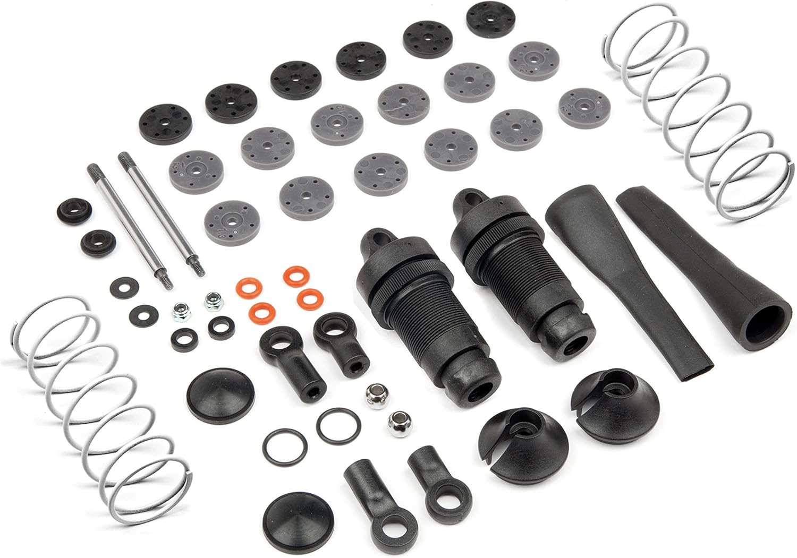
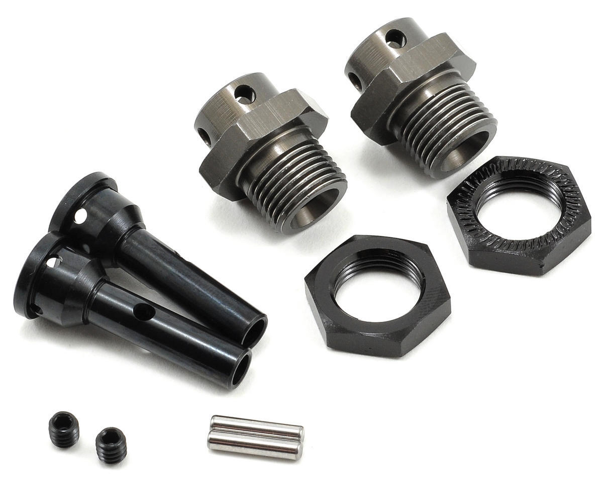
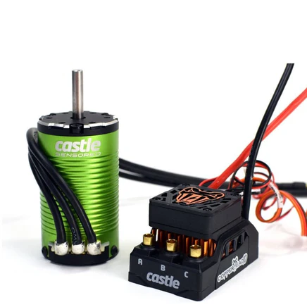
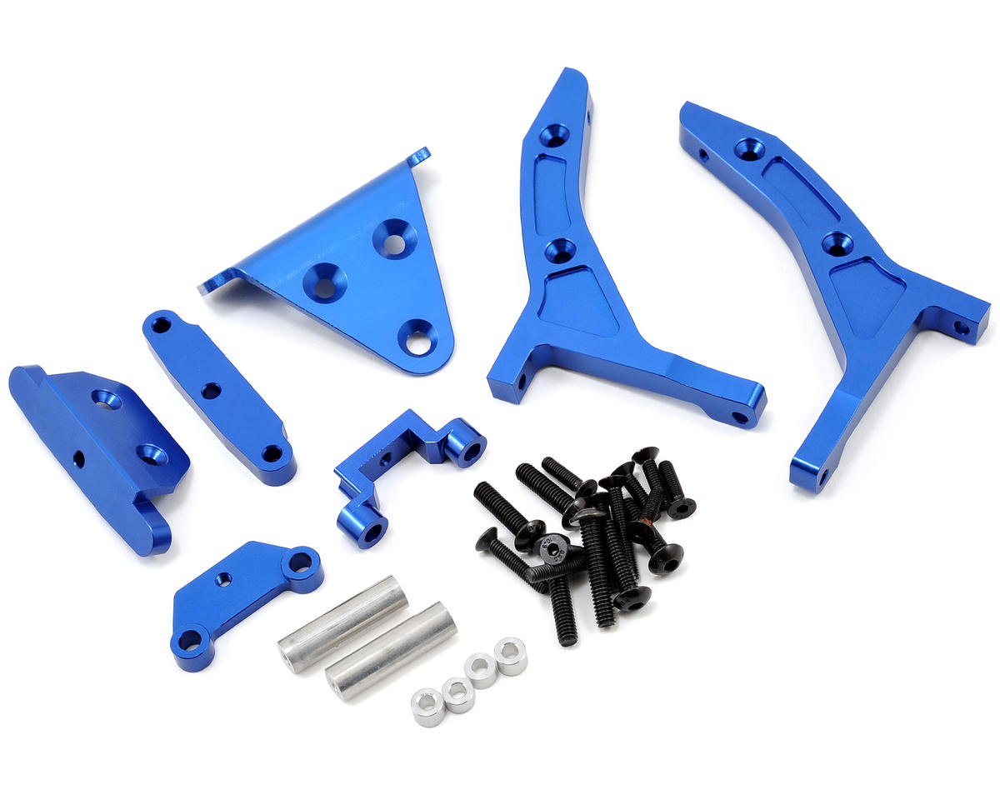
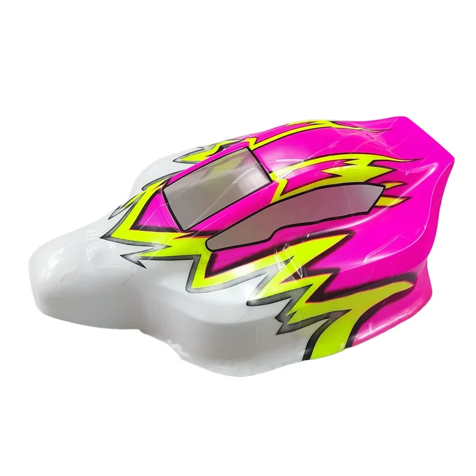
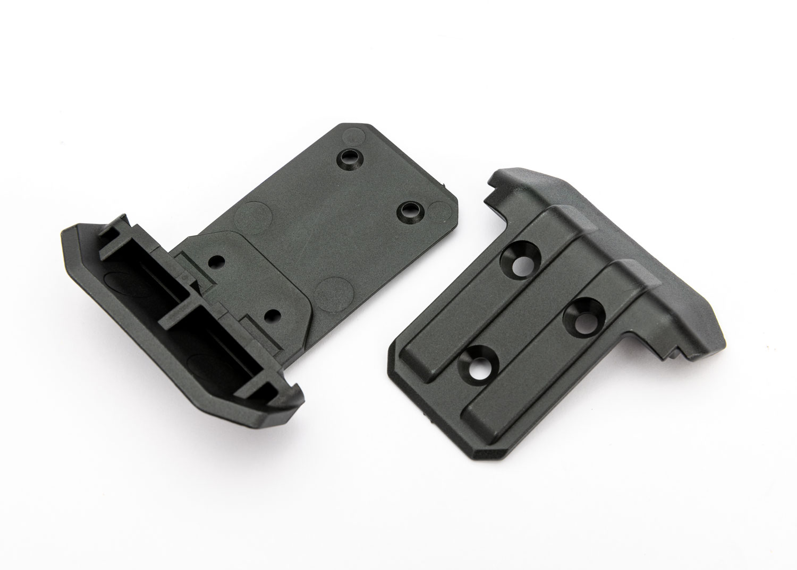

# CheapAzTuningRC — Wltoys K939

> Build log, parts, and setup notes for my K939 twin-motor build.

---

## Table of Contents

- [Car Overview](#car-overview)
- [Track & Setup Philosophy](#track--setup-philosophy)
- [Suspension](#suspension)
- [Drivetrain](#drivetrain)
- [Electronics](#electronics)
- [Steering](#steering)
- [Aero & Body](#aero--body)
- [Parts List](#parts-list)
- [3D Models](#3d-models)
- [TODO / Notes](#todo--notes)

---

## Car Overview

**Base Car:** Wltoys K939  
Twin motor, roughly equivalent to a Slash 4x4 HCG platform.

---

## Track & Setup Philosophy

**Track:** Meldrum Bar Park  
Dusty hardpack with heavy ruts and rough bumps. No swaybars — the track rewards suspension compliance over roll stiffness.

---

## Suspension

### Shocks
**HPI Racing Big Bore Sport Shock Set (97mm) Apache C1**  
Part #: `107365` — 2pcs

| Position | Spring | Notes |
|----------|--------|-------|
| Front | White (included with Apache C1) | Stock Apache C1 spring |
| Rear | Grey 52gf (Hot Bodies 67453) | 76mm, softer for bump compliance |

### Shock Oil

| Position | Weight |
|----------|--------|
| Front | 30wt |
| Rear | 30wt |

> Subject to change — still tuning.

### Swaybars
None — removed for Meldrum Bar Park conditions.

---

## Drivetrain

| Position | Part |
|----------|------|
| Front & Rear | Tekno RC M6 Driveshafts & Steering Block Set — TKR6851X / TKR6852X (2 kits) |
| Pinion | TBD |

---

## Electronics

| Component | Part | Qty |
|-----------|------|-----|
| ESC + Motor Combo | Castle Creations Copperhead 10 + 1412 3200kv Sensored Motor | 2 |

---

## Steering

| Component | Part |
|-----------|------|
| Bell Crank Set | Aluminum servo bell crank (AliExpress, ~$10) |
| Pinion Side | TBD |

---

## Aero & Body

| Component | Part | Notes |
|-----------|------|-------|
| Wing Mount | STRC SPTST6808B 1/8 E-Buggy Conversion Kit (wing mount only) | Received free |
| Rear Wing | White wing (AliExpress) | $3.70 |
| Wheels | Yellow (AliExpress) | $20.00 |
| Body | Pink & White (AliExpress) | $25.00 — body mount TBD |

---

## Parts List

| Part # | Description | Category | Cost | Source | Photo |
|--------|-------------|----------|------|--------|-------|
| — | Wltoys K939 1:10 Electric 4WD Short Truck | Base Car | $79.20 | Alibaba (Aug 2019) |  |
| HPI 107365 | Big Bore Sport Shock Set Apache C1 (97mm, 2pcs) | Suspension | — | — |  |
| HB 67453 | Hot Bodies Big Bore Shock Spring 76mm 52gf Gray (2) | Suspension | $11.75 | eBay — power_hobby |  |
| TKR6851X / TKR6852X | Tekno RC M6 Front & Rear Driveshafts & Steering Block Set (x2 kits) | Drivetrain | — | — |  |
| TKR1654-17 | Tekno RC 17mm M6 Hub Adapter Driveshaft Slash/Stampede (set of 2) | Drivetrain | $46.30 | eBay — qliquid_rc |  |
| — | Castle Creations Copperhead 10 ESC + 1412 3200kv Sensored Motor Combo (x2) | Electronics | — | Castle Creations |  |
| — | Aluminum Servo Bell Crank Set | Steering | $10.00 | AliExpress | — |
| SPTST6808B | STRC 1/8 E-Buggy Conversion Kit — wing mount only | Aero | $0.00 (free) | — |  |
| — | White Rear Wing | Aero | $3.70 | AliExpress | — |
| — | Yellow Wheels | Aero | $20.00 | AliExpress | — |
| — | Pink & White Body | Body | $25.00 | AliExpress |  |
| TRA9044 | Traxxas Front & Rear Skid Plates | Bumpers | $7.00 | Tammies |  |
| TBD | Pinion | Drivetrain | — | — | — |
| | **Total (known)** | | **$202.95** | | |

---

## 3D Models

> See [`3d-models/`](3d-models/) for all custom STL files.

| Model | Description | Status |
|-------|-------------|--------|
| Body Mount | Custom mount for AliExpress body | Pending |

---

## TODO / Notes

- [ ] Add pinion gear part number
- [ ] Add body mount 3D model
- [ ] Add photos for all remaining parts
