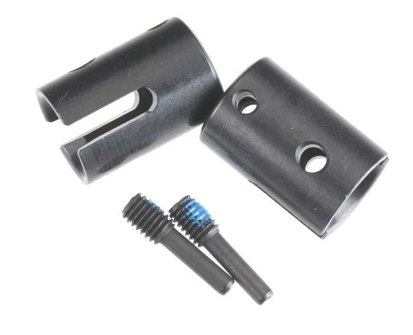
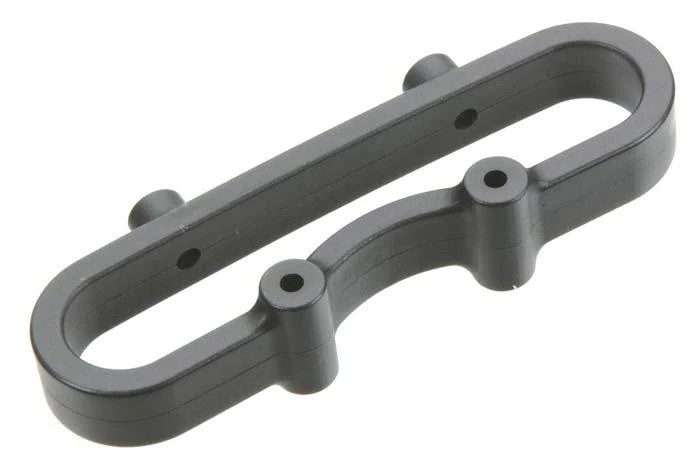
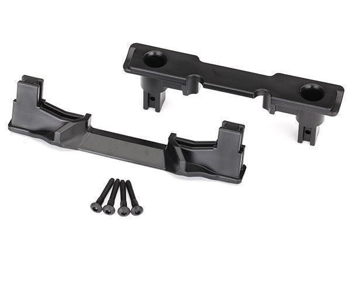
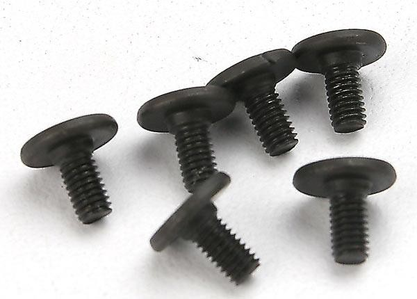

# Traxxas E-Revo 1.0

> Build log, parts, and setup notes. WIP — details to be added.

---

## Table of Contents

- [Car Overview](#car-overview)
- [Track & Setup Philosophy](#track--setup-philosophy)
- [Suspension](#suspension)
- [Drivetrain](#drivetrain)
- [Electronics](#electronics)
- [Steering](#steering)
- [Aero & Body](#aero--body)
- [Bumpers](#bumpers)
- [Parts List](#parts-list)
- [3D Models](#3d-models)
- [TODO / Notes](#todo--notes)

---

## Car Overview

**Base Car:** Traxxas E-Revo 1.0  

---

## Track & Setup Philosophy

Set up for **Meldrum Bar Park** — a **dirt race track** (the regular spot); the car also sees occasional **beach** running. Part choices favor **durability over light weight**, with **corrosion resistance** for the beach days: stainless steel rods, plastic rod ends, alloy rockers that don't crack, and heavy shock oil for consistent damping. Rinse and dry after beach runs to keep salt out of the bearings.

---

## Suspension

### Shocks

| Spec | Value |
|------|-------|
| Body | HPI Apache C1 97mm plastic big bore (#107365) — lighter; D8 metal is the runner-up |
| Piston | 4 × 1.2 |
| Springs | Acxess (Gold front / Tan rear) — stock big-bore springs too soft |

### Shock Oil

| Position | Weight |
|----------|--------|
| Front | 90wt |
| Rear | 100wt |

> Full shock writeup — body choice, piston/oil tuning, the bigger-bore/lighter-oil logic, Acxess springs, the 3D-printed shock-to-chassis mounts, and the M3 shim + RPM rod-end linkage strategy — in [`shock_analysis.md`](shock_analysis.md).

### Arms

- **Front: stock Traxxas arms** (kept). The RPM front A-arms flex too much, and that flex breaks the CVDs, so the stiffer stock arms stay up front.
- **Rear: RPM 80562 True Track Rear A-Arm Conversion** (black) — **in hand** ($32.95, PowerHobby). Deletes the rear toe links, locks rear toe at **1.5°/side (3° total)**, kills bump steer, ~32 g lighter; lower pillow ball becomes a 4 mm hinge pin (upper stays a ball for camber). Installs with the Traxxas 3932 flat-head screws (3×6 mm). Downside: gives up the adjustable rear wheelbase (the TRA5333R extended arms add +10/+19 mm) for a fixed, slightly shorter one.
- Full front-vs-rear reasoning in [`arm_analysis.md`](arm_analysis.md).

### Tie Rods / Push Rods

- **GPM stainless steel adjustable tie + push rods**, 8-pc set (#ER2160S-OC-BEBK, $37.29) — never bent one; fits E-Revo 1.0 & 2.0. Running **RPM long rod ends** (RPM80512, trimmed ~5 mm) on stock Traxxas balls. See [`rod_analysis.md`](rod_analysis.md).

### Rockers

- **Enron aluminum #5358**, Progressive 2 (90-T), front + rear (silver, in hand — paid **$14.31**) — chosen over OEM plastic (which fails 4–5 sets/yr). See [`rocker_analysis.md`](rocker_analysis.md). Weights: alloy 13.7 g front / 13.5 g rear vs plastic 9.3 g front / 7.0 g rear.

---

## Drivetrain

### Differentials

| Position | Diff | Oil |
|----------|------|-----|
| Front | Losi XXL LST | 30k wt |
| Center | Traxxas TRA5614 | 500k wt |
| Rear | Losi XXL LST | 10k wt |

### Spur Gear

- Traxxas TRA3958 — 58T

### Drive Cups

- **Traxxas 5153R Inner Drive Cups (2)** — **×2 packs (4 cups), in hand** ($16, PowerHobby). The diff-side cups the CVD driveshafts seat into; pair these with the AliExpress CVDs. Common wear/break point, good to have spares.

---

## Electronics

| Component | Part | Qty |
|-----------|------|-----|
| Motor | Castle Creations 1515 2200KV | 1 |
| ESC | TBD | 1 |
| Battery | 2× 3S LiHV 4200mAh in series → 6S | 2 |

**Battery notes:** Runs LiHV (4.35V/cell, 25.2V nominal / 26.1V hot off charger at 6S). Replace as matched pairs from the same order so series voltage stays balanced. Set LVC at **3.4V/cell** — Premo #2 was killed by over-discharge + no balancing. Charger must support LiHV mode.

---

## Steering

- **RPM 80582 Axle Carriers / Steering Blocks** (black) — heavy-duty front steering blocks + rear axle carriers; **in hand** ($23.75, PowerHobby). Stronger composite **plus oversized bearings** (6×15×5 outer / 12×21×5 inner vs stock 6×12×4 / 12×18×4, ~2× load rating). On the rear the lower mount runs a 4 mm pin (True Track) instead of a pillow ball. Full bearing comparison in [`hub_analysis.md`](hub_analysis.md).

---

## Aero & Body

**Wing:** Generic AliExpress 1/8 Buggy Tail Wing — $2.50–$4, fits perfectly. Nylon, lighter than OEM. Grid pattern on underside for marking drill holes; use a reamer for clean cuts. **Same wing as [FastAzJato4x4](../FastAzJato4x4/aero_analysis.md)** — see that doc for the full write-up.

**Body:** Currently on the **original E-Revo body** (OG style, preferred look). Planning the **Traxxas 8612 E-Revo 2.0 "Solar Flare"** pre-painted body — comes painted with decals plus clipless mounts, reinforcement, and roof skid, which works out cheaper than painting an aftermarket 1.0 body and adding the protective bits separately ($79.95, currently out of stock at PowerHobby). The 2.0 shell wears out, so the plan is to reuse its protective plastic on an OG-style body. Full reasoning in [`body_analysis.md`](body_analysis.md).

**Body posts:** **Traxxas 8614 clipless body posts, front & rear** (E-Revo VXL BL) — **in hand** ($5, PowerHobby). Bought to run clipless mounting on an OG-style body.

---

## Bumpers

- **Front:** **Traxxas 5335 nylon front bumper + mount** ($10 set) on the **RPM 80802 mount** ($5.39, in hand). The nylon bar is light, flexes instead of bending, looks good, and helps the truck cartwheel; the tougher RPM mount underneath means a tweaked mount is a ~$5 swap, not a whole $10 set. Replaced the junk stock blue metal bumper that bent on the first hit.
- **Rear:** **none** by design. A rear bumper protects nothing here and there's already a metal bulkhead in back.
- Full writeup in [`bumper_analysis.md`](bumper_analysis.md).

---

## Parts List

| Part # | Description | Category | Cost | Source | Photo |
|--------|-------------|----------|------|--------|-------|
| — | Traxxas E-Revo 1.0 | Base Car | — | — | — |
| — | Castle Creations 1515 2200KV Motor | Electronics | — | — | — |
| 5358 | Enron aluminum rockers, Progressive 2 (silver 4P) | Suspension | $14.31 | AliExpress (NEW ENRON) | [rocker_analysis.md](rocker_analysis.md) |
| RPM 80562 | True Track rear A-arm conversion kit (black) | Suspension | $32.95 | PowerHobby |  |
| RPM 80582 | Axle carriers / steering blocks (black) | Steering | $23.75 | PowerHobby |  |
| 5153R | Traxxas inner drive cups (2) — ×2 packs | Drivetrain | $16.00 | PowerHobby |  |
| RPM 80802 | Front bumper mount (black) | Bumpers | $5.39 | PowerHobby |  |
| 8614 | Traxxas clipless body posts (front & rear) | Body | $5.00 | PowerHobby |  |
| 3932 | Traxxas flat-head screws 3×6 mm (6) | Hardware | $2.50 | PowerHobby |  |

> **PowerHobby order** (7 items, subtotal **$85.59**, code **WELCOME10** −$10.00 → **$75.59**).

---

## 3D Models

> See [`3d-models/`](3d-models/) for all custom STL files.

| Model | Description | Status |
|-------|-------------|--------|
| Shock-to-chassis mounts (front + rear) | Adapters to fit 97 mm big-bore (D8 / Apache C1) shocks to the Revo Gen 1 — STL + editable STEP in [`3d-models/shock_mounts/`](3d-models/shock_mounts/), [Thingiverse 7090606](https://www.thingiverse.com/thing:7090606) | ✅ Available |

---

## TODO / Notes

- [ ] Fill in all build details
- [ ] Add parts and costs
- [ ] Add photos
- [x] Shock-to-chassis mount designed — STL + STEP on [Thingiverse](https://www.thingiverse.com/thing:7090606)
- [ ] Switch to **50–55 mm springs** (currently on 60–63 mm Acxess; running Gold front / Tan rear)
