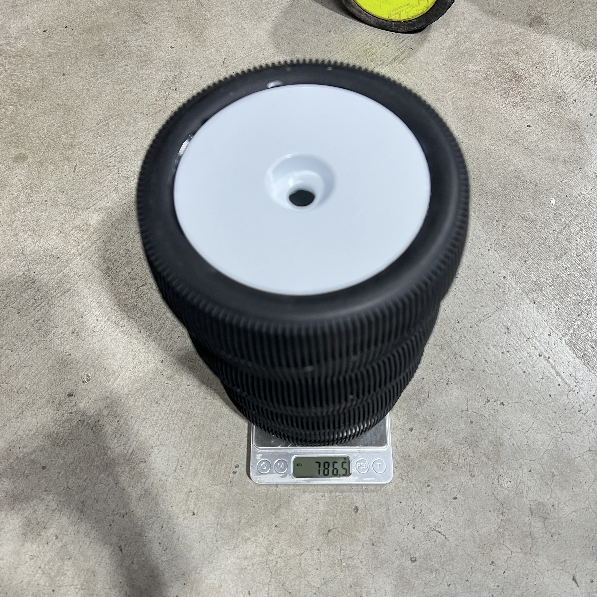

# Traxxas E-Revo 1.0

> Build log, parts, and setup notes. WIP — details to be added.

---

## Table of Contents

- [Car Overview](#car-overview)
- [Track & Setup Philosophy](#track--setup-philosophy)
- [Suspension](#suspension)
- [Drivetrain](#drivetrain)
- [Electronics](#electronics)
- [Steering](#steering)
- [Aero & Body](#aero--body)
- [Tires & Wheels](#tires--wheels)
- [Bumpers](#bumpers)
- [Parts List](#parts-list)
- [3D Models](#3d-models)
- [TODO / Notes](#todo--notes)

---

## Car Overview

**Base Car:** Traxxas E-Revo 1.0  

---

## Track & Setup Philosophy

Set up for **Meldrum Bar Park** — an **unkept, loose, dusty, low-grip dirt track** (not groomed; only the ramps and potholes get fixed now and then, and it can turn **grippy when wet**) where this E-Revo is **actively raced**, plus occasional **beach** running. Part choices favor **durability over light weight**, with **corrosion resistance** for the beach days: stainless steel rods, plastic rod ends, alloy rockers that don't crack, and heavy shock oil for consistent damping. Rinse and dry after beach runs to keep salt out of the bearings. **Tire choice for this low-grip surface is in [`tire_analysis.md`](tire_analysis.md).**

---

## Suspension

### Shocks

| Spec | Value |
|------|-------|
| Body | HPI Apache C1 97mm plastic big bore (#107365) — lighter; D8 metal is the runner-up |
| Piston | 4 × 1.2 |
| Springs | Acxess (Gold front / Tan rear) — stock big-bore springs too soft |

### Shock Oil

| Position | Weight |
|----------|--------|
| Front | **FT 4,000 cSt** |
| Rear | **FT 4,000 cSt** |

> **Update:** Now running **Associated Factory Team 4,000 cSt** front and rear. It's **silicone diff fluid, not shock oil** (shock oil stops around 100wt, so the heavy end only comes in diff grades). Three steps to get here: 90wt / 100wt bucked on landings once the shocks wore in, **2,000 cSt** fixed the bucking but still packed down far enough to dig the chassis in on jump landings, so it went to **4,000 cSt**, skipping the planned 3,000. Landings still need re-checking at 4,000, watching for it kicking back instead of absorbing.

> Full shock writeup — body choice, piston/oil tuning, the bigger-bore/lighter-oil logic, Acxess springs, the 3D-printed shock-to-chassis mounts, and the M3 shim + RPM rod-end linkage strategy — in [`shock_analysis.md`](shock_analysis.md).

### Arms

- **Front: stock Traxxas arms** (kept). The RPM front A-arms flex too much, and that flex breaks the CVDs, so the stiffer stock arms stay up front.
- **Rear: RPM 80562 True Track Rear A-Arm Conversion** (black) — **in hand** ($32.95, PowerHobby). Deletes the rear toe links, locks rear toe at **1.5°/side (3° total)**, kills bump steer, ~32 g lighter; lower pillow ball becomes a 4 mm hinge pin (upper stays a ball for camber). Downside: gives up the adjustable rear wheelbase (the TRA5333R extended arms add +10/+19 mm) for a fixed, slightly shorter one.
- Full front-vs-rear reasoning in [`arm_analysis.md`](arm_analysis.md).

### Tie Rods / Push Rods

- **GPM stainless steel adjustable tie + push rods**, 8-pc set (#ER2160S-OC-BEBK, $37.29) — never bent one; fits E-Revo 1.0 & 2.0. Running **RPM long rod ends** (RPM80512, trimmed ~5 mm) on stock Traxxas balls. See [`rod_analysis.md`](rod_analysis.md).

### Rockers

- **Enron aluminum #5358**, Progressive 2 (90-T), front + rear (silver, in hand — paid **$14.31**) — chosen over OEM plastic (which fails 4–5 sets/yr). See [`rocker_analysis.md`](rocker_analysis.md). Weights: alloy 13.7 g front / 13.5 g rear vs plastic 9.3 g front / 7.0 g rear.

---

## Drivetrain

### Differentials

| Position | Diff | Oil |
|----------|------|-----|
| Front | Losi XXL LST | 30k wt |
| Center | Traxxas TRA5614 | 500k wt |
| Rear | Losi XXL LST | 10k wt |

### Gearing (spur + pinion)

Moved to the motor doc. See [`esc_motor_analysis.md` → Gearing](esc_motor_analysis.md#gearing-spur--pinion) for the full spur/pinion options, current ratio (20T pinion + 58T spur), pinion-retention fix, and racing notes.

### Drive Cups

- **Traxxas 5153R Inner Drive Cups (2)** — **×2 packs (4 cups), in hand** ($16, PowerHobby). The diff-side cups the CVD driveshafts seat into; pair these with the AliExpress CVDs. Common wear/break point, good to have spares.

---

## Electronics

| Component | Part | Qty |
|-----------|------|-----|
| Motor | Castle Creations 1515 2200KV | 1 |
| ESC | Hobbywing EZRun MAX8 G2S (HWI38010607 combo w/ 4278SD 2250KV motor) — ✅ bought Jun 25 2026, $187. **195 g** (w/ wires + XT90) | 1 |
| Motor (combo, alt to 1515) | Hobbywing EZRUN-4278SD-2250KV-BLACK-G2R — **462 g**, 60,000 RPM max. P/N 30402141 | 1 |
| Battery | 2× 3S LiHV 4200mAh in series → 6S | 2 |

**ESC notes:** Going the **Hobbywing EZRun MAX8 GS2** (3–8S). **When ordering any Hobbywing MAX-series ESC, get the G2S (GS2), not the plain G2** — the G2S doesn't cut out at ramps / in extreme conditions. Comes as the HWI38010607 combo with a 4278SD 2250KV motor (alt to the Castle 1515). Full specs + Castle comparison in [`esc_motor_analysis.md`](esc_motor_analysis.md); price in [`Deals/escs.md`](../../Deals/escs.md).

**Battery notes:** Runs LiHV (4.35V/cell → **22.8V nominal / 26.1V hot off the charger at 6S**; a standard 6S LiPo tops out at 25.2V). Replace as matched pairs from the same order so series voltage stays balanced. Set LVC at **3.4V/cell**, and don't let packs sit — Premo #2 was lost to over-discharge, reached by **self-discharging in storage** rather than being run flat. Charger must support LiHV mode. Full pack comparison, requirements, and the SMC HV3 Flight upgrade candidate in [`battery_analysis.md`](battery_analysis.md).

---

## Steering

- **Front steering blocks: Enron metal** (chosen, source TBD) — the **RPM 80582 plastic blocks are retired**: even new, the pillow balls pull out every other crash. Enron metal won't crack and holds the balls; **reuse the same oversized bearings** (6×15×5 outer / 12×21×5 inner vs stock 6×12×4 / 12×18×4, ~2× load rating). Trade-off: heavier, no part number to reorder.
- **Rear axle carriers: RPM 80562 True Track** (in hand) — bundled in the True Track kit, same oversized bearings, **4 mm pin lower mount** (no pillow ball, so no pull-out). The Revo otherwise uses the same small bearings as the lighter Jato 4x4, which is why it ate bearings for years. Full comparison in [`hub_analysis.md`](hub_analysis.md).
- **Service / wear parts** — pivot-ball dust boots (Traxxas **5378X**), the skipped driveshaft-boot kits (5459 / 5129), bearings, and pushrod ends are consolidated in [`service_parts_analysis.md`](service_parts_analysis.md).

---

## Aero & Body

**Wing:** Generic AliExpress 1/8 Buggy Tail Wing — $2.50–$4, fits perfectly. Nylon, lighter than OEM. Grid pattern on underside for marking drill holes; use a reamer for clean cuts. **Same wing as [FastAzJato4x4](../FastAzJato4x4/aero_analysis.md)** — see that doc for the full write-up.

**Body:** Currently on the **original E-Revo body** (OG style, preferred look). Planning the **Traxxas 8612 E-Revo 2.0 "Solar Flare"** pre-painted body — comes painted with decals plus clipless mounts, reinforcement, and roof skid, which works out cheaper than painting an aftermarket 1.0 body and adding the protective bits separately ($79.95, currently out of stock at PowerHobby). The 2.0 shell wears out, so the plan is to reuse its protective plastic on an OG-style body. Full reasoning in [`body_analysis.md`](body_analysis.md).

**Body posts:** **Traxxas 8614 clipless body posts, front & rear** (E-Revo VXL BL) — **in hand** ($5, PowerHobby). Bought to run clipless mounting on an OG-style body.

---

## Tires & Wheels

- **Compound:** Meldrum Bar is **loose, dusty, low-grip** dirt, but super soft only lasts a few weekends under the heavy Revo, so leaning the **Yufung 1/8 truggy Soft (blue), ~$50/set** for tire life. Keep the **green (super soft), $52.06/set** as a grip special for the driest days. Both are pre-glued wheels with foam and undercut the **JetKo truggy treads (Block In / Lesnar, $27.99/pair tires-only)** — the premium alternative. JetKo truggy comes only in Block In or Lesnar (Ultra/Super/Medium Soft); the J-Zero/Desirer treads are buggy-only.
- **Yufung mimics JConcepts compounds:** blue = soft, green = super soft. Buggy tires skipped (the Revo runs the wider truggy size).
- **Hex / size:** 17 mm hex, **140 mm dia** (the size originally run, so a direct fit). Tires come pre-glued; check the bead before a race.
- **Weight (Yufung blue, 4 wheels):** **786.5 g total** — measured on a kitchen scale. Good baseline for unsprung mass calculations.
- Full compound key, track picks, JetKo treads, and Yufung options in [`tire_analysis.md`](tire_analysis.md).

 <em>Yufung 1/8 truggy blue (soft) — 4 wheels, 786.5 g total</em>

---

## Bumpers

- **Front:** **Traxxas 5335 nylon front bumper + mount** ($10 set) on the **RPM 80802 mount** ($5.39, in hand). The nylon bar is light, flexes instead of bending, looks good, and helps the truck cartwheel; the tougher RPM mount underneath means a tweaked mount is a ~$5 swap, not a whole $10 set. Replaced the junk stock blue metal bumper that bent on the first hit.
- **Rear:** **none** by design. A rear bumper protects nothing here and there's already a metal bulkhead in back.
- **Skid plates (front + rear):** **Traxxas 5337 Skid Plate Set, Revo** — plastic, includes both front and rear skid plates. Replaces the bent metal front skid plate I was running (see photo below). Plastic is a cheap wear item — no need for metal here. The set is inexpensive and easy to replace when it gets chewed up. Full writeup in [`skid_plate_analysis.md`](skid_plate_analysis.md).

 <em>Old bent metal front skid plate — replaced with NEW ENRON aluminum set</em>

 <em>NEW ENRON Aluminum Front & Rear Skid Plate #5337 (silver) — purchased $18.64 on May 10, 2026</em>

- Full writeup in [`bumper_analysis.md`](bumper_analysis.md).

---

## Parts List

| Part # | Description | Category | Cost | Source | Photo |
|--------|-------------|----------|------|--------|-------|
| — | Traxxas E-Revo 1.0 | Base Car | — | — | — |
| — | Castle Creations 1515 2200KV Motor | Electronics | — | — | — |
| 5358 | Enron aluminum rockers, Progressive 2 (silver 4P) | Suspension | $14.31 | AliExpress (NEW ENRON) | [rocker_analysis.md](rocker_analysis.md) |
| RPM 80562 | True Track rear A-arm conversion kit (black) | Suspension | $32.95 | PowerHobby |  |
| ~~RPM 80582~~ | Axle carriers / steering blocks (black) — **retired, pillow balls pull out** | Steering | $23.75 | PowerHobby |  |
| Enron metal | Front axle carriers / steering blocks (metal) — reuses oversized bearings | Steering | TBD | AliExpress (bought 7/3) |  |
| 5153R | Traxxas inner drive cups (2) — ×2 packs | Drivetrain | $16.00 | PowerHobby |  |
| RPM 80802 | Front bumper mount (black) | Bumpers | $5.39 | PowerHobby |  |
| 8614 | Traxxas clipless body posts (front & rear) | Body | $5.00 | PowerHobby |  |
| 3932 | Traxxas flat-head screws 3×6 mm (6) — servo mount | Electronics | $2.50 | PowerHobby |  |
| 5337 | Traxxas Skid Plate Set, Revo (front + rear) | Bumpers | ~$10 | LHS / AMain |  |

> **PowerHobby order** (7 items, subtotal **$85.59**, code **WELCOME10** −$10.00 → **$75.59**).

---

## 3D Models

> See [`3d-models/`](3d-models/) for all custom STL files.

| Model | Description | Status |
|-------|-------------|--------|
| Shock-to-chassis mounts (front + rear) | Adapters to fit 97 mm big-bore (D8 / Apache C1) shocks to the Revo Gen 1 — STL + editable STEP in [`3d-models/shock_mounts/`](3d-models/shock_mounts/), [Thingiverse 7090606](https://www.thingiverse.com/thing:7090606) | ✅ Available |

---

## TODO / Notes

- [ ] Fill in all build details
- [ ] Add parts and costs
- [ ] Add photos
- [x] Shock-to-chassis mount designed — STL + STEP on [Thingiverse](https://www.thingiverse.com/thing:7090606)
- [ ] Switch to **50–55 mm springs** (currently on 60–63 mm Acxess; running Gold front / Tan rear)
