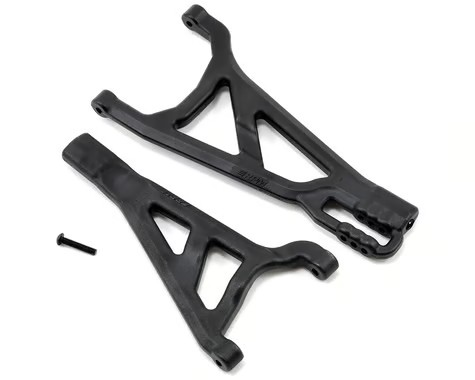
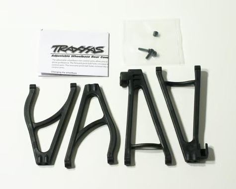
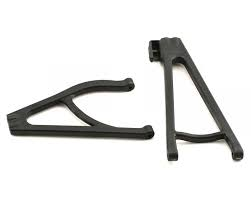

# Suspension Arm Selection — E-Revo 1.0

> **Front: keep the stock Traxxas arms. Rear: RPM 80562 True Track conversion.** Two opposite calls, one reason each. The RPM front A-arms **flex too much**, and that flex lets the front wheels deflect under power until it **snaps the CVDs** I run, so the stiffer stock front arms stay. At the rear, the **RPM True Track** kit deletes the rear toe links entirely, locking in a fixed **1.5° per side (3° total) toe-in** and killing rear bump steer. That removes a wandering wear/adjustment point and gives a rear end that tracks straight on rough dirt. True Track in hand, **$32.95** (PowerHobby).

 <em>RPM 80562 True Track rear A-arm conversion (black) — deletes the rear toe links, locks 3° toe-in</em>

---

## Table of Contents

- [Key Requirements](#key-requirements)
- [Front Arms](#front-arms) — why stock beats RPM up front (CVD survival)
- [Rear Arms](#rear-arms) — True Track conversion: fixed toe, no bump steer, less upkeep
- [Notes](#notes)

---

## Key Requirements

| Requirement | Type | Why |
|---|---|---|
| **Front arms stiff enough not to flex into the CVDs** | Must | RPM front arms flex under power and that deflection breaks the CVDs I run |
| **Hold rear toe without wandering** | Must | Stock rear toe links shift and need re-checking; want a fixed, repeatable toe |
| **Fewer wear / adjustment points** | May | Toe links and lower pillow balls are extra maintenance; deleting them = less upkeep |
| **Durable on dirt + occasional beach** | Must | Basher use; corrosion and grit are constant |

---

## Front Arms

> **Keep the stock Traxxas front arms.** This is the rare case where stock beats the RPM upgrade. RPM molds its arms soft so they survive crashes by flexing, but that same flex lets the front hub deflect under power and load the CVD at an angle until it breaks. The CVD is the expensive part, so the stiffer stock arm protects it.

| Arm | Spec | Pros / Cons | Photo / Link |
|---|---|---|---|
| ⭐ **Stock Traxxas front arms** (TRA5331 right / TRA5332 left) — *chosen front* | Material: stock nylon  Stiffness: **higher than RPM**  Price: **$7.50 per side**  Includes upper + lower per side | Pro: **Stiff enough to keep the front hub square under power, so the CVDs survive.** Protects the expensive driveshaft, which is the whole point. Cheap  Con: Less crash-forgiving than RPM; can crack in a big hit (cheap to replace, and rarer than the CVD breakage RPM caused) |  |
| ❌ ~~**RPM front A-arms** (RPM70372 left / RPM80212 right; sold as left + right halves)~~ | Material: molded nylon  Stiffness: **soft / flexible**  Fits: 1/10 Revo / E-Revo V1 / Summit  Price: **$14.49** per side  Lifetime warranty against breakage | Pro: Nearly uncrushable in a crash, lifetime breakage warranty, dyeable, US-made  Con: **Too flexible** — flexes under power and lets the front wheel deflect, which **breaks the CVDs**. Trades a rare arm crack for repeated, pricier CVD failures, so it is a net loss on this truck |  |

---

## Rear Arms

> **RPM 80562 True Track rear A-arm conversion.** The standout reason is maintenance: it **deletes the rear toe links** (the "toe bar"), so there is nothing back there to bend, wander, or re-shim. It locks the rear toe at a **fixed 1.5° per side (3° total)**, kills rear bump steer, and the kit is **32 g lighter** than the stock arms + links it replaces.

| Arm | Spec | Pros / Cons | Photo / Link |
|---|---|---|---|
| ⭐ **RPM 80562 True Track rear conversion** (black) — *chosen rear, in hand* | Toe: **fixed 1.5°/side, 3° total**, non-adjustable  Lower mount: stock pillow ball **replaced by a 4 mm hinge pin** (constant toe)  Upper mount: **stock pillow ball retained** (camber stays adjustable)  Weight: **~32 g lighter** than stock arms + toe links  Fits: all Traxxas Revo (**not** E-Revo 2.0)  Price: **$32.95** (PowerHobby) | Pro: **Deletes the rear toe links** = no bump steer and one less maintenance point. **Fixed, repeatable 3° toe-in** for straight rear tracking on rough dirt. Lighter than stock. Installs with the Traxxas 3932 flat-head screws  Con: Rear toe is now **fixed, not adjustable** (fine if 3° is your number). **You give up the adjustable rear wheelbase** (see the extended-arm row); the True Track sits at a fixed, slightly shorter wheelbase. Composite can still break in a huge hit |  |
| 🔵 **Traxxas extended-wheelbase rear arm set** (TRA5333R) — *the adjustability you give up* | Adjusts rear wheelbase **+10 mm or +19 mm**  Adjustable camber/toe  Includes 2 upper + 2 lower arms, 2 bumper-mount spacers, screws  Price: **$16.00** | Pro: **Lengthen the rear wheelbase by 10 or 19 mm** for more stability on rough tracks and big jumps; fully adjustable  Con: Keeps the toe links (bump steer + maintenance) that the True Track deletes; heavier |  |
| 🚫 ~~**Stock Traxxas rear arms + toe links** (TRA5328 left / TRA5327 right)~~ | Material: **black nylon**  Toe: **adjustable** via the separate rear toe links  Lower mount: pillow ball  Price: **$7.50 per side** | Pro: Rear toe/camber adjustable; OEM-correct  Con: The **toe links bend and shift** = rear bump steer and a recurring check/adjust item. More parts, more pillow balls, heavier |  |

---

## Notes

- **Why opposite picks front vs rear.** Front is about **stiffness** (protect the CVD), so stock wins. Rear is about **deleting a wear point and locking toe**, so the RPM True Track wins. Same brand, opposite outcome, because the failure mode is different at each end.
- **The CVD is what RPM front arms cost you.** RPM's soft arms flex under power; the front hub deflects and loads the CVD at an angle until it snaps. The driveshaft is far more expensive and annoying to replace than a stock arm, so the stiffer stock arm is the cheaper choice over time.
- **Pin vs pillow ball (rear hub bottom).** The True Track swaps the **lower** rear pillow ball for a **4 mm hinge pin**, which is what fixes the toe angle (a pillow ball can rotate, a pin cannot). The **upper** mount keeps its pillow ball so camber is still adjustable. This change happens at the rear axle carrier, so it also shows up in [`hub_analysis.md`](hub_analysis.md).
- **Fixed 3° is a feature here.** Adjustable rear toe sounds nice, but in practice the links just drift off the setting. Locking 3° in with a pin removes the guesswork and the maintenance.
- **Install hardware.** The True Track kit mounts with the **Traxxas 3932 flat-head screws (3×6 mm)** from the same PowerHobby order.
- **Wheelbase tradeoff (the True Track downside).** Going to the True Track **loses rear wheelbase adjustability**, you get a fixed, slightly shorter wheelbase. **RPM doesn't publish an exact number** (their text only says it "may shorten the wheelbase depending on the version"), so the few-mm loss isn't a spec. The concrete figures for reference are the Traxxas **extended-wheelbase arms (TRA5333R), which lengthen the rear +10 mm or +19 mm**; that adjustable range is what the fixed True Track gives up.
- **No aluminum arms here, on purpose.** Skipped the alloy arm options because they're **expensive, add tons of weight, and just aren't worth it** when **the arms don't break very often** anyway. The only real arm issue is the **pillow balls popping out**, and that's an easy fix: **super glue them and screw them back in** and they hold fine.
