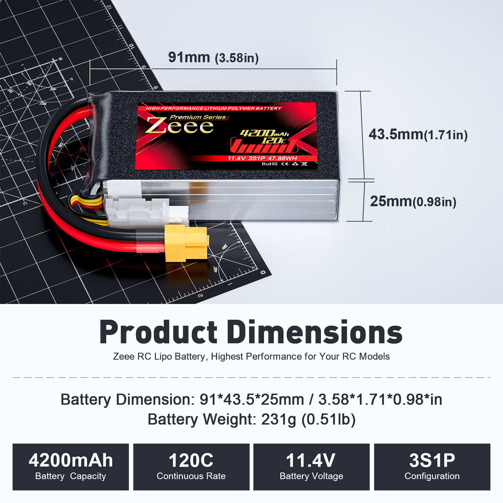
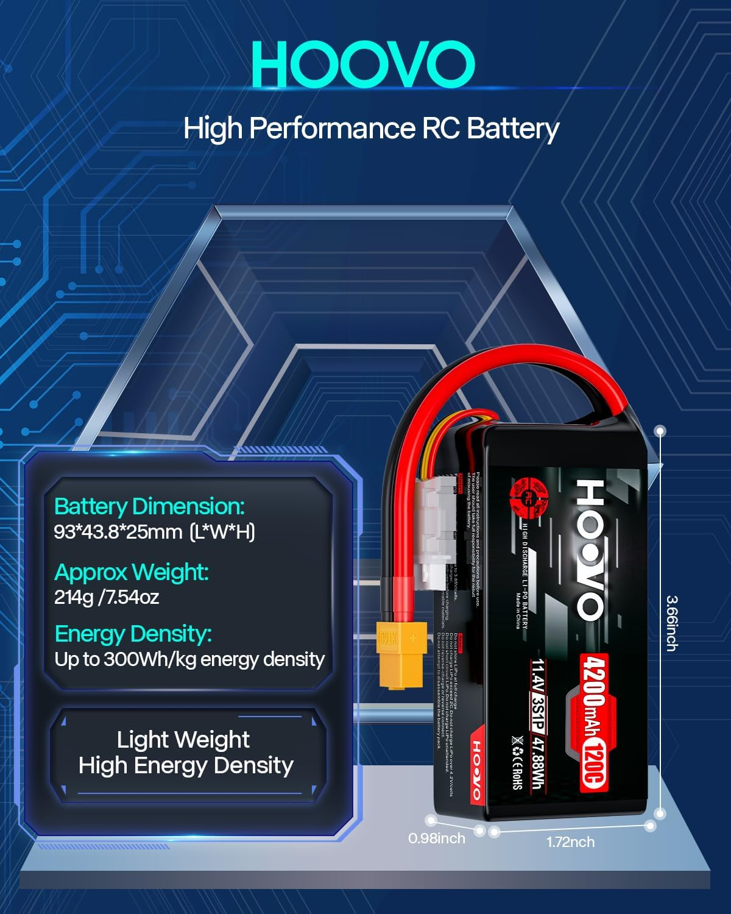
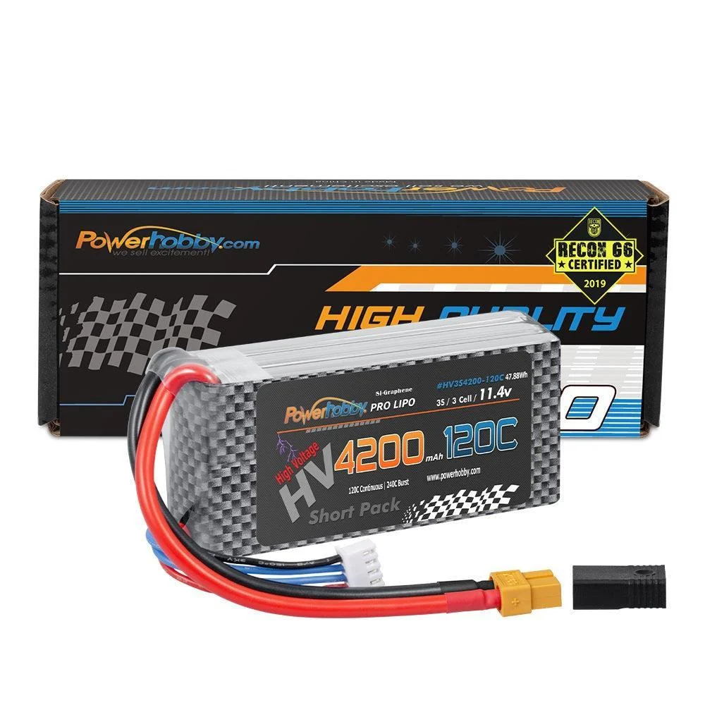
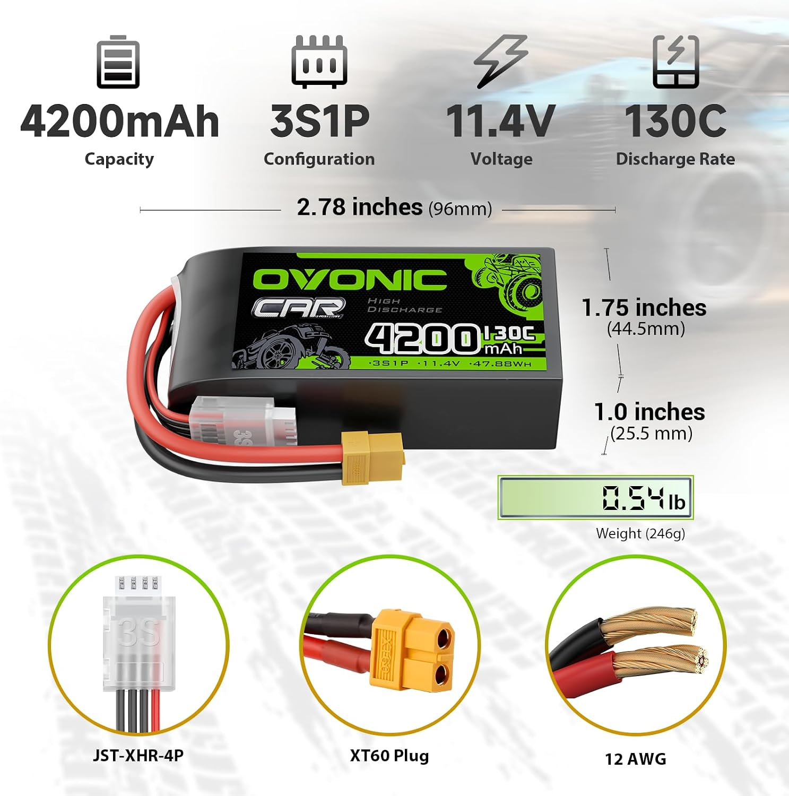
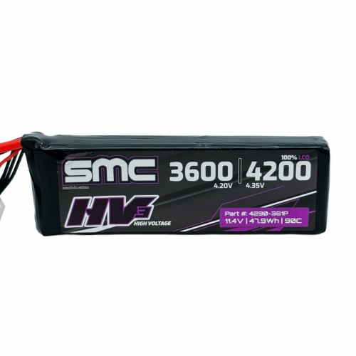

# Battery Selection — E-Revo 1.0

> **Chosen: Zeee Premo 3S HV 4200mAh shorty**, run as matched pairs in series for 6S. Four are in the fleet at 93 cycles each, two in the car and two spare. Four candidates are on the table to replace them: the **HOOVO 4200 shorty**, lightest of the five and a drop-in for the same tray, but its HV labeling contradicts itself; the **PowerHobby SI-Graphene 4200 shorty**, the smallest pack and the only cheap-brand one whose HV labeling is consistent, at the highest price here; the **OVONIC 4200 130C**, the cheapest pack currently buyable and the only one sold as a matched 2-pack, whose listing and label disagree on whether it is HV; and the **SMC HV3 Flight 4290-3S1P**, the only pack with true-spec numbers, which is also the heaviest, the only one that isn't a shorty, and comes from the brand with the worst durability record here.

 <em>Zeee Premo 3S HV 4200mAh, 91 × 43.5 × 25mm, 231g, 47.88Wh, 120C, XT60</em>

---

## Key Requirements

| Requirement | Type | Why |
|---|---|---|
| **3S, run as a series pair to 6S** | Must | The MAX8 G2S (3-8S) runs 6S here as two 3S packs in series |
| **LiHV (11.4V nominal, 4.35V/cell)** | May | The car is set up around HV and the chargers support it. At 6S that's 22.8V nominal and 26.1V hot off the charger (a standard 6S LiPo tops out at 25.2V). Preferred for the extra voltage, not a dealbreaker, a standard LiPo just runs a bit slower |
| **Bought as matched pairs, same order** | Must | Series pairs must stay voltage matched; mismatched packs drift and one gets over discharged |
| **600g of battery total, max** | Must | Weight is the real constraint. Both packs together have to come in under 600g. Lighter is better, there's no lower limit |
| **Over 4000mAh** | Must | Below that the run time isn't worth the pack swap. The 4200mAh class clears it with nothing to spare |
| **LVC set to 3.4V/cell** | Must | Premo #2 was lost to over discharge. It got there by self discharging in storage, not by being run flat |
| **Fits the Revo battery trays** | Must | Whatever goes in has to physically fit and strap down. Verify L × W × H per pack |
| **Shorty form factor** | May | What the car has always run and what drops in without thinking about it. A longer pack is fine if the tray genuinely takes it |
| **XT60, EC5 or XT90 connector** | May | All three are fine across the fleet. The ESC is XT90, and **EC5 physically mates with XT90** even though it isn't designed to, so an EC5 pack can go straight on in a pinch |
| **Survives a raced, jumped 6S truck** | May | Durability has decided more battery calls here than peak output has |

---

> *Spec format: Cells · Capacity · C-rating · Weight · Connector · Size · Price*

## Pack comparison

| Pack | Spec | Pros / Cons | Photo / Link |
|---|---|---|---|
| ⭐ **Zeee Premo 3S HV 4200mAh shorty** — *running, 4 in hand* | **Cells:** 3S1P / **11.4V LiHV** **Capacity:** 4200mAh (claimed) **C-rating:** 120C (marketing) **Weight:** **231g** (±15g) **Connector:** XT60, soft case **Size:** **91 × 43.5 × 25mm** (±2mm), true shorty **Price:** **$23.30/pack** all-time low (2025-09-21), $23.70 more recently. **Now ~$45.60/pack** direct from Zeee ($91.19 for the 2-pack, less an automatic 16% at checkout, so ~$38). Amazon listing unavailable | Pro: **Was the cheapest by a wide margin** at ~$23/pack, and the fleet has **4 working units at 93 cycles each**, proven longevity in this exact car. Zeee replaced a dead pack free (#2 became #5), so the warranty is real  Con: **Capacity and C are marketing numbers.** Zeee publishes weight and dimensions but nothing factory verified to check 4200mAh / 120C against. **#2 died from sitting in storage** (self discharge, not user error), so they don't tolerate long neglect. Amazon listing is unavailable, so restocks go through AliExpress/eBay. **Measured here:** charging one from 3.8V/cell storage to full puts about **3000mAh** in, which is a normal result for a 4200 pack coming off storage and gives no sign the rating is badly off |  [`/Deals/batteries.md`](../../Deals/batteries.md#zeee-premo-3s-4200mah-shorty-lihv-114v) |
| 🥈 **HOOVO 3S 4200mAh 120C 11.4V shorty** — *lightest, 2× 2-packs in the cart* | **Cells:** 3S1P / **11.4V** **Capacity:** 4200mAh (claimed) **C-rating:** 120C (marketing) **Weight:** **214.4g** **Connector:** XT60, soft case **Size:** **93 × 43.8 × 25mm**, true shorty **Price:** **$69.99 / 2-pack ($35.00/pack)**, in stock, Amazon (sold by Hoovo) | Pro: **Lightest pack here at 214.4g**, 17g under the Zeee and 63g under the SMC, and the **best watts per gram of the three** on published numbers. Footprint is within 2mm of the Zeee, so it drops into the same tray. In stock (the Zeee isn't), 30-day Amazon returns, 4.4★ over 95 ratings, and a reviewer measured **under 4mΩ/cell** internal resistance after two runs  Con: **The listing contradicts itself on HV.** Sold as 11.4V High Voltage, but the spec text says *"Cell voltage: 3.2~4.2V"* and *"never overcharge above 4.2V"*, which is standard LiPo charging. This car runs 4.35V/cell, so that needs resolving first (see Notes). **$35/pack against the Zeee's $23.30.** Reviews are mixed on it delivering a true 4200mAh, and its "up to 300Wh/kg" claim doesn't survive its own numbers (47.88Wh ÷ 214.4g = **223 Wh/kg**) |  |
| 🥉 **PowerHobby SI-Graphene 3S HV 4200mAh 120C shorty** — *not bought* | **Cells:** 3S1P / **11.4V LiHV** **Capacity:** 4200mAh (claimed) **C-rating:** 120C continuous / 240C burst (marketing) **Weight:** **227g** (listed as 8oz, so rounded rather than measured) **Connector:** XT60, JST-XH balance, soft case **Size:** **90 × 42 × 23mm**, the smallest pack here **Price:** **$54.99/pack**, in stock, direct from PowerHobby (SKU PHB3S4200120XT60) | Pro: **Labeled HV without contradicting itself**, which is the one thing the HOOVO can't say — 11.4V nominal and an #HV3S4200-120C part number, no "never above 4.2V" line anywhere on the page. **Smallest pack of the four**: 1mm shorter and 1.5mm narrower than the Zeee, and **2mm thinner than both shorties**, so it drops into the tray with the most room to spare. Second lightest at 227g and second on watts per gram  Con: **$54.99/pack is the most expensive here by a wide margin** — $109.98 for the series pair, **57% over the HOOVO** and roughly triple what this fleet paid for the Premos. For that you get less energy per gram than the HOOVO. **The weight is a rounded 8oz**, not a measured figure like HOOVO's 214.4g, so 227g could be off either way. 120C/240C and "SI-Graphene" are marketing with nothing factory verified behind them, same as the Zeee and HOOVO. **No history with this brand in the fleet**, and the warranty is 6 months against defects |  |
| 🔵 **OVONIC 3S 4200mAh 130C shorty** — *2-pack in the cart, not bought* | **Cells:** 3S1P / **11.4V** per the pack label **Capacity:** 4200mAh (claimed) **C-rating:** 130C (marketing, highest claim here) **Weight:** **246g** (0.54lb, printed on the product graphic) **Connector:** XT60, JST-XHR-4P balance, 12AWG, soft case **Size:** **96 × 44.5 × 25.5mm**, largest pack here **Price:** **$58.97 / 2-pack ($29.49/pack)**, Amazon, sold by Ovonic Direct | Pro: **Cheapest pack currently buyable at $29.49**, $58.97 for the series pair against $69.99 for the HOOVO pair and ~$76 for a Premo pair at today's prices. **Sold only as a 2-pack**, which is exactly how this car has to buy them — matched packs from one order, no hunting for a second. **12AWG** leads, heavier gauge than most packs this size advertise, and the label prints **47.88Wh** so the 11.4V figure is the manufacturer's own  Con: **The listing and the pack disagree on voltage.** The Amazon title and the About section both say **11.1V** (standard LiPo), while the battery label and product graphic say **11.4V / 47.88Wh** (LiHV). That's the same unresolved question as the HOOVO, pointing the other way, and it decides whether this charges to 4.35V/cell here. **Heaviest of the four shorties at 246g**, 32g over the HOOVO, and **last of them on watts per gram**. **Biggest footprint too** — longest, widest, and 2.5mm thicker than the PowerHobby. **Only 11 ratings, and half the visible reviews are Vine (free product)**, so 4.8★ is thin evidence. Safety guidelines cap charging at **1C**, more restrictive than the others |  |
| 🔵 **SMC HV3 Flight 11.4V 3S 4200mAh 90C** — *4290-3S1P, not bought* | **Cells:** 3S1P / **11.4V LiHV** **Capacity:** **4200mAh @ 4.35V**, 3600mAh @ 4.20V (both on the label) **C-rating:** 90C (SMC true factory rate) **Weight:** **277g** (554g per series pair) **Connector:** any SMC offers. SC5 (EC5/IC5 compatible) free, most others +$1.50, XT90 anti-spark +$2.00 **Size:** **140 × 44 × 23mm**, G10 top and bottom plates **Price:** **$31.95** plus connector (~$33.45 with XT90) | Pro: **SMC publishes true-spec mAh and true factory C**, the honest exception to RC battery marketing. G10 end plates, 10AWG, and the label states both the 4.20V and 4.35V capacities instead of only the flattering one. Charge rate 1C to 5C. Any connector, so it can match the XT90 ESC directly  Con: **It's a flight pack, and SMC's own listing calls the HV Flight series hit or miss.** You must acknowledge a disclaimer to add it to the cart, and they **run hot and need temperature monitoring** or cell life drops. **This fleet's SMC history is bad:** the [HCL-HP 5200s](../FastAzJato4x4/battery_analysis.md#notes) went DOA or died inside ~20 cycles while being babied. **~43% more per pack than the Premo** ($33.45 vs $23.30). Its "highest watts per gram on the market" claim doesn't hold here, it finishes last of the three |  |

---

## Notes

- **Watts per gram, all five (published numbers).** All are 11.4V / 4200mAh, about 47.9Wh, so weight decides it outright:

| Pack | Weight | Wh/g | Wh/kg | Size | $/pack |
|---|---|---|---|---|---|
| **HOOVO** | **214.4g** | **0.223** | 223 | 93 × 43.8 × 25 | $35.00 |
| PowerHobby | 227g | 0.211 | 211 | **90 × 42 × 23** | $54.99 |
| Zeee Premo | 231g | 0.207 | 207 | 91 × 43.5 × 25 | $23.30 historic, **~$38 now** |
| OVONIC | 246g | 0.195 | 195 | 96 × 44.5 × 25.5 | **$29.49** |
| SMC HV3 Flight | 277g | 0.173 | 173 | 140 × 44 × 23 | $33.45 |

- **The SMC finishes last on its own headline metric**, against a product page claiming the highest watts per gram on the market. It's 63g heavier than the HOOVO for the same energy. The honest caveat: SMC's numbers are true spec and verified, while HOOVO's and Zeee's are marketing. HOOVO's reviews are mixed on it delivering a true 4200mAh, and its "up to 300Wh/kg" claim is already 34% above what its own weight and Wh work out to. The Zeee has at least been sanity checked here: ~3000mAh in from 3.8V storage, which is what a healthy 4200 should take. So it's a verified 0.173 against two unverified higher numbers. A capacity check on a Premo (four in hand, 93 cycles) would settle how much that column is worth.
- **The SMC is the only one that isn't a shorty.** Zeee is 91mm long, the SMC is 140mm, **49mm longer** or a 54% increase, at the same width and 2mm thinner. The car carries two packs, so that's roughly 100mm of extra length to find. Shorty is a preference rather than a rule, so this doesn't rule the SMC out, but it does mean **measuring both Revo trays is the first step** with that pack, where the other two just drop in.
- **The HOOVO's HV labeling contradicts itself, but it isn't a dealbreaker.** 11.4V nominal is HV (3.8V/cell), yet the same listing says never charge above 4.2V/cell, which is standard LiPo. One of those is wrong. Since HV is a preference here and not a requirement, the pack still qualifies either way. What's at stake is capacity and top speed: charged to 4.2V it lands near a 3600mAh equivalent, the same gap SMC prints openly on its label. Worth asking HOOVO which figure is real, since it changes what you're actually paying $35/pack for.
- **The 4200 number is an HV number.** SMC prints both: 4200mAh at 4.35V/cell, 3600mAh charged conventionally to 4.20V. This car runs true LiHV so it would get the 4200, but the pack loses 14% the moment it's charged as a standard LiPo. Most brands print only the bigger number.
- **The Premo looks like it's being wound down, checked 2026-08-26.** It is **gone from Zeee's own 3S collection listing** (36 packs there, none of them this one) and the **Amazon listing reads "currently unavailable, we don't know when or if this item will be back in stock"**. The direct product page is still live and in stock, and eBay and AliExpress listings still exist, so it is **not formally discontinued**, but a pack pulled from a brand's own browse pages usually isn't coming back.
- **The price already reflects that.** Direct from Zeee it's **$91.19 for the 2-pack**, about $45.60/pack, or roughly **$38 after the automatic 16% at checkout**. That is **60%+ above the $23.30 this fleet paid** and **above the HOOVO's $35/pack**, so the Premo's cost advantage is gone at current prices. Cheap Premos now mean finding old eBay/AliExpress stock.
- **That's the real argument for qualifying a replacement now.** Four proven packs at 93 cycles are fine until one dies, and then the pair has to be replaced together with a matched pack. If the Premo isn't restocking, that replacement won't be another Premo, so it's better to know which of the HOOVO or SMC works while there's no pressure.
- **Durability has decided every battery call in this fleet so far.** The Premos are at 93 cycles and still working. The SMC HCL-HP packs in the [Jato analysis](../FastAzJato4x4/battery_analysis.md#notes) were the best performing packs owned and none passed ~20 cycles, one arrived DOA. SMC's spec honesty is genuinely better than anyone else's and their packs have still been the least durable thing here. That's the tension to weigh, not the spec sheet.
- **Pair weights against the 600g cap:** HOOVO **429g** (72% of budget), PowerHobby **454g** (76%), Zeee Premo **462g** (77%), OVONIC **492g** (82%), SMC **554g** (92%). All three pass, so weight ranks them rather than eliminating any, but the SMC spends nearly the whole allowance and leaves no room to go up in capacity later.
- **Buy in pairs, always.** Anything bought here costs 2× the per-pack price ($63.90 plus connectors for the SMC) because the car runs a series pair. Replace pairs together, from the same order.
- **LVC stays at 3.4V/cell whatever goes in, and don't let packs sit.** Premo #2 was lost to over discharge, but it got there by sitting unused and self discharging, not by being run flat on track. Storage voltage checks matter as much as the LVC setting.
- **Connectors: XT60, EC5 and XT90 all work here.** The Zeee and HOOVO are XT60, so they adapt to the XT90 ESC the way the car already runs. SMC builds to any connector, so it can be ordered in **XT90** and be the only pack that plugs straight in, or in its free **SC5** (EC5/IC5 compatible) to swap with the Jato's EC5 packs.
- **EC5 will physically mate with an XT90**, so an EC5 pack can run on this car's XT90 without an adapter. Worth knowing it isn't a designed fit, the housings just happen to accept each other, so expect a tight or imperfect mate rather than treating it as a proper connection.
- **Still to log:** a full discharge capacity test on a Premo. The ~3000mAh charged in from 3.8V storage is a good sign but isn't the same measurement, so the true number on a 93-cycle pack is still unknown.
