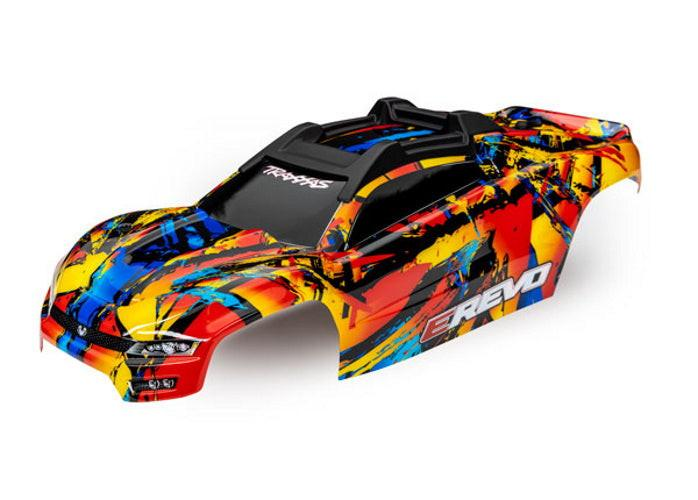

# Body Selection — E-Revo 1.0

> **Leaning toward: Traxxas 8612 (E-Revo 2.0 "Solar Flare", pre-painted).** I run the original E-Revo body now and prefer the **OG style**, but the math pushed me to the 2.0 body. Painting an aftermarket 1.0 body costs ~**$25** for the shell plus ~**$14** in paint (closer to ~$50 if someone else paints it), and once you add the Revo 2.0 protective plastic (reinforcement, clipless mounts, roof scratch skid) bought separately, the total beats just buying the **whole pre-painted 2.0 body**. The 8612 comes painted with decals and all that protection built in, and I like the Solar Flare scheme. The catch: the 2.0 shell still wears out, so the long game is to reuse its protective bits, and the clipless **8614** posts I already bought, on an OG-style body.

 <em>Traxxas 8612 E-Revo Solar Flare — pre-painted ProGraphix with decals, front + rear clipless mounts and roof skid pre-installed</em>

---

## Table of Contents

- [Key Requirements](#key-requirements)
- [Body Comparison](#body-comparison) — 2.0 pre-painted vs aftermarket 1.0 vs stock
- [The Cost Logic](#the-cost-logic) — why whole 2.0 body beats buying bits separately
- [Notes](#notes)

---

## Key Requirements

| Requirement | Type | Why |
|---|---|---|
| **Built-in protection (reinforcement + roof skid)** | Must | Bodies get destroyed bashing; want the protective plastic, not a bare shell |
| **Low paint cost / labor** | May | Painting a 1.0 body well is ~$14 in paint + time (or ~$50 done for you) |
| **Clipless mounting** | May | Quick body swaps; already bought the Traxxas 8614 clipless posts for it |
| **OG E-Revo style look** | May | Preferred aesthetic, but not worth a big price/labor premium |
| **Cheap to replace (consumable)** | Must | The shell is a wear item on a basher; total cost matters more than the look |

---

## Body Comparison

| Body | Spec | Pros / Cons | Photo / Link |
|---|---|---|---|
| ⭐ **Traxxas 8612 E-Revo 2.0 "Solar Flare"** (pre-painted) | Finish: **ProGraphix paint + decals applied**  Includes: **front + rear clipless body mounts** and **roof skid**  Material: polycarbonate  Price: **$79.95** (PowerHobby, currently **out of stock**) | Pro: **Pre-painted with decals** (zero paint labor). Ships with the **reinforcement, clipless mounts, and roof scratch skid** built in. Works out **cheaper than buying those bits + painting a 1.0 body separately**. Like the Solar Flare scheme  Con: **2.0 style, not the OG look** I prefer; the shell still wears out; $79.95 and out of stock at PowerHobby right now |  |
| 🔵 **Aftermarket E-Revo 1.0 body (OG style) + paint** | Shell: ~**$25**  Paint: ~**$14** (DIY) / ~$50 painted for you  DIY total: ~**$39** + labor | Pro: **Preferred OG style**; cheapest bare shell; paint it any scheme (e.g. Solar Flare)  Con: **No factory reinforcement / clipless / roof skid** (buy those separately = the total creeps past the whole 2.0 body); paint time and skill required; least protected out of the box |  🚧 save as `src/body_aftermarket_erevo_1_0_og_style.jpg` |
| 🟢 **Stock original E-Revo body** (current) | OEM, already on the truck | Pro: **Already mounted**, OG look, no cost  Con: Worn from use; no clipless mounting; getting beat up |  🚧 save as `src/body_traxxas_erevo_stock_original.jpg` |

---

## The Cost Logic

The decision came down to math, not looks:

1. **Original plan:** buy the Revo 2.0 **protective plastic bits separately** (reinforcement, clipless mounts, roof scratch protectors) and graft them onto an OG-style 1.0 body so it survives.
2. **Problem:** once you add up the aftermarket 1.0 shell + paint + all those 2.0 protective bits bought piecemeal, the **total runs past the price of the whole pre-painted 2.0 body (8612)**.
3. **Result:** just buy the **complete 8612**. It bundles the painted shell, decals, clipless mounts, reinforcement, and roof skid for less than assembling the same thing by hand, and it lands on the Solar Flare scheme I like anyway.

---

## Notes

- **Why I bought the clipless posts (8614).** The clipless mounting system lets bodies swap fast and ride without body clips. The 8612 already includes its mounts, but the **8614** posts let me run clipless on an **OG-style body** too, so when the 2.0 shell wears out I can move the protective setup over.
- **The 2.0 shell is a consumable.** It gets destroyed with hard use. The value is in the **reusable protective plastic** (clipless mounts, roof skid, reinforcement), which outlives any one shell. Plan to keep those and re-shell as needed.
- **OG look vs practicality.** I still prefer the original E-Revo body shape, but it loses on total cost and protection. If I ever want the OG look specifically, the path is an aftermarket 1.0 shell painted Solar Flare, moving the clipless + roof skid bits onto it.
- **Stock check before ordering.** The 8612 was **$79.95 and out of stock at PowerHobby**; watch for restock or another retailer.
