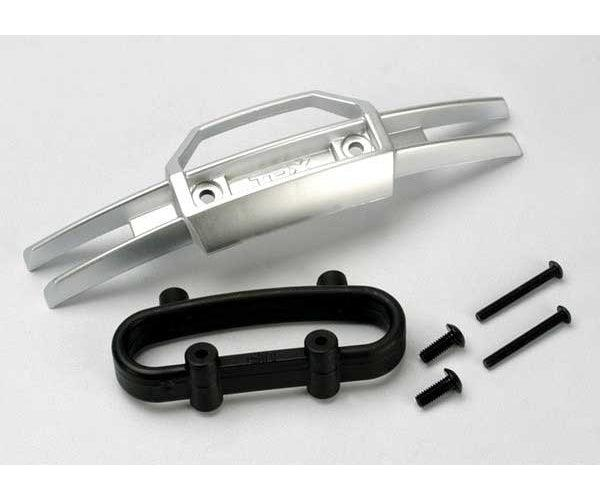

# Bumper Selection — E-Revo 1.0

> **Front: Traxxas 5335 silver nylon bumper + mount. Rear: none.** The truck came (as a gift) with a junk **blue metal front bumper** that **bent the moment it hit anything** and added pointless nose weight, so it's gone. The **nylon 5335** is light, **flexes instead of bending**, looks good, and actually helps the truck **cartwheel cleanly** instead of digging in. I run the tougher **RPM 80802 mount** under it, so a tweaked mount is a **$5 part** instead of a whole new set. **No rear bumper at all** — it protects nothing, and there's already a metal bulkhead back there.

 <em>Traxxas 5335 — silver nylon front bumper + black nylon mount (with mounting screws)</em>

---

## Table of Contents

- [Key Requirements](#key-requirements)
- [Front Bumper Comparison](#front-bumper-comparison) — nylon vs the stock metal bumper
- [Rear Bumper](#rear-bumper) — why there isn't one
- [Notes](#notes)

---

## Key Requirements

| Requirement | Type | Why |
|---|---|---|
| **Lightweight** | Must | The stock metal bumper added dead nose weight for no benefit |
| **Flexes instead of bending** | Must | The metal bumper bent permanently on the first real hit |
| **Cheap to replace just the broken piece** | May | An RPM mount lets you swap a ~$5 mount instead of a whole bumper set |
| **Looks good** | May | The front bumper is mostly aesthetic; it rarely actually breaks |

---

## Front Bumper Comparison

> *Spec format: Type · Material · Position · Fits · Includes · Weight · Price*

| Bumper | Spec | Pros / Cons | Photo / Link |
|---|---|---|---|
| ⭐ **Traxxas 5335 nylon front bumper + mount** — *chosen* | **Type:** bumper bar + mount **Material:** nylon (silver bumper / black mount) **Position:** Front **Fits:** Revo / E-Revo **Includes:** bumper + mount + 2× 3×25 mm and 2× 4×10 mm cap screws **Weight:** N/A (light) **Price:** $10.00 (set) | Pro: **Light**, **flexes instead of bending**, looks good, and **helps the truck cartwheel** instead of digging the nose in  Con: If the bumper bar ever cracks it's a **$10 full set** (which is why the mount underneath is the cheaper RPM part) |  |
| 🟢 **RPM 80802 front bumper mount** — *in hand, runs under the 5335 bar* | **Type:** mount only (no bumper bar) **Material:** composite **Position:** Front **Fits:** Revo / E-Revo **Includes:** mount only **Weight:** N/A **Price:** $5.39 (PowerHobby) | Pro: **Tougher mount**; if the mount tweaks you replace a **~$5 part**, not the whole $10 set  Con: Mount only, so it pairs with the 5335 (or stock) bumper bar |  |
| ❌ ~~**Stock blue metal front bumper** (came with the car)~~ | **Type:** bumper bar (came with the car) **Material:** metal **Position:** Front **Fits:** Revo / E-Revo **Includes:** N/A **Weight:** heavy **Price:** N/A (gift) | Pro: None worth keeping  Con: **Bent the moment it hit something** (stays bent), and adds **dead nose weight**. Exactly what a basher bumper shouldn't do |  🚧 save as `src/bumper_stock_blue_metal_front.jpg` |

---

## Rear Bumper

> 🚫 **No rear bumper.** It protects nothing useful on this truck, and there's already a **metal bulkhead in the back** taking the hits. Skipping it saves weight and a part to break. The only bumper worth running here is the front one, and that's mostly for looks.

---

## Notes

- **Front bumper is mostly aesthetic.** On these trucks the front bumper takes a lot of abuse but **rarely actually breaks** — owners mostly swap it to make the truck look fresh (clean it up for photos). So the priority is light + good-looking, not bombproof.
- **Why nylon over metal.** The metal bumper that came with the car **bent on the first impact** and stayed bent, plus it hung weight off the nose. Nylon flexes and springs back, weighs less, and is cheaper to replace.
- **It helps the truck cartwheel.** A light, rounded front bumper lets the truck **tumble/cartwheel** over an impact instead of catching and tweaking suspension parts. So it's not purely cosmetic.
- **Cheap-piece strategy.** Running the **RPM 80802 mount** under the nylon bar means the part most likely to tweak (the mount) is a **$5 standalone replacement**, not a $10 full set.
- **Rear: skip it.** No rear bumper, by design. The rear metal bulkhead already protects the back end.
