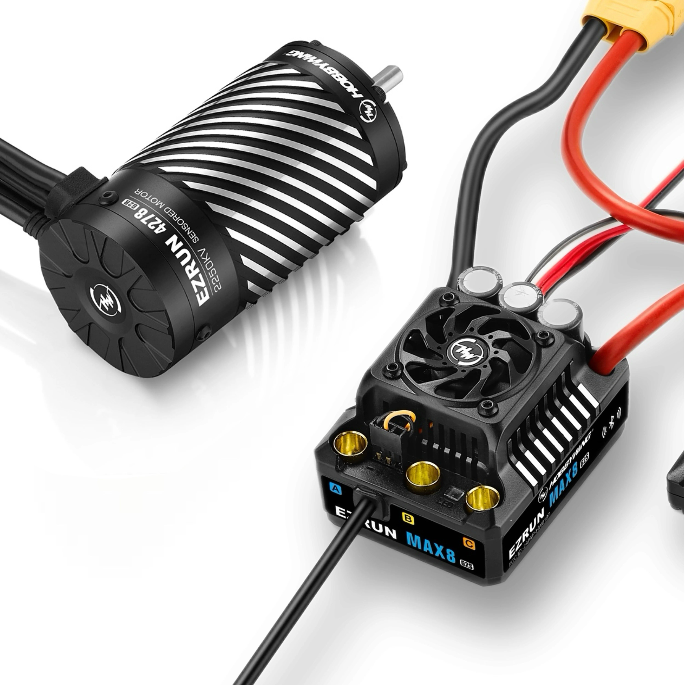
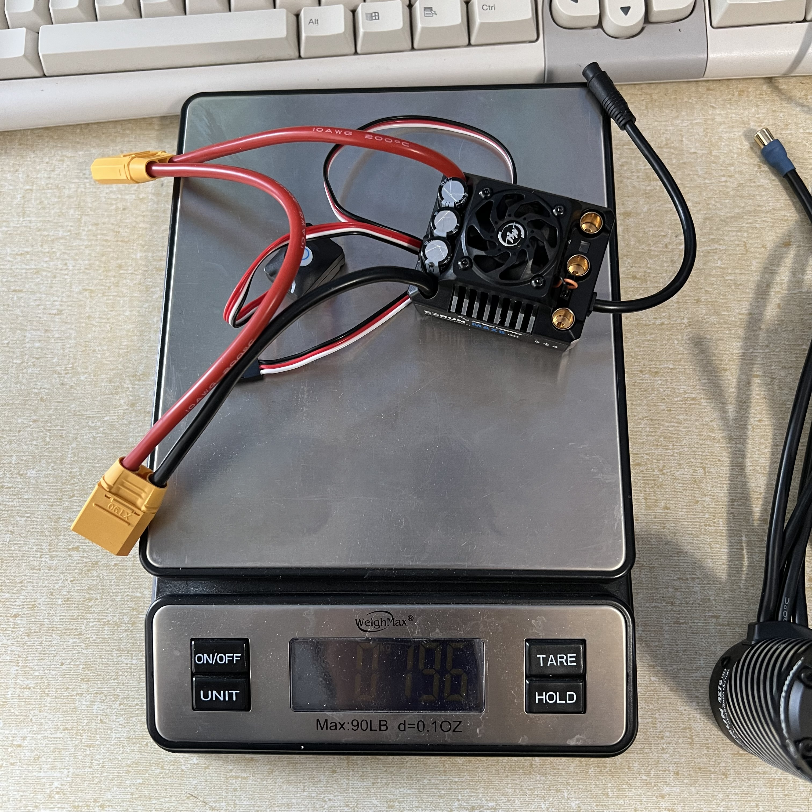
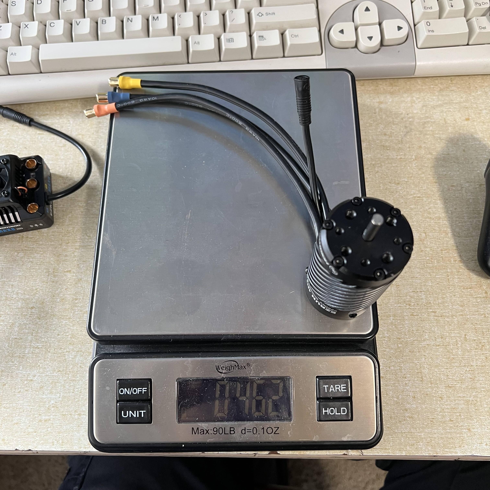
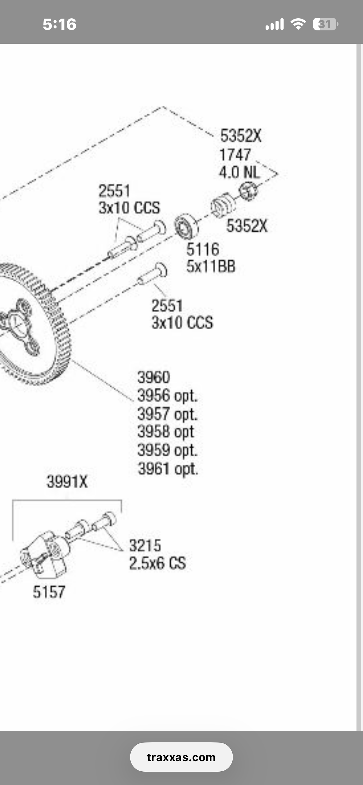

# ESC, Motor & Gearing — E-Revo 1.0

> **Chosen — ✅ purchased Jun 25 2026 for $187: Hobbywing EZRun MAX8 G2S ESC + 4278SD 2250KV G2R combo (HWI38010607)** (Hobbywing direct, code HWTRYOUTS). Switched from the Castle path. Not for speed (KV is basically identical to the Castle 1515, so same top end on 6S) but for the **G2S reliability** (no cutout at ramps), telemetry, waterproofing, and value. Price tracked in [`Deals/escs.md`](../../Deals/escs.md); the Castle Memorial Day numbers are in [`Deals/castle_creations_memorial_day_2026.md`](../../Deals/castle_creations_memorial_day_2026.md).

 <em>Hobbywing EZRun MAX8 G2S ESC + 4278SD 2250KV G2R motor — the chosen E-Revo combo</em>

---

## Key Requirements

| Requirement | Type | Why |
|---|---|---|
| **6S capable** | Must | The E-Revo runs 6S (2× 3S LiHV) |
| **Waterproof / dustproof** | Must | Dirt track + occasional beach |
| **No power cutout on jumps / extremes** | Must | A cut mid-ramp wrecks the landing; the Hobbywing **G2S** fixes the plain G2's cutout issue |
| **BEC strong enough for the digital servo** | Must | Needs a solid switch-mode BEC, no brownouts |
| **Sensored** | May | Smoother low-speed control out of corners |
| **Telemetry / programmable** | May | Logging temps/voltage/RPM helps tuning |

---

## ESC Comparison

> *Spec format: Cells · Current (A) · BEC · Sensored · Waterproof · Weight · Price*

| ESC | Spec | Pros / Cons | Photo / Link |
|---|---|---|---|
| ⭐ **Hobbywing EZRun MAX8 GS2** | **Cells:** 4S–6S **Current (A):** N/A (MAX8-class) **BEC:** 6A/15A switch-mode, 6–8.4V **Sensored:** Yes **Waterproof:** Yes (+ dustproof) **Weight:** 194 g spec · **195 g measured** (w/ wires + XT90) **Price:** ✅ **purchased $187, Jun 25 2026** (Hobbywing direct, HWTRYOUTS; see [Deals](../../Deals/escs.md)) | Pro: **G2S = no cutout at ramps/extremes;** 3× 680µF caps (870µF, +74% vs MAX8, no external cap needed); frameless fan + radiator cooling; 32° turbo timing (+25% RPM); HW Link app + Bluetooth logging; LVC / thermal / fail-safe / reverse-polarity protection. **Dims 60×48×40.5 mm**  Con: Locked to the Hobbywing ecosystem; OTA programmer / LCD box sold separately |  <em>195 g w/ wires + XT90</em> |
| 🥈 **Castle Mamba Monster X (ESC-only, 010-0145-00)** | **Cells:** 6S (25.2V) WP **Current (A):** N/A **BEC:** N/A **Sensored:** Yes-capable **Waterproof:** Yes **Weight:** N/A **Price:** $147.96 (Memorial Day + 26% student) | Pro: **Cheapest path — reuses the owned 1515 2200KV motor** (no second motor to buy); proven Castle reliability + Castle Link  Con: No combo motor/spare; Memorial-Day pricing was a one-time sale (May 2026) | — |

---

## Motor Comparison

> *Spec format: Type · KV · Cells · Can · Shaft · Sensored · Poles/Slots · Rotor · Max RPM · Max temp · Bearings · Rebuildable · Weight · Price*

| Motor | Spec | Pros / Cons | Photo / Link |
|---|---|---|---|
| 🟢 **Castle 1515 2200KV** — *owned* | **Type:** Brushless sensored **KV:** 2200 **Cells:** 6S **Can:** 1515 (~36 mm) **Shaft:** N/A **Sensored:** Yes **Poles/Slots:** N/A **Rotor:** N/A **Max RPM:** N/A **Max temp:** N/A **Bearings:** N/A **Rebuildable:** N/A **Weight:** N/A **Price:** owned | Pro: **Already owned** — pair with the Castle Monster X ESC for the cheapest fast setup  Con: Smaller can than the 4278; tied to the Castle ESC path | — |
| 🔵 **Hobbywing 4278SD G2R 2250KV** — *comes in the combo* | **Type:** Brushless sensored (waterproof sensor) **KV:** 2250 **Cells:** 3–6S **Can:** 4278 (42 mm dia × 78 mm) **Shaft:** N/A **Sensored:** Yes **Poles/Slots:** N/A **Rotor:** N/A **Max RPM:** **60,000** (9% over G2) **Max temp:** N/A **Bearings:** front **5×16×5** (4310014) / rear **5×13×4** (4310004) — [service kit](service_parts_analysis.md#motor-bearings) **Rebuildable:** Yes — replaceable ball bearings **Weight:** **462 g** (measured) **Price:** included in $208.99 combo | Pro: **Bigger 42 mm can** = more torque headroom + cooler running; lower internal resistance (G2R); waterproof sensor; ships with the ESC  Con: Redundant if reusing the 1515; only worth it for the spare/bigger motor |  <em>462 g</em> |

---

## Gearing (spur + pinion)

**Pitch:** mod 0.8 (32P). Motor shaft 5 mm.

- **OEM (E-Revo Brushless):** 18T pinion (**TRA5644**, hardened, 5 mm bore) / 65T spur (**TRA3960**) = **3.61:1**.
- **Currently on:** **20T pinion** (0.8 mod, 5 mm bore) + **TRA3958 58T** spur = **2.90:1** — taller still than the old 18T setup, so it runs hotter. Watch motor temp.

**Spur options** (all 0.8 mod). Ratios below are for the **18T** pinion. **Now on a 20T pinion**, so real ratios are ~10% taller (multiply by 18/20 = 0.9): e.g. 68T with 20T = **3.40**, 65T with 20T = **3.25**. To get back near OEM 3.61 on the 20T you'd need ~72T+.

| Spur | Teeth | Ratio (18T) | Note |
|---|---|---|---|
| TRA3956 | 54 | 3.00 | tallest — hottest, avoid |
| TRA3957 | 56 | 3.11 | |
| TRA3958 | 58 | 3.22 | current spur — runs hot |
| TRA3959 | 62 | 3.44 | |
| TRA3960 | 65 | 3.61 | OEM baseline |
| **TRA3961** | **68** | **3.78** | coolest — leaning toward this for loose dirt |

**Plan:** go back up in spur to run cooler. Run at least the OEM **65T (TRA3960)**; leaning **68T (TRA3961)** for low-end punch on the loose track. Dial by temp: target **<180°F/82°C** motor after a hard 5-6 min pack.

**Pinion retention (was stripping spurs).** The plastic spurs were stripping because the **pinion kept working loose** on the motor shaft — as it walks, the mesh opens/closes, tooth engagement drops, and it shears the spur. Fix is retention, **not a metal spur**:
- **Flat on the motor shaft — #1 fix.** If the 4278/1515 shaft is round where the set screw lands, grind a small **flat** there. A set screw on a flat can't walk; on a round shaft it always eventually does.
- **Blue Loctite (242/243)** on the set screw, not red. Seat the screw square on the flat, fully engage the hex, and replace it if the tip is mushroomed. Tighten both screws if the pinion has two.
- **Reset mesh** after (paper-strip method). Locking the pinion also keeps mesh consistent, so it runs cooler and quieter.

**What people run racing (heavy 6S on dirt):** gear by **motor temp, not top speed**. OEM 18/65 (3.61:1) is only ~35 mph on 6S, more than a tight loose-dirt track uses. The dirt crowd runs **at or slightly below OEM ratio** (bigger spur / smaller pinion) for corner punch and thermal margin, targets **160-180°F** after a run, and adds a **motor fan** so heat (not gearing) stops being the limit. Bigger tires raise effective gearing (more heat), so factor tire OD in.

 <em>Traxxas spur options for the E-Revo gearbox (3956–3961, 0.8 mod)</em>

---

## Notes

- **Speed: it's a wash.** Castle 1515 **2200KV** vs Hobbywing 4278SD **2250KV** — same KV, so same RPM/top speed on the same 6S + gearing. The brand swap doesn't make the truck faster; **traction (tires/setup) and gearing do.**
- **Why switch to Hobbywing anyway:** the **G2S doesn't cut out at ramps / in extreme conditions** (the plain G2 does), plus telemetry, waterproofing, and a combo that's **~$39 under the equivalent Castle combo** with a spare 4278 motor.
- **Cheapest equally-fast path:** keep the owned **1515 2200KV** and add just the **Castle Monster X ESC ($147.96)** — same speed, no second motor. The Hobbywing combo only wins on reliability/telemetry/spare-motor, not speed.
- **Open decision:** if going Hobbywing, run the combo's **4278SD** or keep the **1515** on the MAX8 GS2 — both are 6S, ~same KV.
- **Confirmed: $187 = the 4278SD G2R 2250KV combo** (Hobbywing direct, code **HWTRYOUTS**, **Jun 25 2026**). The checkout text typo'd the motor as "4274SD," but the option-specific listing photo shows the **4278SD 2250KV** — same combo as the eBay 38010607, just **$22 cheaper**. The buy. See [`Deals/escs.md`](../../Deals/escs.md).
- **Price + buying note (G2S not G2)** live in [`Deals/escs.md`](../../Deals/escs.md).
- **Box part / warranty numbers** (from the retail boxes, keep for RMA):
  - **ESC — EZRUN MAX8 G2S:** warranty P/N code **30103205** · serial **077400002915** · UPC 088718506335 · EAN 6938994406338
  - **Motor — EZRUN-4278SD-2250KV-BLACK-G2R:** P/N **30402141** · UPC 088718506366 · EAN 6938994406369
  - Box photo: [`src/electronics_hobbywing_max8g2s_4278_box_labels.jpg`](src/electronics_hobbywing_max8g2s_4278_box_labels.jpg)
