# Axle Carrier / Hub Selection — E-Revo 1.0

> **Chosen: RPM oversized-bearing carriers at both ends.** The **front steering blocks** are the **RPM 80582** set ($23.75, in hand); the **rear axle carriers come bundled in the [RPM 80562 True Track kit](arm_analysis.md)** (cheaper than buying rear carriers separately), and both ends run the **same oversized bearings**. The composite is stronger than stock (**40% thicker** pillow-ball walls, **20% more material** so the balls don't pull through), but the bearings are what I'm after: **~2 mm more axle contact, ~33% bigger balls, ~2× load rating**. The **Revo is heavy yet runs the same small stock bearings as the much lighter [Jato 4x4](../FastAzJato4x4/README.md)**, so I exploded bearings for years. RPM molded parts carry a **lifetime breakage warranty**.

  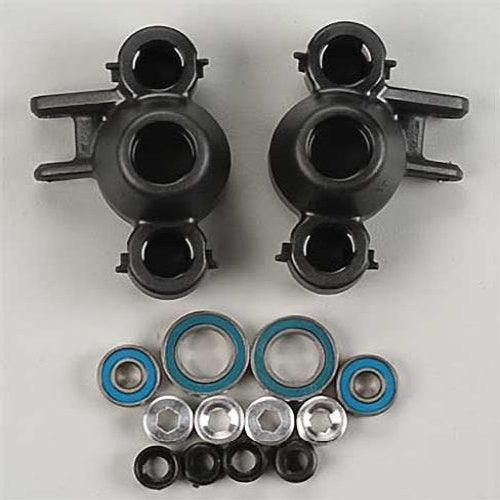&nbsp;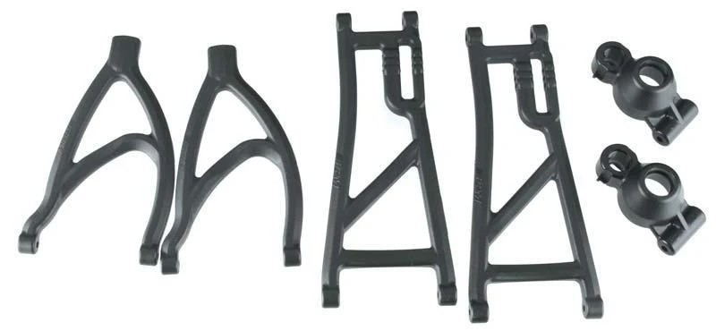 
  <em>Front steering blocks: RPM 80582 · Rear axle carriers: included in the RPM 80562 True Track kit (both with oversized bearings)</em>

---

## Table of Contents

- [Key Requirements](#key-requirements)
- [Bearing Size Comparison](#bearing-size-comparison) — stock vs RPM oversized, the whole point
- [E-Revo 2.0: Even Bigger](#e-revo-20-even-bigger-reference) — the next size up, but a different platform
- [Carrier Comparison](#carrier-comparison) — RPM vs stock
- [Carrier Service Parts](#carrier-service-parts) — RPM 80010 setscrews / bushing caps for rebuilds
- [Servicing the Hubs](#servicing-the-hubs) — disassemble from the center, leave the pillow balls glued
- [Rear Hub: Pin vs Pillow Ball](#rear-hub-pin-vs-pillow-ball)
- [Notes](#notes)

---

## Key Requirements

| Requirement | Type | Why |
|---|---|---|
| **Bigger, longer-lasting wheel bearings** | Must | Stock bearings fail fast under a heavy E-Revo on dirt; bigger = more load capacity |
| **Pillow balls that don't pull through** | Must | Stock carriers split and let the pillow balls tear out under impact |
| **Fits stock axles (no axle change)** | Must | Bearing bores must stay 6 mm and 12 mm so the stock stub axles still fit |
| **Holds up on dirt + occasional beach** | Must | Grit and corrosion are constant; press-fit bearings reduce slop/wear |
| **Keep it light** | May | Race build, so lighter axles/hubs are preferred for less rotating + unsprung mass |

---

## Bearing Size Comparison

> The carriers themselves matter less than the **bearings they hold**. RPM enlarges the bearing pockets so it can run a bigger bearing with the **same inner diameter** (so the stock axle still fits) but a larger outer diameter and width.

| Position | Stock TRA5334 (smallest) | Upgraded TRA5334R (medium) | RPM / Enron (largest) |
|---|---|---|---|
| **Outer** (wheel side) | **6×12×4 mm** (TRA5117) | **6×13 mm** (+ 6×12 adapter) | **6×15×5 mm** |
| **Inner** | **12×18×4 mm** (TRA5120) | medium *(verify exact size)* | **12×21×5 mm** |

> Stock → RPM keeps the same **6 mm / 12 mm bore** (stock axle still fits), just **+3 mm OD, +1 mm width**. The Traxxas **5334R sits in between** (6×13 outer, with 6×12 adapters to drop to stock size); the **Enron metal carrier uses the same largest size as the RPM**.

> Both the **front 80582** carriers and the **rear True Track** carriers use these **same oversized bearings**, so one replacement size covers all four corners.

**Measured weights (oversized set in hand):** outer **6×15×5 = 7.5 g/pair**, inner **12×21×5 = 11.6 g/pair** (the rear True-Track set measured **7.3 / 11.7 g/pair** — same bearings).

  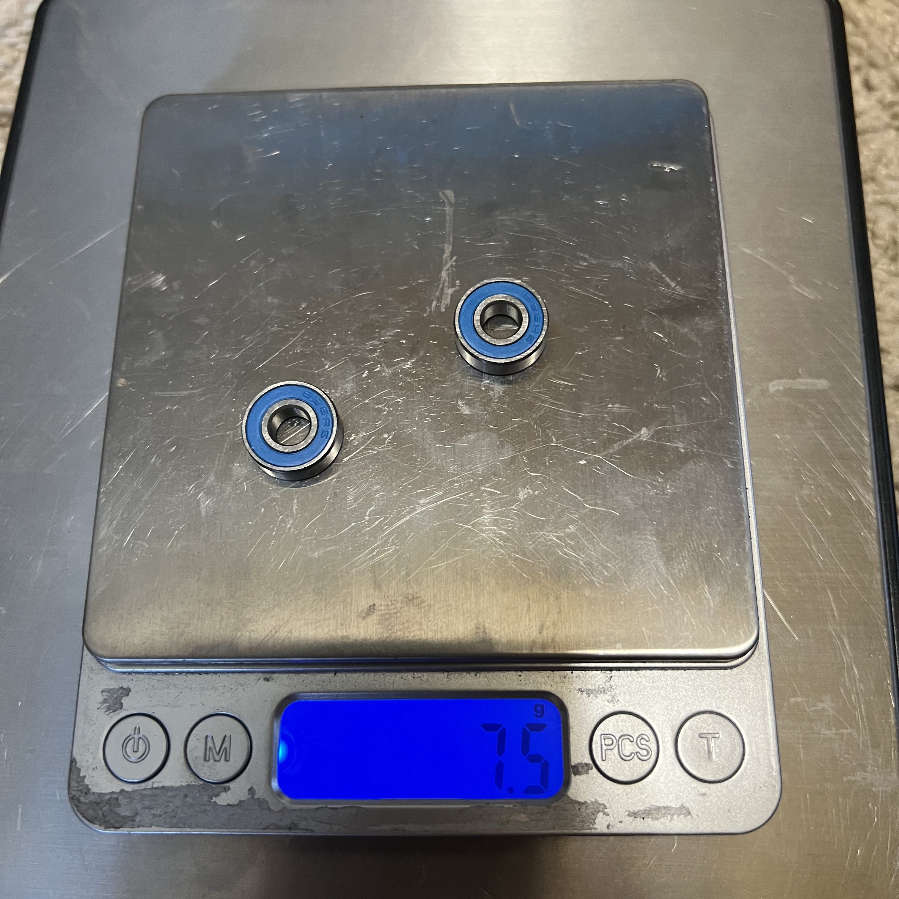&nbsp;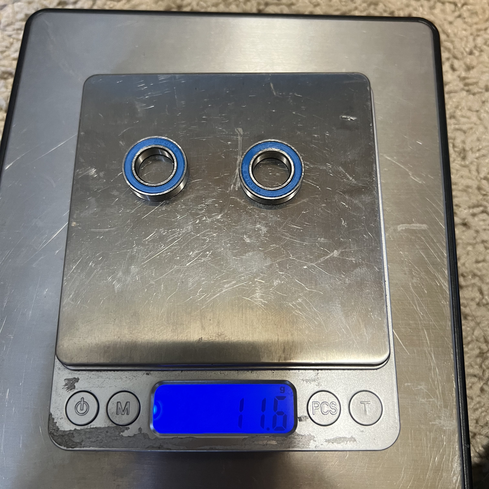 
  <em>outer 6×15×5 = 7.5 g/pr · inner 12×21×5 = 11.6 g/pr</em>

RPM's claims for the bigger bearings vs stock:

- **~33% larger balls** inside the race.
- **~2 mm more contact** with the axle (the extra width), for smoother, longer-running support.
- **~2× the load rating** and **~3× the fatigue rating** of the stock bearings.

> **Replacement note:** the oversized sizes (6×15×5 and 12×21×5) are **not** the stock Traxxas sizes, so order those exact dimensions, not the stock TRA5117 / TRA5120. Buy them **in bulk off AliExpress** (way cheaper than FastEddy / BocaBearings), though you won't go through many, these bearings are **so large they rarely break or wear**. The carrier kit ships with one set installed.

---

## E-Revo 2.0: Even Bigger (reference)

> The E-Revo **2.0** is the next size up, but it gets there with a **different, bigger driveline** (8 mm axles, 17 mm hex, splined CVDs, bigger cups), so it's a **separate platform, not a bolt-on** for the 1.0.

| Spec | Stock 1.0 | RPM oversized 1.0 | **E-Revo 2.0** |
|---|---|---|---|
| **Outer** (wheel) bearing | 6×12×4 | 6×15×5 | **8×16×5** |
| **Inner** bearing | 12×18×4 | 12×21×5 | **17×26×5** |
| Stub axle | 6 mm | 6 mm | **8 mm** |
| Wheel hex | 14 mm | 14 mm | **17 mm** |
| Driveshaft | dogbone / CVD | (same) | **splined CVD** |
| Drive cup | 5153R | 5153R | **bigger steel (8652)** |

- The 2.0's **17×26×5 inner** bearing and **8 mm** axle dwarf even the RPM oversized setup, that's why the 2.0 driveline takes more abuse.
- **It's a full conversion, not a bearing swap.** Running 2.0 hubs on a 1.0 means changing the carriers, stub axles, CVDs, drive cups, 17 mm hexes, and wheels. A whole driveline, not a hop-up.
- **The 2.0 axles are unusually large.** The 2.0 runs **massive 5-6 mm CVD shafts**, bigger than the **4 mm** shafts even expensive 1/8 buggies use. That's a lot of strength, but also a lot of **rotating weight**, exactly what a race build doesn't want.
- **And they don't last longer.** The 2.0 axles break at about the **same time** as the 1.0's, because they mainly fail at the **ball ends**, not the shaft. So the bigger, heavier shaft adds strength where it doesn't break, no durability win for the weight.
- **Verdict for this race build:** no. The 2.0's bigger axles/cups are **heavier rotating and unsprung mass**, and a **race build wants lighter axles**. So the bigger driveline works against you here. The RPM oversized bearings on the lighter 1.0 driveline are the right call.

---

## Carrier Comparison

> **Normally front and rear use the same hub.** The RPM 80582 set does both ends on a stock truck. But running **True Track means the rear gets a different hub** (the pin-style axle carrier that comes in the True Track kit), so the 80582 is left doing the **front steering blocks** and the True Track supplies the **rear axle carriers**.

| Carrier | Spec | Pros / Cons | Photo / Link |
|---|---|---|---|
| ⭐ **RPM 80582 steering blocks / axle carriers** (black) — *front, in hand* | Bearings: **oversized** 6×15×5 outer / 12×21×5 inner (included)  Weight: **35.1 g / set of 4** (~8.8 g ea)  Walls: **+40%** thickness around pillow balls  Pillow-ball support: **+20% material** (no pull-through)  Set screws: **two-piece aluminum + Delrin**  Warranty: **lifetime** against breakage  Fits: Revo / E-Revo / T-Maxx 2.5R/3.3 / E-Maxx / Slayer  Price: **$23.75** (PowerHobby) | Pro: **Oversized bearings** (double load rating) in a **much stronger carrier** that stops the pillow balls tearing out. Normally does **both ends**; here it runs the **front**. Press-fit seats reduce slop  Con: Replacement bearings are **non-stock oversized sizes** (plan ahead); composite, not alloy |  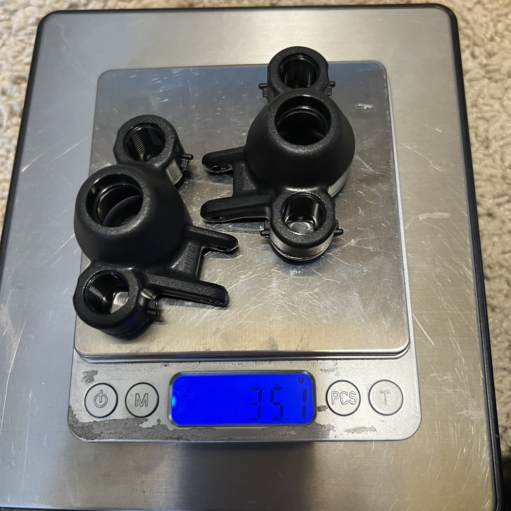 <em>product · 35.1 g/set</em> |
| ⭐ **RPM True Track rear axle carriers** (in the 80562 kit) — *rear, in hand* | Bearings: **same oversized** 6×15×5 / 12×21×5 (included)  Lower mount: **4 mm hinge pin** (not a pillow ball)  Bundled with the rear A-arms (no separate purchase)  Weight (measured): **carriers 32.3 g/pr** + bearings (inner 11.7 + outer 7.3) = **~51.3 g** rear hubs  Warranty: **lifetime** against breakage | Pro: **Comes as part of the True Track deal** (cheaper than buying rear carriers alone), same oversized bearings, and the pin locks rear toe. "Beefy" rear carriers  Con: Only fits the True Track pin geometry; rear toe becomes fixed (see [`arm_analysis.md`](arm_analysis.md)) |  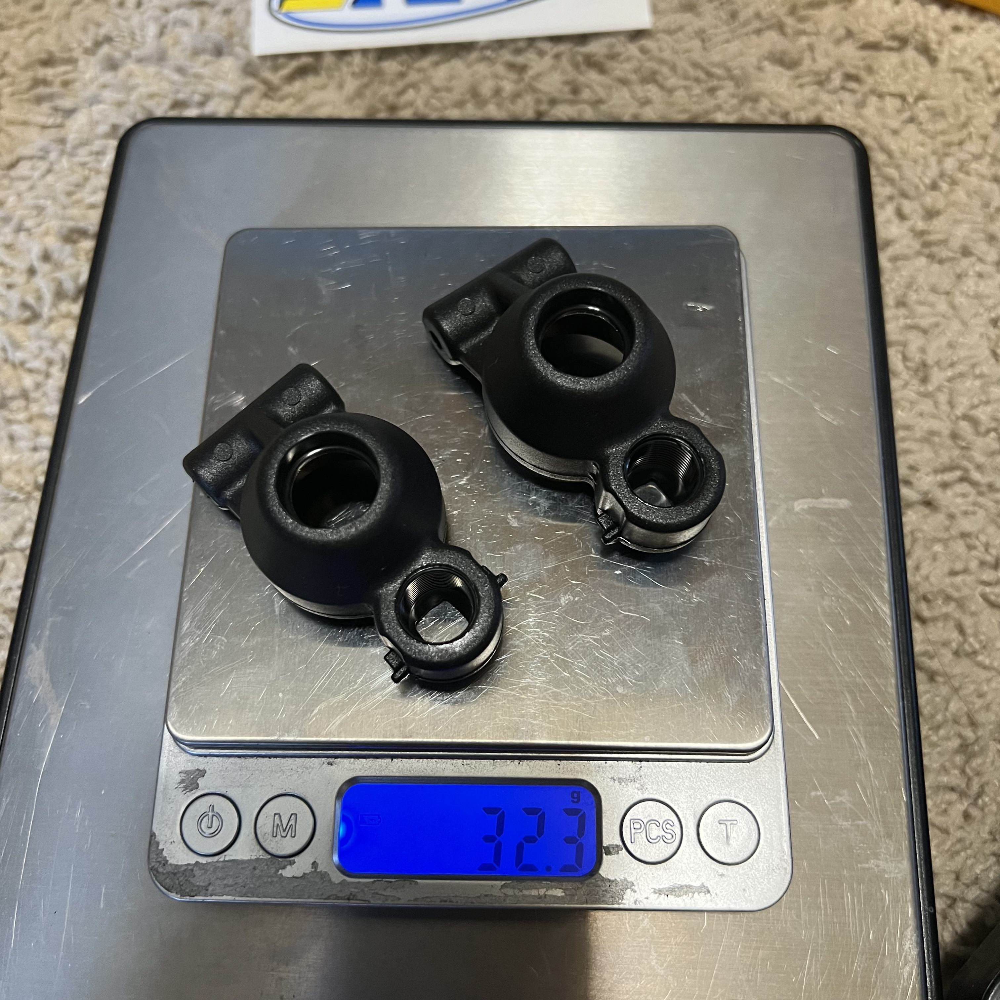 <em>True Track rear · carriers 32.3 g/pr</em> |
| 🔵 **Enron metal carriers** (no part #) — *reference; largest bearings* | Material: **aluminum / metal**  Bearings: **largest — 6×15×5 / 12×21×5 (same as RPM)**  Fits Revo / E-Revo / Summit / T-Maxx / Slayer | Pro: **Metal won't crack**; takes the **same largest 6×15×5 / 12×21×5 bearings as the RPM**  Con: **Heavier than RPM plastic** (more unsprung weight); **no part number** to reorder. Reference only; the build runs RPM | 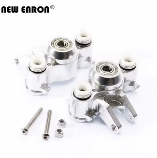 |
| 🔵 **Traxxas 5334R** (metal-reinforced block) — *reference; medium bearings* | Bearings: **medium — 6×13** outer (ships with **6×12 adapters**, 2)  Reinforcement: **metal insert at the pivot-ball / boot seat** (boot sits on the metal, then onto the plastic)  Boot retainer: **blue** (5378X)  Includes **4 dust boot retainers** | Pro: **Metal-reinforced pivot/boot seat** resists pull-through better than stock; steps up to a **bigger 6×13 bearing**; ships with 6×12 adapters + boot retainers  Con: Still a **smaller bearing than RPM/Enron**; plastic body. Reference only; the build runs RPM | 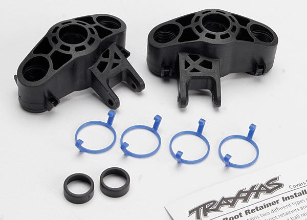 |
| 🔵 **Stock Traxxas carriers** (TRA5334) — *reference; smallest bearings* | Bearings: **smallest — 6×12×4 / 12×18×4**  Block: all-plastic (no metal reinforcement)  Boot retainer: **black** (5378X, a hair smaller)  Price: **$8.00** | Pro: **Cheapest** ($8); uses common stock-size bearings  Con: **All-plastic walls split** and let pillow balls pull through; **smallest bearings wear fastest** on a heavy truck (the reason for moving to RPM). Reference only | 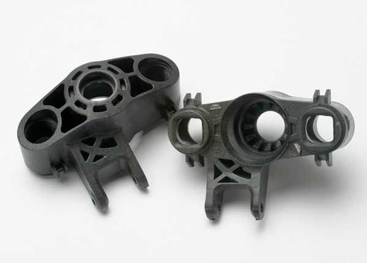 |

> **Bearing-size tiers** (all keep the stock 6 mm / 12 mm bores; OD + width grow going up): stock **TRA5334 = smallest** (6×12×4 / 12×18×4, **black** boot retainer) → Traxxas **5334R = medium** (6×13, **blue** retainer, metal-reinforced seat) → **Enron metal / RPM = largest** (6×15×5 / 12×21×5). Match the **5378X boot retainer color to the block**: black = stock, blue = reinforced.

---

## Carrier Service Parts

> **RPM 80010 Pillow Ball Set Screws & Bushing Caps** — a **service/consumable item**, not pillow balls. Keep a pack on the shelf for the next carrier rebuild. The setscrew + Delrin cap are what **capture the pillow ball inside the carrier**; when they wear you replace just these instead of buying whole new pillow balls (roughly half the cost). The Delrin caps also have **~2× the contact area** on the ball, which helps the **pop-out** problem.

| Part | Spec | Notes | Photo / Link |
|---|---|---|---|
| **RPM 80010** Pillow Ball Set Screws & Bushing Caps | Per pack: **4 aluminum setscrews, 4 Delrin bushing caps, 2 axle spacers** (= 2 carriers; buy **2 packs** for all four corners)  Measured: **alloy setscrews 3.3 g / 4, Delrin caps 1.3 g / 4**  Price: **$6.99** | Fits **stock Traxxas axle carriers** and **RPM oversized-bearing carriers** — the **80582 front** (both pillow balls) and the **True Track rear** (its **upper** pillow ball only; the lower mount is a 4 mm pin, no cap). **Not confirmed** for the Enron alloy carriers (see that candidate row). Direct service replacement for worn setscrews / caps | 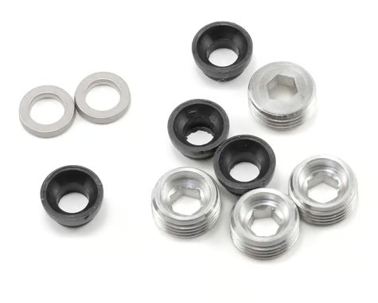 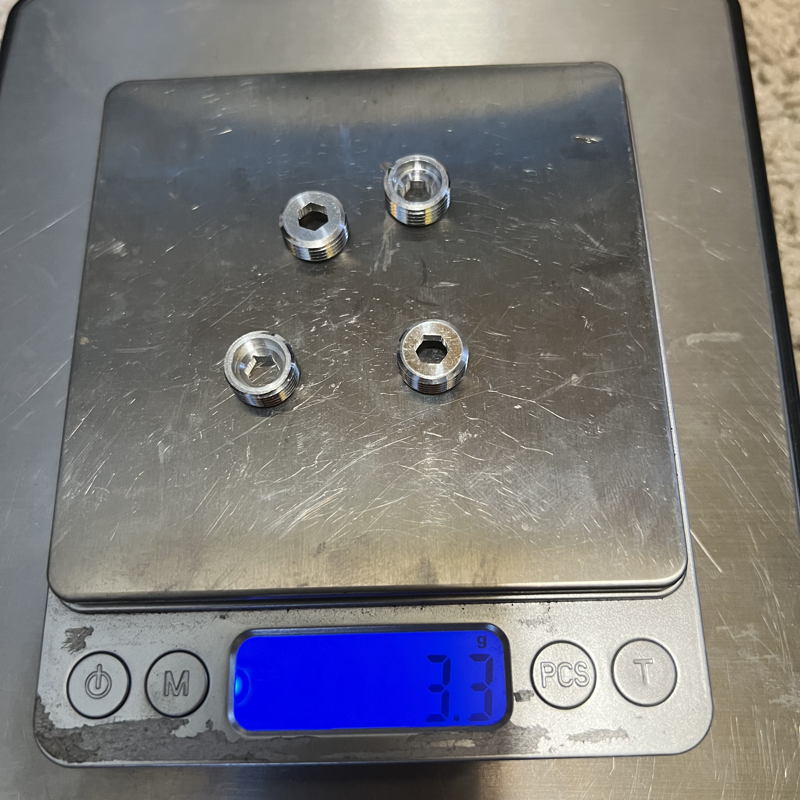 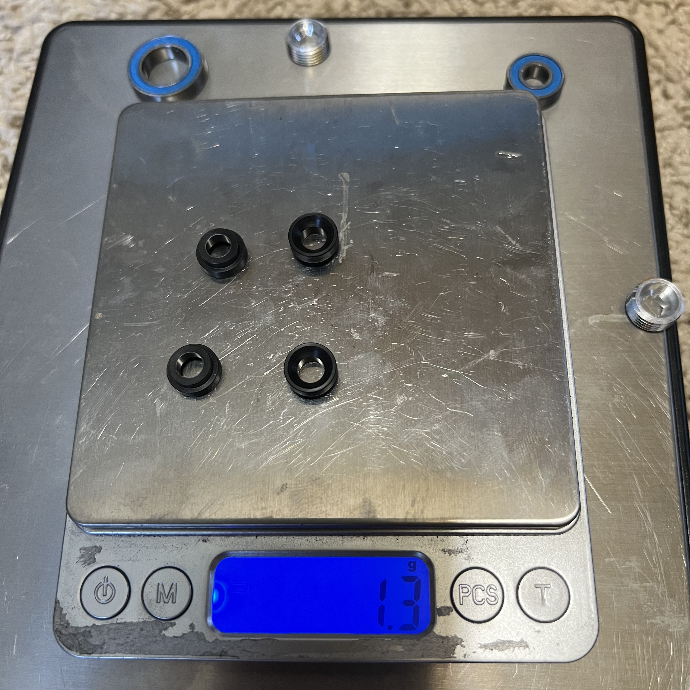 <em>80010 set · setscrews 3.3 g/4 · Delrin caps 1.3 g/4</em> |
| **Traxxas 5378X** Pivot Ball Caps & Dust Boots | Per set: **4 pivot ball caps, 4 rubber dust boots, 4 rubber dust plugs, 4 blue + 4 black boot retainers** (= 2 corners; buy **2 sets** for the whole truck)  Fits: Revo / E-Revo / Summit / Slayer / T-Maxx 3.3  Price: TBD | The **rubber boots + plugs that keep grit out of the pivot balls** — the "boots always rip" wear item from [`arm_analysis.md` → Pillow Balls](arm_analysis.md#pillow-balls). Replace when torn so the pivot balls don't get sandblasted. Blue vs black retainer selection by block type: see [`service_parts_analysis.md`](service_parts_analysis.md#dust-boots) | 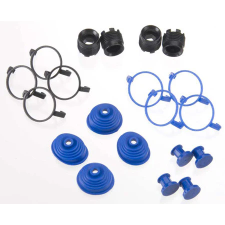 |

---

## Servicing the Hubs

> **Service from the center, not the pillow balls.** For bearings and stub axles you don't disturb the pillow balls at all, which is what keeps them from wearing out.

- Pull the wheel, then the **stub axle and bearings come out the wheel (outboard) side**.
- The **CVD / driveshaft pops out of the diff cup at the center** — that's the disconnect point, so the carrier never has to come off the arms.
- **Pillow balls can stay put.** They're held with **super glue** (threadlock doesn't bite well on a plastic-to-metal thread). You don't need to disturb them for routine service, but you **can break them loose if you want, just reapply glue** when you reinstall.
- When the **setscrew or bushing cap** finally wears, replace those with **RPM 80010** (above), not the whole pillow ball.

---

## Rear Hub: Pin vs Pillow Ball

The rear axle carrier's **lower mount** changes when the [RPM True Track rear arms](arm_analysis.md) go on:

- **Stock:** the lower rear mount is a **pillow ball** (can rotate, so toe drifts).
- **True Track:** the lower pillow ball is **replaced by a 4 mm hinge pin** (cannot rotate, so toe is fixed at 3°).
- The **upper** mount keeps its pillow ball either way, so **camber stays adjustable**.

So on the rear corners, the bottom of the hub runs a **pin**, not a pillow ball. The **rear axle carrier itself ships inside the True Track kit** (with the same oversized bearings), so it's a different hub from the front 80582. See [`arm_analysis.md`](arm_analysis.md) for the full True Track writeup.

---

## Notes

- **Decision: RPM plastic, both ends.** Lighter (less unsprung weight) with a bit of give that protects other parts, worth the marginally lower stiffness. The stock **TRA5334** (smallest bearings), the Traxxas **5334R** (medium, metal-reinforced), and the **Enron metal** carrier (largest, same bearings as RPM) are listed for reference only, not in the running.
- **Stock axles still fit.** The oversized bearings keep the stock 6 / 12 mm bores; only the carrier pockets are bigger.
- **Measured front-end weight** (80582 is used for the **front only**; the rear runs the True-Track carriers + bearings): 2 front steering blocks ≈ **17.6 g** (half the 35.1 g set of 4, estimate) + outer bearings **7.5 g/pr** + inner bearings **11.6 g/pr** + 4 setscrews **3.3 g** + 4 caps **1.3 g** = **≈ 41.3 g built** (~20.6 g per corner). The bearings/setscrews/caps weighed are exactly 2 corners' worth (exact); only the block weight is estimated, so **re-weigh the 2 front blocks alone** to lock it. *(Reference: the full 80582 set of 4 fully built ≈ 82.5 g, but only the two fronts are used here.)*
- **Don't order stock bearing sizes** (TRA5117 6×12×4 / TRA5120 12×18×4) for these carriers, they're too small. Those still get stocked for the [Jato 4x4](../FastAzJato4x4/README.md), which runs them.
- **80582 package (in hand):** RPM card, **made in USA**; fits Revo / T-Maxx 2.5R & 3.3 / E-Maxx 16.8. Carrier set of 4 weighs **35.1 g**. Price paid: **$23.75 (PowerHobby)** — the $34.95 on the card is just the sticker, not what was paid. See [package photo](src/steering_rpm_axle_carriers_steering_blocks_80582_package.jpg).
