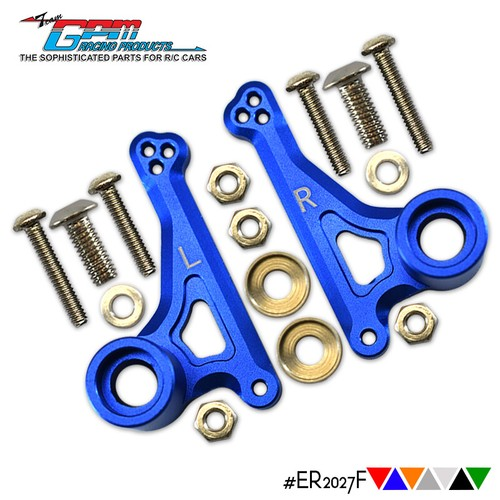
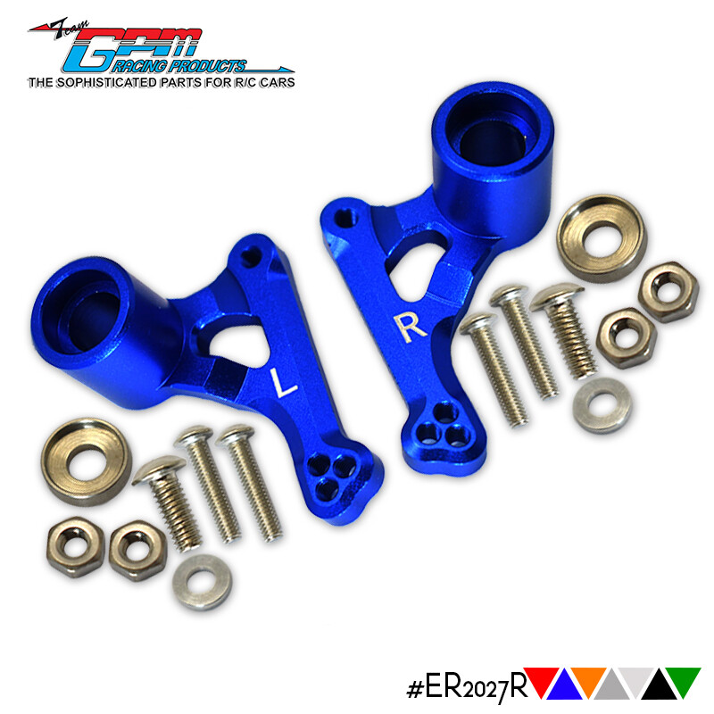
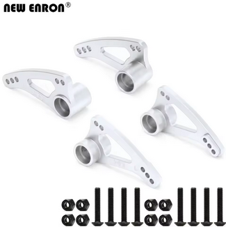

# Suspension Rocker Selection — E-Revo 1.0

> **Chosen: Enron aluminum #5358 (Progressive 2, 90-T) — full front + rear set** — the plastic OEM rockers fail regularly (going through **4–5 sets a year**), so durability wins over weight. The alloy adds only **~4–6 g per corner** (~22 g across the whole car) and never cracks. Bonus: it threads into **replaceable steel hex inserts**, so a stripped thread = swap a cheap hex, not the rocker. **Paid $14.31** for the silver 4P (front + rear) set — a steal vs $11 for plastic, and it stops the yearly replacement cycle. All rockers stay **Progressive 2 (90-T)**.

 <em>Enron aluminum #5358, Progressive 2 — pair + hardware 32.0 g</em>

---

## Table of Contents

- [Key Requirements](#key-requirements)
- [Rocker Comparison](#rocker-comparison) — aluminum vs plastic, front + rear weights
- [Notes](#notes)

---

## Key Requirements

| Requirement | Type | Why |
|---|---|---|
| **Crack-resistant** | Must | Plastic rockers fail ~4–5 sets/year — durability is now the deciding factor |
| **Progressive 2 (90-T) rate** | Must | Whole car is set up on the Progressive 2 rocker rate — any swap has to match |
| **Fits E-Revo 1.0 front + rear towers** | Must | #5358 fits the Revo / E-Revo / E-Revo 2.0 / Slayer Pro / Summit family |
| **Lightweight** | May | Rockers are moving suspension mass; lighter is nicer, but secondary to not breaking |

---

## Rocker Comparison

| Rocker | Spec | Pros / Cons | Photo / Link |
|---|---|---|---|
| ⭐ **Enron aluminum #5358** (Progressive 2, front + rear) — *silver, in hand* | Material: CNC aluminum  Weight (single, bare): **13.7 g front / 13.5 g rear**  + hardware: **~2.5 g/rocker** (~5 g per pair)  Rate: **Progressive 2 (90-T)**  Colors: silver / orange / green / red / blue  Price: **$14.31 paid** (silver 4P, May 2026); list ~$25–27.85 | Pro: **Won't crack** — ends the 4–5-sets-a-year plastic replacement cycle. **Replaceable steel hex inserts** where the bolt threads, so a stripped thread = swap the cheap hex, not the rocker  Con: **+4.4 g front / +6.5 g rear per corner** over plastic (bare); steel hardware adds more; 2×+ the price; not sacrificial — passes impact to the tower |    <em>single bare 13.5 g · pair + hardware 32.0 g · 32.3 g bagged</em> |
| 🔵 **GPM aluminum** (ER2027F front / ER2027R rear) | Material: CNC aluminum  MPN: **ER2027F** (front) / **ER2027R** (rear) — sold as separate sets  Pivot: **brass bushings**, 3-hole adjustable mount  Fits: E-Revo 1.0 (56087-1) / VXL 2.0  Colors: blue / orange / grey / black / green  Price: **$26.01/set** ($23.41 ea at 4+) — ~$52 for front + rear | Pro: **Brass bushings** for a smooth pivot; captures the push-rod ball end **similar to the Enron kit**; multi-hole adjustable shock mount  Con: **Single fork** (one prong) vs the OEM's two-sided capture — the ball/bolt is supported on only one side, so **the bolts bend** (and the fork can snap); ~$52 front + rear is **3–4× the Enron's $14.31**; bought as separate front/rear sets |   <em>GPM front #ER2027F · rear #ER2027R</em> |
| 🔵 **Enron multi-mount long-travel** #5358 (Hot Racing-style) | Material: CNC aluminum  Style: **multi-mount, long-travel** (4-hole adjustable arm)  Fits: Revo 3.3 / E-Revo 2.0 / Slayer Pro / Summit  Colors: silver / blue  Price: **$26.18 set** (list $41.56), extra 10% at 10+ | Pro: **Adjustable multi-mount** for tuning travel/leverage; **likely lighter** than the standard alloy (unconfirmed); same brand as the chosen Enron  Con: **Same single-fork design as the GPM** — one-sided capture **bends the bolts**; "long travel" geometry is a **different intent** than a stock-rate replacement; pricier than the $14.31 standard 4P |  <em>New Enron multi-mount long-travel #5358 (front + rear, silver)</em> |
| 🥈 **Traxxas OEM plastic #5358** (Progressive 2, front + rear set) — *lighter fallback* | Material: glass-filled composite  Weight (single, bare): **9.3 g front / 7.0 g rear**  Rate: **Progressive 2 (90-T)**  Includes: 8 red aluminum spacers  Price: **$11.00** (full set) | Pro: **Lightest option**, cheap, OEM-correct, comes with the spacer set, sacrificial in crashes  Con: **Cracks regularly — 4–5 sets/year**, which is exactly why it's no longer the pick |   <em>front 9.3 g · rear 7.0 g</em> |

> **Buying note:** the Enron listing sells **4P** (front + rear, 4 arms) or **2PCS** (front-only or rear-only). Fits Traxxas 1/10 Revo / E-Revo / E-Revo 2.0 / Slayer Pro 4X4 / Summit.

---

## Notes

- **Why aluminum won:** plastic OEM rockers crack and get replaced **4–5 times a year**. At $11/set that's ~$44–55/yr in plastic plus the downtime; one $14.31 alloy set that doesn't break ends the cycle. The ~22 g weight penalty is an easy trade for not rebuilding rockers every few months.
- **Both are #5358.** Traxxas OEM (#5358, $11) is the *Progressive 2 (90-T) Rocker Arm Set & Spacers* — the full front + rear set with 8 red aluminum spacers. Enron reuses the same #5358 number for its aluminum clone.
- **All rockers are Progressive 2 (90-T).** Don't mix rates front-to-rear unless deliberately tuning — the whole setup assumes Progressive 2.
- **GPM vs Enron (alloy vs alloy).** Both run bushings and capture the push-rod ball end. The GPM differs in using a **single fork** where the OEM uses two prongs to trap the ball — and that single fork is **known to bend and snap off**, which is a real failure point on a heavy E-Revo. Add the price gap (~$52 front + rear vs Enron's $14.31) and the Enron wins clearly; GPM's only edge is the multi-hole adjustable mount and brass bushings.
- **Single-fork alloys share one weakness — the bolts bend.** Both the GPM and the Enron multi-mount long-travel (Hot Racing-style) use a **single fork** to capture the push-rod ball, so the ball/bolt is supported on **only one side**. That cantilever **bends the bolts** (and can snap the fork) — a design flaw, not a one-off. The standard Progressive-2 Enron set avoids it with a fuller, two-sided capture, which is a big part of why it's the pick. The multi-mount's only draws are adjustability and (maybe) lower weight, but it also changes the suspension to a long-travel geometry rather than a stock-rate swap.
- **The alloy's best feature is the replaceable steel hex insert.** The bolt threads into a steel hex pressed into the aluminum, so if you strip a thread you swap a cheap steel hex instead of the whole rocker (per the listing review).
- **Keep a plastic set as a spare** — it's the lighter, sacrificial option if you ever want to drop weight for a specific track, and it's cheap insurance.
- **Linkage shimming + wear strategy.** Running metal Hot Bodies D8 shocks makes it easy to shim the shock end with **M3×1 mm shims** to keep it centered on the rocker. The push-rod rod ends are **RPM** (plastic), so all the stretch and abuse is consolidated onto a cheap, quick-swap part. Same philosophy as the unbreakable alloy rocker — push the wear onto whatever's cheapest to replace, and maintenance stays cheap.
- **Enron buying:** list ~$25.18–27.85, $20.14 each at 3+ pieces; sold as 4P (front + rear) or 2PCS sets in silver/orange/green/red/blue. **Paid $14.31** for the silver 4P set (order #8210685132674866, May 10 2026).
