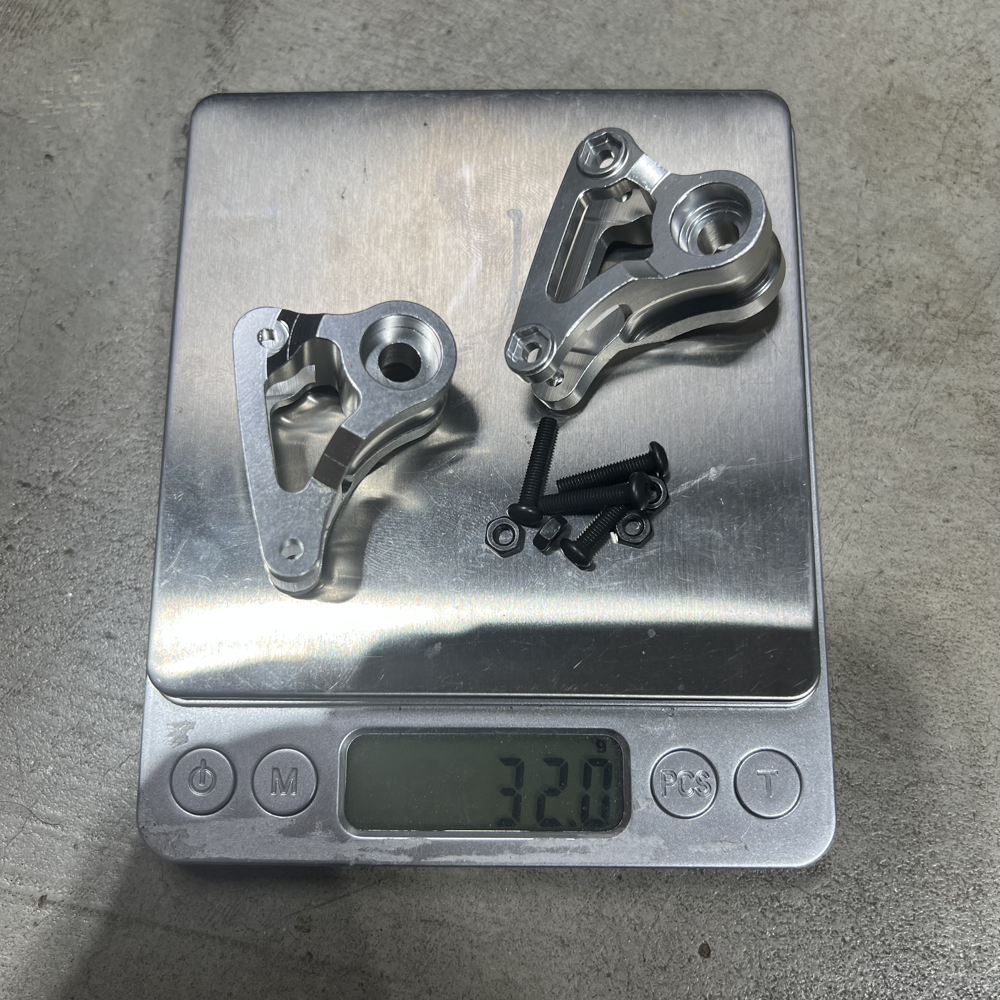
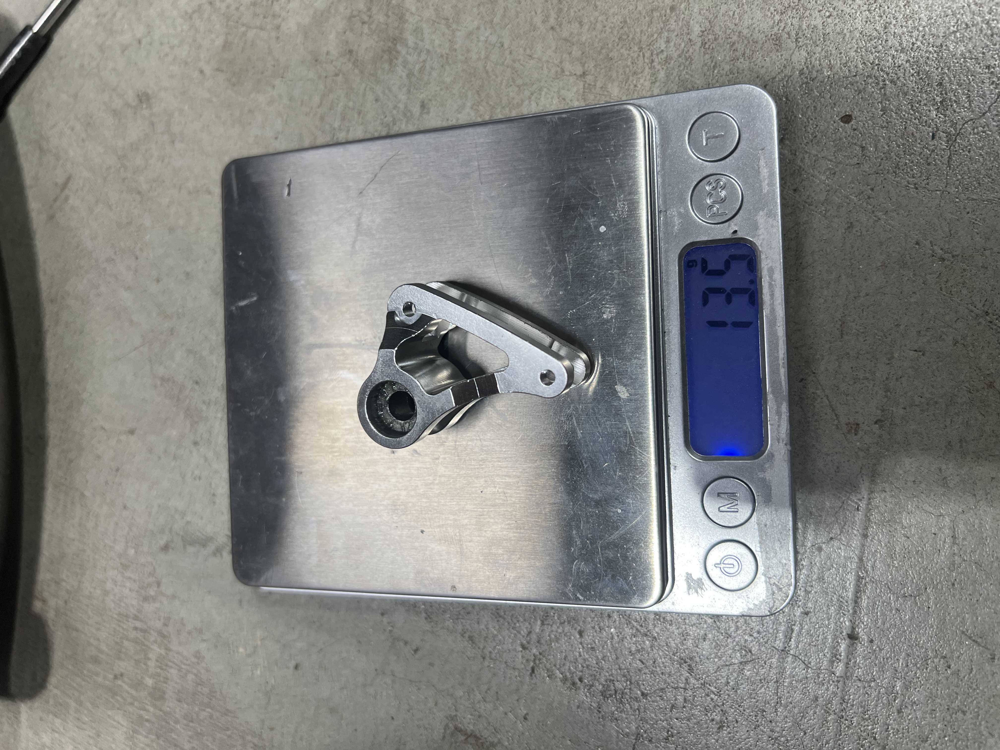
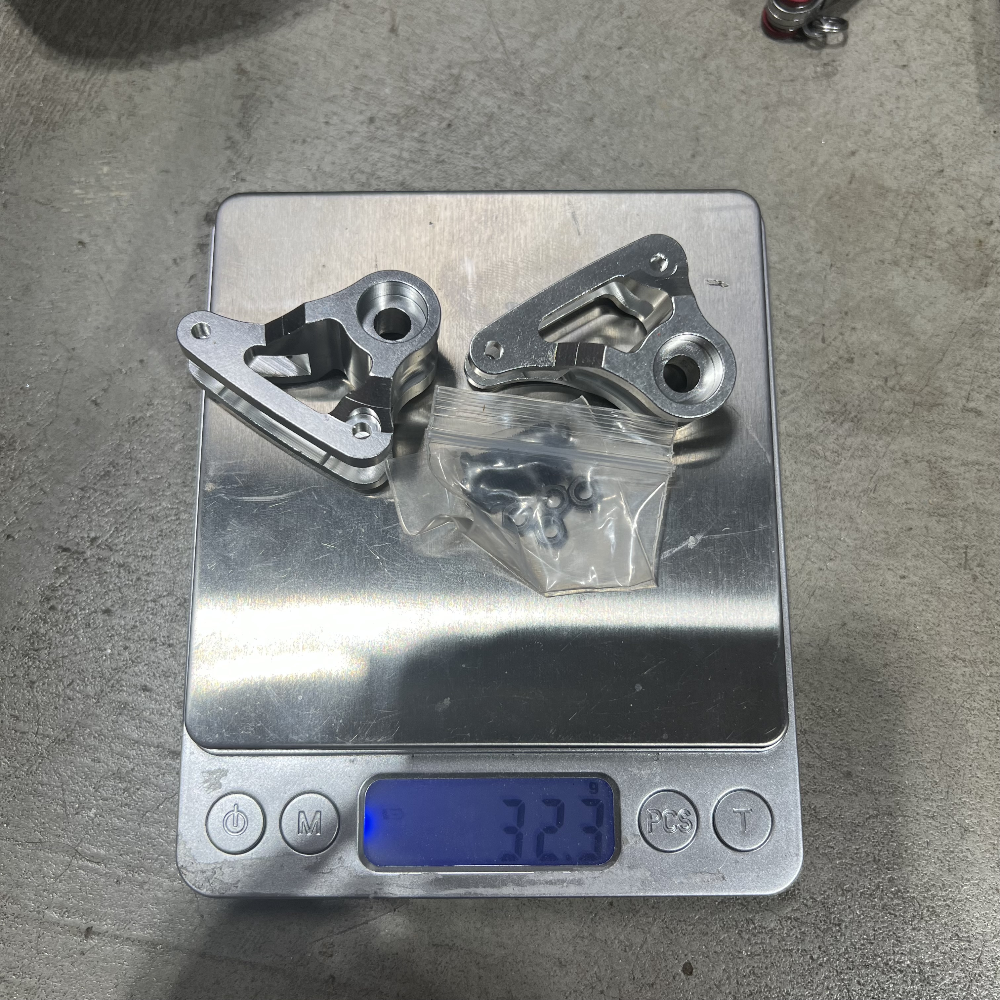
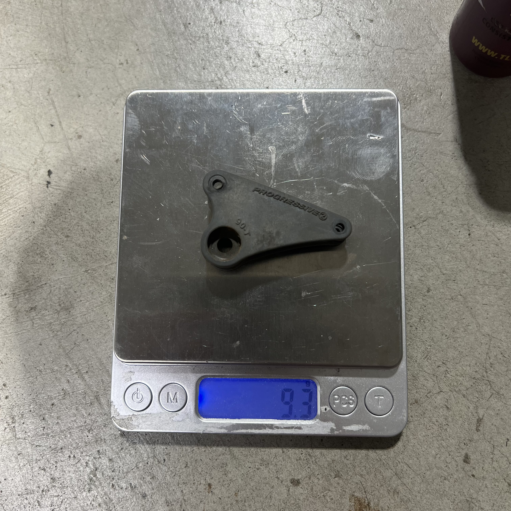
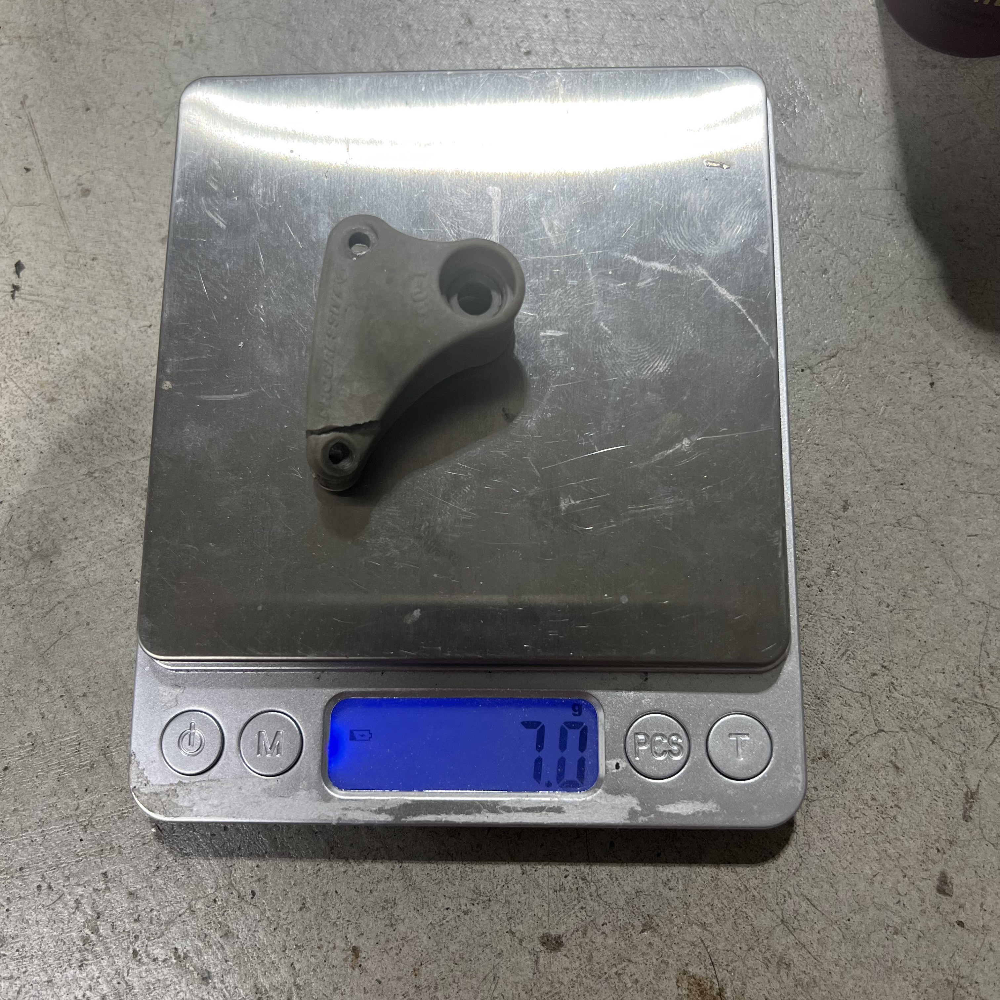

# Suspension Rocker Selection — E-Revo 1.0

> **Chosen: Enron aluminum #5358 (Progressive 2, 90-T) — full front + rear set** — the plastic OEM rockers fail regularly (going through **4–5 sets a year**), so durability wins over weight. The alloy adds only **~4–6 g per corner** (~22 g across the whole car) and never cracks. Bonus: it threads into **replaceable steel hex inserts**, so a stripped thread = swap a cheap hex, not the rocker. ~$24.48/set vs $11 for plastic, but it stops the yearly replacement cycle. All rockers stay **Progressive 2 (90-T)**.

  &nbsp; 
  <em>Enron aluminum #5358, Progressive 2 — pair + hardware 32.0 g · single bare 13.5 g</em>

---

## Table of Contents

- [Key Requirements](#key-requirements)
- [Rocker Comparison](#rocker-comparison) — aluminum vs plastic, front + rear weights
- [Notes](#notes)

---

## Key Requirements

| Requirement | Type | Why |
|---|---|---|
| **Crack-resistant** | Must | Plastic rockers fail ~4–5 sets/year — durability is now the deciding factor |
| **Progressive 2 (90-T) rate** | Must | Whole car is set up on the Progressive 2 rocker rate — any swap has to match |
| **Fits E-Revo 1.0 front + rear towers** | Must | #5358 fits the Revo / E-Revo / E-Revo 2.0 / Slayer Pro / Summit family |
| **Lightweight** | May | Rockers are moving suspension mass; lighter is nicer, but secondary to not breaking |

---

## Rocker Comparison

| Rocker | Spec | Pros / Cons | Photo / Link |
|---|---|---|---|
| ⭐ **Enron aluminum #5358** (Progressive 2, front + rear) | Material: CNC aluminum  Weight (single, bare): **13.7 g front / 13.5 g rear**  + hardware: **~2.5 g/rocker** (~5 g per pair)  Rate: **Progressive 2 (90-T)**  Colors: silver / orange / green / red / blue  Price: **$24.48** sale ($27.85 list), $20.14 ea ≥3pcs | Pro: **Won't crack** — ends the 4–5-sets-a-year plastic replacement cycle. **Replaceable steel hex inserts** where the bolt threads, so a stripped thread = swap the cheap hex, not the rocker  Con: **+4.4 g front / +6.5 g rear per corner** over plastic (bare); steel hardware adds more; 2×+ the price; not sacrificial — passes impact to the tower |   <em>pair + hardware — 32.0 g · 32.3 g bagged</em> |
| 🥈 **Traxxas OEM plastic #5358** (Progressive 2, front + rear set) — *lighter fallback* | Material: glass-filled composite  Weight (single, bare): **9.3 g front / 7.0 g rear**  Rate: **Progressive 2 (90-T)**  Includes: 8 red aluminum spacers  Price: **$11.00** (full set) | Pro: **Lightest option**, cheap, OEM-correct, comes with the spacer set, sacrificial in crashes  Con: **Cracks regularly — 4–5 sets/year**, which is exactly why it's no longer the pick |   <em>front 9.3 g · rear 7.0 g</em> |

> **Buying note:** the Enron listing sells **4P** (front + rear, 4 arms) or **2PCS** (front-only or rear-only). Fits Traxxas 1/10 Revo / E-Revo / E-Revo 2.0 / Slayer Pro 4X4 / Summit.

---

## Notes

- **Why aluminum won:** plastic OEM rockers crack and get replaced **4–5 times a year**. At $11/set that's ~$44–55/yr in plastic plus the downtime; one $24.48 alloy set that doesn't break ends the cycle. The ~22 g weight penalty is an easy trade for not rebuilding rockers every few months.
- **Both are #5358.** Traxxas OEM (#5358, $11) is the *Progressive 2 (90-T) Rocker Arm Set & Spacers* — the full front + rear set with 8 red aluminum spacers. Enron reuses the same #5358 number for its aluminum clone.
- **All rockers are Progressive 2 (90-T).** Don't mix rates front-to-rear unless deliberately tuning — the whole setup assumes Progressive 2.
- **The alloy's best feature is the replaceable steel hex insert.** The bolt threads into a steel hex pressed into the aluminum, so if you strip a thread you swap a cheap steel hex instead of the whole rocker (per the listing review).
- **Keep a plastic set as a spare** — it's the lighter, sacrificial option if you ever want to drop weight for a specific track, and it's cheap insurance.
- **Enron buying:** $24.48 on sale ($27.85 list), or $20.14 each at 3+ pieces; sold as 4P (front + rear) or 2PCS sets in silver/orange/green/red/blue.
