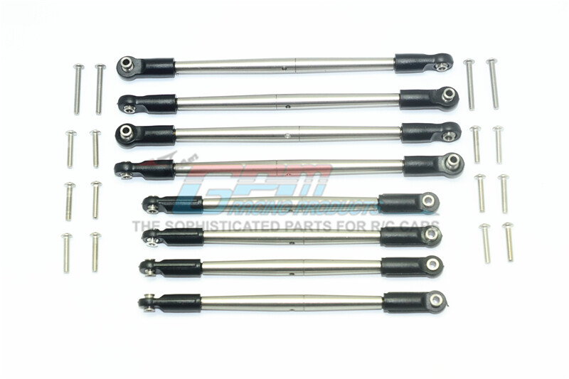
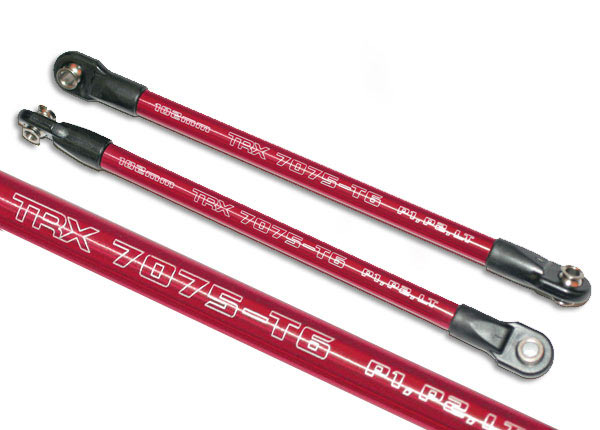
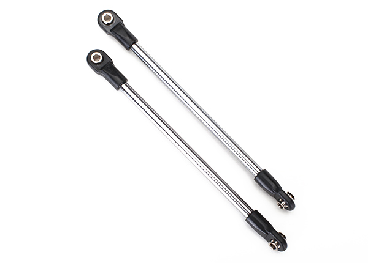
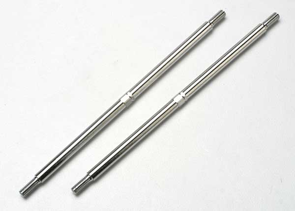
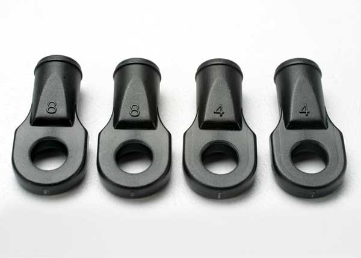
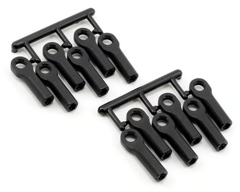
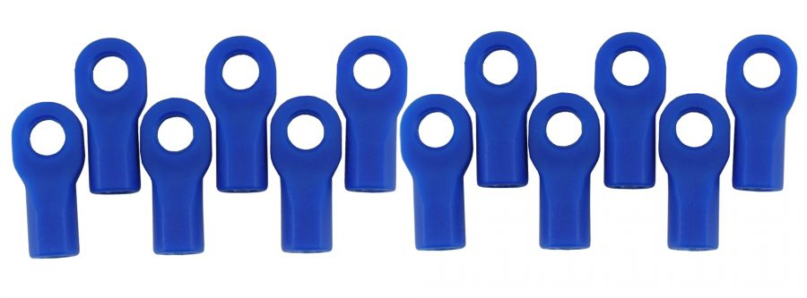
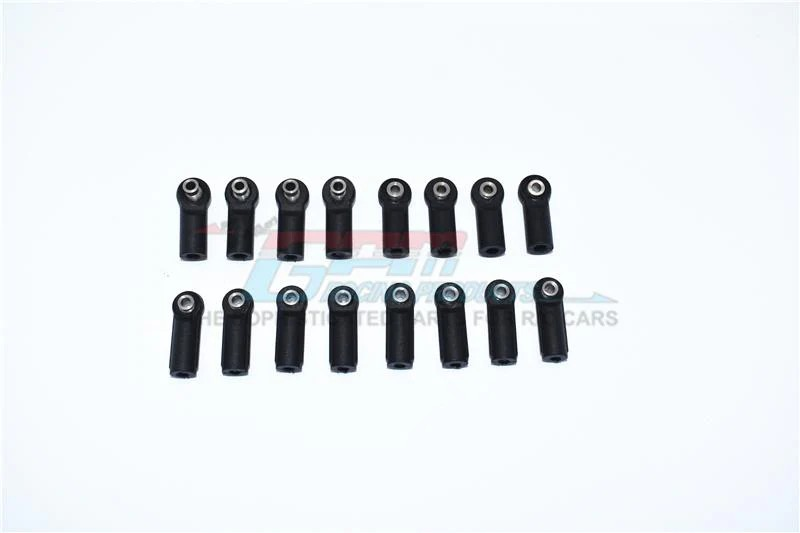

# Rod & Rod-End Selection — E-Revo 1.0

> **Chosen: GPM stainless steel adjustable tie rods & push rods (8-pc set)** — the only setup I've run where I've **never bent a rod**, and it works **far better than both stock and the Traxxas aluminum rods**. MPN **ER2160S-OC-BEBK**, $37.29. It's listed for the E-Revo 2.0 VXL but **fits the 1.0 too** — the rods are the same eye-to-eye length across both. Pair them with **RPM rod ends** in place of the stock ends: stock ends are stiff and decent but break eventually, while RPM ends last longer and deliberately take the stress, so neither the rods nor the ends fail.

 <em>GPM stainless adjustable tie rods & push rods, 8-pc set (#ER2160S-OC-BEBK)</em>

---

## Table of Contents

- [Key Requirements](#key-requirements)
- [Rod Comparison](#rod-comparison) — stainless vs aluminum vs stock
- [Rod Ends](#rod-ends) — stock vs RPM
- [Notes](#notes)

---

## Key Requirements

| Requirement | Type | Why |
|---|---|---|
| **Won't bend** | Must | Bent rods are the #1 linkage failure on a heavy E-Revo — stainless steel holds where aluminum folds |
| **Corrosion / rust resistant** | Must | Car is **regularly driven at the beach** — salt and sand rust plain steel fast; stainless rods + plastic ends shrug it off |
| **Adjustable (turnbuckle)** | Must | Set toe / camber-link length without buying fixed rods |
| **Correct eye-to-eye length** | Must | Must match the E-Revo geometry — the GPM set fits both 1.0 and 2.0 |
| **Replaceable rod ends** | May | The rod end should be the cheap sacrificial wear point, swappable on its own |

---

## Rod Comparison

| Rod set | Spec | Pros / Cons | Photo / Link |
|---|---|---|---|
| ⭐ **GPM stainless steel** (8-pc tie + push rod set) | Material: **stainless steel**  MPN: **ER2160S-OC-BEBK**  Fits: E-Revo **1.0 & 2.0** (same eye-to-eye)  Adjustable turnbuckles  Price: **$37.29** (8 pc) | Pro: **Never bent one** — strongest of the three. Stainless won't rust, fully adjustable, and it's a **full kit** — every tie rod and push rod for the whole car in one box (all 8). Works **far better than stock or aluminum**  Con: Priciest option and **noticeably heavier** overall than aluminum/stock — a weight I accept for the strength; comes with stiff plastic ends I swap for RPM |  |
| 🔵 **Traxxas aluminum pushrods** (TRA5318X) | Material: **7075-T6 aluminum** (red)  Length: **102 mm**, 2 rods/pack (buy 2 for front + rear)  Fits: P1 / **P2** / LT rockers — Revo / E-Revo / Summit  Price: **$12.50** (2 rods) | Pro: Light, looks good, rod ends pre-installed, **correct for the Progressive-2 rockers**  Con: **Aluminum bends** on hard hits — the exact failure the GPM stainless eliminates; **pushrods only** (no tie rods in the pack) |  <em>TRA5318X red 7075-T6 pushrods, 102 mm (2)</em> |
| 🔵 **Traxxas stock rods** (steel) | Pushrods: **TRA5318** (2, **$7**)  Toe links: **TRA5338** (2, **$10**)  Rod ends: **TRA5348** large (4, **$2**)  Material: plain steel | Pro: Came on the car, **steel pushrods don't bend** like aluminum, dirt cheap  Con: **Plain steel rusts at the beach** (not stainless); stock rod ends break eventually — the GPM stainless is the corrosion-proof, full-kit step up |    <em>pushrods TRA5318 · toe links TRA5338 · rod ends TRA5348</em> |

---

## Rod Ends

The rod end is meant to be the **cheap, sacrificial wear point** — let it take the abuse so the rods (and everything upstream) survive. Same philosophy as the [aluminum rockers](rocker_analysis.md) and the [shock linkage](shock_analysis.md#linkage--shimming--rod-ends): push the wear onto whatever's cheapest to replace.

| Rod end | Pros / Cons | Photo |
|---|---|---|
| ⭐ **RPM long rod ends** (RPM80512, 12-pc) | Pro: **Bulletproof RPM material — last far longer** than stock and deliberately **take the stress**, so the ends fail before the rods. **Thicker around the ball stud**, and the shank has flats that make them easy to thread on. Cheap at **$9.99 / 12**  Con: **Must trim ~5 mm to match the original rod-end length**; sold **without pivot balls** — reuse the stock Traxxas hollow balls. Slightly more give than a stiff stock end |  <em>RPM80512 long turnbuckle rod ends (black, 12)</em> |
| 🔵 **RPM short rod ends** (RPM80472, 12-pc) | Pro: Same tough RPM material and shank flats; **fit the stock/original pushrods directly** (replace **TRA5347**), no trimming. Cheap at **$8.95 / 12**  Con: **Too short on their own for the GPM stainless rods** — pair with a long to reach 102 mm (see notes); sold **without pivot balls** (reuse stock Traxxas balls) |  <em>RPM80472 short rod ends (12)</em> |
| 🔵 **GPM plastic ball ends** (ER2160S-BE-BK, 16-pc) | Pro: **Stiff and decent** when new — precise feel; cheap at **$13.90 / 16**. These are the ends the GPM rods ship with  Con: **Break eventually**; once they go you're replacing them more often than RPM ends |  <em>GPM ER2160S-BE-BK — 16 black plastic ball ends</em> |

---

## Notes

- **Fits both E-Revo 1.0 and 2.0.** The listing is for the 2.0 VXL (86086-4), but the rods are the same eye-to-eye length, so the set drops onto the 1.0 too.
- **Why stainless over aluminum:** aluminum turnbuckles look nice and save a few grams, but they **bend** on hard landings — the exact failure this set eliminates. Stainless steel is the right call on a heavy truck that hits hard.
- **Beach-proof:** this car gets driven at the **beach** regularly, so corrosion matters as much as strength. **Stainless steel won't rust** in salt/sand, and the **plastic RPM/GPM rod ends can't rust at all** — the whole linkage is corrosion-proof. Plain steel rods would be a bad call here. Still, rinse and dry the car after beach runs to keep salt out of the bearings and metal hardware elsewhere.
- **Weight trade-off:** the stainless rods are **noticeably heavier** overall than aluminum or stock — I chose **strength over weight** (no bending, no rust beats saving a few grams on this truck).
- **Swap the ends to RPM.** The GPM set ships with stiff plastic ends; replace them with **RPM rod ends** so the linkage wear lands on a cheap, easy-to-replace part and the rods stay straight.
- **RPM fitment:** the **long** ends (RPM80512) replace **TRA5525**; the **short** ends (RPM80472) replace **TRA5347**. Both come **without pivot balls**, so reuse the **stock Traxxas hollow balls**.
- **RPM short fits the stock pushrods directly** — on the original Traxxas pushrods the short ends are the right length as-is.
- **For the GPM stainless rods, target 102 mm** (the stock pushrod length) — the short ends alone are too short here. Two ways to get there:
  - **My way (trim):** run **two RPM long ends and chop ~5 mm off each**.
  - **No-cut:** run **one RPM long + one RPM short** per rod — that combo lands **exactly 102 mm** with no cutting (thread them so the bases cover all the exposed threads).
- **Order:** GPM stainless tie rods & push rods, 8-pc set, $37.29 — ordered Jun 30 2025 (eBay, seller hebendj), in hand.
