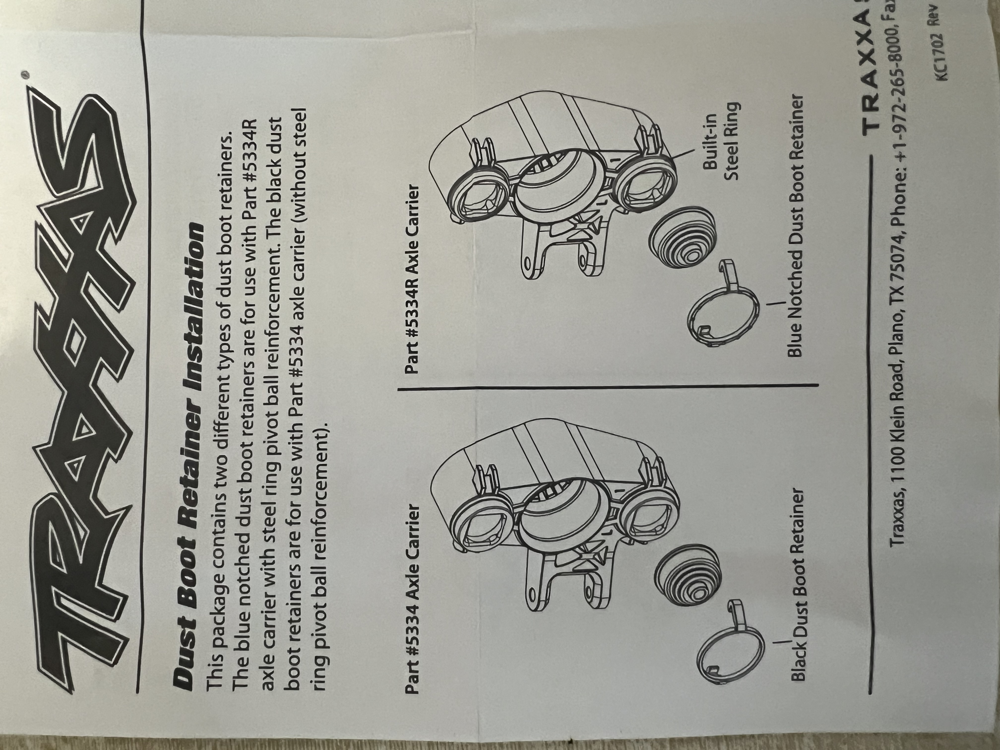
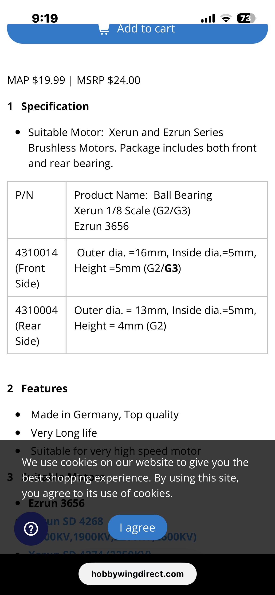

# Service / Wear Parts — E-Revo 1.0

> Consumables and rebuild parts to keep on the shelf: **dust boots, driveshafts, pushrod ends + balls, and bearings.** What wears, what to restock, and what to skip. Pairs with the selection docs ([hub](hub_analysis.md), [arm](arm_analysis.md), [rod](rod_analysis.md)).

   
  <em>Traxxas 5378X pivot-ball cap set: caps, rubber boots, dust plugs, and both blue + black boot retainers</em>

---

## Table of Contents

- [Dust Boots](#dust-boots) — pivot-ball boot rebuild (5378X), and why the driveshaft-boot kits are skipped
- [Driveshafts](#driveshafts) — CVDs, not the stock plastic shafts
- [Pushrod Ends & Balls](#pushrod-ends--balls) — see rod_analysis
- [Bearings](#bearings) — oversized set; the 5334R 6×13 exception
- [Motor Bearings](#motor-bearings) — 4278SD replacement bearings (Hobbywing kit)

---

## Dust Boots

**Rebuilding the pivot-ball boots.** The kit is **Traxxas 5378X** — and it's confirmed the **pivot-ball / suspension-joint** boot kit (Traxxas: "protects the steering pivot balls and suspension joints"), **not** a driveshaft-boot kit. That's the right part for this job, since the driveshaft boots are skipped (below).

- **What's in 5378X:** pivot ball caps (4), rubber dust boots (4), rubber dust plugs (4), **boot retainers in two colors: black (4) + blue (4)**. **2 packages** complete a truck. It's the **only Traxxas kit that ships both retainer colors together.**
- **What the clips do:** the retainer traps the boot lip so suspension cycling and wheel spin can't pop the boot off, keeping dirt and water out of the joint.
- **Clip selection by axle-carrier type** (per the official Traxxas *Dust Boot Retainer Installation* sheet — the 5378X kit ships both):

| Retainer | Axle carrier | Reinforcement |
|---|---|---|
| **Black** | **#5334** | No steel-ring pivot-ball reinforcement |
| **Blue (notched)** | **#5334R** | **Built-in steel ring** pivot-ball reinforcement |

  > So the **blue notched** retainer is specifically for the **steel-ring-reinforced 5334R** block; **black** for the plain **5334** (user note: black is also a hair smaller). The front runs **RPM 80582** blocks (see [hub_analysis](hub_analysis.md)), so test-fit both and use whichever seats cleanly.

 <em>Traxxas Dust Boot Retainer Installation sheet: black → #5334, blue notched → #5334R (built-in steel ring)</em>

### Driveshaft boots — skipped, on purpose

| Part | What | Use here? |
|---|---|---|
| **5459** Rubber driveshaft boots (2) | Bare boots, **stretch on, no clips** | ❌ **No** — these are for the **original plastic shafts**, and this truck runs **CVDs** |
| **5129** Steel CV driveshaft rebuild kit | Pins + dust boots + grease | ❌ **Not worth it** — ~$7 on Traxxas for just boots + grease, and axles already run ~**$5 each** |

> Note: the stock driveshaft boots use **no clips** (they just stretch on), unlike the clipped pivot-ball boots in 5378X.

---

## Driveshafts

Running **CVDs**, not the stock plastic dogbone shafts. That's why the driveshaft-boot kits above (5459 / 5129) don't apply — the rebuild path and boots are different, and at ~$5/axle it's cheaper to replace than to fuss with the 5129 rebuild kit. Full driveshaft notes live with the build; this section is just the service/restock pointer.

---

## Pushrod Ends & Balls

Wear items (rod ends, ball studs) are covered in **[`rod_analysis.md`](rod_analysis.md)** — see that doc for the pushrod/tie-rod selection and the rod-end choices. Listed here so the service-parts list is complete in one place.

---

## Bearings

The hubs run the **oversized** set: **6×15×5 outer / 12×21×5 inner** (same front and rear). Buy in bulk off AliExpress; they rarely wear. Full detail + measured weights in **[`hub_analysis.md` → Bearing Size Comparison](hub_analysis.md#bearing-size-comparison)**.

> ⚠️ **Carrier bearing sizes differ — three tiers.** Stock **TRA5334** = smallest (6×12×4 / 12×18×4, black boot retainer); Traxxas **5334R** (metal-reinforced seat) = medium (**6×13**, ships with 6×12 adapters + 4 boot retainers, blue retainer); **Enron metal / RPM** = largest (**6×15×5 / 12×21×5**). Don't mix bearings between carrier types. Full carrier table in [`hub_analysis.md`](hub_analysis.md).

---

## Motor Bearings

The **Hobbywing 4278SD G2R** motor (see [`esc_analysis.md`](esc_analysis.md#motor-comparison)) spins on two ball bearings, both **5 mm bore**. Replacement kit: **Hobbywing Ball Bearing set — Xerun 1/8 (G2/G3) / Ezrun 3656** (fits the 4278SD). Includes both.

| Position | Size (ID×OD×W) | Hobbywing P/N |
|---|---|---|
| **Front** (drive end) | **5×16×5 mm** | 4310014 (G2/G3) |
| **Rear** | **5×13×4 mm** | 4310004 (G2) |

- Made in Germany, rated for very-high-speed motors, long life.
- ~**$19.99** MAP ($24 MSRP), Hobbywingdirect. Keep a set on the shelf; motor bearings are a wear item on a dusty track.
- **Generic equivalent:** any **5×16×5** and **5×13×4** ball bearing fits (buy cheaper in bulk off AliExpress like the hub bearings); the OEM kit is German and high-speed rated if you want the nicer ones.

 <em>Hobbywing 4278 / Xerun 1/8 motor bearing kit: front 5×16×5 (4310014) · rear 5×13×4 (4310004)</em>

