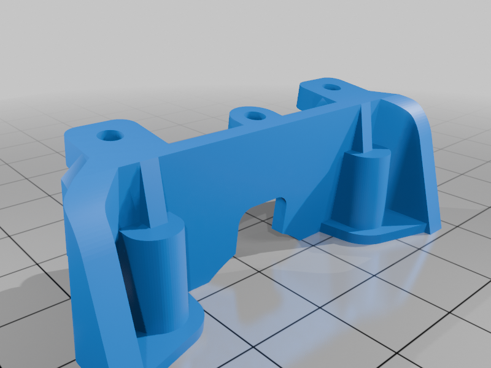
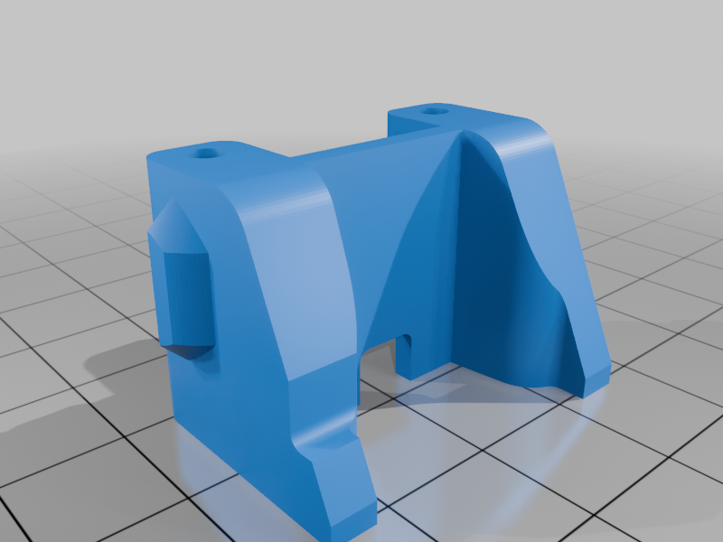
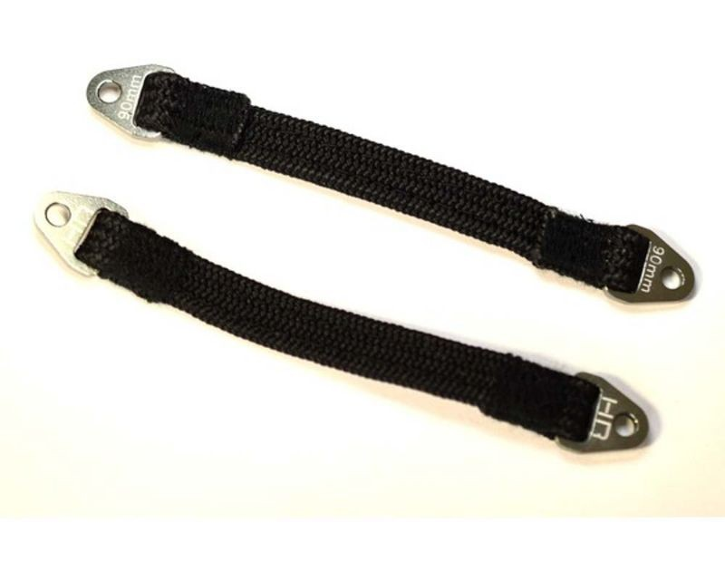
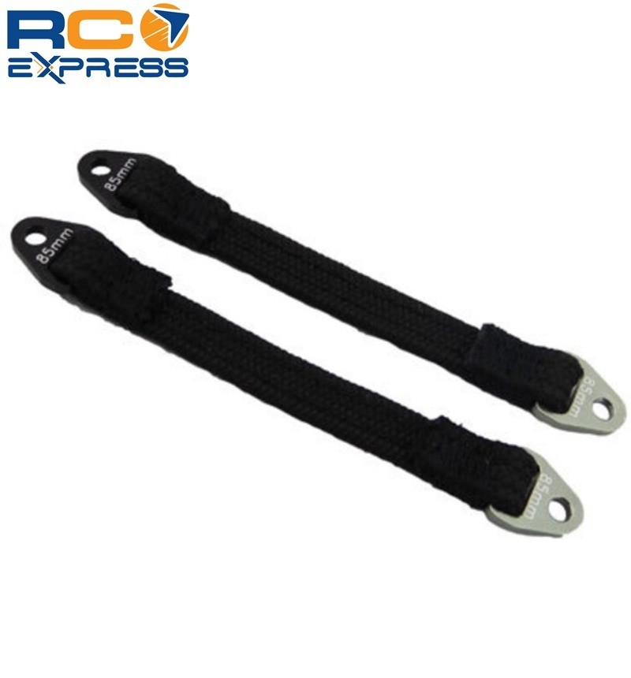
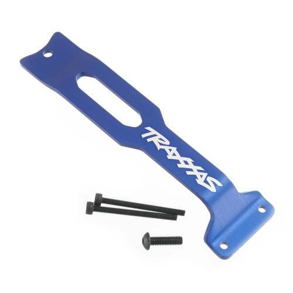

# Shock Selection — E-Revo 1.0

> **Chosen: HPI Apache C1 97mm plastic big bore (16mm bore)** — on this build the shocks sit **inboard** (rocker-actuated, behind the [3D-printed mounts](#mounting-3d-printed)), so they're **not exposed to crash abuse**. That removes the only reason to run a metal body, and the plastic's big advantage — **lighter weight** — wins with no downside. Same 16mm big-bore shock as the metal **Hot Bodies D8** (now the runner-up). Running **4-hole 1.2 mm pistons** with **Associated Factory Team 4,000 cSt silicone diff fluid front and rear** (up from 2,000 cSt, and 90wt / 100wt before that), and **Acxess springs** (the included big-bore springs are wrong for this heavy truck — see [Springs](#springs)). RPM plastic push-rod rod ends soak up the linkage abuse.

 <em>HPI Apache C1 97mm plastic big bore (#107365) — 16mm bore, lighter than the metal D8</em>

---

## Table of Contents

- [Key Requirements](#key-requirements)
- [Shock Comparison](#shock-comparison) — plastic Apache C1 vs metal D8 vs stock
- [Setup Spec — Piston & Oil](#setup-spec--piston--oil) — baseline, my numbers, and the why
- [Custom Pistons (3D-printed)](#custom-pistons-3d-printed) — hole size vs count, oil equivalence, print-then-drill
- [Why Heavier Oil](#why-heavier-oil) — temperature stability vs shock fade
- [Springs](#springs) — Acxess springs, equivalence chart, and the 50–55 mm length issue
- [Linkage — Shimming & Rod Ends](#linkage--shimming--rod-ends)
- [Mounting (3D-printed)](#mounting-3d-printed) — my Thingiverse shock-to-chassis adapters
- [Assembly](#assembly-hbhpi-big-bore--revo-gen-1) — building the HB/HPI shocks onto the Revo Gen 1
- [Droop / Travel Limiting](#droop--travel-limiting) — internal spacer vs the dropped limit straps + brace
- [Notes](#notes)

---

## Key Requirements

| Requirement | Type | Why |
|---|---|---|
| **97 mm big-bore (16 mm) class** | Must | Matches E-Revo ride height + travel; gives the plush, consistent damping the chassis needs |
| **Lightweight body** | May | The shocks sit **inboard** (rocker-actuated, behind the mounts), so they take no crash hits — no need for a heavy metal body; lighter plastic is the win |
| **Threaded body** | Must | Adjustable preload is the point of an aftermarket shock |
| **Rebuildable** | Must | Comes apart to service — rebuild when one leaks or breaks, no fixed schedule |
| **Temperature-stable damping** | May | Heavier oil holds its rate as the shock heats up (resists shock fade) |

---

## Shock Comparison

> *Spec format: Type · Bore · Length · Body material · Piston · Mounting · Part · Spring · Oil · Price*

| Shock | Spec | Pros / Cons | Photo / Link |
|---|---|---|---|
| ⭐ **HPI Apache C1 97mm** (plastic big bore, #107365) | **Type:** big bore (#107365) **Bore:** 16 mm **Length:** 97 mm shaft **Body material:** plastic, threaded **Piston:** 4 × 1.2 mm **Mounting:** inboard / rocker-actuated **Part:** #107365 **Spring:** Acxess (not included) **Oil:** FT 4,000 cSt F/R **Price:** A929 twin ~$16/pr | Pro: **Lighter than the metal D8**, and the inboard shocks are protected so there's no crash exposure to worry about. Same plush 16mm big-bore internals, rebuildable, cheap (A929 twin ~$16/pr)  Con: **Doesn't come with the right springs** for a heavy truck — the included buggy springs are too soft, swap to [Acxess](#springs). Also the **OEM rebuild / seal kit runs ~$20–25 — about half the price of the shocks themselves**, so reseals aren't cheap |   <em>Apache C1 (#107365) · Wltoys A929 twin</em> |
| 🥈 **Hot Bodies D8 97mm** (metal big bore, HBS67296) | **Type:** big bore (HBS67296) **Bore:** 16 mm **Length:** 97 mm **Body material:** metal, threaded **Piston:** 4 × 1.2 mm (same 16mm internals as the C1) **Mounting:** inboard / rocker-actuated **Part:** HBS67296 **Spring:** Acxess (not included) **Oil:** FT 4,000 cSt F/R **Price:** N/A (discontinued) | Pro: Metal body **never dents** and the shock end shims a touch more precisely with M3×1; identical big-bore internals  Con: **Heavier** than the plastic C1 — and the shocks are protected here, so that toughness buys nothing. **Worse on the Revo specifically:** the inboard shocks mount **high up on the car**, so the metal body's extra weight sits up top and **raises the CG** — worse handling. The unique suspension puts that mass exactly where you don't want it. Discontinued. **Also no correct springs included** (same Acxess swap) |  |
| 🚫 ~~**Stock Traxxas GTR** (E-Revo OEM)~~ | **Type:** OEM GTR — parts TRA5460X · TRA5437 · TRA5438 · TRA5463 (shocks + springs) **Bore:** N/A **Length:** N/A **Body material:** threaded GTR body **Piston:** 2-hole (OEM; smaller effective flow than the 4×1.2 big-bore setup) **Mounting:** inboard / rocker-actuated **Part:** TRA5460X · TRA5437 · TRA5438 · TRA5463 **Spring:** red springs **Oil:** N/A **Price:** N/A | Pro: Came on the car  Con: **Superseded by the D8** — the 2-hole OEM piston is the baseline I tuned away from; D8 gives a more tunable big-bore package |  <em>Stock Revo GTR shocks + springs (TRA5460X)</em> |

---

## Setup Spec — Piston & Oil

- **Baseline:** the **4-hole 1.2 mm** piston is commonly recommended around **80wt front and rear**.
- **My setup: Associated Factory Team 4,000 cSt, front and rear.** This is **silicone diff fluid, not shock oil** — shock oil tops out around 100wt, so the heavy end only exists in diff grades. Brand and grade are confirmed off the bottle (FT diff fluid, the same line as the 2,000 cSt this replaced). If you'd rather stay in the standard shock-oil range, run a piston with **fewer or smaller holes** instead.
- **History, three steps up.** **90wt / 100wt** was fine while the shocks were fresh, but once they wore in the truck started **bucking on landings**. **2,000 cSt** fixed the bucking completely, though it still packed down far enough to dig on jump landings. **4,000 cSt** is where it sits now, skipping the planned 3,000 step entirely.
- **Digging on landings, the reason for going to 4,000.** At 2,000 cSt the truck packed down far enough on a jump landing that the chassis caught the dirt. 4,000 cSt is the answer to that, **and the landings still need re-checking on it.** Watch for the opposite failure now: too stiff and it stops absorbing and **kicks back** instead. If it overshoots, **3,000 cSt** is the step back down, or blend to ~2,830 cSt with equal parts 2,000 and 4,000.
- **Both ends run the same oil.** The old plan held the front at 90wt as an untouched baseline and did all experimenting on the rear; running one grade front and rear replaced that. If I change again, do **one end at a time** so there's still a reference to compare against.
- **Brand barely matters** — shock oils vary 2–3wt off each other anyway. I like **TLR** oils since they go up to 100wt (probably higher — didn't check).

### Bigger bore → lighter oil (why some go smaller-piston)

**What "bore" means:** the bore is the **inside diameter of the shock body** — effectively the size of the piston face. A bigger bore = a **bigger piston**.

**Why a bigger bore needs lighter oil:** for the *same* suspension movement (same shaft speed and travel), a **bigger piston sweeps more oil volume** on each stroke. That larger volume still has to squeeze through the **same piston holes** (same count and size), so it's forced through **faster and meets more resistance — i.e. more damping**. To bring the damping back down to where a smaller shock sat, you run **thinner (lighter) oil** in the bigger shock.

So it sounds backwards — *bigger shock, lighter oil* — but it's just compensating for the extra oil the bigger piston shoves through the same holes. The E-Revo originally shipped with a **2-hole piston**, and some people deliberately drop to a smaller piston (fewer / smaller holes) to stay on standard oil weights. For example, where a smaller shock wants ~**55wt**, a bigger-bore shock can run **40–45wt** with similar characteristics.

---

## Custom Pistons (3D-printed)

Planning to 3D print custom pistons. Two ways to change damping, and they do different jobs.

- **Hole size = magnitude knob.** Area scales with diameter squared, so small size changes move damping in fine, predictable steps. Keeping several holes keeps flow smooth and the curve roughly linear (same character, just more or less of it). Use this to add or remove damping.
- **Hole count = character knob.** Dropping a hole adds low-speed "pack" (hold-up over successive hits), not just overall firmness. It is a bigger, coarser change. Use it when you want more hold-up on chop, not just more damping.

Same total restriction, reached two ways (from the current 4 × 1.2):

| Piston | Total hole area | Feel vs current |
|---|---|---|
| 4 × 1.2 (current) | 4.52 mm² | baseline |
| 3 × 1.2 | 3.39 mm² (−25%) | firmer, more pack |
| 4 × 1.0 | 3.14 mm² (−31%) | firmer, stays linear |

So 4 × 1.0 gives about the same damping increase as 3 × 1.2 but without the extra pack.

**Oil equivalence (rough).** Dropping 4 to 3 holes (same 1.2 mm) is about 33% more restriction. Flow here is viscosity-dominated (thick oil, small holes, low Reynolds number), so to hold the current feel go about 25 to 30% lighter oil: front 90wt to ~65wt, rear 100wt to ~70wt. Starting point only, retune by feel and temp. **Those numbers are off the old 90/100 setup** — against the current 4,000 cSt the same 25-30% cut lands around **2,800-3,000 cSt**.

**Print rule.** Printed holes, especially small ones, come out undersize, rough, and inconsistent (worst on FDM), and rough bores change flow so the four shocks will not match. Print the blank with holes slightly undersize, then drill or ream to final size with numbered or metric bits. That is what makes size-tuning repeatable, and it lets you tune in fine increments instead of the big 25 to 33% jumps that changing hole count forces.

**Piston-to-bore clearance (16 mm bore).** The piston seals against the bore by close fit, not a tight seal, so it needs a small gap for a thin oil film. Target roughly **0.1 to 0.2 mm total** on diameter (0.05 to 0.1 mm per side), so a **~15.8 to 15.9 mm** piston OD in the 16 mm bore.
  - Too tight (under ~0.1 mm total): piston drags, binds, or scrapes the bore, adds stiction, wears the body.
  - Too loose (over ~0.25 mm total): oil bypasses around the piston, damping goes soft and inconsistent, especially at low speed.
  - For a printed piston, print slightly oversize and sand or turn the OD down to size, since printed diameters run rough and off-nominal. Aim near 15.85 mm and verify it slides with light drag, no scrape.

**Plan.** Print blanks, drill holes to size, turn OD to ~15.85 mm, tune with diameter (keep 4 holes) for smooth consistent damping. Drop to 3 holes only for more hold-up over chop. **Rear only** — the front stays untouched as the baseline (90wt back then, FT 4,000 cSt now).

### Shim-check valve (asymmetric damping) — rear experiment

Idea: a flap over the rear piston that covers **2 of the 6 holes on rebound**, giving **soft/fast compression + firmer rebound** (the "faster downstroke, harder upstroke" goal).

- **Orientation:** flap on the **rebound-facing side** — pressed shut on extension (covers the 2 holes → firmer rebound), sucked open on compression (all 6 → soft).
- **Keep 4 of 6 always open** (outside the flap footprint) so it's a **mild bias**, not a hard one-way. Full soft-comp/firm-rebound packs the rear down on chop (Meldrum), so keep it mild.
- **Build as a shim, not a floppy flap:** thin spring-steel (feeler-gauge stock) or stiff PET film, **center-anchored** in the stack (piston → shim → washer → locknut), shaped as a petal spanning only the 2 target holes, small lift (~0.3-0.5 mm).
- **Make-or-break:** the PETG seat face must be **sanded flat/smooth** (layer lines leak past the shim), and the fast compression side needs a good **bladder + clean bleed** or it cavitates. Match all rear shocks identically.

**Achieved OD: 15.85 mm** in the 16 mm bore = **0.15 mm total clearance** (0.075 mm/side), mid-spec, ideal. Verify roundness (measure OD at 2-3 angles) and a light-drag slide with no scrape.

---

## Why Heavier Oil

I run at the top of the oil range on purpose: **heavier oil is significantly more temperature-stable**. It holds its damping rate across weather swings and resists **shock fade** — as the oil heats up during a run, a shock becomes less effective, and lighter oils lose their rate faster. The small consistency tax of running thick oil is worth it for damping that feels the same lap 1 and lap 10.

### Shock-oil supertable — wt ↔ cSt across brands (up to 5000 cSt)

**"wt" is not a standardized unit; cSt is.** Associated, TLR/Losi and XTR sell by weight; Tamiya (`#`), Kyosho (`#`), Mugen, Yokomo, Hudy, AKA and Racers Edge print cSt straight on the bottle, so their number **is** the cSt. Rule of thumb for the wt brands: **cSt ÷ 10 ≈ wt**. Values below are the manufacturers' own published numbers.

| wt | Associated FT (cSt) | TLR / Losi (cSt) | Gap | Direct-cSt brands (Tamiya # / Kyosho # / Mugen / Yokomo / Racers Edge) |
|---|---|---|---|---|
| 25 | — | 250 | — | 250 |
| 27.5 | 313 | — | — | ~300 |
| 30 | 350 | 338 | −12 | 338-350 |
| 32.5 | 388 | — | — | ~400 |
| 35 | 425 | 420 | −5 | ~420 |
| **37.5** | **463** | **468** | +5 | ~465 · **Jato front candidate** |
| 40 | 500 | 516 | +16 | 500 · **Jato front (running)** |
| 42.5 | 538 | — | — | ~540 |
| 45 | 575 | 610 | **+35** | ~600 |
| 47.5 | 613 | — | — | ~600 |
| **50** | **640** | **710** | **+70** | ~650-700 · **Jato rear (running)** |
| 55 | 725 | 760 | +35 | ~750 |
| 60 | 800 | 810 | +10 | 800 |
| 70 | 900 | 910 | +10 | 900 |
| 80 | 1000 | 1014 | +14 | 1000 |
| 90 | — | 1130 | — | ~1150 · E-Revo old front (90wt) |
| 100 | — | 1325 | — | ~1300 · E-Revo old rear (100wt) — **top of the wt scale** |

**Where the brands actually diverge:** mostly they're within ~15 cSt of each other, but **45-55wt is the exception** — TLR's 50wt (710) is nearly Associated's 55wt (725). Buying a "50wt" from the wrong brand there is a real one-step change. Everywhere else the labels are close enough to swap.

#### Above 100wt — diff-fluid grades (1000 → 5000 cSt)

Past ~1325 cSt the wt label stops existing and **every brand prints cSt**, so no conversion is needed at all. Silicone diff fluid is the same fluid as shock oil, just sold in the grades shock oil doesn't reach — that's what this truck runs.

| cSt | ≈ wt (extrapolated, no one labels these) | Where to buy | Use |
|---|---|---|---|
| 1000 | 80wt | Associated 5427 · TLR74016 | — |
| 1130 | 90wt | TLR74017 | — |
| 1325 | 100wt | TLR (top of scale) | — |
| 1500 | ~115wt | [PT Racing 1500 cSt (4oz)](https://fiercercsolutions.com/PT-Racing-RC-Shock-Oil-4-OZ-Bottle-1500-CST) | — |
| 2000 | ~150-160wt | Racers Edge RCE3300 (70ml, $7.99) · Tamiya #2000 (54656, $6.49) · Associated 5451 | previous setting |
| 2500 | ~185wt | blend: ⅓ of a 4000 + ⅔ of a 2000 | — |
| 2830 | ~210wt | blend: 50/50 of 2000 + 4000 | step back down if 4,000 kicks |
| 3000 | ~225wt | Tamiya #3000 (54657, $6.49) · Racers Edge RCE3305 · Associated 5452 | skipped, went straight to 4,000 |
| **4000** | ~300wt | **Associated FT 4,000 cSt** · Racers Edge RCE3310 ($7.99) · Kyosho SIL4000B ($10.99) | **running, front + rear** |
| 5000 | ~375wt | Racers Edge RCE3315 · Associated 5453 ($8.99) · Kyosho SIL5000B | too stiff for shocks; = Jato **rear diff** |

- **Buy by cSt, never by the "110/120wt" labels** — they barely exist above 100wt, and the extrapolated column above is a feel reference only.
- **Silicone blends on a log scale**, so mixing two bottles lands between them: 50/50 of 2000 + 4000 ≈ **2830 cSt**, and ⅓/⅔ ≈ **2500 cSt**. Buying a 2000 and a 4000 covers the whole 2000-4000 range without a third bottle.
- **Bottle size matters for four 16mm big bores.** Racers Edge is 70ml, Associated/TLR 2oz (~59ml), Tamiya and Kyosho ~40cc — so a single Tamiya bottle is tight for a full fill.

Sources: [Associated FT shock fluid listings](https://www.associatedelectrics.com/teamassociated/parts/details/5436) · [Losi/TLR shock oil listings](https://www.losi.com/product/silicone-shock-oil-40wt-516cst-2oz/TLR74010.html) · [So Dialed brand comparison](https://www.sodialed.com/rc-setup-tips/rc-shock-oil-viscosity-comparison-chart)

---

## Springs

**The springs that come with the HB D8 are not right for this build.** The D8 is a **1/8 buggy** shock, and its included springs are rated for a buggy's weight. The **E-Revo is a much heavier machine** — a massive truggy with big tires and a high CG. Bolt the D8 buggy springs straight on and the truck **sags into its travel and bottoms out**, with no rate left to hold ride height or control the weight on landings.

**Use Acxess Springs** ([acxesspring.com](https://www.acxesspring.com/)) — I bought mine from [thespringstore.com](https://www.thespringstore.com/). The chart below maps each Acxess spring to its **equivalent GTR spring color and rate** (rates copied from the original GTR shock table). Mix and match by rate. Assume **~60 mm length** unless noted.

| Equiv GTR color | Rate (N/mm) | Acxess industrial part # |
|---|---|---|
| Yellow | 2.8 | PC077-938-7000-MW-2333-CG-N-IN |
| White | 2.9 | PC085-975-7630-SST-2335-C-N-IN |
| Orange / Green | 3.3 | PC085-975-7630-MW-2335-C-N-IN |
| ⭐ **Gold** *(my front)* | **3.73** (63.5 mm) | PC092-975-9000-MW-2500-CG-N-IN |
| ⭐ **Tan** *(my rear)* | **4.0** | PC085-975-6630-MW-2335-C-N-IN |
| Black | 4.5 | PC096-975-8000-SST-2346-C-N-IN |
| Silver / Pink | 5.2 | PC096-975-8000-MW-2346-C-N-IN |
| Blue | 5.9 | PC105-1014-8000-SST-2355-C-N-IN |
| Purple | 6.2 (63.5 mm) | PC112-1010-10800-MW-2500-CG-N-IN |

- **My setup:** **Gold front / Tan rear.**
- **General rule: softer front, stiffer rear.** Pick a front color, then go one step up the chart for the rear — e.g. **Silver front → Blue rear**.

### ⚠️ Spring length — go 50–55 mm, not 60 mm

**Big issue with the springs I recommend:** don't run the **60 mm** springs shown in the kit picture. They *will* wear in and eventually settle to near-perfect ride height with the right droop — but you should just start with **50–55 mm** springs. Anything **shorter than ~55 mm** is about perfect: it nearly covers the whole shock body and looks clean. (I already spent ~$55 on the 60–63 mm springs, so I'm running those for now.)

---

## Linkage — Shimming & Rod Ends

- **Shim the shock end with M3×1 mm shims** to keep it **centered on the rocker** — clean and repeatable. (A metal body holds the shim stack a touch more precisely, but the chosen plastic C1 works fine.)
- **Push-rod rod ends are RPM (plastic)**, so all the stretch and abuse in the linkage is **consolidated onto a cheap, quick-swap part**. Same philosophy as the [aluminum rockers](rocker_analysis.md) — push wear onto whatever's cheapest to replace, and maintenance stays cheap.

---

## Mounting (3D-printed)

✅ **Solved with my own custom shock-mount adapters** — published on Thingiverse: **[thing:7090606](https://www.thingiverse.com/thing:7090606)**. They let true 1/8 big-bore shocks (97 mm Hot Bodies D8 / HPI 107365 Apache C1) bolt onto the **Revo Gen 1** chassis. **Works with swaybars** (slight trimming). Tuned for racing, not max-air bashing — but the editable STEP files are included if you want to take it further.

Files in [`3d-models/shock_mounts/`](3d-models/shock_mounts/):
- `Front_Shock_Mount.stl` / `Rear_Shock_Mount.stl` — print-ready
- `EREVO_Front_Shock_Mount_Upgrade.step` / `EREVO_Rear_Shock_Mount_Upgrade.step` — editable CAD

  &nbsp; 
  <em>Front · rear shock-mount adapters (Revo Gen 1 → 97 mm big bore)</em>

---

## Assembly (HB/HPI big bore → Revo Gen 1)

Steps to set the HPI / Hot Bodies shocks up front and rear with these mounts:

1. **Drill the stock eyelet** — enlarge the hole in the stock shock-shaft eyelet until it reaches the ball joint.
2. **Trim the eyelet** — shorten it so the threaded part of the shaft can screw in deep enough to **just touch (or nearly touch) the ball**.
3. **Assemble the internals** — install the **original bump-stop** inside the body, then stack the **kit washer**, then the **1.2 mm 4-hole piston** on top, and fasten with the provided **lock nut**. Fill with **80wt oil** — the baseline for both front and rear.
   - **Bump-stop length:** the stock GTR bump-stops are **ever so slightly too short** in these big bores. May make custom ones a bit **thicker** to limit down-travel/topping out; exact length **TBD**.
4. **Cap setup** — press-fit the ball joint from the **original GTR cap / eyelet** into the new shock cap; make sure it sits **flush**.

**Oil cross-reference:** 50wt in the stock Revo Gen 1 shocks feels similar to **80–90wt in these HB/HPI big bores** — the bigger bore needs heavier oil for the same feel (see [Bigger bore → lighter oil](#bigger-bore--lighter-oil-why-some-go-smaller-piston)). 80wt is the baseline; I run [2000 cSt front and rear](#setup-spec--piston--oil).

---

## Droop / Travel Limiting

> **Chosen: limit droop with a proper internal spacer inside the shock.** This caps down-travel from the inside, so there's nothing hanging off the outside to add weight or tear away. The external limit-strap route (plus the brace to mount it) was bought first, then dropped.

> *Spec format: Type · Material · Fits · Length · Price*

| Approach | Spec | Pros / Cons | Photo / Link |
|---|---|---|---|
| ⭐ **Internal shock spacer** — *chosen* | **Type:** internal spacer (caps shaft extension) **Material:** N/A **Fits:** N/A **Length:** tunable by spacer thickness **Price:** N/A | Pro: Limits droop **with no external parts**, no added weight, nothing to snap off in a crash. Tunable by spacer thickness  Con: Have to open the shock to change it | (internal, no photo) |
| ❌ ~~**Hot Racing limit straps**~~ — *bought first, not used* | **Type:** external limit straps (SLS85T1801 / SLS90T1111) **Material:** 2-ply nylon strap, CNC aluminum clevis ends **Fits:** E-Revo 1.0 & 2.0 **Length:** 85 mm / 90 mm **Price:** ~$7–13/pair | Pro: External, easy to fit; stops the rod ends pulling off at full droop  Con: **Added weight** and the **straps snap/tear off after abuse**. The internal spacer does the same job cleaner. QC on length can vary pair to pair |   <em>90 mm SLS90T1111 · 85 mm SLS85T1801</em> |
| ❌ ~~**Traxxas 5632 rear chassis brace**~~ — *bought only to mount the straps, not used* | **Type:** rear chassis brace (incl. 2× 3×35 + 1× 4×14 screws) **Material:** aluminum (blue) **Fits:** E-Revo (rear) **Length:** 129 mm **Price:** $12.75 | Pro: Stiffens the rear; the mounting point for the rear straps  Con: Only bought to hang the limit straps. With the straps gone and a **metal rear bulkhead** already stiffening the back, it adds **needless weight** for no benefit |  |

Both the limit straps (85 mm / 90 mm) fit the E-Revo 1.0 and 2.0, so they're kept on the shelf, but the **internal spacer** is the actual solution on this truck.

---

## Notes

- **D8 = Apache C1.** The metal Hot Bodies D8 (HBS67296) and the plastic HPI Apache C1 are the same shock; the Wltoys A929 is a budget knock-off of the C1. Bodies and most internals interchange — see the [FastAzJato4x4 shock analysis](../FastAzJato4x4/shock_analysis.md) for the full big-bore parts breakdown (spare bodies, maintenance sets, spring charts).
- **Plastic, same as the Jato.** Both this build and the [FastAzJato4x4](../FastAzJato4x4/shock_analysis.md) run the **plastic Apache C1 for weight** — here it works because the **inboard shocks are shielded from crash abuse**. The metal D8 is the runner-up if a plastic body ever fails.
- **Rebuild on condition, not schedule** — service a shock only when it leaks or breaks.
