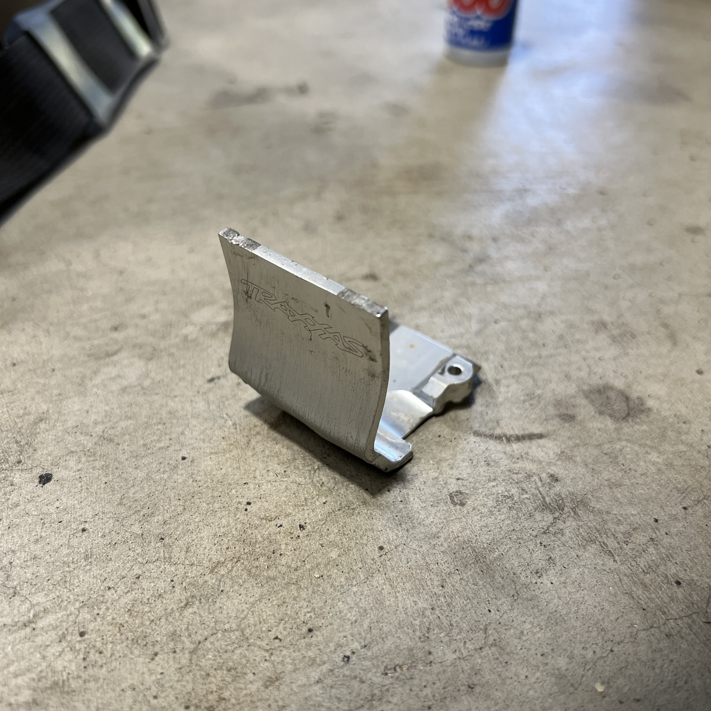
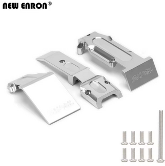

# Skid Plate Analysis — E-Revo 1.0

> **Decision: Traxxas 5337 Skid Plate Set, Revo (plastic, front + rear).** Replaces the bent metal front skid plate I was running. Plastic is a cheap wear item — no need for metal here. The NEW ENRON aluminum set was purchased but we're going back to plastic as the primary choice.

---

## Table of Contents

- [Why switch from metal to plastic](#why-switch-from-metal-to-plastic)
- [Traxxas 5337 — what you get](#traxxas-5337--what-you-get)
- [Installation notes](#installation-notes)
- [Price & sourcing](#price--sourcing)
- [Alternatives considered](#alternatives-considered)
- [Notes](#notes)

---

## Why switch from metal to plastic

I was running a **metal front skid plate** (generic, unknown brand). It bent on the first hard hit and stayed bent — see photo below. Metal skid plates on a basher/racer are **not worth it**:

- **Metal bends and stays bent** — once deformed, it doesn't protect anymore and can even dig into the chassis.
- **Plastic flexes and springs back** — absorbs impacts without permanent damage.
- **Plastic is lighter** — unsprung weight matters less here (it's chassis-mounted), but still a bonus.
- **Plastic is cheaper** — the Traxxas 5337 set is ~$10 for both front and rear, vs $15–25 for a single metal piece.
- **Wear item philosophy** — skid plates are meant to get chewed up. Replace them when they're worn, not when they bend.

 <em>Old bent metal front skid plate — replaced with Traxxas 5337 plastic set</em>

 <em>NEW ENRON Aluminum Front & Rear Skid Plate #5337 (silver) — purchased $18.64 on May 10, 2026 (now fallback)</em>

---

## Traxxas 5337 — what you get

| Spec | Value |
|------|-------|
| Part # | **5337** |
| Description | Skid Plate Set, Revo (front + rear) |
| Material | **Nylon / plastic** (flexible, durable) |
| Includes | Front skid plate + rear skid plate |
| Fit | Traxxas Revo 1.0, 2.0, 3.3 |
| Color | Black |
| Price | ~$10 / set |

**Why this over the metal one:**
- **Plastic flexes** — absorbs impacts without permanent deformation.
- **Includes both front and rear** — the old generic metal one was front-only.
- **Cheap to replace** — when it gets chewed up, swap it for another $10 set.
- **Lighter** — saves a few grams over metal.

---

## Installation notes

- **Front:** bolts directly to the front bulkhead using the existing screws. No modification needed.
- **Rear:** bolts to the rear bulkhead. The Revo 1.0 has a metal bulkhead back there, so the plastic skid plate protects the chassis from below.
- **No interference** with the RPM 80802 front bumper mount or the Traxxas 5335 nylon bumper.
- **No need for Loctite** — the screws are into plastic/nylon, so they'll stay put with normal thread engagement.

---

## Price & sourcing

| Source | Price | Notes |
|--------|-------|-------|
| LHS (local hobby shop) | ~$10 | Walk-in, no shipping |
| AMain Hobbies | ~$10 | Online, may have shipping |
| eBay | ~$8–12 | Used or new |
| Traxxas direct | ~$10 | |

---

## Alternatives considered

| Option | Spec | Pros / Cons | Photo / Link |
|---|---|---|---|
| ❌ ~~**NEW ENRON Aluminum #5337 (metal)**~~ | **Type:** aluminum skid plate set **Material:** aluminum **Position:** front only (came with the car) **Fits:** Revo / E-Revo **Includes:** front only (came with the car) **Weight:** heavy **Price:** N/A (came with the car) | Pro: Looks tough, feels protective  Con: **Bends permanently**, heavier, more expensive, front-only |  <em>Old bent metal front skid plate — NEW ENRON Aluminum #5337</em> |
| ❌ ~~**RPM skid plate**~~ | **Type:** RPM nylon skid plate **Material:** nylon **Position:** N/A **Fits:** Revo / E-Revo **Includes:** N/A **Weight:** N/A **Price:** N/A | Pro: RPM makes tough nylon parts  Con: **Not available for Revo** (RPM doesn't make a Revo skid plate) | — |
| ❌ ~~**No skid plate**~~ | **Type:** none **Material:** N/A **Position:** N/A **Fits:** N/A **Includes:** N/A **Weight:** 0 g **Price:** $0 | Pro: Saves weight, zero cost  Con: Chassis takes the abuse directly — wears out faster | — |
| ⭐ **Traxxas 5337 (plastic)** — *chosen* | **Type:** plastic skid plate set **Material:** nylon / plastic **Position:** front + rear **Fits:** Revo 1.0, 2.0, 3.3 **Includes:** front + rear **Weight:** light **Price:** ~$10 / set | Pro: Cheap, flexible, includes both front + rear, easy to replace  Con: None for this use case | — |

---

## Notes

- **Skid plates are wear items** — don't overthink them. Buy the cheap plastic set, run it till it's chewed up, replace it.
- **The metal one I had was a waste of money** — it bent on the first hard landing and never recovered. Plastic is the right call for a basher/racer.
- **If you're running on beach sand**, the plastic skid plate will slide better than metal (less friction on sand).
- **No need for a rear bumper** — the rear skid plate + metal bulkhead provide enough protection. See [`bumper_analysis.md`](bumper_analysis.md) for the full bumper reasoning.
- **NEW ENRON aluminum set** was purchased ($18.64, May 10, 2026, order 8211350284004866) but we're going back to plastic as the primary choice. The aluminum set is now a fallback.
