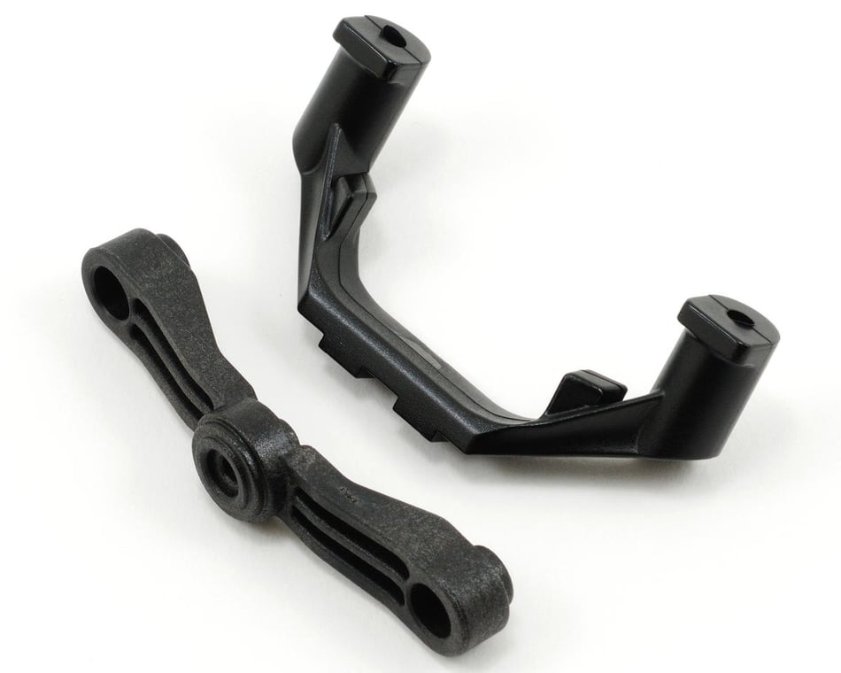

# Steering Arm Mount / Steering Stop Selection — E-Revo 1.0

> **Chosen: Traxxas 5343X**, the "X" steering stop version. Native to the E-Revo 2.0, but fits the E-Revo 1.0 too. Comes with both a standard-throw and a maximum-throw steering stop in the same set, run the max-throw one for the most steering angle.

 <em>Traxxas 5343X steering arm mount + steering stops (2), plus servo-saver arm</em>

---

## Key Requirements

| Requirement | Type | Why |
|---|---|---|
| **Fits the E-Revo 1.0 lower hinge pin / steering arm mount** | Must | Has to bolt to the existing steering linkage without modification |
| **Maximum throw** | May | More steering angle is preferred for tighter turns, at the cost of nothing if the max-throw stop is just swapped in for the standard one from the same set |

---

## Steering Arm Mount / Stop Comparison

> *Spec format: Material · Pivots · Fits · Price*

| Part | Spec | Pros / Cons | Photo / Link |
|---|---|---|---|
| ⭐ **Traxxas 5343X** — *max-throw stop installed* | **Material:** Plastic (steering arm mount + stops), includes lower hinge pin retainer **Pivots:** N/A **Fits:** E-Revo 2.0 (native), **E-Revo 1.0** (confirmed fit), Revo 3.3, Summit, Slayer Pro 4x4 **Price:** $3.50 | Pro: **One set includes both a standard-throw and a maximum-throw steering stop**, so there's no separate part to buy for more angle, just run the max-throw stop that's already in the box. Cross-platform: bought for the 2.0 but drops onto the 1.0  Con: 🚧 Nothing logged yet, no run time on it |  |
| 🚫 ~~**Traxxas 5343** (plain, no X)~~ — *superseded by the X version* | **Material:** Plastic (steering arm mount + stop), includes servo-saver arm **Pivots:** N/A **Fits:** Revo / E-Revo (older version) **Price:** $3.50 | Pro: Same price as the X version  Con: **Only one steering stop, no max-throw option.** Superseded by the 5343X, which adds the max-throw stop in the same set for the same price, no reason to buy this one over the X now |  |

---

## Notes

- **Plain "5343" was the original, one steering stop only, now superseded.** The 5343X replaced it at the same $3.50 price but adds the max-throw stop in the same set, so there's no reason to seek out the old one. Current listings only turn up the X version.
- **The max-throw stop is the one to run.** Both stops ship in the same set, so picking max-throw over standard costs nothing extra, it's just a matter of which one gets installed.
- **Bought for the E-Revo 2.0, confirmed to also fit the 1.0.** Worth remembering for future parts shopping: not everything E-Revo-2.0-labeled is a lost cause for the 1.0, unlike the center driveshaft (see [`driveshaft_analysis.md`](driveshaft_analysis.md)), this one crosses over.
- **Still open:** install notes and how it performs once it's actually on the car.
