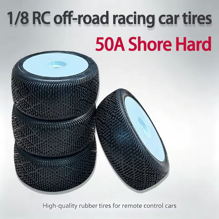

# Tire & Wheel Selection — E-Revo 1.0

> **Leaning: super-soft, low-grip truggy tire.** Two real options: the proven **JetKo J-Zero Super Soft** (~$84/set) and the cheaper **Yufung 1/8 truggy "JConcepts Similar" in Super Soft (blue), $50.23/set of 4** (complete pre-glued wheel + foam, 17 mm hex). Meldrum Bar is **loose, dusty, low-grip** dirt, so I want the soft end of the scale. Note: Yufung's color codes are their own (their **blue = Super Soft**), so I go by the printed hardness label, not the color.

 <em>Yufung 1/8 truggy set — Super Soft (blue), one-piece tire + wheel + foam insert, pre-glued, 17 mm hex</em>

---

## Table of Contents

- [Track context](#track-context) — why low grip is the target
- [Key Requirements](#key-requirements)
- [JConcepts Compound Key (hardness scale)](#jconcepts-compound-key-hardness-scale) — what each color means
- [What hardness for my track](#what-hardness-for-my-track) — loose low-grip dirt
- [Comparison (PowerHobby / JetKo)](#comparison-powerhobby--jetko) — top tread picks
- [Tire Comparison (Yufung)](#tire-comparison-yufung) — AliExpress options
- [Wheels / Mounting](#wheels--mounting) — hex, gluing, inserts
- [Notes](#notes)

---

## Track context

**Meldrum Bar Park** — unkept dirt, only the ramps + potholes get fixed occasionally. **Loose, dusty, low grip**, but can turn **grippy when wet**. The E-Revo runs **1/8 truggy tires on a 17 mm hex**. Low grip is the design target.

---

## Key Requirements

| Requirement | Type | Why |
|---|---|---|
| **Grip on loose / dusty / low-grip dirt** | Must | Meldrum Bar's normal state; the tread has to find bite in loose dust |
| **Still works wet / grippy** | May | Track firms up and grips when wet |
| **Tread life under a heavy E-Revo** | Must | The heavy truck eats soft compounds fast; want reasonable life |
| **1/8 truggy / 17 mm hex fit** | Must | The Revo runs 1/8 truggy tires via a 17 mm hex |

---

## JConcepts Compound Key (hardness scale)

JConcepts marks compound with a **color stripe** on the tire. Softest to firmest:

| Color | Hardness | Best for |
|---|---|---|
| 🟢 **Green** | **Super soft** (softest) | All conditions, max grip on **loose / low-grip / damp** dirt; wears fastest |
| 🟡 **Gold** | Indoor soft | Indoor clay / carpet / astro |
| 🔵 **Blue** | **Soft** | All conditions, a touch firmer; better wear, for when the track firms up / wets up and grips |
| ⚪ **White** | Medium | Groove / blue-groove (packed-in, high-bite) conditions |
| 🟨 **Yellow** | Medium (firmest of this key) | Hard-packed, abrasive, longest wear |

> Softer = more mechanical grip + faster wear. Firmer = less grip + longer life, only worth it on high-bite/hard-packed tracks. On a **low-grip** track like mine, softer is better, so I want the **super-soft** end.
>
> ⚠️ **Yufung's colors are NOT the JConcepts order.** This store labels its **blue** truggy tire as **Super Soft** and its **white** buggy set as **50A Shore Hard**. So with Yufung, read the **printed hardness label** (Super Soft / 50A Hard), don't assume the JConcepts color meaning. The chart above is the JConcepts reference; Yufung just borrows the look.

---

## What hardness for my track

Meldrum Bar is **loose, dusty, low grip** (grippy only when wet). On low-traction dirt the **softer** compound finds more bite, so I run the soft end of the scale:

- ⭐ **Super soft (JConcepts green / JetKo Super Soft) = the default.** Best grip on loose dust while still lasting under the heavy Revo. This is the one to stock most of.
- 🔵 **Soft (blue) = for when the track wets up and grips,** or firms in / gets choppy. A touch more life, slightly less bite on dust.
- 🚫 **White / Yellow (medium) = skip.** Too hard for a low-grip surface; they'd just slide.
- 🏖️ **Beach:** dirt compounds don't work on dry sand, which wants a **paddle / sand tire**, not a compound pick. Separate tire if I run sand seriously.

---

## Comparison (PowerHobby / JetKo)

| Tire | Spec | Pros / Cons | Photo / Link |
|---|---|---|---|
| ⭐ **J-Zero** — *Super Soft, leaning* | Low-grip design, flexible deformation-zone tread  Mounted on 17 mm dish wheels  Price: **$41.99 / pair** ($84/set) | Pro: **Built for low grip** — flexible tread digs into loose dust and works wet/cold, exactly Meldrum Bar  Con: Gives up some bite if the track firms up or gets rough |  🚧 save as `src/tire_powerhobby_jzero_truggy.jpg` |
| 🔵 **Block In** — *Super Soft, rough-day alt* | Blocky all-terrain, qualifying speed, A-main life  Price: **$41.99 / pair** | Pro: **Strong on rough / choppy / medium dirt** with race speed  Con: Blocky tread is less ideal on pure loose dust than the J-Zero |  🚧 save as `src/tire_powerhobby_blockin_truggy.jpg` |
| 🔵 **Lesnar** — *durability, wrong track* | Longest-lasting race tire, quick/agile  Price: **$41.99 / pair** | Pro: **Best tread life** (fits the durability ethos), all-around  Con: **Not a low-grip specialist** — less bite on loose dust than J-Zero |  🚧 save as `src/tire_powerhobby_lesnar_truggy.jpg` |
| 🔵 **Desirer** — *low-grip, verify fit* | Low-grip oriented (mostly a buggy tread) | Pro: Another low-grip option  Con: Primarily a buggy tread; **verify truggy sizing** before buying |  🚧 save as `src/tire_powerhobby_desirer_truggy.jpg` |

---

## Tire Comparison (Yufung)

> Both are from the Yufung (Vexar-Yufung) store. Go by the printed hardness label, not the color (see the [⚠️ note above](#jconcepts-compound-key-hardness-scale)). The truggy Super Soft set is the right fit + hardness for my track and still **undercuts the ~$84 JetKo set**.

| Tire | Spec | Pros / Cons | Photo / Link |
|---|---|---|---|
| ⭐ **Yufung 1/8 Truggy Set — Super Soft (blue)** — *leaning, budget* | Type: **1/8 truggy**, "JConcepts similar" tread  Compound: **Super Soft** (blue)  Outer dia: **140 mm** · width **60 mm** · rim **105 mm**  Hex: **17 mm**  Includes: **tire + rim + foam insert, pre-glued** (install directly)  Price: **$50.23 / set of 4** (was $93.02; 2pcs option also sold) | Pro: **Right fit + right hardness** (truggy, super soft) for loose low-grip dirt; complete glued wheel with foam, **cheaper than JetKo**  Con: Verify 140 mm dia vs current tires; "pre-glued" is fine but **check the bead before a race** |  |
| 🚫 ~~**Yufung 1/8 Buggy Set — White, 50A Shore Hard**~~ — *the one I priced first, wrong* | Type: **1/8 buggy** (narrower than truggy), mini-spike tread  Compound: **50A Shore, Hard** (white)  Hex: 17 mm, pre-glued, 4 pcs  Price: **$39.23 / set of 4** (was $58.55) | Pro: Cheapest, 17 mm hex, pre-glued  Con: **Hard compound slides on low grip**, and **buggy tread is narrower** than the truggy tires the Revo runs. Wrong on both counts for this track |  |

---

## Wheels / Mounting

- **Hex:** the Revo is on a **17 mm hex** conversion to run 1/8 truggy wheels — confirm any Yufung wheels are 17 mm.
- **Gluing:** race tires get **glued to the bead** (thin CA, run a bead around both sides). Don't trust AliExpress factory gluing for a race build; re-glue.
- **Inserts:** check whether the set ships with foams and whether they're firm enough for the heavy Revo's big landings; closed-cell aftermarket foams are cheap insurance if not.

---

## Notes

- **Read the label, not the color (Yufung).** Yufung looks JConcepts-ish but its colors don't follow the JConcepts order: their **blue = Super Soft**, their **white = 50A Hard**. So pick by the printed hardness, not the stripe color.
- **Truggy, not buggy.** The Revo runs wider 1/8 truggy tires. The Yufung **truggy** set (140 mm dia, 60 mm wide) is the right shape; the buggy set is narrower and wrong for this truck.
- **Heavy truck = compound life matters.** The E-Revo loads tires harder than a buggy, so soft compounds go off / wear faster. Super soft is the balance; only drop to the very softest for the worst-grip days.
- **Cost:** JetKo J-Zero is **$41.99 / pair (~$84 / set of 4)**; the Yufung truggy Super Soft is **$50.23 / set of 4** (complete pre-glued wheels with foam). Yufung is the budget play and fits the spec.
- **Pre-glued is convenient but verify.** Yufung ships glued and foamed, so install-and-go, but check the bead before a race day.
- **Beach is a different tire.** Dirt compounds don't work on dry sand; that's a paddle-tire problem, not a compound pick.
- **Verify before buying Yufung:** 140 mm outer diameter vs the current tires, 17 mm hex fit, and that the bead glue holds.
