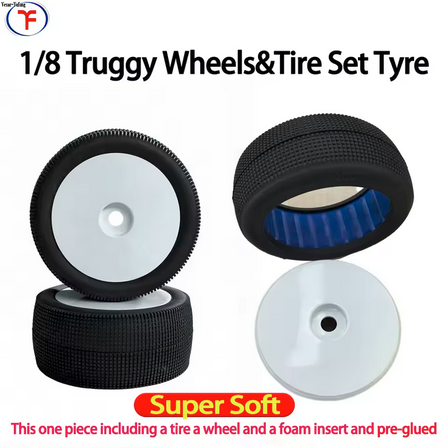
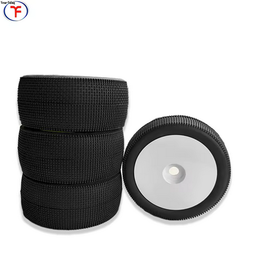
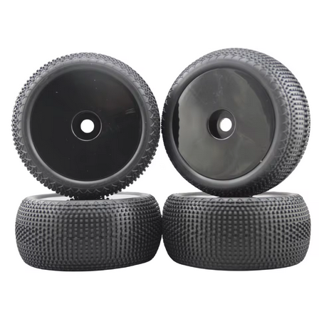
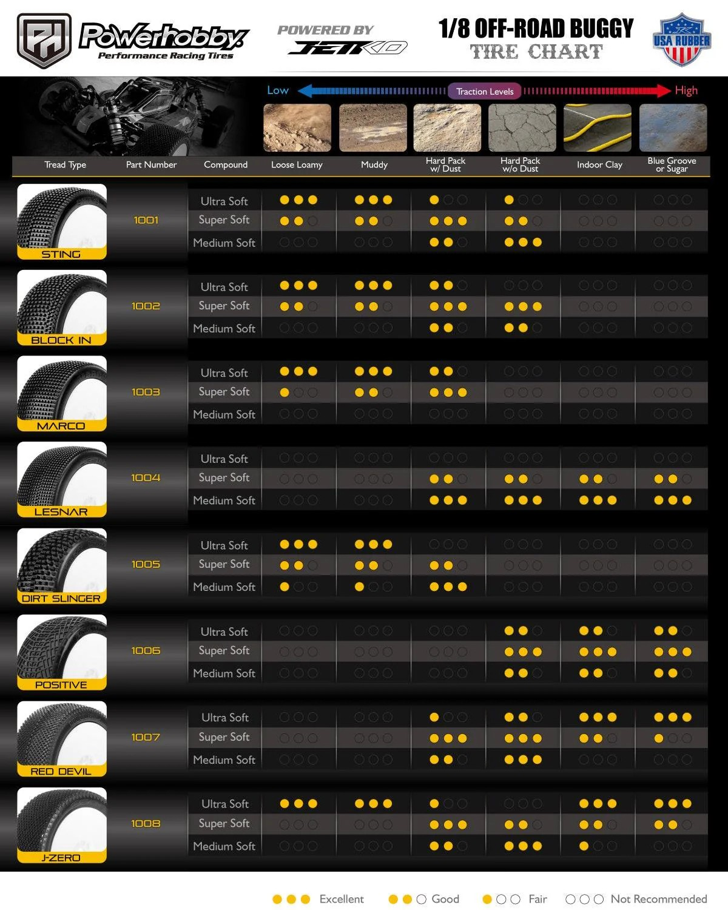

# Tire & Wheel Selection — E-Revo 1.0

> **Leaning: Yufung 1/8 truggy in Soft (blue), ~$50/set.** Yufung mimics the JConcepts compounds, so **blue = soft** and **green = super soft**. The green super-soft grips best on loose dust but **wears out in a few weekends** under the heavy Revo, so the **blue (soft) is the pick** for longer life; green stays as a grip special for the driest, lowest-grip days. Both are complete pre-glued truggy wheels with foam, 17 mm hex, and undercut the proven **JetKo J-Zero Super Soft (~$84/set)**.

  &nbsp; 
  <em>Yufung 1/8 truggy sets — left: blue (soft, leaning, longer wear) · right: green (super soft, grip special); both pre-glued with foam, 17 mm hex</em>

---

## Table of Contents

- [Track context](#track-context) — why low grip is the target
- [What I've run (baseline)](#what-ive-run-baseline) — the sets I run and their problems
- [Key Requirements](#key-requirements)
- [JConcepts Compound Key (hardness scale)](#jconcepts-compound-key-hardness-scale) — what each color means
- [What hardness for my track](#what-hardness-for-my-track) — loose low-grip dirt
- [Comparison (PowerHobby / JetKo)](#comparison-powerhobby--jetko) — top tread picks
- [Tire Comparison (Yufung)](#tire-comparison-yufung) — AliExpress options
- [Wheels / Mounting](#wheels--mounting) — hex, gluing, inserts
- [Price History](#price-history) — what I've paid
- [Notes](#notes)

---

## Track context

**Meldrum Bar Park** — unkept dirt, only the ramps + potholes get fixed occasionally. **Loose, dusty, low grip**, but can turn **grippy when wet**. The E-Revo runs **1/8 truggy tires (140 mm) on a 17 mm hex** — 140 mm is the size I originally ran. Low grip is the design target, balanced against tire life under the heavy truck.

---

## What I've run (baseline)

Two generic 143 mm truggy sets I own (both 17 mm hex, nylon rim, hard foam, 4 tires + 4 wheels):

- 🟢 **Chanmoo dense-block set — current favorite.** Tight block tread, white rim. **Forward grip is excellent**, but I **want more lateral (side) grip** for cornering. Cheap and the bar to beat. Paid **$19.64/set**.
- ❌ **Generic 26404 square-stud set — not a rebuy.** Black rim. **Only gripped when the track was moist**, mediocre on dry dust otherwise, and **wore fast**. Paid **$32.44/set** (Fiona Hobby, May 11 2026, order 8210691772464866).

  &nbsp; 
  <em>left: Chanmoo favorite (great forward grip, wants more lateral) · right: 26404 (only worked moist, wore fast)</em>

> **What the new tire has to do:** keep the Chanmoo's strong forward drive but **add lateral grip**, bite **dry loose dust** (not just moist), and **last longer**. A pin/spike "JConcepts similar" tread (Yufung) or the JetKo J-Zero should give more all-around side bite than the Chanmoo's longitudinal blocks.

---

## Key Requirements

| Requirement | Type | Why |
|---|---|---|
| **Grip on loose / dusty / low-grip dirt** | Must | Meldrum Bar's normal state; the tread has to find bite in loose dust |
| **Lateral / cornering grip** | Must | My favorite set has great forward grip but pushes in corners; the new tread needs side bite too |
| **Still works wet / grippy** | May | Track firms up and grips when wet |
| **Tread life under a heavy E-Revo** | Must | The heavy truck eats soft compounds fast; want reasonable life |
| **1/8 truggy / 17 mm hex fit** | Must | The Revo runs 1/8 truggy tires via a 17 mm hex |

---

## JConcepts Compound Key (hardness scale)

JConcepts marks compound with a **color stripe** on the tire. Softest to firmest:

| Color | Hardness | Best for |
|---|---|---|
| 🟢 **Green** | **Super soft** (softest) | All conditions, max grip on **loose / low-grip / damp** dirt; wears fastest |
| 🟡 **Gold** | Indoor soft | Indoor clay / carpet / astro |
| 🔵 **Blue** | **Soft** | All conditions, a touch firmer; better wear, for when the track firms up / wets up and grips |
| ⚪ **White** | Medium | Groove / blue-groove (packed-in, high-bite) conditions |
| 🟨 **Yellow** | Medium (firmest of this key) | Hard-packed, abrasive, longest wear |

> Softer = more mechanical grip + faster wear. Firmer = less grip + longer life, only worth it on high-bite/hard-packed tracks. On a **low-grip** track like mine, softer is better, so I want the **super-soft** end.
>
> ⚠️ **Yufung mimics the JConcepts compounds.** Its truggy tires map to the chart above: **green = super soft** (softest), **blue = soft**. One blue listing also stamps "Super Soft" on itself, which is loose marketing, so treat **green as the softer of the two**. Read the listing's stated compound, and remember its buggy line uses a Shore number instead (e.g. 50A = hard) for the firmer end.

---

## What hardness for my track

Meldrum Bar is **loose, dusty, low grip** (grippy only when wet). On low-traction dirt the **softer** compound finds more bite, so I run the soft end of the scale:

- ⭐ **Soft (blue) = the daily.** Still soft enough to bite on loose dust, but **lasts much longer** than super soft, which only goes a few weekends under the heavy Revo. Best value for the way I run.
- 🥈 **Super soft (green) = grip special.** Most bite for the driest, lowest-grip days, but wears fastest, so it's a save-it-for-when-you-need-it set, not the daily.
- 🚫 **Medium / hard (white / yellow / 50A) = skip.** Too hard for a low-grip surface; they'd just slide.
- 🏖️ **Beach:** dirt compounds don't work on dry sand, which wants a **paddle / sand tire**, not a compound pick. Separate tire if I run sand seriously.

---

## Comparison (PowerHobby / JetKo)

PowerHobby's own chart rates each JetKo tread + compound across track conditions (loose loamy → blue groove). For my loose, low-grip dirt, read the **loose loamy / muddy** columns in **Super Soft**.

 <em>PowerHobby / JetKo 1/8 off-road tire chart — tread × compound × track condition</em>

| Tire | Spec | Pros / Cons | Photo / Link |
|---|---|---|---|
| ⭐ **J-Zero** — *Super Soft, leaning* | Low-grip design, flexible deformation-zone tread  Mounted on 17 mm dish wheels  Price: **$41.99 / pair** ($84/set) | Pro: **Built for low grip** — flexible tread digs into loose dust and works wet/cold, exactly Meldrum Bar  Con: Gives up some bite if the track firms up or gets rough |  🚧 save as `src/tire_powerhobby_jzero_truggy.jpg` |
| 🔵 **Block In** — *Super Soft, rough-day alt* | Blocky all-terrain, qualifying speed, A-main life  Price: **$41.99 / pair** | Pro: **Strong on rough / choppy / medium dirt** with race speed  Con: Blocky tread is less ideal on pure loose dust than the J-Zero |  🚧 save as `src/tire_powerhobby_blockin_truggy.jpg` |
| 🔵 **Lesnar** — *durability, wrong track* | Longest-lasting race tire, quick/agile  Price: **$41.99 / pair** | Pro: **Best tread life** (fits the durability ethos), all-around  Con: **Not a low-grip specialist** — less bite on loose dust than J-Zero |  🚧 save as `src/tire_powerhobby_lesnar_truggy.jpg` |
| 🔵 **Desirer** — *low-grip, verify fit* | Low-grip oriented (mostly a buggy tread) | Pro: Another low-grip option  Con: Primarily a buggy tread; **verify truggy sizing** before buying |  🚧 save as `src/tire_powerhobby_desirer_truggy.jpg` |

---

## Tire Comparison (Yufung)

> Both are 1/8 **truggy** sets from the Yufung (Vexar-Yufung) store, same 140×105×60 size, pre-glued with foam. Difference is compound: **blue = soft** (more wear), **green = super soft** (more grip). Going **blue** for tire life since super soft only lasts a few weekends here. Both **undercut the ~$84 JetKo set**. (Yufung's buggy tires are skipped: the Revo runs the wider truggy size.)

| Tire | Spec | Pros / Cons | Photo / Link |
|---|---|---|---|
| ⭐ **Yufung 1/8 Truggy — Soft (blue)** — *leaning, daily* | Type: **1/8 truggy**, "JConcepts similar" tread  Compound: **soft** (blue; Yufung also calls it "Super Soft")  Outer dia: **140 mm** · width **60 mm** · rim **105 mm**  Hex: **17 mm**  Includes: **tire + rim + foam, pre-glued**  Price: **~$50–54 / set of 4** across its listings (was up to $93) | Pro: Still bites on loose dust but **lasts much longer** than super soft; complete glued wheel + foam, cheaper than JetKo  Con: Slightly less bite on dry loose dust than green |  |
| 🥈 **Yufung F802 1/8 Truggy — Super Soft (green)** — *grip special* | Type: **1/8 truggy** (F802), "JConcepts similar" tread  Compound: **super soft** (green)  Wheels: **white or yellow**  Outer dia: **140 mm** · width **60 mm** · rim **105 mm**  Hex: **17 mm**  Includes: **tire + rim + foam, pre-glued**  Price: **$52.06 / set of 4** (was $96.40) | Pro: **Softest = most grip** for the driest, lowest-grip days  Con: **Wears fastest** (a few weekends under the heavy Revo), so not the daily |  |

---

## Wheels / Mounting

- **Hex:** the Revo is on a **17 mm hex** conversion to run 1/8 truggy wheels — confirm any Yufung wheels are 17 mm.
- **Gluing:** race tires get **glued to the bead** (thin CA, run a bead around both sides). Don't trust AliExpress factory gluing for a race build; re-glue.
- **Inserts:** check whether the set ships with foams and whether they're firm enough for the heavy Revo's big landings; closed-cell aftermarket foams are cheap insurance if not.

---

## Price History

| Date | Item | Price | Notes |
|---|---|---|---|
| May 11, 2026 | Generic 26404 truggy set (Fiona Hobby) | **$32.44** | ✅ **purchased**, order 8210691772464866 (list $49.30). Baseline; only works moist, wore fast |
| — | Chanmoo 143 mm truggy set | **$19.64** | ✅ **owned**, current favorite; great forward grip, wants more lateral |
| — | Yufung truggy Soft (blue) | ~$50–54 | Leaning pick, not yet purchased |
| — | Yufung F802 truggy Super Soft (green) | $52.06 | Grip-special runner-up, not yet purchased |

---

## Notes

- **Going blue for tire life.** Super soft (green) grips best but only lasts a few weekends under the heavy Revo, so blue (soft) is the daily. Keep a green set around only for the driest, lowest-grip days.
- **Tread pattern matters too, not just compound.** My 26404 set only worked when moist and was poor on dry dust; my Chanmoo favorite has great forward grip but pushes in corners. The new picks ("JConcepts similar" / J-Zero low-grip treads) are chosen to bite dry loose dust and add the lateral grip the Chanmoo lacks.
- **140 mm is the right size.** That's the diameter I originally ran, and both Yufung truggy sets are 140 mm, so they're a direct fit.
- **Truggy only.** The Revo runs the wider 1/8 truggy size (140 mm dia, 60 mm wide). Yufung's buggy tires are skipped (narrower, wrong shape for this truck).
- **Heavy truck = compound life matters.** The E-Revo loads tires harder than a buggy, so soft compounds go off / wear faster. That's why blue (soft) is the longer-wear daily and green (super soft) is the grip special.
- **Cost:** JetKo J-Zero is **$41.99 / pair (~$84 / set of 4)**; Yufung truggy is **$52.06/set green** and **~$50–54/set blue** (complete pre-glued wheels with foam). Yufung is the budget play and fits the spec.
- **Pre-glued is convenient but verify.** Yufung ships glued and foamed, so install-and-go, but check the bead before a race day.
- **Beach is a different tire.** Dirt compounds don't work on dry sand; that's a paddle-tire problem, not a compound pick.
- **Verify before buying Yufung:** 17 mm hex fit and that the bead glue holds (140 mm dia already matches what I ran).
