# Tire & Wheel Selection — E-Revo 1.0

> **Leaning: Yufung 1/8 truggy in Soft (blue), ~$50/set.** Yufung mimics the JConcepts compounds, so **blue = soft** and **green = super soft**. The green super-soft grips best on loose dust but **wears out in a few weekends** under the heavy Revo, so the **blue (soft) is the pick** for longer life; green stays as a grip special for the driest, lowest-grip days. Both are complete pre-glued truggy wheels with foam, 17 mm hex, and undercut the **JetKo truggy treads (Block In / Lesnar, $27.99/pair tires-only, $41.99/pair mounted)** — the premium alternative if I want a proven race tire with more lateral bite.

  &nbsp; 
  <em>Yufung 1/8 truggy sets — left: blue (soft, leaning, longer wear) · right: green (super soft, grip special); both pre-glued with foam, 17 mm hex</em>

---

## Table of Contents

- [Track context](#track-context) — why low grip is the target
- [What I've run (baseline)](#what-ive-run-baseline) — the sets I run and their problems
- [Key Requirements](#key-requirements)
- [JConcepts Compound Key (hardness scale)](#jconcepts-compound-key-hardness-scale) — what each color means
- [What hardness for my track](#what-hardness-for-my-track) — loose low-grip dirt
- [Comparison (PowerHobby / JetKo)](#comparison-powerhobby--jetko) — top tread picks
- [Tire Comparison (Yufung)](#tire-comparison-yufung) — AliExpress options
- [Other options considered](#other-options-considered) — Traxxas Response Pro
- [Wheels / Mounting](#wheels--mounting) — hex, gluing, inserts
- [Price History](#price-history) — what I've paid
- [Notes](#notes)

---

## Track context

**Meldrum Bar Park** — unkept dirt, only the ramps + potholes get fixed occasionally. **Loose, dusty, low grip**, but can turn **grippy when wet**. The E-Revo runs **1/8 truggy tires (140 mm) on a 17 mm hex** — 140 mm is the size I originally ran. Low grip is the design target, balanced against tire life under the heavy truck.

---

## What I've run (baseline)

Two generic 1/8 truggy sets I own (17 mm hex, nylon rim, hard foam, 4 tires + 4 wheels). They differ in size: the **RedSpider favorite measures 140 mm dia × 70 mm wide (90 mm rim, 208 g)**, the **26404 is 143 mm dia × 63 mm wide (102 mm rim)** — taller, narrower, bigger rim. They set the bar the new tires have to beat:

> *Spec format (all tables below): **Type · Tread · Compound · Dia · Width · Rim · Hex · Weight · Foam · Pre-glued · Price**, `N/A` where unknown or not applicable.*

| Tire | Spec | Pros / Cons | Photo / Link |
|---|---|---|---|
| 🟢 **RedSpider dense-block set — current favorite** | **Type:** 1/8 truggy **Tread:** dense block (square-stud) **Compound:** soft rubber (unmarked) **Dia:** 140 mm **Width:** 70 mm **Rim:** 90 mm **Hex:** 17 mm **Weight:** 208 g **Foam:** soft sponge (packs out) **Pre-glued:** No **Price:** $19.64 / set (owned) | Pro: **Forward grip is excellent**; **wide 70 mm footprint** helps; cheap, the bar to beat  Con: **Wants more lateral (side) grip** for cornering; **soft sponge insert packs out** and **not pre-glued** | 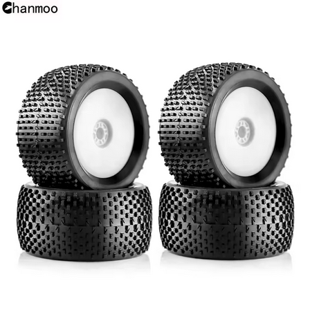 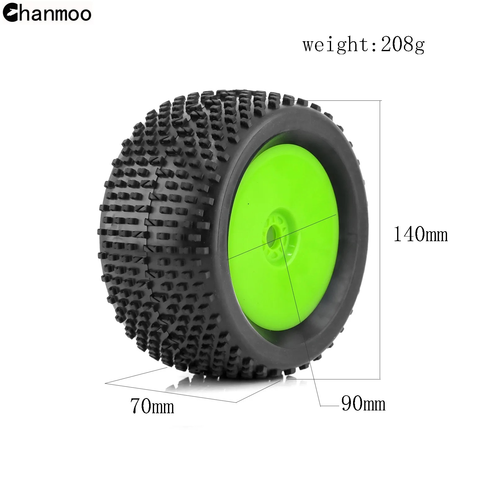 <em>tire · measured dims</em> |
| ❌ ~~**Generic 26404 square-stud set — not a rebuy**~~ | **Type:** 1/8 truggy **Tread:** square-stud **Compound:** soft rubber (unmarked) **Dia:** 143 mm **Width:** 63 mm **Rim:** 102 mm **Hex:** 17 mm **Weight:** N/A **Foam:** soft sponge (packs out) **Pre-glued:** No **Price:** $32.44 / set (Fiona Hobby, May 11 2026, order 8210691772464866) | Pro: Cheap-ish, fits  Con: **Only gripped when moist**, mediocre on dry dust, and **wore fast**; narrow 63 mm tread = smaller footprint, less grip; **soft sponge insert packs out** and **not pre-glued** |  |

> **What the new tire has to do:** keep the RedSpider's strong forward drive but **add lateral grip**, bite **dry loose dust** (not just moist), and last longer. A pin/spike "JConcepts similar" tread (Yufung) or a JetKo Block In should give more all-around side bite than the RedSpider's longitudinal blocks.

---

## Key Requirements

| Requirement | Type | Why |
|---|---|---|
| **Grip on loose / dusty / low-grip dirt** | Must | Meldrum Bar's normal state; the tread has to find bite in loose dust |
| **Lateral / cornering grip** | Must | My favorite set has great forward grip but pushes in corners; the new tread needs side bite too |
| **Closed-cell foam inserts** | May | The hard sponges in my RedSpider + 26404 sets pack out fast (OK only for a bit); closed-cell holds shape under the heavy Revo, but it's a preference not a dealbreaker |
| **Still works wet / grippy** | May | Track firms up and grips when wet |
| **Tread life under a heavy E-Revo** | May | The heavy truck eats soft compounds fast; reasonable life is nice but grip comes first |
| **1/8 truggy / 17 mm hex fit** | Must | The Revo runs 1/8 truggy tires via a 17 mm hex |

---

## JConcepts Compound Key (hardness scale)

JConcepts marks compound with a **color stripe** on the tire. Softest to firmest:

| Color | Hardness | Best for |
|---|---|---|
| 🟢 **Green** | **Super soft** (softest) | All conditions, max grip on **loose / low-grip / damp** dirt; wears fastest |
| 🟡 **Gold** | Indoor soft | Indoor clay / carpet / astro |
| 🔵 **Blue** | **Soft** | All conditions, a touch firmer; better wear, for when the track firms up / wets up and grips |
| ⚪ **White** | Medium | Groove / blue-groove (packed-in, high-bite) conditions |
| 🟨 **Yellow** | Medium (firmest of this key) | Hard-packed, abrasive, longest wear |

> Softer = more mechanical grip + faster wear. Firmer = less grip + longer life, only worth it on high-bite/hard-packed tracks. On a **low-grip** track like mine, softer is better, so I want the **super-soft** end.
>
> ⚠️ **Yufung mimics the JConcepts compounds.** Its truggy tires map to the chart above: **green = super soft** (softest), **blue = soft**. One blue listing also stamps "Super Soft" on itself, which is loose marketing, so treat **green as the softer of the two**. Read the listing's stated compound, and remember its buggy line uses a Shore number instead (e.g. 50A = hard) for the firmer end.

---

## What hardness for my track

Meldrum Bar is **loose, dusty, low grip** (grippy only when wet). On low-traction dirt the **softer** compound finds more bite, so I run the soft end of the scale:

- ⭐ **Soft (blue) = the daily.** Still soft enough to bite on loose dust, but **lasts much longer** than super soft, which only goes a few weekends under the heavy Revo. Best value for the way I run.
- 🥈 **Super soft (green) = grip special.** Most bite for the driest, lowest-grip days, but wears fastest, so it's a save-it-for-when-you-need-it set, not the daily.
- 🚫 **Medium / hard (white / yellow / 50A) = skip.** Too hard for a low-grip surface; they'd just slide.
- 🏖️ **Beach:** dirt compounds don't work on dry sand, which wants a **paddle / sand tire**, not a compound pick. Separate tire if I run sand seriously.

---

## Comparison (PowerHobby / JetKo)

PowerHobby's chart (below) is for the **buggy** line. For **truggy** (what the Revo runs) PowerHobby only sells **two treads — Block In and Lesnar** — each in **Ultra Soft / Super Soft / Medium Soft**, all in stock. Pricing is the same across colors/compounds: **$41.99/pair mounted** (≈$84/set of 4) or **$27.99/pair tires-only** (≈$56/set). The chart's J-Zero, Desirer, etc. are buggy-only, so they're off the table here.

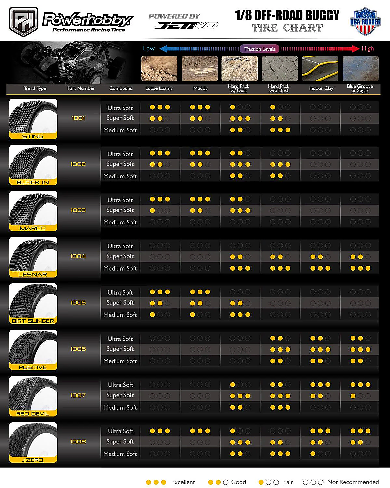 <em>PowerHobby / JetKo 1/8 off-road tire chart (buggy line) — tread × compound × track condition</em>

| Tire | Spec | Pros / Cons | Photo / Link |
|---|---|---|---|
| ⭐ **Block In** — *the JetKo truggy pick* | **Type:** 1/8 truggy **Tread:** aggressive blocky-pin **Compound:** Ultra / Super / Medium Soft **Dia:** N/A **Width:** N/A **Rim:** N/A **Hex:** 17 mm **Weight:** N/A **Foam:** included (mounted) / N/A (tires-only) **Pre-glued:** Yes (mounted) / No (tires-only) **Price:** $41.99/pair mounted, $27.99/pair tires-only (≈$84 / ≈$56 per set of 4) | Pro: **Aggressive blocks bite loose/choppy dirt and give more lateral grip** (what I'm after); all three compounds in stock. Super Soft for loose dust, Medium Soft for wear  Con: Pricier than Yufung; soft compounds still wear under the heavy Revo | 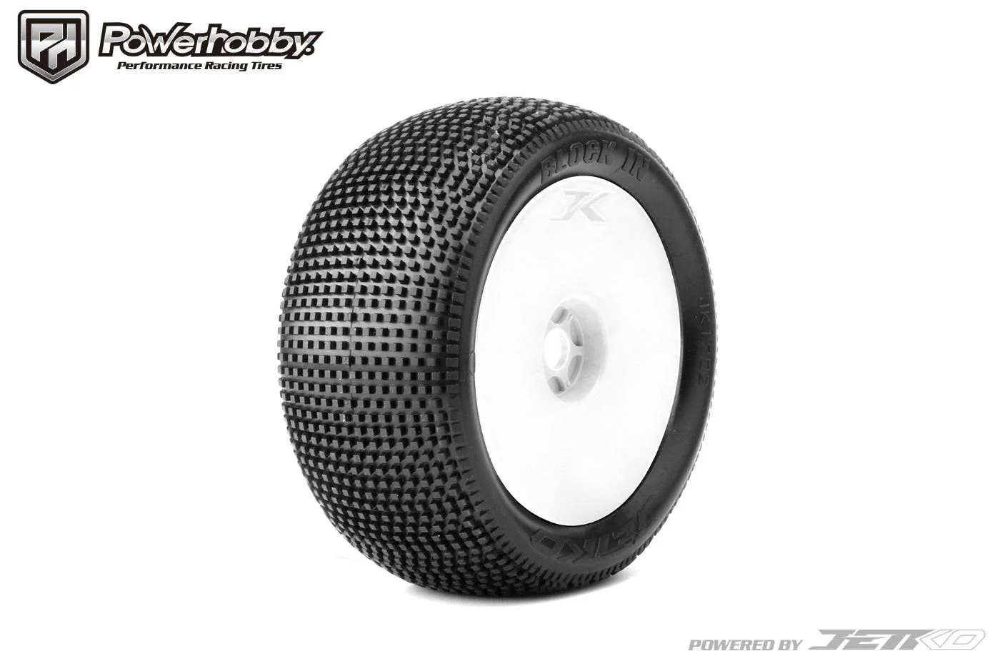 |
| 🥈 **Lesnar** — *longest wear, all-around* | **Type:** 1/8 truggy **Tread:** fine micro-pin **Compound:** Ultra / Super / Medium Soft **Dia:** N/A **Width:** N/A **Rim:** N/A **Hex:** 17 mm **Weight:** N/A **Foam:** included (mounted) / N/A (tires-only) **Pre-glued:** Yes (mounted) / No (tires-only) **Price:** $41.99/pair mounted, $27.99/pair tires-only | Pro: **Best tread life**, smooth all-around; Medium Soft for max wear  Con: Less aggressive bite on loose dust and less lateral edge than Block In | 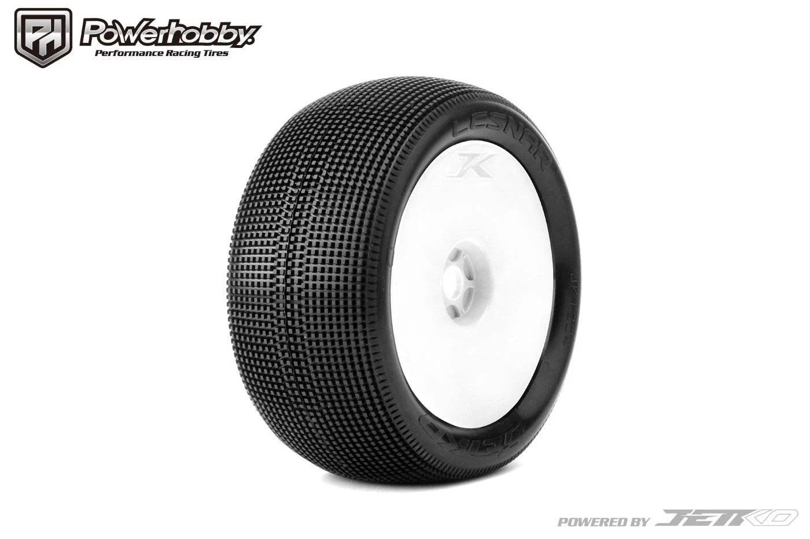 |
| 🚫 ~~**Losi XXT — LOSA17701B (8ight-T)**~~ — *Losi brand, sold by PowerHobby* | **Type:** 1/8 truggy **Tread:** XXT square-stud **Compound:** blue (unspecified) **Dia:** N/A **Width:** N/A **Rim:** N/A **Hex:** 17 mm **Weight:** N/A **Foam:** included **Pre-glued:** Yes (pre-mounted) **Price:** $57.99 / pair (~$116/set), **out of stock** | Pro: Real Losi race tire, pre-mounted  Con: **I don't like Losi tires on my track** (always the first set thrown out). Also **unavailable** and **~$116/set** is double the Yufung; XXT square-stud tread is like my 26404 (the one that only worked moist) | 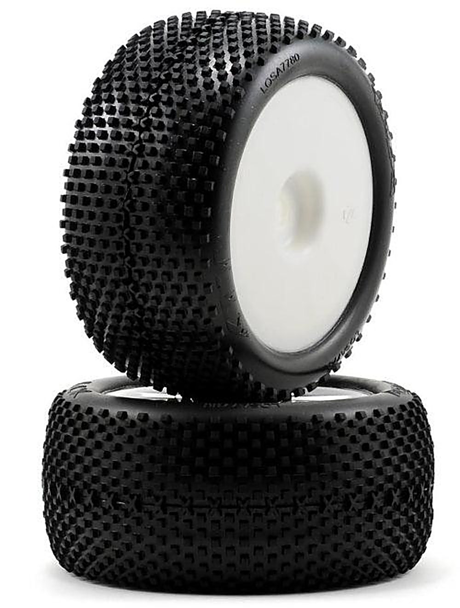 |

---

## Tire Comparison (Yufung)

> Both are 1/8 **truggy** sets from the Yufung (Vexar-Yufung) store, same 140×105×60 size, pre-glued with foam. Difference is compound: **blue = soft** (more wear), **green = super soft** (more grip). Going **blue** for tire life since super soft only lasts a few weekends here. Both **undercut the ~$84 JetKo set**. (Yufung's buggy tires are skipped: the Revo runs the wider truggy size.)
>
> ⚠️ **Width watch:** the Yufung truggy is **60 mm wide**, narrower than my RedSpider favorite (**70 mm**). Since I want **more** lateral grip, a narrower tire pushes the wrong way. Confirm the actual mounted width and compare to a 70 mm JetKo truggy before committing.

| Tire | Spec | Pros / Cons | Photo / Link |
|---|---|---|---|
| ⭐ **Yufung 1/8 Truggy — Soft (blue)** — *leaning, daily* | **Type:** 1/8 truggy **Tread:** "JConcepts similar" pin **Compound:** Soft (blue; Yufung also calls it "Super Soft") **Dia:** 140 mm **Width:** 60 mm **Rim:** 105 mm **Hex:** 17 mm **Weight:** N/A **Foam:** closed-cell **Pre-glued:** Yes **Price:** ~$50–54 / set of 4 (was up to $93) | Pro: Still bites on loose dust but **lasts much longer** than super soft; **pre-glued with closed-cell foam** (meets my insert must), cheaper than JetKo  Con: Slightly less bite on dry loose dust than green; **60 mm wide vs my 70 mm favorite** (could mean less lateral grip) |  |
| 🥈 **Yufung F802 1/8 Truggy — Super Soft (green)** — *grip special* | **Type:** 1/8 truggy (F802) **Tread:** "JConcepts similar" pin **Compound:** Super soft (green) **Dia:** 140 mm **Width:** 60 mm **Rim:** 105 mm **Hex:** 17 mm **Weight:** N/A **Foam:** closed-cell **Pre-glued:** Yes **Price:** $52.06 / set of 4 (was $96.40) | Pro: **Softest = most grip** for the driest, lowest-grip days; pre-glued with closed-cell foam  Con: **Wears fastest** (a few weekends under the heavy Revo), so not the daily; **60 mm wide vs my 70 mm favorite** |  |

---

## Other options considered

| Tire | Spec | Pros / Cons | Photo / Link |
|---|---|---|---|
| 🔵 **AKA EVO Gridiron — 1/8 truggy** — *popular name-brand pick* | **Type:** 1/8 truggy (EVO, ROAR-legal bead) **Tread:** Gridiron — square outer pins + bar center pins **Compound:** Super Soft / Soft (**Long Wear**); Medium in tires-only **Dia:** N/A **Width:** N/A **Rim:** EVO dish (white/yellow; convex, 6.5% lighter, optional stiffening disk) **Hex:** 17 mm **Weight:** N/A **Foam:** red insert (included) **Pre-glued:** Yes (pre-mounts, hand-glued AKA premium glue); tires-only No **Price:** **$39.99/pair pre-mounted (~$80/set of 4)**; ~$39.99/pair tires+inserts | Pro: **What most people run**; **square outer pins add lateral bite** (what I want); **Long Wear compounds last longer** (helps wear); quality balanced pre-mounts on a lighter EVO wheel; comes with foam  Con: AKA's own chart rates it only **"good" (not best) for loose loamy** — it's really a **hard-pack / low-dust** tire, so City Block / I-Beam bite more on my loose dirt; **back-ordered (expected Aug 6 2026)**; premium price (~$80/set vs ~$50 Yufung) | 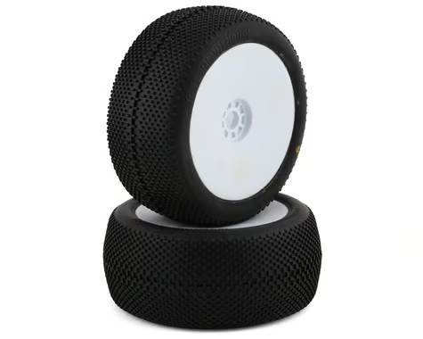 |
| 🔵 **AKA City Block — 1/8 truggy** — *popular, better in loose than Gridiron* | **Type:** 1/8 truggy (EVO, ROAR-legal bead) **Tread:** City Block — two-stage: square mini-pins over deeper rectangular blocks **Compound:** Super Soft / Soft / Medium / Hard (Long Wear); sidewall color-coded (soft=green, med=blue, hard=yellow) **Dia:** N/A **Width:** N/A **Rim:** white dish (pre-mounted) / EVO **Hex:** 17 mm **Weight:** N/A **Foam:** contoured insert (included) **Pre-glued:** Yes (pre-mounts) / No (tires-only) **Price:** **$55.99/pair pre-mounted (~$112/set)**; pre-mount **discontinued online** (tires-only may still exist) | Pro: Popular and **more versatile than the Gridiron** — mini-pins grip, but the **deeper blocks dig into loose dirt** when you drift off line; **AKA's chart rates it "best" for loose loamy** (my track); Long Wear compounds; Super Soft for cool/transitioning tracks; quality pre-mounts + foam  Con: Still a hard/medium-pack design at heart; **pre-mount discontinued** (hunt tires-only or other sellers); **priciest option (~$112/set vs ~$50 Yufung)** | 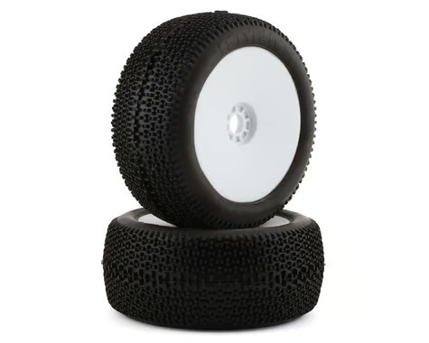 |
| 🔵 **Traxxas Response Pro — 5375R** — *wanted for the rim* | **Type:** 3.8" MT / truggy (Revo / Maxx) **Tread:** Response Pro spike (same style as the RedSpider) **Compound:** ultra-soft **Dia:** N/A (unknown without rim specs) **Width:** N/A **Rim:** 3.8" dish, **special offset** (the reason to buy) **Hex:** 17 mm **Weight:** N/A **Foam:** race-tuned (included) **Pre-glued:** Yes **Price:** $39.95 / pair | Pro: **Special-offset 3.8" rim** is the real draw; same tread style as my RedSpider favorite; ultra-soft, taller profile claims more side bite; pre-glued with race foam  Con: **Response Pro tires rip very easily** — buy it for the rim, not the tire. Tire OD unknown unless I can find the rim specs | 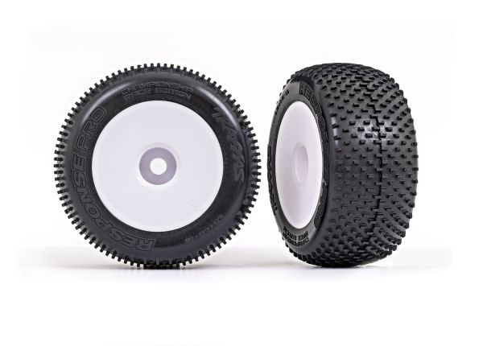 |

#### AKA tire charts & track fit

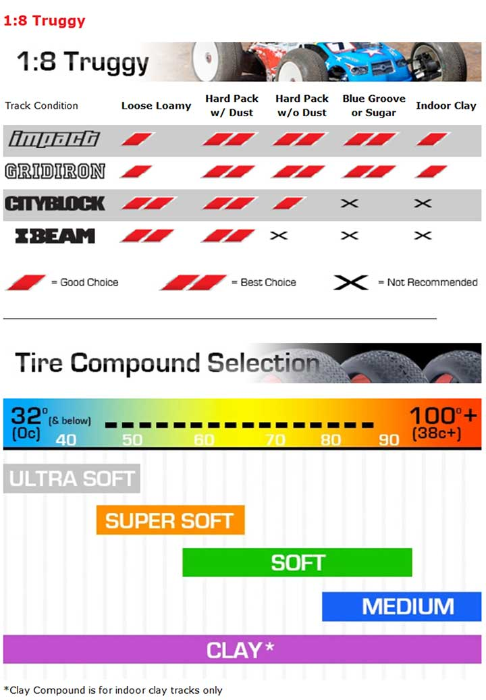&nbsp;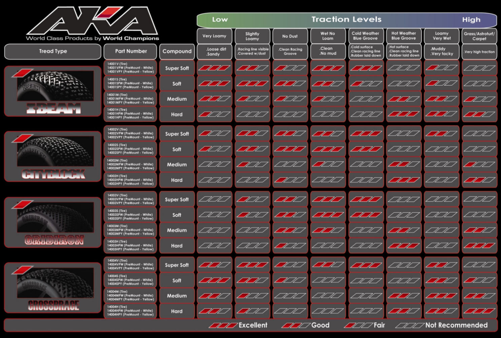 <em>left: AKA 1/8 truggy tread × condition + compound-by-temp · right: full AKA chart with part numbers / granular traction</em>

> **What AKA's chart says for my track (loose, dusty, low grip):** for **Loose Loamy**, AKA rates **City Block and I-Beam "best"**, and **Gridiron + Impact only "good."** So the Gridiron is really a hard-pack tire here; **City Block (or the loose-specialist I-Beam) is the better AKA pick** for my dirt. Compound by temperature: **Ultra Soft** for cold (<~50°F), **Super Soft** for cool, **Soft** once it warms.
>
> **Best overall (one set, run until worn): AKA City Block, Soft (Long Wear).** I run a set till it's dead, so versatility + wear win. My track lives between **loose loamy** (normal) and **hard-pack with dust** (dried out) and never blue-grooves — and City Block rates **"best" at both** of those, covering my whole range. I-Beam dies once it dries; Gridiron/Impact are only "good" on loose (my most common state). Soft Long Wear balances grip and life under the heavy Revo; Super Soft only if I want max grip and accept faster wear.

---

## Wheels / Mounting

- **Hex:** the Revo is on a **17 mm hex** conversion to run 1/8 truggy wheels — confirm any Yufung wheels are 17 mm.
- **Gluing:** race tires get **glued to the bead** (thin CA, run a bead around both sides). Don't trust AliExpress factory gluing for a race build; re-glue.
- **Inserts: closed-cell is a must.** The hard sponges that came with my RedSpider and 26404 sets are OK for a bit then **pack out / go off**, and the **correct size is hard to find**. Those sets also came **not pre-glued**, so I had to glue them myself. **Yufung solves both:** all their sets come with **closed-cell inserts** and **pre-glued** — a real plus over my current tires.

---

## Price History

| Date | Item | Price | Notes |
|---|---|---|---|
| May 11, 2026 | Generic 26404 truggy set (Fiona Hobby) | **$32.44** | ✅ **purchased**, order 8210691772464866 (list $49.30). Baseline; only works moist, wore fast |
| — | RedSpider 143 mm truggy set | **$19.64** | ✅ **owned**, current favorite; great forward grip, wants more lateral |
| — | Yufung truggy Soft (blue) | ~$50–54 | Leaning pick, not yet purchased |
| — | Yufung F802 truggy Super Soft (green) | $52.06 | Grip-special runner-up, not yet purchased |

---

## Notes

- **Going blue for tire life.** Super soft (green) grips best but only lasts a few weekends under the heavy Revo, so blue (soft) is the daily. Keep a green set around only for the driest, lowest-grip days.
- **Softer isn't always more grip.** Past a point a too-soft compound can actually hook up *worse* — it squirms, balls up, or greases over under the heavy Revo. So "super soft" isn't automatically best; another reason blue (soft) over green here.
- **Tread pattern matters too, not just compound.** My 26404 set only worked when moist and was poor on dry dust; my RedSpider favorite has great forward grip but pushes in corners. The new picks ("JConcepts similar" / Block In treads) are chosen to bite dry loose dust and add the lateral grip the RedSpider lacks.
- **140 mm dia is the right height** (matches the RedSpider favorite), and both Yufung truggy sets are 140 mm. But **width matters for lateral grip:** the Yufung is **60 mm** vs the RedSpider's **70 mm**, so it could give *less* side bite, not more. A 70 mm JetKo truggy may be the better width match.
- **Truggy only.** The Revo runs the wider 1/8 truggy size (140 mm dia, 60 mm wide). Yufung's buggy tires are skipped (narrower, wrong shape for this truck).
- **Heavy truck = compound life matters.** The E-Revo loads tires harder than a buggy, so soft compounds go off / wear faster. That's why blue (soft) is the longer-wear daily and green (super soft) is the grip special.
- **Cost:** JetKo truggy (Block In / Lesnar) is **$41.99/pair mounted (~$84/set)** or **$27.99/pair tires-only (~$56/set)**; Yufung truggy is **$52.06/set green** and **~$50–54/set blue** (complete pre-glued wheels with foam). Yufung is the budget play and fits the spec.
- **JetKo truggy = Block In or Lesnar only.** The J-Zero/Desirer/Zero treads from the chart are 1/8 buggy, not sold in truggy. Block In (aggressive, more lateral bite) is the JetKo pick if I go premium; Lesnar if I want max wear.
- **Pre-glued is convenient but verify.** Yufung ships glued and foamed, so install-and-go, but check the bead before a race day.
- **Beach is a different tire.** Dirt compounds don't work on dry sand; that's a paddle-tire problem, not a compound pick.
- **Verify before buying Yufung:** 17 mm hex fit and that the bead glue holds (140 mm dia already matches what I ran).
