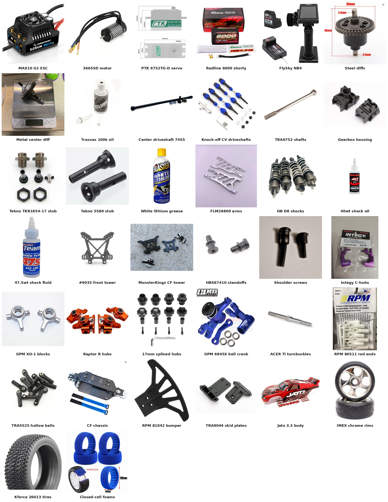

# Bill of Materials — FastAzJato4x4

Everything on the car, nothing that isn't. **Qty** is how much of the product was bought, **Price** is what it cost and what that covers, and anything else sits in a small note under the part. The reasoning behind each pick is in the linked doc.

 <em>Most of the parts on the car. A few have no photo yet, so the tables below are the full list.</em>

## Cost Summary

| Section | Subtotal |
|---|---|
| [Electronics](#electronics) | $383.73 |
| [Drivetrain](#drivetrain) | $164.79 |
| [Suspension](#suspension) | $188.71 |
| [Hubs](#hubs) | $109.87 |
| [Steering](#steering) | ~$80.53 |
| [Chassis & Bumpers](#chassis--bumpers) | $90.12 |
| [Aero & Body](#aero--body) | $34.47 |
| [Wheels](#wheels) | $51.93 |
| **Total** | **~$1,104** |
| **Car only, without the battery and radio** | **~$871** |

Still open: a full sealed bearing kit (the hub bearings are already fitted and working), 

---

## Electronics

| Part | Qty | Source | Price | Doc |
|---|---|---|---|---|
| **HobbyWing EZRun MAX10 G2 140A + 3665SD G3 2400KV combo, 38020343** | 1 | Hobbywing direct | **$127.00 / combo** | [ESC](esc_analysis.md), [Motor](motor_analysis.md) |
| **PTK 9752TG-D servo** | 1 | AliExpress, PTK Servo Store | **$19.65 each** | [Servo](servo_analysis.md) |
| **Gens Ace Redline 2.0 4S HV 6000mAh 140C shorty, GEA60004S14S** Note: 410 g | 1 | eBay, mugrc-store | **$92.26 each** | [Battery](battery_analysis.md) |
| **FlySky Noble NB4 radio** Note: running the FGr4S V2 receiver | 1 | AliExpress, Hi-Goeswell | **$140.91 each** | [Radio](radio_analysis.md) |
| **Receiver box** Note: knock-off clear blue Slash 4x4 LCG battery box, used for the RX. $3.34 for 2 pcs, $3.91 with fees | 1 | AliExpress, Goodluck RC Store | **$3.91 / pair** | [RX box](radio_analysis.md#rx-box-and-how-its-mounted) |

## Drivetrain

| Part | Qty | Source | Price | Doc |
|---|---|---|---|---|
| **Steel front + rear diffs, knock-off Slash 4x4** Note: 5mm outdrives, come with the I-bar | 1 | AliExpress, RS RC Store | **$15.26 / 2-pack** | [Diffs](differential_analysis.md#front--rear-diff-comparison) |
| **Metal center diff, Traxxas 6780-style** Note: integrated steel 54T spur, running a 16T pinion, order 8213147729824866 | 1 | AliExpress, E-star RC Car Store | **$19.06 each** | [Center diff](differential_analysis.md#center-diff) |
| **Traxxas 100k diff oil, TRA5130** Note: center diff | 1 | Tammies Hobbies | **$8.00 / bottle** | [Diff oil](differential_analysis.md#center-diff-oil) |
| **Traxxas 30k diff oil, TRA5136** Note: front diff | 1 | Tammies Hobbies | **$7.50 / bottle** | [Diff oil](differential_analysis.md#front--rear-diff-oil) |
| **Traxxas 10k diff oil, TRA5135** Note: rear diff, run greased | 1 | Tammies Hobbies | **$7.50 / bottle** | [Diff oil](differential_analysis.md#front--rear-diff-oil) |
| **Jato 4x4 BL-2S center driveshaft, 7455** Note: take-off, with pinion and bearings | 1 | Jenny's RC | **$2.49 each** | [Driveshafts](driveshaft_analysis.md#center-driveshaft-comparison) |
| **Steel CV driveshafts, front + rear, knock-off TRA6851R / TRA6852R** Note: order 8211906604054866 | 1 | AliExpress, FengS Store | **$21.10 / set of 4** | [Driveshafts](driveshaft_analysis.md) |
| **Traxxas TRA6752 long output shafts** Note: the knock-off set's stock shafts are too short | 4 | Nitro Hobbies | **$8.00 each** | [Driveshafts](driveshaft_analysis.md#2wd-long-cvds--6752-output-shafts-cheap-long-axle-build) |
| **Traxxas TRA6881 front gearbox housing** | 1 | Tammies Hobbies | **$4.00 each** | [Housings](gearbox_housing_analysis.md) |
| **Traxxas TRA6880 rear gearbox housing** | 1 | Tammies Hobbies | **$4.00 each** | [Housings](gearbox_housing_analysis.md) |
| **Tekno TKR1654-17 front stubs** Note: $15.00 + $4.99 shipping, order 18-13082-92531, May 2025 | 1 | eBay, kool_toyz_4u | **$19.99 / pair** | [Stubs](driveshaft_analysis.md#tekno-stubs-front--rear) |
| **Tekno 5580 rear stubs** Note: bought 2 pairs for $33.80, the second pair was for a friend | 1 | eBay, mr-retro | **$16.90 / pair** | [Stubs](driveshaft_analysis.md#tekno-stubs-front--rear) |
| **B'LASTER white lithium grease, SKU 56817** Note: 11 oz spray, on the CVDs and gears, not inside the diffs | 1 | Harbor Freight, SKU 56817 | **$6.99 / can** | [Grease](driveshaft_analysis.md#grease-cvds--gears) |

## Suspension

| Part | Qty | Source | Price | Doc |
|---|---|---|---|---|
| **FLM26800 extended arms** | 2 | FLM | **$25.73 / pair** | [Arms](arm_analysis.md) |
| **Hot Bodies D8 97mm big-bore shocks, HBS67296** Note: used, came with white 59gf front / grey 52gf rear springs and 1.4mm × 6 pistons, plus $8 shipping | 1 | eBay, guavahobby | **$65.99 / set of 4** | [Shocks](shock_analysis.md) |
| **Losi TLR74030 silicone shock oil, 37.5wt** Note: front, 468 cSt, 4 oz. Nitro Hobbies order #137456, Aug 31 2026 | 1 | Nitro Hobbies | **$9.99 / bottle** | [Shock oil](shock_analysis.md#setup-spec-springs--pistons--oil) |
| **Associated 5480 FT silicone shock fluid, 50wt** Note: rear, 650 cSt, 4 oz. Nitro Hobbies order #137456, Aug 31 2026 | 1 | Nitro Hobbies | **$9.99 / bottle** | [Shock oil](shock_analysis.md#setup-spec-springs--pistons--oil) |
| **Traxxas Jato 4x4 front shock tower, 9033-GRAY** | 1 | Tammies Hobbies | **$6.00 each** | [Towers](shock_tower_analysis.md) |
| **MonsterKingz G-Maxx carbon fiber shock towers** Note: front + rear set, rear only used | 1 | eBay, MonsterKingz | **$33.29 / set** | [Towers](shock_tower_analysis.md) |
| **HB Racing HBS67410 shock standoffs** Note: rear CF tower | 1 | AMain | **$3.99 / pair** | [Standoffs](shock_analysis.md#shock-standoffs--mounting) |
| **Traxxas wheelie bar shoulder screws, TRA4976** Note: front upper shock mounts. These came off a free TRA5472 wheelie bar; TRA4976 (wheels + axles) is the cheapest way to buy the same screw | 1 | Free wheelie bar | **$0**, rebuy **$4 / set of 2** | [Shoulder screws](shock_tower_analysis.md#front-shock-mounting-wheelie-bar-shoulder-screws) |

## Hubs

| Part | Qty | Source | Price | Doc |
|---|---|---|---|---|
| **Integy C26402PURPLE billet C-hubs** | 1 | eBay, jontobitt1118 | **$13.62 / pair** | [Hubs](hub_analysis.md) |
| **GPM XO-1 alloy steering blocks** | 1 | GPM | **$19.16 / pair** | [Hubs](hub_analysis.md) |
| **Traxxas Raptor R Ultimate alloy hub set, 9063 / 9064 / 9065** Note: front + rear set, only the 9065 rear carriers are used | 1 | eBay, toysion | **$68.73 / set** | [Hubs](hub_analysis.md#price-history) |
| **Aftermarket 17mm splined wheel hubs, E-Revo 1.0 fit** Note: black, 2-3mm wider per corner, no barrel nut needed on Tekno stubs | 1 | AliExpress | **$8.36 / set of 4** | [17mm hubs](hub_analysis.md#17mm-wheel-hubs-hexes) |

## Steering

| Part | Qty | Source | Price | Doc |
|---|---|---|---|---|
| **GPM 6845X aluminum bell crank** Note: ships with brass bushings | 1 | GPM | **$19.98 each** | [Bell crank](steering_bell_crank_analysis.md) |
| **GPM RUS416026ST-S servo link + 25T alloy horn** Note: servo horn to bell crank, 6pc set, 8.0 g | 1 | GPM | **$7.61 / set** | [Bell crank](steering_bell_crank_analysis.md) |
| **ACER Racing titanium M4x60 turnbuckles** | 6 | ACER Racing | **$5.99 each** | [Tie rods](tie_rod_analysis.md) |
| **RPM 80511 long rod ends, white** | 1 | RPM | **~$7-9 / pack of 12** | [Tie rods](tie_rod_analysis.md#rod-ends-the-plastic) |
| **Traxxas TRA5525 rod ends** Note: for the hollow balls | 1 | Traxxas | **$9.00 / pack of 12** | [Tie rods](tie_rod_analysis.md#rod-ends-the-plastic) |

## Chassis & Bumpers

| Part | Qty | Source | Price | Doc |
|---|---|---|---|---|
| **Carbon fiber chassis kit, Slash 4x4 VXL TRA6808 pattern** | 1 | AliExpress, RCTOYFUN | **$73.17 / kit** | [Chassis](chassis_analysis.md) |
| **Front + rear bulkhead tie bars** Note: DIY from scrap aluminum instead of Traxxas 6823, front filed to clear the arm | 2 | DIY | **$0** | [Chassis](chassis_analysis.md#notes) |
| **RPM 81042 wide front bumper, black** Note: from Mike | 1 | Mike | **$9.95 each** | [Bumpers](bumper_analysis.md) |
| **Traxxas TRA9044 skid plates** Note: front + rear set, rear only used | 1 | Tammies Hobbies | **$7.00 / set** | [Bumpers](bumper_analysis.md) |

## Aero & Body

| Part | Qty | Source | Price | Doc |
|---|---|---|---|---|
| **Traxxas Jato 3.3 body, 5511A red** Note: take-off, its own integrated wing means no separate wing | 1 | Jenny's RC | **$34.47 each** | [Body](aero_analysis.md#body-comparison) |

## Wheels

| Part | Qty | Source | Price | Doc |
|---|---|---|---|---|
| **IMEX IMX7893 1/8 Rally chrome rims** Note: list price, glued rally slicks removed | 2 | IMEX Model Company | **$19.99 / pair** | [Rims](wheel_analysis.md#rims-bare-wheels) |
| **Kforce 26013 1/8 buggy tires, Mitsubishi-logo tread** Note: 110 × 43mm, natural rubber 35° | 1 | AliExpress | **$3.87 / set of 4** | [Tires](wheel_analysis.md#tires-tire-only-mount-on-your-own-rims) |
| **Closed-cell foam inserts, blue** | 1 | AliExpress | **$8.08 / set of 4** | [Foams](wheel_analysis.md#foam-inserts) |
