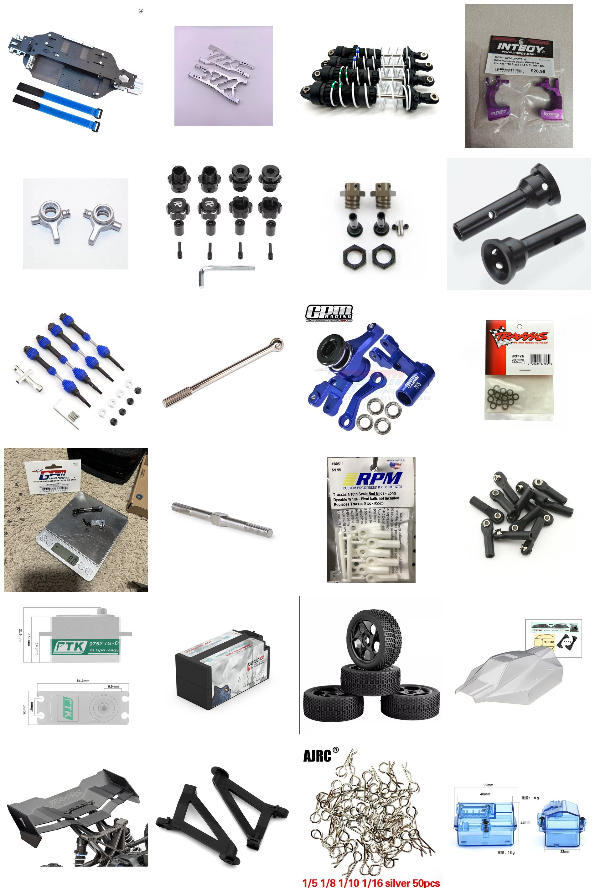

# Bare-Bones BOM — FastAzJato4x4

**Buy a running Jato 4x4 for $200, then spend ~$465 turning it into this car.** Total **~$665**, against ~$1,115 for the real build.

> This isn't the car in [`BOM.md`](BOM.md) — that one's the real build, personal touches and bad decisions included. **This is the cheapest honest way I know to get the same speed**, and it starts with somebody else's used truck rather than a box of new parts. **Every price here is one I actually paid or found**, pulled from the full BOM or its analysis docs. The only two I haven't bought myself are the pinion and the battery, and those are current retail with the listings linked.

 <em>The bare-bones parts list. Most of what you buy, plus the stock pieces the donor hands you.</em>

**The starting point:** a **running Jato 4x4 VXL (90386-4, the 4S model) for $200**. **$200-250 is the real range** — anything priced above that sits unsold, so don't pay it. That comes with the bearings, the diffs, the gearbox housings, the shock towers, the GTR shocks, the body, the wing and its mount, the radio and a working 4S brushless system. **You keep all of it.** What you replace is what makes the car fast and what makes it survive.

## Cost Summary

| Section | Subtotal |
|---|---|
| [Donor Car](#donor-car) | $200.00 |
| [Chassis](#chassis) | $73.17 |
| [Drivetrain](#drivetrain) | $97.07 |
| [Suspension](#suspension) | $51.46 |
| [Hubs & Carriers](#hubs--carriers) | $41.14 |
| [Steering](#steering) | $84.53 |
| [Wheels & Tires](#wheels--tires) | $30.44 |
| [Body & Aero](#body--aero) | $10.00 |
| [Electronics](#electronics) | $77.64 |
| **Total** | **~$665** |
| **Without the battery** | **~$607** |

**The radio, the ESC, the motor and nearly every bearing come with the donor**, which is why this lands near half the full build. **At the top of the donor range ($250) it's ~$715.**

**If you own a printer this drops to ~$656**, since the $10 of printing is about $1 of filament when it's your machine and your time.

---

## Donor Car

| Part | Qty | Source | Price | Doc |
|---|---|---|---|---|
| **Running Traxxas Jato 4x4 VXL, 90386-4** Note: the 4S model, bought used and running. Supplies the bearings, diffs, gearbox housings, shock towers, GTR shocks, body, wing, wing mount, radio and the 4S brushless system. **$200-250 is the market**, above that they don't sell | 1 | Used, private sale | **$200.00 each** | [Bearings](bearings_reference.md) |

### Any Traxxas 4x4 can be the donor

**Slash 4x4, Jato 4x4, Rustler 4x4, Hoss, Rally — as long as it's a 4x4, it works.** They're the same family this build already draws from: the [CF chassis kit](chassis_analysis.md) is a **Slash 4x4 VXL (TRA6808) pattern**, the diffs are knock-off Slash 4x4, the CVDs are **TRA6851R / TRA6852R** clones, and the **TRA6881 / TRA6880 gearbox housings are the Slash 4x4 / Jato 4x4 family part**. A non-Jato donor fits this list natively rather than in spite of it, and Slashes and Rustlers are far more common used than Jatos.

**Even an old HCG Slash works, and those go for $50-150.** The high center of gravity is the usual reason to avoid one, and **it's irrelevant here, because the stock chassis gets binned for the CF plate either way.** You're buying the car for its drivetrain.

### What a non-Jato donor costs you

**Mostly just the rear wing mount and the towers.** The Jato **front** tower is the pick, because it's **taller and works well**. At the **rear**, the donor's own Slash tower may be the better choice, and not just the cheaper one — see the two options below.

| Add | Cost | Why |
|---|---|---|
| **Traxxas 9033 front tower** (Jato 4x4) | **$6.00 / tower** | Taller than the Slash front tower and proven on this build |
| **Traxxas TRA9046 rear wing mount** | **$7.00 / set** | What nearly every non-Jato donor needs to carry a wing |
| ⭐ **Rear tower, option A:** keep the donor's **Slash rear tower** and make a **small aluminum plate** on top to interface the wing | **$0**, easy | **It's where the shock mounts that matters.** The Slash tower puts the rear shocks **forward of the rear bumper line**, closer to the middle of the car, which **moves weight forward** into the nose bias this build wants, and takes them out of the crash path. The plate is a simple flat piece, the [Meelobee technique](aero_analysis.md#wing-mount-comparison). **Free, and the better handling answer** |
| **Rear tower, option B:** buy the **Traxxas 9034 rear tower** (Jato 4x4) | **$6.00 / tower** | Taller and bolt-on with no plate to make, but the **9034 hangs the shocks further back**, adding tail weight and cutting the nose bias. Simplicity at the cost of handling |
| **Shocks, Traxxas GTR XX-Long 7462-GRAY** | **$22.97 / set of 4** | ⚠️ **The one people forget.** A Jato donor comes with the GTR XX-Longs, or Pro-Lines on some trims. Other 4x4s don't, so budget a used set. **$22.97 at Jenny's RC**, listed as *Jato 4x4 BL-2S SHOCKS (dampers, F/R gray XX-Long) 90154-4*: a **set of 4 factory assembled** with the **7443 (0.762) and 7449 (1.004) springs** and factory oil already in them. It's take-off stock pulled from new models. Buying new is about **$48 for four without springs**, which is why the take-offs are the play |
| **Traxxas TRA9050 rear carriers** | **$6.00 / pair** | Only on trims without EHD rears. Tammies or any local shop, hinge pins and screws included |
| **MAX10 G2 + 3665SD combo** | **$127.00 / combo** | Only if the donor isn't already 4S. Older and brushed trims aren't |
| **Bearings** | — | A Slash 4x4 is 1/10 class, so its bearings are **smaller than the Jato's 1/8-class set** ([`bearings_reference.md`](bearings_reference.md)). Check what transfers instead of assuming |
| **Body** | — | You get that car's body, not a Jato one, so the free body and wing above don't apply |

**Worked example, the cheap end: a $100 HCG Slash**, brushed, needing rear carriers. Keep its rear tower, make the plate, add the front tower, wing mount, a used GTR set and the combo: **~$734**. That's this car's speed out of something most people scroll straight past.

### Buy the cheapest Jato you can find

**A Jato 4x4 is still the ideal donor, and you want the cheapest one on the listing page.** Here's the thing most buyers get backwards: **the condition of the arms, hubs and OEM axles doesn't matter at all**, because every one of them is replaced on this list. A car with a smashed front end, bent axles and chewed hub carriers is **a bargain, not a risk** — you were binning those parts anyway.

**And they're sellable.** The take-offs in the [table below](#what-comes-off-the-donor-and-doesnt-go-back-on) are worth real money on eBay, so a chunk of the $200 comes back. Broken arms won't sell, but good OEM axles, hubs, bulkheads and the servo will.

**What actually matters when you're looking:**

- **The electronics work** — ESC, motor and radio are the most expensive things the donor gives you
- **The diffs and gearbox are intact** — those carry straight over
- **The bearings aren't shot** — you're keeping nearly all of them

Everything else is negotiable, so don't pay for cosmetics or a clean front end.

### Or buy new

Nobody's crashed it, the warranty is intact, and you skip the hunt. Three ways in:

| New donor | Car | Build total | |
|---|---|---|---|
| **4S model on a holiday sale** | **$399** | **~$864** | ⭐ **The one to wait for** |
| **Base model + the 4S combo** | $325 + **$127** = $452 | ~$917 | The base is **2S**, so it needs the [MAX10 G2 + 3665SD combo](esc_analysis.md) to reach 4S |
| **4S model at full retail** | $549 | ~$1,014 | Only ~$100 under the real build, at which point buy the real spec |

**Don't buy the base model to upgrade it.** $325 plus the $127 combo is **$452**, while the 4S car on a holiday sale is **$399** — **$53 cheaper, already 4S, and the combo money stays in your pocket.** The base only makes sense if you find one well under $325 or you want the MAX10 anyway.

**At full retail, new stops being the cheap route.** $549 puts the build at ~$1,014 against ~$1,115 for the car as actually built, so you'd be paying nearly full price for a lesser spec. **Used at $200-250, or a sale car at $399. Those are the two that make sense.**

## Chassis

| Part | Qty | Source | Price | Doc |
|---|---|---|---|---|
| **Carbon fiber chassis kit, Slash 4x4 VXL TRA6808 pattern** Note: non-negotiable, and it **includes the aluminum bulkheads**, so the donor's front and rear bulkheads come straight off. Buying bulkheads separately is $36.99 for the Powerhobby front alone | 1 | AliExpress, RCTOYFUN | **$73.17 / kit** | [Chassis](chassis_analysis.md) |
| **Front + rear bulkhead tie bars** Note: DIY from scrap aluminum instead of Traxxas 6823 | 2 | DIY | **$0** | [Chassis](chassis_analysis.md#notes) |

## Drivetrain

**Diffs, gearbox housings and the center shaft all stay.** Only the four corner driveshafts get replaced, because the extended arms need the length and the stock shafts won't reach. **The axles live here, not with the hubs.**

| Part | Qty | Source | Price | Doc |
|---|---|---|---|---|
| **Steel CV driveshafts, front + rear, knock-off TRA6851R / TRA6852R** Note: replaces all four donor driveshafts, which won't reach the extended arms | 1 | AliExpress, FengS Store | **$21.10 / set of 4** | [Driveshafts](driveshaft_analysis.md) |
| **Traxxas TRA6752 long output shafts** Note: the knock-off set's own shafts are too short to use | 4 | Nitro Hobbies | **$8.00 each** | [Driveshafts](driveshaft_analysis.md#2wd-long-cvds--6752-output-shafts-cheap-long-axle-build) |
| **Tekno TKR1654-17 front stubs** Note: the M6 stub the long-axle build needs | 1 | eBay, kool_toyz_4u | **$19.99 / pair** | [Stubs](driveshaft_analysis.md#tekno-stubs-front--rear) |
| **Tekno 5580 rear stubs** Note: bare stubs beat the $25.95 TKR5570-17 kit, whose hexes go unused anyway | 1 | eBay, mr-retro | **$16.90 / pair** | [Stubs](driveshaft_analysis.md#tekno-stubs-front--rear) |
| **Traxxas TRA6484X hardened steel pinion, 11T mod 1.0** Note: geared down from stock to 10-11T so it runs cool **without a fan**. 5mm bore for the Velineon shaft, set screw included | 1 | AMain | **$4.00 each** | [Motor](motor_analysis.md) |
| **10×15×4 sealed bearings, 6700-2RS** Note: the only bearings you buy. The donor's are 12×18×4, and the Tekno stub conversion changes the four hub corners to 10×15×4 in a sleeve. They sell in 10-packs, so the four you need come with six spares | 1 | AliExpress | **$3.08 / pack of 10** | [Bearings](bearings_reference.md#what-the-bearings-cost) |

## Suspension

**Stock shocks and towers stay.** The donor's GTR XX-Longs are the documented "just fine" fallback, and its towers take the same hits as carbon ones.

| Part | Qty | Source | Price | Doc |
|---|---|---|---|---|
| **FLM26800 extended arms** Note: don't cheap out. The extra ~10mm of track per side is a handling change, not a looks change, and it's why the donor's arms and swaybars come off | 2 | FLM | **$25.73 / pair** | [Arms](arm_analysis.md) |

## Hubs & Carriers

**Front gets the upgrade, rear stays stock plastic.** The rear sees almost no stress, so the donor's plastic carriers are kept and the money goes to the front, where things break.

| Part | Qty | Source | Price | Doc |
|---|---|---|---|---|
| **Integy C26402PURPLE billet C-hubs** Note: pre-EHD plastic-style C-hub, which is what makes it fit the XO-1 steering blocks | 1 | eBay, jontobitt1118 | **$13.62 / pair** | [Hubs](hub_analysis.md) |
| **GPM XO-1 alloy steering blocks** | 1 | GPM | **$19.16 / pair** | [Hubs](hub_analysis.md) |
| **Aftermarket 17mm splined wheel hubs, E-Revo 1.0 fit** Note: black, 2-3mm wider per corner. Replaces the donor's stock 17mm hexes, which go unused | 1 | AliExpress | **$8.36 / set of 4** | [17mm hubs](hub_analysis.md#17mm-wheel-hubs-hexes) |
| **3D-printed 18 → 15mm bearing sleeves** Note: printed at home, STL in [`3d-models/`](3d-models/) | 1 | DIY | **$0** | [Fitting the sleeve](bearings_reference.md#fitting-the-sleeve) |

## Steering

**All of it gets replaced.** The donor's plastic bell crank, camber links and steering links come off, and the titanium rods are the reason this section isn't cut.

| Part | Qty | Source | Price | Doc |
|---|---|---|---|---|
| **GPM 6845X aluminum bell crank** Note: replaces the stock plastic crank, ships with brass bushings | 1 | GPM | **$19.98 each** | [Bell crank](steering_bell_crank_analysis.md) |
| **Traxxas TRA3775 Oilite bushings, 5×8×2.5mm** Note: the four main pivots, replacing the ball bearings the GPM crank ships with | 1 | Traxxas | **$5.00 / pack** | [Bell crank](steering_bell_crank_analysis.md#key-requirements) |
| **GPM RUS416026ST-S servo link + 25T alloy horn** Note: servo horn to bell crank, 6pc set | 1 | GPM | **$7.61 / set** | [Bell crank](steering_bell_crank_analysis.md) |
| **ACER Racing titanium M4x60 turnbuckles** Note: non-negotiable, and they replace the donor's camber and steering links. They don't bend, so the wear goes onto cheap rod ends instead | 6 | ACER Racing | **$5.99 each** | [Tie rods](tie_rod_analysis.md) |
| **RPM 80511 long rod ends, white** Note: white has been discontinued since about 2022, but nobody buys white so it's usually cheaper | 1 | Tammies Hobbies | **$7.00 / pack of 12** | [Tie rods](tie_rod_analysis.md#rod-ends-the-plastic) |
| **Traxxas TRA5525 rod ends** Note: for the hollow balls | 1 | Traxxas | **$9.00 / pack of 12** | [Tie rods](tie_rod_analysis.md#rod-ends-the-plastic) |

## Wheels & Tires

| Part | Qty | Source | Price | Doc |
|---|---|---|---|---|
| **HSP-style 1/8 buggy wheels + tires, 112 × 43mm (86B-801 black / 86W-801 white)** Note: tires and foams already mounted, so one line covers rims, tires and inserts. List $32.26, about $25.45 with coupons stacked. The donor's 1/10 3.0" wheels don't fit the 17mm hubs. **RedSpider R235 / R305 at $18.61 works just as well** and is the most durable full set in the doc | 1 | AliExpress | **$25.45 / set of 4** | [Wheels](wheel_analysis.md) |
| **HFT high-strength super glue, 10-pack, SKU 68345** Note: glues the tires to the rims. ⚠️ **Thin liquid, not the gel** — the thin stuff wicks into the bead, the gel sits on top and doesn't | 1 | Harbor Freight, SKU 68345 | **$4.99 / pack of 10** | [Tires](wheel_analysis.md) |

## Body & Aero

**The body, wing and wing mount all carry over free**, and the wing mount works because the donor's rear tower is the one it bolts to. The only cost here is the printing.

| Part | Qty | Source | Price | Doc |
|---|---|---|---|---|
| **Stock Jato 4x4 body + wing + TRA9046 wing mount** | 1 | Donor car | **$0** | [Body](aero_analysis.md#body-comparison) |
| **3D-printed body mounts + posts, front + rear** Note: still needed, the CF chassis has no clipless support. **~$10 at a local print shop; about $1 of filament if the printer is yours**, which is why this is the one line that depends on who you are | 1 | Local print shop / DIY | **$10.00 / set** | [3D printed mounts](aero_analysis.md#3d-printed-body-mounts) |

## Electronics

**The ESC, motor and radio all come with the donor.** The only electronics you buy are the servo and a battery.

| Part | Qty | Source | Price | Doc |
|---|---|---|---|---|
| **PTK 9752TG-D servo** Note: replaces the donor's servo. Matches a $130 ProTek at 7.4V, so there's nothing to save here | 1 | AliExpress, PTK Servo Store | **$19.65 each** | [Servo](servo_analysis.md) |
| **Ovonic 4S 14.8V 6500mAh 120C hardcase** Note: **full length** (138 × 46 × 50mm), so it runs on the **stock battery posts**, no shorty tray needed. Sold as a 2-pack, so that's ~$29 a pack and you get a spare | 1 | Ovonic US | **$57.99 / 2-pack** | [Battery](battery_analysis.md) |
| **Traxxas TQ / TQi radio** Note: comes with the donor, so the radio line is free | 1 | Donor car | **$0** | [Radios](../../controllers/README.md) |
| **Receiver, mounted on the upper brace** Note: no RX box. The donor's receiver sits on top of the upper brace | 1 | Donor car | **$0** | [RX box](radio_analysis.md#rx-box-and-how-its-mounted) |

## What comes off the donor and doesn't go back on

These are the parts you're buying past, so they become spares or resale. Worth listing them because a parted-out set claws back some of the $200.

| Donor part | Replaced by | Why |
|---|---|---|
| Stock arms | **FLM26800 extended arms** | ~10mm more track per side |
| Camber + steering links | **ACER titanium turnbuckles** | Stock links bend, titanium doesn't |
| Swaybars | nothing | Not run on this setup |
| Stock 17mm hexes | **Aftermarket splined 17mm hubs** | 2-3mm wider per corner, and they suit the Tekno stubs |
| Front + rear bulkheads | **CF chassis kit** | The kit includes alloy bulkheads |
| All four driveshafts | **Knock-off CVDs + TRA6752 shafts** | Stock shafts can't reach the extended arms |
| Stock plastic bell crank | **GPM 6845X alloy + TRA3775 bushings** | Plastic crank flexes, bearings chew the post |
| Stock servo | **PTK 9752TG-D** | Cheap and genuinely strong |
| Stock chassis | **CF chassis** | Lighter, stiffer, bulkheads included |

## What you don't cheap out on

- **CF chassis kit ($73.17).** Includes the aluminum bulkheads, so the "cheap" alternative costs more once you add them.
- **FLM26800 arms ($51.46).** The extra track changes how the car handles.
- **ACER titanium turnbuckles ($35.94).** They don't bend or snap, and the wear lands on $7 plastic rod ends instead.
- **Front alloy C-hubs and steering blocks ($32.78).** The front is where things break. The rear is plastic precisely because it doesn't.
- **PTK servo ($19.65).** Already the budget pick.

## Worth adding when you can

None of these are needed to drive it, so they're outside the $649.

| Part | Cost | Why |
|---|---|---|
| Diff oils, 30k front / 10k rear / 100k center | **$23.00** | The donor's diffs are filled with whatever's in them. This is the cheapest handling change on the car |
| Shock oils, 37.5wt front / 50wt rear | **$19.98** | The GTRs come filled with 30wt, which is fine to start |
| B'LASTER white lithium grease | **$6.99** | On the CVDs and gears |
| RPM 81042 wide front bumper | **$9.95** | More bumper than stock, and the front is what hits things |
| Kforce 26013 tires | **$3.87** | The cheapest part on the car and one of the ones that decides how it drives |

## What this doesn't buy you

**The full build's shocks, carbon rear tower, chrome rims, alloy rear carriers, touchscreen radio and race battery.** It's the same platform, the same geometry and very nearly the same speed, with the fun tax left off. For what that tax actually bought, see [Building It Cheaper](README.md#building-it-cheaper) in the README.
