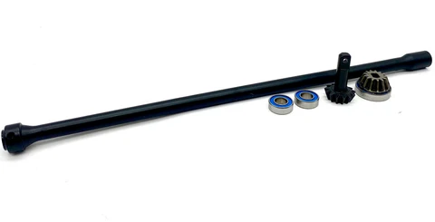
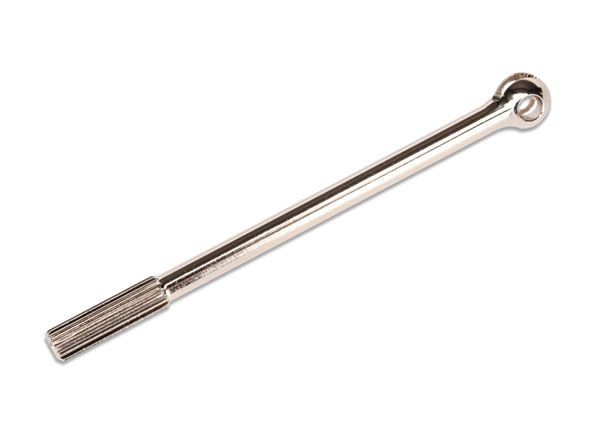

<h1 align="center">FastAzJato4x4 · the "Super Jato"</h1>

   
  <em>IMEX chrome rims on the $3.87 triangle tires with blue race foams</em>

  
  
  
  

  <b>A custom 4S electric buggy built on a Traxxas Jato 4x4.</b> 
  Carbon-fiber LCG chassis, FLM extended arms, Hot Bodies D8 big bores and a Hobbywing MAX10 G2 + 3665SD 2400KV, all under an OG Jato 3.3 shell. Built to soak up the ruts at Meldrum Bar.

  &nbsp;&nbsp; 
  <em>The stretched look on the IMEX rally slicks · front bumper and steering · rear shocks and CVDs</em>

---

## At a Glance

| Area | Setup |
|---|---|
| 🧱 **Chassis** | AliExpress / Cobra Racing carbon-fiber LCG, Slash 4x4 pattern |
| 🔌 **Power** | Hobbywing EZRun MAX10 G2 140A + 3665SD G3 2400KV |
| 🔋 **Battery** | Zeee 4S 5200mAh 100C (EC5) |
| ⚙️ **Gearing** | 16T pinion on a 54T spur, FDR 3.38 |
| 🌀 **Shocks** | Hot Bodies D8 97mm big bore, 40wt front / 50wt rear |
| 🦾 **Arms** | FLM26800 metal extended, about 10mm wider per side |
| 🎯 **Steering** | PTK 9752TG-D servo, GPM 6845X alloy bell crank, Raptor R alloy hubs |
| 🏁 **Body** | Traxxas Jato 3.3 red (5511A) with its own integrated wing |
| 🛞 **Wheels** | IMEX IMX7893 chrome Rally rims, $3.87 triangle 26013 tires, blue race foams |
| ⚖️ **Weight** | 2.868 kg all up |
| 💰 **Build cost** | ~$822 in locked parts, see [`BOM.md`](BOM.md) |
| 📍 **Home track** | Meldrum Bar Park, Gladstone OR |

## Table of Contents

- ⚖️ [Weight](#weight)
- 🏁 [Track & Setup Philosophy](#track--setup-philosophy)
- 🌀 [Suspension](#suspension)
- ⚙️ [Drivetrain](#drivetrain)
- 🔌 [Electronics](#electronics)
- 🎯 [Steering](#steering)
- 🛞 [Aero & Body](#aero--body)
- 🛡️ [Bumpers](#bumpers)
- 📚 [Deep Dives](#deep-dives)
- 🧾 [Parts List](#parts-list)
- 🖨️ [3D Models](#3d-models)
- ✅ [TODO / Notes](#todo--notes)

---

## Weight

**Fully loaded, all up: 2.868 kg (6.32 lb)**, weighed in pieces on one pan (everything that goes on the car, battery included).

 <em>2.868 kg on the WeighMax, the complete car weighed in pieces</em>

Component weights measured so far, all of them in the analysis docs: body shell **160 g** ([`aero_analysis.md`](aero_analysis.md)), CF chassis kit **357.2 g** ([`chassis_analysis.md`](chassis_analysis.md)), MAX10 G2 ESC, 3665SD motor, Zeee 5200 pack **518 g** ([`battery_analysis.md`](battery_analysis.md)). The battery alone is about **18% of the all-up weight**, which is why the [pack choice](battery_analysis.md) is judged on grams before capacity.

---

## Track & Setup Philosophy

I run this at the **Meldrum Bar Public RC Car Course** in Meldrum Bar Park (Gladstone, OR), a really blown-out dirt track: deep ruts, choppy braking bumps, dry loose dirt over a hard base. It's **casual / fun racing now** (transponder-timed racing was discontinued), so **no personal transponder is needed**. That surface drives the whole setup. It rewards compliance and forgiveness over outright top speed, so the car is built to soak up the rough and stay planted.

- **Official races are banned there as of Aug 2026.** Organised racing at the park got shut down, so what's left is informal running. The setup philosophy below doesn't change, the track and the way people drive it are the same, there's just no formal event to build for.
- **When it does run, it's open class and no rules.** Everything is fair game in the same heat: buggies, truggies, and 1/5 and monster class like X-Maxx, XRT and the Teknos. Nobody is trying to wreck anybody, but **racing is rubbing**, and with that spread of sizes on one track **landing on someone, or getting landed on, is normal**. A 1/5 or an X-Maxx coming down on this truck is a different kind of load than a crash into dirt. It's most of why durability decides parts here ahead of outright performance.
- **Soft, big-bore suspension.** Hot Bodies D8 metal big-bore shocks on soft springs (white 59gf front, grey 52gf rear) soak up the ruts. Oil is 50wt rear / 40wt front (retested from an earlier 45wt/60wt), the rear still the firmer of the two to control squat and rebound on the chop. No swaybars, I want the wheels working independently over the bumps.
- **Wide track for stability.** FLM26800 extended arms stretch the track width about 10mm per side, which calms the car over rough ground and adds droop.
- **Diffs tuned for a loose surface.** ~7k front for steering on the loose stuff, 5k rear for rotation, 20k center to hold drive stability.
- **Geared for punch, not top speed.** 16T pinion (FDR 3.38) on the 3665SD 2400KV keeps it punchy and cooler on a technical, rough track where you rarely hold full throttle.
- **Built to survive crashes.** Metal arms that bend instead of snap, Raptor R alloy hubs on Tekno stubs, and a **minimal skid plate at the rear** so a bad landing lets me throttle out instead of digging in and cartwheeling. Up front is the **RPM 81042 wide bumper**, which sounds like the opposite but isn't: **it sits far enough forward that touching it means the car is already too nose down**, and it shouldn't ever get that vertical while racing. In normal driving nothing reaches it, and in a real frontal hit it takes the load instead of the diff.
- **Body:** the OG Jato 3.3 stadium-truck shell, because it looks cool and stands out from every buggy on the track. Its own integrated wing means no separate buggy wing or mount.
- **Wheels:** IMEX 1/8th Rally chrome rims, bought purely because they're baller, and yes I paid extra. The chrome ricer look plus the stretched stance from the extended arms makes it look like an extended-swingarm GSX-R. It looks great and still performs well. Right now they wear the $3.87 triangle 26013 tires with blue race foams. The glued rally slicks they came with (the glue had gone on the old rims) were great on track and fun to drift, but not for racing.

---

## Suspension

  &nbsp;&nbsp; 
  <em>Hot Bodies D8 big bores · FLM26800 extended arms · MonsterKingz CF towers</em>

| Component | Part | Notes |
|-----------|------|-------|
| Shocks | **Hot Bodies D8 metal 97mm big bore** (HBS67296), front + rear | Used set, [`shock_analysis.md`](shock_analysis.md) |
| Springs / pistons / oil | White 59gf front + grey 52gf rear · 1.4mm×6 pistons · **40wt F / 50wt R** (✅ retested) | Springs and pistons came with the D8 set, [`shock_analysis.md`](shock_analysis.md#setup-spec-springs--pistons--oil) |
| Arms | **FLM26800 metal extended**, front + rear | $25.73/pair, [`arm_analysis.md`](arm_analysis.md) |
| Shock standoffs | HB Racing HBS67410, 2 pairs | [`shock_analysis.md`](shock_analysis.md#shock-standoffs--mounting) |
| Shock towers | **MonsterKingz (G-Maxx) carbon fiber**, front + rear | Sized for the big bores + 67410 standoffs, [`shock_tower_analysis.md`](shock_tower_analysis.md) |
| Arm guards | TRA6732 front + TRA6733 rear | [`arm_analysis.md`](arm_analysis.md#shock-guards) |
| Swaybars | None | Track works better without them, [`swaybar_analysis.md`](swaybar_analysis.md) |

---

## Drivetrain

  &nbsp;&nbsp; 
  <em>Steel front / rear diffs · metal center diff with 54T spur · HD steel CVDs</em>

| Component | Part | Notes |
|-----------|------|-------|
| Diffs (front + rear) | **AliExpress knock-off Slash 4x4 steel diffs** (5mm, with I-bar) | ~7k front / 5k rear, [`differential_analysis.md`](differential_analysis.md) |
| Center diff + spur | **AliExpress metal center diff**, integrated steel 54T spur | Came with 16/17/18T pinions, [`differential_analysis.md`](differential_analysis.md#center-diff) |
| Pinion | **16T 32P** on the 3665SD 2400KV, FDR 3.38 | 17T / 18T on hand to retune, [`motor_analysis.md`](motor_analysis.md#pinion-reference-32p) |
| Center driveshaft | Jato 4x4 BL-2S take-off shaft (7455) | $2.49, [`driveshaft_analysis.md`](driveshaft_analysis.md#center-driveshaft-comparison) |
| Axle CVDs | Knock-off Slash 4x4 HD steel CV (5mm) + **4× TRA6752 long output shafts** | [`driveshaft_analysis.md`](driveshaft_analysis.md) |
| Stubs / wheel hexes | Front **Tekno TKR1654-17**; rear **TKR5570-17 SCT410 kit** (5580 stubs in hand, kit still to buy) | [`wheel_hex_analysis.md`](wheel_hex_analysis.md) |
| Gearbox housings | Traxxas TRA6881 front / TRA6880 rear | $4 each, [`gearbox_housing_analysis.md`](gearbox_housing_analysis.md) |
| Bearings | Hub bearings fitted; full sealed kit still open | [`bearings_reference.md`](bearings_reference.md) |

---

## Electronics

  &nbsp;&nbsp;&nbsp; 
  <em>MAX10 G2 ESC · 3665SD G3 motor · Zeee 4S 5200 · FlySky Noble NB4</em>

| Component | Part | Notes |
|-----------|------|-------|
| ESC | **Hobbywing EZRun MAX10 G2 140A** | ✅ bought 2026-06-25 as a $127 combo, [`esc_analysis.md`](esc_analysis.md) |
| Motor | **Hobbywing EZRun 3665SD G3 2400KV** (4-pole) | Came with the combo, [`motor_analysis.md`](motor_analysis.md) |
| Battery | **Zeee 4S 5200mAh 100C EC5** | 5000-5400mAh is the target (6000 too heavy, 4200 too short), [`battery_analysis.md`](battery_analysis.md) |
| Radio / receiver | **FlySky Noble NB4** TX + **FGr4S V2** RX | [`radio_analysis.md`](radio_analysis.md) |

 <em>Receiver box and battery layout</em>

---

## Steering

  &nbsp;&nbsp;&nbsp; 
  <em>PTK 9752TG-D servo · GPM alloy bell crank · Raptor R alloy hubs · ACER titanium rods</em>

| Component | Part | Notes |
|-----------|------|-------|
| Servo | **PTK 9752TG-D** metal gear, high speed | $19.65 (1 of 8 bulk), [`servo_analysis.md`](servo_analysis.md) |
| Bell crank | **GPM aluminum bell crank (6845X)** | $19.98, [`steering_bell_crank_analysis.md`](steering_bell_crank_analysis.md) |
| Knuckles + carriers | **Traxxas Raptor R Ultimate alloy hubs** (EHD, front + rear) | ✅ purchased 2026-07-29, $68.73, [`hub_carrier_analysis.md`](hub_carrier_analysis.md) |
| Tie rods + camber links | **ACER titanium M4x60** rods (6) + RPM long rod ends (white 80511) + Traxxas hollow balls, ~61mm (96mm c-t-c) | [`tie_rod_analysis.md`](tie_rod_analysis.md) |

---

## Aero & Body

  &nbsp;&nbsp;&nbsp; 
  <em>Jato 3.3 red shell · IMEX chrome Rally rims · triangle 26013 tires · blue closed-cell foams</em>

| Component | Part | Notes |
|-----------|------|-------|
| Body / shell | **Traxxas Jato 3.3 red (5511A)** | $34.47, clearance holes cut for the tall towers, [`aero_analysis.md`](aero_analysis.md#body-comparison) |
| Wing | The Jato 3.3 shell's own integrated wing | No separate wing or mount, [`aero_analysis.md`](aero_analysis.md#body-comparison) |
| Rims | **IMEX IMX7893 1/8 Rally chrome** (17mm hex) | Bought for the look. The glued rally slicks came off: fun to drift, not for racing, [`wheel_analysis.md`](wheel_analysis.md#rims-bare-wheels) |
| Tires | **Triangle 26013** (Fiona Hobby), set of 4 | $3.87 shipped. Softer, but very durable once worn in, [`wheel_analysis.md`](wheel_analysis.md#tires-tire-only-mount-on-your-own-rims) |
| Foam inserts | Blue closed-cell race foams, reusable | Keeps it planted, less rim slap, [`wheel_analysis.md`](wheel_analysis.md#foam-inserts) |

---

## Bumpers

  &nbsp; 
  <em>RPM 81042 wide front bumper · Traxxas TRA9044 skid plates</em>

| Component | Part | Notes |
|-----------|------|-------|
| Front | **RPM 81042 wide front bumper** (black) | $9.95, [`bumper_analysis.md`](bumper_analysis.md) |
| Rear | **Traxxas TRA9044 skid plate** | From the $7 front + rear set, the only rear plate that covers the tongue, [`bumper_analysis.md`](bumper_analysis.md) |

---

## Deep Dives

Every part choice above was decided in its own analysis doc.

| Suspension | Drivetrain | Electronics | Chassis, Body & Steering | Tracking |
|---|---|---|---|---|
| [Shocks](shock_analysis.md) | [Diffs](differential_analysis.md) | [ESC](esc_analysis.md) | [Chassis](chassis_analysis.md) | [BOM](BOM.md) |
| [Shock towers](shock_tower_analysis.md) | [Driveshafts](driveshaft_analysis.md) | [Motor](motor_analysis.md) | [Body & aero](aero_analysis.md) | [Checklist](CHECKLIST.md) |
| [Arms](arm_analysis.md) | [Gearbox housings](gearbox_housing_analysis.md) | [Battery](battery_analysis.md) | [Bumpers](bumper_analysis.md) | |
| [Swaybars](swaybar_analysis.md) | [Wheel hexes](wheel_hex_analysis.md) | [Charger](charger_analysis.md) | [Wheels](wheel_analysis.md) | |
| [Hubs & carriers](hub_carrier_analysis.md) | [Bearings](bearings_reference.md) | [Radio](radio_analysis.md) | [Bell crank](steering_bell_crank_analysis.md) | |
| | | [Servo](servo_analysis.md) | [Tie rods](tie_rod_analysis.md) | |
| | | [Connectors](connector_reference.md) | | |

---

## Parts List

Only parts that are **on the car**. Spares, fallbacks and parts that didn't make the build live in [`BOM.md`](BOM.md#spares--not-used-owned-not-on-this-build).

| Part # | Description | Category | Cost | Source | Photo |
|--------|-------------|----------|------|--------|-------|
| Generic | AliExpress / Cobra Racing carbon-fiber LCG chassis kit (Slash 4x4 VXL TRA6808 pattern) | Base Car | $73.17 | AliExpress, RCTOYFUN |  |
| Generic | Front + rear chassis bars, DIY from scrap aluminum | Base Car | $0 | Self-made | — |
| 38020343 | Hobbywing EZRun MAX10 G2 140A + 3665SD G3 2400KV combo (ESC + motor) | Electronics | $127.00 | Hobbywing direct |  |
| Generic | Zeee 4S 5200mAh 100C, EC5, soft case | Electronics | Shared fleet | Amazon |  |
| NB4 | FlySky Noble NB4 radio, running the FGr4S V2 receiver | Electronics | $140.91 | AliExpress, Hi-Goeswell |  |
| Generic | AliExpress knock-off Slash 4x4 steel diffs (5mm, with I-bar), front + rear | Drivetrain | $15.26 / 2 | AliExpress, RS RC Store |  |
| Generic | AliExpress metal center diff, integrated steel 54T spur, 16/17/18T pinions included | Drivetrain | ~$20 | AliExpress |  |
| 7455 | Traxxas Jato 4x4 BL-2S take-off center driveshaft | Drivetrain | $2.49 | Jenny's RC |  |
| Generic | Knock-off Slash 4x4 HD steel CV axles (order #8211906604054866) | Drivetrain | $21.10 / set of 4 | AliExpress, FengS Store |  |
| TRA6752 | Traxxas long output shafts, all four corners | Drivetrain | $32.00 (4 × $8) | — |  |
| TRA6881 / TRA6880 | Traxxas front / rear gearbox housings | Drivetrain | $4.00 each | Tammies Hobby |  |
| TKR1654-17 | Tekno 17mm M6 front stub / hub adapter | Drivetrain | $23.15 / pair | eBay, mr-retro |  |
| TKR5570-17 | Tekno SCT410 rear kit (5580 stubs + 17mm hexes), **still to buy** | Drivetrain | $25.95 | PowerHobby |  |
| FLM26800 | FLM metal extended arms, front + rear (2 pairs) | Suspension | $25.73 / pair | FLM |  |
| Generic | MonsterKingz (G-Maxx) carbon fiber shock tower set, front + rear | Suspension | ~$33.29 | eBay, MonsterKingz |  |
| HBS67296 | Hot Bodies D8 metal 97mm big-bore shocks, used set of 4 (white 59gf / grey 52gf springs + 1.4mm×6 pistons included) | Suspension | $65.99 + $8 ship | eBay, guavahobby |  |
| HBS67410 | HB Racing shock standoffs, 2 pairs | Suspension | $3.99 / pair | AMain |  |
| Generic | Silicone shock oil, 40wt front + 50wt rear | Suspension | ~$6 each | Tammies | — |
| 9063 / 9064 / 9065 | Traxxas Raptor R Ultimate alloy hubs, full EHD set | Steering | $68.73 | eBay, toysion |  |
| 9752TG-D | PTK metal gear high speed servo (1 of 8 bulk) | Steering | $19.65 | AliExpress, PTK Servo Store |  |
| 6845X | GPM aluminum bell crank, brass / oilite bushings | Steering | $19.98 | GPM |  |
| Generic | ACER Racing titanium M4x60 turnbuckle rods, all 6 links | Steering | $35.94 (6 × $5.99) | ACER Racing |  |
| 80511 / TRA5525 | RPM long rod ends (white) + Traxxas hollow balls | Steering | ~$7-9 / 12 + $9 / 12 | RPM / Traxxas |  |
| 5511A | Traxxas Jato 3.3 red body, take-off | Body | $34.47 | Jenny's RC |  |
| IMX7893 | IMEX 1/8 Rally Tire Set, Chrome (pair), the rims on the car, slicks removed | Aero | $19.99 / pair (2 on the car) | IMEX Model Company |  |
| 26013 | Generic 1/8 buggy tires, triangle tread (Fiona Hobby), tires only | Aero | $3.87 / set of 4 | AliExpress |  |
| Generic | Closed-cell foam inserts | Aero | $8.08 / set of 4 | AliExpress |  |
| 81042 | RPM wide front bumper, black | Bumpers | $9.95 | — |  |
| TRA9044 | Traxxas front + rear skid plates (rear plate on the car) | Bumpers | $7.00 / set | Tammies Hobby |  |

---

## 3D Models

> See [`3d-models/`](3d-models/) for all custom STL files.

| Model | Description | Status |
|-------|-------------|--------|
| Custom front-end shroud / wing mount + Rustler bumper integration | Cosmetic shroud that integrates the Rustler 4x4 front bumper (better crash protection, ugly stock) into a clean wing mount. Discussed in [`bumper_analysis.md`](bumper_analysis.md#notes) | Idea / TODO |

---

## TODO / Notes

- [ ] Buy the TKR5570-17 SCT410 kit for the rear hexes
- [ ] Pick a full sealed bearing kit (the hub bearings are already fitted and working)
- [x] Motor locked in: Hobbywing 3665SD G3 2400KV
- [x] Full-car build photos
