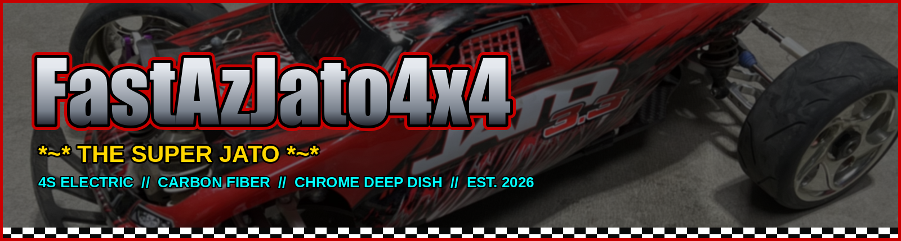

  

  <b>VOL. 1 &middot; ISSUE 01 &middot; PROJECT CAR FEATURE &middot; MELDRUM BAR, OR</b> 
  <b>&#9733; EXCLUSIVE:</b> $881 BUILD TAKES ON 1/5 SCALE &nbsp;&#9642;&nbsp;
  <b>INSIDE:</b> EVERY RECEIPT &nbsp;&#9642;&nbsp;
  <b>PLUS:</b> THE $3.87 TIRE THAT ACTUALLY WORKS

  
  
  
  
  

  <b>~*~ LOW MILES, LIGHTLY CLAPPED ~*~</b> 
  <b>NO LOWBALLERS, I KNOW WHAT I GOT</b> 
  <b><i>"IF IT WAS BALLER, I NEEDED IT."</i></b>

  
  
  
  
  

  <b>AN &#39;07 NITRO SHELL OVER A 4S ELECTRIC BUGGY.</b> 
  Carbon chassis. Chrome deep dish. $3.87 tires. 
  Built to get landed on by 1/5 scale cars and keep going. 
  <b>THE STANCE:</b> <i>the stretched GSX-R ricer hot boy look</i> &#128526;

  &nbsp;&nbsp; 
  <em>Stretched on the IMEX slicks &middot; front bumper and steering &middot; rear shocks and CVDs</em>

   
  <b>&#9656; CURRENT OFFROAD SETUP &#9662;</b> 
  <em>IMEX chrome rims on the $3.87 Mitsubishi-tread 26013 tires with blue race foams &mdash; what it actually races on</em>

<h2 align="center">BUDGET KING</h2>

  <i>We gutted a Traxxas Jato 4x4 down to the gearboxes, spent $881 putting it back together 
  as a 4S electric buggy, and wrapped the whole thing in a 2007 nitro shell and chrome deep dish. 
  It races 1/5 scale trucks on a blown-out public dirt track. Here is every part, every price, 
  and every bad decision we would happily make again.</i>

  <b>WORDS, PHOTOS &amp; RECEIPTS:</b> ANDREW &nbsp;&#9642;&nbsp; <b>BUILT:</b> 2026 &nbsp;&#9642;&nbsp; <b>HOME TRACK:</b> MELDRUM BAR PARK, GLADSTONE OR

---

## SPEC SHEET

| Area | Setup |
|---|---|
| 🧱 **Chassis** | AliExpress / Cobra Racing carbon-fiber LCG, Slash 4x4 pattern |
| 🔌 **Power** | Hobbywing EZRun MAX10 G2 140A + 3665SD G3 2400KV |
| 🔋 **Battery** | Gens Ace Redline 2.0 4S HV 6000mAh 140C shorty (410 g) |
| ⚙️ **Gearing** | 16T pinion on a 54T spur, FDR 3.38 |
| 🌀 **Shocks** | Hot Bodies D8 97mm big bore, 37.5wt front / 50wt rear |
| 🦾 **Arms** | FLM26800 metal extended, about 10mm wider per side |
| 🎯 **Steering** | PTK 9752TG-D servo, GPM 6845X alloy bell crank, Integy purple C-hubs + GPM XO-1 front blocks, Raptor R rear carriers |
| 🏁 **Body** | Traxxas Jato 3.3 red (5511A) with its own integrated wing |
| 🛞 **Wheels** | IMEX IMX7893 chrome Rally rims, $3.87 Mitsubishi-tread 26013 tires, blue race foams |
| 🔧 **Wheel cost** | ~$57 up front (rims + tires + foams + the glue that mounts them), ~$4 per tire change after that |
| ⚖️ **Weight** | **~2.76 kg** as it runs today. The 2.868 kg weigh-in was on the heavier Zeee pack, see [Weight](#weight) |
| 💰 **Build cost** | ~$881 for the car, ~$1,115 with the battery and radio, see [`BOM.md`](BOM.md) |
| 📍 **Home track** | Meldrum Bar Park, Gladstone OR |

## TABLE OF CONTENTS

- ⚖️ [WEIGHT](#weight)
- 🏁 [TRACK & SETUP PHILOSOPHY](#track--setup-philosophy)
- 🌀 [SUSPENSION](#suspension)
- ⚙️ [DRIVETRAIN](#drivetrain)
- 🔌 [ELECTRONICS](#electronics)
- 🎯 [STEERING](#steering)
- 🛞 [AERO & BODY](#aero--body)
- 🛡️ [BUMPERS](#bumpers)
- 📚 [DEEP DIVES](#deep-dives)
- 🧾 [PARTS LIST](#parts-list)
- 💸 [BUILDING IT CHEAPER](#building-it-cheaper)
- 🖨️ [3D MODELS](#3d-models)
- ✅ [NEXT ISSUE](#next-issue)

---

## WEIGHT

**Fully loaded, all up: 2.868 kg (6.32 lb)**, weighed in pieces on one pan (everything that goes on the car, battery included).

 <em>2.868 kg on the WeighMax, the complete car weighed in pieces</em>

Component weights measured so far, all of them in the analysis docs: body shell **160 g** ([`aero_analysis.md`](aero_analysis.md)), CF chassis kit **357.2 g** ([`chassis_analysis.md`](chassis_analysis.md)), MAX10 G2 ESC, 3665SD motor, Zeee 5200 pack **518 g** ([`battery_analysis.md`](battery_analysis.md)). The 2.868 kg weigh-in was on that Zeee; the Gens Ace Redline 6000 now on the car is **410 g**, so it runs about **2.76 kg** all up. The battery alone is about **18% of the all-up weight**, which is why the [pack choice](battery_analysis.md) is judged on grams before capacity.

  <b><i>&ldquo;THE BATTERY ALONE IS 18% OF THE CAR. THAT IS WHY PACKS GET JUDGED ON GRAMS BEFORE CAPACITY.&rdquo;</i></b>

---

## TRACK & SETUP PHILOSOPHY

I run this at the **Meldrum Bar Public RC Car Course** in Meldrum Bar Park (Gladstone, OR), a really blown-out dirt track: deep ruts, choppy braking bumps, dry loose dirt over a hard base. It's **casual / fun racing now** (transponder-timed racing was discontinued), so **no personal transponder is needed**. That surface drives the whole setup. It rewards compliance and forgiveness over outright top speed, so the car is built to soak up the rough and stay planted.

- **Official races are banned there as of Aug 2026.** Organised racing at the park got shut down, so what's left is informal running. The setup philosophy below doesn't change, the track and the way people drive it are the same, there's just no formal event to build for.
- **When it does run, it's open class and no rules.** Everything is fair game in the same heat: buggies, truggies, and 1/5 and monster class like X-Maxx, XRT and the Teknos. Nobody is trying to wreck anybody, but a 1/5 or an X-Maxx coming down on this truck is a different kind of load than a crash into dirt, and it's most of why durability gets weighed at all here.
- **Being straight about it though: this build sacrifices some durability for performance.** The carbon chassis is stiffer and lighter than flexy plastic but less forgiving, the extended arms put more leverage through every part they touch, and the wider hubs add scrub. Those are performance calls, and each one costs a little toughness.

  <b><i>&ldquo;RACING IS RUBBING. GETTING RAILED BY AN X-MAXX IS JUST ANOTHER SUNDAY.&rdquo;</i></b>

- **Soft, big-bore suspension.** Hot Bodies D8 metal big-bore shocks on soft springs (white 59gf front, grey 52gf rear) soak up the ruts. Oil is 50wt rear / 37.5wt front (down from an earlier 45wt/60wt), the rear still the firmer of the two to control squat and rebound on the chop. No swaybars, I want the wheels working independently over the bumps.
- **Wide track for stability.** FLM26800 extended arms stretch the track width about 10mm per side, which calms the car over rough ground and adds droop.
- **Diffs tuned for a loose surface.** 30k front to calm torque steer, **a greased rear rather than oil** for drive off the corner, 100k center (Traxxas TRA5130) to hold drive stability.
- **Geared for punch, not top speed.** 16T pinion (FDR 3.38) on the 3665SD 2400KV keeps it punchy and cooler on a technical, rough track where you rarely hold full throttle.
- **It survives crashes, but that isn't what it was built for.** The car was set up to go fast and it **gave up some durability to get there** — it's just turned out very strong anyway. The parts picked to last carry the ones that weren't: metal arms that bend instead of snap, alloy hubs on Tekno stubs (Integy C-hubs + GPM XO-1 blocks up front, Raptor R carriers out back), and a **minimal skid plate at the rear** so a bad landing lets me throttle out instead of digging in and cartwheeling. Up front is the **RPM 81042 wide bumper**, which sounds like the opposite but isn't: **it sits far enough forward that touching it means the car is already too nose down**, and it shouldn't ever get that vertical while racing. In normal driving nothing reaches it, and in a real frontal hit it takes the load instead of the diff.
- **Body:** the OG Jato 3.3 stadium-truck shell, because it looks cool and stands out from every buggy on the track. Its own integrated wing means no separate buggy wing or mount.
- **Wheels:** IMEX 1/8th Rally chrome rims, bought purely because they're baller, and yes I paid extra. The chrome ricer look plus the stretched stance from the extended arms makes it look like an extended-swingarm GSX-R, which is why we call it **the stretched GSX-R ricer hot boy look**. It looks great and still performs well. Right now they wear the $3.87 Mitsubishi-tread 26013 tires with blue race foams. The glued rally slicks they came with (the glue had gone on the old rims) were great on track and fun to drift, but not for racing.

---

## SUSPENSION

  &nbsp;&nbsp;&nbsp; 
  <em>Hot Bodies D8 big bores · FLM26800 extended arms · stock #9033 front tower · MonsterKingz CF rear tower</em>

| Component | Part | Notes |
|-----------|------|-------|
| Shocks | **Hot Bodies D8 metal 97mm big bore** (HBS67296), front + rear | Used set, [`shock_analysis.md`](shock_analysis.md) |
| Springs / pistons / oil | White 59gf front + grey 52gf rear · 1.4mm×6 pistons · **37.5wt F (Losi TLR74030) / 50wt R (Associated 5480 FT)** | Springs and pistons came with the D8 set, [`shock_analysis.md`](shock_analysis.md#setup-spec-springs--pistons--oil) |
| Arms | **FLM26800 metal extended**, front + rear | $25.73/pair, [`arm_analysis.md`](arm_analysis.md) |
| Shock standoffs | HB Racing HBS67410, 1 pair (rear CF tower) | [`shock_analysis.md`](shock_analysis.md#shock-standoffs--mounting) |
| Upper shock screws (front) | **Traxxas wheelie bar shoulder screws**, 2 | Pulled from a free TRA5472 Revo bar; rebuy as TRA4976 ($4 for 2), [`shock_tower_analysis.md`](shock_tower_analysis.md#front-shock-mounting-wheelie-bar-shoulder-screws) |
| Shock towers | **Stock Traxxas #9033 front + MonsterKingz (G-Maxx) carbon fiber rear** | Plastic up front, carbon rear sized for the big bores + 67410 standoffs, [`shock_tower_analysis.md`](shock_tower_analysis.md) |
| Swaybars | None | Track works better without them, [`swaybar_analysis.md`](swaybar_analysis.md) |

---

## DRIVETRAIN

  &nbsp;&nbsp; 
  <em>Steel front / rear diffs · metal center diff with 54T spur · HD steel CVDs</em>

| Component | Part | Notes |
|-----------|------|-------|
| Diffs (front + rear) | **AliExpress knock-off Slash 4x4 steel diffs** (5mm, with I-bar) | 30k front / **greased rear, no oil**, [`differential_analysis.md`](differential_analysis.md) |
| Center diff + spur | **AliExpress metal center diff**, integrated steel 54T spur | Came with 16/17/18T pinions, [`differential_analysis.md`](differential_analysis.md#center-diff) |
| Center diff oil | **Traxxas 100k (TRA5130)** | $8 at Tammies Hobby, [`differential_analysis.md`](differential_analysis.md#center-diff-oil) |
| Grease | **B'LASTER white lithium** | CVDs and gears, not inside the diffs. $6.99 at Harbor Freight, [`driveshaft_analysis.md`](driveshaft_analysis.md#grease-cvds--gears) |
| Pinion | **16T 32P** on the 3665SD 2400KV, FDR 3.38 | 17T / 18T on hand to retune, [`motor_analysis.md`](motor_analysis.md#pinion-reference-32p) |
| Center driveshaft | Jato 4x4 BL-2S take-off shaft (7455) | $2.49, [`driveshaft_analysis.md`](driveshaft_analysis.md#center-driveshaft-comparison) |
| Axle CVDs | Knock-off Slash 4x4 HD steel CV driveshafts, front + rear (TRA6851R / TRA6852R clones, 5mm) + **4× TRA6752 long output shafts** | [`driveshaft_analysis.md`](driveshaft_analysis.md) |
| Stubs | Tekno M6: front **TKR1654-17**, rear **5580** (bought bare) | [`driveshaft_analysis.md`](driveshaft_analysis.md#tekno-stubs-front--rear) |
| 17mm hubs | **AliExpress aftermarket 17mm splined hubs (E-Revo 1.0 fit)**, black, all four corners | $8.36, 2-3mm wider per corner, [`hub_analysis.md`](driveshaft_analysis.md#17mm-wheel-hexes) |
| Gearbox housings | Traxxas TRA6881 front / TRA6880 rear | $4 each, [`gearbox_housing_analysis.md`](gearbox_housing_analysis.md) |
| Bearings | **18 sealed ball bearings, $7.21 for the car's set** (bought by size in 10-packs) + 4 TRA3775 Oilite bushings at the bell crank | Hub corners run 10×15×4 in a printed 18→15mm sleeve, [`bearings_reference.md`](bearings_reference.md#what-the-bearings-cost) |

> ### &#128296; TECH TIP &middot; THE 18 &rarr; 15 SLEEVE
>
> The hub pocket is 18 mm. The cheap, everywhere-available bearing is **10&times;15&times;4**. Most people
> solve that by shaving the hex adapters. **We print a sleeve instead:** 18 mm OD, 15 mm ID, 4 mm wide.
> **Glue the outer face of the ring only, never the bore**, press it into the hub, drop the bearing in.
> It costs pennies, it is fully reversible, and nothing on the car gets cut. Full method in
> [`bearings_reference.md`](bearings_reference.md#fitting-the-sleeve).

---

## ELECTRONICS

  &nbsp;&nbsp;&nbsp; 
  <em>MAX10 G2 ESC · 3665SD G3 motor · Gens Ace Redline 6000 shorty · FlySky Noble NB4</em>

| Component | Part | Notes |
|-----------|------|-------|
| ESC | **Hobbywing EZRun MAX10 G2 140A** | ✅ bought 2026-06-25 as a $127 combo, [`esc_analysis.md`](esc_analysis.md) |
| Motor | **Hobbywing EZRun 3665SD G3 2400KV** (4-pole) | Came with the combo, [`motor_analysis.md`](motor_analysis.md) |
| Battery | **Gens Ace Redline 2.0 4S HV 6000mAh 140C**, shorty hardcase | 410 g; the spec is a 4S hardcase shorty, [`battery_analysis.md`](battery_analysis.md) |
| Radio / receiver | **FlySky Noble NB4** TX + **FGr4S V2** RX | [`radio_analysis.md`](radio_analysis.md) |

 <em>Receiver box and battery layout</em>

---

## STEERING

  &nbsp;&nbsp;&nbsp;&nbsp; 
  <em>PTK 9752TG-D servo · GPM alloy bell crank · Integy purple C-hub · GPM XO-1 front block · Raptor R (rear carriers used)</em>

| Component | Part | Notes |
|-----------|------|-------|
| Servo | **PTK 9752TG-D** metal gear, high speed | $19.65, [`servo_analysis.md`](servo_analysis.md) |
| Bell crank | **GPM aluminum bell crank (6845X)** | $19.98, [`steering_bell_crank_analysis.md`](steering_bell_crank_analysis.md) |
| Front C-hubs | **Integy C26402PURPLE** billet alloy, purple | $13.62, originally bought for the K939, [`hub_analysis.md`](hub_analysis.md) |
| Front steering blocks | **GPM XO-1 alloy knuckle** | $19.16, XO-1 bearing geometry suits the Tekno M6 stubs, [`hub_analysis.md`](hub_analysis.md) |
| Rear carriers | **Traxxas Raptor R Ultimate alloy (9065)** | From the $68.73 Raptor R set, [`hub_analysis.md`](hub_analysis.md) |
| Tie rods + camber links | **ACER titanium M4x60** rods (6) + RPM long rod ends (white 80511) + Traxxas hollow balls, ~61mm (96mm c-t-c) | **3.7 g per rod, 22.2 g for all six.** $5.99 each, [`tie_rod_analysis.md`](tie_rod_analysis.md) |
| Rod ends (hollow balls) | **Traxxas TRA5525** | $9.00 / pack of 12, [`tie_rod_analysis.md`](tie_rod_analysis.md#rod-ends-the-plastic) |
| Servo link + horn | **GPM RUS416026ST-S** link + 25T alloy horn, 6pc set | Servo horn to bell crank, $7.61, [`steering_bell_crank_analysis.md`](steering_bell_crank_analysis.md) |

---

## AERO & BODY

  &nbsp;&nbsp;&nbsp; 
  <em>Jato 3.3 red shell · IMEX chrome Rally rims · Mitsubishi-tread 26013 tires · blue closed-cell foams</em>

| Component | Part | Notes |
|-----------|------|-------|
| Body / shell | **Traxxas Jato 3.3 red (5511A)** | $34.47, clearance holes cut for the tall towers, [`aero_analysis.md`](aero_analysis.md#body-comparison) |
| Wing | The Jato 3.3 shell's own integrated wing | No separate wing or mount, [`aero_analysis.md`](aero_analysis.md#body-comparison) |
| Rims | **IMEX IMX7893 1/8 Rally chrome** (17mm hex) | Bought for the look. A bit narrower than standard, so standard 1/8 tires go on with some finesse. The glued rally slicks came off: fun to drift, not for racing, [`wheel_analysis.md`](wheel_analysis.md#rims-bare-wheels) |
| Tires | **Kforce Mitsubishi-tread 26013** (110 × 43mm, natural rubber, 35°), set of 4 | $3.87 shipped. Softer, but very durable once worn in, [`wheel_analysis.md`](wheel_analysis.md#tires-tire-only-mount-on-your-own-rims) |
| Foam inserts | Blue closed-cell race foams, reusable | Keeps it planted, less rim slap, [`wheel_analysis.md`](wheel_analysis.md#foam-inserts) |
| Tire glue | **HFT high-strength super glue**, SKU 68345 | $4.99 / 10-pack. ⚠️ **Thin liquid, not the gel** — the thin stuff wicks into the bead, [`wheel_analysis.md`](wheel_analysis.md) |
| Body clips | **AJRC 50 pcs silver** R-clips | $2.21 the pack, 1/5 to 1/16 universal, [`aero_analysis.md`](aero_analysis.md#3d-printed-body-mounts) |

> ### &#128296; TECH TIP &middot; GLUE THE BEAD, NOT THE GEL
>
> Mounting 1/8 tires, **use thin liquid super glue, not the gel**. The thin stuff wicks right into the
> bead and pulls itself around the rim by capillary action. Gel sits on top and bridges gaps instead of
> filling them, so it lets go on the first hard corner. A 10-pack of HFT high-strength (SKU 68345) is
> **$4.99** and will mount more tires than you will own.

---

## BUMPERS

  &nbsp; 
  <em>RPM 81042 wide front bumper · Traxxas TRA9044 (rear skid plate used)</em>

| Component | Part | Notes |
|-----------|------|-------|
| Front | **RPM 81042 wide front bumper** (black) | $9.95, [`bumper_analysis.md`](bumper_analysis.md) |
| Rear | **Traxxas TRA9044 skid plate** | From the $7 front + rear set, the only rear plate that covers the tongue, [`bumper_analysis.md`](bumper_analysis.md) |

---

## DEEP DIVES

Every part choice above was decided in its own analysis doc.

| Suspension | Drivetrain | Electronics | Chassis, Body & Steering | Tracking |
|---|---|---|---|---|
| [Shocks](shock_analysis.md) | [Diffs](differential_analysis.md) | [ESC](esc_analysis.md) | [Chassis](chassis_analysis.md) | [BOM](BOM.md) |
| [Shock towers](shock_tower_analysis.md) | [Driveshafts](driveshaft_analysis.md) | [Motor](motor_analysis.md) | [Body & aero](aero_analysis.md) | [Checklist](CHECKLIST.md) |
| [Arms](arm_analysis.md) | [Gearbox housings](gearbox_housing_analysis.md) | [Battery](battery_analysis.md) | [Bumpers](bumper_analysis.md) | |
| [Swaybars](swaybar_analysis.md) | [17mm hubs](driveshaft_analysis.md#17mm-wheel-hexes) | [Charger](charger_analysis.md) | [Wheels](wheel_analysis.md) | |
| [Hubs](hub_analysis.md) | [Bearings](bearings_reference.md) | [Radio](radio_analysis.md) | [Bell crank](steering_bell_crank_analysis.md) | |
| | | [Servo](servo_analysis.md) | [Tie rods](tie_rod_analysis.md) | |
| | | [Connectors](connector_reference.md) | | |

---

## PARTS LIST

Every part on the car, with prices, sources and subtotals, lives in **[`BOM.md`](BOM.md)**. It opens with a photo collage of the build.

---

## BUILDING IT CHEAPER

This car got expensive because I bought the fun, gimmicky stuff. **About $146 of it comes off without changing how the car drives**, and some of the expensive picks genuinely earn their place.

| On the car | Paid | Cheaper option | Cost | Saves |
|---|---|---|---|---|
| HB D8 metal big bores + HBS67410 standoffs | $77.98 | **Stock Jato 4x4 GTR XX-Long** (7462-GRAY), springs included, no standoffs needed, [`shock_analysis.md`](shock_analysis.md) | $22.97 | **$55.01** |
| Gens Ace Redline 6000 shorty | $92.26 | Fido RC Fi58130 5800 shorty, [`battery_analysis.md`](battery_analysis.md). **Or run standard full-length packs instead** — the car can be set up for them on the stock battery posts and they're cheaper again (the [bare-bones build](BOM_barebones.md) uses a full-length 4S at ~$29 a pack). Catch: full-length is **4S1P**, four cells rather than eight paralleled, so higher internal resistance and more sag than a shorty | $55.00 | **$37.26** |
| MonsterKingz CF tower set + #9033 front | $39.29 | **Plastic both ends**: #9033 front + TRA9039 rear, **$6.00 each**, [`shock_tower_analysis.md`](shock_tower_analysis.md) | $12.00 | **$27.29** |
| IMEX chrome rims + Kforce tires + blue race foams | $51.93 | **HSP-style ricer swirl wheels (~$25.45) or RedSpider R235 / R305 ($18.61)** — either works well, tires **and** foams already on both. The RedSpider set is the most durable full set here, so going cheaper saves more again, [`wheel_analysis.md`](wheel_analysis.md) | ~$25.45 | **~$26.48** |
| **Total** | | | | **~$146** |

**That lands the same car near ~$969 all in, or ~$828 without the radio**, against ~$1,115 as built.

> **Taken all the way, that's the [bare-bones BOM](BOM_barebones.md): ~$665.** Buy a **running Jato 4x4 VXL for $200** (the market is $200-250) and spend ~$465 on the parts that actually matter — CF chassis, FLM arms, front alloy hubs, titanium rods, the long-axle conversion and a servo. The donor's ESC, motor, radio, bearings, diffs, shocks, towers, body and wing all stay on the car.

**Rear stubs, confirmed:** buying the **bare rear stubs at $16.90 a pair** beats the $25.95 TKR5570-17 kit, whose hexes go unused since the car runs the $8.36 aftermarket 17mm hubs. **Saves $9.05.**

**Rear hubs, if you don't want the extra width:** the alloy carriers widen the track 1-2mm per side, and that width is the main reason to buy them. **Don't want it? The Tekno M6 nylon rear carrier (TKR1952T15, $8.99) does the job for a fraction of the $68.73 Raptor R set**, and it **takes the 10×15×4 bearing natively**, so you skip the printed sleeve as well. It's plastic, so it's the sacrificial choice rather than the strong one, which is fine at the rear where almost nothing happens. ⚠️ **Check the stub fit before ordering:** [`hub_analysis.md`](hub_analysis.md) flags that this carrier expects M6 / XO-1-style stubs front and rear rather than the SCT410-family **5580** this car runs at the back.

**Optional, only if you don't care about the look:** a generic AliExpress 1/8 buggy shell runs ~$25 against the $34.47 Jato 3.3 take-off, so **~$9 more**. The OG shell is most of this car's character, so it stays.

### DON'T CHEAP OUT ON THESE

- **CF chassis kit ($73.17), non-negotiable.** It **comes with the aluminum bulkheads**, so it replaces a separate bulkhead buy (Powerhobby alone is $36.99). Cheaper up front than building the same thing out of a stock chassis plus bulkheads, [`chassis_analysis.md`](chassis_analysis.md).
- **FLM26800 arms ($51.46).** The extra ~10mm of track per side is a handling change, not a looks change, [`arm_analysis.md`](arm_analysis.md).
- **Alloy hubs and carriers.** They're what survives landing on, or under, a 1/5 scale car. Only the *purple* on the Integy C-hubs was a colour pick, [`hub_analysis.md`](hub_analysis.md).
- **ACER titanium turnbuckles ($35.94), non-negotiable.** They don't bend or snap, so they pay for themselves in rods you never rebuy. The wear goes on **cheap plastic rod ends** instead (RPM white 80511, ~$7-9 for 12), which is the whole point: break the part that costs a few dollars, [`tie_rod_analysis.md`](tie_rod_analysis.md).
- **MAX10 G2 + 3665SD combo ($127).** Matched pair, no sensor adapter, and it sets the ceiling for the whole drivetrain.
- **Kforce 26013 tires ($3.87).** The cheapest part on the car and one of the ones that decides how it drives.
- **Blue closed-cell race foams ($8.08).** Worth it, but the foams that come in the HSP wheels are only **marginally** worse, so that's a fair place to save.
- **PTK 9752TG-D servo ($19.65).** Already the budget pick, and it matches a $130 ProTek at 7.4V.

### THE FUN TAX, AND THE BAD DECISIONS I'D MAKE AGAIN

**This car got expensive because I wanted it to be cool, not because it needed to be.** None of these were rational, all of them were fun, and pretending otherwise would make this a worse build log. If something was baller, I needed it.

- **IMEX chrome rims ($39.98).** Bought purely because they're baller. The HSP set is the same swirl rim with tires already on for less. **The ricer chrome plus the stretched stance from the extended arms gives it the *stretched GSX-R ricer hot boy look*** — extended-swingarm energy on a buggy. That's the entire justification, and it's enough.
- **Gens Ace Redline 6000 shorty ($92.26).** **Nobody needs a battery this expensive**, and the [Fido Fi58130 at $55](battery_analysis.md) does the same job. **But the shorty isn't pure vanity:** shorty 4S packs are **4S2P**, eight cells with two paralleled per series group, where a full-length pack is 4S1P with four. **Two cells in parallel roughly halve internal resistance**, so it's effectively two batteries in there sharing the load — less sag under power and an honest C-rating in use rather than a sticker one. Over-bought, but it does something.
- **The RX box ($3.91).** It's a knock-off battery box holding a receiver. It costs four dollars. It's baller, so I needed it. That's the whole reasoning. 😄
- **CF rear tower ($33.29).** Light and stiff, and it looks the part, but the plastic tower is $6 and takes the same hits.
- **D8 metal big bores ($73.99).** A real upgrade over the stock GTRs, and also the single biggest line you can cut.

**The honest summary:** strip every one of these and the car is [about $146 cheaper](#building-it-cheaper) and drives nearly the same. That's what the [bare-bones BOM](BOM_barebones.md) is for. This one is the version I actually wanted to own.

## THE VERDICT

| Category | Score | The call |
|---|---|---|
| **Value** | **9/10** | $881 for a car that runs with 1/5 scale trucks. The [bare-bones build](BOM_barebones.md) does it for **~$665** |
| **Performance** | **8/10** | 4S, 2400KV, wide track, soft big bores. Geared for punch on a rough track, not for a top-speed number |
| **Durability** | **7/10** | Gave some away for performance and got lucky. Metal arms, alloy hubs and titanium rods carry the parts that were not chosen to last |
| **Looks** | **10/10** | Chrome deep dish, OG nitro shell, stretched stance. Objectively correct |
| **Sense** | **4/10** | Nobody needs a $92 battery, $40 rims or a $4 receiver box. See [the fun tax](#the-fun-tax-and-the-bad-decisions-id-make-again) |

**WHAT WE'D DO DIFFERENTLY:** run the **$22.97 stock GTRs** instead of the D8s, take the **plastic rear tower** over carbon, and buy the **$55 Fido pack**. That is **~$146** back for a car that drives about the same. **What stays either way:** the carbon chassis, the FLM arms, the alloy front hubs and the titanium rods.

**WOULD WE BUILD IT AGAIN?** Yes, and with the same bad decisions. If it was baller, we needed it.

---

## 3D MODELS

> STL files live in [`3d-models/`](3d-models/), with the **editable STEP** next to each body part. Print settings, materials and the screws that go with them are in [`aero_analysis.md`](aero_analysis.md#3d-printed-body-mounts).

| Model | Description | Status |
|-------|-------------|--------|
| `SJato_Front_Body_Mount.stl` | Front body mount, **TPU**, 1 off. 80 × 18 × 7 mm | **On the car** |
| `SJato_Rear_Body_Mount.stl` | Rear body mount, **TPU**, 1 off. 55 × 37 × 7 mm | **On the car** |
| `SJato_Front_Body_Post.stl` | Front body post, **PETG**, **2 off**. 20 × 20 × 35 mm | **On the car** |
| `SJato_Rear_Body_Post.stl` | Rear body post, **PETG**, **2 off**. 20 × 20 × 48 mm | **On the car** |
| [`TRA_EHD_Bearing_Adapter_18_to_15mm.stl`](3d-models/TRA_EHD_Bearing_Adapter_18_to_15mm.stl) | 18 → 15 mm bearing sleeve, **PETG**, **4 off**, one per hub corner. Drops a common 10×15×4 into the 18 mm hub pocket, so nothing has to be shaved. Glue the outer face of the ring only and press it in, [`bearings_reference.md`](bearings_reference.md#fitting-the-sleeve) | **On the car** |
| `JatoE_Wing_Mount.stl` | Wing mount, printed. Not fitted, since the Jato 3.3 shell carries its own integrated wing | Spare / for a buggy body |
| Custom front-end shroud / wing mount + Rustler bumper integration | Cosmetic shroud that integrates the Rustler 4x4 front bumper into a clean wing mount. Discussed in [`bumper_analysis.md`](bumper_analysis.md#notes) | Idea / TODO |

## NEXT ISSUE

**STILL ON THE BENCH:** measure the bore on an alloy big-bore shock (nobody lists it), record the TQ/TQi rebuild bearing sizes, and confirm which trim the $325 new base Jato actually is. Full list in [`CHECKLIST.md`](CHECKLIST.md).

- [x] Rear Tekno 5580 stubs + aftermarket 17mm hubs
- [x] Bearings costed out: **$7.21** for the car's 18, bought by size in 10-packs, [`bearings_reference.md`](bearings_reference.md#what-the-bearings-cost)
- [x] Motor locked in: Hobbywing 3665SD G3 2400KV
- [x] Full-car build photos

   
  <b>YOU ARE VISITOR #0042069</b> 
  BEST VIEWED IN 1024&times;768 &middot; HAND-CODED IN NOTEPAD &middot; NO FLASH REQUIRED

  <b>~*~ THE CHEAPAZ WEBRING ~*~</b> 
  <a href="../ERevo_1.0/README.md">E-REVO 1.0</a> &middot;
  <a href="../Jato4x4_Mike/README.md">MIKE&#39;S JATO</a> &middot;
  <a href="../K939/README.md">K939</a> &middot;
  <a href="../MugenMBX8T_Eco/README.md">MUGEN MBX8T</a> &middot;
  <a href="../Rlaarlo_OmniTerminator/README.md">OMNI-TERMINATOR</a> &middot;
  <a href="../104001_104002/README.md">104001 / 104002</a>

  <a href="https://www.ebay.com/usr/cheapa-zhobbies"><b>&#9733; SIGN THE GUESTBOOK / BUY MY PARTS &#9733;</b></a>

