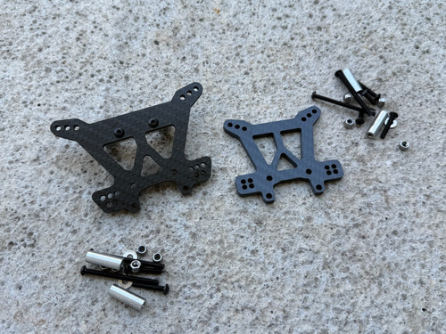
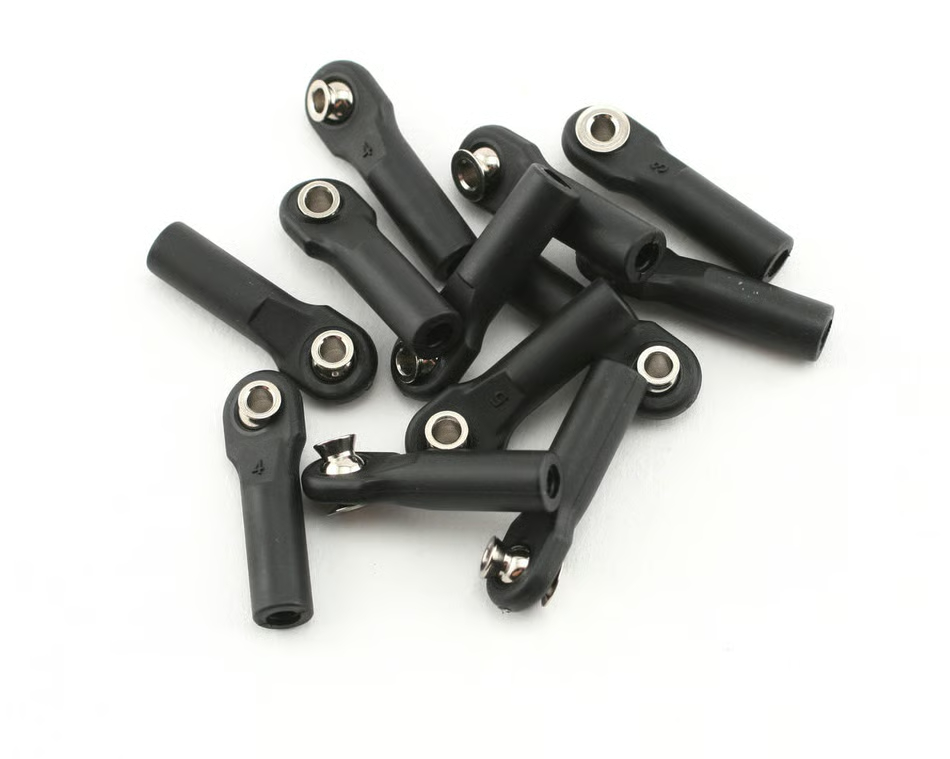

# FastAzJato4x4

> Custom prototype E-Buggy built on a Traxxas Jato 4x4 platform. AliExpress carbon-fiber LCG chassis, FLM26800 metal extended arms (front + rear), Slash 4x4-pattern CVDs on Tekno M6 stubs (stock Jato 4x4 diffs, 5mm), stock Jato hex hubs, Hobbywing EZRun MAX10 G2 140A + 3665SD G3 2400KV combo on 4S (Fire Phoenix XeRun 120A also in hand as spare), Hot Bodies D8 metal big-bore shocks (used set in hand; plastic Apache C1 / Wltoys A929 as the backup).
>
> **Build Status: WIP, actively sourcing parts. Car does not exist yet.**

---

## Table of Contents

- [Car Overview](#car-overview)
- [Track & Setup Philosophy](#track--setup-philosophy)
- [Suspension](#suspension)
- [Drivetrain](#drivetrain)
- [Electronics](#electronics)
- [Steering](#steering)
- [Aero & Body](#aero--body)
- [Bumpers](#bumpers)
- [Parts List](#parts-list)
- [3D Models](#3d-models)
- [TODO / Notes](#todo--notes)

> **Decision-locked parts** with a chosen part and confirmed cost live in [`BOM.md`](BOM.md).

---

## Car Overview

**Base Car:** Traxxas Jato 4x4 (heavily modified, custom carbon fiber chassis build)

_No build photo yet, the car doesn't physically exist; this is a parts-selection / planning build._

---

## Track & Setup Philosophy

I run this at the **Meldrum Bar Public RC Car Course** in Meldrum Bar Park (Gladstone, OR), a really blown-out dirt track: deep ruts, choppy braking bumps, dry loose dirt over a hard base. It's **casual / fun racing now** (transponder-timed racing was discontinued), so **no personal transponder is needed**. That surface drives the whole setup. It rewards compliance and forgiveness over outright top speed, so the car is built to soak up the rough and stay planted.

- **Racing there is open class and no rules.** Everything is fair game in the same heat: buggies, truggies, and 1/5 and monster class like X-Maxx, XRT and the Teknos. Nobody is trying to wreck anybody, but **racing is rubbing**, and with that spread of sizes on one track **landing on someone, or getting landed on, is normal**. A 1/5 or an X-Maxx coming down on this truck is a different kind of load than a crash into dirt. It's most of why durability decides parts here ahead of outright performance.
- **Soft, big-bore suspension.** Hot Bodies D8 metal big-bore shocks on soft springs (white 59gf front, grey 52gf rear) soak up the ruts. Oil is 50wt rear / 40wt front (retested from an earlier 45wt/60wt), the rear still the firmer of the two to control squat and rebound on the chop. No swaybars, I want the wheels working independently over the bumps.
- **Wide track for stability.** FLM26800 extended arms stretch the track width about 10mm per side, which calms the car over rough ground and adds droop.
- **Diffs tuned for a loose surface.** ~7k front for steering on the loose stuff, 5k rear for rotation, 20k center to hold drive stability.
- **Geared for punch, not top speed.** 16T pinion (FDR 3.38) on the 3665SD 2400KV keeps it punchy and cooler on a technical, rough track where you rarely hold full throttle.
- **Built to survive crashes.** Metal arms that bend instead of snap, Raptor R alloy hubs on Tekno stubs, and minimal skid-plate bumpers so a bad landing lets me throttle out instead of digging in and cartwheeling.
- **Body:** the OG Jato 3.3 stadium-truck shell, because it looks cool and stands out from every buggy on the track. Its own integrated wing means no separate buggy wing or mount.

---

## Suspension

| Component | Part | Notes |
|-----------|------|-------|
| Shocks | Hot Bodies D8 metal 97mm big bore (front + rear), used set in hand | Plastic HPI Apache C1 / Wltoys A929 = same shock, backup. Stock Jato 4x4 GTR XX-Long (gray composite, cheap at Jenny's) is a fine fallback if no big-bore set turns up, [`shock_analysis.md`](shock_analysis.md) |
| Springs / pistons / oil | White 59gf front + grey 52gf rear · 1.4mm×6 pistons · 40wt F / 50wt R (✅ retested) | Springs + pistons came with the used D8 set; oil from Tammies, [`shock_analysis.md`](shock_analysis.md#setup-spec-springs--pistons--oil) |
| Arms | FLM26800 metal extended, front + rear (ProTrac dropped) | 2 pairs purchased $25.73/pair (bulk order), [`arm_analysis.md`](arm_analysis.md) |
| Shock standoffs | HB Racing HBS67410 ×2 pairs (for the metal D8 shocks; plastic path can force-fit Traxxas hollow balls) | ✅ purchased $3.99/pr, [`shock_analysis.md`](shock_analysis.md#shock-standoffs--mounting) |
| Shock towers | MonsterKingz (G-Maxx) carbon fiber set (front + rear), for the larger shocks + 67410 standoffs; stock #9033 / TRA9039 = fallback | [`shock_tower_analysis.md`](shock_tower_analysis.md) |
| Arm guards | TRA6732 front + TRA6733 rear | [`arm_analysis.md`](arm_analysis.md#shock-guards) |
| Swaybars | None | Track works better without them, [`swaybar_analysis.md`](swaybar_analysis.md) |

---

## Drivetrain

| Component | Part | Notes |
|-----------|------|-------|
| Diffs (front + rear) | Traxxas Jato 4x4 stock (5mm) | To buy; E-Revo 1.0 (6mm) now spares, [`differential_analysis.md`](differential_analysis.md) |
| Axle CVDs | Knock-off Slash 4x4 HD steel CV (5mm) + Tekno M6 stubs | In hand, [`driveshaft_analysis.md`](driveshaft_analysis.md) |
| Center diff | Stock TRA6814 OEM plastic + 20k wt oil | [`differential_analysis.md`](differential_analysis.md#center-diff) |
| Center driveshaft | Jato 4x4 BL-2S take-off shaft (7455), $2.49, bought instead of TRA6855 | Purchased, [`driveshaft_analysis.md`](driveshaft_analysis.md#center-driveshaft-comparison) |
| Spur gear | TRA3956R 54T plastic | [`differential_analysis.md`](differential_analysis.md#spur-gear) |
| Pinion | **Running 16T 32P** on the 3665SD 2400KV (came with the metal center diff; 17/18T on hand to retune); equals a 12T-on-3200KV top speed | [`motor_analysis.md`](motor_analysis.md#pinion-reference-32p) |
| Diff / gearbox housings | Traxxas plastic, TRA6881 front / TRA6880 rear ($4 ea) | [`gearbox_housing_analysis.md`](gearbox_housing_analysis.md) |
| Wheel hexes | Front Tekno TKR1654-17 17mm hex; rear TKR5570-17 SCT410 kit (star 17mm hex, fits stock + Traxxas rims); TRA6469 alt in hand, 5.9g | Chosen, [`wheel_hex_analysis.md`](wheel_hex_analysis.md) |
| Bearings | Full sealed kit (Slash 4x4 sizes) | [`bearings_reference.md`](bearings_reference.md) |

---

## Electronics

| Component | Part | Notes |
|-----------|------|-------|
| ESC | **Hobbywing EZRun MAX10 G2 140A**, ✅ bought Jun 25 2026 ($127 combo); Fire Phoenix XeRun 120A also in hand | [`esc_analysis.md`](esc_analysis.md) |
| Motor | **Hobbywing EZRun 3665 G3 2400KV** (4-pole, came with the combo), supersedes the Tekin Pro4 HD plan | [`motor_analysis.md`](motor_analysis.md) |
| Battery | 4S LiPo **5000-5400mAh** (~5200 sweet spot; 6000 too heavy, 4200 too short), running **Zeee 5200 100C EC5** | From the shared fleet, [`battery_analysis.md`](battery_analysis.md) |
| Radio / receiver | **FlySky Noble NB4** TX + **FGr4S V2** RX | In hand, [`radio_analysis.md`](radio_analysis.md) |

---

## Steering

| Component | Part | Notes |
|-----------|------|-------|
| Bell crank | GPM aluminum bell crank (6845X), $19.98 | In hand, [`steering_bell_crank_analysis.md`](steering_bell_crank_analysis.md) |
| Knuckles + carriers | Traxxas Raptor R Ultimate alloy hubs (EHD, front + rear) | ✅ purchased 2026-07-29, $68.73, eBay (toysion), [`hub_carrier_analysis.md`](hub_carrier_analysis.md) |
| Servo | PTK 9752TG-D Metal High Speed, 1/8 1/10 | In hand, $19.65 (1 of 8 bulk-bought) |
| Tie rods + camber links | ACER titanium M4x60 rods ($5.99 ea, 6 needed) + RPM long rod ends (80511/80512/80515) + Traxxas hollow balls, all 6 links, ~61mm (96mm c-t-c) | [`tie_rod_analysis.md`](tie_rod_analysis.md) |

---

## Aero & Body

| Component | Part | Notes |
|-----------|------|-------|
| Wing | The Jato 3.3 body's own integrated wing, no separate buggy wing | AliExpress wing + TRA9517 now spares, [`aero_analysis.md`](aero_analysis.md#body-comparison) |
| Wing mount | None, the Jato 3.3 shell mounts its own wing | TRA9046 Meelobee mount kept for the buggy-body fallback only, [`aero_analysis.md`](aero_analysis.md#wing-mount-comparison) |
| Body / shell | **Traxxas Jato 3.3 red (5511A), chosen** ($34.47); JConcepts P2 (0684) buggy-body fallback | Cut clearance holes for the tall towers, [`aero_analysis.md`](aero_analysis.md#body-comparison) |
| Wheels / tires | **RED SPIDER wheels + tires, mounted** (17mm hex, same tire on colored rims); standard-width rims to stay **ROAR legal** | Wear in over a few laps, then hook well and wear slowly; soft non-belted race tires, mind the RPM, [`wheel_analysis.md`](wheel_analysis.md) |

---

## Bumpers

| Component | Part | Notes |
|-----------|------|-------|
| Front + rear | Traxxas TRA9044 front + rear skid plates ($7 set) | [`bumper_analysis.md`](bumper_analysis.md) |
| Front shock guard (alt) | Rustler TRA6736 / RPM 81042, both guard the front shocks well | [`bumper_analysis.md`](bumper_analysis.md) |

---

## Parts List

| Part # | Description | Category | Cost | Source | Status | Photo |
|--------|-------------|----------|------|--------|--------|-------|
| — | Traxxas Jato 4x4 | Base Car | — | — | — | — |
| — | RC Carbon Fiber Chassis Kit fit for Traxxas Slash VXL 4x4 TRA6808 | Chassis | $100.26 | [Temu](https://www.temu.com) / [AliExpress](https://a.aliexpress.com/_mPWcAS3) | Considering | — |
| FLM26800 | FLM Extended Arms (front, USA made), 1 of a 4-pair bulk order ($102.90 total) | Suspension | $25.73 | FLM | Purchased |  |
| MonsterKingz CF | MonsterKingz (G-Maxx) carbon fiber shock tower set (front + rear), chosen for the larger shocks; stock #9033 / TRA9039 now the fallback | Suspension | ~$33.29 | eBay (MonsterKingz) | In Hand |  |
| HBS67296 | Hot Bodies D8 metal 97mm big-bore shocks, used set of 4 (chosen); plastic Apache C1 #107365 / Wltoys A929 = backup | Suspension | $65.99 | eBay, guavahobby | In Hand |  |
| HBS67410 | HB Racing Shock Standoff, 2 pairs for the metal D8 shocks (plastic path force-fits Traxxas hollow balls) | Suspension | $3.99/pr | AMain | Purchased 2026-08-16 |  |
| — | Knock-off Slash 4x4 HD Steel CV driveshafts (5mm) + Tekno M6 stubs, order #8211906604054866 | Drivetrain | $21.10 | AliExpress, FengS Store | In Hand | — |
| — | Traxxas Jato 4x4 stock front + rear diffs (5mm) | Drivetrain | ~$25.94 (2×$12.97) | Jenny's RC | To buy | — |
| — | Traxxas E-Revo 1.0 Differentials (x2, 6mm, now spares, wrong outdrive) | Drivetrain | — | — | In Hand | — |
| TRA5153 | Traxxas Drive Cup (2), E-Revo 1.0 standard (x2 pairs / 4 total, now spares, mates the E-Revo 6mm diff only) | Drivetrain | $8.00/pair | [AMain Hobbies](https://www.amainhobbies.com) | In Hand | — |
| — | Traxxas Jato 4x4 Stock Hex Hubs | Drivetrain | — | — | — | — |
| 9063/9064/9065 | Traxxas Raptor R Ultimate alloy hubs, EHD front C-hubs + steering blocks + rear stub axle carriers, full set | Steering | $68.73 | eBay (toysion) | Purchased 2026-07-29 |  |
| — | 7075 Aluminum Front Steering + C Hub & Rear Axle Carriers, Jato 4x4 (MonsterKingz, demoted to fallback/spare) | Steering | $46.80 | eBay (MonsterKingz) | In Hand |  |
| — | PTK 9752TG-D Metal High Speed Servo, 1/8 1/10, 2S LiPo ready (1 of 8 bulk-bought) | Steering | $19.65 | AliExpress, PTK Servo Store | In Hand | — |
| — | ACER Racing Titanium M4x60 Turnbuckle Rods, 6 needed for all tie rods + camber links, ~61mm; bought 10-pack (4 spare) | Steering | $5.99 ea ($59.90/10) | ACER Racing | Purchased 2026-08-16 |  |
| RPM 80511/80512/80515 | RPM Long Rod Ends (white/black/blue, 12pk, replace stock #5525), run on the titanium rods, use Traxxas hollow balls | Steering | ~$7-9/12 | RPM | In Hand |  |
| TRA5525 | Traxxas Rod Ends w/ Hollow Balls (12), stock rod ends break, kept as the hollow-ball source for the RPM ends | Steering | $9.00 | Traxxas | In Hand |  |
| 38020343 | Hobbywing EZRun MAX10 G2 140A + 3665SD G3 2400KV combo (ESC + motor) | Electronics | $127.00 | Hobbywing direct | Purchased 2026-06-25 | — |
| — | Fire Phoenix XeRun 120A Enhanced (Speed Dragon), Waterproof, 4S (now spare/fallback) | Electronics | $30.00 | Temu | In Hand | — |
| — | FlySky FGr4S V2 Receiver, AFHDS3, PWM/PPM/IBUS, IPX4, Bidirectional | Electronics | $28.49 | AliExpress | Considering | — |

---

## 3D Models

> See [`3d-models/`](3d-models/) for all custom STL files.

| Model | Description | Status |
|-------|-------------|--------|
| Custom front-end shroud / wing mount + Rustler bumper integration | Cosmetic shroud that integrates the Rustler 4x4 front bumper (better crash protection, ugly stock) into a clean wing mount. Discussed in [`bumper_analysis.md`](bumper_analysis.md#notes) | Idea / TODO |

---

## TODO / Notes

- [ ] Fill in all part numbers and costs
- [ ] Add photos
- [ ] Document CF chassis eBay link
- [ ] Finalize motor spec
