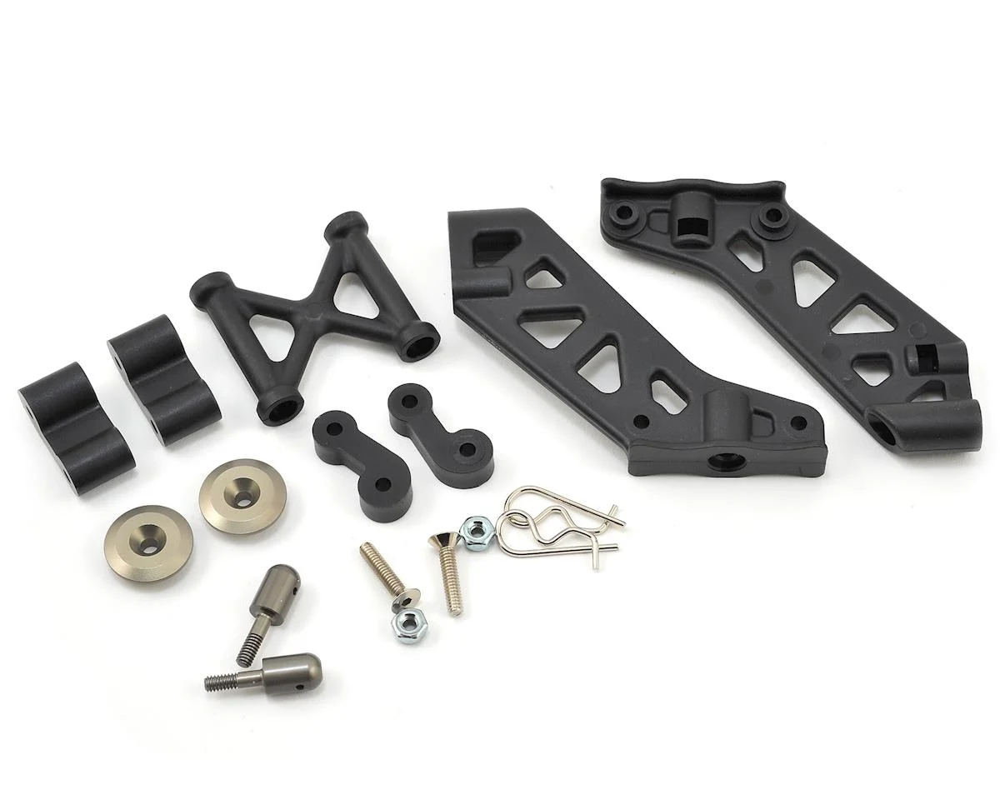
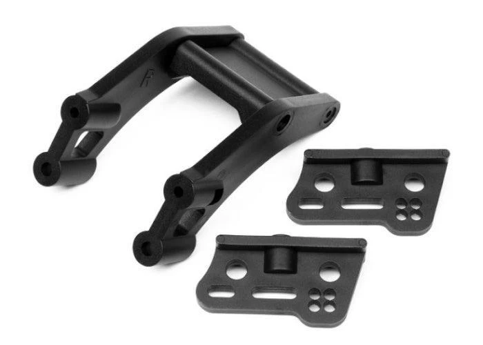

# Aero (Wing + Wing Mount) Selection — FastAzJato4x4

> **Chosen: AliExpress generic wing + OEM Jato 4x4 wing mount (TRA9046)** — wing is cheap, replaceable, and lighter than OEM; already in hand. OEM mount bolts directly to the stock Jato rear tower (#9034), no extra hardware. Wing angle adjustability achieved with **3D printed angle shims** — no need for a fancier mount. Wing holes drilled with a reamer using the grid pattern on the underside — cleaner holes, less risk of cracking the nylon.

  &nbsp; 
  <em>AliExpress 1/8 Buggy Wing &nbsp;·&nbsp; OEM Jato 4x4 Wing Mount TRA9046</em>

---

## Table of Contents

- [Key Requirements](#key-requirements)
- [Wing Comparison](#wing-comparison) — AliExpress vs Jato stock
- [Wing Mount Comparison](#wing-mount-comparison) — OEM Jato vs STRC backflash conversion
- [Shock Tower Compatibility Cascade](#shock-tower-compatibility-cascade) — why the wing mount choice affects shock protection
- [Notes](#notes)

---

## Key Requirements

| Requirement | Type | Why |
|---|---|---|
| **Fits chosen rear shock tower** | Must | Wing mount has to bolt up without forcing a shock-tower swap that breaks other decisions |
| **Holds wing through normal flights / crashes** | Must | A wing that falls off mid-air is dead weight |
| **Cheap / replaceable** | May | Wings break. Easy to source replacements matters more than premium build |
| **Doesn't put shocks in the crash path** | May | Rear shock exposure accepted as a known risk on this build — may revisit mount choice later |

---

## Wing Comparison

| Wing | Status | Pros / Cons | Photo / Link |
|---|---|---|---|
| **Generic AliExpress 1/8 Buggy Tail Wing** | **Chosen** | Pro: $2.50–$4, lighter than OEM, nylon, grid underside for reamer drilling. Fits E-Revo 1.0. Good sacrificial part  Con: QC on finish varies — doesn't matter since you're drilling it anyway |   <em>with dimensions</em> |
| **Traxxas Jato 4x4 / Sledge wing** TRA9517 | Candidate | Pro: Guaranteed OEM fit, no guesswork. Shared part between Jato 4x4 and Sledge  Con: Heavier than AliExpress wing. $13.79 (wing + mounts bundle) from Jenny's RC |   <em>TRA9517 (Sledge)</em> |

**AliExpress wing specs (in hand):**
- Material: Nylon plastic
- Size: 213mm × 85mm × 50mm
- Colors available: black / red / white / green / yellow
- Grid pattern on underside for easy mounting hole marking
- Fits: 1/8 RC off-road buggy
- Includes: 1x tail wing

**Take:** wing aero on a 1/10-1/8 class car at offroad speeds is mostly cosmetic. Pick the cheap one, replace when it breaks.

---

## Wing Mount Comparison

| Mount | Status | Pros / Cons | Photo / Link |
|---|---|---|---|
| **OEM Jato 4x4 wing mount** TRA9046 | **Chosen** | Pro: Direct fit to stock #9034 rear tower, no mods. $7.00. Angle adjustable via 3D printed shims  Con: Rear shocks exposed to external abuse — crash path puts them at risk. Known tradeoff, may revisit |  |
| ~~**Team Losi 8ight Wing Mount** TLR341005~~ | Vetoed | Pro: Clean sandwich-plate install  Con: $27.99 — not worth it. Non-adjustable, needs a fabricated plate |  |
| ~~**Traxxas Sledge wing mount** TRA9518~~ | Vetoed | Pro: $6.00, pairs with TRA9517  Con: Non-adjustable, needs a plate. Metal plate high up — bad for CG |  |
| ~~**HPI Vorza Flux Buggy Wing Mount** #67521~~ | Vetoed | Pro: $8.75, uses stock #9034 rear tower, likely adjustable  Con: Fit to Jato tower unconfirmed |  |
| ~~**STRC ST6808B backflash conversion kit**~~ | Vetoed | Pro: Centers shocks — better crash protection  Con: $66.99 full CNC kit, parts not sold separately — any breakage means buying the whole thing again. Unnecessary weight |  |

---

## Shock Tower Compatibility Cascade

The wing mount choice changes which rear shock tower the build uses, which changes where the rear shocks live, which changes how exposed they are in a rear-end crash. The two paths:

| Wing mount | Required rear tower | Shock position / Crash exposure | Photo |
|---|---|---|---|
| **OEM Jato 4x4 wing mount** | Stock Jato #9034 (chosen in [shock tower analysis](shock_tower_analysis.md)) | **Back side of the car** — shocks angled rearward off the tower **Exposed to rear-end impacts** — user has cracked shock bodies (HPI Vorza 97mm) this way |  |
| ~~STRC ST6808B conversion~~ (Vetoed) | Older Slash 4x4-style rear tower | **Centered** — shocks angled forward from the tower toward the chassis **Protected** — chassis sits between shocks and the rear bumper line |  |

**This is a real cross-decision constraint** between the aero analysis and the shock tower analysis. The shock tower analysis chose the stock #9034 partly because it's cheap, sacrificial, and 4S-rated for the Extreme HD strength. But that decision assumes the OEM Jato 4x4 wing mount — going with the STRC conversion would force a different rear tower entirely.

**Decision: Path A chosen.** OEM mount + #9034 tower. Rear-shock exposure accepted as a known consumable risk — a shock rebuild is cheap relative to a $66.99 STRC kit that would need full replacement if any piece breaks.

---

## Notes

- AliExpress wing mounting holes drilled with a reamer — use the grid pattern on the underside to locate the holes, then ream to size. Cleaner cut than a drill bit, less risk of cracking the nylon.
- Wing can also be zip-tied to the mount — works, but ghetto. Ream the holes properly.
- Reference: the K939 build uses the older Slash 4x4-style rear shock geometry — that platform has *not* had the rear-shock crash exposure problem the FastAzJato4x4 prototype hit with the Jato stock tower. Rear-shock exposure is accepted on this build as a known consumable risk.
