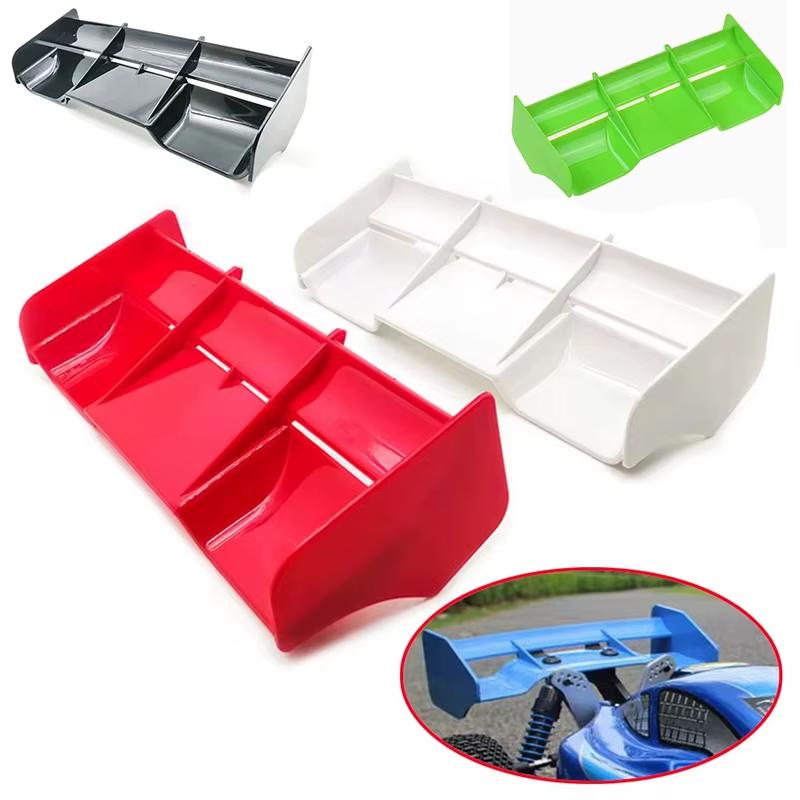
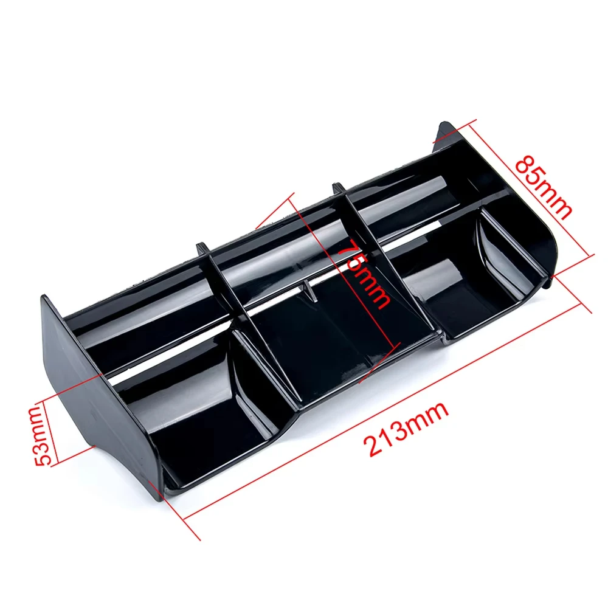
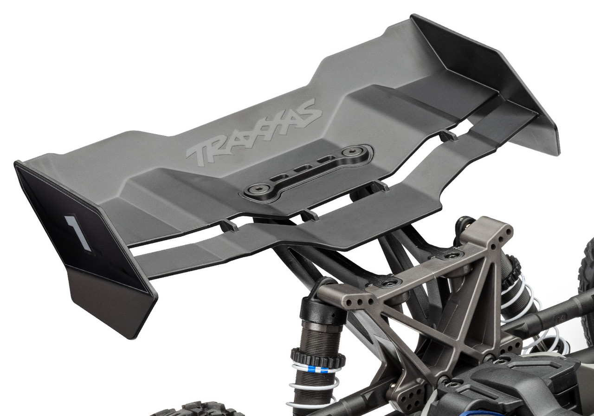
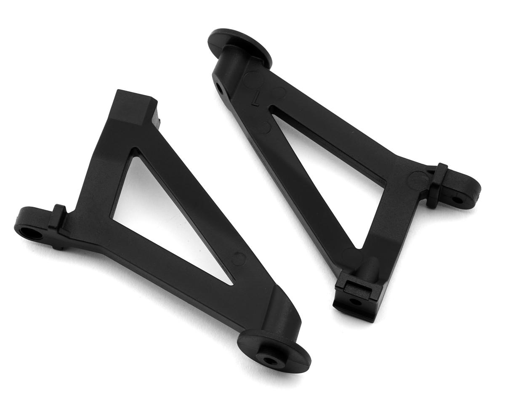

# Aero (Wing + Wing Mount) Selection — FastAzJato4x4

> **Chosen: AliExpress generic wing + OEM Jato 4x4 wing mount (TRA9046)** — wing is cheap, replaceable, and lighter than OEM; already in hand. OEM mount bolts directly to the stock Jato rear tower (#9034), no extra hardware. STRC ST6808B vetoed: $66.99 buys a full CNC aluminum kit, but any broken piece means buying the whole kit again or swapping to plastic — unnecessary weight and expense when the wing mount is the only piece that matters here. Wing holes drilled with a reamer (not a drill) using the grid pattern on the underside — cleaner holes, better precision, less risk of cracking the nylon.

---

## Table of Contents

- [Key Requirements](#key-requirements)
- [Wing Comparison](#wing-comparison) — AliExpress vs Jato stock
- [Wing Mount Comparison](#wing-mount-comparison) — OEM Jato vs STRC backflash conversion
- [Shock Tower Compatibility Cascade](#shock-tower-compatibility-cascade) — why the wing mount choice affects shock protection
- [Notes](#notes)

---

## Key Requirements

| Requirement | Type | Why |
|---|---|---|
| **Fits chosen rear shock tower** | Must | Wing mount has to bolt up without forcing a shock-tower swap that breaks other decisions |
| **Holds wing through normal flights / crashes** | Must | A wing that falls off mid-air is dead weight |
| **Cheap / replaceable** | May | Wings break. Easy to source replacements matters more than premium build |
| **Doesn't put shocks in the crash path** | Must (for mount choice) | Already broke an HPI Vorza 97mm shock on a rear-end hit with the back-side-shock geometry — avoid repeating |

---

## Wing Comparison

| Wing | Status | Pros / Cons | Photo / Link |
|---|---|---|---|
| **Generic AliExpress 1/8 Buggy Tail Wing** | **Chosen** | Pro: Cheap, noticeably lighter than Traxxas stock wing, nylon plastic (good tenacity), grid pattern on underside — drill holes with a reamer for clean precision cuts without cracking. Easy to replace when it breaks Con: QC varies on finish; irrelevant for a wing you're drilling anyway |   <em>with dimensions</em> |
| **Traxxas Jato 4x4 stock wing** (#9517) + **wing mounts** (#9046) | Candidate | Pro: Guaranteed fit to OEM Jato geometry, no guesswork on mount hole spacing Con: Heavier than AliExpress nylon wing — generic is noticeably lighter. $13.79 (wing + mounts bundle) from Jenny's RC |  |

**AliExpress wing specs (in hand):**
- Material: Nylon plastic
- Size: 213mm × 85mm × 50mm
- Colors available: black / red / white / green / yellow
- Grid pattern on underside for easy mounting hole marking
- Fits: 1/8 RC off-road buggy
- Includes: 1x tail wing

**Take:** wing aero on a 1/10-1/8 class car at offroad speeds is mostly cosmetic. Pick the cheap one, replace when it breaks.

---

## Wing Mount Comparison

| Mount | Status | Pros / Cons | Photo / Link |
|---|---|---|---|
| **OEM Jato 4x4 wing mount** TRA9046 (mounts to #9034 rear tower) | **Chosen** | Pro: Direct fit to the chosen Jato stock rear tower (#9034). No modifications. $7.00 from AMain Hobbies Con: **Shocks end up on the back side of the car** in the Jato 4x4 geometry — exposed to rear-end impact damage. User has cracked shock bodies this way before |  |
| ~~**STRC ST6808B backflash conversion kit**~~ | Vetoed | Pro: Repositions shocks to centered geometry — better rear-end crash protection Con: **$66.99 for a full CNC aluminum kit.** Any broken piece requires buying the whole kit again (or swapping back to plastic) — parts aren't sold separately. Adds unnecessary weight; the wing mount is the only relevant piece here, and OEM does that job for $7.00 |  🚧 save as `src/aero_strc_st6808b_backflash_conversion.jpg` |

---

## Shock Tower Compatibility Cascade

The wing mount choice changes which rear shock tower the build uses, which changes where the rear shocks live, which changes how exposed they are in a rear-end crash. The two paths:

| Wing mount | Required rear tower | Shock position | Crash exposure |
|---|---|---|---|
| **OEM Jato 4x4 wing mount** | Stock Jato #9034 (chosen in [shock tower analysis](shock_tower_analysis.md)) | **Back side of the car** — shocks angled rearward off the tower | **Exposed to rear-end impacts** — user has cracked shock bodies (HPI Vorza 97mm) this way |
| **STRC SPTST6808B conversion** | Older Slash 4x4-style rear tower | **Centered** — shocks angled forward from the tower toward the chassis | **Protected** — chassis sits between shocks and the rear bumper line |

**This is a real cross-decision constraint** between the aero analysis and the shock tower analysis. The shock tower analysis chose the stock #9034 partly because it's cheap, sacrificial, and 4S-rated for the Extreme HD strength. But that decision assumes the OEM Jato 4x4 wing mount — going with the STRC conversion would force a different rear tower entirely.

**Decision: Path A chosen.** OEM mount + #9034 tower. Rear-shock exposure accepted as a known consumable risk — a shock rebuild is cheap relative to a $66.99 STRC kit that would need full replacement if any piece breaks.

---

## Notes

- AliExpress wing mounting holes drilled with a reamer — use the grid pattern on the underside to locate the holes, then ream to size. Cleaner cut than a drill bit, less risk of cracking the nylon.
- Reference: the K939 build uses the older Slash 4x4-style rear shock geometry — that platform has *not* had the rear-shock crash exposure problem the FastAzJato4x4 prototype hit with the Jato stock tower. Rear-shock exposure is accepted on this build as a known consumable risk.
