# Aero (Wing, Mount + Body) Selection — FastAzJato4x4

> **Chosen: OG Jato 3.3 body (5511A red), with no separate wing or wing mount.** Ditching the buggy wing **and** the TRA9046 Meelobee mount for the Jato 3.3 stadium-truck shell, because it looks cool and stands out from every buggy on the track. The shell runs its **own small integrated wing** and a **smaller / lighter body mount**, so weight comes off up high. The catch: the tall Jato 4x4 front + rear shock towers foul this lower shell, so **clearance holes get cut** to let the towers + shock tops poke through (done cleanly it reads as intentional). The **JConcepts P2 (0684)** buggy body is the fallback if the truck shell doesn't pan out. The wing and wing-mount sections below cover the two ways a separate wing could come back: converting to a Jato wing, or going to the buggy body.

  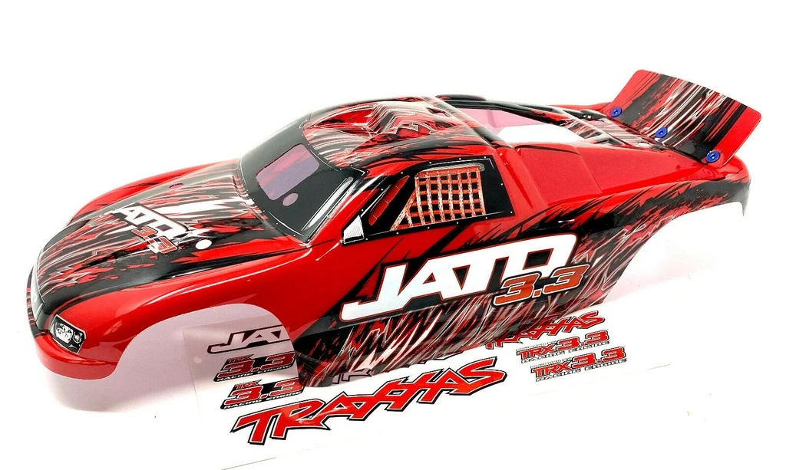 
  <em>Chosen: OG Jato 3.3 body (5511A red), its own integrated wing, no separate buggy wing / mount</em>

---

## Table of Contents

- [Key Requirements](#key-requirements)
- [Wing Comparison](#wing-comparison) — the Jato conversion path vs the buggy body path
- [Wing Mount Comparison](#wing-mount-comparison) — the OEM Jato mount held in reserve, and what was vetoed
- [Shock Tower Compatibility Cascade](#shock-tower-compatibility-cascade) — why the wing mount choice is what made the rear tower carbon
- [Body Comparison](#body-comparison) — JConcepts P2 vs Traxxas OEM tiers
- [Notes](#notes)

---

## Key Requirements

| Requirement | Type | Why |
|---|---|---|
| **Fits chosen rear shock tower** | May | The Jato 3.3 shell runs an integrated wing, so nothing has to bolt to the tower today. Kept as a preference because **the option to convert back to a Jato wing** is worth holding, and it's the reason the rear runs carbon rather than a $6 Slash tower that won't take the Jato wing mount ([`shock_tower_analysis.md`](shock_tower_analysis.md)) |
| **Holds wing through normal flights / crashes** | May | Only applies if a separate wing goes back on. The current shell's wing is part of the body, so there's nothing to shake loose |
| **Cheap / replaceable** | May | Wings break. Easy to source replacements matters more than premium build |
| **Doesn't put shocks in the crash path** | May | Solved rather than accepted. The rear shocks mount ahead of the tower now, so the tower takes the hit first ([`shock_tower_analysis.md`](shock_tower_analysis.md)) |

---

## Wing Comparison

> **No separate wing on the current build**, the Jato 3.3 shell's integrated wing does the job. Two paths could bring one back, and each has a different pick below:
>
> - **Convert to a Jato wing.** The reason the rear tower is carbon rather than a $6 Slash one, since only the carbon takes the Jato wing mount ([`shock_tower_analysis.md`](shock_tower_analysis.md)). Wing and mount are already in hand.
> - **Go back to a buggy body.** The JConcepts P2 fallback, which needs a buggy wing and mount of its own.

> *Spec format: Part · Material · Size · Fits · Weight · Price*

| Wing | Spec | Pros / Cons | Photo / Link |
|---|---|---|---|
| 🥈 **Traxxas Jato 4x4 / Sledge wing** — *the Jato conversion path, combo in hand* | **Part:** TRA9517 (Jato 4x4 / Sledge) **Material:** OEM plastic **Size:** N/A **Fits:** Jato 4x4 / Sledge **Weight:** N/A **Price:** **$13.79** ✅ **purchased** (wing + TRA9046 mount combo, Jenny's RC, delivered 2026-07-27) | Pro: Guaranteed OEM fit, no guesswork. Shared part between Jato 4x4 and Sledge. **In hand, got it as the Jenny's RC wing + TRA9046 mount combo**  Con: Heavier than the AliExpress wing. **Its mount only works on the Jato 4x4 rear towers (or the MonsterKingz rear CF towers)**, no other rear tower carries it. **If I kill this wing, the AliExpress wing drops straight on in its place** |  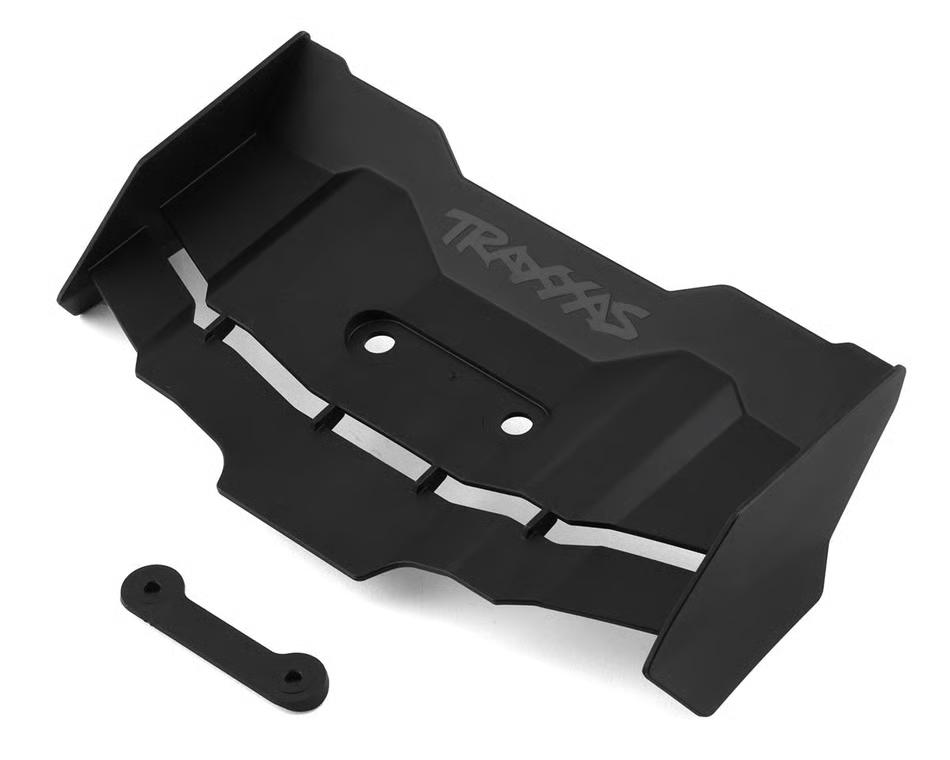 <em>TRA9517 (Sledge)</em> |
| 🔵 **Generic AliExpress 1/8 Buggy Tail Wing** — *buggy body path only* | **Part:** N/A (generic) **Material:** nylon **Size:** 213 × 85 × 50mm **Fits:** 1/8 buggy / E-Revo 1.0 **Weight:** N/A **Price:** **$2.50–$4** | Pro: Lighter than OEM, grid underside for reamer drilling. Good sacrificial part  Con: QC on finish varies, doesn't matter since you're drilling it anyway |   <em>with dimensions</em> |

**AliExpress wing specs (in hand):**
- Material: Nylon plastic
- Size: 213mm × 85mm × 50mm
- Colors available: black / red / white / green / yellow
- Grid pattern on underside for easy mounting hole marking
- Fits: 1/8 RC off-road buggy
- Includes: 1x tail wing

**Take:** at 1/8 scale and offroad speeds, the wing provides real aerodynamic benefit, air control and stability, especially mid-air. Pick the cheap one so you don't think twice about replacing it when it breaks.

---

## Wing Mount Comparison

> **No mount on the current build**, since there's no separate wing. The OEM Jato mount below is the one held in reserve, and keeping it usable is why the rear tower is carbon.

> *Spec format: Part · Adjustable · Fits · Price*

| Mount | Spec | Pros / Cons | Photo / Link |
|---|---|---|---|
| 🥈 **OEM Jato 4x4 wing mount** — *held for the Jato conversion* | **Part:** TRA9046 **Adjustable:** Angle-adjustable (3D-printed shims) **Fits:** Slash 4x4 Extreme HD tower (via Meelobee plate) **Price:** **$7.00** | Pro: **Via Meelobee technique: mounts to the Slash 4x4 Extreme HD tower using a small aluminum plate on top of the tower**, shocks centered and protected, shock-exposure problem fully solved  Con: Requires fabricating a small aluminum plate (simple flat piece, not complex) |  |
| ❌ ~~**Team Losi 8ight Wing Mount**~~ | **Part:** TLR341005 **Adjustable:** Non-adjustable **Fits:** N/A **Price:** $27.99 | Pro: Clean sandwich-plate install  Con: $27.99, not worth it. Non-adjustable, needs a fabricated plate | 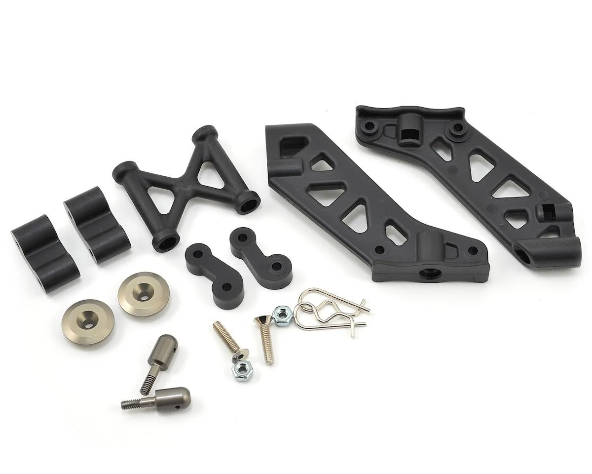 |
| ❌ ~~**Traxxas Sledge wing mount**~~ | **Part:** TRA9518 **Adjustable:** Non-adjustable **Fits:** Pairs with TRA9517 **Price:** $6.00 | Pro: Pairs with TRA9517  Con: Non-adjustable, needs a plate. Metal plate high up, bad for CG | 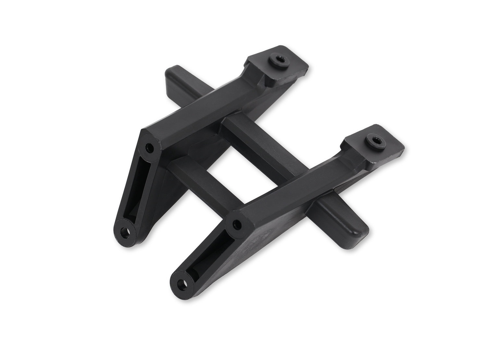 |
| ❌ ~~**HPI Vorza Flux Buggy Wing Mount**~~ | **Part:** #67521 **Adjustable:** Likely adjustable **Fits:** stock #9034 rear tower (Jato fit unconfirmed) **Price:** $8.75 | Pro: Likely adjustable, uses stock #9034 rear tower  Con: Fit to Jato tower unconfirmed |  |
| ❌ ~~**STRC ST6808B backflash conversion kit**~~ | **Part:** ST6808B **Adjustable:** N/A **Fits:** N/A **Price:** $66.99 (full CNC kit) | Pro: Centers shocks, better crash protection  Con: $66.99 full CNC kit, parts not sold separately, any breakage means buying the whole thing again. Unnecessary weight | 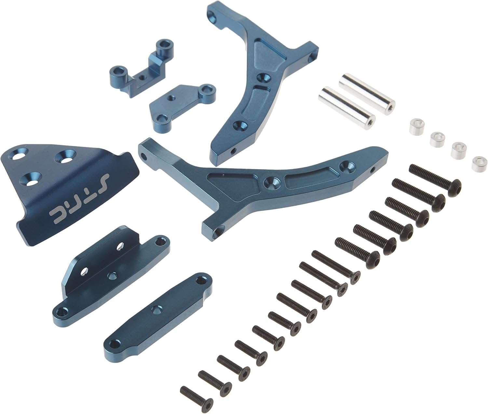 |

---

## Shock Tower Compatibility Cascade

> **Not in play today, but it's why the rear tower is what it is.** The Jato 3.3 shell needs no wing mount, so nothing here forces a choice right now. **The MonsterKingz CF rear tower is chosen because it takes the Jato wing mount easily**, which keeps this whole cascade available without another tower swap ([`shock_tower_analysis.md`](shock_tower_analysis.md)). The $6 Slash rear towers don't take it without fabricating a plate, which is the one thing they cost you.

The wing mount choice changes which rear shock tower the build uses, which changes where the rear shocks live, which changes how exposed they are in a rear-end crash. The two paths:

| Wing mount | Required rear tower | Shock position / Crash exposure | Photo |
|---|---|---|---|
| **OEM Jato 4x4 Wing Mount TRA9046 via Meelobee technique** | **Slash 4x4 rear tower**, either the EHD TRA9039 or the standard TRA6838, plus a small custom aluminium plate on top | **Centered**, same protected geometry as the Slash 4x4-style tower  **Protected**, shocks forward of the rear bumper line, not in the crash path | 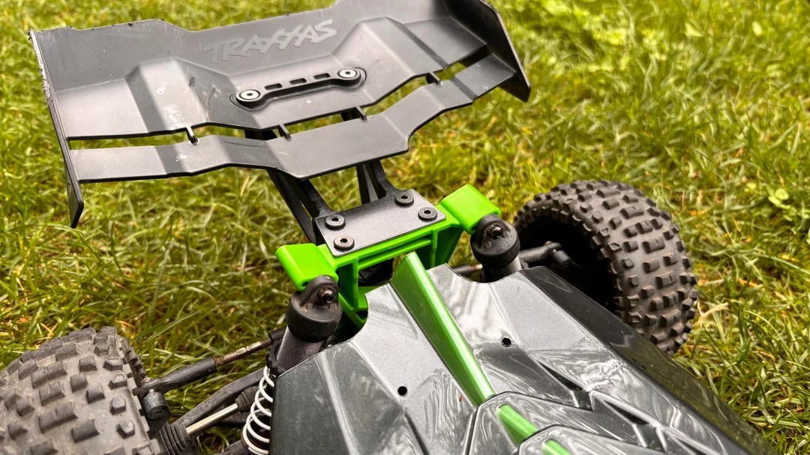 <em><a href="https://www.reddit.com/r/Traxxas/comments/1mzllk0/slash_4x4_converted_to_backslash/">Meelobee on r/Traxxas</a></em> |
| OEM Jato 4x4 Wing Mount TRA9046 on stock Jato #9034 | Stock Jato #9034 | **Simplest install, bolt-on, zero mods required**  **Back side of the car**, shocks exposed to rear-end impacts. I've cracked shock bodies (HPI Vorza 97mm) this way. Cost of simplicity | 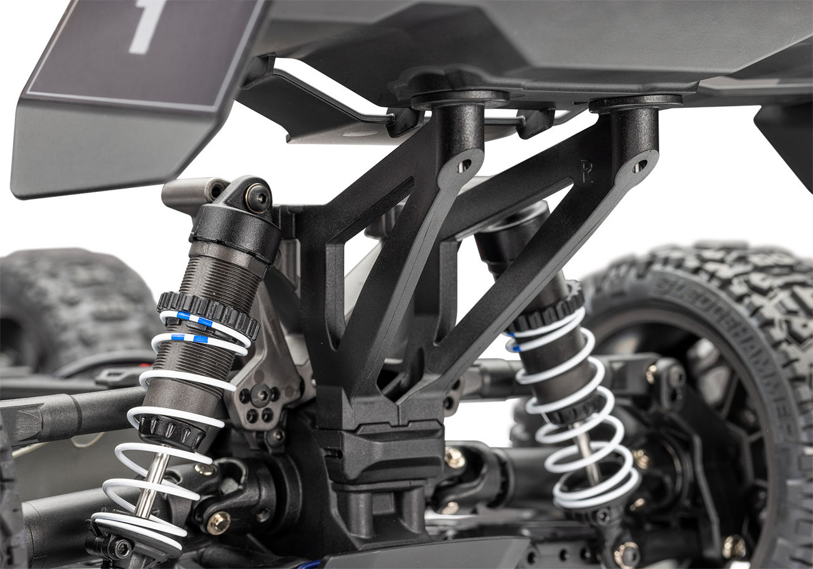 |
| ~~STRC ST6808B conversion~~ (Vetoed) | Older Slash 4x4-style rear tower | **Centered**, shocks angled forward, protected  **Protected**, but at $66.99 for a full kit | 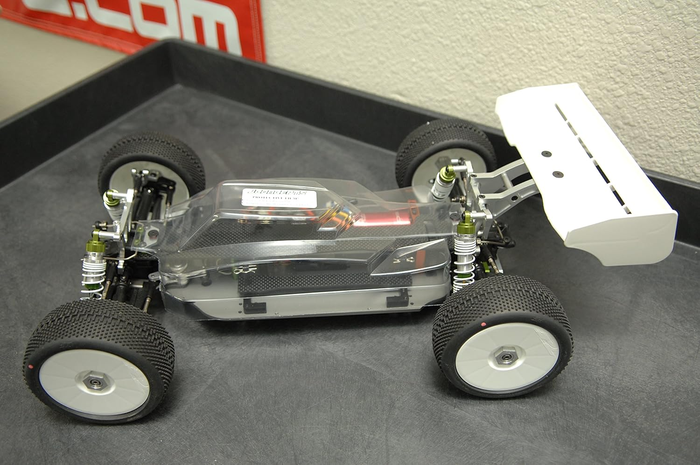 |

**Not the route this build took.** The Meelobee technique puts the TRA9046 on a **Slash 4x4 rear tower**, EHD or standard, using a small aluminium plate on top. It stays here as the documented way to run a separate wing on a Slash tower if the body ever changes. Cheap OEM mount, no forced tower swap to an incompatible system. Also see TRA6838 (non-HD, same $6.00) as an alternative in [shock tower analysis](shock_tower_analysis.md).

**Weight bias note:** Slash 4x4 tower geometry positions the rear shocks closer to the center of the car (forward of the rear bumper line). This shifts mass toward the front, ideal for a nose-heavy bias on this build. The stock Jato #9034 geometry pushes shocks rearward, adding tail weight and reducing nose bias. Another reason to prefer the Meelobee technique beyond just shock protection.

---

## Body Comparison

The body shell. **Buggy-style aftermarket bodies are the direction**, the JConcepts P2 (race-proven, direct fit) or a cheap AliExpress molded-color 1/8 buggy shell (custom-cut, OG look, no painting). The Traxxas OEM body is the fallback, in a price tier from clear (paint it yourself) up to fully pre-painted. **Note:** the CF chassis needs custom body mounting for any of these (no clipless support), which makes the cut-to-fit aftermarket shells no extra hassle.

> *Spec format: Part · Material · Fits · Finish · Includes · Price*

| Body | Spec | Pros / Cons | Photo / Link |
|---|---|---|---|
| ⭐ **OG Jato 3.3 body shell** (nitro stadium-truck look), *✅ chosen, red now, orange next* | **Part:** **5511R** ProGraphix (paint your color) · **5511A** red / **5511T** orange (pre-painted) · 5511 clear; **blue + yellow were RTR-only** (came on the complete 55077-3 truck, no standalone body part #); take-offs also sold by the truck model "55077-3" **Material:** Polycarbonate **Fits:** Jato 3.3 (stadium truck), mounts to the Jato 4x4 with custom body posts; **the tall front + rear shock towers likely need clearance holes cut** so the towers + shock tops can pass through **Finish:** ProGraphix (graphics pre-painted, spray your own main color), pre-painted (red/orange), or clear **Includes:** decals (+ mount plate & screws on the 5511R) **Price:** **$34.47** ✅ **purchased** (red take-off, Jenny's RC, delivered 2026-07-27) | Pro: **OG Jato stadium-truck look, stands out from every buggy body on the track, could look really cool.** **Ditches the big rear buggy wing** for the shell's own small integrated wing, and **runs a smaller/lighter body mount → real weight savings.** Cheap as a used take-off  Con: **Tall Jato 4x4 shock towers foul this lower shell, you'd have to cut holes** to clear the front + rear towers and shock tops (could still look intentional). Smaller wing = **less aero/stability** than the buggy wing. Genuine ProGraphix needs the main color sprayed; take-offs often sold out | 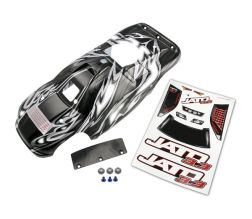  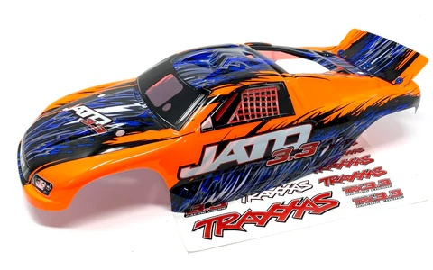 <em>separate bodies: 5511R ProGraphix (paint-your-color) · 5511A red · 5511T orange</em> 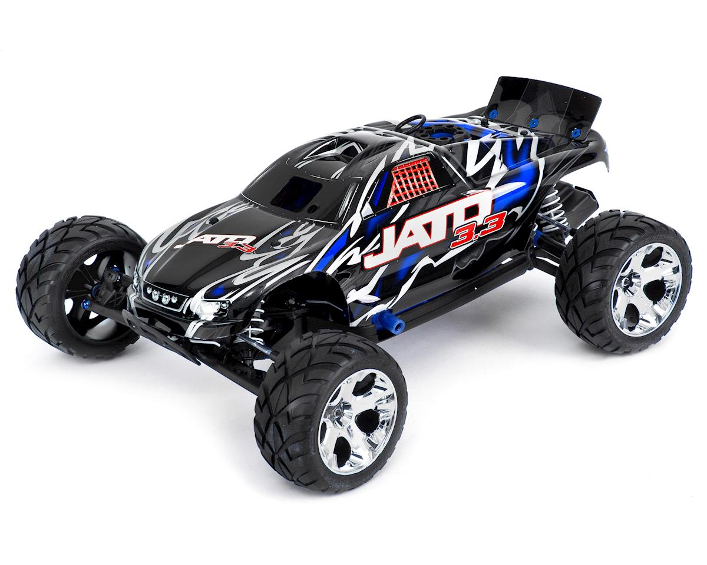 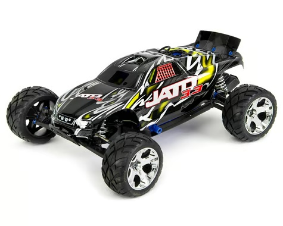 <em>RTR-only colors (whole-car): blue · yellow</em> |
| 🥈 **JConcepts P2 Performance Body** — *buggy-body fallback* | **Part:** 0684 **Material:** Clear polycarbonate, standard thickness **Fits:** **Traxxas Jato 4x4** (direct fit) **Finish:** Clear (paint yourself) **Includes:** window masks + decal sheet + hook-and-loop tape **Price:** **$34** ($40 list) | Pro: **Like it a lot**, proven P2 race design (IFMAR Worlds pedigree), tight chassis-following profile, center fin + winglets for stability. **Direct fit** to the Jato 4x4  Con: **Comes clear, not painted** (paint it yourself). **Its included hook and loop tape is no help on the CF chassis**, there's nothing on the sides to stick it to, so this body needs 3D printed mounts the same as an OEM one does (see the note below) | 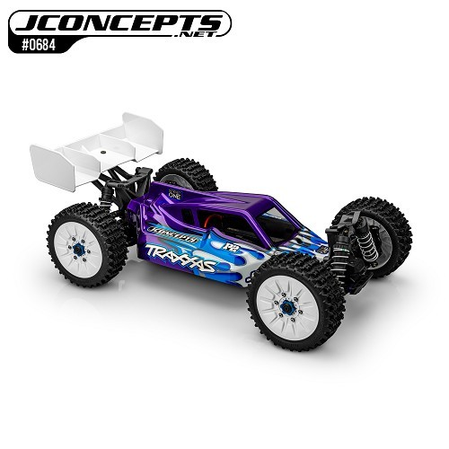 |
| 🔵 **AliExpress generic 1/8 buggy body** (ZD Racing 08421-V3 style) | **Part:** N/A (generic, ZD 08421-V3 style) **Material:** PVC / polycarbonate **Fits:** 1/8 buggy (confirmed HCG; LCG unverified) **Finish:** **~17 molded colors**, pre-colored, uncut **Includes:** N/A **Price:** **~$20–30** (on sale) | Pro: **Molded color, no painting**, and you **custom-cut it to fit**, which suits the CF chassis (needs custom mounts anyway). **Running the pink + white on the K939, looks kick-ass and OG**, custom-fits great. Dirt cheap  Con: Comes uncut, DIY trim + custom mounts. **Confirmed fits the HCG chassis perfectly; not tried on an LCG chassis yet**, and this build's CF chassis is **LCG**, so verify fit before committing | <a href="https://www.aliexpress.us/item/3256806297685912.html">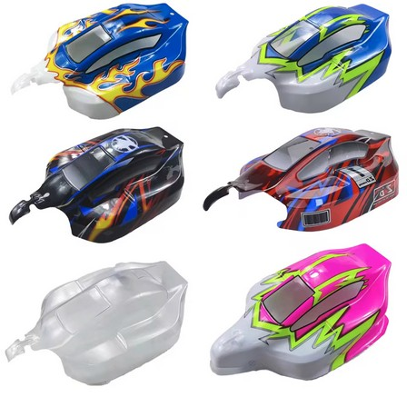</a> |
| 🔵 **Traxxas Jato 4x4, Clear** | **Part:** 9018 **Material:** Polycarbonate **Fits:** Traxxas Jato 4x4 (OEM exact) **Finish:** Clear, fully trimmed, ready to paint **Includes:** decal sheet, window masking, overspray film, clipless body latches + hardware **Price:** **$29.95** | Pro: **Cheapest, OEM exact fit.** Paint it any color you want  Con: Comes clear, full paint job on you. Ships with clipless latches, but those are **moot on the CF chassis** (no clipless support) | 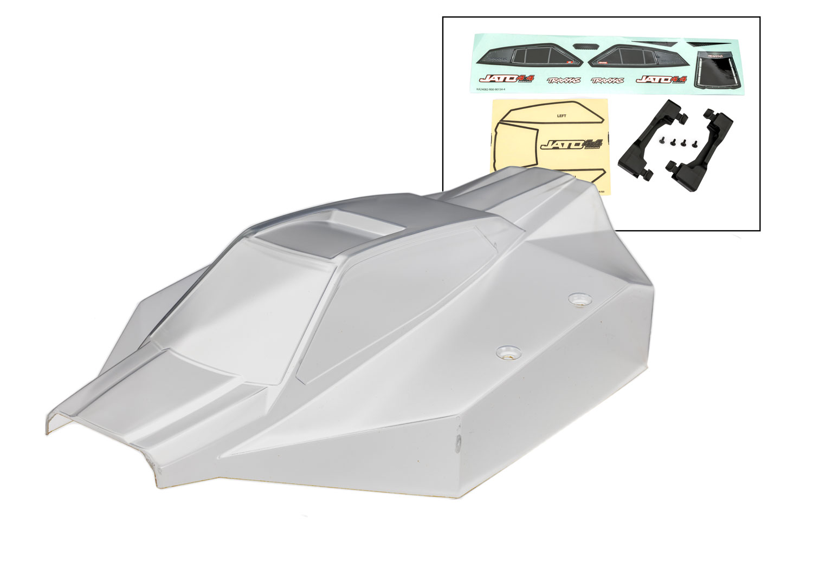 |
| 🔵 **Traxxas Jato 4x4, ProGraphix** | **Part:** 9018X or 9060X (two graphics schemes) **Material:** Polycarbonate **Fits:** Traxxas Jato 4x4 (OEM exact) **Finish:** Graphics pre-painted, main body clear, you spray the main color; fully trimmed **Includes:** decal sheet, clipless latches + hardware **Price:** **$34.95** | Pro: **Middle ground, detailed graphics already done**, you just spray the base color. Pro-looking result with little effort  Con: Still needs the main color sprayed; pricier than the plain clear | 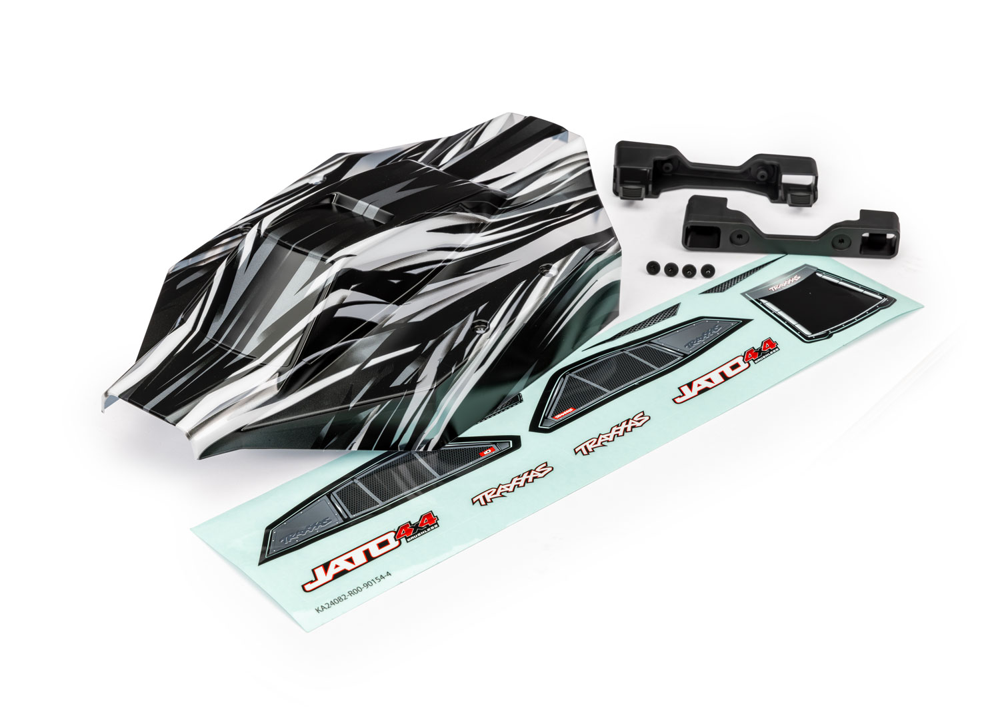 |
| 🔵 **Traxxas Jato 4x4, pre-painted 9018-series** | **Part:** 9018-BLUE / -RED / -BLK / -GRN **Material:** Polycarbonate **Fits:** Traxxas Jato 4x4 (OEM exact) **Finish:** Fully pre-painted ProGraphix + decals; ready to mount, no trimming **Includes:** decals **Price:** **$39.95** | Pro: **Pre-painted**, mounts right out of the bag, zero paint work. 4 colors  Con: Looks generic, stock-style body | 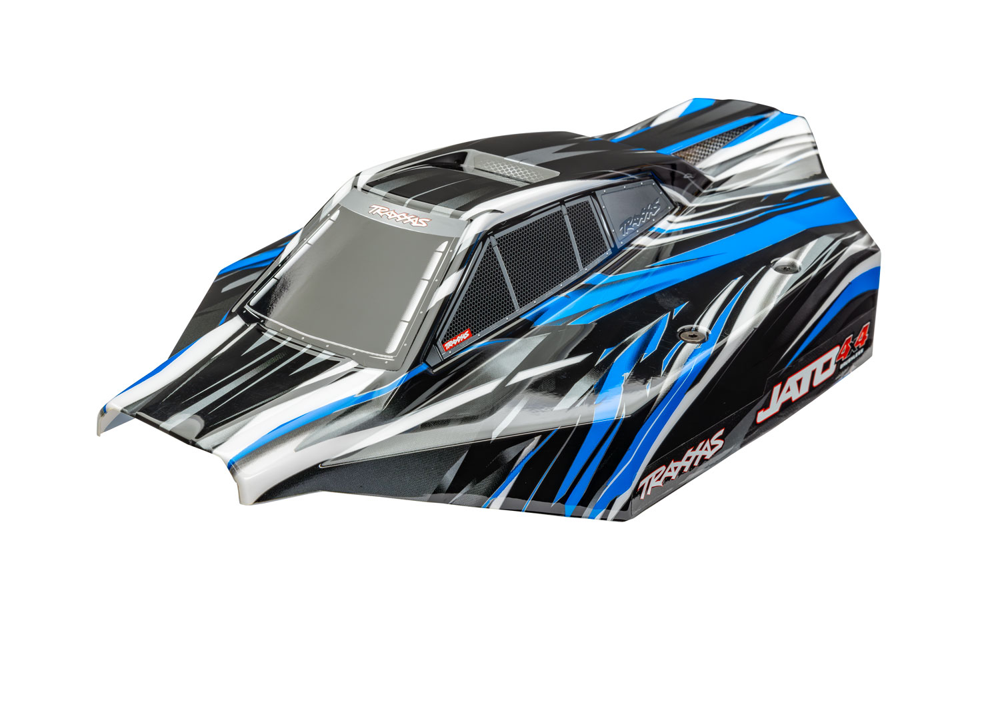 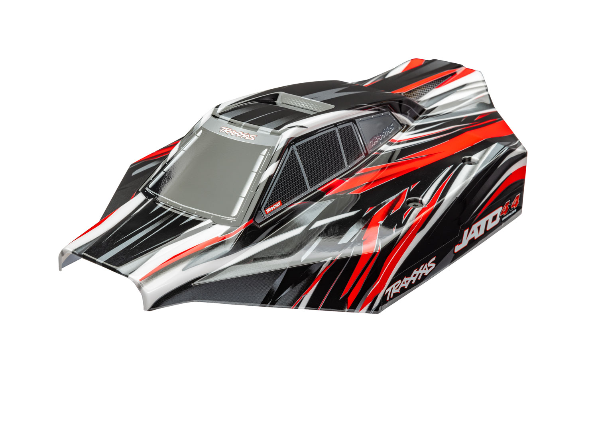 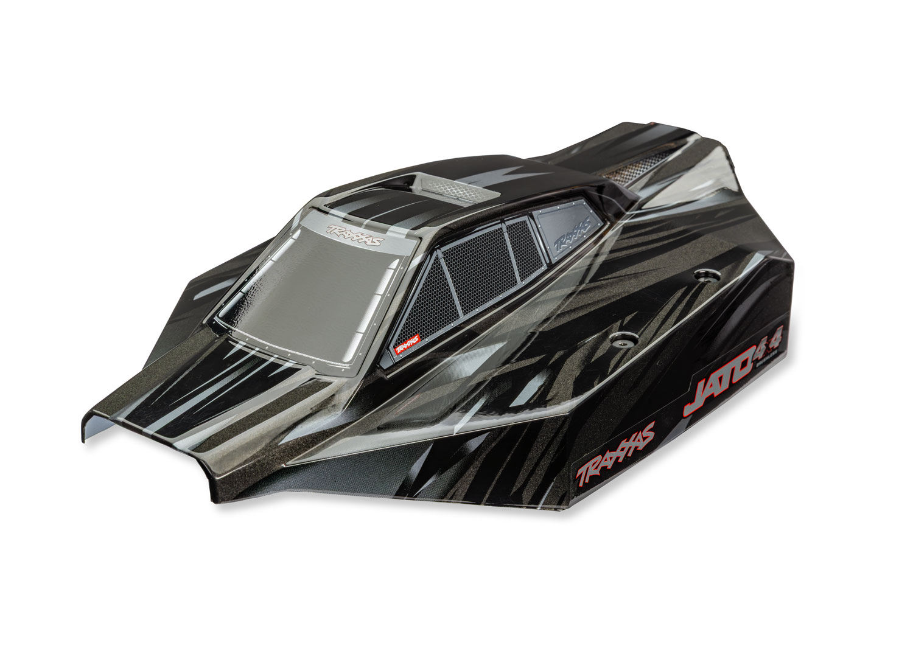 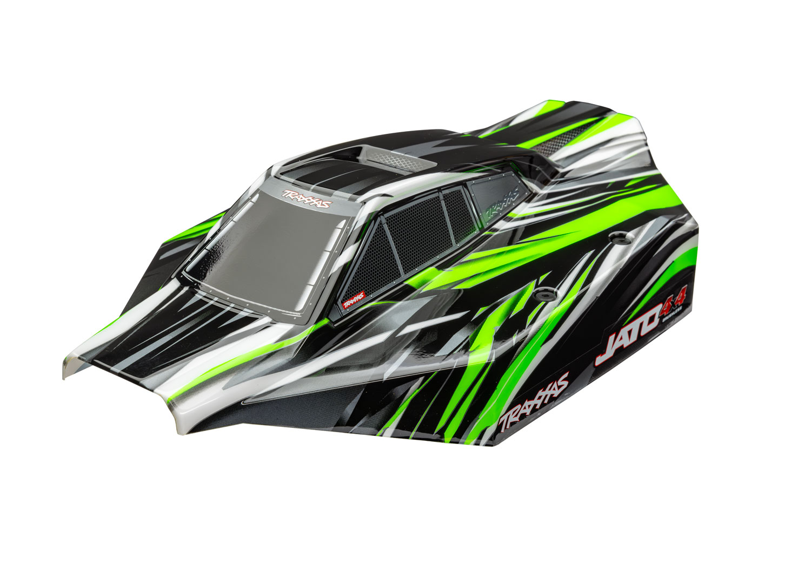 <em>blue · red · black · green</em> |
| 🔵 **Traxxas Jato 4x4, pre-painted 9060-series** | **Part:** 9060-BLUE / -GRN / -ORNG / -PINK **Material:** Polycarbonate **Fits:** Traxxas Jato 4x4 (OEM exact) **Finish:** Pre-painted, different graphics scheme; ready to mount, no trimming **Includes:** decals **Price:** **$43.95** | Pro: Pre-painted, ready to mount. Different scheme + colors  Con: **Priciest at $43.95** and looks generic | 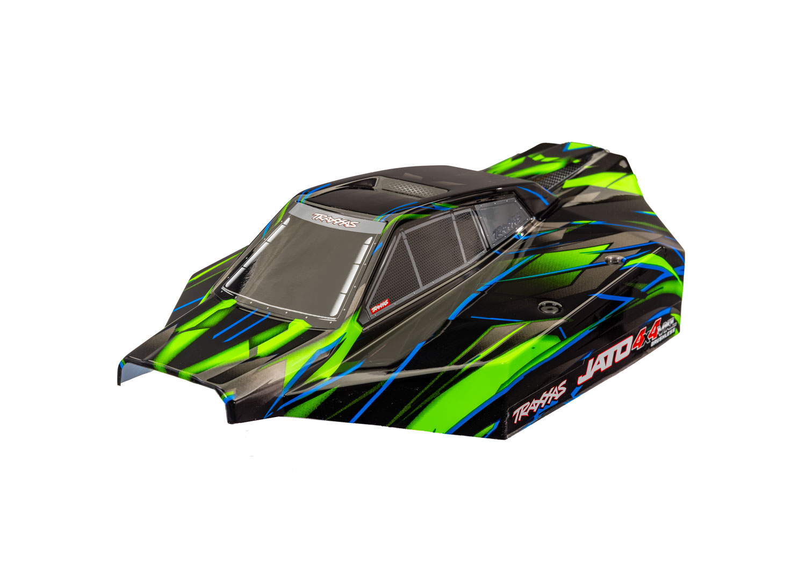 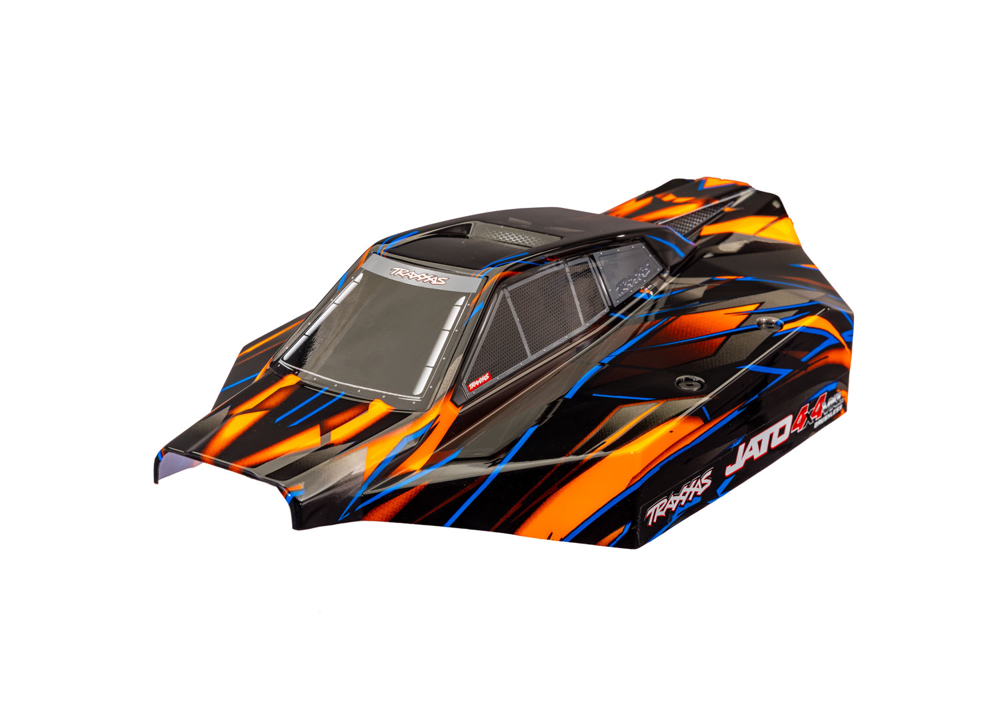 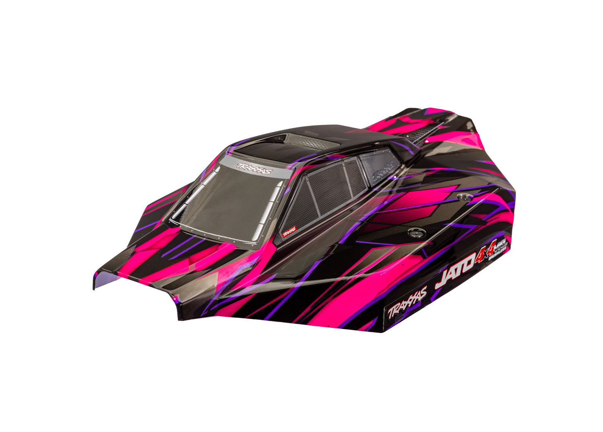&nbsp;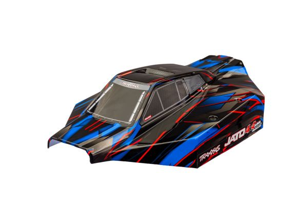 <em>green · orange · pink · blue</em> |

> **⚠️ CF chassis vs clipless bodies:** the chosen [CF chassis](chassis_analysis.md) **doesn't support the clipless body-latch system** that the Traxxas OEM Jato 4x4 bodies (9018 / 9060 family) rely on. To run an OEM body you'd have to **add body posts or drill mounting holes** for it. The **JConcepts P2 doesn't sidestep this**, there's nothing on the CF chassis sides to fasten hook and loop tape to, so it hits the same problem. **The fix either way is 3D printed mounts**, TPU or PETG, which is easy enough and cheaper than changing chassis. **So the clipless latches + hardware that ship with the OEM bodies are moot on this build**, don't count "includes clipless latches" as a plus here.

---

## Notes

- AliExpress wing mounting holes drilled with a reamer, use the grid pattern on the underside to locate the holes, then ream to size. Cleaner cut than a drill bit, less risk of cracking the nylon.
- Wing can also be zip-tied to the mount, works, but ghetto. Ream the holes properly.
- Reference: the K939 build uses the older Slash 4x4-style rear shock geometry, that platform has *not* had the rear-shock crash exposure problem the FastAzJato4x4 prototype hit with the Jato stock tower. **That exposure has since been designed out.** The rear shocks now mount ahead of the tower in the Slash position rather than hung off the back, so the tower leads and the shock sits behind it ([`shock_tower_analysis.md`](shock_tower_analysis.md)).
- **Red now, orange when this one dies.** The **5511A red** was bought because Jenny's RC had it cheap, not because it was the look. **Orange (5511T) is the more iconic Jato 3.3**, and red is the iconic [E-Revo](../ERevo_1.0/README.md) colour, so keeping the two trucks visually distinct is worth more than both leaning on the same one. No reason to replace a working body over it, so this is the plan for whenever the red one gets wrecked.

- **OG Jato 3.3 body (novelty look):** the genuine part is the **ProGraphix 5511R** (graphics pre-painted, main body clear, you spray any color you want) or the clear **5511**. The factory colors split two ways. **Sold as separate replacement bodies:** **red (5511A)**, **orange (5511T)**, plus **ProGraphix (5511R)** and **clear (5511)**. **RTR-only** (came on the complete **55077-3** truck, no standalone body part #): **blue** and **yellow**, which is why they only turn up as used take-offs. Note the RTR blue and yellow shells are **black-based with blue / yellow graphics**, so the "black" people remember is really the **accent scheme on those, not a solid-black body**; and the yellow here is a *Jato 3.3* (distinct from the green/black *Nitro Revo 3.3*). **Bought the red one** (5511A, delivered 2026-07-27) to try. So "colors" = spray any color on the 5511R, grab a red/orange separate body, or hunt a blue/yellow take-off off a parted-out truck.
- **Why the OG Jato 3.3 shell won it:** it drops the big buggy wing and uses a smaller, lighter body mount → less weight up high and a cleaner OG stadium-truck silhouette. The catch is the Jato 4x4's **tall front + rear shock towers**, this lower shell sits over them, so you'd cut clearance holes to let the towers + shock tops poke through. Done deliberately (grommeted/flared holes) that can read as an intentional custom look rather than a hack.
