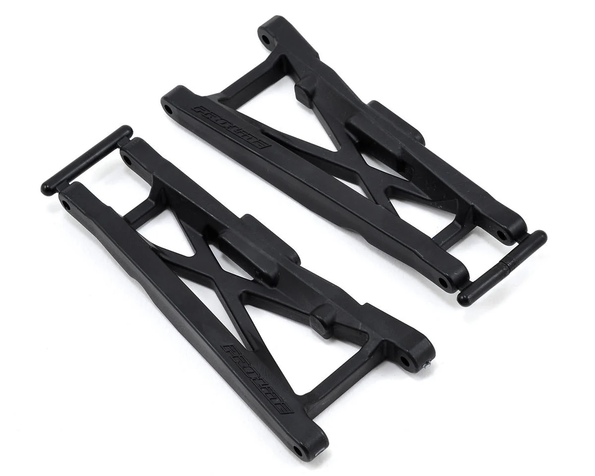

# Suspension Arm Selection — FastAzJato4x4

> **Chosen: FLM Extended Rear Arms FLM26800** — the only rear arm that extends the wheelbase ~10mm per side. That extra droop and width is the main reason this Jato competes against expensive purpose-built buggies. Metal arms normally transfer force to hinge pins and break other things, but these bend instead of snap — you pound them back into shape and you're still in the race. Extensively tested: lots of wrecks, sometimes bent, always reshaped and back on track. Makes the car feel super rigid, like a proper race car, at a fraction of buggy weight.

   
  <em>FLM Extended Rear Arms FLM26800 — $30, Made in USA</em>

---

## Table of Contents

- [Key Requirements](#key-requirements)
- [Arm Comparison](#arm-comparison) — 6 variants
- [Shock Guards](#shock-guards) — keeps debris out of drivetrain, crash protection
- [Notes](#notes)

---

## Key Requirements

| Requirement | Type | Why |
|---|---|---|
| **Fits Slash 4x4 / Jato 4x4 hinge pin + mount geometry** | Must | Has to bolt to the chosen CF chassis bulkheads + accept stock-pattern hinge pins, ball studs, shock mount points |
| **Handles 4S 1/10–1/8 class loads** | Must | Hard landings on the 1/8-buggy-class Jato chassis stress arms more than typical 1/10 SCT use |
| **Doesn't shatter on impact** | Must | Arms breaking mid-run is a tow-back; need ductile failure (bend / crack progressively) not catastrophic snap |
| **Reasonable wheelbase / track width** | Must | Extended arms increase wheelbase / track — affects body fit, drivetrain length (CVDs), and overall handling balance |
| **Stiff under cornering load** | May | Less arm flex = sharper steering response, but more flex = more impact compliance. Race vs basher trade |
| **Cheap / available** | May | Arms are top-3 most-broken parts on a hard-driven 4S build |
| **Front + rear both available** | May | Mixing-and-matching front vs rear from different vendors complicates geometry tuning |

---

## Arm Comparison

| Arm | Length / Material | Status | Pros / Cons | Photo / Link |
|---|---|---|---|---|
| **FLM26800** Extended wheelbase | CNC billet 6061 aluminum. Extended length: +~10mm wheelbase per arm. Pin-to-pin: 78.1mm / 82.55mm (adjustable width). Extra shock positions. Made in USA. $30.00 (list $40.00) | **Chosen** | Pro: **Only arm that extends the wheelbase** — ~10mm per side increases droop by a large margin, massive handling improvement. Makes the Jato feel like a proper race car vs expensive buggies at a fraction of the weight. **Cost math: bend it back 3 times and you've already saved money over buying shorter stock arms that snap more often.** Bends instead of snaps — still in the race, not stranded. Bending isn't common, and when it happens you can get back to near-stock geometry easily. Adjustable width, extra shock positions, USA-made CNC quality  Con: Strips bulkhead on hard impacts. Front tie rods and camber links snap — build runs Jato 3.3 ~60mm links all around, rear links hold fine. Rear only — front arms need a separate solution |  |
| **TRA3655X** Standard wheelbase OEM | Hardened plastic. 100mm × 45mm × 11.5mm. Front or rear. $10 (RC Superstore) | Candidate | Pro: **Will never go out of stock** — knock-offs from Remohobby, Hanqui 727, etc. feel and last the same as OEM. Effectively unlimited supply. $10, works front and rear  Con: Breaks more easily than EHD or FLM — brittle nylon snaps on hard hits. Stock length, no wheelbase extension |  |
| **TRA3655-BLK** Standard wheelbase HD | Proprietary composite. Stock length. Slash / Rustler / Stampede / Jato 4x4. $12.00. In stock AMain (Aug 2025) | Candidate | Pro: Current in-stock successor to discontinued TRA3655R. $12, available in black / blue / green / orange  Con: **Middle ground flex** — flexier than TRA3655X OEM, stiffer than RPM. Stock length — no wheelbase extension |  |
| **TRA3655** Standard wheelbase original | Original nylon. Stock length. $9.99 (discontinued at AMain — still findable elsewhere) | Candidate | Pro: **Stiffest plastic arm overall** — stiffer than TRA3655X. First choice for a standard Slash race build. Still physically available, just not stocked at AMain  Con: Harder to source than TRA3655X. Stock length — no wheelbase extension vs FLM26800 |  |
| ~~**TRA3655R** Standard wheelbase HD~~ | Proprietary composite with flex additive. Stock length. Front/rear 4x4, rear 2WD. $12.00 | Ruled Out | Pro: Stronger than OEM TRA3655X — proprietary composite flexes instead of snapping, works cold weather. $12  Con: **Discontinued online** — AMain lists it as discontinued. Same length as OEM, no wheelbase extension |  |
| ~~**PRO6082-01** ProTrac standard wheelbase~~ | Nylon. Front + rear in one set (usable either position). Fits Slash 4x4 / Stampede 4x4 with ProTrac kit. $13.75 | **Ruled Out** | Pro: Ideal arm — would be the first choice if available. Front + rear covered by one part number. $13.75 for a set  Con: **Discontinued — unobtanium.** Can't source replacements for a race car. No point building around a part you can't replace when it breaks |  |
| ~~**RPM80702** Standard wheelbase~~ | Flexible nylon compound | Vetoed | Pro: Great for bashing — flexibility absorbs impacts instead of snapping. Won't break  Con: **Most flexible** — flex transfers load into driveshafts. Thinner CVDs (e.g. Tekno) and custom axles will bend; only E-Revo CVDs (double Tekno thickness) survive. **Warps from just sitting in storage** — unacceptable for a race car. Loses the rigid feel the FLM arms deliver |  |

---

## Shock Guards

Plastic guards that mount around the arm / drivetrain area. Keep dirt, grass, and debris out of the driveshafts mid-run, and provide light crash protection on the lower chassis. Lightweight — the main value is protection, not structure.

| Guard | Status | Pros / Cons | Photo / Link |
|---|---|---|---|
| **TRA6732** Front Arm Guards | **Chosen** | Pro: $9.95. **No front bumper on this build — front shocks and arms are exposed. These are essential.** Protects shocks and arms from frontal impacts, including accidental contact with other cars on track. Shields against debris kicked up by the car in front. Keeps grass out of driveshafts. Composite, lightweight. Includes all hardware. Fits Slash 4x4 even though listed for Stampede 4x4. Also fits RPM arms  Con: Adds a tiny amount of weight — negligible in practice since it's plastic |  |
| **TRA6733** Rear Arm Guards | **Chosen** | Pro: $7.00. Same composite construction as front. Shields rear driveline from dirt and rocks being thrown up into it. In stock at HobbyTown  Con: Adds a tiny amount of weight — negligible in practice since it's plastic |  |

---

## Notes

- **OEM vs EHD trade**: stiffer = more precise but more breakable; flexier = more durable but slightly vaguer steering feel. The classic plastic-formulation trade-off — same physics as the [shock tower aluminum-vs-composite discussion](shock_tower_analysis.md#material-properties-reference) but with two flavors of plastic instead of two materials.
- **Arms as the intended fuse:** on this build the design intent is that **arms give way first**, before the chassis or other expensive parts. The FLM extended arms (bendable, reshape-able) are perfect for that role — they take the hit, get bent back close to spec, and the car keeps driving. The CF chassis and the rest of the drivetrain are protected by the arms acting as the sacrificial layer. See [`chassis_analysis.md`](chassis_analysis.md#notes) for how this informs the chassis durability expectation and [`bumper_analysis.md`](bumper_analysis.md#notes) for why the minimal-bumper choice is acceptable given this hierarchy.
- **Why aluminum arms aren't in this analysis**: arms see large bending loads on landings. Aluminum arms transfer those loads to the chassis mounts / bulkheads (same failure-cascade logic as the [shock tower analysis](shock_tower_analysis.md#material-properties-reference)), and even when they don't break they bend permanently and throw geometry off. Plastic arms — both OEM and EHD — are the right material for the role.
- **Flex stiffness hierarchy** (stiffest to most flexible): FLM26800 aluminum → TRA3655 original (discontinued) → TRA3655X OEM → TRA3655-BLK HD → RPM (vetoed — warps from storage).
- **Front-rear matching**: keep front and rear arms in the same family / generation if possible. Mixing stock-length OEM front with FLM extended rear changes geometry intentionally; mixing stiff fronts with flex rears unintentionally couples handling feel to terrain in ways that are hard to tune out.
- **CVD compatibility**: the chosen E-Revo CVDs are already chopped to fit the FastAzJato4x4. Changing arm length (FLM extended rear, for example) may re-affect CVD length — verify before finalizing.
