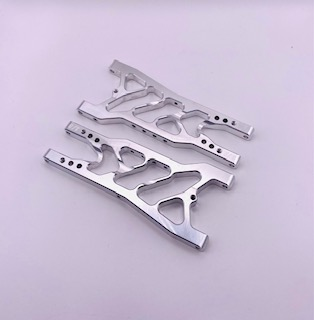
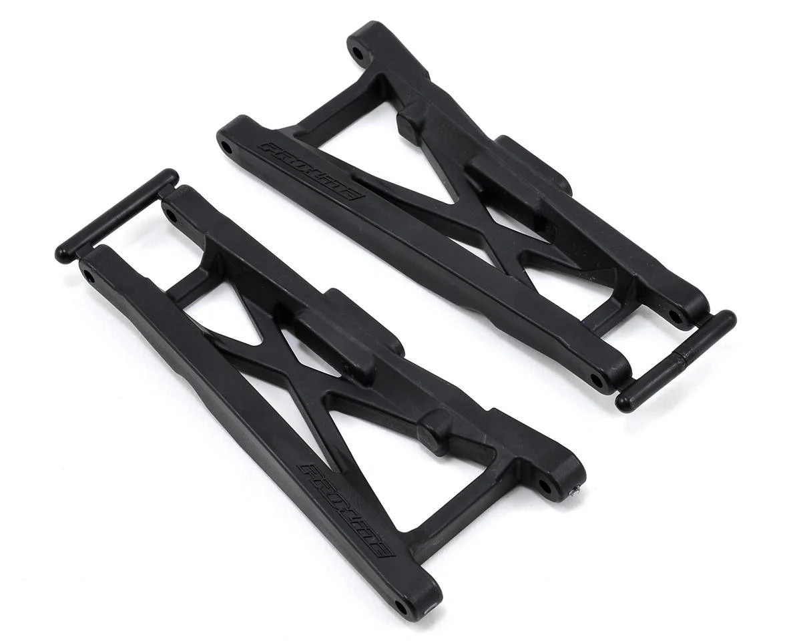
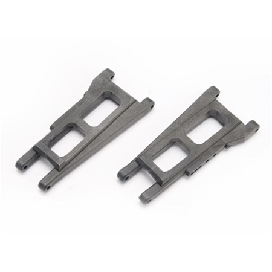
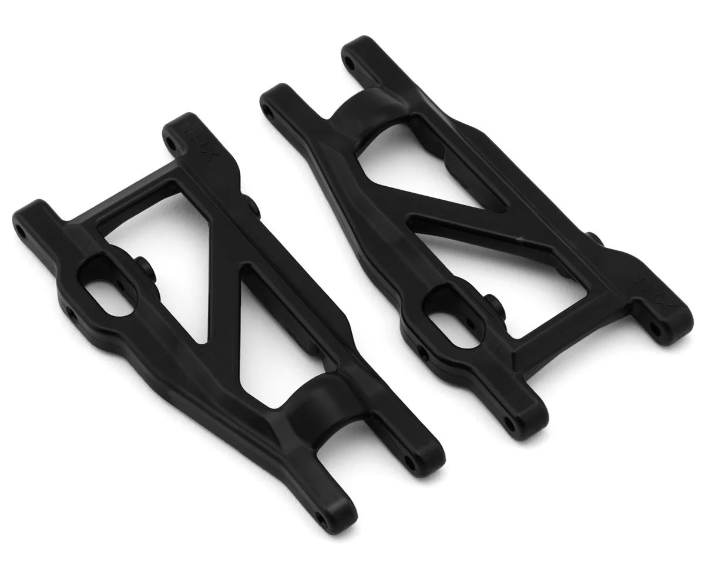
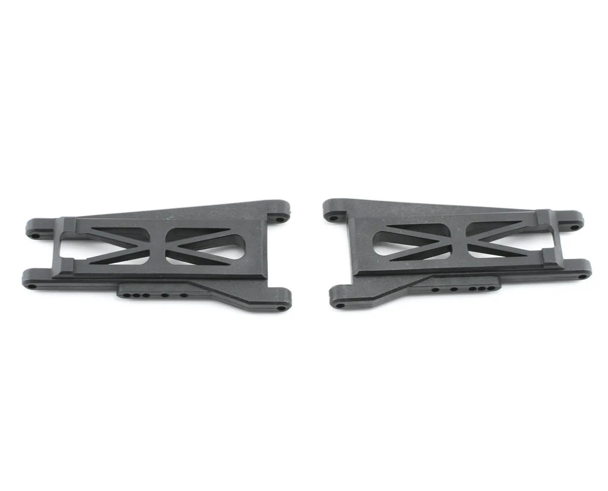
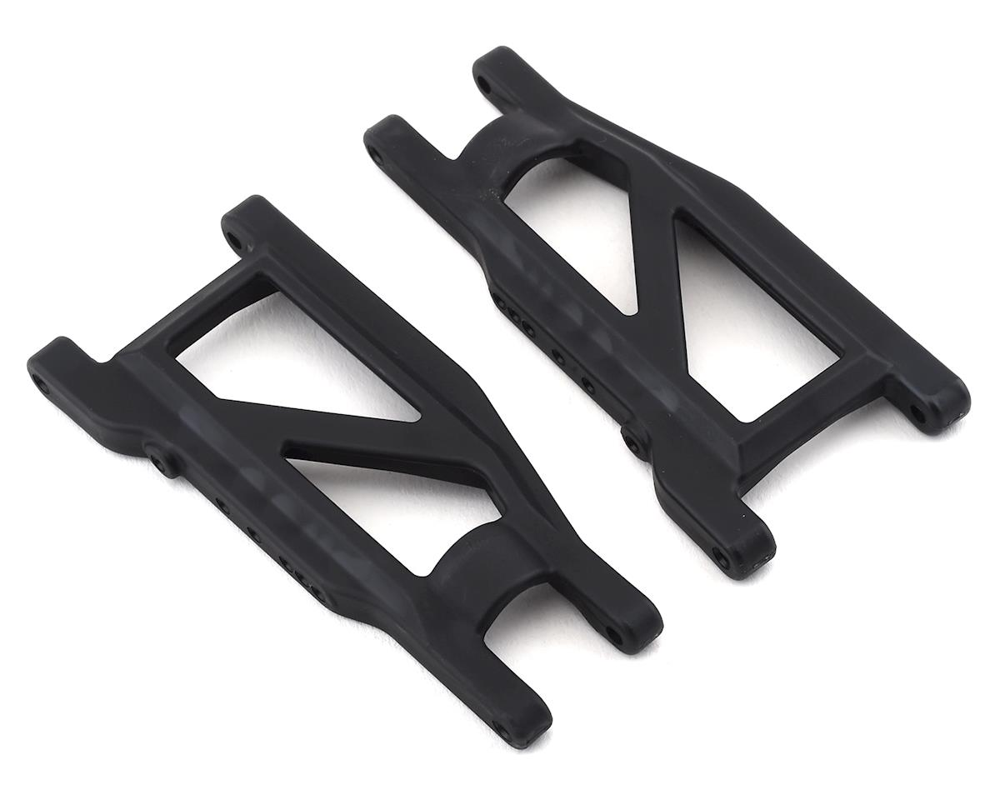
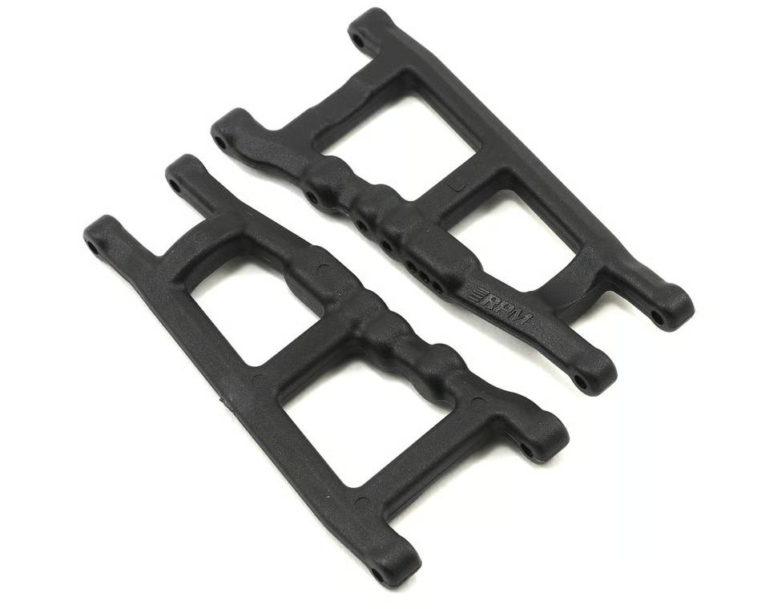
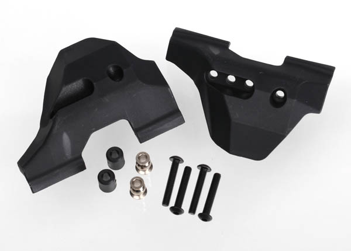
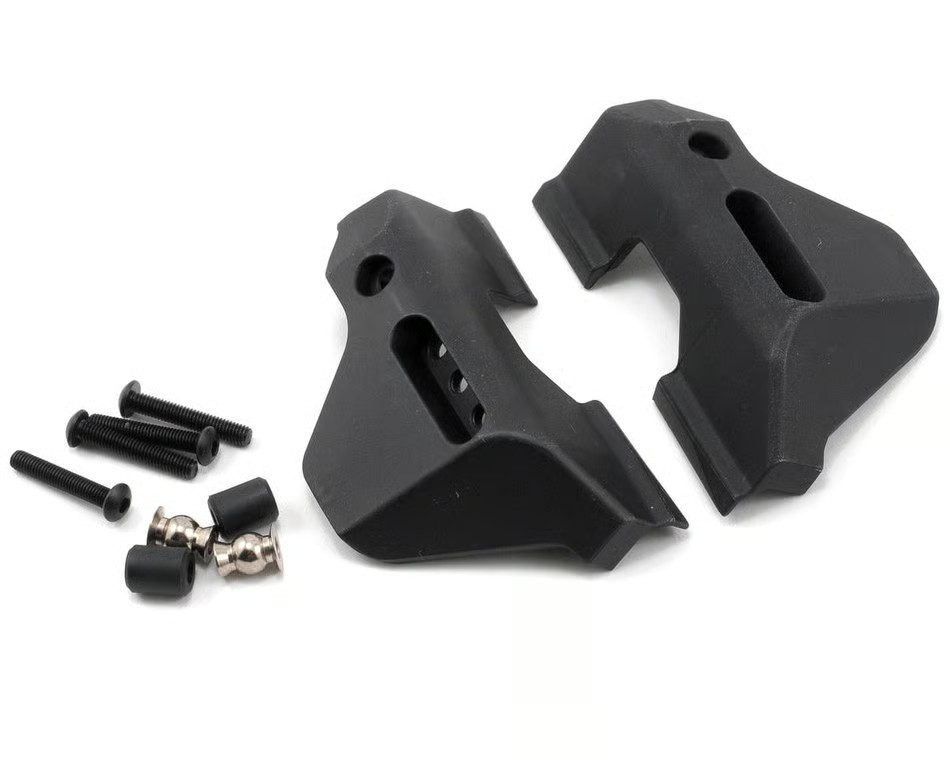

# Suspension Arm Selection — FastAzJato4x4

> **Ideal: FLM26800 front + PRO6082-01 rear** — FLM aluminum up front for stiffness and maximum impact resistance, ProTrac plastic in the rear for the same ~10mm wheelbase extension without bulkhead stripping. Both extend wheelbase equally. ProTrac is discontinued so FLM26800 runs both ends until one is sourced. Metal arms normally transfer force to hinge pins and break other things, but these bend instead of snap — you pound them back into shape and you're still in the race. Extensively tested: lots of wrecks, sometimes bent, always reshaped and back on track. Makes the car feel super rigid, like a proper race car, at a fraction of buggy weight.

   
  <em>FLM Extended Rear Arms FLM26800 — $30, Made in USA</em>

---

## Table of Contents

- [Key Requirements](#key-requirements)
- [Arm Comparison](#arm-comparison) — 6 variants
- [Shock Guards](#shock-guards) — keeps debris out of drivetrain, crash protection
- [Notes](#notes)

---

## Key Requirements

| Requirement | Type | Why |
|---|---|---|
| **Fits Slash 4x4 / Jato 4x4 hinge pin + mount geometry** | Must | Has to bolt to the chosen CF chassis bulkheads + accept stock-pattern hinge pins, ball studs, shock mount points |
| **Handles 4S 1/10–1/8 class loads** | Must | Hard landings on the 1/8-buggy-class Jato chassis stress arms more than typical 1/10 SCT use |
| **Doesn't shatter on impact** | Must | Arms breaking mid-run is a tow-back; need ductile failure (bend / crack progressively) not catastrophic snap |
| **Reasonable wheelbase / track width** | Must | Extended arms increase wheelbase / track — affects body fit, drivetrain length (CVDs), and overall handling balance |
| **Stiff under cornering load** | May | Less arm flex = sharper steering response, but more flex = more impact compliance. Race vs basher trade |
| **Cheap / available** | May | Arms are top-3 most-broken parts on a hard-driven 4S build |
| **Front + rear both available** | May | Mixing-and-matching front vs rear from different vendors complicates geometry tuning |

---

## Arm Comparison

> *Spec format: Type · Material · Position · Fits · Wheelbase · Pivot/Hardware · Stiffness · Toe · Origin · Weight · Price*

| Arm | Spec | Pros / Cons | Photo / Link |
|---|---|---|---|
| ⭐ **FLM26800** Extended wheelbase — *front* | **Type:** Extended wheelbase **Material:** **6061 aluminum CNC** **Position:** Front **Fits:** Slash 4x4 / Jato 4x4 pattern **Wheelbase:** **102mm arm (vs 92mm stock) → +~10mm/arm** **Pivot/Hardware:** Adjustable width, extra shock positions **Stiffness:** N/A **Toe:** N/A **Origin:** Made in USA **Weight:** N/A **Price:** **$30** ($40 list) | Pro: **Extends wheelbase ~10mm per side** — increases droop by a large margin, massive handling improvement. Makes the Jato feel like a proper race car vs expensive buggies at a fraction of the weight. **Cost math: bend it back 3 times and you've already saved money over buying shorter stock arms that snap more often.** Bends instead of snaps — still in the race. Bending isn't common, reshapes to near-stock easily  Con: Metal arm trade-off knowingly accepted for the wheelbase gains. Strips bulkhead and snaps front tie rods and camber links on hard hits (front needs 4mm rod upgrade, rear is fine with stock M3 Jato 3.3 rods) |  |
| ⭐ **PRO6082-01** ProTrac extended wheelbase — *rear (discontinued; source when available)* | **Type:** Extended wheelbase **Material:** Nylon **Position:** Front + rear set **Fits:** Slash 4x4 / Jato 4x4 pattern **Wheelbase:** **+~10mm/arm** **Pivot/Hardware:** N/A **Stiffness:** N/A **Toe:** N/A **Origin:** N/A **Weight:** N/A **Price:** $13.75 | Pro: **Ideal rear arm** — same wheelbase extension as FLM, rear sees less stress so plastic is fine. No bulkhead stripping. Front + rear in one set  Con: Snaps on hard hits rather than bending back. **Discontinued** — hard to find |  |
| 🔵 **TRA3655X** Standard wheelbase OEM | **Type:** Standard wheelbase **Material:** Hardened plastic **Position:** Front or rear **Fits:** Slash 4x4 / Jato 4x4 pattern **Wheelbase:** Standard **Pivot/Hardware:** N/A **Stiffness:** N/A **Toe:** N/A **Origin:** N/A **Weight:** N/A **Price:** $10 | Pro: **2nd stiffest overall — the stiffest plastic arm** (only the FLM aluminum beats it). **Will never go out of stock** — knock-offs from Remohobby, Hanqui 727 feel and last the same as OEM. Effectively unlimited supply. Works front and rear  Con: Brittle nylon snaps on hard hits. No wheelbase extension |  |
| 🔵 **TRA3655-BLK** Standard wheelbase HD | **Type:** Standard wheelbase **Material:** HD composite **Position:** Front or rear **Fits:** Slash 4x4 / Jato 4x4 pattern **Wheelbase:** Standard **Pivot/Hardware:** N/A **Stiffness:** N/A **Toe:** N/A **Origin:** N/A **Weight:** N/A **Price:** $12 | Pro: In-stock successor to TRA3655R. Available in multiple colors  Con: **Middle ground flex** — flexier than TRA3655X, stiffer than RPM. No wheelbase extension |  |
| 🔵 **TRA3655** Standard wheelbase original | **Type:** Standard wheelbase **Material:** Original nylon **Position:** Front or rear **Fits:** Slash 4x4 / Jato 4x4 pattern **Wheelbase:** Standard **Pivot/Hardware:** N/A **Stiffness:** N/A **Toe:** N/A **Origin:** N/A **Weight:** N/A **Price:** $9.99 | Pro: **Stiff plastic — just behind the TRA3655X.** Still a solid choice for a standard Slash race build, still physically available  Con: Harder to source — discontinued at AMain. No wheelbase extension |  |
| 🚫 ~~**TRA3655R** Standard wheelbase HD~~ | **Type:** Standard wheelbase **Material:** HD composite **Position:** Front or rear **Fits:** Slash 4x4 / Jato 4x4 pattern **Wheelbase:** Standard **Pivot/Hardware:** N/A **Stiffness:** N/A **Toe:** N/A **Origin:** N/A **Weight:** N/A **Price:** $12 | Pro: Flexes instead of snapping, works cold weather  Con: **Discontinued online** — AMain lists as discontinued. No wheelbase extension |  |
| ❌ ~~**RPM80702** Standard wheelbase~~ | **Type:** Standard wheelbase **Material:** Flexible nylon **Position:** Front or rear **Fits:** Slash 4x4 / Jato 4x4 pattern **Wheelbase:** Standard **Pivot/Hardware:** N/A **Stiffness:** N/A **Toe:** N/A **Origin:** N/A **Weight:** N/A **Price:** N/A | Pro: Great for bashing — won't break  Con: **Most flexible** — flex transfers load into driveshafts. Only E-Revo CVDs (double Tekno thickness) survive. **Warps from just sitting in storage** — unacceptable for racing |  |

---

## Shock Guards

Plastic guards that mount around the arm / drivetrain area. Keep dirt, grass, and debris out of the driveshafts mid-run, and provide light crash protection on the lower chassis. Lightweight — the main value is protection, not structure.

> *Spec format: Part · Material · Position · Fits · Weight · Price*

| Guard | Spec | Pros / Cons | Photo / Link |
|---|---|---|---|
| ⭐ **TRA6732** Front Arm Guards | **Part:** TRA6732 **Material:** Composite, lightweight **Position:** Front **Fits:** Slash 4x4 (listed for Stampede 4x4); also RPM arms **Weight:** N/A **Price:** **$9.95** | Pro: **No front bumper on this build — front shocks and arms are exposed. These are essential.** Protects shocks and arms from frontal impacts, including accidental contact with other cars on track. Shields against debris kicked up by the car in front. Keeps grass out of driveshafts. Includes all hardware  Con: Adds a tiny amount of weight — negligible in practice since it's plastic |  |
| ⭐ **TRA6733** Rear Arm Guards | **Part:** TRA6733 **Material:** Composite **Position:** Rear **Fits:** Slash 4x4 / Jato 4x4 pattern **Weight:** N/A **Price:** **$7.00** | Pro: Same composite construction as front. Shields rear driveline from dirt and rocks being thrown up into it. In stock at HobbyTown  Con: Adds a tiny amount of weight — negligible in practice since it's plastic |  |

---

## Notes

- **OEM vs EHD trade**: stiffer = more precise but more breakable; flexier = more durable but slightly vaguer steering feel. The classic plastic-formulation trade-off — same physics as the [shock tower aluminum-vs-composite discussion](shock_tower_analysis.md#material-properties-reference) but with two flavors of plastic instead of two materials.
- **Arms as the intended fuse:** on this build the design intent is that **arms give way first**, before the chassis or other expensive parts. The FLM extended arms (bendable, reshape-able) are perfect for that role — they take the hit, get bent back close to spec, and the car keeps driving. The CF chassis and the rest of the drivetrain are protected by the arms acting as the sacrificial layer. See [`chassis_analysis.md`](chassis_analysis.md#notes) for how this informs the chassis durability expectation and [`bumper_analysis.md`](bumper_analysis.md#notes) for why the minimal-bumper choice is acceptable given this hierarchy.
- **Flex stiffness hierarchy** (stiffest to most flexible): FLM26800 aluminum → **TRA3655X OEM (stiffest plastic, 2nd overall)** → TRA3655 original (discontinued) → TRA3655-BLK HD → RPM (vetoed — warps from storage).
- **Front-rear matching**: keep front and rear arms in the same family / generation if possible. Mixing stock-length OEM front with FLM extended rear changes geometry intentionally; mixing stiff fronts with flex rears unintentionally couples handling feel to terrain in ways that are hard to tune out.
- **CVD compatibility**: the chosen E-Revo CVDs are already chopped to fit the FastAzJato4x4. The custom front axle (90.5mm end-to-end) is sized for the **102mm FLM extended arm** (vs 92mm stock), which widens the track ~10mm/side. Changing arm length re-affects the axle length — verify against [`driveshaft_analysis.md`](driveshaft_analysis.md#measured-lengths-prototype) before finalizing.

