# Battery Selection — FastAzJato4x4

> **Chosen: Gens Ace Redline 2.0 4S HV 6000mAh**, a pair bought 2026-08-31 at $92.26 each. The spec this car buys to is a **4S hardcase shorty**, and on that shortlist the Gens Ace is both the lightest at **410g** and among the cheapest, which is the combination that decides it. The **Zeee 5200 soft case is still what's physically in the car** until the swap happens, and it no longer meets the hardcase rule.

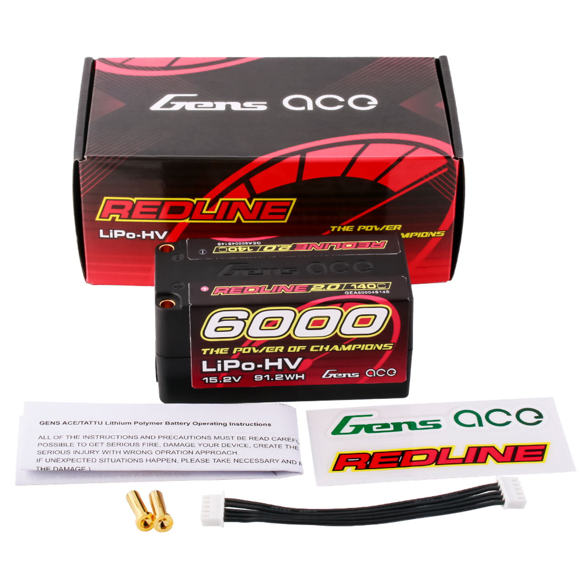 <em>Gens Ace Redline 2.0, 6000mAh 15.2V, 91.2Wh, 410g, 98 × 47 × 47mm</em>

## Table of Contents

- [Key Requirements](#key-requirements) — what this car needs, and where it split from Mike's
- [Battery tray fit check](#battery-tray-fit-check) — measured envelope against every candidate
- [Pack comparison](#pack-comparison) — every 4S pack considered, owned or not
- [The C-rating math](#the-c-rating-math-a-fun-sanity-check) — why the C number on the label is fiction
- [Notes](#notes) — the reasoning that actually decides purchases
---

## Key Requirements

> **This car specs independently of [Mike's Jato 4x4](../Jato4x4_Mike/README.md).** His car runs a different setup and is not a constraint on this one. Nothing is stranded by that: **shorties fit his car too**, so any pack bought to this spec can run on either truck, while his full length packs stay on his.
>
> **Sharing still works one way: shorties fit Mike's car too.** So anything bought to this car's spec can go in either truck, while Mike's full length packs stay on his car. Buy shorty, keep both trucks fed. **Height isn't a blocker there either**, Mike runs a **3D printed battery bar** that clears the taller packs, so even the 47mm Gens Ace shorty goes in his car.

| Requirement | Type | Why |
|---|---|---|
| **4S** | Must | The MAX10 G2 + 3665SD 2400KV combo is geared and tuned for 4S. **3S would honestly still be quick** on this light a car, 4S is the fun call rather than a necessity, but the gearing is set for it so 4S it is |
| **Not a standard full length pack** | Must | **This is a layout rule, not a weight one.** The **RX box sits on the battery side** of this chassis, and the battery needs to sit **centred** rather than pushed to one end, so a full length 4S brick at 138 to 160mm cannot be placed where it has to go. Any shorty-class pack is fair game, including the odd ones |
| **4S2P construction** | May | The reason the weird shorties got interesting in the first place. **Shorty 4S packs are usually 4S2P** (eight cells, two paralleled per series group) where full length packs are 4S1P (four cells). **Two cells in parallel roughly halve internal resistance**, so the pack sags less under load, and that difference is noticeable in feel, not just on paper |
| **About 96mm, 98mm at the outside** | May | The preference within that. **96 × 47mm is the standard shorty footprint** and 98mm is as long as I would rather go, which covers most of the table. The **~106mm long shorties (Team Orion, Performa) are still maybes**, just past where I would like to be, and the Orion earns the look by being the lightest pack found |
| **Hard case** | Must | Upgraded from a preference. **The sand at Meldrum chafes soft packs**, grit gets into the tray and works at the shrink wrap, so the hard shell earns its slightly higher weight |
| **420 to 530g** | Must | **A window, not a floor.** Over roughly **580g is too heavy**; the 573g Zeee 6000 soft pack is the one that proved it. **Too light is its own problem**: the car goes odd in the air, motor torque starts steering it on a jump. The pack running now sits at **518g**, inside the band |
| **Smaller than 163 × 50 × 45mm** (L × W × H) | Must | This car's actual envelope. Length is the easy one, nothing here comes close to 163mm. **Width is 50mm for a hard case and about 51mm for a soft one**, since a soft pack squeezes in and a hard one won't. **45mm is the height limit, though the 47mm HCL-HP did get squished in** |
| **HV (15.2V)** | May | Nice to have, not required. Higher voltage means more top speed, and the chargers all do LiHV ([`charger_analysis.md`](charger_analysis.md)), but a standard 14.8V pack is perfectly welcome |
| **5000mAh and up** | May | Run time preference, not a rule, and it moved up with the shorty spec. **Capacity is a poor proxy for weight**, the 6000s here undercut several 5000s, so the gram figure decides rather than the mAh. Everything shortlisted now lands between 5000 and 6400 |
| **Under 40mm tall, 35mm ideal** | May | **This is the sharing limit, not this car's limit**, and it is now soft. At **35mm the standard battery bar works** on Mike's car, and taller needs a 3D printed bar, **which Mike has**, so height no longer keeps a pack off his truck. Lower is still better for CG |
| **Connector matches the ESC** | May | Match the MAX10 G2 connector or adapt |

---

## Battery tray fit check

**This car runs the [AliExpress CF LCG chassis](chassis_analysis.md) with its aluminium battery holder and straps, so height is effectively not a limit.** A strapped pack on a CF deck isn't boxed in by a moulded tray the way a stock truck is, and a taller body sits over it. Every candidate here measures 47 to 50.5mm tall, and the 47mm HCL-HP already went in, so **stop treating height as the thing that decides a pack**.

**Length is the real constraint, and it comes from the RX box.** The receiver box sits on the battery side of this chassis and the pack has to sit centred, so the space either side of it is fixed. **That's why a shorty has to actually be a shorty**, not a full length brick reworded. Length is the one dimension worth measuring carefully before buying.

**Reference numbers for a stock truck**, kept because they're useful and because they're [Mike's tray](../Jato4x4_Mike/README.md): stock Jato 4x4 plastic tray is **~160.23 × 50 × ~35mm** caliper-measured, roughly **40mm** of height if squeezed, and about **163 × 50 × 40mm** once opened up with a printed battery bar. Published pack dimensions often don't line up with a caliper reading anyway, since makers differ on whether wire exit, plug, case lip or shrink wrap are included, so **measure the pack the same way you measured the tray**.

> The column below is kept against the stock numbers as the conservative reference. On this car the height flags don't apply, only the length ones.

| Pack | L × W × H | Length (<163) | Width (50, 51 soft) | Height (45 max, 35 ideal) | Verdict |
|---|---|---|---|---|---|
| **CNHL Lightning 5500 LiHV** | 149 × 51 × 31 | ✅ 14mm spare | ⚠️ 51, soft so it squeezes | ✅ **31mm, clears 35 easily** | **Best fit here.** Only pack under 35mm, so it takes the standard bar on Mike's truck too |
| **CNHL G+Plus 5000** | 147 × 51 × 34 | ✅ 16mm spare | ⚠️ 51, soft so it squeezes | ✅ 34mm, under 35 | Clears everything, standard bar works |
| **CNHL Black Series 5000** | 147 × 51 × 35 | ✅ 16mm spare | ⚠️ 51, soft so it squeezes | ✅ 35mm, exactly at the ideal | Clears everything, standard bar works |
| **CNHL Ultra-Thin 6000 LiHV** | 138 × 47 × 37 | ✅ 25mm spare | ✅ **3mm spare, only hardcase with real margin** | ✅ 37 < 45, over 35 so needs the printed bar to share | Fits this car outright, needs the printed bar for Mike's |
| **CNHL Racing 5200 90C** | 160 × 45 × 37 | ⚠️ **3mm spare** | ✅ 5mm spare | ✅ 37 < 45, printed bar to share | Tightest on length of anything here |
| ~~HCL-HP 5200~~ | 139 × 49 × 47 | ✅ 24mm spare | ✅ 1mm spare | ❌ **47, over the 45 limit** (was squished in) | Ruled out on weight anyway at 558g |
| ~~PowerHobby 4200 HV~~ | 89 × 44 × 32.4 | ✅ 74mm spare | ✅ 6mm spare | ✅ 32.4mm | Fits easily. Ruled out on weight at 301g |
| **Gens Ace Redline 2.0 6000 HV** | 98 × 47 × 47 | ✅ 62mm spare | ✅ 3mm spare | ⚠️ **47, over the 45mm limit** | **The only true shorty here.** 2mm over this car's height limit, but the 47mm HCL-HP was squished in before, so it is likely fine here and **definitely too tall for Mike's stock tray** |
| **CNHL Racing 6000 shorty HV** | 97 × 47.5 × 47.5 | ✅ 63mm spare | ✅ 2.5mm spare | ⚠️ **47.5, over the 45mm limit** | Same height story as the Gens Ace, 2.5mm over with the 47mm HCL-HP precedent |
| **Team Orion V-Max-HV 6000** | 106.4 × 46.4 × 50.5 | ✅ 54mm spare | ✅ 3.6mm spare | ⚠️ **50.5, the tallest here** | Fits the tray on every axis, but it is not a shorty and it is the tallest |
| **Team Exalt X-Rated 6000** | 98 × 47 × 47 | ✅ 62mm spare | ✅ 3mm spare | ⚠️ **47, matches the proven squeeze** | Identical box to the Gens Ace |
| **Fido Fi58130 5800 shorty HV** | 96 × 47 × 47 | ✅ 64.5mm spare | ✅ 3mm spare | ⚠️ **47, matches the proven squeeze** | Same box as the Tekin, half the price |
| **Maclan Graphene V4 6400** | 99 long × 48.2 thick, 🚧 width TBD | ✅ 61.5mm spare | 🚧 unknown | ⚠️ **48.2** | Width unpublished, so the fit cannot be confirmed |
| **HobbyStar 5000 shorty** | 95 × 47 × 47 | ✅ 65.5mm spare | ✅ 3mm spare | ⚠️ **47, matches the proven squeeze** | Shortest pack of the lot |
| **Tekin Graphene 6300 shorty** | 96 × 47 × 47 | ✅ 64.5mm spare | ✅ 3mm spare | ⚠️ **47, matches the proven squeeze** | Ties the Gens Ace, and gets there without rotating |
| **PowerHobby 5600 shorty HV** | 96 × 47 × 48 | ✅ 64.5mm spare | ✅ 3mm spare | ⚠️ **48, one past the precedent** | Shortest of the lot, same height as the ProTek |
| **ProTek Si-Graphene 6400 shorty** | 98.5 × 47 × 48 | ✅ 61.5mm spare | ✅ 3mm spare | ⚠️ **48, one past the precedent** | Middle of the three on height, 3mm over the 45mm limit |
| **GAONENG GNB 6300 shorty HV** | 97 × 47 × 50, **or 97 × 50 × 47 rotated** | ✅ 63mm spare | ⚠️ 50 rotated, **exactly the hardcase limit** | ⚠️ **47 rotated**, matching the proven squeeze | **Rotating it trades the height problem for a width one.** On its side it drops to 47mm tall, the same as the Gens Ace, at the cost of zero width slack |
| Zeee 5200 100C (running) | 🚧 TBD | — | — | — | Measure the pack that's already in the car |

**What this settles:** with the limits corrected, **width and length rule nothing out**. The three 51mm packs are all soft case and squeeze in, and nothing is near the 163mm length ceiling except the Racing 5200 at 160mm.

**Height is what separates them.** The **Lightning at 31mm, G+Plus at 34mm and Black Series at 35mm** clear the 35mm mark, so they take the standard battery bar on Mike's truck as well. The **Ultra-Thin and Racing at 37mm** fit this car fine but need the printed bar to share. Only the HCL-HP at 47mm actually breaks the 45mm limit, and it's out on weight regardless.

**The Ultra-Thin 6000 is still the standout**, the only hardcase with real width margin, 479g against the 518g running now, and 800mAh more. The **Lightning 5500 is the better fit on paper** at 31mm and 472g, at the cost of being soft case on a sandy track.

---

## Pack comparison

> *Spec format: Cells · Capacity · C-rating · Weight · Connector · Size · Price*

| Pack | Spec | Pros / Cons | Photo / Link |
|---|---|---|---|
| 🟢 **Zeee 4S 5200mAh 100C (EC5), soft case** — *fitted now, but soft case, so it fails the current spec* | **Cells:** 4S / 14.8V **Capacity:** **5200mAh** **C-rating:** 100C (marketing, see note) **Weight:** **518g** **Connector:** **EC5** **Size:** soft case, verify vs CF tray **Price:** **$102.99 / 2-pack ($51.50 each)**, Amazon | Pro: **518g, inside the weight window**, soft case, EC5, sold in matched pairs. Running these. At **$51.50 a pack** it's a couple of dollars under the CNHLs and well under the name brands, so still the cheap end, just not the bargain 'cheap 2-packs' implied  Con: The 100C is a marketing number (see C note), but it pushes plenty for the 140A ESC either way |  |
| 🟢 **CNHL Ultra-Thin Racing LiHV 6000mAh 4S 120C (EC5), hardcase** — *owned, now on Mike's Jato, 138mm is not a shorty* | **Cells:** 4S1P / **15.2V LiHV** **Capacity:** 6000mAh (91.20Wh) **C-rating:** 120C / 240C burst (marketing, see note) **Weight:** **479g** **Connector:** **EC5**, 10AWG leads **Size:** **138 × 47 × 37mm** hardcase (37mm is the selling point) **Price:** ✅ **$71.00 paid** 2026-08-26 (list $72.99, WELCOME code; pre-order, ~7 days) **Stock #:** HC6001204HV | Pro: **Breaks the "6000 is too heavy" rule**, at **479g it's lighter than the running Zeee 5200 soft (518g)** and 94g under the Zeee 6000 (573g), so it's more capacity for *less* weight than what's in the car now. **Ultra-thin 37mm hardcase** helps in a tight CF tray, native EC5, hardcase impact protection, HV 15.2V adds top speed like the Gens Ace  Con: **Priciest CNHL of the bunch.** **LiHV, needs HV charge mode** (all on-hand chargers do it) and 17.4V hot off the charger. **Verify 138 × 47 × 37mm against the CF tray and strap** on arrival. Bought, no run data yet |  |
| 🟢 **CNHL Lightning LiHV 5500mAh 15.2V 4S 120C (EC5), soft case** — *owned, now on Mike's Jato* | **Cells:** 4S / **15.2V LiHV** **Capacity:** 5500mAh (top of the window) **C-rating:** 120C / 240C burst (marketing, see note) **Weight:** **472g** **Connector:** **EC5**, 10AWG leads **Size:** **149 × 51 × 31mm** soft case **Balance:** JST-XHP-5P **Price:** ✅ **$54.46 paid** 2026-08-26 (list $55.99, WELCOME code) **Stock #:** HV5501204EC5 | Pro: **The lightest pack in this table at 472g**, 46g under the running Zeee 5200 while carrying 300mAh more, and 7g under the Ultra-Thin 6000. **Only 31mm tall**, thinner than the pack CNHL markets as "ultra-thin" (37mm). HV 15.2V for the top-speed gain, native EC5, 10AWG  Con: **149mm long × 51mm wide**. It buys its thinness with footprint, so check length and width against the CF tray, not just height. **Soft case** (no impact shell). LiHV, needs HV charge mode. **Was the last unit in stock**, so it's a one-off, if it wins the test it may not be re-buyable. Bought, awaiting arrival |  |
| 🟢 **CNHL Racing Series 5200mAh 4S 90C (EC5), soft case** — *owned, now on Mike's Jato* | **Cells:** 4S1P / 14.8V **Capacity:** **5200mAh** **C-rating:** 90C / 180C burst (marketing, see note) **Weight:** **524g** **Connector:** **EC5**, 10AWG leads **Size:** **160 × 45 × 37mm** soft case **Balance:** JST-XH **Price:** ✅ **$52.51 paid** 2026-08-26 (list $53.99, WELCOME code) **Stock #:** 520904EC5 | Pro: **Exactly the 5200 target**, native EC5, standard 14.8V so no HV charger needed, cheapest of the CNHL 4S line. Straight swap for the Zeee 5200  Con: **524g. The heaviest CNHL here, and 6g heavier than the Zeee 5200 it would replace.** Both LiHV packs carry more capacity for ~50g less, so paying less here costs weight. **160mm long**, the longest of the three, check it against the CF tray. Soft case. Bought, awaiting arrival |  |
| 🔵 **CNHL G+Plus 5000mAh 4S 70C (EC5)** — *the light standard LiPo, graphene* | **Cells:** 4S / 14.8V **Capacity:** 5000mAh **C-rating:** 70C continuous / 140C burst (marketing) **Weight:** **491g** (±5g) **Connector:** **EC5**, JST-XH balance, 10AWG **Size:** **147 × 51 × 34mm** **Price:** **$54.99** | Pro: In the window, native EC5, standard 14.8V  Con: No published weight or dimensions, and it costs $1 more than the Black Series 5000 for 5C more. **6 units left**. Untested | &nbsp; <em>pack · dimensions and weight</em> |
| 🔵 **CNHL Black Series 5000mAh 4S 65C (EC5)** — *plain LiPo, 35mm tall* | **Cells:** 4S / 14.8V **Capacity:** **5000mAh** **C-rating:** 65C continuous / 130C burst (marketing) **Weight:** **521g** (±5g) **Connector:** **EC5**, JST-XH balance, 10AWG **Size:** **147 × 51 × 35mm** **Price:** **$53.99** | Pro: **In the capacity window**, standard 14.8V so no HV charger needed, native EC5  Con: Lowest C of the CNHL line (fine for the 140A ESC, but it's the least punchy). No published weight or dimensions. **4 units left**. Untested |  |
| 🔵 **Zeee 4S 5200mAh 50C hardcase (Deans)** — *alt 5200, hardcase* | **Cells:** 4S / 14.8V **Capacity:** 5200mAh **C-rating:** 50C (marketing) **Weight:** **~480g** (hardcase) **Connector:** Deans (T-plug) **Size:** hardcase, verify vs CF tray **Price:** ~$49.99 | Pro: Good capacity at a useful weight, and the **hardcase adds crash/impact protection**  Con: Heavier than the soft-case 100C EC5 running pack, lower 50C rating, Deans plug (adapt to EC5). Often sold out |  |
| ⭐ **Gens Ace Redline 2.0 4S HV 15.2V 6000mAh 140C** — *chosen, 2 bought Aug 31 2026* | **Cells:** 4S HV / **15.2V** (4.35V/cell) **Capacity:** 6000mAh (**91.2Wh**) **C-rating:** 140C (marketing) **Weight:** **410g** **Connector:** **5.0mm bullet** (bullets + balance extension in the box) **Size:** **98 × 47 × 47mm** hardcase **Part:** GEA60004S14S **Price:** ✅ **$92.26/pack paid** ($184.51 for 2, list $230.64), eBay mugrc-store | Pro: **Lightest 4S pack owned at 410g**, and it carries the most capacity of any of them. 42g under the 6300 Redline, 69g under the CNHL Ultra-Thin 6000, and **108g under the Zeee 5200 currently in the car** while holding 800mAh more. Best watts per gram here at **0.222 Wh/g**. **98mm long**, a true shorty, so length and width are a non-issue. Hardcase, HV voltage, 90-day warranty  Con: **47mm tall, which the stock Jato tray can't take** (~35mm nominal, ~40mm squished), so this only goes in if the CF chassis holder clears it, **measure before fitting**. **5.0mm bullet**, the odd one out against the fleet's EC5, so it needs adapting. Priciest pack here at $92.26. Needs an HV charger |  <em>GEA60004S14S, 6000mAh 15.2V, 91.2Wh, 410g</em> |
| 🔵 **CNHL Racing Series 6000mAh 15.2V 4S2P 130C LiHV shorty hardcase** — *second source for the spec, not bought* | **Cells:** 4S2P / **15.2V LiHV** **Capacity:** 6000mAh (**91.20Wh**) **C-rating:** 130C / 260C burst (marketing) **Weight:** **415.5g** **Connector:** **5mm bullet sockets** (red + black heatsink plug grips included) **Size:** **97 × 47.5 × 47.5mm** shorty hardcase **Part:** HC6001304S **Price:** **$99.99**, in stock | Pro: **Meets every Must on this car**, true 97mm shorty, hardcase, 4S, and HV on top. Same 91.2Wh as the Gens Ace at nearly the same weight, and the **shortest pack in the table by 1mm**. Ships with the bullet plug grips, so no separate connector buy. Readily in stock, which the Gens Ace deal was not  Con: **The Gens Ace Redline 6000 already owned beats it on every axis that matters**: 5.5g lighter, $7.73 cheaper, and 0.5mm narrower and shorter in height. **Nothing here is an upgrade**, so this is the second source if another pack is needed or the Gens Ace price rises, not a reason to buy now | 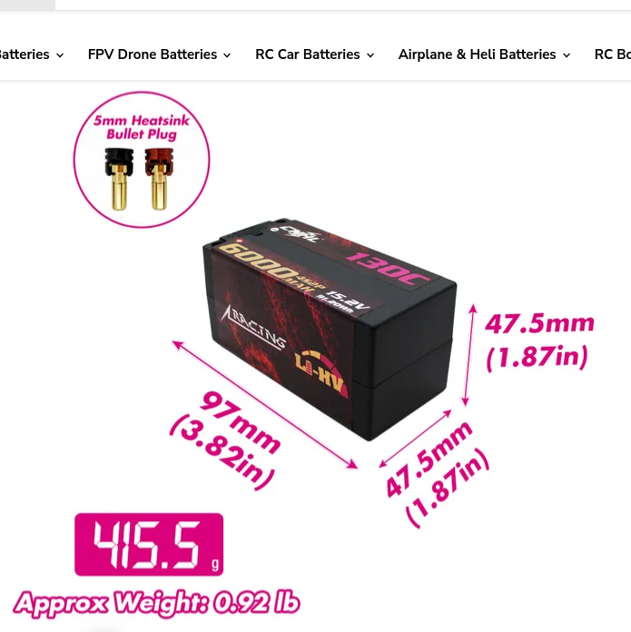 <em>HC6001304S, 97 × 47.5 × 47.5mm, 415.5g</em> |
| 🥈 **Fido RC / Fyrework Fi58130 4S 15.2V 5800mAh HV shorty hardcase** — *best value here, not bought* | **Cells:** 4S2P / **15.2V LiHV** (Carbon ECP plus) **Capacity:** 5800mAh (**88.16Wh**) **C-rating:** 130C burst (labelled as burst, not continuous) **Weight:** **430g** **Connector:** 5mm bullet **Size:** **96 × 47 × 47mm** shorty hardcase **Part:** Fi58130-4S2P HV **Price:** **$55.00** (from $139), US warehouse, 16 left | Pro: **The value pack of the whole table.** 88.16Wh for $55 works out at **$0.62 per Wh**, cheaper than the HobbyStar and roughly 40% under the Gens Ace, while still being HV, hardcase, 96mm and 47mm tall. **Ships from a US warehouse**, and it is one of the few that labels its C figure honestly as burst  Con: 430g, so 20g heavier than the Gens Ace for 3Wh less. Unknown brand here with no track record, and **Fido also sells as Fyrework**, so support and warranty are an unknown. Stock is thin at 16 units | 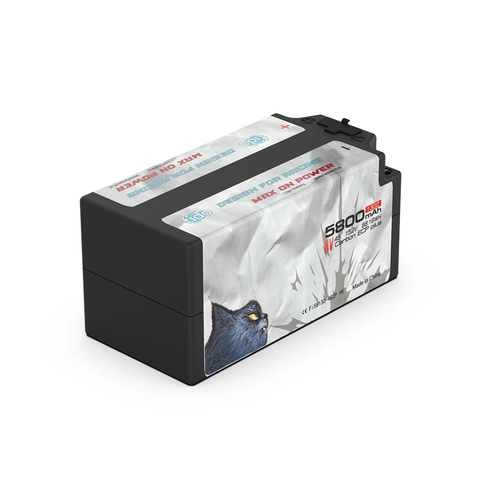 <em>Fi58130-4S2P HV, 5800mAh 15.2V, 88.16Wh, 430g</em> |
| 🔵 **Maclan Graphene V4 HV 4S 15.2V 6400mAh 130C shorty** — *out of stock* | **Cells:** 4S / **15.2V LiHV** (Graphene V4) **Capacity:** 6400mAh (**98Wh** on the label) **C-rating:** 130C **Weight:** **438g** **Connector:** 5mm bullet **Size:** **99mm long × 48.2mm thick**, 🚧 width not published **Part:** HADMCL6026 / MCL6026 **Price:** **$164.99**, **out of stock** | Pro: **Most energy in the table at 98Wh**, and the **best watts per gram of the lot at 0.224**, edging the Gens Ace. Maclan revises the chemistry each generation specifically for capacity-to-weight and lower IR, which is the metric this car cares about  Con: **Out of stock**, and **$164.99 against $92.26** for a pack 28g lighter. **Width is not published**, only length and thickness, so it cannot be fully placed in the fit table. At 48.2mm it is the second tallest after the GNB | 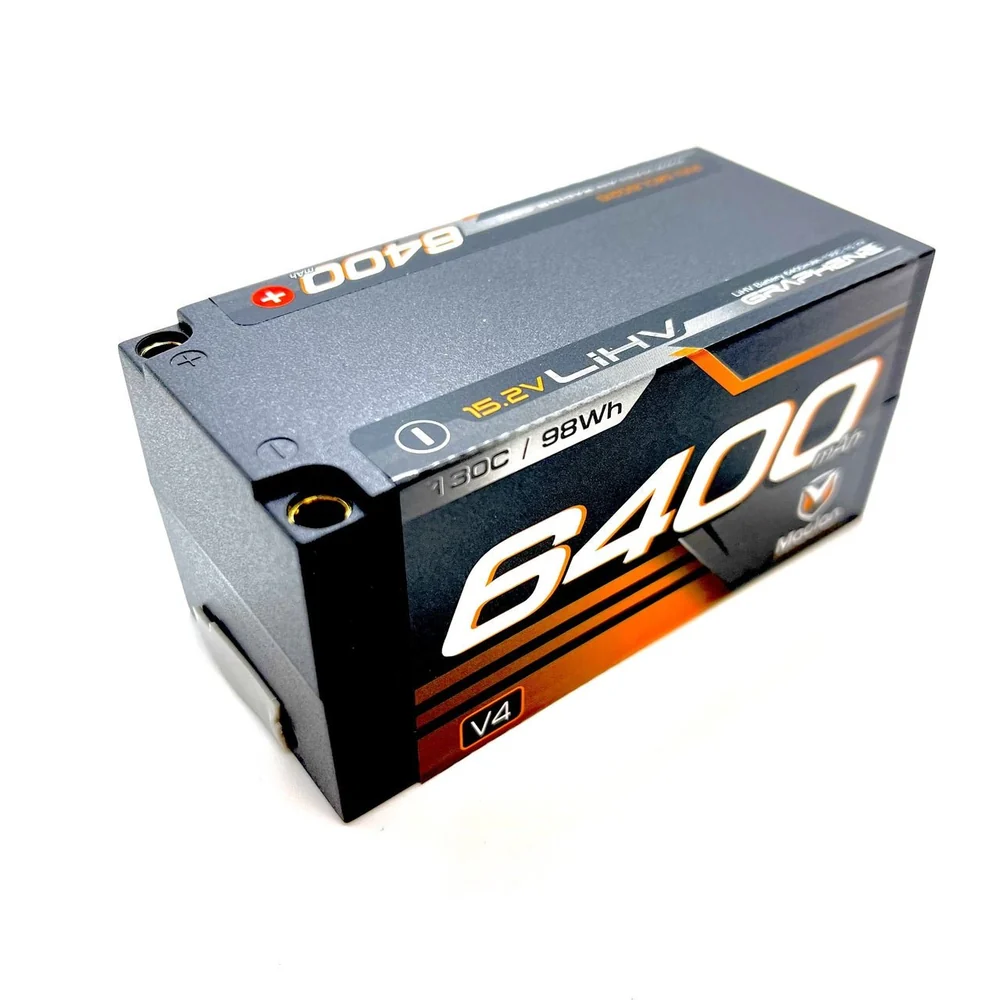 <em>MCL6026, 6400mAh 15.2V, 98Wh, 438g</em> |
| 🔵 **Team Exalt X-Rated 4S 15.2V 6000mAh 140C hardcase shorty** — *ROAR approved, specs incomplete* | **Cells:** 4S / **15.2V LiHV** (Silicone Graphene) **Capacity:** 6000mAh (**91.20Wh**) **C-rating:** 140C **Weight:** **410g** (±) **Connector:** 5mm bullet **Size:** **98 × 47 × 47mm** shorty hardcase **Part:** EXA3404 **Price:** **$164.49** (retail $234.99) | Pro: **ROAR and IFMAR approved**, both since June 2025, the only pack here with IFMAR. **Physically a twin of the Gens Ace Redline 6000**: same 410g, same 98 × 47 × 47mm, same 6000mAh and 91.2Wh, so it ties for lightest and needs no fit checking beyond what the Gens Ace already passed. Silicone Graphene, cell matched on voltage, resistance and discharge curve  Con: **$72.23 over the Gens Ace for an identical pack on paper.** The money buys the ROAR and IFMAR paperwork and the Silicone Graphene chemistry, nothing measurable in weight, size or capacity | 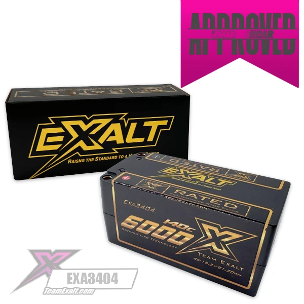 <em>EXA3404, 6000mAh 15.2V, 91.20Wh, ROAR approved</em> |
| 🔵 **Team Orion V-Max-HV Graphene 4S 15.2V 6000mAh 128C shorty** — *out of stock, specs incomplete* | **Cells:** 4S / **15.2V LiHV** (Graphene) **Capacity:** 6000mAh (**91.2Wh**) **C-rating:** 128C **Weight:** **386g** **Connector:** 5mm gold bullet **Size:** **106.4 × 46.4 × 50.5mm** hardcase **Part:** ORI14521 **Price:** **$69.99** (Absolute Hobbyz, US) | Pro: **The lightest pack in this entire document at 386g**, 24g under the Gens Ace, which gives it the **best watts per gram here at 0.236**. And it is **$69.99**, second cheapest of the HV packs. On the two numbers this car is actually specced around, weight and price, nothing else comes close  Con: **106.4mm long, so it is not a true shorty** (about 96mm is the standard) despite being sold as one, and at **50.5mm it is the tallest pack considered**. Both are fit questions rather than performance ones, since the tray takes 163mm of length, which is why it stays on the list. A 2020 design, and out of stock at the European listing though in stock in the US | 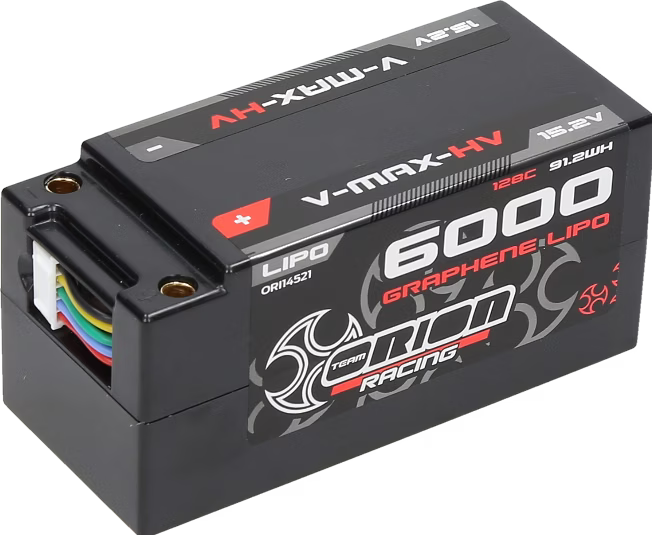 <em>ORI14521, 6000mAh 15.2V, 91.2Wh</em> |
| 🔵 **Performa Racing Graphene Shorty 5000 4S 14.8V 120C** — *106mm long shorty, kept as a maybe* | **Cells:** 4S / **14.8V standard LiPo** **Capacity:** 5000mAh (**74Wh**, printed on the pack) **C-rating:** 120C **Weight:** **410g** **Connector:** 5mm gold tube **Size:** **106 × 47 × 49mm** **Part:** PA9300 **Price:** **$89.99** | Pro: **410g, tying the Gens Ace for the lightest here**, graphene cells, 5C max charge  Con: **106mm long, so it is not a true shorty** (the standard is about 96mm), 7mm past the longest pack that is. The tray takes it, so this stays a maybe rather than a no. Also **the listing calls it LiPo HV while the pack itself is printed 14.8V / 74Wh**, so it is a standard LiPo, and at 74Wh for $89.99 the [HobbyStar](#pack-comparison) gives the same energy for $53 | 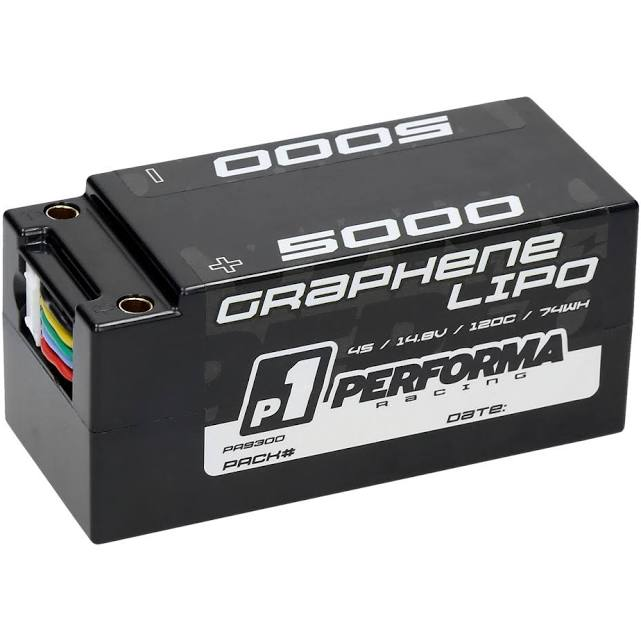 <em>PA9300, label reads 4S / 14.8V / 120C / 74WH</em> |
| 🔵 **HobbyStar 5000mAh 14.8V 4S 100C hardcase shorty** — *the budget option, not bought* | **Cells:** 4S / **14.8V standard LiPo** **Capacity:** 5000mAh (**74Wh**) **C-rating:** 100C (marketing) **Weight:** **420g** **Connector:** Deans, 12AWG wire, JST-XH balance **Size:** **95 × 47 × 47mm** shorty hardcase **Part:** N/A (HobbyStar) **Price:** **$53.00** (from $89.99) | Pro: **By far the cheapest way into the spec at $53**, about 43% under the Gens Ace, and it still clears every Must: 4S, shorty, hardcase, 420g, 47mm. **Shortest pack in the table at 95mm.** Fine as a spare or a knock-about pack where the good ones are not worth risking  Con: **The only non-HV pack of the shorties**, 14.8V rather than 15.2V, and at 5000mAh it holds just **74Wh, a fifth less than the 6000s**. That drops it to **0.176 Wh/g**, comfortably the worst here. **12AWG wire** where the rest run 10AWG, and **2C max charge**. Deans plug, which is on the avoid list, though swapping it is easy | 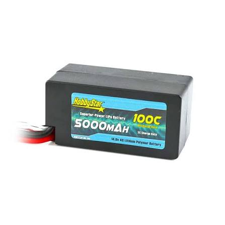 <em>HobbyStar 5000mAh 14.8V, 74Wh, 420g</em> |
| 🔵 **Tekin Graphene Power Cell 4S 15.2V 6300mAh 140C brick shorty** — *out of stock, not bought* | **Cells:** 4S2P / **15.2V LiHV** (graphene) **Capacity:** 6300mAh (**95.76Wh**) **C-rating:** 140C discharge **Weight:** **456g** **Connector:** 5mm bullet (plugs, balance harness and port dust cover included) **Size:** **96 × 47 × 47mm** shorty hardcase **Part:** TT1626 **Price:** **$164.99**, currently **out of stock** | Pro: **Fits at 47mm with no rotating**, tying the Gens Ace on the height that is already proven here, and it is the **shortest at 96mm**. Same 6300mAh / 95.76Wh as the GNB, graphene cells, and a dust-covered balance port  Con: **Heaviest pack in the table at 456g**, 46g over the Gens Ace, which drops it to **0.210 Wh/g**. **$164.99 against $105 for the GNB with identical capacity**, so it is paying $60 for 21 fewer grams of nothing. **Max charge is only 1.5C**, far below the 5C the others take and the ProTek's 10C, so a full charge is slow. Out of stock | 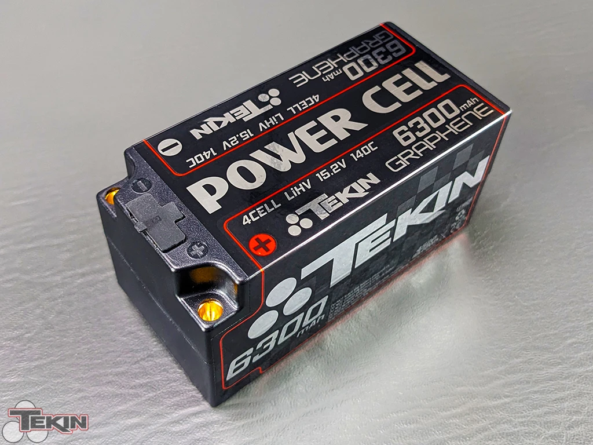 <em>TT1626, 6300mAh 15.2V, 95.76Wh, 456g</em> |
| 🔵 **PowerHobby 4S 15.2V 5600mAh 100C HV shorty hardcase** — *the EC5 option, not bought* | **Cells:** 4S / **15.2V LiHV** **Capacity:** 5600mAh (**85.12Wh**) **C-rating:** 100C continuous / 200C burst (marketing) **Weight:** **~420g** (listed 14.8 oz, so the gram figure is converted, not measured) **Connector:** **XT90 or EC5**, cabled, JST-XH balance **Size:** **96 × 47 × 48mm** (L × W × H) shorty hardcase **Part:** PHB4S5600100XT90 (EC5 version PHB4S5600100EC5) **Price:** **$109.95** | Pro: **The shortest pack here at 96mm**, and cabled out of the box so there is nothing to assemble. PowerHobby has been reliable on this build already (the [Armor tires](wheel_analysis.md) and the Tekno rear kit both came from them)  Con: **Worst value on paper.** Least capacity of the shorties at 5600mAh / 85.12Wh, yet **$17.69 more than the Gens Ace** and about 10g heavier, so it is beaten on energy, weight and price at once. Watts per gram drops to **0.203**, clearly the lowest here. 6 month warranty | 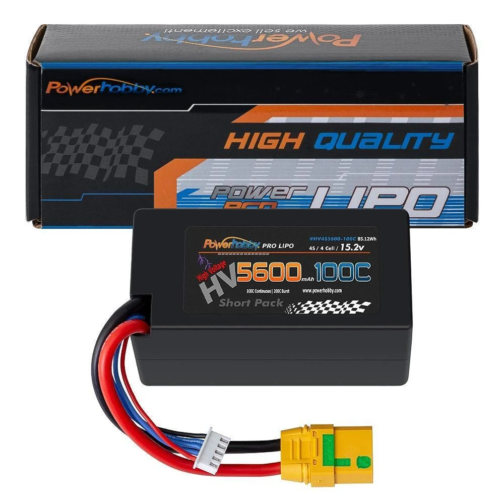 <em>PHB4S5600100, 5600mAh 15.2V, 85.12Wh, XT90 shown</em> |
| 🔵 **ProTek RC Si-Graphene+ HV 4S 15.2V 6400mAh 130C shorty** — *the race pack, not bought* | **Cells:** 4S2P / **15.2V LiHV** (Si-Graphene) **Capacity:** **6400mAh** (**97.28Wh**) **C-rating:** 130C peak (continuous not published) **Weight:** **440g** **Connector:** **5mm bullet** (5mm connectors, 4mm reducers and balance lead included) **Size:** **98.5 × 47 × 48mm** (L × W × H) shorty hardcase **Part:** PTK-5131-22 **Price:** **$175.99** | Pro: **The only ROAR approved pack here**, which matters on a car built ROAR legal down to the [rim width](wheel_analysis.md#key-requirements). **Most capacity and energy of the lot** at 6400mAh / 97.28Wh. **Si-Graphene is the real argument**: roughly double the cycle life at 1C, flatter discharge so voltage holds to the end, lower internal resistance and cooler running, and **10C max charge** against 5C on the others. Charges on a plain LiPo charger too, just at reduced capacity  Con: **$175.99, nearly double the Gens Ace** for 400mAh and a spec sheet. **Heaviest of the shorties at 440g**, and 48mm tall, so it shares the height question. Continuous discharge is not published, only the 130C peak. Hard to justify at this price unless the cycle life pays for itself | 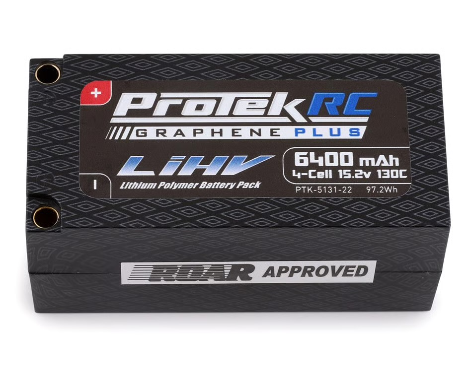 <em>PTK-5131-22, 6400mAh 15.2V, 97.28Wh, 440g, ROAR approved</em> |
| 🔵 **GAONENG GNB LiHV 4S 15.2V 6300mAh 130C shorty hardcase** — *most capacity of the shorties, not bought* | **Cells:** 4S2P / **15.2V LiHV** **Capacity:** **6300mAh** (**95.76Wh**) **C-rating:** 130C (marketing) **Weight:** **435g** (±14g) **Connector:** **XT90, cabled** **Size:** **97 × 47 × 50mm** (L × W × H) shorty hardcase **Part:** GNB63004S130WSPHV **Price:** **$105.00** | Pro: **Most energy of any shorty here at 95.76Wh**, 4.5Wh over the two 6000s, and still inside the weight window at 435g. **XT90 already wired on**, so unlike the bullet-socket packs there is nothing to assemble and the plug is on this car's accepted list, (GAONENG will fit EC5 instead if asked). Same 97mm length as the CNHL  Con: 50mm tall as it sits, though **rotating it onto its side makes it 47mm**, level with the Gens Ace and the 47mm pack already squeezed in here. The catch is width: rotated it measures **50mm, exactly the hardcase limit**, so there is no slack. **Being cabled XT90 helps here**, the lead comes off flexible wire rather than fixed sockets, so it can be turned without fighting the connector. $12.74 and 25g over the Gens Ace for 300mAh. Weight tolerance is loose at ±14g | 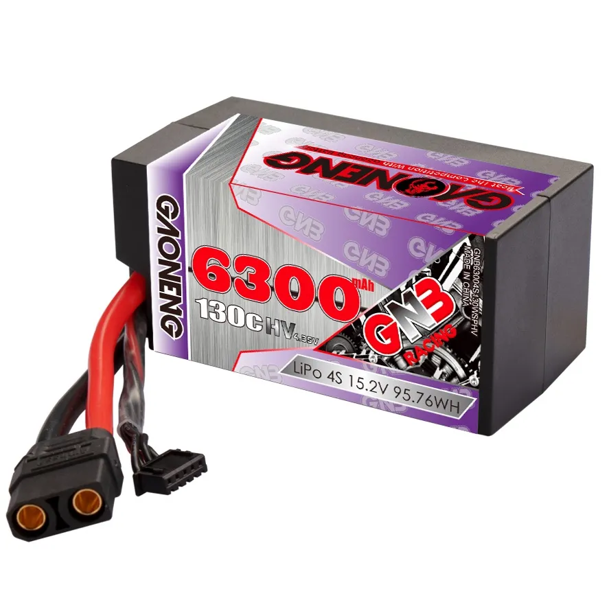 <em>GNB63004S130WSPHV, 6300mAh 15.2V, 95.76Wh, 435g</em> |
| 🔵 **Gens Ace Redline 2.0 4S HV 15.2V 6300mAh 140C** — *HV competition pack, in hand* | **Cells:** 4S HV / **15.2V** (4.35V/cell) **Capacity:** 6300mAh **C-rating:** 140C **Weight:** **452g** (light for a 6300 HV) **Connector:** 5.0mm bullet **Size:** hardcase, verify vs CF tray **Price:** **$107.38** (paid; list ~$127.71) | Pro: **Higher top speed** (HV 15.2V = more motor RPM than 14.8V). **Very light for its capacity** (452g for a 6300 HV). Low-IR competition pack, made for 1/8 racing  Con: **Pricey (~$128).** Felt like **softer torque but higher top speed** (see note, it's the delivery character + HV, not weight). Needs an **HV charger** and an ESC that tolerates 15.2V (17.4V full charge) |  |
| 🚫 ~~**PowerHobby 4S 4200mAh 120C Graphene+ HV (EC5)**~~ — *301g, way under the floor, but tempting* | **Cells:** 4S1P / **15.2V LiHV** **Capacity:** 4200mAh (63.8Wh) **C-rating:** 120C / 240C burst (marketing) **Weight:** **301g** (10.6oz) **Connector:** **EC5** (XT90 and QS8 also sold), 12AWG **Size:** **89 × 44 × 32.4mm** soft case **Price:** **$79.99** (SKU PHB4S4200120EC5) | Pro: **The lightest thing that would physically fit by a mile**, 119g under the floor and 217g under the pack running now. **212 Wh/kg**, far above anything else here. Tiny at 89mm long, LiHV, graphene, and EC5 native. Charge rate is capped at 2C, lower than the rest  Con: **Fails the weight window badly**, and that window exists because of exactly this. **A car this light goes uncontrolled in the air**, the same behaviour the RCTech thread below documents on ultra-light 1/8 builds. Also **$79.99 for 4200mAh**, the most expensive per mAh on the list. Worth playing with someday to see where the limit actually is, not worth building around | 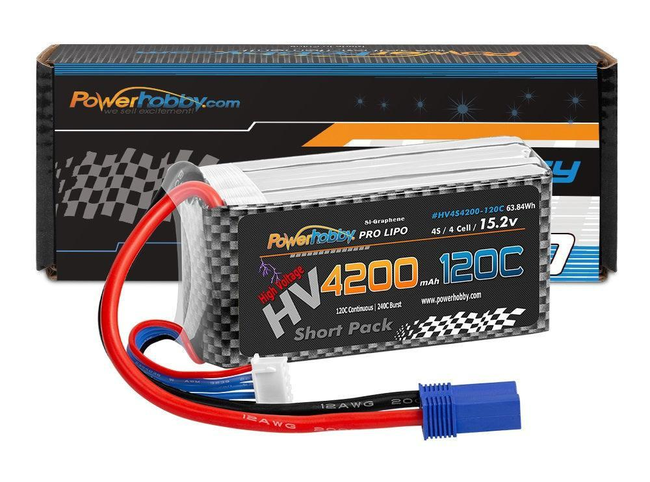 |
| 🚫 ~~**HCL-HP 4S 5200mAh 150C hardcase (52150-4S1P, SMC)**~~ — *558g, well over the window* | **Cells:** 4S / 14.8V **Capacity:** 5200mAh (true ±5%) **C-rating:** 150C (SMC true rate; **Power Factor 390**) **Weight:** **558g** (hardcase) **Connector:** SC5 (EC5/IC5 compatible) **Size:** **139 × 49 × 47mm** hardcase (L × W × H) **Price:** **$49.95 each** (bought **3**, $149.85) | Pro: **Absolute best performance of the bunch**, low IR gives strong acceleration/speed and stays cooler. 100% LCO cells, and SMC actually publishes an honest Power Factor / true C (see note)  Con: **Run 3.5V/cell LVC, not 3.4V.** SMC recommend it across their whole range and these packs are less tolerant of being taken low. **Not durable, you have to baby it.** Fails early even with a high cutoff, and it doesn't like impacts or being shaken hard. One arrived **DOA (a defect)**, and the rest **didn't make it past ~20 charge cycles**, frail within 6 months despite following SMC's care rules. Hardcase adds weight (558g) |  |
| 🚫 ~~**Zeee 4S 6000mAh 60C (Deans), soft case**~~ — *573g, the pack that set the too-heavy line* | **Cells:** 4S / 14.8V **Capacity:** 6000mAh **C-rating:** 60C (marketing) **Weight:** **573g** **Connector:** Deans (T-plug) **Size:** larger soft case **Price:** ~$69.59 | Pro: Longest run time of the bunch  Con: **Too heavy**, the extra mass hurts handling on this light chassis. Deans plug (would need adapting to the EC5 setup) |  |
| 🚫 ~~**RUDDOG Racing 5700mAh 150C/75C 15.2V short 4S LiPo-HV**~~ — *can't be shipped here* | **Cells:** 4S / **15.2V LiHV** (Silicon Graphene) **Capacity:** 5700mAh (**86.64Wh**) **C-rating:** **75C continuous / 150C peak** **Weight:** **411g** **Connector:** none fitted, 5mm bullet and XH balance ports **Size:** **98 × 47 × 47mm** shorty hardcase **Part:** RP-0749 **Price:** **€69.99** incl. 19% VAT (~$75), free shipping within Europe | Pro: **The only pack here that publishes a continuous rating**, 75C, instead of a peak number dressed up as continuous, which makes it the one honest C figure in the table. **411g, within a gram of the Gens Ace**, Silicon Graphene cells, and 47mm tall with no rotating  Con: **RUDDOG does not ship LiPo or LiHV outside mainland Europe**, so it cannot be bought from Oregon at any price. That alone rules it out. Also ships **with no plugs fitted**, and at 86.64Wh it carries less energy than the 6000s while weighing the same | 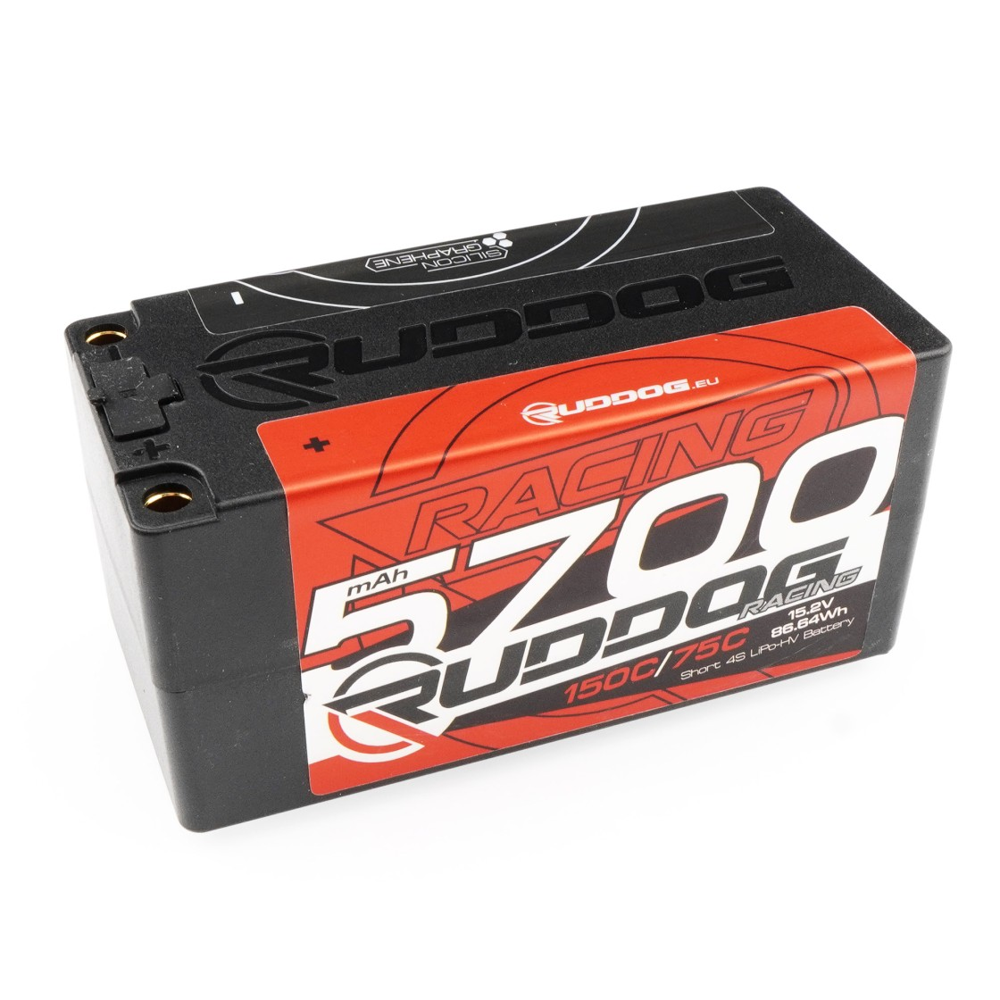 <em>RP-0749, 5700mAh 15.2V, 86.64Wh, 411g</em> |

---

## The C-rating math (a fun sanity check)

Max continuous current a C-rating *claims* = **C × capacity (Ah)**. Run the numbers and the claim collapses, the pack's own lead wire would melt long before it hit that current.

| Pack | C-rate | Claimed continuous (C × Ah) | Lead wire | Wire's realistic RC ceiling |
|---|---|---|---|---|
| Zeee 5200 50C hardcase | 50C | 50 × 5.2 = **260A** | ~10-12 AWG | ~60-150A |
| Zeee 6000 60C | 60C | 60 × 6.0 = **360A** | ~12 AWG | ~40-100A |
| Zeee 5200 **100C** soft | 100C | 100 × 5.2 = **520A** | ~12 AWG | ~40-100A |
| Gens Ace 6300 **140C** | 140C | 140 × 6.3 = **882A** | 5.0mm bullet leads | ~150A |
| SMC HCL-HP 5200 **150C** | 150C | 150 × 5.2 = **780A** | **10 AWG** (per SMC) | ~60-150A |

**The punchline:** a "100C" 5200 claims **520A continuous**, but its ~12AWG lead taps out around **40-100A** in RC use. The HCL-HP's 150C implies **780A through a 10AWG wire** that realistically carries maybe **60-150A**. That's **5-10× over** what the wire can pass, the lead would glow and melt at a fraction of the rated C, never mind the cells, tabs, or connectors. For context, a car's starter cable (huge, short) moves a few hundred amps; these little silicone leads are not doing 500-880A.

So the headline C number is physically impossible to sustain, it's a **marketing power scale**, useful only within one brand (see the note below). The honest exception is **SMC's Power Factor** (390 on the HCL-HP), a real metric instead of a fantasy amp figure, even though their own "150C" label implies that impossible 780A.

---

## Notes

- **Brand-agnostic.** Any reputable 4S pack around 4000-5500mAh works, and it's a weight call before a capacity one, not a brand call.
- **Width is what actually eliminates packs here, not length.** The limit is **50mm** and nothing on the list is anywhere near the 163mm length ceiling. The **Lightning 5500, G+Plus 5000 and Black Series 5000 are all 51mm**, over by a millimetre, but **all three are soft case and a millimetre jams in fine**. It's only a real limit on a hard case, which can't give. So the width column rules out nothing currently on the list, and the **Ultra-Thin 6000 at 47mm** is the only hardcase with clearance to spare.
- **Too light is a real failure mode, not just too heavy.** Under the band the car goes odd in the air, motor torque starts steering it on a jump, so this is a window rather than a race to the lightest pack. The floor is what rules out the **PowerHobby 4200 HV at 301g**, which would otherwise be tempting: it's the lightest pack that fits and by far the best Wh/kg here. **The precedent is the RCTech thread ["1/8 buggy: how light is too light?"](https://www.rctech.net/forum/electric-off-road/) (Dec 2010)**, where the ultra-light builds were Losi 810s and Ofna NEXX8s. The line that matters: *"We had an AE engineer get his RC8 down to 5 lbs and was to hard to drive and handled and jumped weird."* Another poster reports the same on a Hot Bodies VE8 stripped too far, unpredictable handling with no springs light enough to match it.
- **The mechanism is the sprung to unsprung ratio, not the weight itself.** Tyres, wheels and foams have a floor you can't go under, so as the chassis gets lighter a bigger share of what's left is unsprung, and that's what wrecks handling. Stripping the car evenly would push the limit much lower.
- **Worth noting the thread isn't unanimous.** Several racers argue a nervous light car is a setup problem, springs, damping and foams, not a weight problem. So **420g is a judgement call informed by that thread, not a measured limit for this car.** It's also a battery figure standing in for a total car weight effect, which is a further step removed. Of the packs still in play the lightest is the **Gens Ace Redline at 452g**.
- **Case type matters here more than most tracks.** Meldrum is sandy and grit works its way into the tray, chafing the shrink wrap on soft packs. Of the shortlist the **Ultra-Thin 6000 and the Zeee 5200 50C are hardcase**; the Zeee 5200 100C running now, the Racing 5200, the Lightning 5500, the G+Plus and the Black Series are all soft. It doesn't outrank weight, but between two packs within a few grams it should decide.
- **Height ranks the shortlist as much as weight does.** On the packs with published dimensions: Lightning LiHV **31mm**, G+Plus **34mm**, Black Series **35mm**, Ultra-Thin and Racing both **37mm**. Everything here clears the 40mm ceiling that keeps packs swappable with Mike's Jato, and the 31 to 35mm group does it without forcing anything. Which specific packs are owned lives in the shared [battery tracker](../../batteries/README.md).
- **Ignore the C rating entirely when comparing these packs.** It is a marketing number, not a measurement, and it means nothing across brands. A 130C from one maker and a 140C from another are not comparable in any direction, so **none of the rows above are ranked on C**, and no pack here is better because its sticker says a bigger number. **The only legitimate use is within a single brand**, where a 100C and a 50C from the same line tell you which of the two is the stronger pack. Every one of these has current to spare for this car regardless, so it never decides anything. Detail below.
- **C-ratings are mostly marketing, don't cross-shop them between brands.** The advertised C rarely survives the math (true C × capacity would be an absurd current the pack can't actually deliver), so a "100C" from one brand is not the same as "100C" from another. C is only useful as a **relative power scale within one brand**: a 100C Zeee vs a 50C Zeee tells you something; a 100C Zeee vs a 100C Tattu tells you nothing. Buy on **brand reputation + capacity**, and treat C as an in-brand relative number only. At this capacity any reputable pack pushes plenty for the 140A MAX10 G2 regardless. **One honest exception: SMC** publishes a real **Power Factor** (e.g. 390 on the HCL-HP) and rates true-spec mAh / true factory C, which is a far better cross-brand yardstick than the usual inflated C numbers.
- **Performance vs durability, pick your poison.** The **SMC HCL-HP** is the best-performing pack I've run but the **least durable**, fails early, hates impacts/vibration, one died before its first charge, and **none lasted past ~20 charge cycles** (one was a straight **DOA defect**), frail inside 6 months even babied per SMC's rules. One DOA is a genuine dud, that happens to any brand and isn't a knock, but **the rest dying by ~20 cycles under different circumstances while following SMC's care rules is the pattern, a fundamental durability problem with the pack, not user handling**. The **Zeee 5200** gives up some peak punch but is the reliable daily pack. Also sold in a **3S variant (52150-3S1P, $37.95)** for 3S cars.
- **Shorty + hardcase now rules out most of this table, including packs just bought.** Of everything listed, seven clear both, all 4S hardcase shorties from 95 to 98.5mm: **Gens Ace Redline 6000** (owned, 410g, $92.26), **CNHL Racing 6000** (415.5g, $99.99), **GAONENG GNB 6300** (435g, $105) **ProTek Si-Graphene 6400** (440g, $175.99) **PowerHobby 5600** (~420g, $109.95) **Tekin Graphene 6300** (456g, $164.99) and **HobbyStar 5000** (420g, $53). So the spec has real supply rather than hanging on one listing.
- **Weight climbs with labelled capacity, and the cheapest is still the lightest.** 410g / 91.2Wh, 415.5g / 91.2Wh, ~420g / 85.12Wh, 435g / 95.76Wh, 440g / 97.28Wh, 456g / 95.76Wh. Watts per gram sits at 0.220 to 0.222 for the Gens Ace, CNHL, GNB and ProTek, then falls off for the **Tekin at 0.210** and the **PowerHobby at 0.203**, the two carrying the least energy for their grams.
- **Why the shorty shape, and why 2P.** Two separate reasons, both specific to this car. **Layout:** the RX box is mounted on the battery side, and the battery is meant to sit centred in the chassis, so a 138 to 160mm brick simply cannot go where it needs to. **Construction:** the 4S shorties are built **4S2P**, eight cells with two in parallel per series group, against **4S1P** for a full length pack. Paralleling two cells **halves the internal resistance**, so voltage holds up better under a hard pull instead of sagging, and that is a felt difference on track rather than a spec sheet one. The shorty format is not a compromise made for packaging here, it is the better pack.
- **Confirmed 4S2P from their own listings:** CNHL Racing 6000 shorty, GAONENG GNB 6300, Tekin 6300, Fido 5800, ProTek 6400. **Not stated either way:** Gens Ace Redline 6000, Exalt, Maclan, Team Orion, HobbyStar, PowerHobby, Performa. 🚧 **The Gens Ace is worth pinning down**, since it is the chosen pack and its seller blurb talks about "single cell capacities of 6000mAh", which reads like 1P. If it turns out to be 4S1P, the packs that state 2P deserve a second look on the one quality that started this search.
- **Every Wh figure here is a claim, not a measurement.** Watt hours are just nominal voltage times labelled mAh, so **the whole watts-per-gram and cost-per-Wh ranking inherits whatever the label exaggerates**. Capacity is the easiest spec to overstate and the hardest for a buyer to check, and it has already bitten this fleet: the [E-Revo Zeee packs](../ERevo_1.0/battery_analysis.md) charge back only about 3000mAh from storage on a 4200 label, and reviewers report the same on the HOOVO. **Treat the tables as ranking the labels, not the packs.**
- **Only SMC publishes true-spec capacity**, measured rather than nominal, which is why their numbers look worse next to everyone else's and are worth more. Nobody else in this table states a measured figure, so a 6000 from one brand and a 6000 from another are not necessarily the same energy.
- **A discharge test settles it, and the gear is already here.** Running a pack down at a known current and logging the mAh out gives the real number, and the [chargers on hand](charger_analysis.md) can do it. **Worth doing on the Gens Ace before buying a second pack**, because if the label is honest it stays the value pick, and if it is not, the cheap packs stop looking cheap per real Wh.
- **Cost per watt-hour sorts these better than price alone, on labelled capacity.** Fido **$0.62/Wh**, HobbyStar $0.72, **Team Orion $0.77**, Gens Ace $1.01, CNHL and GNB $1.10, PowerHobby $1.29, then a cliff to Maclan $1.68, Tekin $1.72, Exalt $1.80 and ProTek $1.81. **The top four cost roughly three times what the Fido does for the same stored energy**, and none of them is meaningfully lighter. Spending past about $1.10 per Wh buys cycle life, ROAR paperwork or a brand name, not performance this car can use.
- **Two packs are sold as shorties at 106mm, and one of them is the lightest thing here.** The qualifying packs cluster at 95 to 99mm, but the **Team Orion (106.4mm, 386g, $69.99)** and the **Performa (106mm, 410g)** are both marketed as shorties at about 8mm longer. **This car's tray takes 163mm**, so neither is anywhere near a length problem, and the Orion is **the lightest and best watts-per-gram pack in this whole document**. **Both stay on the list as maybes.** The hard rule is only that a pack is not a full length brick, and at 106mm neither of these is close to that. They sit past the 96 to 98mm I would prefer, which is what makes them maybes rather than contenders, but the Orion weighing less than anything that does fit the preference keeps it worth a look.
- **Price spans more than 3x for the same shape.** $53 for the HobbyStar to $175.99 for the ProTek, all of them 4S hardcase shorties that fit this car. What the money buys, in order: **energy** (74Wh to 97.28Wh), **HV voltage** (the HobbyStar is the only 14.8V one), and at the top end **cycle life and a ROAR sticker**. Weight barely moves across the whole range, 410g to 456g.
- **The GNB and the Tekin are the same pack on paper, $60 apart.** Both 6300mAh, both 95.76Wh, both 4S2P HV. The Tekin is 21g heavier and fits at 47mm without rotating; the GNB is lighter, cheaper, in stock, and gets to the same 47mm on its side. **Unless the rotation is a problem, there is no case for the Tekin.** The **Gens Ace is both the lightest and the cheapest**, the ProTek costs **$83.73 more for 6.1Wh** (a ROAR sticker and Si-Graphene cycle life), and the PowerHobby costs **$17.69 more for 6.1Wh less**, buying nothing but the EC5 plug.
- **RUDDOG is the one that got away.** 411g, 47mm, Silicon Graphene, and the **only honest C rating in the table** (75C continuous, 150C peak, stated separately). It is ruled out purely on logistics, **RUDDOG will not ship LiPo or LiHV outside mainland Europe**. Worth knowing it exists if a pack ever needs sourcing while in the EU.
- **RUDDOG is the only one that splits continuous from peak**, 75C and 150C. That is not a reason to rank it above or below anything, brands do not share a scale, but it does show what the single big numbers elsewhere are: peak figures with the continuous half left off. See [the C-rating math](#the-c-rating-math-a-fun-sanity-check) for why none of them survive contact with the lead wire anyway.
- **Ignore the connector when comparing these.** Swapping plugs is easy and I do it routinely, so whatever a pack ships with says nothing about whether it is the right pack. For the record: PowerHobby lists an EC5 variant, GAONENG fits one on request, and the bullet-socket packs take whatever lead gets soldered on. **Judge these on weight, energy, size and price.**
- **Height is the shared constraint.** This car's limit is 45mm, with a 47mm pack squeezed in once before. Gens Ace **47mm**, CNHL **47.5mm**, ProTek **48mm**, GNB **50mm as it sits but 47mm rotated onto its side**. So every one of them lands at 47 to 48mm, within a millimetre of the known-good squeeze, and none is ruled out on height. Length is a non-issue on all four. The GNB is the only one where rotating costs something, since it then sits at exactly the 50mm width limit. The **Zeee 5200 currently in the car is soft case**, and the three CNHL packs bought 2026-08-26 fail one or both: **Racing 5200** is 160mm soft, **Lightning 5500** is 149mm soft, **Ultra-Thin 6000** is a hardcase but 138mm, so still not a shorty. They stay in the table as bought-and-owned rather than being deleted. **All three run on [Mike's Jato](../Jato4x4_Mike/README.md)**, which takes full length packs in either case type, soft or hard, so nothing is wasted. Future buying for this car goes shorty hardcase only.
- **The 6000-is-too-heavy rule is now beaten twice over.** The **Gens Ace Redline 2.0 6000 at 410g** is the lightest pack owned, full stop, and it carries 6000mAh. Two 6000s (this and the CNHL Ultra-Thin at 479g) both come in under the 518g Zeee 5200. Capacity stopped predicting weight a while ago.
- **"6000 is too heavy" is really a weight rule, not a capacity rule.** It came from the **Zeee 6000 at 573g**, not from the mAh number. The **CNHL Ultra-Thin 6000 is 479g**, lighter than the 5200 currently in the car (518g). So it clears the intent of the rule while breaking the letter of it. **Judge a pack on grams and dimensions**, which is why the requirements now put weight first and treat capacity as a run time preference.
- **CNHL packs skipped, and why:** Racing **6200mAh** 90C ($63.99) and Racing **6600mAh** 120C ($69.99) are 1P 6000+ packs with no published weight advantage, so they land on the wrong side of the weight rule. The Ultra-Thin is the exception, not the whole 6000 class. At the other end, Lightning LiHV **4500mAh** ($45.99) and **4000mAh** ($39.99) are below the window and run out too fast, same problem as the 4200.
- **Weight tracks chemistry here, not capacity.** Of the CNHL packs that publish a weight, the two **LiHV** ones are the light ones (Lightning 5500 = **472g**, Ultra-Thin 6000 = **479g**) while most of the standard LiPo packs sit near 520g: Racing **5200 = 524g** and Black Series **5000 = 521g**, both heavier than the Zeee 5200 already in the car (518g). **The G+Plus 5000 is the exception at 491g**, graphene construction, 30g under the Black Series for a dollar more, and the only standard LiPo here that gets close to LiHV territory. On watts per kilo it runs **151 Wh/kg** against 142 for the Black and 147 for the Racing, still well behind the LiHV pair at 177 and 190. So the cheap standard LiPo packs are the *worst* weight per mAh here, and the LiHV packs give more capacity for ~50g less. If weight is the deciding factor, the choice is LiHV, and the cost is needing HV charge mode. **Every pack in the table now publishes a weight**, so nothing is left unranked on the metric that decides this.
- **Footprints differ more than the capacities do.** Lightning 5500 = 149 × 51 × **31**, Ultra-Thin 6000 = 138 × 47 × **37**, Racing 5200 = **160** × 45 × 37. They fail a tight tray in different directions. The 5200 on length, the 5500 on width, the 6000 on height. Measure the CF tray in all three axes once and the list sorts itself.
- **Check the fit.** Confirm the pack's length/width/height clears the CF chassis battery tray and strap before committing to a size.
- **Connectors:** stock is **EC5**; **EC5 / XT60 / XT90** are all good, **avoid Deans / Tamiya**. The fleet is a mix of plugs, so keep adapters handy. See [`connector_reference.md`](connector_reference.md).
- **Charger:** all the on-hand chargers do **LiHV** (needed for the Gens Ace HV pack), charge at ~1C. Full list in [`charger_analysis.md`](charger_analysis.md).
- **Why the HV Gens Ace felt like less torque but more top speed (likely).** Two things, and neither is weight (at 452g it's actually **lighter** than the running Zeee 5200 soft at 518g). First, **HV (15.2V, 4.35V/cell) runs higher voltage than standard 14.8V**, and top speed scales with voltage (more motor RPM), so the top end climbs. Second, it's a **low-internal-resistance competition pack**, so it **sags less** than a cheaper pack. A pack that sags more gives a sharp voltage spike off the line that *feels* like a big torque hit, then droops; the Gens Ace holds voltage steady and delivers smoothly, so it **feels softer off the line while actually pulling harder up top**. So it trades that punchy initial hit for smoother, faster power, not a real loss of torque.
- **Weight reference (per pack):** **Gens Ace Redline 2.0 6000 HV 410g (lightest owned)** · Zeee 5200 100C soft **518g** · Zeee 5200 50C hardcase ~480g · Zeee 6000 60C 573g · SMC HCL-HP 5200 150C hardcase 558g · Gens Ace Redline 6300 HV 140C **452g**. Note the **Gens Ace is the lightest of the lot despite the most capacity + HV**, lighter than even the running Zeee 5200 soft (518g), that's the premium competition-pack difference. The cheap Zeee packs are heavy.
