# Battery Selection — FastAzJato4x4

> **All three CNHL candidates bought 2026-08-26** ($177.97 for the set) to settle this on the track instead of on paper, see [`/Deals/batteries.md`](../../Deals/batteries.md#cnhl-4s-packs-chinahobbyline).
>
> **Target: any reputable 4S (14.8V) LiPo, roughly 4000-5500mAh, picked on weight.** Capacity sets run time, **grams decide the pack**. Bigger usually means heavier, but not always, so a 6000 isn't ruled out on capacity alone (hurt handling) and **4200mAh runs out too fast**, so 5000-5400 balances run time against weight. Running **Zeee 4S 5200mAh 100C (EC5) soft-case** packs, right in the window, pulled from the shared [battery fleet](../../batteries/README.md).

---

## Key Requirements

> **These are set to match [Mike's Jato 4x4](../Jato4x4_Mike/README.md), so packs stay shared between the two cars.** Same 4S, same connector, same size envelope. Buying to one spec means either truck can run any pack in the pile, which is worth more than optimising this car alone. 🚧 Mike's battery specs aren't written down yet, so this is the working assumption until they are.

| Requirement | Type | Why |
|---|---|---|
| **4S (14.8V)** | Must | The MAX10 G2 + 3665SD 2400KV combo is geared/tuned for 4S |
| **420 to 530g** | Must | **A window, not a floor.** Over roughly **580g is too heavy**; the 573g Zeee 6000 soft pack is the one that proved it. **Too light is its own problem**: the car goes odd in the air, motor torque starts steering it on a jump. The pack running now sits at **518g**, inside the band |
| **Smaller than 163 × 50 × 45mm** (L × W × H) | Must | This car's actual envelope. Length is the easy one, nothing here comes close to 163mm. **Width is 50mm for a hard case and about 51mm for a soft one**, since a soft pack squeezes in and a hard one won't. **45mm is the height limit, though the 47mm HCL-HP did get squished in** |
| **Hard case preferred** | May | **The sand at Meldrum chafes soft packs.** Grit gets into the tray and works at the shrink wrap, so a hard case earns its slightly higher weight. Not a rule, the pack running now is soft case, but it counts against a soft one when two are close |
| **4000-5500mAh** | May | Run time preference, not a rule. **Capacity is a poor proxy for weight**, a 6000 can undercut a 5000 depending on chemistry and construction, so the gram figure decides rather than the mAh |
| **Under 40mm tall, 35mm ideal** | May | **This is the sharing limit, not this car's limit.** Mike's stock Jato tops out around 40mm, and at **35mm the standard battery bar still works** there, taller needs a 3D printed one. A pack at 35mm drops into both trucks with no extra parts. Lower is better for CG anyway |
| **Enough C-rating for the 140A ESC** | May | Any modern reputable pack (~50C+) handles the current fine at this capacity, not a limiting factor |
| **Connector matches the ESC** | May | Match the MAX10 G2 connector or adapt |

---

## Battery tray fit check

**Stock Jato 4x4 plastic chassis tray: ~160.23 × 50 × ~35mm** (L × W × H), and **~40mm of height can be squished in** if it has to. **That length is a caliper measurement of the actual tray**, and published pack dimensions often don't line up with it. Manufacturers aren't consistent about what they include, wire exit, plug, case lip or shrink wrap, so a pack listed at 147mm and a tray measured at 160mm aren't necessarily 13mm apart in practice. **Trust the caliper number for the tray and measure the pack the same way** rather than comparing a caliper reading to a spec sheet.

**A stock Jato can be opened up to roughly 163 × 50 × 40mm** with the right battery mount and a 3D printed battery bar. Worth knowing if you're speccing a pack for a stock truck, and worth noting that the height is the part that needs the printed bar.

> **None of this constrains this build.** The stock tray is the conservative reference here, not the limit. The FastAz runs the [AliExpress CF LCG chassis](chassis_analysis.md) with its own **aluminium battery holder and strap**, and a taller body over it, so length and height both open up. Its usable tray still needs measuring, but pack size isn't what decides this car's battery, weight is. Until then, treat the stock tray as the conservative reference. It's also the tray on [Mike's Jato](../Jato4x4_Mike/README.md).

| Pack | L × W × H | Length (160.23) | Width (50) | Height (35 / 40 max) | Verdict |
|---|---|---|---|---|---|
| **CNHL Ultra-Thin 6000 LiHV** | 138 × 47 × 37 | ✅ 22mm spare | ✅ 3mm spare | ⚠️ 37, needs the squish | **Only pack clearing L and W with real margin** |
| **CNHL Racing 5200 90C** | 160 × 45 × 37 | ⚠️ **0.23mm spare** | ✅ 5mm spare | ⚠️ 37, needs the squish | Effectively zero length clearance, hangs entirely on verifying 160.23 |
| **CNHL Lightning 5500 LiHV** | 149 × 51 × 31 | ✅ 11mm spare | ❌ **1mm over** | ✅ 4mm under nominal | Only one that fits the 35mm nominal height, but it's over on width |
| Zeee 5200 100C (running) | 🚧 TBD | — |, | — | Measure the pack that's already in the car |

**What this settles:** the **Ultra-Thin 6000 is the only one that fits without an argument**, and it's also lighter (479g) than the pack currently in the car (518g) while carrying 800mAh more. The pack the [weight rule](#notes) was written to exclude turns out to be the one that fits best.

The other two each need a concession: the **5200 is 0.23mm short of touching** on length, which is measurement noise, not clearance; the **5500 is 1mm over on width**, and while it's a soft case that may compress into an alum holder, that's a squeeze against a hard mount, not a fit.

---

## Capacity comparison (why 5000-5400)

> *Spec format: Cells · Capacity · C-rating · Weight · Connector · Size · Price*

| Pack | Spec | Pros / Cons | Photo / Link |
|---|---|---|---|
| ⭐ **Zeee 4S 5200mAh 100C (EC5), soft case** — *running* | **Cells:** 4S / 14.8V **Capacity:** **5200mAh** (in the sweet spot) **C-rating:** 100C (marketing, see note) **Weight:** **518g** **Connector:** **EC5** **Size:** soft case, verify vs CF tray **Price:** cheap 2-packs (Amazon) | Pro: **Right in the 5000-5400 window**, soft-case, EC5, cheap 2-packs. Running these  Con: The 100C is a marketing number (see C note), but it pushes plenty for the 140A ESC either way | 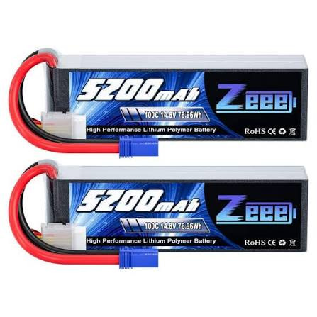 |
| 🥈 **CNHL Ultra-Thin Racing LiHV 6000mAh 4S 120C (EC5), hardcase** — *a 6000 that's light enough anyway* | **Cells:** 4S1P / **15.2V LiHV** **Capacity:** 6000mAh (91.20Wh) **C-rating:** 120C / 240C burst (marketing, see note) **Weight:** **479g** **Connector:** **EC5**, 10AWG leads **Size:** **138 × 47 × 37mm** hardcase (37mm is the selling point) **Price:** ✅ **$71.00 paid** 2026-08-26 (list $72.99, WELCOME code; pre-order, ~7 days) **Stock #:** HC6001204HV | Pro: **Breaks the "6000 is too heavy" rule**, at **479g it's lighter than the running Zeee 5200 soft (518g)** and 94g under the Zeee 6000 (573g), so it's more capacity for *less* weight than what's in the car now. **Ultra-thin 37mm hardcase** helps in a tight CF tray, native EC5, hardcase impact protection, HV 15.2V adds top speed like the Gens Ace  Con: **Priciest CNHL of the bunch.** **LiHV, needs HV charge mode** (all on-hand chargers do it) and 17.4V hot off the charger. **Verify 138 × 47 × 37mm against the CF tray and strap** on arrival. Bought, no run data yet | 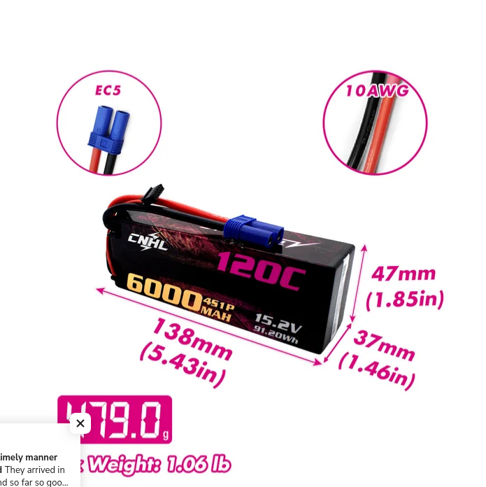 |
| 🥉 **CNHL Lightning LiHV 5500mAh 15.2V 4S 120C (EC5), soft case** — *lightest pack here* | **Cells:** 4S / **15.2V LiHV** **Capacity:** 5500mAh (just over the window) **C-rating:** 120C / 240C burst (marketing, see note) **Weight:** **472g** **Connector:** **EC5**, 10AWG leads **Size:** **149 × 51 × 31mm** soft case **Balance:** JST-XHP-5P **Price:** ✅ **$54.46 paid** 2026-08-26 (list $55.99, WELCOME code) **Stock #:** HV5501204EC5 | Pro: **The lightest pack in this table at 472g**, 46g under the running Zeee 5200 while carrying 300mAh more, and 7g under the Ultra-Thin 6000. **Only 31mm tall**, thinner than the pack CNHL markets as "ultra-thin" (37mm). HV 15.2V for the top-speed gain, native EC5, 10AWG  Con: **149mm long × 51mm wide**. It buys its thinness with footprint, so check length and width against the CF tray, not just height. **Soft case** (no impact shell). LiHV, needs HV charge mode. **Was the last unit in stock**, so it's a one-off, if it wins the test it may not be re-buyable. Bought, awaiting arrival | 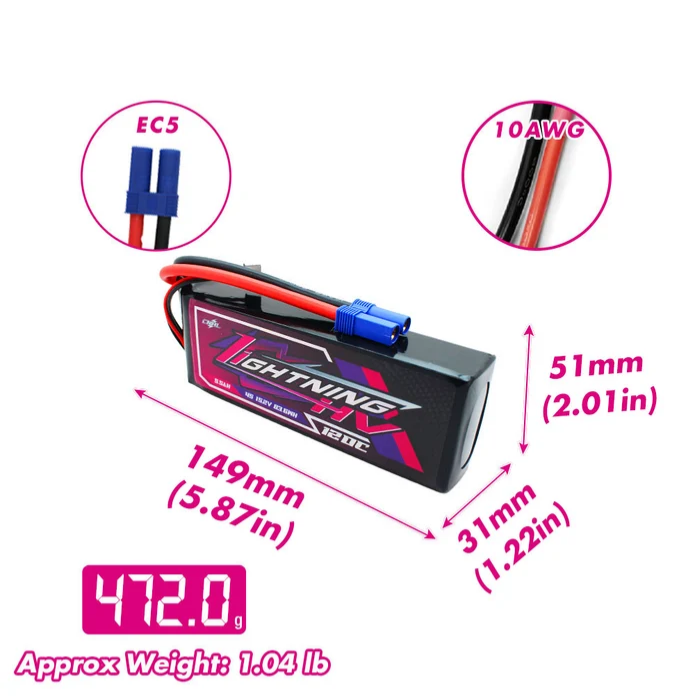 |
| 🔵 **CNHL Racing Series 5200mAh 4S 90C (EC5), soft case** — *the heaviest of the CNHLs* | **Cells:** 4S1P / 14.8V **Capacity:** **5200mAh** (sweet spot) **C-rating:** 90C / 180C burst (marketing, see note) **Weight:** **524g** **Connector:** **EC5**, 10AWG leads **Size:** **160 × 45 × 37mm** soft case **Balance:** JST-XH **Price:** ✅ **$52.51 paid** 2026-08-26 (list $53.99, WELCOME code) **Stock #:** 520904EC5 | Pro: **Exactly the 5200 target**, native EC5, standard 14.8V so no HV charger needed, cheapest of the CNHL 4S line. Straight swap for the Zeee 5200  Con: **524g. The heaviest CNHL here, and 6g heavier than the Zeee 5200 it would replace.** Both LiHV packs carry more capacity for ~50g less, so paying less here costs weight. **160mm long**, the longest of the three, check it against the CF tray. Soft case. Bought, awaiting arrival | 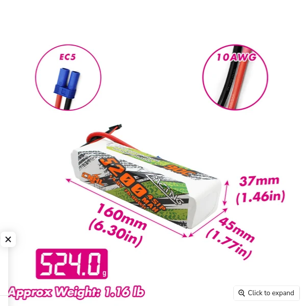 |
| 🔵 **CNHL G+Plus 5000mAh 4S 70C (EC5)** — *the light standard LiPo, graphene* | **Cells:** 4S / 14.8V **Capacity:** 5000mAh (bottom of the window) **C-rating:** 70C continuous / 140C burst (marketing) **Weight:** **491g** (±5g) **Connector:** **EC5**, JST-XH balance, 10AWG **Size:** **147 × 51 × 34mm** **Price:** **$54.99** | Pro: In the window, native EC5, standard 14.8V  Con: No published weight or dimensions, and it costs $1 more than the Black Series 5000 for 5C more. **6 units left**. Untested | 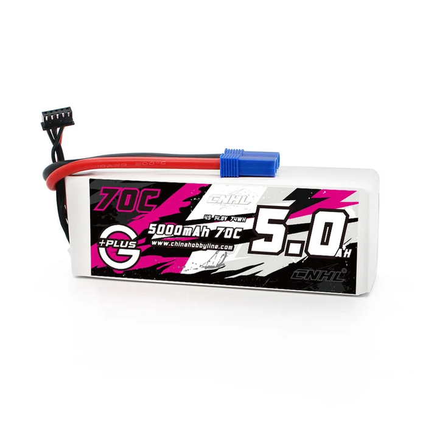&nbsp;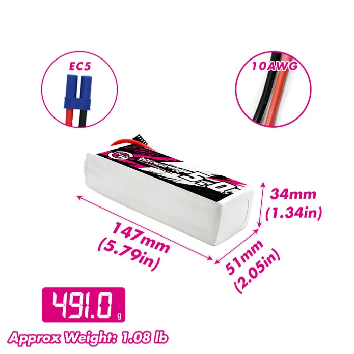 <em>pack · dimensions and weight</em> |
| 🔵 **CNHL Black Series 5000mAh 4S 65C (EC5)** — *plain LiPo, 35mm tall* | **Cells:** 4S / 14.8V **Capacity:** **5000mAh** (bottom of the window) **C-rating:** 65C continuous / 130C burst (marketing) **Weight:** **521g** (±5g) **Connector:** **EC5**, JST-XH balance, 10AWG **Size:** **147 × 51 × 35mm** **Price:** **$53.99** | Pro: **In the 5000-5400 window**, standard 14.8V so no HV charger needed, native EC5  Con: Lowest C of the CNHL line (fine for the 140A ESC, but it's the least punchy). No published weight or dimensions. **4 units left**. Untested | 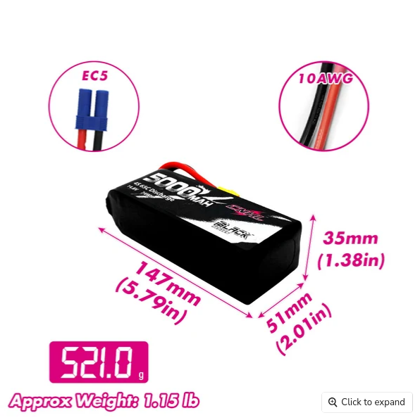 |
| 🔵 **Zeee 4S 5200mAh 50C hardcase (Deans)** — *alt 5200, hardcase* | **Cells:** 4S / 14.8V **Capacity:** 5200mAh (sweet spot) **C-rating:** 50C (marketing) **Weight:** **~480g** (hardcase) **Connector:** Deans (T-plug) **Size:** hardcase, verify vs CF tray **Price:** ~$49.99 | Pro: In the 5200 sweet spot, and the **hardcase adds crash/impact protection**  Con: Heavier than the soft-case 100C EC5 running pack, lower 50C rating, Deans plug (adapt to EC5). Often sold out | 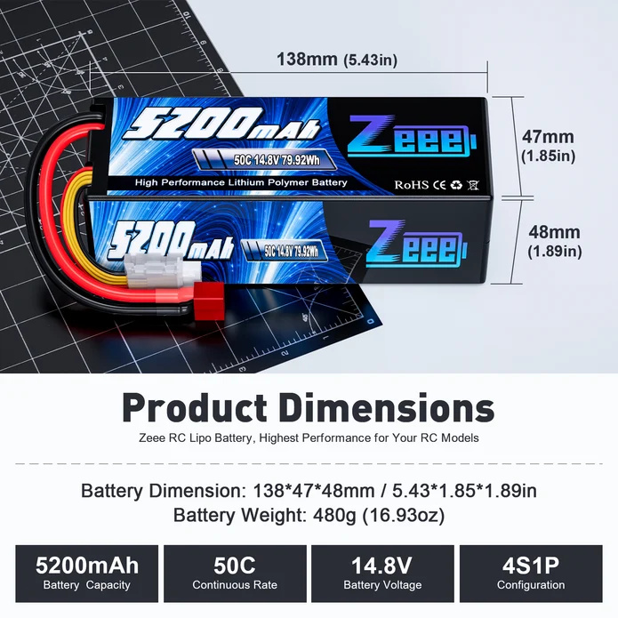 |
| 🔵 **Gens Ace Redline 2.0 4S HV 15.2V 6300mAh 140C** — *HV competition pack, in hand* | **Cells:** 4S HV / **15.2V** (4.35V/cell) **Capacity:** 6300mAh **C-rating:** 140C **Weight:** **452g** (light for a 6300 HV) **Connector:** 5.0mm bullet **Size:** hardcase, verify vs CF tray **Price:** **$107.38** (paid; list ~$127.71) | Pro: **Higher top speed** (HV 15.2V = more motor RPM than 14.8V). **Very light for its capacity** (452g for a 6300 HV). Low-IR competition pack, made for 1/8 racing  Con: **Pricey (~$128).** Felt like **softer torque but higher top speed** (see note, it's the delivery character + HV, not weight). Needs an **HV charger** and an ESC that tolerates 15.2V (17.4V full charge) | 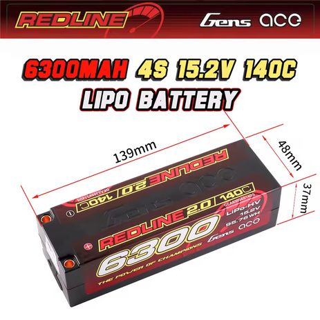 |
| 🚫 ~~**PowerHobby 4S 4200mAh 120C Graphene+ HV (EC5)**~~ , *301g, way under the floor, but tempting* | **Cells:** 4S1P / **15.2V LiHV** **Capacity:** 4200mAh (63.8Wh) **C-rating:** 120C / 240C burst (marketing) **Weight:** **301g** (10.6oz) **Connector:** **EC5** (XT90 and QS8 also sold) **Size:** **89 × 44 × 32.4mm** soft case **Price:** **$79.99** (SKU PHB4S4200120EC5) | Pro: **The lightest thing that would physically fit by a mile**, 119g under the floor and 217g under the pack running now. **212 Wh/kg**, far above anything else here. Tiny at 89mm long, LiHV, graphene, and EC5 native. Charge rate is capped at 2C, lower than the rest  Con: **Fails the weight window badly**, and that window exists because of exactly this. **A car this light goes uncontrolled in the air**, the same behaviour the RCTech thread below documents on ultra-light 1/8 builds. Also **$79.99 for 4200mAh**, the most expensive per mAh on the list. Worth playing with someday to see where the limit actually is, not worth building around |  🚧 save as `src/electronics_powerhobby_4s_4200_120c_hv.jpg` |
| 🚫 ~~**HCL-HP 4S 5200mAh 150C hardcase (52150-4S1P, SMC)**~~ — *558g, well over the window* | **Cells:** 4S / 14.8V **Capacity:** 5200mAh (true ±5%) **C-rating:** 150C (SMC true rate; **Power Factor 390**) **Weight:** **558g** (hardcase) **Connector:** SC5 (EC5/IC5 compatible) **Size:** **139 × 49 × 47mm** hardcase (L × W × H) **Price:** **$49.95 each** (bought **3**, $149.85) | Pro: **Absolute best performance of the bunch**, low IR gives strong acceleration/speed and stays cooler. 100% LCO cells. In the 5200 sweet spot, and SMC actually publishes an honest Power Factor / true C (see note)  Con: **Not durable, you have to baby it.** Fails early even with a high cutoff, and it doesn't like impacts or being shaken hard. One arrived **DOA (a defect)**, and the rest **didn't make it past ~20 charge cycles**, frail within 6 months despite following SMC's care rules. Hardcase adds weight (558g) | 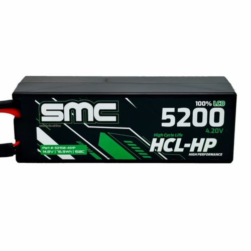 |
| 🚫 ~~**Zeee 4S 6000mAh 60C (Deans), soft case**~~ — *573g, the pack that set the too-heavy line* | **Cells:** 4S / 14.8V **Capacity:** 6000mAh **C-rating:** 60C (marketing) **Weight:** **573g** **Connector:** Deans (T-plug) **Size:** larger soft case **Price:** ~$69.59 | Pro: Longest run time of the bunch  Con: **Too heavy**, the extra mass hurts handling on this light chassis. Deans plug (would need adapting to the EC5 setup) | 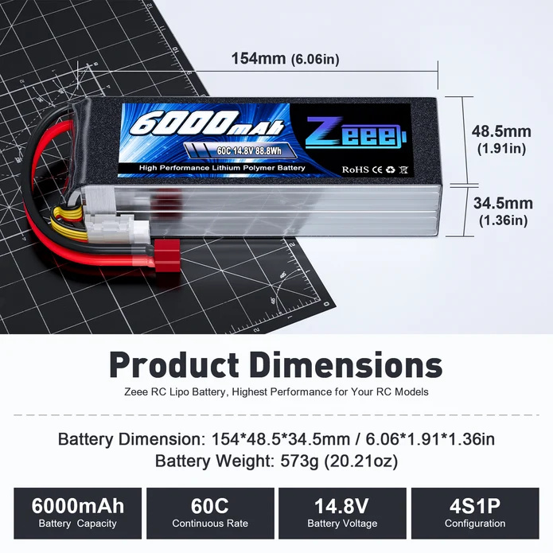 |

---

## The C-rating math (a fun sanity check)

Max continuous current a C-rating *claims* = **C × capacity (Ah)**. Run the numbers and the claim collapses, the pack's own lead wire would melt long before it hit that current.

| Pack | C-rate | Claimed continuous (C × Ah) | Lead wire | Wire's realistic RC ceiling |
|---|---|---|---|---|
| Zeee 5200 50C hardcase | 50C | 50 × 5.2 = **260A** | ~10-12 AWG | ~60-150A |
| Zeee 6000 60C | 60C | 60 × 6.0 = **360A** | ~12 AWG | ~40-100A |
| Zeee 5200 **100C** soft | 100C | 100 × 5.2 = **520A** | ~12 AWG | ~40-100A |
| Gens Ace 6300 **140C** | 140C | 140 × 6.3 = **882A** | 5.0mm bullet leads | ~150A |
| SMC HCL-HP 5200 **150C** | 150C | 150 × 5.2 = **780A** | **10 AWG** (per SMC) | ~60-150A |

**The punchline:** a "100C" 5200 claims **520A continuous**, but its ~12AWG lead taps out around **40-100A** in RC use. The HCL-HP's 150C implies **780A through a 10AWG wire** that realistically carries maybe **60-150A**. That's **5-10× over** what the wire can pass, the lead would glow and melt at a fraction of the rated C, never mind the cells, tabs, or connectors. For context, a car's starter cable (huge, short) moves a few hundred amps; these little silicone leads are not doing 500-880A.

So the headline C number is physically impossible to sustain, it's a **marketing power scale**, useful only within one brand (see the note below). The honest exception is **SMC's Power Factor** (390 on the HCL-HP), a real metric instead of a fantasy amp figure, even though their own "150C" label implies that impossible 780A.

---

## Notes

- **Brand-agnostic.** Any reputable 4S pack around 4000-5500mAh works, and it's a weight call before a capacity one, not a brand call.
- **Width is what actually eliminates packs here, not length.** The limit is **50mm** and nothing on the list is anywhere near the 163mm length ceiling. The **Lightning 5500, G+Plus 5000 and Black Series 5000 are all 51mm**, over by a millimetre, but **all three are soft case and a millimetre jams in fine**. It's only a real limit on a hard case, which can't give. So the width column rules out nothing currently on the list, and the **Ultra-Thin 6000 at 47mm** is the only hardcase with clearance to spare.
- **Too light is a real failure mode, not just too heavy.** Under the band the car goes odd in the air, motor torque starts steering it on a jump, so this is a window rather than a race to the lightest pack. The floor is what rules out the **PowerHobby 4200 HV at 301g**, which would otherwise be tempting: it's the lightest pack that fits and by far the best Wh/kg here. **The precedent is the RCTech thread ["1/8 buggy: how light is too light?"](https://www.rctech.net/forum/electric-off-road/) (Dec 2010)**, where the ultra-light builds were Losi 810s and Ofna NEXX8s. The line that matters: *"We had an AE engineer get his RC8 down to 5 lbs and was to hard to drive and handled and jumped weird."* Another poster reports the same on a Hot Bodies VE8 stripped too far, unpredictable handling with no springs light enough to match it.
- **The mechanism is the sprung to unsprung ratio, not the weight itself.** Tyres, wheels and foams have a floor you can't go under, so as the chassis gets lighter a bigger share of what's left is unsprung, and that's what wrecks handling. Stripping the car evenly would push the limit much lower.
- **Worth noting the thread isn't unanimous.** Several racers argue a nervous light car is a setup problem, springs, damping and foams, not a weight problem. So **420g is a judgement call informed by that thread, not a measured limit for this car.** It's also a battery figure standing in for a total car weight effect, which is a further step removed. Of the packs still in play the lightest is the **Gens Ace Redline at 452g**.
- **Case type matters here more than most tracks.** Meldrum is sandy and grit works its way into the tray, chafing the shrink wrap on soft packs. Of the shortlist the **Ultra-Thin 6000 and the Zeee 5200 50C are hardcase**; the Zeee 5200 100C running now, the Racing 5200, the Lightning 5500, the G+Plus and the Black Series are all soft. It doesn't outrank weight, but between two packs within a few grams it should decide.
- **Height ranks the shortlist as much as weight does.** On the packs with published dimensions: Lightning LiHV **31mm**, G+Plus **34mm**, Black Series **35mm**, Ultra-Thin and Racing both **37mm**. Everything here clears the 40mm ceiling that keeps packs swappable with Mike's Jato, and the 31 to 35mm group does it without forcing anything. Which specific packs are owned lives in the shared [battery tracker](../../batteries/README.md).
- **C-ratings are mostly marketing, don't cross-shop them between brands.** The advertised C rarely survives the math (true C × capacity would be an absurd current the pack can't actually deliver), so a "100C" from one brand is not the same as "100C" from another. C is only useful as a **relative power scale within one brand**: a 100C Zeee vs a 50C Zeee tells you something; a 100C Zeee vs a 100C Tattu tells you nothing. Buy on **brand reputation + capacity**, and treat C as an in-brand relative number only. At this capacity any reputable pack pushes plenty for the 140A MAX10 G2 regardless. **One honest exception: SMC** publishes a real **Power Factor** (e.g. 390 on the HCL-HP) and rates true-spec mAh / true factory C, which is a far better cross-brand yardstick than the usual inflated C numbers.
- **Performance vs durability, pick your poison.** The **SMC HCL-HP** is the best-performing pack I've run but the **least durable**, fails early, hates impacts/vibration, one died before its first charge, and **none lasted past ~20 charge cycles** (one was a straight **DOA defect**), frail inside 6 months even babied per SMC's rules. One DOA is a genuine dud, that happens to any brand and isn't a knock, but **the rest dying by ~20 cycles under different circumstances while following SMC's care rules is the pattern, a fundamental durability problem with the pack, not user handling**. The **Zeee 5200** gives up some peak punch but is the reliable daily pack. Also sold in a **3S variant (52150-3S1P, $37.95)** for 3S cars.
- **"6000 is too heavy" is really a weight rule, not a capacity rule.** It came from the **Zeee 6000 at 573g**, not from the mAh number. The **CNHL Ultra-Thin 6000 is 479g**, lighter than the 5200 currently in the car (518g). So it clears the intent of the rule while breaking the letter of it. Judge a pack on **grams and dimensions**, and treat 5000-5400 as the shorthand that usually gets you there.
- **CNHL packs skipped, and why:** Racing **6200mAh** 90C ($63.99) and Racing **6600mAh** 120C ($69.99) are 1P 6000+ packs with no published weight advantage, so they land on the wrong side of the weight rule. The Ultra-Thin is the exception, not the whole 6000 class. At the other end, Lightning LiHV **4500mAh** ($45.99) and **4000mAh** ($39.99) are below the window and run out too fast, same problem as the 4200.
- **Weight tracks chemistry here, not capacity.** Of the CNHL packs that publish a weight, the two **LiHV** ones are the light ones (Lightning 5500 = **472g**, Ultra-Thin 6000 = **479g**) while most of the standard LiPo packs sit near 520g: Racing **5200 = 524g** and Black Series **5000 = 521g**, both heavier than the Zeee 5200 already in the car (518g). **The G+Plus 5000 is the exception at 491g**, graphene construction, 30g under the Black Series for a dollar more, and the only standard LiPo here that gets close to LiHV territory. On watts per kilo it runs **151 Wh/kg** against 142 for the Black and 147 for the Racing, still well behind the LiHV pair at 177 and 190. So the cheap standard LiPo packs are the *worst* weight per mAh here, and the LiHV packs give more capacity for ~50g less. If weight is the deciding factor, the choice is LiHV, and the cost is needing HV charge mode. **Every pack in the table now publishes a weight**, so nothing is left unranked on the metric that decides this.
- **Footprints differ more than the capacities do.** Lightning 5500 = 149 × 51 × **31**, Ultra-Thin 6000 = 138 × 47 × **37**, Racing 5200 = **160** × 45 × 37. They fail a tight tray in different directions. The 5200 on length, the 5500 on width, the 6000 on height. Measure the CF tray in all three axes once and the list sorts itself.
- **Check the fit.** Confirm the pack's length/width/height clears the CF chassis battery tray and strap before committing to a size.
- **Connectors:** stock is **EC5**; **EC5 / XT60 / XT90** are all good, **avoid Deans / Tamiya**. The fleet is a mix of plugs, so keep adapters handy. See [`connector_reference.md`](connector_reference.md).
- **Charger:** all the on-hand chargers do **LiHV** (needed for the Gens Ace HV pack), charge at ~1C. Full list in [`charger_analysis.md`](charger_analysis.md).
- **Why the HV Gens Ace felt like less torque but more top speed (likely).** Two things, and neither is weight (at 452g it's actually **lighter** than the running Zeee 5200 soft at 518g). First, **HV (15.2V, 4.35V/cell) runs higher voltage than standard 14.8V**, and top speed scales with voltage (more motor RPM), so the top end climbs. Second, it's a **low-internal-resistance competition pack**, so it **sags less** than a cheaper pack. A pack that sags more gives a sharp voltage spike off the line that *feels* like a big torque hit, then droops; the Gens Ace holds voltage steady and delivers smoothly, so it **feels softer off the line while actually pulling harder up top**. So it trades that punchy initial hit for smoother, faster power, not a real loss of torque.
- **Weight reference (per pack):** Zeee 5200 100C soft **518g** · Zeee 5200 50C hardcase ~480g · Zeee 6000 60C 573g · SMC HCL-HP 5200 150C hardcase 558g · Gens Ace Redline 6300 HV 140C **452g**. Note the **Gens Ace is the lightest of the lot despite the most capacity + HV**, lighter than even the running Zeee 5200 soft (518g), that's the premium competition-pack difference. The cheap Zeee packs are heavy.
