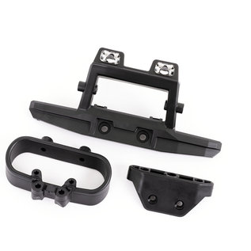

# Bumper Selection — FastAzJato4x4

> **Front + rear: leaning toward OEM Traxxas 9044 Front + Rear Skid Plates set ($7 for both pieces).** Sold as a single front+rear set — same part the K939 build already uses. Minimal-profile and dirt-cheap. Counterintuitive logic: gives almost no real impact protection, but **if the nose or tail hits the ground hard enough to matter, the car is going to cartwheel anyway**. A minimal bumper means the chassis end doesn't dig in — gives a chance to **throttle up and recover from a bad landing** instead of pivoting end-over.
>
> **You can't skip the bumpers entirely.** **The Traxxas bumpers retain the hinge pins on this chassis family** — without a bumper, the hinge pins migrate out of their bores and the arms come loose. Skipping them isn't a weight-saving option, it's a mechanical failure. They barely save any weight anyway.
>
> **Tempting front alternative: Rustler 4x4 front bumper (Traxxas TRA5435)** — slightly larger, doesn't extend past the wheels (or close to it), so it's still recovery-friendly. The blocker is **it's ugly**. Possible solve: **design a custom front wing mount / cosmetic shroud that integrates the Rustler bumper** so it looks intentional rather than retrofitted.

 <em>Traxxas TRA9044 Front + Rear Skid Plates — $7 for the set</em>

---

## Table of Contents

- [Key Requirements](#key-requirements)
- [Bumper Comparison](#bumper-comparison) — material families
- [Specific part-number options](#specific-part-number-options) — Slash / Rustler / Jato fits
- [Notes](#notes)

---

## Key Requirements

| Requirement | Type | Why |
|---|---|---|
| **Retains the hinge pins** | Must | **The Traxxas bumpers on this chassis family hold the front and rear hinge pins in their bores.** No bumper = pins migrate = arms come loose = car is dead. This is a hard mechanical requirement, not a crash-protection one |
| **Bolts to the CF chassis bumper mount holes** | Must | The chassis is Slash 4x4 pattern, bumpers must match those mount points |
| **Cheap** | Must | Bumpers double as skid plates on this build — they wear through use, not just crashes. Cheap = guilt-free replacement |
| **Doesn't put shocks in the crash path** | May | Already broke an HPI Vorza 97mm shock on a rear-end hit with the back-side-shock geometry — but tbh that crash was kind of a freak accident, not a routine failure mode. Worth avoiding if cheap to design around, but not a hard requirement |
| **Absorbs impact, doesn't transfer to chassis** | May | Same logic as the shock tower analysis — a sacrificial bumper is nice for chassis longevity but the chassis is already disposable (~$100 CF), so this is a "nice to have" not a hard requirement |
| **Survives most crashes intact** | May | Cheap to replace either way, but fewer trips to the workbench is nice |
| **Lightweight** | May | Bumpers sit low on the chassis (not the worst place for weight), and skipping them isn't viable for mechanical reasons anyway — small lever to optimize |
| **Looks intentional** | May | Cosmetics. Rustler front bumper crushes on protection but loses on looks — drives the custom-shroud idea |

---

## Bumper Comparison

| Material family | Status | Pros / Cons | Notes |
|---|---|---|---|
| **Traxxas stock plastic + foam** (Slash / Rustler / Jato family) | **Leading** | Pro: Cheap, light, sacrificial. Widely stocked at every hobby store. Matches the chassis class. **Multi-role: front bumper also takes ground hits as a quasi-skid; stock Jato rear skid plate replaces a separate rear bumper entirely**  Con: Cracks under hard impacts; needs occasional replacement | Same "cheap consumable" reasoning as the chosen Traxxas stock shock towers |
| ~~Aluminum / billet bumpers~~ | **Vetoed** | Pro: Won't break in normal crashes. **Weight isn't the issue here** — bumpers sit low on the chassis (unlike shock towers up high), so the CG / handling penalty for aluminum is small  Con: **Bends instead of breaking — and once bent, it stays bent and looks bad permanently.** Can't reshape aluminum back to factory by hand; you live with the crooked bumper or replace it (at much higher cost than a $5 plastic). Plus the chassis-cascade problem (transfers impact to the CF chassis instead of cracking sacrificially) — see [shock tower aluminum nuance](shock_tower_analysis.md#material-properties-reference) | — |
| ~~Carbon fiber bumpers~~ | **Vetoed** | Pro: Stiff, light  Con: Brittle failure mode — when CF bumpers break, they explode and transfer the rest of the energy to the chassis. Worst of both worlds for the role bumpers play | — |
| ~~Skipping the bumpers entirely~~ | **Ruled Out** | Pro: "Saves weight"  Con: **Not actually a weight-savings option — the Traxxas bumpers retain the hinge pins on this chassis family.** No bumper = pins migrate out = arms come loose. Cars die from this. And weight savings is minimal anyway since the bumpers are tiny plastic parts | — |

---

## Specific part-number options

The Slash 4x4 / Rustler 4x4 / Jato 4x4 family share the same bumper mount pattern, so a wide range of Traxxas (and RPM aftermarket) part numbers work.

### OEM set — front + rear together (the leading default)

| Part | Spec | Status | Pros / Cons | Photo / Link |
|---|---|---|---|---|
| **TRA9044 — Traxxas Front + Rear Skid Plates** | Material: glass-filled nylon Coverage: front + rear (pair) Native fit: Jato 4x4 / Slash 4x4 family Price: **$7.00** for the set | **Leading** | Pro: Sold as a single set with both pieces — same part the [K939 build](../K939/README.md) already uses. Minimal profile, light, cheap, holds the hinge pins. Default pick  Con: Minimal impact protection (intentional, per the recovery-focused logic above) |  |
| **TRA6736 + TRA6737 — Rustler 4x4 BL-2s Front + Rear Bumpers** | Material: glass-filled nylon Coverage: front (6736) + rear (6737) pair Native fit: Rustler 4x4 BL-2s Price: ~$5 (Jenny's RC, pulled from new) | Candidate | Pro: Front+rear set, same as TRA9044 approach. Standard non-LED bumper. Pulled from new models at Jenny's RC for cheap  Con: Availability limited (sold out at time of writing — notify when available). Rustler 4x4 BL-2s specific, verify mount compatibility with CF chassis |  |

### Front bumper alternatives

| Part | Spec | Status | Pros / Cons | Photo / Link |
|---|---|---|---|---|
| **TRA6736 — Rustler 4×4 Front Bumper + Support** | Material: glass-filled nylon Native fit: Rustler 4×4 Price: **$6.00** | Candidate | Pro: Cheap OEM front bumper with support included. Standard non-LED version  Con: Minimal impact protection, same profile as other stock bumpers |  |
| ~~**TRA5535 — Traxxas original 2WD Jato front bumper**~~ | Material: glass-filled nylon Native fit: 2WD Jato (NOT 4x4 — holes don't line up) Price: **$4.50** (back order) | Vetoed | Pro: Cheap  Con: Holes don't line up — needs drilling. **4x4-native equivalents exist** (TRA6736, TRA6797, RPM 81042); no reason to drill a 2WD part |  |
| **RPM 81042 — Jato 4×4 / Rustler 4×4 Wide Front Bumper** | Material: RPM reinforced composite (flexible, returns to shape) Native fit: **Stampede 4×4, Rustler 4×4, Telluride, Jato 4×4** Replaces: stock #6735 & #6736 Price: **$9.95** | Candidate | Pro: **Native Jato 4×4 fit** — drops straight in, no geometry question. Absorbs impact and returns to original shape. Protects front diff and chassis. Cheap. Incorporates mount points for stock upper bumper  Con: Wide profile — may conflict with recovery-focused landing logic (same concern as TRA6835). Eliminates stock upper bumper support on Rustler 4×4 |  |
| **TRA6797 — Rustler 4×4 Front Bumper w/LED Lights** | Material: glass-filled nylon Native fit: Rustler 4×4 Requires: TRA6588 power supply Price: **$14.95** | Candidate | Pro: LED lights are a functional nice-to-have for night running. Same mounting geometry as other Rustler front bumpers  Con: Requires TRA6588 Accessory Power Supply (additional cost). LED wiring adds complexity |  |
| **TRA6736X — Rustler 4×4 Front LED Bumper + Support (replacement)** | Material: glass-filled nylon Native fit: Rustler 4×4 (fits 6795 LED Light Kit) Price: **$10.00** | Candidate | Pro: Same LED-compatible bumper housing as TRA6797 at lower cost — good if you already have LEDs or just need the plastic piece. Replacement part for the 6795 kit  Con: Bumper only — no LEDs included. Requires separate LED + power supply to light up |  |
| ~~**RPM 80022 — Slash 4x4 Front Bumper + Skid Plate**~~ | Material: RPM reinforced composite Native fit: Slash 4x4 (LCG + non-LCG) Price: ~$15-20 | Ruled Out | Pro: RPM flexible composite, modular skid plate  Con: **Slash 4x4-specific geometry — wrong platform.** RPM 81042 is the native-fit version for the Jato 4×4. Order 81042, not this |  |
| ~~TRA6835 — Traxxas Slash 4x4 front bumper + mount~~ | Material: glass-filled nylon Native fit: Slash 4x4 chassis pattern Price: ~$8 | Vetoed (for this build) | Pro: **Best impact protection of any OEM bumper here** — large profile actually absorbs hits and keeps the front end intact. **Great offensive tool** if you're racing wheel-to-wheel — the broad face is perfect for nudging another car off-balance and flipping them. **Good for beginners** — newer drivers crash more, and the extra protection means more time driving and less time replacing broken parts  Con: Larger profile = **near-vertical-landing recovery is nearly impossible** — the bumper catches the ground and pivots the car end-over before you can throttle out. Wrong direction for this build's recovery-focused logic, but absolutely the right pick if your priorities are different |  |

### Rear bumper alternatives

The OEM TRA9044 set already covers the rear. These are options if you want to upgrade just the rear piece while keeping the TRA9044 front, or swap to a different rear style.

| Part | Spec | Status | Pros / Cons | Photo / Link |
|---|---|---|---|---|
| **TRA6737X — Rustler 4×4 Rear LED Bumper + Support (replacement)** | Material: glass-filled nylon Native fit: Rustler 4×4 (fits 6795 LED Light Kit) Price: **$10.00** | Candidate | Pro: Rear counterpart to TRA6736X — same LED-compatible housing at the back. Good if you need just the plastic piece for the 6795 kit  Con: Bumper only — no LEDs included. Requires separate LED + power supply to light up | &nbsp; <em>product shot · mount view</em> |
| **TRA6836 — Traxxas Slash 4x4 rear bumper + mount** | Material: glass-filled nylon Native fit: Slash 4x4 chassis pattern Price: ~$8 | Candidate | Pro: Bigger / sturdier than the TRA9044 rear piece. Matches the Slash 4x4 front (TRA6835) if going the full Slash look. Required by [STRC backflash conversion](aero_analysis.md#shock-tower-compatibility-cascade) if that path is chosen  Con: Larger profile + extra weight at the rear; cosmetics tie you into the Slash 4x4 look |  |
| **RPM 80122 — Slash 4x4 Rear Bumper** | Material: black nylon (RPM reinforced composite) Native fit: Slash 4x4 (LCG + non-LCG) Price: ~$12-15 | Candidate (premium aftermarket) | Pro: RPM's bulletproof composite — survives hits that crack Traxxas OEM. Pairs with the RPM 80022 front for a full RPM front+rear black bumper set  Con: Pricier than OEM; locks in the Slash look |  |

> Verify exact fit with the chosen AliExpress CF chassis before ordering. Mount-hole spacing is the key check. **TRA9044 ships as a pair (front + rear) and is the cheapest path** — the alternatives are for specific upgrades, not replacements for the OEM set in the general case.

---

## Notes

- **Hinge-pin retention is the hard requirement.** The Traxxas Slash 4x4 / Jato 4x4 family of bumpers includes integrated retainers that hold the front and rear arm hinge pins in their bores. **Skipping the bumpers is not viable** — pins walk out, arms come loose, car dies. This is the Must that locks bumpers into the BOM regardless of any crash-protection argument.
- **Recovery-focused logic on the front bumper:** a Jato 4x4 hitting nose-first hard enough to need a bumper is already in a bad landing. The bumper's job here isn't to absorb the impact — it's to **not catch the ground and trigger a cartwheel** before you can power out of it. Smaller bumper = less ground contact = better chance to throttle through and save the run.
- **Why no premium / aftermarket bumpers:** the chassis is intended as disposable (~$100 CF). Spending $40-60 on premium bumpers for a chassis you might crash-replace is upside-down value.
- **Minimal-bumper choice is a calculated risk, not "the chassis is disposable":** the CF chassis is genuinely durable, especially on a light build like this where total kinetic energy in a crash is lower than a heavy 1/8 truck. The chosen TRA9044 minimal-profile bumpers accept some chassis-hit risk in exchange for cartwheel recovery — but the **hope is that arms (which bend and reshape) absorb most of the hits before they reach the chassis** (see [`chassis_analysis.md`](chassis_analysis.md#notes) and [`arm_analysis.md`](arm_analysis.md)). So bumpers being cheap matters more than them being strictly sacrificial in the shock-tower sense.
- **Custom front-bumper / wing-mount integration (TODO):** a custom front-end shroud / wing mount that integrates a front bumper would be worth a 3D print. Tracked in [3D Models](README.md#3d-models). Goal: keep better protection geometry while making it look like an intentional part of the car rather than a retrofit.
- **Photos:** TRA9044 set photo wired in (shared with the K939 build's same part).
