# Bumper Selection — FastAzJato4x4

> **Front + rear: leaning toward OEM Traxxas 9044 Front + Rear Skid Plates set ($7 for both pieces).** Sold as a single front+rear set, same part the K939 build already uses. Minimal-profile and dirt-cheap. Counterintuitive logic: gives almost no real impact protection, but **if the nose or tail hits the ground hard enough to matter, the car is going to cartwheel anyway**. A minimal bumper means the chassis end doesn't dig in, gives a chance to **throttle up and recover from a bad landing** instead of pivoting end-over.
>
> **You can't skip the bumpers entirely.** **The Traxxas bumpers retain the hinge pins on this chassis family**, without a bumper, the hinge pins migrate out of their bores and the arms come loose. Skipping them isn't a weight-saving option, it's a mechanical failure. They barely save any weight anyway.
>
> **Tempting front alternative: Rustler 4x4 front bumper (Traxxas TRA5435)**, slightly larger, doesn't extend past the wheels (or close to it), so it's still recovery-friendly. The blocker is **it's ugly**. Possible solve: **design a custom front wing mount / cosmetic shroud that integrates the Rustler bumper** so it looks intentional rather than retrofitted.

 <em>Traxxas TRA9044 Front + Rear Skid Plates, $7 for the set</em>

---

## Table of Contents

- [Key Requirements](#key-requirements)
- [Bumper Options](#bumper-options) — OEM set, front alternatives, rear alternatives
- [Notes](#notes)

---

## Key Requirements

| Requirement | Type | Why |
|---|---|---|
| **No integrated front LEDs** | Must | Front bumper takes direct hits, LEDs in the bumper get destroyed immediately. Lights belong elsewhere, not in the impact zone |
| **Retains the hinge pins** | Must | **The Traxxas bumpers on this chassis family hold the front and rear hinge pins in their bores.** No bumper = pins migrate = arms come loose = car is dead. This is a hard mechanical requirement, not a crash-protection one |
| **Bolts to the CF chassis bumper mount holes** | Must | The chassis is Slash 4x4 pattern, bumpers must match those mount points |
| **Cheap** | Must | Bumpers double as skid plates on this build, they wear through use, not just crashes. Cheap = guilt-free replacement |
| **Doesn't put shocks in the crash path** | May | Already broke an HPI Vorza 97mm shock on a rear-end hit with the back-side-shock geometry, but tbh that crash was kind of a freak accident, not a routine failure mode. Worth avoiding if cheap to design around, but not a hard requirement |
| **Absorbs impact, doesn't transfer to chassis** | May | Nice for chassis longevity, but the extended FLM arms are the primary fuse, they bend before real chassis damage occurs. This is a "nice to have" not a hard requirement |
| **Survives most crashes intact** | May | Cheap to replace either way, but fewer trips to the workbench is nice |
| **Lightweight** | May | Bumpers sit low on the chassis (not the worst place for weight), and skipping them isn't viable for mechanical reasons anyway, small lever to optimize |
| **Looks intentional** | May | Cosmetics. Rustler front bumper crushes on protection but loses on looks, drives the custom-shroud idea |

---

## Bumper Options

### OEM set — front + rear together (the leading default)

> *Spec format: Type · Material · Position · Fits · Includes · Weight · Price*

| Part | Spec | Pros / Cons | Photo / Link |
|---|---|---|---|
| ⭐ **TRA9044, Traxxas Front + Rear Skid Plates** | **Type:** Skid plates (pair) **Material:** glass-filled nylon **Position:** Front + rear **Fits:** Jato 4x4 / Slash 4x4 family **Includes:** N/A **Weight:** N/A **Price:** **$7.00** for the set | Pro: Sold as a single set with both pieces, same part the [K939 build](../K939/README.md) already uses. Minimal profile, light, cheap, holds the hinge pins. Default pick  Con: Minimal impact protection (intentional, per the recovery-focused logic above) |  |
| 🔵 **TRA6736 + TRA6737, Rustler 4x4 BL-2s Front + Rear Bumpers** | **Type:** Bumpers (pair) **Material:** glass-filled nylon **Position:** Front (6736) + rear (6737) **Fits:** Rustler 4x4 BL-2s **Includes:** N/A **Weight:** N/A **Price:** ~$5 (Jenny's RC, pulled from new) | Pro: Front+rear set, same as TRA9044 approach. Standard non-LED bumper. **Rustler bumpers are good at protecting the shocks, the front bumper perfectly guards the front shocks.** Pulled from new models at Jenny's RC for cheap  Con: **Not discontinued, in stock on AliExpress**, so limited availability isn't a worry. Rustler 4x4 BL-2s specific, verify mount compatibility with CF chassis | 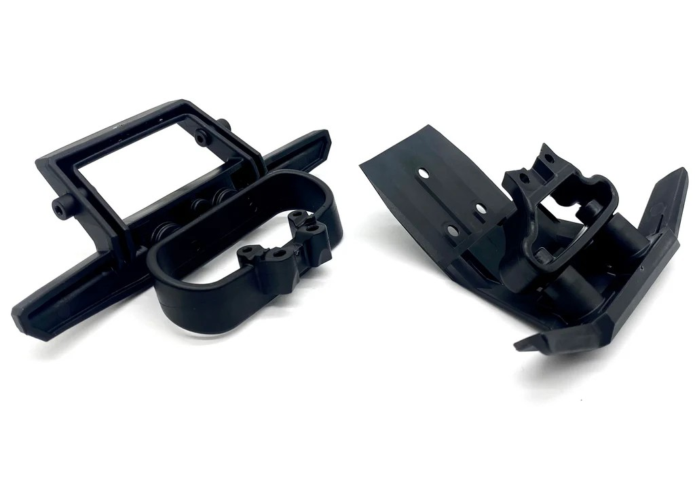 |

### Front bumper alternatives

| Part | Spec | Pros / Cons | Photo / Link |
|---|---|---|---|
| 🔵 **TRA6736, Rustler 4×4 Front Bumper + Support** | **Type:** Front bumper + support **Material:** glass-filled nylon **Position:** Front **Fits:** Rustler 4×4 **Includes:** front bumper + support **Weight:** N/A **Price:** **$6.00** | Pro: Cheap OEM front bumper with support included. Standard non-LED version. **Good at protecting the front shocks**  Con: Same profile as other stock bumpers, light frontal protection beyond shielding the shocks | 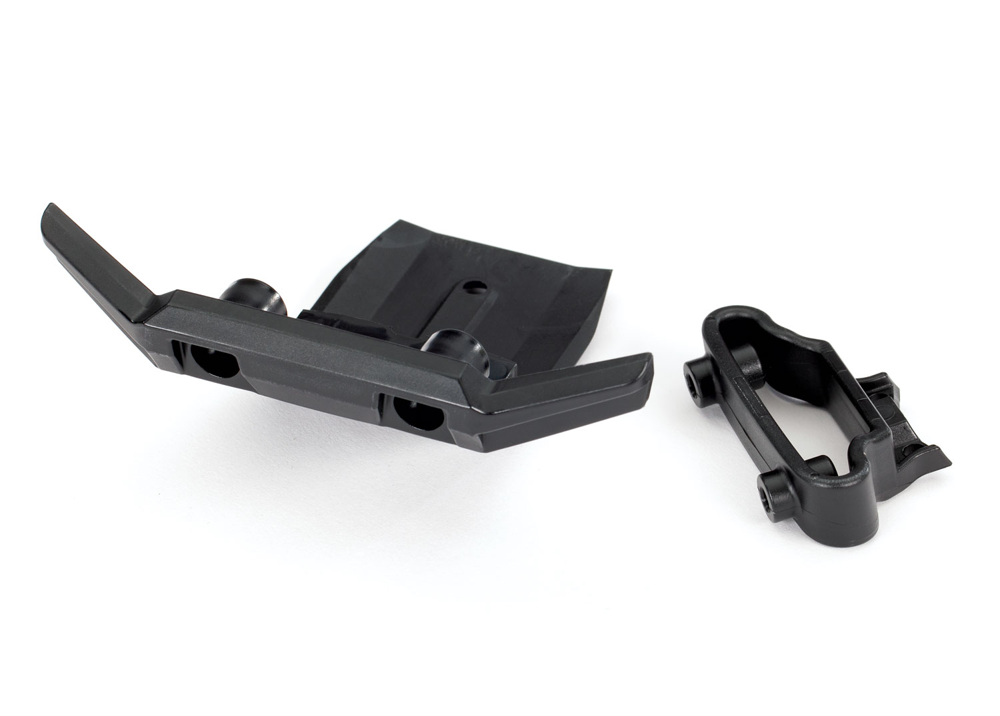 |
| 🔵 **RPM 81042, Jato 4×4 / Rustler 4×4 Wide Front Bumper** | **Type:** Wide front bumper **Material:** RPM reinforced composite (flexible, returns to shape) **Position:** Front **Fits:** **Stampede 4×4, Rustler 4×4, Telluride, Jato 4×4** **Includes:** mount points for stock upper bumper **Weight:** N/A **Price:** **$9.95** | Pro: **Native Jato 4×4 fit**, drops straight in, no geometry question. Absorbs impact and returns to original shape. **Good at protecting the front shocks**, plus the front diff and chassis. Cheap. Incorporates mount points for stock upper bumper. Replaces stock #6735 & #6736  Con: Wide profile, may conflict with recovery-focused landing logic (same concern as TRA6835). Eliminates stock upper bumper support on Rustler 4×4 | 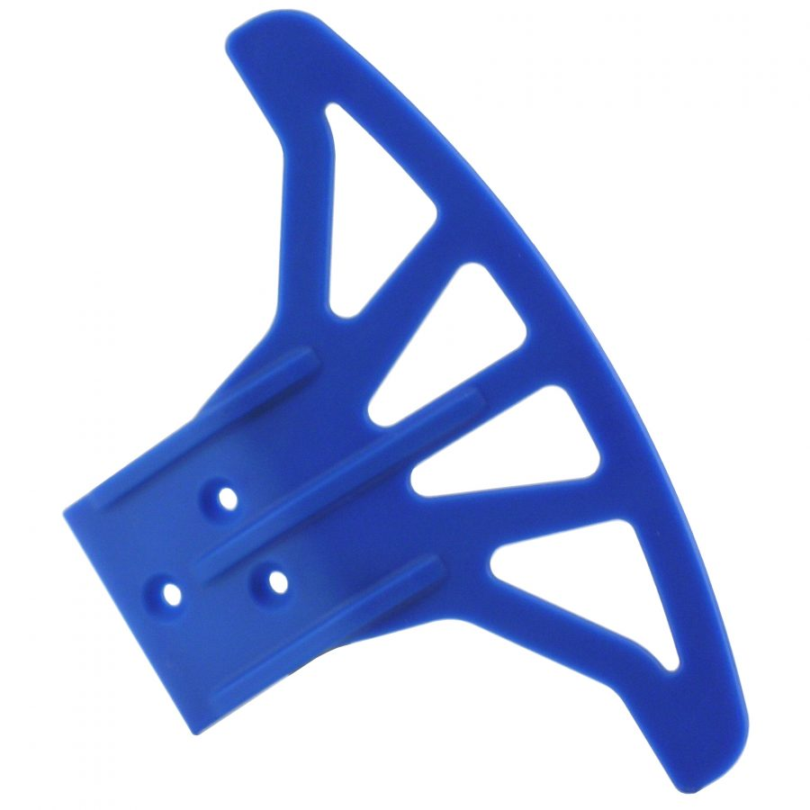 |
| ❌ ~~**TRA5535, Traxxas original 2WD Jato front bumper**~~ | **Type:** Front bumper **Material:** glass-filled nylon **Position:** Front **Fits:** 2WD Jato (NOT 4x4, holes don't line up) **Includes:** N/A **Weight:** N/A **Price:** **$4.50** (back order) | Pro: Cheap  Con: Holes don't line up, needs drilling. **4x4-native equivalents exist** (TRA6736, TRA6797, RPM 81042); no reason to drill a 2WD part | 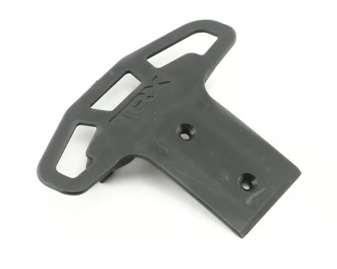 |
| ❌ ~~**RPM 80025, Slash 4×4 Front Bumper + Skid Plate**~~ | **Type:** Front bumper + skid plate (3-piece: skid mount + skid plate + bumper) **Material:** RPM reinforced composite **Position:** Front **Fits:** Slash 4×4 (replaces #6835) **Includes:** 3-piece: skid mount + skid plate + bumper **Weight:** N/A **Price:** **$15.95** | Pro: **Best aftermarket bumper**, simpler than OEM, eliminates support ring + 4 screws. Modular: remove bumper and run skid plate only (saves 27g) for racing, reinstall for bashing. Light canister compatible (RPM #80982/80983) for night running without LEDs in impact zone  Con: Same cartwheel issue as TRA6835, wide profile catches the ground on nose-first landings | 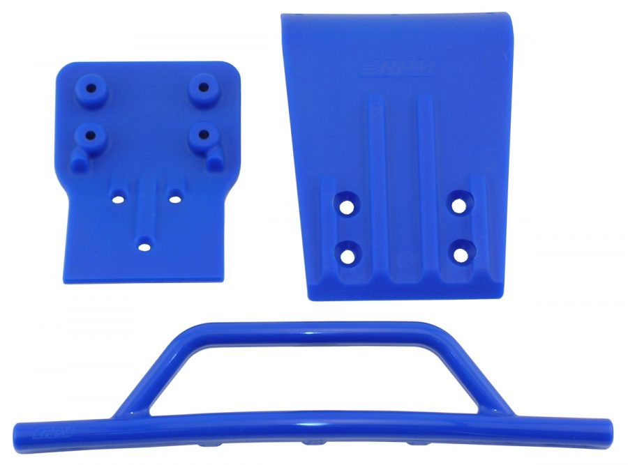 |
| ❌ ~~**RPM 80022, Slash 4x4 Front Bumper + Skid Plate**~~ | **Type:** Front bumper + skid plate **Material:** RPM reinforced composite **Position:** Front **Fits:** Slash 4x4 (LCG + non-LCG) **Includes:** N/A **Weight:** N/A **Price:** ~$15-20 | Pro: RPM flexible composite, lots of protection, modular skid plate. Good for nudging stuck/rolled cars back over in pack racing  Con: Wide profile catches the ground on nose-first landings and triggers cartwheels, same reason as TRA6835 | 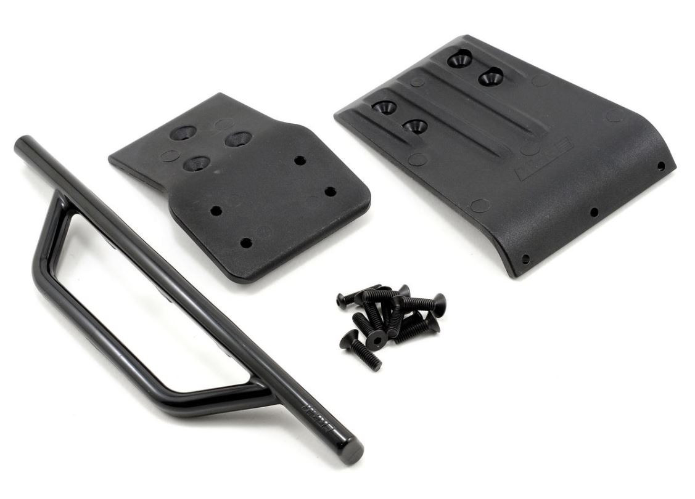 |
| ❌ ~~**TRA6797, Rustler 4×4 Front Bumper w/LED Lights**~~ | **Type:** Front bumper w/ LEDs **Material:** glass-filled nylon **Position:** Front **Fits:** Rustler 4×4 **Includes:** N/A **Weight:** N/A **Price:** **$14.95** | Pro: Night running visibility  Con: Requires TRA6588 power supply. **Front bumper takes direct hits, LEDs get destroyed immediately.** Fails the no-front-LED Must requirement | 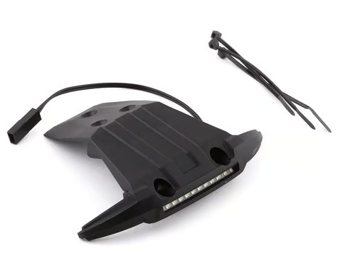 |
| ❌ ~~**TRA6736X, Rustler 4×4 Front LED Bumper + Support (replacement)**~~ | **Type:** Front LED bumper + support **Material:** glass-filled nylon **Position:** Front **Fits:** Rustler 4×4 (fits 6795 LED Light Kit) **Includes:** front LED bumper + support **Weight:** N/A **Price:** **$10.00** | Pro: Cheaper LED-housing option  Con: **Same problem as TRA6797, LEDs in the impact zone get destroyed immediately.** Fails the no-front-LED Must requirement | 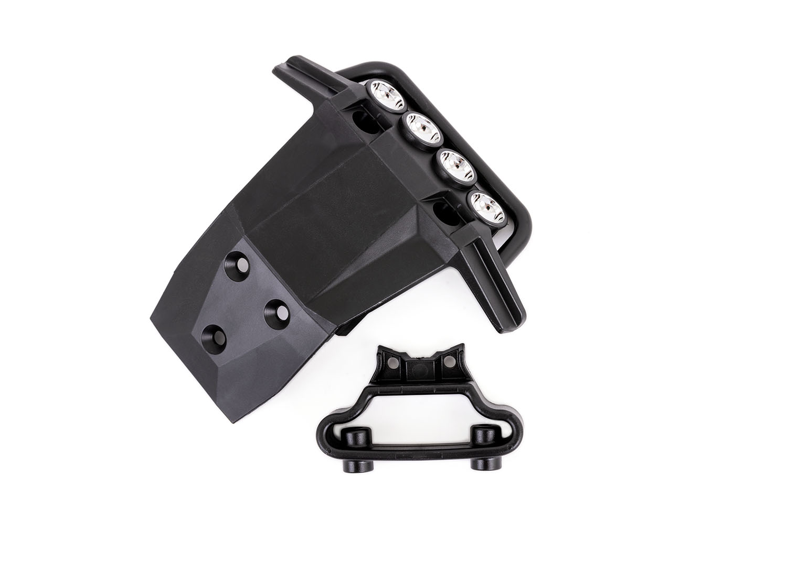 |
| ❌ ~~TRA6835, Traxxas Slash 4x4 front bumper + mount~~ — *(for this build)* | **Type:** Front bumper + mount **Material:** glass-filled nylon **Position:** Front **Fits:** Slash 4x4 chassis pattern **Includes:** bumper + mount **Weight:** N/A **Price:** ~$8 | Pro: **Best impact protection of any OEM bumper here**, large profile actually absorbs hits and keeps the front end intact. **Useful in pack racing**, broad face is good for nudging a stuck or rolled car back over without having to stop. **Good for beginners**, newer drivers crash more, and the extra protection means more time driving and less time replacing broken parts  Con: Larger profile = **near-vertical-landing recovery is nearly impossible**, the bumper catches the ground and pivots the car end-over before you can throttle out. Wrong direction for this build's recovery-focused logic, but absolutely the right pick if your priorities are different | 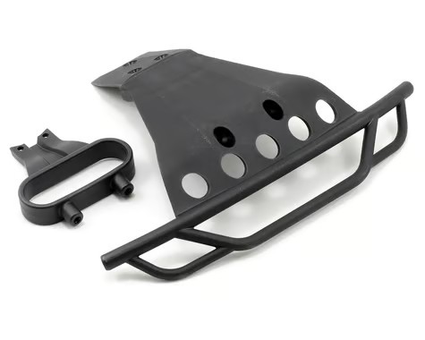 |

### Rear bumper alternatives

The OEM TRA9044 set already covers the rear. These are options if you want to upgrade just the rear piece while keeping the TRA9044 front, or swap to a different rear style.

| Part | Spec | Pros / Cons | Photo / Link |
|---|---|---|---|
| ❌ ~~**Aluminum Rear Bumper Mount, Rustler 4×4 (6823/6737 compatible)**~~ | **Type:** Rear bumper mount **Material:** Aluminum **Position:** Rear **Fits:** Rustler 4×4 (6823/6737 compatible) **Includes:** N/A **Weight:** N/A **Price:** $7.99 + $9.00 shipping (~$17 total) | Pro: Stiffer than plastic, won't sand down  Con: Seller: crazyracer (eBay). **Unnecessary weight, and misses the point.** The front plastic bumper always wears first, ground contact sands it down faster than the rear. Since bumpers come as a front+rear pair, when the front wears out you buy a new set anyway and get a fresh rear for free. Upgrading just the rear to aluminum adds weight without solving anything. Would only make sense if the front bumper was sold individually | 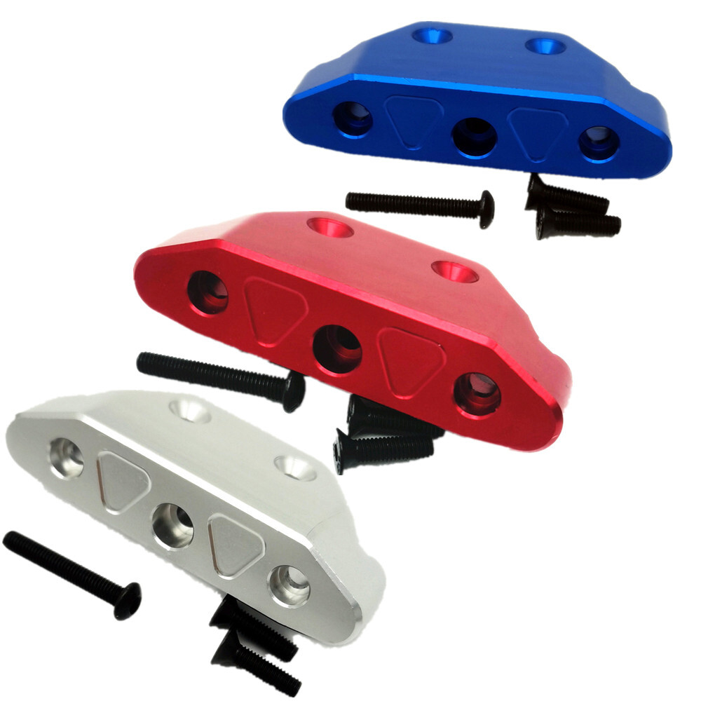 |
| ❌ ~~**TRA6737X, Rustler 4×4 Rear LED Bumper + Support (replacement)**~~ | **Type:** Rear LED bumper + support **Material:** glass-filled nylon **Position:** Rear **Fits:** Rustler 4×4 (fits 6795 LED Light Kit) **Includes:** rear LED bumper + support **Weight:** N/A **Price:** **$10.00** | Pro: Has a bottom skid plate component that could theoretically be used on its own  Con: Why spend money on this when Jato 4x4 front+rear bumpers come as a cheap pair, just buy the native set | 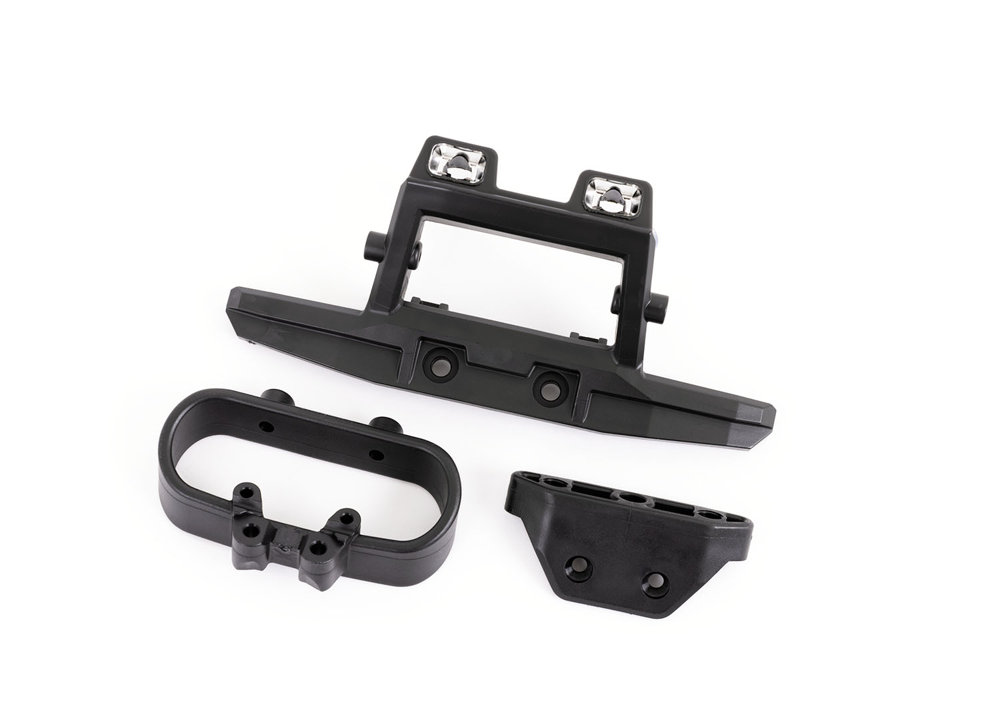 |
| ❌ ~~**TRA6836, Traxxas Slash 4x4 rear bumper + mount**~~ | **Type:** Rear bumper + mount **Material:** glass-filled nylon **Position:** Rear **Fits:** Slash 4x4 chassis pattern **Includes:** bumper + mount **Weight:** N/A **Price:** ~$8 | Pro: Bigger / sturdier than TRA9044 rear piece  Con: Too large, interferes with wheel/wing mounts. **Could be trimmed down to just the small skid/bumper piece, but what's the point when you can just get the Jato 4x4 bumper anyway** | 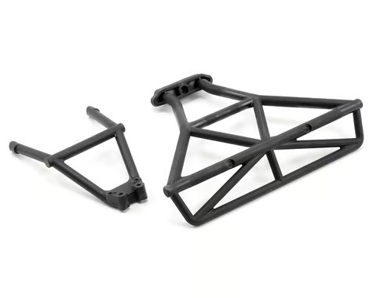 |
| ❌ ~~**RPM 80122, Slash 4x4 Rear Bumper**~~ | **Type:** Rear bumper **Material:** RPM reinforced composite **Position:** Rear **Fits:** Slash 4x4 (LCG + non-LCG) **Includes:** N/A **Weight:** N/A **Price:** ~$12-15 | Pro: RPM bulletproof composite  Con: Too large, interferes with wheel/wing mounts. Wrong platform on top of it. **Could be trimmed down to just the small skid/bumper piece, but what's the point when you can just get the Jato 4x4 bumper anyway** | 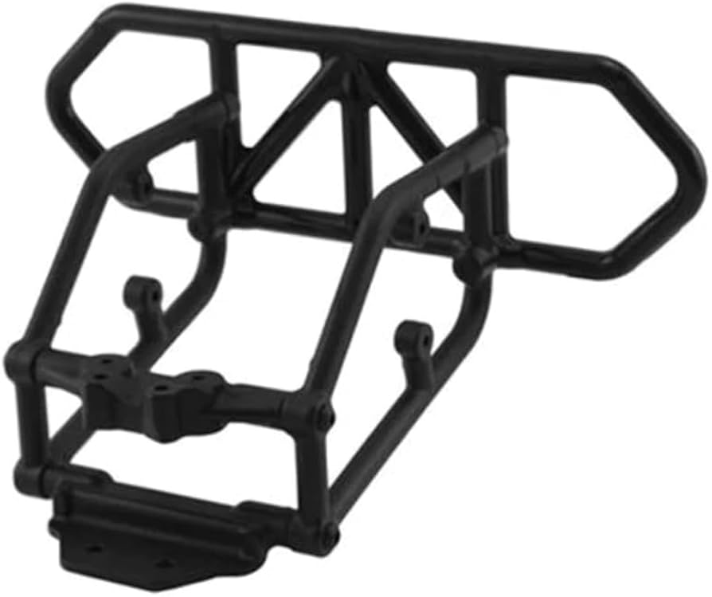 |

> **TRA9044 ships as a pair (front + rear) and is the cheapest path**, the alternatives are for specific upgrades, not replacements for the OEM set in the general case.

---

## Notes

- **Hinge-pin retention is the hard requirement.** The Traxxas Slash 4x4 / Jato 4x4 family of bumpers includes integrated retainers that hold the front and rear arm hinge pins in their bores. **Skipping the bumpers is not viable**, pins walk out, arms come loose, car dies. This is the Must that locks bumpers into the BOM regardless of any crash-protection argument.
- **Recovery-focused logic on the front bumper:** a Jato 4x4 hitting nose-first hard enough to need a bumper is already in a bad landing. The bumper's job here isn't to absorb the impact, it's to **not catch the ground and trigger a cartwheel** before you can power out of it. Smaller bumper = less ground contact = better chance to throttle through and save the run.
- **Why no premium / aftermarket bumpers:** the extended FLM arms bend before real chassis damage occurs, the chassis is not disposable, it's protected. Spending $40-60 on premium bumpers on top of that is upside-down value.
- **Minimal-bumper choice is a calculated risk:** the CF chassis is durable and the FLM extended arms are the intended fuse, they bend and reshape, absorbing hits before they reach the chassis. The chosen TRA9044 minimal-profile bumpers accept some chassis-hit risk in exchange for cartwheel recovery. Cheap bumpers matter because they're consumables, not because the chassis is expendable (see [`chassis_analysis.md`](chassis_analysis.md#notes) and [`arm_analysis.md`](arm_analysis.md)).
- **Custom front-bumper / wing-mount integration (TODO):** a custom front-end shroud / wing mount that integrates a front bumper would be worth a 3D print. Tracked in [3D Models](README.md#3d-models). Goal: keep better protection geometry while making it look like an intentional part of the car rather than a retrofit.
- **Photos:** TRA9044 set photo wired in (shared with the K939 build's same part).
