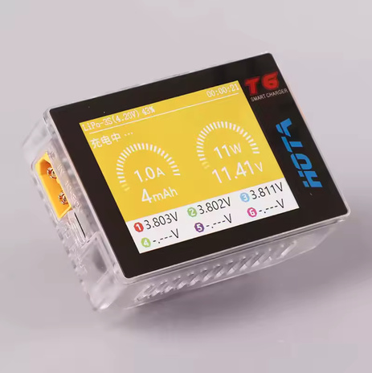
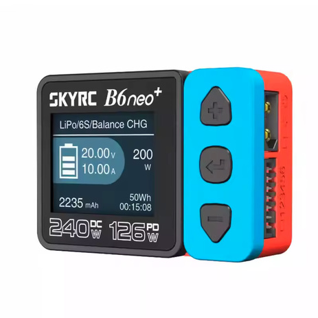
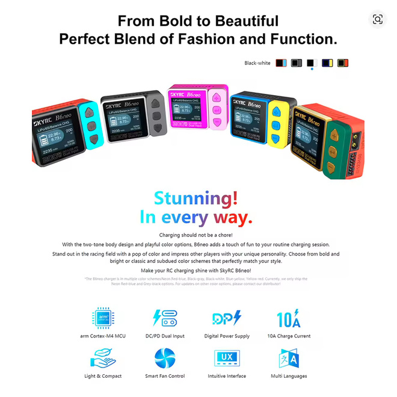
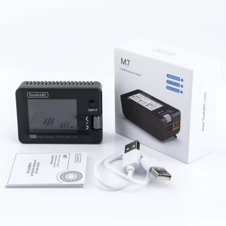

# Charger Selection — FastAzJato4x4

> **Plenty on hand, all modern smart chargers that do LiHV** (needed for the [Gens Ace HV pack](battery_analysis.md)) and **all good options.** The **SKYRC B6ACneo** is the grab-and-go (AC built in, no PSU); the DC ones run off any 12-24V supply / USB-C PD source. At 4S 5200-6300, charge at ~1C (5-6A), any of these handles that easily.

---

## Chargers on hand

> *Spec format: Chemistries · Cells · Power (DC / AC / PD) · Channels · Max current · Interfaces · Price*

| Charger | Spec | Notes |
|---|---|---|
| ⭐ **HOTA T6** | **DC 300W / PD 90W**, **dual channel**, 1-6S, LiHV XT60 + USB-C in, 2.4" IPS | **The current best**, dual channel (two packs at once), and somehow **cheaper than the SKYRC neos while being stronger**, with all the features. Needs a DC/PD source. No color options, unlike the neos (minor). Have two of these.  |
| 🟢 **SKYRC B6ACneo** | DC 200W / **AC 60W** / 10A, 1-6S, LiPo/LiFe/LiIon/**LiHV**/NiMH/NiCd/Pb | **The only one you can plug straight into the wall (AC)**, no PD brick or supply needed. Grab-and-go for quick charges |
| 🟢 **SKYRC B6neo+** | DC 240W / PD 126W, 1-6S, LiHV | Same as the B6neo but **240W vs 200W**, otherwise identical. **Easy to use and relatively cheap** (though the T6 is cheaper and stronger). Was the best charger when it launched in **2023**; the HOTA T6 now beats it on features. Needs a DC/PD source.  |
| 🟢 **SkyRC B6neo** (Global Ltd, SK-100198) | DC 200W / PD 80W, 1-6S, LiHV 70×50×32mm, 150g, CE | The original B6neo, same as the B6neo+ bar the **200W** rating. Tiny/portable, easy to use, cheap. DC/PD source needed.  |
| 🔵 **ToolkitRC M7** | DC 200W / 10A, 1-6S, LiHV + voltage/servo checker, ESC tester, RX test, LCD IPS | One of the **original** chargers. **Will charge anything, even a very low cell, as long as it can detect the cell** (great for reviving packs), but that's a double-edged sword since charging over-discharged cells can be **unsafe**. Power from an external PSU or **straight off a 12V car battery via alligator clips**; USB input is **Type-A (both ends)**. Plus a pile of bench-test tools.  |

---
## Charging accessories on hand

| Item | Use |
|---|---|
| **Parallel charging board** (XT90 / XT60 / EC5 / EC3 / XT30 / T, 6S) | Charge several packs in parallel off one channel |
| **USB-C PD trigger boards** (PD/QC decoy, 9/12/15/20V) | Pull fixed PD voltage from USB-C bricks to feed a DC charger |
| **Balance-lead adapters** (6S→3S, 4S→2×2S JST-XH) | Split/adapt balance plugs for the various packs |
| **4.0→5.0mm stepped bullet adapters** | Charge-lead bullet conversions |

---

## Notes

- **All of these do LiHV**, so the **Gens Ace 15.2V HV pack** charges fine, just select the LiHV/HV mode, not standard LiPo (LiHV tops at 4.35V/cell vs 4.2V).
- **Charge rate:** 1C is the safe default, ~5.2A for a 5200, ~6.3A for a 6300. Higher rates (the SMC packs allow up to 5C) put fewer mAh in and shorten cycle life, so stick near 1C for longevity. The 10A chargers (B6ACneo / M7) cover 1C on any of these packs.
- **DC vs AC:** most of these are **DC-only** and need a **12-24V supply or USB-C PD source**. The **B6ACneo** is the only one with **AC built in** (straight into the wall). The DC neos + T6 run off **USB-C PD or a 12V car battery**.
- **All of these take DC power via an XT60 input** (so a bench supply or a 12V car battery connects via XT60), with USB-C PD as the alternative on the T6 / neos.
- **USB-C power-limit gotcha:** these chargers give you **no way to cap how much they pull over USB-C**, so a high-power charge can **fail if it demands more than the PD brick can supply** (the brick current-limits and the charge drops out). Use a **strong PD brick**, or charge off the **car battery / the AC B6ACneo**, for higher-rate charges.
- **HOTA T6 menu quirk:** it lists **Charge** and **Balance** as separate modes, which is confusing at first. **Charge already balances** as it charges (use this for normal charging); **Balance** is a balance-only mode that just equalizes the cell voltages without charging the pack up. Odd but a non-issue once you know it.
- **Low-cell safety differs by charger.** The **ToolkitRC M7 will charge a very-low cell** as long as it detects it (handy for reviving a pack, but risky). The **SKYRC neos refuse** a pack with a cell that's too low (safer). Know which behavior you want before trying to revive an over-discharged pack.
- **Pecking order:** the **HOTA T6** is the current best (all features, dual channel, cheaper and stronger than the neos). The **SKYRC B6neo / B6neo+** are the easy, cheap, safe pick (B6neo was the 2023 benchmark). The **M7** is the old-reliable with bench tools and the will-charge-anything behavior. Any of them charges this build's packs fine.
- **Match the charge lead** to the pack connector per [`connector_reference.md`](connector_reference.md); the parallel board covers most plug types.
