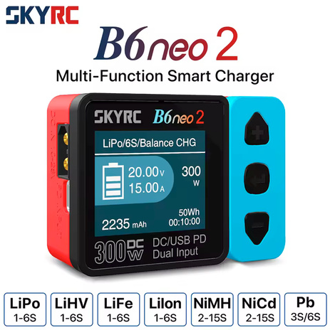
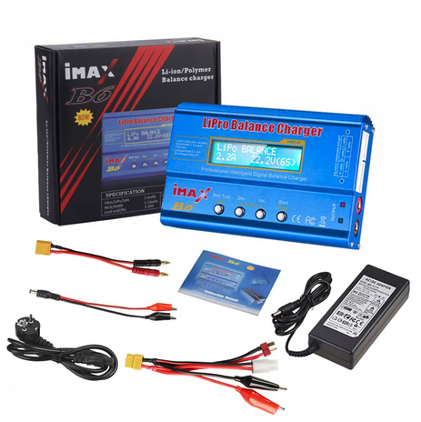
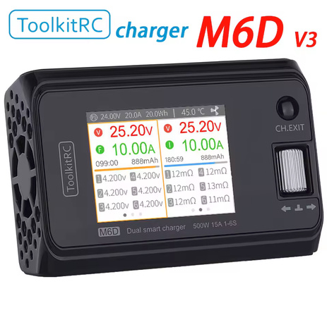
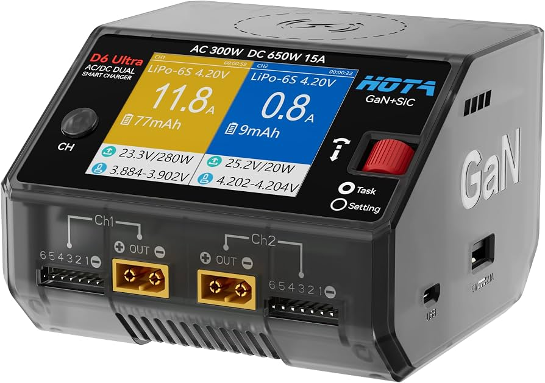
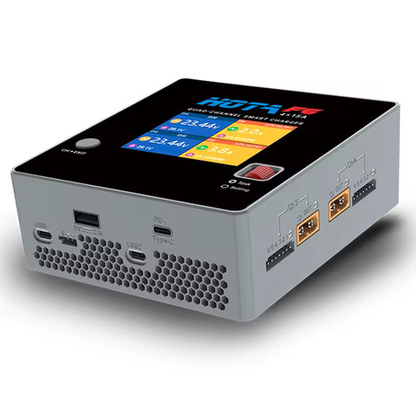
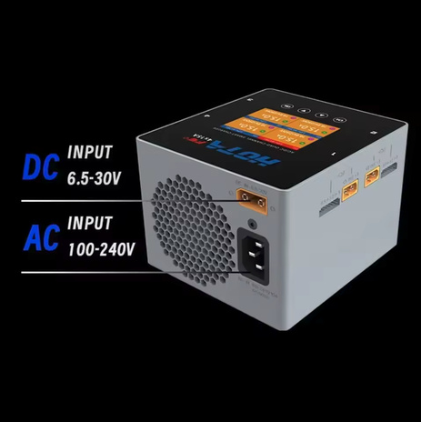
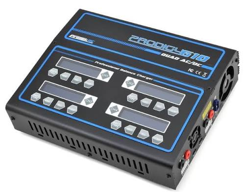
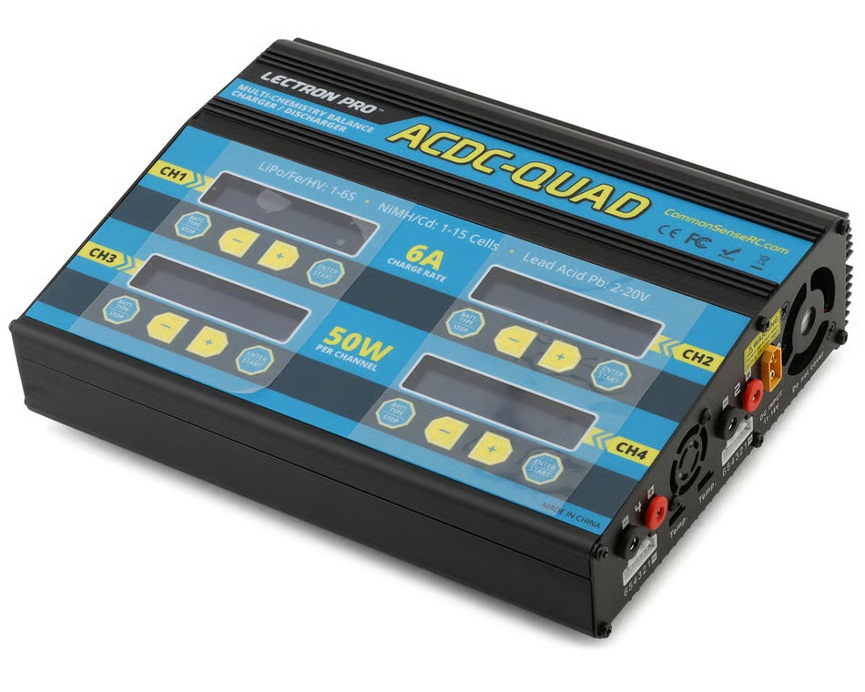
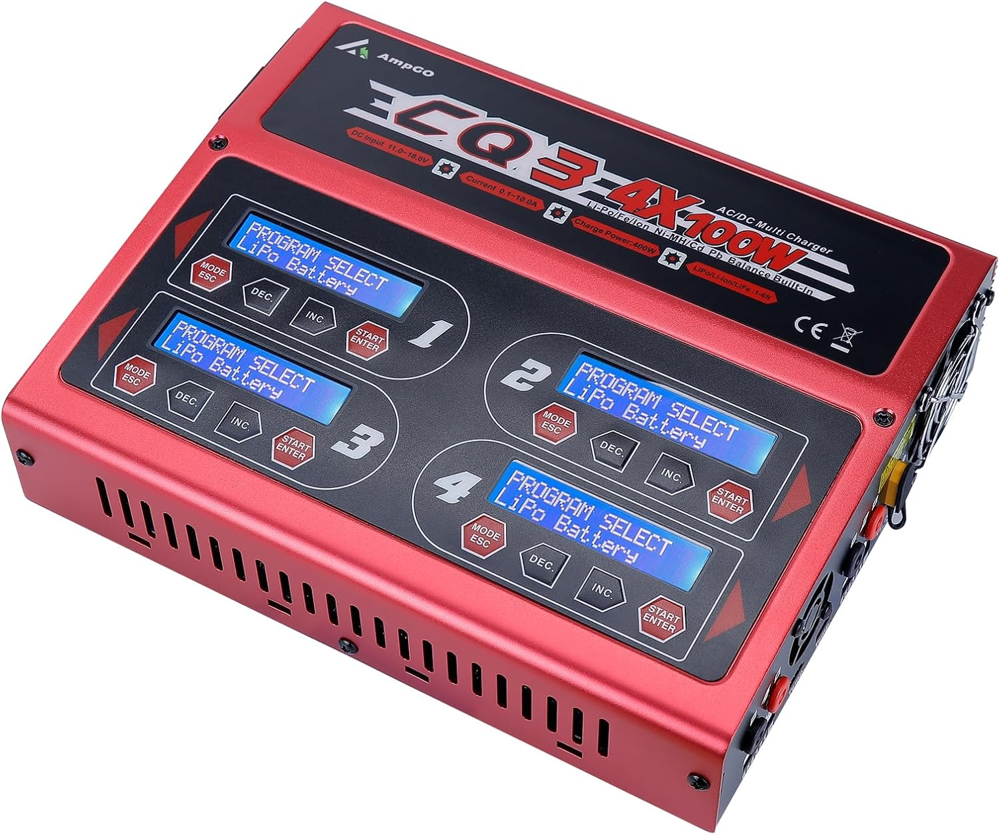

# Charger Selection — FastAzJato4x4

> **The single-channel portables on hand are all modern smart chargers that do LiHV** (needed for the [Gens Ace HV pack](battery_analysis.md)) and all good options. The **SKYRC B6ACneo** is the grab-and-go (AC built in, no PSU); the DC ones run off any 12-24V supply / USB-C PD source. At 4S 5200-6300, charge at ~1C (5-6A), any of them handles it easily. The **duo** and **quad** sections below are for comparison, a friend's duals plus some poor-value quad references (not owned).

---

## Chargers, by channel count

> *Spec format: Chemistries · Cells · Power (DC/AC/PD) · Input voltage · Channels · Max current · Discharge · Balance current · Interfaces · Price*

I run the **single-channel** portables; the **duals** are a friend's; the **quads** are poor-value references (not owned).

### Single-channel

| Charger | Spec | Pros / Cons | Photo / Link |
|---|---|---|---|
| ⭐ **HOTA T6** | **Chemistries:** LiHV/LiPo/LiFe/LiIon, NiMH/NiCd/NiZn, Pb, Smart **Cells:** 1-6S Li (1-14S NiMH) **Power:** DC 300W / PD 90W **Input:** DC 10-30V / USB-C PD·QC **Channels:** 1 (single) **Max current:** 15A **Discharge:** 30W internal (up to 300W external recycle) **Balance:** 600mA **Interfaces:** XT60 + USB-C in; 2.4" IPS 320×240; 70.5×49.5×30.5mm, 93g **Price:** **~$28-33** (own 2; got one for $28 recently) | Pro: **The current best**, all the features, does everything, tiny (93g). **Cheaper and stronger than the neos.** Runs off USB-C PD or a 12V car battery  Con: **Single channel** (one pack at a time). No color options. Needs a DC/PD source. Charge-vs-Balance menu confuses at first (see notes) |  |
| 🟢 **SKYRC B6ACneo** (SK-100200) | **Chemistries:** LiPo/LiFe/LiIon/LiHV/NiMH/NiCd/Pb, Smart **Cells:** 1-6S Li (1-15S NiMH, Pb 3-6S) **Power:** DC 200W / **AC 60W** / **PD out 65W** **Input:** **AC 100-240V** / DC 10-30V **Channels:** 1 **Max current:** 0.2-10A **Discharge:** 19W (0.1-2A) **Balance:** 500mA **Interfaces:** **AC 100-240V (wall)** + DC 10-30V; 1.77" TN 128×160 color; PC-ABS V0 shell; 70.6×50.6×46mm, 150g **Price:** ~$42 | Pro: **The only one you plug straight into the wall (AC)**, no PD brick or supply. The modern **upgrade of the classic iMAX B6AC**, with full protections (short / over-V / over-temp / capacity). Can also **output 65W USB-C PD** to charge a phone / laptop off it. Grab-and-go for quick charges  Con: Lower power on AC (60W). Single channel |  |
| 🔵 **SKYRC B6neo 2** — *don't own, newer option* | **Chemistries:** LiPo/LiFe/LiIon/LiHV/NiMH/NiCd/Pb **Cells:** 1-6S Li (1-15S NiMH, Pb 3-6S) **Power:** DC 300W / PD 80W **Input:** DC 7-28V / USB-C PD3.0·QC **Channels:** 1 **Max current:** 0.2-15A **Discharge:** 24W (0.1-2A) **Balance:** 550mA **Interfaces:** XT60 + USB-C; 1.77" TN 128×160; **cooling fan** (≤48dB); Charger Master app **Price:** ~$27-33 | Pro: The **newest, strongest single neo, 300W / 15A** (matches the T6 on power), fan-cooled, app + firmware updates over USB-C, multi-language. Don't own it, but it looks like a strong newer pick  Con: **Has a fan** (quiet, but the others are fanless). Single channel. DC/PD source needed |  |
| 🟢 **SKYRC B6neo+** | **Chemistries:** LiHV/LiPo/LiFe/LiIon/NiMH/Pb **Cells:** 1-6S Li (NiMH 2-15S, Pb 3/6/12S) **Power:** DC 240W / PD 126W **Input:** DC 5-30V / USB-C PD (5-28V) **Channels:** 1 **Max current:** 0.3-10A **Discharge:** 16W (0.6A max) **Balance:** 600mA **Interfaces:** XT60 + USB-C **Price:** ~$29 | Pro: **Easy to use, cheap**, higher-power neo (240W vs 200W). Was the **2023 benchmark**  Con: The T6 beats it on features (and is cheaper + stronger). DC/PD source needed. **Refuses a too-low cell** (safer) |  |
| 🟢 **SkyRC B6neo** (Global Ltd, SK-100198) | **Chemistries:** LiHV/LiPo/LiFe/LiIon/NiMH/Pb **Cells:** 1-6S **Power:** DC 200W / PD 80W **Input:** DC 10-28V / USB-C PD **Channels:** 1 **Max current:** 0.2-10A **Discharge:** 29.5W (0.1-2A) **Balance:** 500mA **Interfaces:** XT60 + USB-C; 70×50×31mm, 82g **Price:** ~$26 | Pro: Tiny/portable, easy, cheap, and **color options** (blue/pink/green/grey), honestly why I keep the neos  Con: 200W (lower than the +). DC/PD source needed |  |
| 🔵 **ToolkitRC M7** | **Chemistries:** LiHV/LiPo/LiFe/LiIon/NiMH/Pb **Cells:** 1-6S **Power:** DC 200W **Input:** DC 7-28V **Channels:** 1 **Max current:** 10A **Discharge:** 200W (10A recycle) / 10W@3A normal **Balance:** 400mA **Interfaces:** XT60 / **USB-A**; alligator-clip to 12V; 2.0" IPS LCD 320×240 **Price:** ~$23 | Pro: Original reliable. **Charges anything, even a very-low cell if it detects it** (revives packs). **Bench tools** (ESC/servo/RX/voltage tester). Runs off a PSU or a **12V car battery via alligator clips**  Con: The will-charge-low behavior can be **unsafe** on over-discharged cells. USB is Type-A both ends |  |
| ❌ ~~**iMAX B6 (HTRC, 80W)**~~ — *not recommended, dated* | **Chemistries:** LiPo/LiIon/LiFe/NiCd/NiMH/Pb (**no LiHV**) **Cells:** 1-6S Li (1-15S NiMH, Pb 2-20V) **Power:** 80W (AC adapter / DC) **Input:** DC 11-18V **Channels:** 1 **Max current:** 0.1-6A **Discharge:** 5W (0.1-2A) **Balance:** 300mA/cell **Interfaces:** LCD; no USB; 133×87×33mm **Price:** ~$25 | Pro: The classic that defined the hobby charger, cheap, does the basics  Con: **No LiHV** (can't charge the Gens Ace HV pack), and just **old tech**, weak 80W / 6A, slow 300mA balance. **No real reason to buy it now**, the B6ACneo / B6neo do far more for similar money |  |

### Dual-channel (duo)

| Charger | Spec | Pros / Cons | Photo / Link |
|---|---|---|---|
| 🔵 **ToolkitRC M6D** — *friend owns one* | **Chemistries:** LiPo/LiHV/LiFe/LiIon, NiMH, Pb **Cells:** 1-6S Li (1-16S NiMH, Pb 1-10S) **Power:** DC 500W (250W×2 async / 500W sync) **Input:** DC 7-28V @30A **Channels:** **2 (dual)** **Max current:** 30A (15A×2 / 25A sync) **Discharge:** 250W×2 recycle / 12W×2 normal **Balance:** 800mA (2-6S) **Interfaces:** 2× XT60; 2.4" IPS 320×240; USB 2.1A@5V; 98×68×35mm, 220g **Price:** ~$64 | Pro: **The one true dual channel here**, 500W / 30A, charges two packs independently at high power (or 500W combined on one). Big screen, IR measurement, 8-in-1 cable option. Good-value dual  Con: **DC-only**, needs a beefy PSU (e.g. ToolkitRC ADP750). Pricier and bigger/heavier than the singles |  |
| 🔵 **HOTA D6 Pro** — *AC+DC, friend owns one* | **Chemistries:** LiHV/LiPo/LiFe/LiIon, NiZn/NiCd/NiMH, Pb, Smart, Eneloop **Cells:** 1-6S Li (1-16S NiMH, Pb 2-24V) **Power:** **AC 200W** / DC 325W (2×325W = 650W ext) **Input:** AC 100-240V / DC 6.5-30V **Channels:** **2 (dual, independent)** **Max current:** 15A/channel **Discharge:** yes (+ storage mode) **Balance:** **1600mA/cell** (fast) **Interfaces:** 2× XT60; 2.8" color IPS; **wireless phone-charging pad**; fan; 108×105×76mm, 584g **Price:** ~$116 | Pro: **A solid recommendation if you want a dual.** Premium dual with **AC built in** (+DC), fully independent channels, **wireless phone charging on top**, fast 1600mA/cell balance, big 2.8" screen, easy to use, and it comes in **many color options**  Con: **Pricier (~$116)**, AC capped at 200W combined (needs an external PSU for the full 2×325W). Bigger/heavier (584g), has a fan |  |

### Quad-channel

> References, not owned. The **HOTA F6** (and its **F6+** built-in-PSU sibling) is the **good quad** (real power, buy-for-life, **highly recommended**); the rebadged budget quads (Prodigy, 50W×4, 100W×4 CQ3) are slow and/or flaky, see the [notes](#notes).

| Charger | Spec | Pros / Cons | Photo / Link |
|---|---|---|---|
| ⭐🔵 **HOTA F6** — *the good quad (DC), highly recommended* | **Chemistries:** LiHV/LiPo/LiIon/LiFe, NiMH **Cells:** 1-6S **Power:** **4×250W** (1000W DC total, needs a PSU) **Input:** **DC only** (external supply) **Channels:** **4 (quad, independent)** **Max current:** 15A/channel **Discharge:** yes **Balance:** N/A **Interfaces:** XT60; **Type-C output** (charge phone/laptop); ~600g **Price:** **~$140** | Pro: **The good quad, unlike the rebadged budget ones**, a **true buy-for-life charger.** Real power (4×250W / 15A), HOTA quality, Type-C device output, compact (~600g). **The one to get if you run off DC** (bench PSU / 12V) and want a quad  Con: **DC-only**, needs an external power supply. No built-in AC (get the F6+ for that) |  |
| 🔵 **HOTA F6+ (F6 Ultra)** — *same quad with AC + PSU built in* | **Chemistries:** LiHV/LiPo/LiIon/LiFe, NiMH **Cells:** 1-6S **Power:** **AC 500W** (built-in PSU) / **DC 1000W** **Input:** **AC 100-240V + DC** (PSU built in, straight to the wall) **Channels:** **4 (quad, independent)** **Max current:** 15A/channel **Discharge:** yes **Balance:** N/A **Interfaces:** XT60; **Type-C output**; ~1400g **Price:** **~$180** (AliExpress coupons; list ~$204) | Pro: **Everything the F6 is, plus a big power supply built in** so it plugs **straight into the wall (AC)**, no external PSU to lug. Function over form, and still buy-for-life HOTA quality  Con: The **built-in PSU looks ridiculous** (huge, ~1400g). If you **only run off DC**, the plain **F6** does the same charging without the bulk |  |
| 🔵 **ProTek Prodigy 610 QUAD AC (PTK-8517)** — *ok, but bad value* | **Chemistries:** LiHV/LiPo/LiFe, NiCd/NiMH, Pb **Cells:** 1-6S Li (1-15S NiMH, Pb 2-20V) **Power:** **AC 110/220V** + DC; 100W×4 **Input:** AC 110/220V / DC 11-18V **Channels:** **4 (quad)** **Max current:** 10A/channel **Discharge:** 10W×4 (5A) **Balance:** 250mA (slow) **Interfaces:** XT60 DC in; metal case; backlit screen; digital power out 3-24V; pre-charge (revive <3.0V cells); 240×220×68mm, 1750g **Price:** ~$264 | Pro: Quad AC/DC, LiHV-capable (to 4.40V), pre-charge to revive over-discharged packs, digital-power output, worldwide AC, name-brand support  Con: **Bad value at ~$264.** Only 100W/channel (~4.5A max on a 6S), **slow 250mA balance**, heavy (1750g). A few small singles, or a cheaper dual, do more for the money |  |
| 🔵 **50W×4 AC/DC quad** (Common Sense ACDC-QUAD / Dynamite Prophet Sport Quad, rebadged) — *poor value, slow* | **Chemistries:** LiHV/LiPo/LiFe, NiCd/NiMH, Pb **Cells:** 1-6S Li (1-15S NiMH, Pb 2-24V) **Power:** **AC 100-240V** + DC; **50W×4** (200W) **Input:** AC 100-240V / DC 11-18V **Channels:** **4 (quad)** **Max current:** 6A/channel (25.2V max) **Discharge:** 5W×4 (0.1-2A) **Balance:** 400mA/cell **Interfaces:** EC3 / Deans leads; USB 2.1A out; cooling fan; ~228×171×65mm, 3.3lb **Price:** ~$165 (Dynamite DYNC2040) to ~$200 (Common Sense) | Pro: Quad AC/DC, four independent ports, built-in AC, USB output. **The same OEM unit is sold under several brands** (Common Sense ACDC-QUAD, Dynamite Prophet Sport Quad, etc.), so grab the cheapest badge if you must  Con: **Poor value**, only **50W/channel** so it's a **slow charger** (~2.25A max on a 6S, under 1C on a 5000mAh). Heavy (3.3lb). *(Note: the Dynamite listing omits LiHV, verify HV support on that badge.)* Small singles or a real dual do more for less |  |
| 🔵 **100W×4 AC/DC quad (AmpGO CQ3 / BGUAD CQ3, rebadged)** — *poor value, reliability iffy* | **Chemistries:** LiHV/LiPo/LiFe/LiIon, NiMH/NiCd, Pb **Cells:** 1-6S Li **Power:** AC 110/220V + DC; **100W×4** (400W) **Input:** AC 110/220V / DC **Channels:** **4 (quad)** **Max current:** 10A/channel **Discharge:** yes (recondition/cycle) **Balance:** N/A **Interfaces:** banana out; dual cooling fans; LCD; data storage; 1750g **Price:** ~$280 (AmpGO) / ~$300 (BGUAD) | Pro: More power than the 50W quads (100W / 10A per channel), LiHV, quad, AC/DC. Popular for hybrid-battery reconditioning  Con: **Rebadged budget quad with reliability complaints**, reviews report **channels failing after first use** and DOA units. Poor value at ~$280. Same story: singles or a proven dual over this |  |

---
## Charging accessories on hand

| Item | Use |
|---|---|
| **Parallel charging board** (XT90 / XT60 / EC5 / EC3 / XT30 / T, 6S) | Charge several packs in parallel off one channel |
| **USB-C PD trigger boards** (PD/QC decoy, 9/12/15/20V) | Pull fixed PD voltage from USB-C bricks to feed a DC charger |
| **Balance-lead adapters** (6S→3S, 4S→2×2S JST-XH) | Split/adapt balance plugs for the various packs |
| **4.0→5.0mm stepped bullet adapters** | Charge-lead bullet conversions |

---

## Notes

- **All the modern ones do LiHV** (the only exception is the vetoed **iMAX B6**, and possibly the Dynamite-badged quad), so the **Gens Ace 15.2V HV pack** charges fine on any recommended charger, just select the LiHV/HV mode, not standard LiPo (LiHV tops at 4.35V/cell vs 4.2V).
- **Charge rate:** 1C is the safe default, ~5.2A for a 5200, ~6.3A for a 6300. Higher rates (the SMC packs allow up to 5C) put fewer mAh in and shorten cycle life, so stick near 1C for longevity. The 10A chargers (B6ACneo / M7) cover 1C on any of these packs.
- **DC vs AC:** the single-channel portables are mostly **DC-only** (need a 12-24V supply or USB-C PD), except the **B6ACneo** which has AC built in. Among the bigger units, the **HOTA D6 Pro** dual and the **quads** also have **AC built in** (straight into the wall). The DC neos + T6 run off **USB-C PD or a 12V car battery**.
- **DC input is via XT60** on the portables (a bench supply or 12V car battery connects via XT60), with USB-C PD as the alternative on the T6 / neos. (The quads use EC3 / Deans / banana leads.)
- **Input voltages:** the portables run on **DC ~10-30V**, so a **12V car battery** or a 12/24V supply works on any of them (the B6neo+ goes down to 5V, the M7 down to 7V). The **AC-capable units** (B6ACneo, HOTA D6 Pro, the quads) also take **AC mains (100-240V)**. The T6 / neos also accept **USB-C PD** as input.
- **USB-C power-limit gotcha:** these chargers give you **no way to cap how much they pull over USB-C**, so a high-power charge can **fail if it demands more than the PD brick can supply** (the brick current-limits and the charge drops out). Use a **strong PD brick**, or charge off the **car battery / the AC B6ACneo**, for higher-rate charges.
- **HOTA T6 menu quirk:** it lists **Charge** and **Balance** as separate modes, which is confusing at first. **Charge already balances** as it charges (use this for normal charging); **Balance** is a balance-only mode that just equalizes the cell voltages without charging the pack up. Odd but a non-issue once you know it.
- **Low-cell safety differs by charger.** The **ToolkitRC M7 will charge a very-low cell** as long as it detects it (handy for reviving a pack, but risky). The **SKYRC neos refuse** a pack with a cell that's too low (safer). Know which behavior you want before trying to revive an over-discharged pack.
- **Pecking order:** the **HOTA T6** is the current best (all features, cheaper and stronger than the neos, though single channel). The **SKYRC B6neo / B6neo+ / B6neo 2** are the easy, cheap, safe pick (B6neo was the 2023 benchmark; the B6neo 2 bumps it to 300W/15A with a fan). The **M7** is the old-reliable with bench tools and the will-charge-anything behavior. Any of them charges this build's packs fine.
- **Why several cheap chargers beat one big one.** These are cheap enough that buying a few is **cheaper than a single dual/quad-channel charger**, and it's more flexible: grab however many you want to carry for a session (one tiny one for travel, a couple for a full day at the track). Bonus of a spare if one acts up, plus the variety and the fun colors. And you're **not stuck with a dead bay**, my quad charger had **two outputs die**, so now it's a big unit hauling two broken channels; with separate chargers a dead one just gets set aside and you grab another. It's worth having a mix. The **ToolkitRC M6D** and **HOTA D6 Pro** are good dual-channel units (a friend runs both), but I personally still choose the small single portables for the reasons above.
- **Cheap / old chargers often miss features, not just speed.** Several of the budget quads and older units (the Dynamite-badged 50W×4 quad, the iMAX B6) **can't do LiHV** and skip modern niceties (storage mode, higher balance current, USB-C PD, app control). Since the **Gens Ace is an HV pack**, confirm **LiHV support** and a real charge rate before buying, not just the port count. Slow + no-HV is a double miss.
- **Match the charge lead** to the pack connector per [`connector_reference.md`](connector_reference.md); the parallel board covers most plug types.
