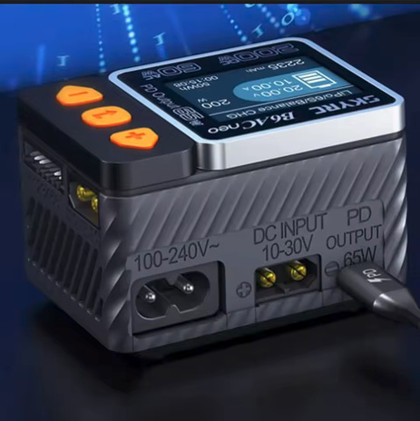

# Charger Selection — FastAzJato4x4

> **Plenty on hand, all modern smart chargers that do LiHV** (needed for the [Gens Ace HV pack](battery_analysis.md)) and **all good options.** The **SKYRC B6ACneo** is the grab-and-go (AC built in, no PSU); the DC ones run off any 12-24V supply / USB-C PD source. At 4S 5200-6300, charge at ~1C (5-6A), any of these handles that easily.

---

## Chargers on hand

> *Spec format: Chemistries · Cells · Power (DC/AC/PD) · Channels · Max current · Interfaces · Price*

| Charger | Spec | Pros / Cons | Photo / Link |
|---|---|---|---|
| ⭐ **HOTA T6** | **Chemistries:** LiHV/LiPo/LiFe/LiIon, NiMH/NiCd/NiZn, Pb, Smart **Cells:** 1-6S Li (1-14S NiMH) **Power:** DC 300W / PD 90W **Channels:** 1 (single) **Max current:** 15A **Interfaces:** XT60 + USB-C in; 2.4" IPS; 70.5×49.5×30.5mm, 93g **Price:** ~$33 (own 2) | Pro: **The current best**, all the features, does everything, tiny (93g). **Cheaper and stronger than the neos.** Runs off USB-C PD or a 12V car battery  Con: **Single channel** (one pack at a time). No color options. Needs a DC/PD source. Charge-vs-Balance menu confuses at first (see notes) |  |
| 🟢 **SKYRC B6ACneo** | **Chemistries:** LiPo/LiFe/LiIon/LiHV/NiMH/NiCd/Pb **Cells:** 1-6S **Power:** DC 200W / **AC 60W** **Channels:** 1 **Max current:** 10A **Interfaces:** **AC (wall)** + DC **Price:** ~$42 | Pro: **The only one you plug straight into the wall (AC)**, no PD brick or supply. Grab-and-go for quick charges  Con: Lower power on AC (60W). Single channel |  |
| 🟢 **SKYRC B6neo+** | **Chemistries:** LiHV/LiPo/LiFe/LiIon/NiMH/Pb **Cells:** 1-6S **Power:** DC 240W / PD 126W **Channels:** 1 **Max current:** ~10A **Interfaces:** XT60 + USB-C **Price:** ~$29 | Pro: **Easy to use, cheap**, higher-power neo (240W vs 200W). Was the **2023 benchmark**  Con: The T6 beats it on features (and is cheaper + stronger). DC/PD source needed. **Refuses a too-low cell** (safer) |  |
| 🟢 **SkyRC B6neo** (Global Ltd, SK-100198) | **Chemistries:** LiHV/LiPo/LiFe/LiIon/NiMH/Pb **Cells:** 1-6S **Power:** DC 200W / PD 80W **Channels:** 1 **Max current:** ~10A **Interfaces:** XT60 + USB-C; 70×50×32mm, 150g **Price:** ~$26 | Pro: Tiny/portable, easy, cheap, and **color options** (blue/pink/green/grey), honestly why I keep the neos  Con: 200W (lower than the +). DC/PD source needed |  |
| 🔵 **ToolkitRC M7** | **Chemistries:** LiHV/LiPo/LiFe/LiIon/NiMH/Pb **Cells:** 1-6S **Power:** DC 200W **Channels:** 1 **Max current:** 10A **Interfaces:** XT60 / **USB-A**; alligator-clip to 12V; LCD IPS **Price:** ~$23 | Pro: Original reliable. **Charges anything, even a very-low cell if it detects it** (revives packs). **Bench tools** (ESC/servo/RX/voltage tester). Runs off a PSU or a **12V car battery via alligator clips**  Con: The will-charge-low behavior can be **unsafe** on over-discharged cells. USB is Type-A both ends |  |

---
## Charging accessories on hand

| Item | Use |
|---|---|
| **Parallel charging board** (XT90 / XT60 / EC5 / EC3 / XT30 / T, 6S) | Charge several packs in parallel off one channel |
| **USB-C PD trigger boards** (PD/QC decoy, 9/12/15/20V) | Pull fixed PD voltage from USB-C bricks to feed a DC charger |
| **Balance-lead adapters** (6S→3S, 4S→2×2S JST-XH) | Split/adapt balance plugs for the various packs |
| **4.0→5.0mm stepped bullet adapters** | Charge-lead bullet conversions |

---

## Notes

- **All of these do LiHV**, so the **Gens Ace 15.2V HV pack** charges fine, just select the LiHV/HV mode, not standard LiPo (LiHV tops at 4.35V/cell vs 4.2V).
- **Charge rate:** 1C is the safe default, ~5.2A for a 5200, ~6.3A for a 6300. Higher rates (the SMC packs allow up to 5C) put fewer mAh in and shorten cycle life, so stick near 1C for longevity. The 10A chargers (B6ACneo / M7) cover 1C on any of these packs.
- **DC vs AC:** most of these are **DC-only** and need a **12-24V supply or USB-C PD source**. The **B6ACneo** is the only one with **AC built in** (straight into the wall). The DC neos + T6 run off **USB-C PD or a 12V car battery**.
- **All of these take DC power via an XT60 input** (so a bench supply or a 12V car battery connects via XT60), with USB-C PD as the alternative on the T6 / neos.
- **USB-C power-limit gotcha:** these chargers give you **no way to cap how much they pull over USB-C**, so a high-power charge can **fail if it demands more than the PD brick can supply** (the brick current-limits and the charge drops out). Use a **strong PD brick**, or charge off the **car battery / the AC B6ACneo**, for higher-rate charges.
- **HOTA T6 menu quirk:** it lists **Charge** and **Balance** as separate modes, which is confusing at first. **Charge already balances** as it charges (use this for normal charging); **Balance** is a balance-only mode that just equalizes the cell voltages without charging the pack up. Odd but a non-issue once you know it.
- **Low-cell safety differs by charger.** The **ToolkitRC M7 will charge a very-low cell** as long as it detects it (handy for reviving a pack, but risky). The **SKYRC neos refuse** a pack with a cell that's too low (safer). Know which behavior you want before trying to revive an over-discharged pack.
- **Pecking order:** the **HOTA T6** is the current best (all features, cheaper and stronger than the neos, though single channel). The **SKYRC B6neo / B6neo+** are the easy, cheap, safe pick (B6neo was the 2023 benchmark). The **M7** is the old-reliable with bench tools and the will-charge-anything behavior. Any of them charges this build's packs fine.
- **Why several cheap chargers beat one big one.** These are cheap enough that buying a few is **cheaper than a single dual/quad-channel charger**, and it's more flexible: grab however many you want to carry for a session (one tiny one for travel, a couple for a full day at the track). Bonus of a spare if one acts up, plus the variety and the fun colors. And you're **not stuck with a dead bay**, my quad charger had **two outputs die**, so now it's a big unit hauling two broken channels; with separate chargers a dead one just gets set aside and you grab another. It's worth having a mix.
- **Match the charge lead** to the pack connector per [`connector_reference.md`](connector_reference.md); the parallel board covers most plug types.
