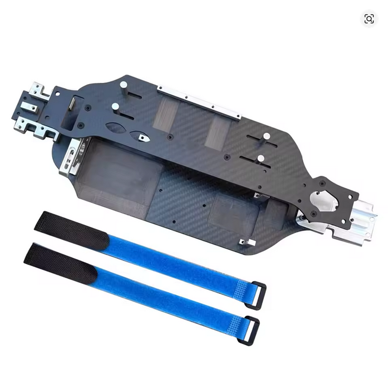
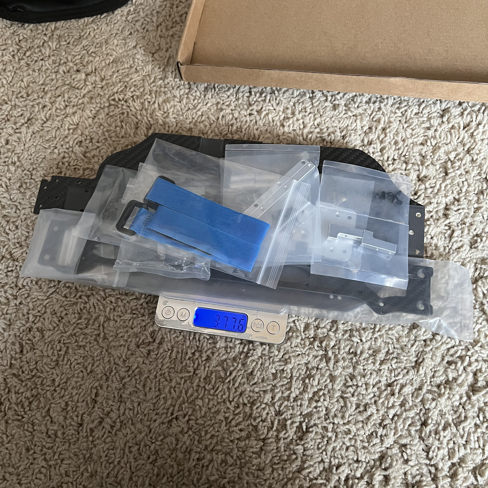
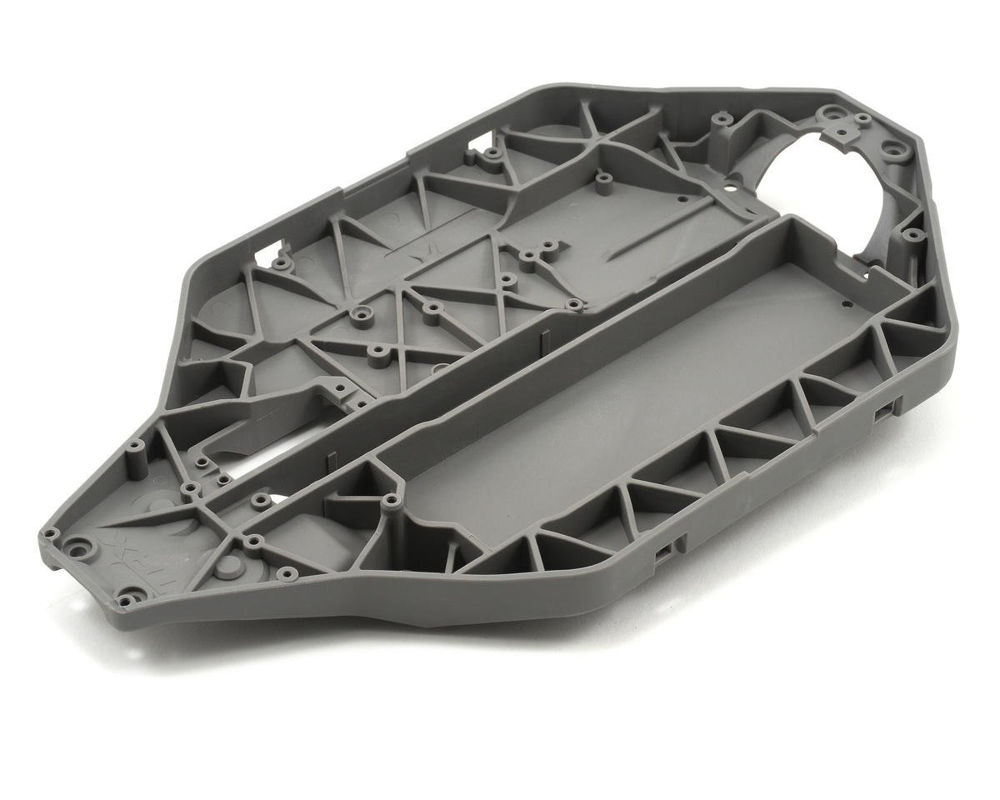
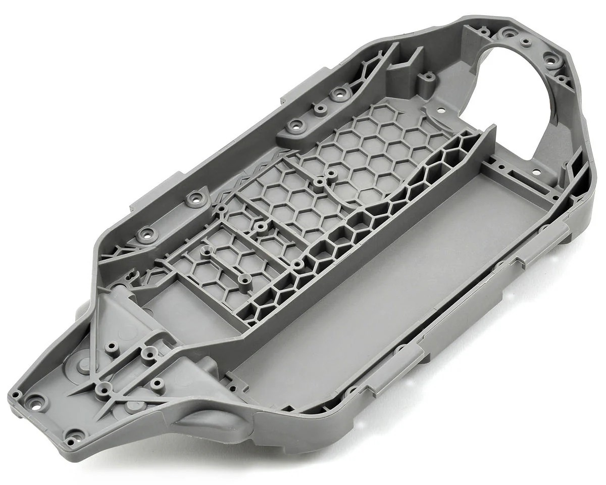
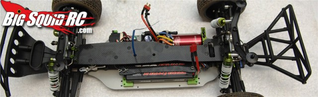
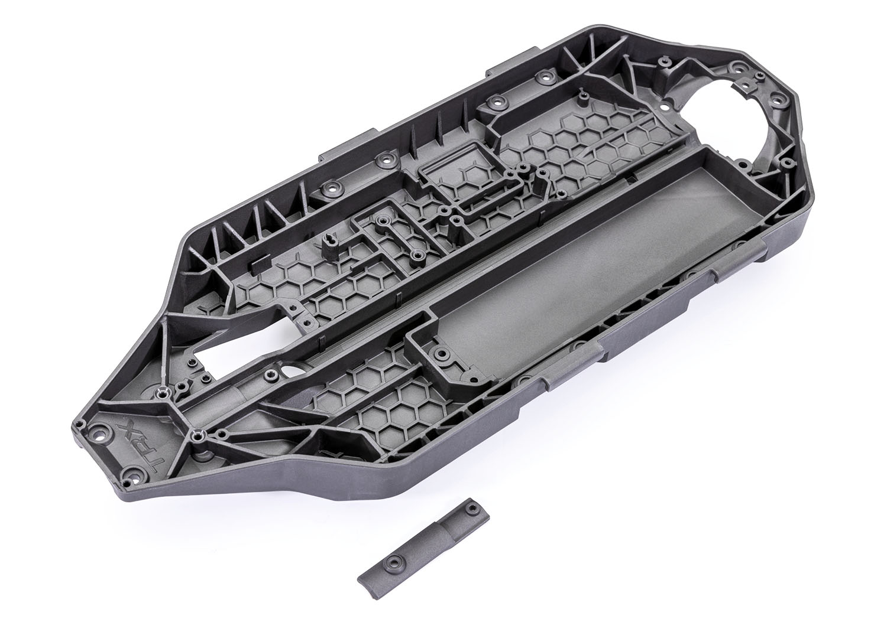

# Chassis Selection — FastAzJato4x4

> **Chosen: AliExpress / Cobra Racing CF Chassis Kit** — ~$100, LCG, genuine carbon fiber + aluminum alloy, complete kit with all mounting hardware. Direct fit to Slash 4x4 / Jato 4x4 pattern, accepts all standard Traxxas parts.

 <em>AliExpress / Cobra Racing CF LCG Chassis Kit — ~$100</em>

---

## Table of Contents

- [Key Requirements](#key-requirements)
- [Chassis Comparison](#chassis-comparison)
- [Price History](#price-history)
- [Notes](#notes)

---

## Key Requirements

| Requirement | Type | Why |
|---|---|---|
| **Jato 4x4 / Slash 4x4 chassis pattern** | Must | Must be specifically for the 4x4 platform — 2WD chassis have different mount spacing and will not work |
| **Accepts standard Traxxas Jato 4x4 parts** | Must | Gearbox housings, bulkheads, shock mounts, bumper mounts — all stock Traxxas hardware must bolt on without modification |
| **Carbon fiber** | May | Light + stiff, ideal for this build — but the hard requirement is fit, not material |
| **Cheap** | May | Arms are the intended fuse, chassis should last — but ≤$150 keeps the "just buy another one" option open if something goes wrong |

---

## Chassis Comparison

> *Spec format: Material · CG · Fits · Includes · Weight · Price*

| Chassis | Spec | Pros / Cons | Photo / Link |
|---|---|---|---|
| ⭐ **AliExpress / Cobra Racing CF Chassis Kit** (fits TRA6808 / 6087 / 6804 Slash 4x4 VXL) | **Material:** **Genuine CF + aluminum alloy** (not fiberglass or CF-look plastic) **CG:** **LCG** (Low Center of Gravity) **Fits:** Slash 4x4 / Jato 4x4 pattern (TRA6808 / 6087 / 6804 Slash 4x4 VXL) **Includes:** alum front+rear bulkheads, adjustable alum motor mount (3S–8S), alum battery holder + strap, alum servo mount, CF center brace, all hardware + schematic **Weight:** **357.2 g** — full kit, unbagged (CF plate + all alum parts + strap + hardware; no packaging) **Price:** **~$100** or less | Pro: **~$100 or less**. Complete kit — no separate bulkhead, motor mount, or servo mount purchases needed. Genuine CF, significantly lighter than aluminum. Direct fit to Slash 4x4 / Jato 4x4 pattern. Castle 1515 compatible. Motor fit: VXL-3s, 550 type, Castle 1515 + similar. Install: no cutting/drilling, ~60–90 min. Tested: large pinion gear-up to 125 MPH. Sold as the same kit under multiple brand names. Easy to replace if needed  Con: QC varies between sellers; no warranty. **Weight vs OEM plastic still not apples-to-apples** — the 357.2 g is the *whole kit* (CF + all aluminum bulkheads/mounts/hardware), so compare against OEM plastic **plus** the equivalent metal bits, not the bare plastic chassis alone |  <em>357.2 g — full kit, unbagged</em> |
| ❌ ~~Traxxas OEM HCG chassis (6822)~~ | **Material:** Composite nylon **CG:** HCG (High Center of Gravity) **Fits:** Jato 4x4 (stock, part 6822) **Includes:** N/A **Weight:** N/A **Price:** Free (in box) | Pro: Free (in box with Jato 4x4), tough in crashes, can be lighter than CF  Con: **High center of gravity** — the main reason this gets replaced. Same weight issue as the LCG: plastic is lighter on its own but once you add the aluminum bulkheads, motor mount, and hardware the total may outweigh the plastic base benefit vs just going with the CF complete kit |  |
| ❌ ~~Traxxas OEM LCG chassis (TRA7422)~~ | **Material:** Composite nylon **CG:** LCG (Low Center of Gravity) **Fits:** Slash 4x4 / Jato 4x4 (part TRA7422) **Includes:** N/A **Weight:** N/A **Price:** N/A | Pro: LCG, tough in crashes, can be lighter than CF. Better starting point than HCG  Con: Plastic chassis is lighter on its own, but you'd still need the aluminum bulkheads, motor mount, and hardware — once you add all that metal, the total weight may outweigh the benefit of having the lighter plastic base vs just going with the CF complete kit |  |
| ❌ ~~**STRC LCG Chassis — Slash 4×4**~~ | **Material:** 4mm CNC aluminum lower + 2.5mm graphite upper deck **CG:** LCG **Fits:** Slash 4×4 (designed for 2S lipo / 550 motor; 3S w/ possible plug mods) **Includes:** alum bulkhead, motor mount + cam, rear suspension mounts, battery brackets, servo mount, sway bar mounts, all hardware **Weight:** N/A **Price:** ~$99 | Pro: CNC machined, hard anodized, comprehensive kit, LCG design — well engineered for its time. Same price as the CF kit  Con: **Discontinued.** Aluminum lower chassis also adds weight vs CF |  |
| ❌ ~~**Traxxas Ford Raptor R 4x4 extra-long chassis** — *fun future experiment*~~ | **Material:** gray composite **CG:** N/A **Fits:** Ford Raptor R 4x4 (extra-long wheelbase, part TRA10122) **Includes:** driveshaft cover **Weight:** N/A **Price:** **$25** (ships late June) | Pro: **Extra-long chassis — would probably be more stable in a straight line.** Just thought it'd be funny to run; a fun thing to try down the road  Con: **No real benefit other than the extra length** — wrong platform, and not the LCG/CF direction this build wants. Filed as a future novelty, not a serious option |  |

---

## Price History

AliExpress / Cobra Racing CF Chassis Kit — RCTOYFUN Store, listed at **$169.64** retail.

| Date | Price | Discount Path | Notes |
|------|-------|---------------|-------|
| 2026-06-01 | **$73.17** ✅ **purchased** | Sale + SSUS14 + final-checkout discounts (≈$24 off the $97.27 sale price) | Order #8211906604074866. Summer Sale 2026, free shipping, free returns, $1 coupon if delayed. See [`/Deals/aliexpress_codes.md`](../../Deals/aliexpress_codes.md) |
| 2026-06-01 | $82.27 | Sale + SSUS14 ($14 off $89+) cart preview | Cart screenshot before final-checkout discount stack |

---

## Notes

- **Why TRA6808 fit pattern works:** the Slash 4x4 VXL and the Jato 4x4 share the same gearbox housings, bulkhead spacing, and shock mount geometry. A Slash 4x4 CF chassis bolts up to a Jato 4x4 drivetrain without modification.
- **Chassis is not disposable — arms are the fuse.** FLM extended arms bend and reshape before real chassis damage occurs (see [`arm_analysis.md`](arm_analysis.md)). The whole build is light, so less kinetic energy reaches the chassis in a crash vs a heavy 1/8 truck. The cheap price is a bonus, not the operating assumption. Note: plastic chassis can actually be lighter and more durable than CF in some cases — the CF kit wins here because it's a complete package, not because plastic is strictly inferior.
- **Aluminum bulkheads are required, not optional** — these cars are known to break plastic front bulkheads even with stock arms. The CF kit's included aluminum bulkheads solve this out of the box.
- **Front and rear metal bars need a little filing (build note, in hand).** The kit's front and rear aluminum bars (part number TBD, forgot it — 🚧 look it up and add here) want a bit of filing to seat right and clear the suspension arms. Out of the bag they bind the arm travel slightly; a quick file job frees the arms and they move fully. Other than that the chassis is good as-is.
- **Weigh-in: full kit = 357.2 g** unbagged (CF plate + all alum parts + strap + hardware, [photo](src/chassis_aliexpress_cf_slash_4x4_weight.jpg)). The plastic baggies alone were **~20 g** (377.6 g bagged → 357.2 g unbagged). This is the *complete kit*, so a fair "is CF lighter?" comparison must weigh **OEM plastic chassis + equivalent metal bulkheads/mounts**, not the bare plastic plate. 🚧 Optional follow-up: weigh the **bare CF plate alone** (and the OEM plastic base) for a clean plate-to-plate number.
- **QC tip:** if buying from AliExpress, look for sellers with 95%+ positive feedback and >100 sold; avoid the brand-new listings. Photos in customer reviews are more honest than seller-supplied images.
