# Differential Selection — FastAzJato4x4

> **Chosen:**
> - **Front & rear diffs: Traxxas E-Revo 1.0 — the winner.** Cheap, easy to maintain, and last just as long as anything else under proper use. 6mm outdrives, I-bar stock, plastic housing that outlasts aluminum. All other diffs use 5mm outdrives and are ruled out.
> - **Center diff: stock Traxxas with 20k wt oil** — user-tested across multiple builds, no reason to change.
> - **Center driveshaft: pick on price and availability** — all options work, consequence-free choice.

---

## Table of Contents

- [Key Requirements](#key-requirements)
- [Front & Rear Diff Comparison](#front--rear-diff-comparison)
- [Alternative Upgrade Parts](#alternative-upgrade-parts)
- [Center Diff](#center-diff)
- [Center Diff Oil](#center-diff-oil)
- [Spur Gear](#spur-gear)
- [Sources](#sources)

---

## Key Requirements

| Requirement | Type | Why |
|---|---|---|
| **E-Revo 1.0 standard 6mm outdrives** | Must | Must match the chosen E-Revo 1.0 standard cups — **not extended cups, not E-Revo 2.0 cups**. Standard 1.0 cups keep costs down and are the correct fit for this build |
| **Fits Jato 4x4 gearbox housing** | Must | Has to physically bolt up to the chassis mounts |
| **Sealed for oil** | Must | Tunable damping via diff oil viscosity |
| **Field-rebuildable** | May | Diff service is routine; user-rebuildable beats throw-and-replace |
| **Reasonably available / cheap** | May | Diffs are wear items; replacements should be easy to source |

---

## Front & Rear Diff Comparison

| Diff | Spec | Status | Pros / Cons | Photo / Link |
|---|---|---|---|---|
| **Traxxas E-Revo 1.0 diffs** | Outdrive: **6mm**  Assembled unit: TRA5380 (~$14.97 at Jenny's RC — cheapest complete diff)  Ring gear: TRA5379X (confirmed — GPM ER1200TS is the aftermarket replacement)  Carrier rebuild: TRA3978 (includes I-bar spider gear braces stock)  Gear set rebuild: TRA5382X (output gears, spider gears, spider gear shaft)  **Front and rear are identical parts** — same diff, buy 2 | **Chosen — In Hand** | Pro: **The winner — cheap, easy to maintain, lasts just as long as anything else under proper use.** Only 6mm outdrive diff for this build. I-bar spider gear braces stock. **Plastic housing outlasts aluminum** — stays rounder longer, holds fluid better, more tolerant to bending. Easy to service and rebuild. **Cheapest source: Jenny's RC ~$14.97 complete assembled** (cheaper than buying TRA3978 + TRA5382X separately)  Con: Heavier than stock Jato diffs; E-Revo diff cases require minor fitting to the Jato gearbox housing. **Must fill half full only** — overfilling plastic diff housings causes them to explode under pressure (user error, not a design flaw) |  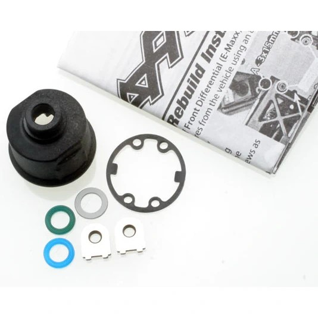&nbsp; <em>assembled · TRA3978 carrier housing · TRA5382X gear set</em> |
| **Wltoys K939 diffs (E-Revo knock-off)** | Outdrive: **6mm** (E-Revo compatible)  Internal: I-bar spider gear braces included  Part numbers: TBD — K939 specific  Sourcing: K939 spare parts listings | **In Hand** | Pro: **E-Revo diff knock-off — drops straight in.** 6mm outdrives, same I-bar internals as the E-Revo. **Surprisingly includes the I-bar** for a budget knock-off. No noticeable difference vs OEM in real use — performs identically. Cheaper replacement/spare option  Con: Knock-off QC on paper — tolerances may vary, but in practice indistinguishable from OEM |  |
| ~~**Traxxas XO-1 diffs**~~ | Outdrive: **5mm**  Carrier: **TRA3978** ($4.25 — same heavy-duty housing shared with E-Revo)  Gear set: TRA6882 (I-bar spider gear set)  Ring gear: TRA6879 / TRA5379X (same part — Traxxas packages with different pinions front vs rear, creating different numbers)  Assembled Jenny's RC: ~$29.99, out of stock | Ruled Out | Pro: Uses same TRA3978 carrier as E-Revo. I-bar gear set (TRA6882) is strong  Con: **5mm outdrives — can't mate E-Revo CVD cups.** Assembled unit $29.99 and out of stock vs E-Revo assembled at $14.97 in stock. No reason to source XO-1 parts when E-Revo diff is cheaper and already has the same TRA3978 carrier |  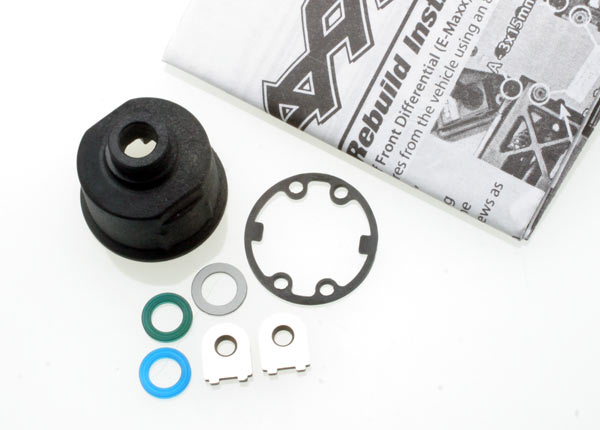 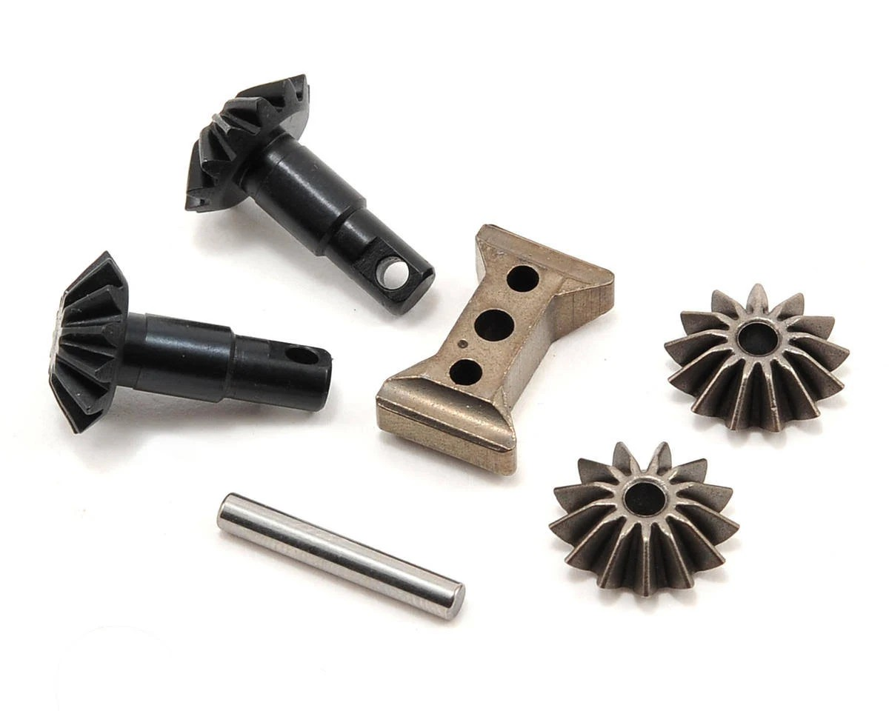 <em>Jenny's RC listing · diff housing TRA3978 · spider gear set w/ I-bar</em> |
| ~~**GPM SLA1337FR — Slash 4x4 / Jato 4x4 front + rear diff set**~~ | Part: **SLA1337FR**  Housing: 7075-T6 aluminum alloy  Gears: 4140 carbon steel  Outdrive: TBD — likely 5mm (fits Jato 4x4 / Slash 4x4 stock pattern)  Price: **$75.90** (out of stock)  Fitment: Slash 4x4, Jato 4x4, Rustler 4x4, XO-1, and more | Ruled Out | Pro: 4140 steel gears for durability. Complete matched front+rear set. Wide Traxxas 4x4 compatibility  Con: **Outdrive likely 5mm** — verify before considering. If 5mm, same incompatibility with E-Revo CVD cups. **$75.90 for aluminum housing** that augers out faster than plastic, holds fluid worse, and costs 5× the E-Revo assembled diff at Jenny's RC. Out of stock |  |
| ~~**Integy C31463 — Slash 4x4 / Stampede 4x4 / Rustler 4x4 diff**~~ | Part: **C31463**  Outdrive: TBD — likely 5mm (Slash 4x4 pattern)  Price: **$18.49** (sale from $24.99) — in stock | Ruled Out | Pro: Cheapest aftermarket option here, in stock  Con: Outdrive likely 5mm — same incompatibility with E-Revo CVD cups. Material TBD — if aluminum housing, same problem as GPM (augers out faster, holds fluid worse than plastic). At $18.49 it's still more expensive than the E-Revo assembled diff at Jenny's RC ($14.97) | 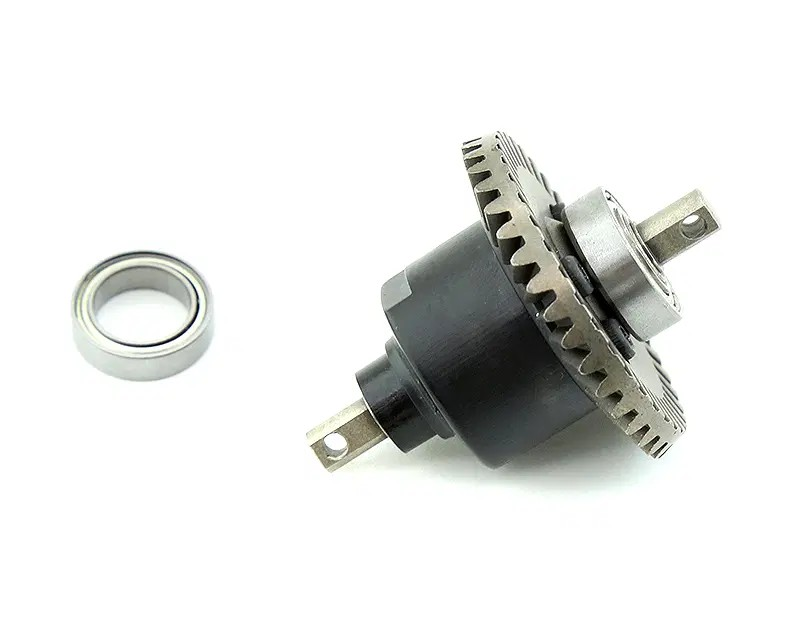 |
| ~~Traxxas Jato 4x4 / Slash 4x4 stock diffs~~ | Outdrive: **5mm**  Gear set: TRA6882 (same as XO-1)  Ring gear: TRA6879  Jato 4x4 at Jenny's RC: ~$12.97, 5 in stock (cheaper than E-Revo assembled!)  Part numbers: TBD for Slash variant | **Ruled Out** | Pro: Native fit. Jato 4x4 version is the cheapest assembled diff here. Same TRA6882 gear set as XO-1  Con: **5mm outdrives — physically can't mate the in-hand E-Revo CVDs or axles.** The only thing stopping this from being the pick | 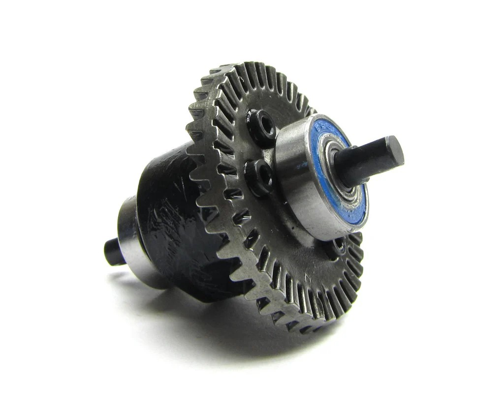 |

### Alternative Upgrade Parts

Optional ring gear / pinion upgrades for the E-Revo diff. All vetoed — marginal gains over stock that don't justify the cost.

| Part | Spec | Status | Pros / Cons | Photo / Link |
|---|---|---|---|---|
| ~~**GPM ER1200TS — Carbon Steel Bevel Gear Set (29T/11T)**~~ | Part: **ER1200TS**  Material: Carbon steel, nitride hardened, helical spiral cut  Gears: 29T ring bevel + 11T pinion, 1.0 module (6pc inc. screws)  Replaces: TRA5379X  Price: **$43.90** (out of stock) | Vetoed | Pro: Nitride hardened, helical spiral cut, carbon steel  Con: Marginal gains — stock TRA5379X in the assembled diff is fine. $43.90 and out of stock | 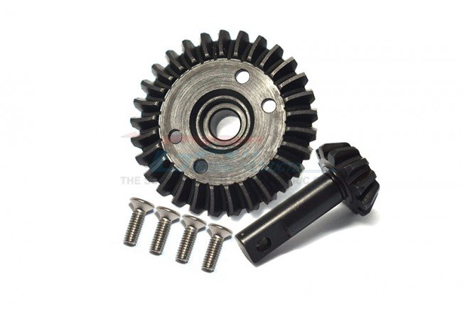 |
| ~~**GPM ER1337TS — Hard Steel Spiral Gears (13T/37T)**~~ | Part: **ER1337TS**  Material: Hard steel, spiral cut  Gears: 13T + 37T matched pair  Price: **$36.90** | Vetoed | Pro: Hard steel, spiral cut geometry  Con: Marginal gains — unlikely to outperform stock. $36.90 not worth it |  |
| ~~**Traxxas TRA5379R — Spiral Cut Ring Gear + Pinion**~~ | Part: **TRA5379R**  Type: Spiral cut ring gear + pinion  Price: **$39.95** | Vetoed | Pro: Spiral cut geometry theoretically smoother  Con: Marginal gains at best — stock already covers this fine. $39.95 not worth it |  |

### Why 6mm wins

The drivetrain compatibility chain is rigid:
- **E-Revo CVDs (chopped to fit)** — 6mm cups
- **E-Revo axles** — 6mm
- **Diffs must be 6mm to mate both ends**

Every stock Traxxas diff (Jato 4x4, Slash 4x4, XO-1) uses 5mm outdrives. The E-Revo 1.0 is the only option with 6mm, making it the only compatible diff for this build. **Use standard E-Revo 1.0 cups — not extended cups, not E-Revo 2.0 cups.** Standard cups are cheaper and correct for this setup.

---

## Center Diff

> **Chosen: TRA6814 center diff** — sealed, pre-filled, tunes via silicone oil. **Cheaper to build from TRA6884 + TRA6883 (~$20) than buy the prebuilt ($39.95).** 20k wt oil chosen.

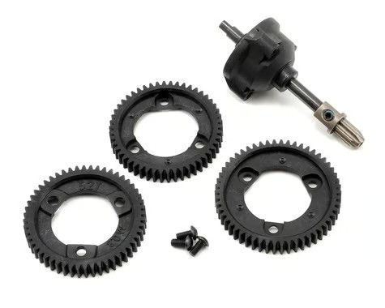 <em>TRA6814 Pre-Built Center Differential Kit — $39.95</em>

| Center Diff | Spec | Status | Pros / Cons | Photo / Link |
|---|---|---|---|---|
| **TRA6814 — Traxxas Pre-Built Center Diff Kit** | Part: **TRA6814** — $39.95 complete  Housing rebuild: **TRA6884** — $5 (housing, X-ring gaskets, ring gear gaskets/bushings, hardware)  Gear set rebuild: **TRA6883** — $15 (output gears x2, spider gears x2, spider gear shaft)  **Build cost: TRA6884 + TRA6883 = ~$20** (half the prebuilt price)  Sealed, pre-filled, tunable via silicone oil  Fits: Slash 4x4, Jato 4x4 | **Chosen** | Pro: Pre-built and pre-filled — installs in minutes. Sealed and tunable. **Cheaper to build from components than buy prebuilt** — TRA6884 + TRA6883 = ~$20 vs $39.95 for TRA6814. $5 housing rebuild when worn  Con: $39.95 for the complete kit if not building from parts |  &nbsp;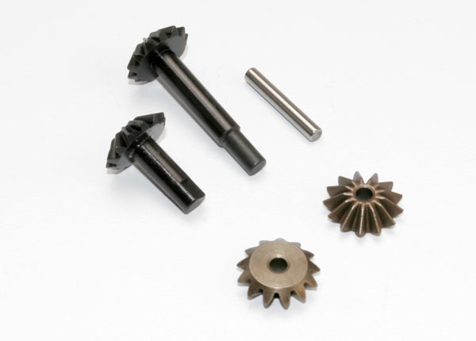 <em>TRA6814 complete · TRA6884 housing · TRA6883 gear set</em> |
| ~~**TRA6780 — Complete Center 4X4 Diff Kit (alum housing + steel 54T spur)**~~ | Part: **TRA6780** — $69.95 complete  Housing: aluminum  Spur: steel 54T (integrated)  Fits: Hoss / Slash / Stampede / Rustler 4x4 | Vetoed | Pro: Complete bolt-in unit, alum housing + steel spur is durable on paper  Con: **Tons of unneeded rotational weight** — heavy alum housing + steel spur add spinning mass right in the driveline. **Aluminum housing augers out** (wears oblong) faster than plastic and holds fluid worse. Steel spur also kills the plastic-fuse failure mode. **$69.95** vs ~$20 to build the TRA6814 from parts | 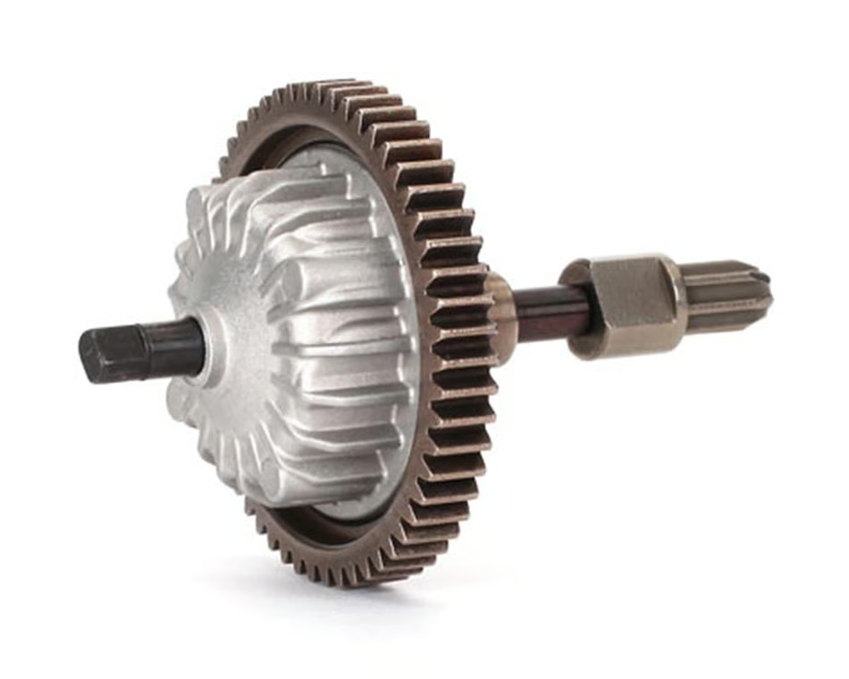 |
| ~~**AliExpress Heavy Duty Centre Diff (alum body + steel 54T spur)**~~ | Brand: Tolex (generic)  Housing: aluminum  Spur: steel 54T (integrated)  Fully assembled  Price: **~$15–20** ($15.23 sale / $23.43 list)  Fits: Slash 4x4 / Hoss 4x4 VXL | Vetoed | Pro: **Fully assembled for ~$20** — a cheap knock-off of the TRA6780, fraction of the $69.95 price  Con: Same problems as the TRA6780 — **alum body + steel spur add unneeded rotational weight**, aluminum housing augers out faster than plastic, steel spur kills the plastic-fuse failure mode. Cheap, but the wrong design either way | 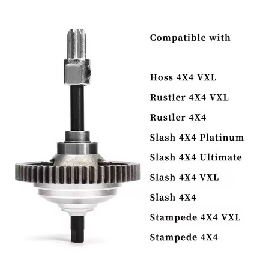 |

### Slipper Clutch (alternative to center diff — vetoed)

A slipper clutch replaces the center diff entirely. Vetoed here because it doesn't suit this build's surface.

| Part | Spec | Status | Pros / Cons | Photo / Link |
|---|---|---|---|---|
| ~~**TRA6878A — Complete Slipper Clutch**~~ | Part: **TRA6878A**  Type: complete slipper clutch assembly (replaces center diff)  Price: **$20.00** | Vetoed | Pro: Works well on high-grip surfaces  Con: **Doesn't handle well on dirt/low-grip tracks** — this build is set up for dirt offroad, not high-grip. Center diff (TRA6814) is the correct setup | 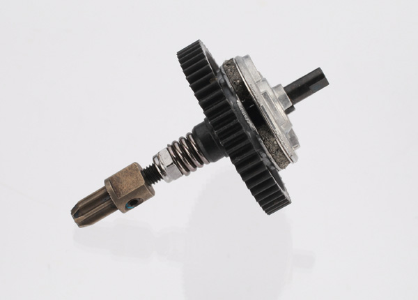 |

---

## Center Diff Oil

**Chosen: 20,000 wt (20k cSt).** User-tested across multiple builds, lands in the sweet spot between freewheeling traction handoff and progressive lockup under throttle.

| Oil weight | Behavior | Use case |
|---|---|---|
| 5k cSt | Very fluid, lots of differentiation, freewheels in turns | Light-traction surfaces (sand, very loose) |
| 10k cSt | Quicker freewheel, less lockup under power | Tight indoor tracks |
| **20k cSt ⭐** | Balanced — diffs under hard throttle, freewheels at part-throttle | **Chosen — general offroad / 4S dirt** |
| 50k cSt | Mostly locked, all-four-wheels-pull feel | Crawling, low-grip climbs |
| 100k+ | Effectively locked spool | Drag/speed-run with grip |

**Fill level: half full only.** Overfilling plastic diff housings causes them to explode under pressure — this is user error. Fill to half, no more.

**Why not just lock the center diff?** Locked center = no torque differentiation front-to-rear = chassis pushes / pivots awkwardly on uneven surfaces. 20k gives the locked-feel under power without the disadvantages on rough offroad.

---

## Spur Gear

> **Chosen: TRA3956R — 54T plastic spur.** Plastic is correct by design — the spur is the intentional sacrificial failure point. In a bad crash it strips before transferring force to the metal pinion, driveshafts, and gearbox, protecting far more expensive parts. 54T is the pick over 50T/52T: **more teeth spread the load and wear more evenly, making it slightly stronger**, and **54T lands our gearing right where we want it.** Lasts a long time under normal use and is dirt cheap to replace.

### Spur Gear Requirements

| Requirement | Type | Why |
|---|---|---|
| **Plastic material** | Must | Plastic is the **intentional sacrificial failure point** — strips in a crash before the metal pinion, driveshafts, or gearbox take the hit. Metal spur gears transfer crash energy into more expensive components |
| **32P / 0.8M pitch** | Must | Slash 4x4 / Jato 4x4 platform standard — all gearbox housings and pinions use this pitch |
| **No slipper clutch** | Must | Slipper clutch works on high-grip surfaces — doesn't handle well on dirt tracks. This build is set up for dirt/low-grip offroad. Center diff (TRA6814) is the correct setup |
| **Fits Slash 4x4 / Jato 4x4 center diff gearbox** | Must | Must seat correctly in the center diff housing (TRA6814 / TRA6884) |
| **Cheap** | Must | It's a consumable part. At $3–5 it should be guilt-free to replace |
| **Correct tooth count for desired gear ratio** | May | Tooth count affects top speed vs torque — tune to motor KV and track conditions |

### Spur Gear Comparison

| Spur Gear | Spec | Status | Pros / Cons | Photo / Link |
|---|---|---|---|---|
| **TRA3956R — 54T plastic (center diff)** | Teeth: **54T**  Pitch: 32P / 0.8M  Material: black plastic  Fits: TRA6814 center differential  Price: **$3.00** | **Chosen** | Pro: $3, correct plastic-fuse material, fits the TRA6814 center diff. **54T = more teeth, so load spreads and wears more evenly — slightly stronger than 50T/52T.** Lands our gearing exactly where we want it  Con: — | 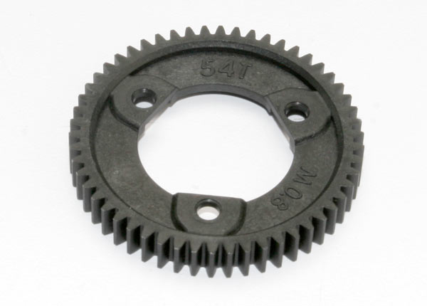 |
| **TRA6842R — 50T plastic** | Teeth: **50T**  Pitch: 32P / 0.8M  Material: black plastic  Price: **$3.00** | Candidate | Pro: $3, correct material, correct pitch. 50T gives a slightly taller ratio vs 52T  Con: Fewer teeth than the chosen 54T — load spread over less contact | 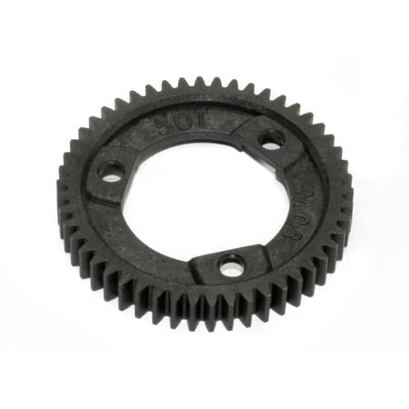 |
| **TRA6843R — 52T plastic** | Teeth: **52T**  Pitch: M0.8 / 32P  Material: black plastic  OD: 43mm / ID: 22.5mm  Price: **$3.00** | Candidate | Pro: $3, correct material. 52T sits between 50T and 54T  Con: Fewer teeth than the chosen 54T |  |
| ~~**Hot Racing SSLF254D — 54T steel**~~ | Teeth: 54T  Pitch: 32P / 0.8M  Material: hardened steel  Price: ~$15 | Vetoed | Pro: Won't strip under abuse  Con: **Wrong design philosophy** — metal spur transfers crash energy to the pinion and drivelines instead of stripping. Defeats the purpose of having a sacrificial failure point |  |
| ~~**GPM SSLA054T — 54T steel**~~ | Teeth: 54T  Pitch: 32P / 0.8M  Material: hardened steel  Price: $19.90 | Vetoed | Pro: CNC machined, black finish  Con: Same metal spur problem — no sacrificial failure point. More expensive than plastic for a worse outcome |  |
| ~~**Integy T8573 — 50T steel**~~ | Teeth: 50T  Pitch: 32P / 0.8M  Material: billet steel  Price: **$24.83** (sale from $26.99) | Vetoed | Pro: Billet steel construction  Con: Metal spur — wrong failure mode. $24.83 for a part that should cost $3 and be plastic | 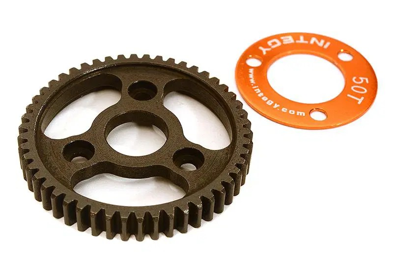 |
| ~~**Robinson Racing RRP7954 — 54T steel**~~ | Teeth: 54T  Pitch: 32P / 0.8M  Material: hardened black steel  Design: slipper clutch eliminator (bolts direct, no slipper pads)  Price: **$18.22** (list $19.80) | Vetoed | Pro: Hardened black steel, well-reviewed, takes brushless 6S abuse  Con: Same metal spur problem — no sacrificial failure point. Cheaper than I assumed, but still wrong failure mode for this build |  |

### Spur Gear Notes

- **Why plastic wins:** the spur gear is the least expensive, most accessible part in the drivetrain chain. In a crash, it strips first — before the pinion, CVDs, diff outdrives, or gearbox housing take the hit. A $3 spur gear saving a $30 pinion and $80 in CVD/driveline parts is exactly the right trade-off.
- **Metal spur = wrong failure mode:** a metal spur that won't strip transfers crash energy directly into the pinion and downstream drivetrain. You save the $3 plastic gear and destroy far more expensive parts.
- **Tooth count and gear ratio:** all 32P / 0.8M gears are compatible. Choose tooth count based on motor KV and desired top speed vs torque balance. 50T–54T is the standard range for 4S offroad builds.
- **Slipper vs center diff:** slipper clutch (TRA6878A) works on high-grip surfaces but doesn't handle well on dirt/low-grip tracks — this build is set up for dirt offroad. Center diff (TRA6814) is the correct setup. Use center-diff specific spur gears (TRA6842R, TRA6843R) which seat directly in the center diff housing, not slipper assembly gears.

---

## Sources

- E-Revo CVD / diff compatibility — community confirmation in [RC Talk forum threads](https://www.rctalk.com/forum/threads/traxxas-jato-4x4.144356/) on Jato 4x4 builds using E-Revo drivetrain parts
- Center diff oil viscosity — Castle Creations / RPM tuning guides + user experience
