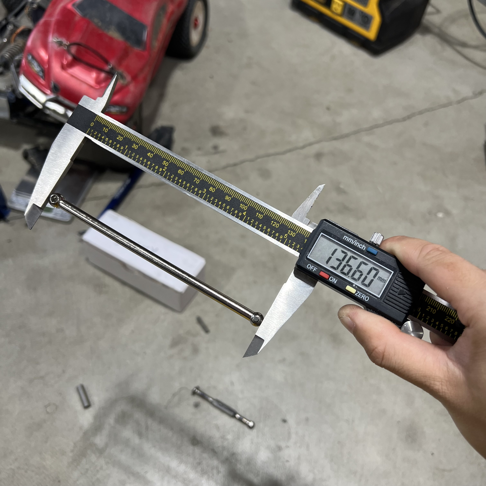
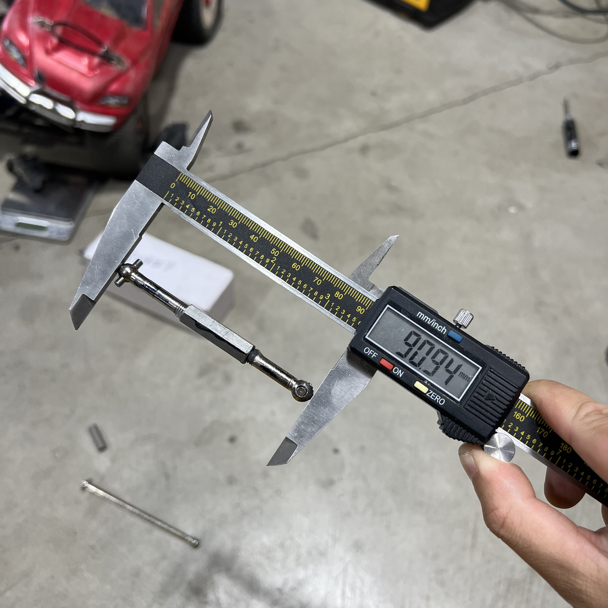
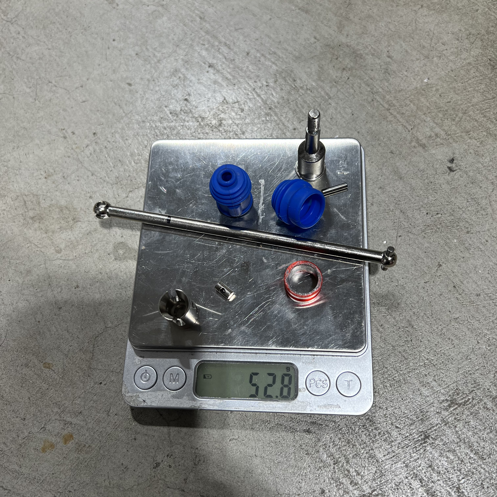
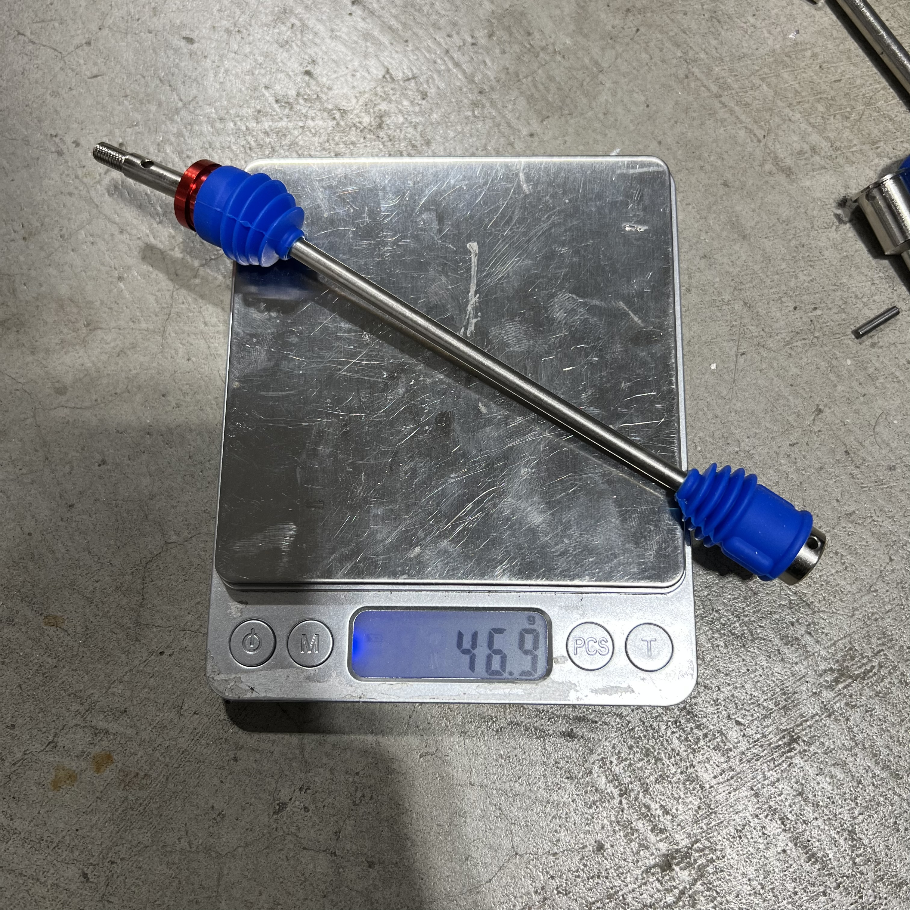

# Driveshaft Selection — FastAzJato4x4

> **Chosen:**
> - **Axle (wheel) driveshafts: E-Revo 1.0 CVDs (genuine or ~$20 knock-off), chopped to fit.** Cut each in half and rejoin to length with a **keyed sleeve + Loctite 680 — no pin, no weld.** Tune the length on a threaded prototype first. **Shorter = front.** 6mm matches the E-Revo diffs/cups. See [build options](#build-options--joining-the-two-cvd-halves).
> - **Center driveshaft: stock Slash 4x4 aluminum one-piece (TRA6855, 215mm).** Plastic deforms on 4S and the Tekno Big Bone isn't worth the money — stock metal is the pick. **Don't grab TRA6755 — that's the 189mm Rustler shaft and it's too short.**

  &nbsp;&nbsp; 
  <em>Chosen axle: E-Revo 1.0 CVDs, chopped to fit · Runner-up axle: knock-off Slash 4x4 HD steel CV · Chosen center shaft: stock Slash 4x4 TRA6855 (215mm)</em>

> **Runner-up note:** if the E-Revo CVD route falls through, the **knock-off Slash 4x4 HD steel CV ($20–30)** is the next best. Same smooth steel-CV feel for a fraction of the genuine TRA6851R price. **It's a 5mm diff end, so switch the diff to 5mm outdrives and cups** (the E-Revo route is 6mm) — easy swap, just an extra step.

---

## Table of Contents

- [Key Requirements](#key-requirements)
- [Axle (Wheel) Driveshaft Comparison](#axle-wheel-driveshaft-comparison)
- [Knock-Off E-Revo CVDs](#knock-off-e-revo-cvds)
- [Shortening + Joining E-Revo CVDs](#shortening--joining-e-revo-cvds-custom-axles-wip)
- [Center Driveshaft Comparison](#center-driveshaft-comparison)
- [Price History](#price-history)
- [Notes](#notes)

---

## Key Requirements

| Requirement | Type | Why |
|---|---|---|
| **6mm at the diff end** | Must | Must mate the chosen E-Revo 1.0 **6mm** diff outdrives and cups (see [`differential_analysis.md`](differential_analysis.md)). The whole driveline is built around 6mm |
| **Fits Jato 4x4 hub / wheel end** | Must | Outer end has to seat the wheel hex / stub axle without modification |
| **Clears the arm + steering link at full travel** | Must | U-joint style shafts can foul the suspension arm at full droop and catch the steering link — must clear through the whole travel range |
| **Survives 4S power** | Must | Has to transmit full torque without twisting or stripping |
| **Cheap / available** | May | Wear item — the ~$20 knock-off CVD route keeps replacements painless |
| **Remakeable** | May | ~~Easily serviceable~~ — dropped. Final axles are **permanently joined (keyed sleeve + Loctite 680, no pin)**. Length is dialed on an **adjustable threaded prototype** first; if a final axle ever fails, you just **remake a set** (the CVDs are cheap) rather than disassembling — so length-adjustability matters on the prototype, not the final part. |

---

## Axle (Wheel) Driveshaft Comparison

> *Spec format: Type · Part · Diff end · Fits · Price*

| Driveshaft | Spec | Pros / Cons | Photo / Link |
|---|---|---|---|
| ⭐ **Traxxas E-Revo 1.0 CVDs (chopped to fit)** | **Type:** CVD (constant-velocity) **Part:** TRA5451R (set — sold as a set, no singles) **Diff end:** **6mm** **Fits:** E-Revo diffs and cups **Price:** **$69.95** (Traxxas MSRP) | Pro: **Smoothest power delivery through full travel — no U-joint clearance problems.** 6mm, matches the E-Revo diffs and cups. The basis of the whole driveline. Cut to length and rejoin with a 6mm threaded collet / metal tube (see method below)  Con: Requires cutting + collet/solder work to shorten. **Genuine set is $69.95 — the ~$20–28 knock-off is a fraction of that** |  |
| ⭐ **Knock-off E-Revo 1.0 CVDs (chopped to fit)** — *budget* | **Type:** CVD knock-off of TRA5451R **Part:** N/A (varies by seller) **Diff end:** 6mm **Fits:** E-Revo diffs and cups **Price:** **~$20–28 for a set of 4** | Pro: **Set of 4 for $20–28 — fantastic in real use on the E-Revo 1.0.** Indistinguishable from genuine TRA5451R in practice. Same 6mm fitment. Same collet / cut-to-length method. Alt: swap diff outdrive to standard if 6mm cups not available. See [Knock-Off E-Revo CVDs](#knock-off-e-revo-cvds)  Con: Same cut + collet work required. Knock-off QC on paper, indistinguishable in practice |  |
| 🔵 **Traxxas E-Revo 1.0 U-joint shafts (chopped to fit)** | **Type:** U-joint style **Part:** TRA5451X **Diff end:** 6mm **Fits:** E-Revo diffs and cups **Price:** N/A | Pro: 6mm, works, simpler than CVDs  Con: **Too large — hits the suspension arms at full extension.** Also catches the steering link sometimes. These clearance issues are why the CVDs are chosen over U-joints |  |
| 🔵 **MonsterKingz HD steel U-joint axles (eBay)** | **Type:** nickel-plated **hardened steel** U-joint / CVA, telescoping **Part:** MonsterKingz (eBay #332244551728) **Diff end:** **5mm** stub **Fits:** Slash 4x4 / Stampede / Rustler / Hoss 4x4 VXL **Price:** **from ~$44.99 (set of 4)** — varies by model picked | Pro: **This is the "FLM steel axle" I was chasing — it's actually MonsterKingz.** Hardened steel U-joints, full set of 4, telescoping. **Same axle fits all the 4x4 models** (Slash/Stampede/Rustler/Hoss) — just pick the cheapest variant in the listing. Trusted US eBay seller (99.5%, 319 sold, free fast shipping)  Con: **Likely super heavy** — solid steel adds rotating + unsprung weight, which dulls acceleration and hurts suspension response. U-joint style — watch arm / steering-link clearance at full droop. 5mm Slash stub, so switch the diff to 5mm outdrives/cups |  |
| 🥈 **Knock-off Slash 4x4 HD Steel CV** | **Type:** CV knock-off of TRA6851R **Part:** N/A (generic) **Diff end:** **5mm** **Fits:** Slash 4x4 pattern (5mm cups) **Price:** **~$20–30 (set of 4)** | Pro: **Runner-up to the E-Revo CVDs.** $20–30 gets a **full set of 4** — vs $69.95 for just two genuine TRA6851R axles. Same steel-CV design and smooth feel  Con: **5mm diff end — switch the diff to 5mm outdrives and cups** (the rest of the build is 6mm E-Revo). Easy swap, just an extra step. QC varies on paper |  |
| 🔵 **TRA9051 / TRA9052** Jato 4x4 VXL EHD Driveshafts | **Type:** Extreme Heavy Duty, native Jato 4x4 VXL fit **Part:** TRA9051 (front) / TRA9052 (rear); set of 4: 90386-4 **Diff end:** **6mm** **Fits:** Native Jato 4x4 VXL; E-Revo diffs **Price:** **$28.97** set of 4 (Jenny's RC, out of stock) | Pro: **Stronger than the standard EHD axles** despite sharing the "Extreme Heavy Duty" name. Native Jato 4x4 VXL fit, 6mm axle matches E-Revo diffs. Front + rear covered  Con: Tends to break at the threads like other axles. **Rubs badly on the arm at full droop** — same clearance problem as the U-joint shafts |  |
| ❌ ~~**Traxxas Slash 4x4 HD steel CV (2nd gen)**~~ | **Type:** nickel-plated steel CV w/ boots, U-joint pins held captive **Part:** TRA6851R (front) / TRA6852R (rear) **Diff end:** 5mm **Fits:** Slash 4x4 pattern (5mm cups) **Price:** **$69.95** (set of 2) | Pro: Steel CV, boots, captive pins — strong "2nd gen" upgrade, smooth like the E-Revo CVDs  Con: **Too expensive — $69.95 buys only two axles. The ~$20–30 knock-off above gets you four** for the same steel-CV design. No contest on value |  |
| ❌ ~~**Traxxas Slash 4x4 EHD axles**~~ | **Type:** Extreme Heavy Duty telescoping, oversized U-joints **Part:** TRA6852A (rear) / TRA6851A (front) **Diff end:** 6mm stub axles **Fits:** Slash 4x4 pattern **Price:** N/A | Pro: Telescoping, oversized U-joints, 6mm stubs  Con: **Nowhere near as strong as the true EHD TRA9051/9052** despite the same "EHD" name — no reason to pick these over the real EHD set |  |
| 🚫 ~~**Traxxas Slash 4x4 stock axle (1st gen, U-joint)**~~ | **Type:** stock Slash 4x4 U-joint half shaft **Part:** TRA6852X (rear) / TRA6851X (front) **Diff end:** 6mm **Fits:** Slash 4x4 pattern (fits the build) **Price:** N/A | Pro: Cheap, widely available. Fits the build  Con: **Worst option — snaps like candy.** Only minor rubbing on the arms, not a full clearance hit, but the snapping issue makes this a last resort |  |

---

## Knock-Off E-Revo CVDs

The knock-off E-Revo 1.0 CVDs run **~$20** and **perform identically to the genuine Traxxas CVDs** — no noticeable difference in real use. Same 6mm diff end, same chopped-to-fit method. For a wear item that gets cut down and rebuilt anyway, the knock-off is the sensible buy.

> *Spec format: Type · Part · Diff end · Fits · Price*

| Part | Spec | Pros / Cons | Photo / Link |
|---|---|---|---|
| ⭐ **Knock-off E-Revo 1.0 CVD set** (e.g. RCAWD) — *budget* | **Type:** CVD knock-off **Part:** vary by seller (AliExpress / RCAWD / budget RC sellers) **Diff end:** 6mm **Fits:** E-Revo diffs and cups **Price:** **~$20** | Pro: ~$20, works equally as well as genuine. Often ships with wheel hexes + hardware. Cheap enough to keep spares  Con: QC varies on paper; indistinguishable from OEM in practice |  |

---

## Shortening + Joining E-Revo CVDs (custom axles, WIP)

The E-Revo 1.0 CVDs are too long for the Jato, so they get **cut in half and rejoined to length** with a center sleeve. They seat in the **Jato 4x4 EHD hubs** (4 Teflon washers at the wheel end).

**The plan, two steps:**
1. **Tune length** on an adjustable threaded axle. **Shorter = front.**
2. **Lock it permanently:** knurl the shaft, bond into a long tight sleeve with **Loctite 680**. **No pin** (can't drill the SS sleeve), **no weld** (it kept cracking at the bead).

> ⚠️ **Status:** front length dialed (**90.5 mm**, table below). **Rear not built yet.** Wear part, so a fresh set is easy to remake.

### Measured lengths (prototype)

> **All lengths are end-to-end (overall) — tip of one cup/stub to the other, NOT hole-to-hole / pivot-center spacing.** Use this when cross-shopping a donor axle: match the overall installed length, not a listing's pivot-to-pivot number.

| Axle | Length | Status | Notes |
|---|---|---|---|
| **Uncut E-Revo CVD** (full length) | **136.60 mm end-to-end** · **132 mm pin-to-hole** | reference | Stock E-Revo 1.0 CVD before cutting. Two dims: **end-to-end (tip to tip) = 136.60 mm**, **pin-hole to pin-hole = 132 mm**. The **~4.6 mm** difference is the cup material beyond the pin holes at each end. (The earlier lone "132" was this pin-to-hole figure, not purely a caliper error.) |
| **Front (adjustable prototype)** | **90.5 mm end-to-end** · **~85.9 mm pin-to-hole** | ✅ length dialed | Threaded prototype adjusted to fit on the car. **Final front = 90.5 mm end-to-end** (ignoring the manufacturing nub); **pin-to-hole ≈ 85.9 mm** (90.5 − 4.6 offset — verify on the build). **Even halves: 45.25 mm each** (tip → cut), joined at center in the keyed sleeve (knurl + 638/680). Remove **46.1 mm** total (136.60 − 90.5) → **~23.05 mm off each inner end**. Cut a hair long, dry-fit before bonding. **Shorter = front.** |
| **Rear** | TBD | ⏳ not built yet | Build + tune the rear adjustable prototype next, then keyed-glue. |

**Front axle fitment spec (for cross-shopping a donor):**

| Dimension | Value |
|---|---|
| End-to-end | **90.5 mm** |
| Pin-to-hole | **~85.9 mm** |
| Diff end | **6 mm** |
| Pin-side ball | **8 mm** |
| Stub-side ball (joins the stub) | **9 mm** |

> The ends are **asymmetric** (8 mm pin-side ball vs 9 mm stub-side), so a donor axle has to match *both* ball sizes, not just the length — narrows the field a lot.
>
> **Why 90.5 mm:** the front runs **FLM26800 extended arms (101.6 mm pin-to-pin, ≈102 mm) vs 92 mm stock**, ~10 mm/side wider track — the axle length is sized to that arm. Change arms → re-tune the axle. See [`arm_analysis.md`](arm_analysis.md).

### Off-the-shelf CV option — Traxxas/Tekno part + length map (buy instead of build)

Instead of cutting E-Revo CVDs, a stock steel CV that's the right length + uses the strong **Tekno M6 stub** is a "buy instead of build" path. The **half shaft is the length-determining part** — Traxxas part numbers confirm which CVDs share a length:

| CVD (assembled) | Half shaft | Vehicle / position | Length |
|---|---|---|---|
| **6851R** | **6750** | Slash 4x4 **front** | 4x4 length |
| **6852R** | **6750** | Slash 4x4 **rear** | **same as 6851R** (shares 6750) |
| **1951R** | **6752** | 2WD Slash/Rustler/Stampede **rear** | **longer** ("long half shaft") |

> **Key facts (verified via Traxxas half-shaft pages):** **6851R = 6852R in length** (both use half shaft 6750). **1951R is a different, longer length** (unique half shaft 6752). So the length order is **1951R (6752) > Slash 4x4 6851R/6852R (6750)**, and the SCTE M6 CVD (TKR2210) is longer still.

**Tekno M6 equivalents** (stronger stub, bigger bearings 10×15×4 inner / 6×12×4 outer, captured CV pin):
- **TKR6851X** (4x4 front) / **TKR6852X** (4x4 rear) — Slash-4x4 length (stock arms)
- **TKR1951X** (2WD rear) — the **longer** 1951 length
- **TKR2210 / 2210X** (SCTE / 2WD Rustler-Stampede) — **longest** in the M6 family
- **TKR6853** — the 6 mm M6 **stub axles alone**

**For the extended FLM arms (101.6 mm):** the Slash 4x4 CVD (6851X) runs ~10 mm short. The longer **1951-length (TKR1951X)** or **SCTE-length (TKR2210)** M6 CVD is the reach candidate — measure before buying (lengths aren't published). Or rebuild a longer CV around the **6752 half shaft**. Note: E-Revo's 8/9 mm balls likely won't mate the 6 mm M6 stub, so the M6 route means Slash-pattern CVDs.

  &nbsp; 
  <em>Uncut E-Revo CVD: 136.60 mm · Front adjustable prototype: 90.94 mm (≈91 flat) — both re-measured with the caliper re-zeroed</em>

### Knock-off axle diameters — not all the same shaft

The AliExpress CVDs come in **two shaft diameters with the same cups/boots/hardware** — so check the bare mid-shaft with calipers before picking a thread kit. Each needs a different die/tap/hex joiner.

| Shaft | Source | Weight | Die (shaft) | Tap (hex joiner) | Tap drill | Hex joiner | Notes |
|---|---|---|---|---|---|---|---|
| **5.5 mm** (older set) | AliExpress | **52.8 g** | **1/4-20** | 1/4-20 | #7 / 13/64" (~5.1 mm) | 1/4-20 hex coupler | **Stronger** (torsion ∝ d³ → ~1.8× the 4.5 mm). Heavier. **More prone to hitting the cup at full droop.** |
| **4.5 mm** (newer set) | AliExpress | **46.9 g** | **M5×0.8** (alt #10-32) | M5×0.8 | 4.2 mm (alt #19) | M5 hex coupler | **~6 g lighter; ~55% of the 5.5 mm torsional strength.** **Clears better at full droop** (less cup interference). |

> **Tradeoff:** 5.5 mm = strength, 4.5 mm = droop clearance. The thinner 4.5 mm shaft **binds less on the cup at full droop**, but it's the weaker shaft. Since the **front sees more load and more droop**, the 5.5 mm strength helps there but so does the 4.5 mm clearance — decide on the car. Weights are the complete axle, same hardware on both (the 52.8 g photo just has the loose parts on the pan too).

  &nbsp; 
  <em>5.5 mm older AliExpress axle: 52.8 g (disassembled, parts on pan) · 4.5 mm newer AliExpress axle: 46.9 g (assembled)</em>

> **Sleeve sizing (5.5 mm shaft):** tight fit **~5.6 mm ID** (~0.1 mm gap) → **Loctite 680**; loose **~6 mm ID** (~0.5 mm gap) → **Loctite 660** (gap-fill). Keep the wall thick enough to stay stiff, the OD slim for droop clearance. One piece, no telescoping. Knurl the shaft (the glue's key). Exact buys in the table below.

### Build recipe — 5.5 mm shaft (older AliExpress set)

> Target: **90.5 mm** final front, **even 45.25 mm halves**. Stronger shaft, but binds on the cup at full droop.

1. **Measure stock + mark cut.** Uncut 5.5 mm CVD = **136.60 mm**. Remove **46.1 mm** (cut ~23.05 mm off each inner end so the halves come out even at 45.25 mm). Cut a hair long, sneak up on it.
2. **Key the ends.** Thread each cut end with a **1/4-20 die**, or knurl/crosshatch ~10 mm of the shaft. Threads double as the glue key.
3. **Joiner / sleeve.** **1/4-20 hex coupler** (threaded route), or a steel sleeve reamed to **~5.6 mm ID** (~0.14 mm slip fit) over a knurled shaft.
4. **Set length + bond.** Dry-fit to 90.5 mm, then **Loctite 680** (tight fit) or **660** (loose ~0.5 mm sleeve). Scuff, degrease, prime 7649. No pin, no weld.
5. **Check runout**, let cure fully before running.

### Build recipe — 4.5 mm shaft (newer AliExpress set)

> Same **90.5 mm / 45.25 mm even-halves** target. Weaker shaft (~55% of 5.5 mm torsion) but **clears the cup better at full droop** — the reason to run it front.

1. **Measure stock + mark cut.** **Mic the 4.5 mm uncut axle first — it may NOT be 136.60 mm** like the 5.5 mm set. Remove `(its stock length − 90.5 mm)`, split evenly so each half is 45.25 mm tip-to-cut.
2. **Key the ends.** Thread each cut end with an **M5×0.8 die** (alt #10-32), or knurl/crosshatch ~10 mm. Keep threads/knurl shallow — the thin shaft has less meat to give up.
3. **Joiner / sleeve.** **M5 threaded hex coupler/standoff** (the coupler *is* the sleeve), or a smooth steel sleeve reamed to **~4.6 mm ID** (~0.1 mm slip fit) over a knurled shaft. If tapping your own coupler: **M5×0.8 tap, 4.2 mm drill**.
4. **Set length + bond.** Screw/slide to 90.5 mm, then **flood with Loctite 680**. Scuff, degrease, prime 7649. **Long overlap matters more here** since the shaft is weaker. No pin, no weld.
5. **Check runout**, full cure before running.

### Slip fit — smooth vs keyed, and what sleeve to buy

A **slip fit** = shaft slides into the sleeve with a small clearance, the retaining compound fills the gap. Two flavors, **same sleeve** for both:

- **Smooth slip fit** — shaft as-is into the sleeve + 680. Easiest (no tools), but relies **100% on adhesive shear**; a wheel axle's reversing shock torque can peel a smooth bonded joint loose over time.
- **Keyed slip fit (recommended)** — **hand-crosshatch the shaft ends with a file** (a few diagonal strokes each way) before gluing. The cured 680 bites the grooves and resists rotation. No special tools, doesn't touch the SS sleeve, basically free torsional insurance.

> **Why no pin:** the **stainless sleeves can't be drilled with the bits on hand** (SS work-hardens, eats HSS). Keyed slip fit gives the mechanical grip without drilling.

**What sleeve to buy — off the shelf, no reaming.** The trick: **Loctite 660 fills up to ~0.5 mm clearance**, so a slightly-loose stock sleeve still holds. Tight fits use 680, loose off-shelf fits use 660. (Caliper any SS sleeve you already have first — if it's close, match the glue to the gap and skip buying.)

| Shaft | Sleeve (buy as-is) | ID | Gap | Glue | Where |
|---|---|---|---|---|---|
| **5.5 mm** | **K&S 1/4" OD steel tube** (easy win) | ~5.64 mm | ~0.14 mm | **680** | Ace / Home Depot / Amazon |
| **4.5 mm** | **3/16" ID steel spacer/standoff** | ~4.76 mm | ~0.26 mm | **660** (or 648) | McMaster / Amazon |
| 4.5 mm (alt) | **steel rigid shaft coupling, 5 mm bore** | 5.0 mm | ~0.5 mm | **660** | Amazon |

> **Ace only had stainless tube — that's fine, even better.** SS is **stronger + stiffer** than the brass/alu on the same rack, and since this is **glue not drill**, the can't-drill-SS issue never applies. **Bring the axle shaft to the store and slide-test** it into the K&S SS tubes; buy the one it *just* slips into. Likely: **5.5 mm → 1/4" OD SS tube** (ID ~5.6 mm, 680); **4.5 mm → 7/32" OD SS tube** (ID ~4.8 mm, 660/648). **7649 primer is mandatory on stainless.** Thin SS wall is OK with a long glue overlap.

Buying-blind rules:
- **Steel, not aluminum** — aluminum couplings are common for motors but too soft for an axle.
- **Keep the OD slim** — a chunky rigid coupling can foul the arm/cup at full droop, especially on the 4.5 mm front axle. A tube or slim standoff beats a fat coupling.
- **Match glue to the measured gap:** tight ≤0.15 mm → **680**; loose up to 0.5 mm → **660**.
- **Stainless sleeve → 7649 primer required** (passive metal, or the anaerobic won't cure).
- A hand **file-crosshatch** on the shaft turns any of these into a keyed slip fit (no drilling, no reaming).

### Build options — joining the two CVD halves

> **Chosen: keyed sleeve + Loctite 680, no pin, no weld.** The knurl/thread is the mechanical key that lets glue survive reversing torque. **Stainless sleeve must be primed (7649)** or the 680 won't cure. Struck-through rows = ruled out.

| Option | How | Status |
|---|---|---|
| ⭐ **Keyed sleeve + retaining compound (680), no pin** | **Knurl/crosshatch the shaft ends** (or use the cut threads) so the glue has a **mechanical key**, then bond into a **long, tight steel sleeve** with **Loctite 680** (highest-strength retaining compound, ~5000 psi). **Scuff + degrease + prime 7649** both surfaces. The cured compound shears in the knurl grooves / thread flanks to resist rotation — no pin. No heat, no HAZ, no warp. Permanent. | **Chosen — permanent final, no pin (user pref).** The knurl/thread key replaces the pin; smooth-shaft glue-only is the risk, keyed glue is the fix. |
| 🔵 **Threaded sleeve + 680 flooding the threads** | Thread the cut ends (1/4-20 / M5 die), thread the coupler to match, screw to length, **flood with Loctite 680**. Thread flanks carry torque; 680 locks back-out. | Strong glue-only alt — uses the threads already cut as the key. |
| 🔵 **Threaded adjustable axle (length-tuning prototype)** | Thread both cut ends into an internally-threaded steel standoff so the length **adjusts**. Fit to the car, dial in each end (**front shorter**), then build the permanent keyed-glue axle to that measured length. | **Prototype only** — used to find the length, then superseded by the keyed-glue set |
| 🚫 ~~Weld + sleeve~~ | Sleeve + fillet-weld each end, flux-core, aluminum-angle jig | **Tried — kept breaking at the weld** despite full penetration. Brittle HAZ (medium-carbon quench-hardening on fast cool) + likely **plating contamination** on the knock-off shaft + stress riser at the weld plane. Rescue would need grind-to-bright + preheat ~300–400°F + slow-cool (sand/blanket) + lap-joint sleeve — too fussy and still unreliable. Keyed-glue sleeve instead. |
| 🚫 ~~Threaded + set screws + red Loctite (serviceable)~~ | Thread the ends, set screws on filed flats, red Loctite, torch to adjust | **Dropped for the final part** — serviceability traded away; the keyed-glue sleeve is cleaner and remaking a set is easy. (Still the route if you ever want a *serviceable* axle.) |
| 🚫 ~~Carbon-fiber tube sleeve~~ | CF tube as the coupler, bonded | **Wrong for the axle:** cheap CF is **weak in torsion** (splits unless ±45° braided), **brittle** (shatters on impact where steel bends), and **can't take set screws or a pin** (crushes/delaminates) → forces a **permanent epoxy bond**, killing serviceability. *Older racers used CF/alloy tube — for the **center driveshaft**, not the wheel axle.* |
| 🚫 ~~Telescoping nested tubes~~ | Nest K&S tubes to build wall thickness | **You want one piece** |
| 🚫 ~~Threaded + Loctite only (no pin)~~ | Thread the ends + red Loctite, nothing mechanical | **Backs out** under reversing throttle/brake |
| 🚫 ~~Thin brass/alu sleeve (structural)~~ | K&S 1/4" brass tube as the coupler | Wall too **thin/soft** (0.36 mm) for an axle |
| 🚫 ~~Epoxy / JB Weld~~ | Bond the joint with epoxy | **Brittle** under reversing torsion — cracks |
| 🚫 ~~Press fit~~ | Hammer the shaft into a tight bore | Hard to size by hand, no glue gap, fights length-setting |
| 🚫 ~~Weld/braze hardened steel~~ | Weld a hard axle without re-heat-treat | Anneals → soft/brittle joint (moot here — these file soft) |

**Notes:**

- **Why not weld:** even with full penetration it cracked at the bead — brittle heat-affected zone on this plated, medium-carbon steel. Glue skips the heat entirely.
- **Use a retaining compound, not threadlocker.** Threadlocker (263/271) is weak on a smooth shaft. **Loctite 680** (or 648 for heat, 660 for loose gaps) bonds the whole sleeve overlap, so a long sleeve = strong joint. Budget swap: Permatex Sleeve Retainer.
- **Stainless = prime with 7649** (passive metal, won't cure otherwise). Knurl the shaft so the glue keys mechanically; keep the overlap long.
- **Soft-but-fat is fine:** the 5.5 mm shaft is fatter than typical ~4 mm CVDs (torsion scales with diameter³) and soft steel bends instead of snapping.

---

## Center Driveshaft Comparison

**Take: stock Traxxas aluminum one-piece is the pick.** This is the diff-to-diff shaft, not the wheel axles. On 4S the plastic shaft deforms and the Tekno Big Bone costs more for no gain, so the stock metal shaft wins on value.

> *Spec format: Type · Material · Part · Length · Price*

| Driveshaft | Spec | Pros / Cons | Photo / Link |
|---|---|---|---|
| ⭐ **Stock Slash 4x4 aluminum (one-piece)** | **Type:** Hollow one-piece (non-telescoping) **Material:** 6061-T6 aluminum **Part:** TRA6855 (Slash 4x4) **Length:** **215mm** (8.5") **Price:** **$10** | Pro: **Best value — light, stiff, splines onto the front/rear input shafts with no driveline play.** Correct **215mm** Slash 4x4 length. Handles 4S where plastic deforms; no premium spent on the Tekno for zero gain  Con: One-piece (non-telescoping); aluminum can bend in a hard hit. Leaves the stock ~3–4mm of spline slop |  |
| 🔵 **Raptor R 4x4 aluminum (custom-length)** | **Type:** One-piece splined **Material:** 6061-T6 aluminum **Part:** TRA10155 (Raptor R 4x4) **Length:** **~247mm** — longer than the Slash's 215mm **Price:** **$13.95** | Pro: **Longer shaft you cut/set to a custom length** — lets you take up the stock ~3–4mm of spline slop. Worth it on a rigid CF chassis with a top plate, where you want zero play (vs a flexy plastic chassis, where the slop is fine). 6061-T6, light, stiff  Con: Longer than needed — must measure and trim to fit. Overkill if stock slop doesn't bother you |  |
| ❌ ~~**Tekno Big Bone aftermarket**~~ | **Type:** dog-bone center shaft + outdrives **Material:** anodized aluminum shaft, hardened steel outdrives **Part:** TKR6855 (Slash 4x4 kit) **Length:** N/A **Price:** **$34.99** (in stock) | Pro: Nicely built dog-bone, hardened steel outdrives  Con: **Not worth the money — no performance gain over stock.** The shaft still bends and the outdrives get super chewed up, and it runs noisily. Literally cheaper to run stock metal, or even plastic at worst |  |
| 🚫 ~~**Stock plastic (screw pin)**~~ | **Type:** one-piece w/ screw pin **Material:** black plastic **Part:** TRA6767 **Length:** N/A **Price:** **$4.00** | Pro: Cheapest at $4 — lightest option  Con: **We're running 4S — plastic deforms under that power** over many packs. Fine for a stock basher, not for this build |  |
| 🚫 ~~**Rustler 4x4 aluminum (wrong fit)**~~ | **Type:** one-piece **Material:** 6061-T6 aluminum **Part:** TRA6755 (Rustler 4x4) **Length:** **189mm** (6.5") **Price:** **$10** | Pro: Same aluminum build as the Slash shaft — looks nearly identical  Con: **Too short — 189mm vs the Slash 4x4's 215mm.** Easy to order by mistake; this is the Rustler/Stampede 4x4 part. Get **TRA6855** instead |  |

---

## Price History

### Axle (wheel) driveshafts

| Date | Price | Discount Path | Notes |
|------|-------|---------------|-------|
| 2026-06-01 | **$21.10** ✅ **purchased** | Sale (~$6.66 off the $27.76 sale price) + $1 coupon if delayed | Order #8211906604054866 from FengS Store on AliExpress. Product title: "Front & Rear Driveshafts For TRAXXAS Hoss/Rustler/Slash/Stampede 4X4 2wd 1/10 RC Car Upgrade Accessories" — set of 4 (front + rear pair). Free returns. See [`/Deals/aliexpress_codes.md`](../../Deals/aliexpress_codes.md) |

---

## Notes

- **Why CVDs over U-joints:** the E-Revo 1.0 U-joint shafts work, but the U-joint **hits the suspension arm at full travel and catches the steering link** sometimes. The CVDs deliver power smoothly through the whole travel range without that clearance problem — that's why they're the pick.
- **Real vs knock-off CVD:** both work equally well. The ~$20 knock-off is the value choice since the shaft gets cut down and rebuilt anyway.
- **Join method (custom axles):** tune length on a threaded prototype, then keyed sleeve + Loctite 680 (no pin, no weld). Details in [Shortening + Joining](#shortening--joining-e-revo-cvds-custom-axles-wip).
- **Diff: use the E-Revo 1.0 stock diffs.** Proven — E-Revo output drives + the knock-off CVD stock cups fit the stock Slash diffs and work great, and the E-Revo diff has the internal cross-**bar** that makes it stronger. **Before trying an XO1 diff, verify its outdrive/cup interface matches the E-Revo 6mm setup** — don't introduce that unknown unless it's confirmed-fit and meaningfully stronger.
- **Center driveshaft pick logic:** **stock Slash 4x4 metal (TRA6855, 215mm) is the choice on this 4S build.** Plastic ($4) is fine for a stock basher but deforms under 4S. **Skip the Tekno Big Bone** — costs much more for no performance gain, still bends, chews up its outdrives, and runs noisily.
- **Watch the center-shaft length:** **TRA6855 = Slash 4x4 (215mm/8.5")**, **TRA6755 = Rustler/Stampede 4x4 (189mm/6.5")**. They look identical but the Rustler shaft is ~26mm too short for the Slash. Order TRA6855.
- **Custom length / slop note:** Traxxas one-piece splined center shafts leave ~3–4mm of axial slop on purpose. That play is fine — even helpful — on a **flexy plastic chassis**, but on a **rigid carbon-fiber chassis with a top plate** you'd rather run zero play. The **Raptor R TRA10155 (~247mm)** is longer than the Slash shaft, so you can **cut it to an exact custom length** and take the slop out. Measure the installed gap before cutting.
- **Confirmed part numbers:** E-Revo CVD = **TRA5451R** (set, no singles); E-Revo U-joint axle = **TRA5451X**; Slash stock U-joint axle = **TRA6852X/6851X**; Slash HD steel CV = **TRA6852R/6851R**; Slash EHD = **TRA6852A/6851A**; alum center driveshaft = **TRA6855** (Slash 4x4, 215mm — *not* TRA6755, which is the 189mm Rustler); plastic center driveshaft = **TRA6767**; Tekno center = **TKR6855**.
- **Cut length:** front target — **final 90.5 mm, even halves 45.25 mm each** (tip → cut, joined at center in the sleeve). Remove **46.1 mm** total from the 136.60 stock (~23.05 mm per inner end). Measured flat, ignoring the manufacturing nub, caliper re-zeroed; cut a hair long and dry-fit in the sleeve. **Rear not built yet** — tune it next. See [Measured lengths](#measured-lengths-prototype). The knock-off CVD **stock cups are confirmed to fit the diffs**.
