# Driveshaft Selection — FastAzJato4x4

> **Chosen: Tekno M6 stub axle build, matched to the stock 5mm diffs.**
> - **Stubs: Tekno M6 17mm front (TKR1654-17) + bare Tekno 5580 rear stubs**, **✅ confirmed a perfect fit** in the rear hubs. The wheels mount on **AliExpress aftermarket 17mm hubs (E-Revo 1.0 fit)** at all four corners, see [17mm hubs](#17mm-wheel-hexes).
> - **Driveshafts:** the full 4-set of cheap **AliExpress CVDs**, complete front + rear driveshafts (TRA6851R front + TRA6852R rear clones, 5mm diff end), with genuine **TRA6752 long output shafts at all four ends (4×)**. The set's own stock-length TRA6750 shafts came up **too short to work at either end**, so all four get replaced. **Sell the OG stubs and all 4 short shafts** to offset cost. See [2WD long CVDs](#2wd-long-cvds--6752-output-shafts-cheap-long-axle-build).
> - **Center driveshaft: Jato 4x4 BL-2S take-off shaft (7455), $2.49, bought instead of the TRA6855.** Native Jato fitment, bundle includes a pinion + bearings.
>
> **This doc is the driveline only** (shafts, stubs, output shafts, center shaft). The **hubs + bearings** (Raptor R hubs, 10×15×4 inner in a sleeve, etc.) live in [`hub_analysis.md`](hub_analysis.md); the **17mm wheel hexes** live in [17mm wheel hexes](#17mm-wheel-hexes).
>
> **Now a fallback (spares):** E-Revo 1.0 CVDs chopped to fit (keyed sleeve + Loctite 680) in the [comparison](#axle-wheel-driveshaft-comparison), only relevant again if the diff plan moves back to the E-Revo 1.0 (6mm).

  &nbsp;&nbsp;&nbsp;&nbsp;&nbsp;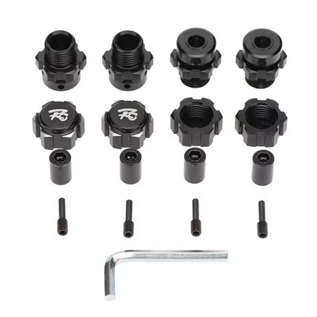 
  <em>Chosen axle build: knock-off Slash 4x4 HD steel CV driveshafts, front + rear · TKR1654-17 front 17mm M6 stub · TKR5570-17 rear kit (5580 stub + hexes) · TRA6752 long output shaft (×4, all corners) · Jato 4x4 BL-2S center shaft (7455) · AliExpress 17mm splined hubs, E-Revo 1.0 fit, black, $8.36 the set of four</em>

---

## Table of Contents

- [Key Requirements](#key-requirements)
- [Axle (Wheel) Driveshaft Comparison](#axle-wheel-driveshaft-comparison)
- [2WD long CVDs + 6752 output shafts](#2wd-long-cvds--6752-output-shafts-cheap-long-axle-build)
- [Tekno stubs (front + rear)](#tekno-stubs-front--rear)
- [17mm wheel hexes](#17mm-wheel-hexes)
- [Knock-Off E-Revo CVDs](#knock-off-e-revo-cvds)
- [Shortening + Joining E-Revo CVDs](#shortening--joining-e-revo-cvds-custom-axles-wip)
- [Center Driveshaft Comparison](#center-driveshaft-comparison)
- [Grease (CVDs + gears)](#grease-cvds--gears)
- [Price History](#price-history)
- [Notes](#notes)

---

## Key Requirements

| Requirement | Type | Why |
|---|---|---|
| **5mm at the diff end** | Must | Must mate the chosen **5mm** diff outdrives (AliExpress knock-off Slash 4x4 diffs, see [`differential_analysis.md`](differential_analysis.md)). The axle plan is built around **Slash 4x4-pattern (5mm) CVDs**, not the E-Revo 6mm CVDs |
| **Fits Jato 4x4 hub / wheel end** | Must | Outer end has to seat the wheel hex / stub axle without modification |
| **Clears the arm + steering link at full travel** | Must | U-joint style shafts can foul the suspension arm at full droop and catch the steering link, must clear through the whole travel range |
| **Survives 4S power** | Must | Has to transmit full torque without twisting or stripping |
| **Cheap / available** | May | Wear item, the ~$20 knock-off CVD route keeps replacements painless |
| **Remakeable** | May | ~~Easily serviceable~~, dropped. Final axles are **permanently joined (keyed sleeve + Loctite 680, no pin)**. Length is dialed on an **adjustable threaded prototype** first; if a final axle ever fails, you just **remake a set** (the CVDs are cheap) rather than disassembling, so length-adjustability matters on the prototype, not the final part. |

---

## Axle (Wheel) Driveshaft Comparison

> *Spec format: Type · Part · Diff end · Fits · Price*, except the ⭐ **combo** row, which lists its part **build sheet** in the Spec cell.

| Driveshaft | Spec | Pros / Cons | Photo / Link |
|---|---|---|---|
| ⭐ **Custom combo axle (the actual build)** — *chosen* | **Build sheet (assembly):** • Knock-off Slash 4x4 HD steel CV driveshafts, front + rear (TRA6851R + TRA6852R clones), **$21.10** / set of 4 • **4× TRA6752** long output shaft (**all four corners**), **$8 ea**; the set's stock-length TRA6750 shafts are **too short to use** • Front stub: Tekno **TKR1654-17** 17 mm M6, **$19.99/pr** • Rear: Tekno **5580** bare rear stubs, **$16.90/pair**  **Diff end:** 5 mm (stock Jato) **Fits:** EHD / Raptor R hubs + extended FLM arms (101.6 mm) **Price:** **~$102 gross · ~$66–82 net** (after selling the OG stubs + all 4 short shafts) | Pro: **The real winner, a long, strong M6 axle set for far less than genuine.** Reaches the extended FLM arm length, hardened Tekno M6 stubs, **no cut-and-glue**. Full assembly + cost in [2WD long CVDs + 6752](#2wd-long-cvds--6752-output-shafts-cheap-long-axle-build) and [Tekno stubs](#tekno-stubs-front--rear)  Con: **An assembly of 4 part sources, not an off-the-shelf axle** (the hub/bearing/hex side is in [`hub_carrier`](hub_analysis.md) + [`wheel_hex`](#17mm-wheel-hexes)) |     <em>CV body · TRA6752 long shaft · TKR1654-17 front stub · TKR5570-17 rear kit (stub + hexes)</em> |
| 🟢 **Knock-off Slash 4x4 HD Steel CV** — *the combo's driveshafts, ✅ purchased* | **Type:** CV knock-off of TRA6851R (front) **and** TRA6852R (rear), complete driveshafts **Part:** N/A (generic) **Diff end:** **5mm** **Fits:** Slash 4x4 pattern (5mm cups) **Price:** **$21.10 paid** (purchased 2026-06-01, see [Price History](#price-history)) | Pro: **The driveshafts of the combo above, already in hand, matches the stock Jato 4x4 diff (5mm).** Full set of 4 for $21.10, vs $69.95 for just two genuine TRA6851R axles. Same steel-CV design and smooth feel. **The Tekno M6 stub end fits these**, so they run with the strong M6 stubs (no cut-and-glue)  Con: **The set's stock-length shafts are too short at both ends**, so all four corners need the longer 6752 to reach the extended FLM arms (101.6 mm). QC varies on paper |  |
| 🟢 **Traxxas E-Revo 1.0 CVDs (chopped to fit)** — *in hand, now spares* | **Type:** CVD (constant-velocity) **Part:** TRA5451R (set, sold as a set, no singles) **Diff end:** **6mm** **Fits:** E-Revo diffs and cups **Price:** **$69.95** (Traxxas MSRP) | Pro: Smoothest power delivery through full travel, no U-joint clearance problems. The basis of the old driveline plan, cut to length and rejoined with a 6mm threaded collet / metal tube (see method below)  Con: **Needs the E-Revo 1.0 diff output drives (6mm outdrives/cups) to fit**, so it's spares/fallback unless the diff plan moves back to the E-Revo 1.0 (6mm). Genuine set is $69.95 vs the ~$20–28 knock-off |  |
| 🔵 **Knock-off E-Revo 1.0 CVDs (chopped to fit)** — *budget, 6mm only* | **Type:** CVD knock-off of TRA5451R **Part:** N/A (varies by seller) **Diff end:** 6mm **Fits:** E-Revo diffs and cups **Price:** **~$20–28 for a set of 4** | Pro: Set of 4 for $20–28. Indistinguishable from genuine TRA5451R in practice. Same collet / cut-to-length method. See [Knock-Off E-Revo CVDs](#knock-off-e-revo-cvds)  Con: **6mm, no longer matches the stock (5mm) diff pick.** Only relevant again if the diff plan moves back to E-Revo |  |
| 🔵 **Traxxas E-Revo 1.0 U-joint shafts (chopped to fit)** | **Type:** U-joint style **Part:** TRA5451X **Diff end:** 6mm **Fits:** E-Revo diffs and cups **Price:** N/A | Pro: 6mm, works, simpler than CVDs  Con: **Too large, hits the suspension arms at full extension.** Also catches the steering link sometimes. These clearance issues are why the CVDs were chosen over U-joints in the old 6mm plan. Also now the wrong diff end (5mm) |  |
| 🔵 **MonsterKingz HD steel U-joint axles (eBay)** | **Type:** nickel-plated **hardened steel** U-joint / CVA, telescoping **Part:** MonsterKingz (eBay #332244551728) **Diff end:** **5mm** stub **Fits:** Slash 4x4 / Stampede / Rustler / Hoss 4x4 VXL **Price:** **from ~$44.99 (set of 4)**, varies by model picked | Pro: **This is the "FLM steel axle" I was chasing, it's actually MonsterKingz.** Hardened steel U-joints, full set of 4, telescoping, **5mm diff end matches the stock diff pick.** Same axle fits all the 4x4 models (Slash/Stampede/Rustler/Hoss), just pick the cheapest variant. Trusted US eBay seller (99.5%, 319 sold, free fast shipping)  Con: **Likely super heavy**, solid steel adds rotating + unsprung weight, which dulls acceleration and hurts suspension response. U-joint style, watch arm / steering-link clearance at full droop |  |
| 🔵 **2WD "long" CV, TRA1951R / Tekno TKR1951X (M6)** — *fits w/ Tekno stubs* | **Type:** CV, 2WD "long half shaft" (uses the longer 6752 half shaft) **Part:** TRA1951R (Traxxas) / **TKR1951X** (Tekno M6 version) **Diff end:** 5mm (2WD), the **M6 version runs 6mm M6 stubs** **Fits:** 2WD Slash / Rustler / Stampede rear **Price:** **~$20–40** | Pro: **Longer than the Slash 4x4 CVD**, the candidate to reach the **extended FLM arm (101.6 mm)** length without cut-and-glue. The **TKR1951X** mates the strong **M6 stubs** (bigger bearings, captured pin)  Con: **Fits**, but to run it on the **EHD hubs** you must use **Tekno stubs** (the **threaded** or the **SCT10 / M6** type). Tekno makes **two versions, threaded and barrel**, and this build runs the **barrel type**, which is why it works. If it comes up short, the SCTE **TKR2210** is longer | 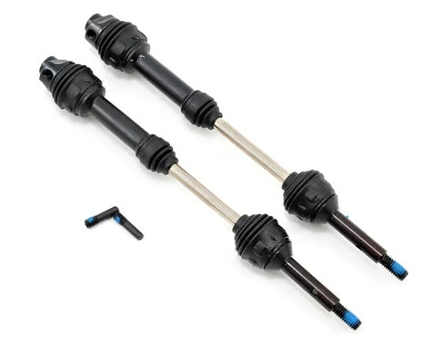 |
| 🔵 **TRA9051 / TRA9052** Jato 4x4 VXL EHD Driveshafts | **Type:** Extreme Heavy Duty, native Jato 4x4 VXL fit **Part:** TRA9051 (front) / TRA9052 (rear); set of 4: 90386-4 **Diff end:** **6mm** **Fits:** Native Jato 4x4 VXL; E-Revo diffs **Price:** **$28.97** set of 4 (Jenny's RC) | Pro: **Stronger than the standard EHD axles** despite sharing the "Extreme Heavy Duty" name. Native Jato 4x4 VXL fit, 6mm axle matches E-Revo diffs. Front + rear covered  Con: Tends to break at the threads like other axles. **Rubs badly on the arm at full droop**, same clearance problem as the U-joint shafts |  |
| 🔵 **MIP CVD driveshaft kit (genuine, EHD)** — *alternate, super cheap* | **Type:** CVD, genuine MIP, front + rear set w/ MIP Grease + Thread Liquid **Part:** N/A (exact MIP SKU TBD) **Diff end:** N/A, TBD, needs confirming against the **5mm stock Jato 4x4 diffs** **Fits:** Traxxas EHD-axle vehicles (Bigfoot 4x4 BL-2S, Stampede 4x4 BL-2S, Rustler 4x4 BL-2S/VXL, Slash 4x4 VXL/BL-2S), vehicle must already run EHD axles **Price:** **$28.50 + $4.99 shipping ≈ $33.49** (eBay offer, 5% off $30 list, seen 2026-07-29) | Pro: **Genuine MIP for cheap, well under typical MIP pricing**, includes grease + thread liquid. Direct EHD fitment claim covers the Slash/Rustler/Stampede/Bigfoot 4x4 EHD family  Con: **Alternate, not the chosen axle**, diff-end fit vs the 5mm stock diffs not yet confirmed, exact part # TBD. eBay offer pricing (time-limited) | 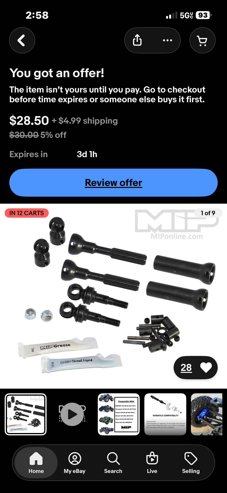 |
| 🔵 **Tekno M6 Driveshaft + Steering Block Set (TKR6851X + TKR6852X)** — *stock-arm-length option* | **Type:** Complete M6 CVA set, front + rear driveshafts, steering blocks, hub carriers, hexes, bearings **Part:** TKR6851X (front) + TKR6852X (rear) **Diff end:** 6 mm M6 **Fits:** Slash 4x4 / Stampede 4x4, **stock arm length** **Price:** **$83.75** (PowerHobby) | Pro: **Complete genuine Tekno M6 kit in one box**, hardened-steel CVAs + drive cups, nylon steering blocks, **1.5° / 0.5° rear hub carriers**, 12 mm hexes, 6×12×4 + 10×15×4 bearings. The clean drop-in **if running stock-length Slash 4x4 arms**  Con: **Stock length, too short for this build's extended FLM arms (101.6 mm)**, which is why the chopped/6752 long-axle route is used instead. Only the pick if reverting to stock arms. Pricey ($83.75) |  |
| ❌ ~~**Traxxas Slash 4x4 HD steel CV (2nd gen)**~~ | **Type:** nickel-plated steel CV w/ boots, U-joint pins held captive **Part:** TRA6851R (front) / TRA6852R (rear) **Diff end:** 5mm **Fits:** Slash 4x4 pattern (5mm cups) **Price:** **$69.95** (set of 2) | Pro: Steel CV, boots, captive pins, strong "2nd gen" upgrade, smooth like the E-Revo CVDs  Con: **Too expensive, $69.95 buys only two axles. The ~$20–30 knock-off above gets you four** for the same steel-CV design. No contest on value |  |
| ❌ ~~**Traxxas Slash 4x4 EHD axles**~~ | **Type:** Extreme Heavy Duty telescoping, oversized U-joints **Part:** TRA6852A (rear) / TRA6851A (front) **Diff end:** 6mm stub axles **Fits:** Slash 4x4 pattern **Price:** N/A | Pro: Telescoping, oversized U-joints, 6mm stubs  Con: **Nowhere near as strong as the true EHD TRA9051/9052** despite the same "EHD" name, no reason to pick these over the real EHD set |  |
| 🚫 ~~**Traxxas Slash 4x4 stock axle (1st gen, U-joint)**~~ | **Type:** stock Slash 4x4 U-joint half shaft **Part:** TRA6852X (rear) / TRA6851X (front) **Diff end:** 6mm **Fits:** Slash 4x4 pattern (fits the build) **Price:** N/A | Pro: Cheap, widely available. Fits the build  Con: **Worst option, snaps like candy.** Only minor rubbing on the arms, not a full clearance hit, but the snapping issue makes this a last resort |  |

---

## 2WD long CVDs + 6752 output shafts (cheap long-axle build)

A way to get a **longer axle without the cut-and-glue**, cheaply. The Traxxas **1951R "Steel Rear CV Driveshafts (2)"** (2WD cars) are about **10mm longer** than the Slash 4x4 6852R (rear) and 6851R (front). The **only difference is the output shaft**; everything else (cups, boots, hardware) is the same.

- **Output shafts:** **TRA6752 = long** (the 1951R length), **TRA6750 = short**. Swap in 6752 to make a standard CVD the longer length. **The knock-off CV set ships with 4 short (TRA6750-length) shafts, and none of them are long enough on this build**, front or rear. All four get swapped for 6752, and **all four short shafts come out** (spare or sell).
- **Stubs are compatible with the Tekno stuff** (the [Tekno 5580 / 5070 stubs](#tekno-stubs-front--rear)).

**The build:** buy cheap **AliExpress CVD-style driveshafts** (the 6852/6851 front + rear clone combo), and swap in **four TRA6752 long output shafts ($8 each), one per corner**. Replace the stubs with the **Tekno stubs** front and rear. Result is a long, strong axle set for far less than genuine **1951R** sets. **Sell the OG stubs and all 4 short shafts** to offset the cost.

> ⚠️ **Updated: all four corners need the long TRA6752** (4×). The original plan was front-only, but the knock-off set's **stock-length shafts turned out too short to work**, rear included. The sheet + costs below are the 4-corner spec, and **all 4 of the 6752 bought are used, none spare**.

### Build cost (set of 4 axles)

| Part | Qty | Cost |
|---|---|---|
| Knock-off Slash 4×4 HD steel CV driveshafts, front + rear (TRA6851R + TRA6852R clones) | set of 4 | $21.10 |
| Traxxas 6752 long output shaft (**all 4 corners**) | 4 × $8 | $32.00 |
| Tekno TKR1654-17, front 17 mm M6 adapter | 1 pair | $19.99 |
| Tekno 5580 bare rear stubs | 1 pair | $16.90 |
| **Gross parts total** | | **≈ $89.99** |

**Offset, sell the leftover OG bits** swapped out during the build (estimates):

| Sold | Est. resale |
|---|---|
| OG stubs (4, replaced by the Tekno stubs) | ~$12–20 |
| Shorter OG output shafts (**all 4**, replaced by the 6752, none stay on the car) | ~$8–16 |
| **Est. offset** | **~$20–36** |

**Estimated net ≈ $54–70 per set of 4** (gross − resale). Not counted: the **10×15×4 hub bearings ×4 and their sleeves** (front + rear, ~$6–10, a hub part; fitted and working). For reference a genuine set is **$69.95 for only two** TRA6851R, and that's not even the same thing: **it doesn't come with the M6 stubs this build wants**, so the $49.10 of Tekno stubs is on top either way, and the genuine set is still **stock length**, so it wouldn't reach the extended FLM arms at all. Two genuine axles land at ~$119 and still don't do the job. This makes a full set of **4**, longer at every corner and stronger with the M6 stubs.

 <em>Traxxas 1951R, 2WD rear steel CVDs (~10mm longer than the 6852R/6851R). This is the length we're after.</em>

&nbsp;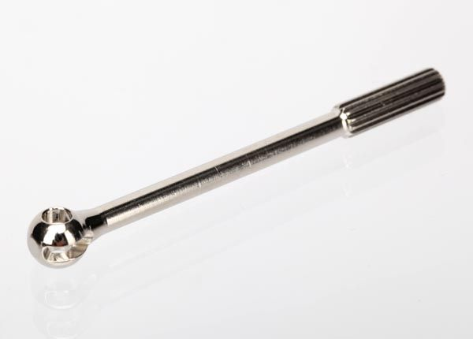 <em>TRA6752 (long, the 1951R length) · TRA6750 (short). Same everywhere else; the output shaft sets the length.</em>

**Why longer:** the extended FLM arms need the extra ~10mm at **every corner**, which is what the front-only plan got wrong. **Tekno stubs at both ends**, 6752 shafts at all four.

> **Axle plan (confirmed):** **front = Tekno TKR1654-17 17mm M6 stub**, **rear = Tekno TKR5570-17 SCT410 kit** (the 5580 stub + 17mm hexes), ✅ confirmed a perfect fit (the 5070 was ruled out, too large). Hub + bearing sizing (10×15×4 front inner in a sleeve, etc.) is in [`hub_analysis.md`](hub_analysis.md).

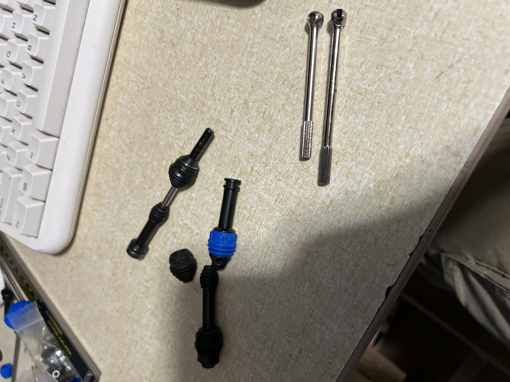 <em>Knock-off CVD + rear CVD parts, with the two 10mm-longer bare axles (top right) next to the originals.</em>

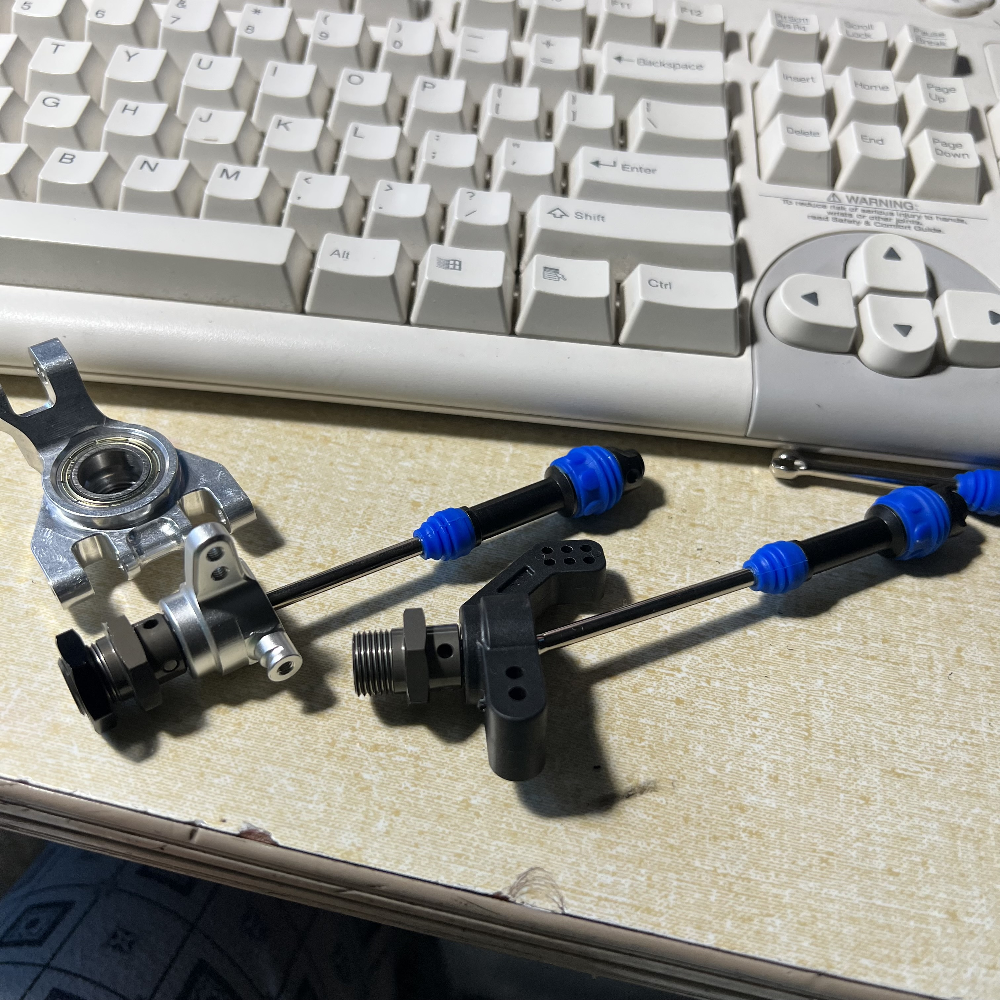 <em>Test-fit mockup: knock-off CVDs (10mm ends) with M6 17mm stubs (shown on an XO-1 front hub + the **Tekno** plastic rear hub from the Tekno kit, not a stock or older-stock plastic rear). The final build runs the Raptor R hubs, hub/bearing detail in <a href="hub_analysis.md">hub_analysis.md</a>.</em>

---

## Tekno stubs (front + rear)

The build runs Tekno M6 stubs at both ends. **Front = the TKR1654-17 17mm M6 hub adapter.** **Rear = the Tekno TKR5570-17 SCT410 kit** (the 5580 stub + 17mm hexes), ✅ confirmed a perfect fit in the rear hubs (the 5070 is much larger, ruled out, see the row below). Hub + inner-bearing sizing (10×15×4 in a sleeve, etc.) is in [`hub_analysis.md`](hub_analysis.md#axle--hub-compatibility); the **17mm wheel hexes that mount to these stubs** are in [17mm wheel hexes](#17mm-wheel-hexes).

> ⚠️ **Don't mix up the part numbers.** **TKR55*80*** = the bare rear stub only. **TKR55*70*-17** = the full SCT410 kit (2 stubs + 2 17mm hexes + nuts + cross-pins). Buy the **-70 kit** to get the stub *and* the hexes in one, not the bare **-80** stub.

| Position | Tekno stub | For | Price | Status |
|---|---|---|---|---|
| **Front** | **TKR1654-17**, 17mm M6 hub adapter (17mm hex adapters + stub pins + cross pins + 17mm nuts) | Front 17mm M6 setup | **$19.99/pair** shipped, only 1 pair needed | ✅ In hand. Minor 17mm hex filing to seat (see [`wheel_hex`](#17mm-wheel-hexes)) |
| **Rear** | **Tekno TKR5570-17 SCT410 kit** = the 5580 stub + 17mm hexes + nuts + cross-pins in one (buy the kit, not the bare 5580) | Rear 17mm stub + hex in one | **$25.95** (PowerHobby, free ship direct) | ✅ **Confirmed fit** (6 mm M6 end, 10 mm bearing seat). Gives the rear stub **and** hexes together. |
| ~~**Rear**~~ | 🚫 ~~**Tekno 5070**, hardened steel, EB48 (buggy)~~ | **Does NOT fit, too large** | $17.91 | 🚫 **Ruled out.** **8 mm stub end** (vs 6 mm on the 5580) + **~12 mm bearing seat** (vs 10 mm), so it'd need a **12 mm ID inner**, not the 10×18×5. The 5580 (in the TKR5570-17 kit) is the confirmed fit |

&nbsp;&nbsp;&nbsp;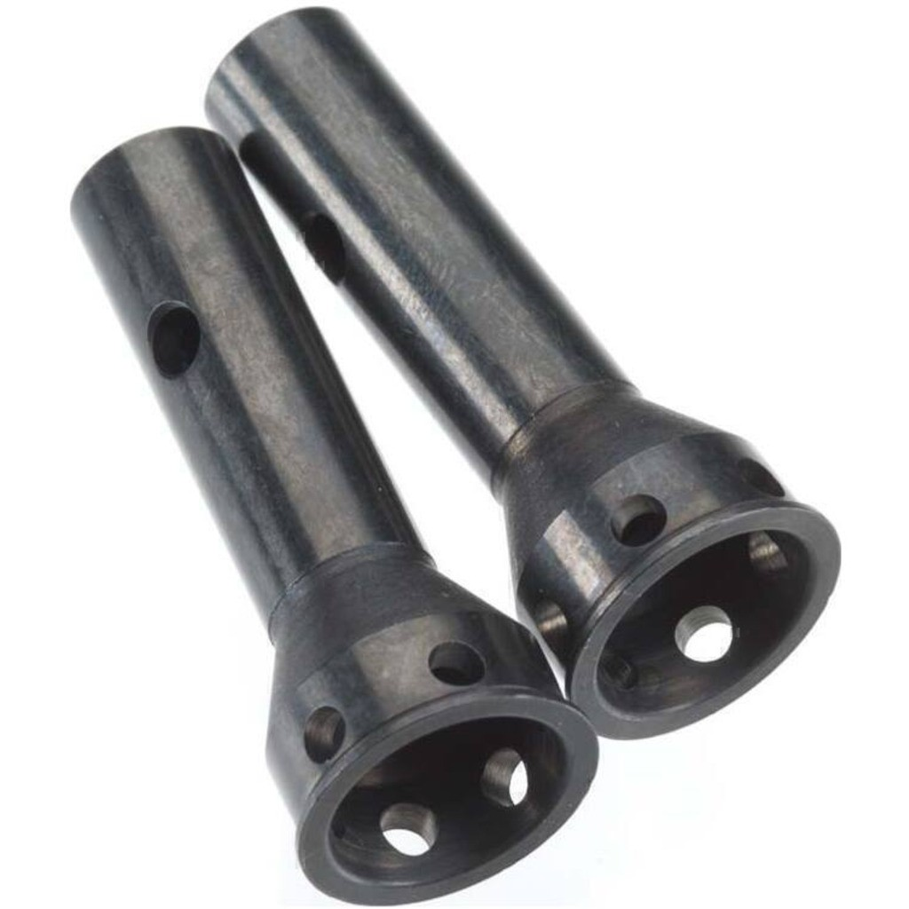 <em>Front stub: TKR1654-17 (17mm M6 adapter) · the bare **TKR5580** stub (the "-80") · the **TKR5570-17** SCT410 kit (the "-70" = 5580 stub + 17mm hexes + nuts + pins), the rear pick · Tekno 5070 (EB48): 🚫 ruled out (too large)</em>

Front stub purchase: eBay seller **kool_toyz_4u**, order **18-13082-92531**, **$19.99 shipped** ($15.00 + $4.99), placed May 18 2025, delivered May 24 2025. One kit, which is the pair on the car. A separate mr-retro order covered **3 pairs at $23.15/pair**, bought on purpose as spares in case a friend needs one or someone wants to buy one. Only the kool_toyz_4u kit is on this car.

Rear stubs purchase: eBay seller mr-retro, **$33.80 for 2 pairs ($16.90/pair)**, delivered Aug 17 2026. Only one pair is on this car, the second was bought for a friend.

---

## 17mm wheel hexes

> **The 17mm hub (hex) is what the wheel actually mounts to, on the Tekno M6 stub.** This build runs 17mm wheels on the [Tekno M6 stubs](#tekno-stubs-front--rear), so it needs a 17mm hex, but the M6 stub is a smaller/different profile than what these hexes are cut for, so the hex gets **lightly filed to seat**.
>
> **The stub decides the hex, which is why this sits here and not in [`hub_analysis.md`](hub_analysis.md).** Every row below turns on its **Stub fit**, so the hex is picked after the axle, not alongside the carriers.
>
> - **Running: AliExpress aftermarket 17mm splined wheel hubs (E-Revo 1.0 fit), black, all four corners, $8.36.** Each corner gets a hub, a 17mm nut and a pin, with the pin held by the M2 set screw into the Tekno stub. The set's barrel nuts aren't needed on Tekno stubs (a wrench comes in the set too). Every hub sits **2-3mm wider** than the Tekno hex it replaced, so the track gains width at each corner.
> - **Aftermarket, E-Revo 1.0 fit only.** Not Traxxas parts. They're made to fit the E-Revo 1.0 (not the 2.0 or other generations) and are **known to fit the Jato 4x4 and Slash 4x4**. **24mm tall × 20mm across, 6mm bore, M2 set screw.**
> - **Stubs stay Tekno M6:** front **TKR1654-17** (sold with its own hex, which now sits unused), rear **Tekno 5580** bought bare ($16.90 / pair), so the **TKR5570-17 kit isn't needed**.
> - **Traxxas TRA6469** (17mm splined aluminum, 5.9g) is **in hand as an alternative**, not fitted here. **[Mike's Jato](../Jato4x4_Mike/driveshaft_analysis.md#17mm-wheel-hexes) runs the 6469 shaved down**, which is the one drivetrain part where the two cars differ at the wheel end.

&nbsp;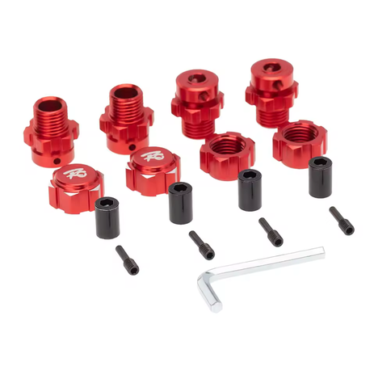 <em>Running: AliExpress aftermarket 17mm splined hubs (E-Revo 1.0 fit) in black ($8.36, all four corners) · the same hub in red</em>

### 17mm hex requirements

| Requirement | Type | Why |
|---|---|---|
| **17mm hex** | Must | The wheels this build runs are 17mm, the hex has to be 17mm |
| **Seats on the Tekno M6 stub** | Must | The M6 stub is a smaller/different profile, so the hex must fit it, in practice this means **light filing** of the hex bore/chamfer |
| **Forgiving when shaved thin** | May | Since the hex gets filed to fit, a **pin-through** design tolerates thin shaving better than a solid screw-pin hex |
| **Matches the wheel's inner pattern** | May | Standard 17mm wheels drop on any 17mm hex; **stock Traxxas star-pattern rims need the special star hex** or the rim cut out |

### 17mm hex comparison

> *Spec format: Type · Part · Material · Stub fit · Wheel pattern · Retention · Weight · Price*

| Hex | Spec | Pros / Cons | Photo / Link |
|---|---|---|---|
| ⭐ **AliExpress aftermarket 17mm splined wheel hubs (E-Revo 1.0 fit)** — *running, all four corners, black* | **Type:** aftermarket 17mm splined hub + 17mm nut + pin + barrel nut, 2-3mm wider per corner than the Tekno hexes. **24mm tall × 20mm across, 6mm bore, M2 set screw** **Part:** N/A (AliExpress, sold as a "17mm Hex Nuts Adapter Splined Wheel Hubs Extension Combiner" for Traxxas E-Revo / Summit) **Material:** anodized metal (black; also sold in red) **Stub fit:** Tekno M6 stubs, front TKR1654-17 + rear 5580. The hub uses the **set screw into the stub** to hold the pin, which is what makes it work on the Tekno stubs. On a stock E-Revo stub either the set screw or the barrel nut works. Made for the E-Revo 1.0, known to fit the Jato 4x4 and Slash 4x4 **Wheel pattern:** 17mm (runs the IMEX rims) **Retention:** 17mm nut + pin held by the M2 set screw into the stub. **No barrel nut needed on Tekno stubs** (it's for the stock E-Revo stub) **Weight:** N/A **Price:** **$8.36** / set of 4 (black) | Pro: **$8.36 for all four corners**, and each hub adds **2-3mm of width**. Nuts, pins, barrel nuts and a wrench are in the set (the barrel nuts sit unused on Tekno stubs)  Con: **E-Revo 1.0 pattern only**, the 2.0 and other generations don't match. Aftermarket with no part number, just an AliExpress listing | &nbsp; <em>black (running) · red</em> 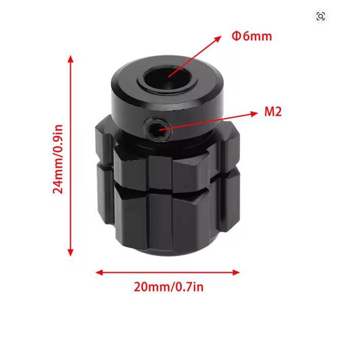 <em>24mm tall × 20mm across, 6mm bore, M2 set screw</em> |
| 🟢 **Tekno OEM 17mm hex** (pin-through) — *comes with the TKR1654-17 stubs, not running* | **Type:** 17mm hex, pin-through **Part:** included in **TKR1654-17** (front M6 adapter kit) **Material:** Aluminum **Stub fit:** Tekno M6 stub, **light filing (~0.2–0.5mm)** to seat **Wheel pattern:** Standard 17mm (non-star; won't take Traxxas star rims) **Retention:** **Cross-pin passes through the hex** (pin-through) **Weight:** N/A (not yet weighed) **Price:** Included in TKR1654-17 (**$19.99/pr** shipped) | Pro: **The pin-through design is the reason it's the pick**, the cross-pin runs through the hex for a more secure hold, and it's **more forgiving if shaved thin** to clear the M6 stub. Already in hand with the front adapter kit, so **no extra buy** for the front (the rear uses the TKR5570-17 kit)  Con: Not yet photographed/weighed. Still needs the light filing like any 17mm hex on an M6 stub (or run the **XO-1 front carrier** to skip the front filing) |  |
| 🔵 **Tekno SCT410 rear kit (TKR5570-17)** — *not needed, the rear runs bare 5580 stubs + aftermarket E-Revo-fit hubs* | **Type:** SCT410 rear kit: 2 stubs + 2 **17mm hexes** + nuts + cross-pins **Part:** **TKR5570-17** (UPC 815076013560) **Material:** Aluminum **Stub fit:** its own stub (the 5580); front + rear on the SCT410, the **rear** on this Jato build **Wheel pattern:** **Star-drive 17mm — fits BOTH standard 17mm rims (IMEX, RedSpider etc.) AND Traxxas star-pattern rims** **Retention:** 17mm nut + cross-pin (both in the kit) **Weight:** N/A **Price:** **$25.95** (PowerHobby; free shipping if bought direct) | Pro: **One kit is the whole rear: stub + 17mm hexes + nuts + pins**, and the star hexes take **standard 17mm rims and Traxxas star rims**. More versatile than the front non-star hex (which can't take Traxxas rims)  Con: Still needs **light filing** to seat on the M6 stub, like the front. Pricier than a bare stub, but it bundles the stub, hexes, and hardware |  |
| 🔵 **Traxxas TRA6469** — *in hand, alternative* | **Type:** 17mm splined hex **Part:** TRA6469 **Material:** 6061-T6 aluminum, blue-anodized **Stub fit:** Cut for 6mm axles, **file to the chamfer/bevel edge** to seat on the M6 stub **Wheel pattern:** Standard 17mm **Retention:** Screw pin 4×13mm w/ threadlock **Weight:** **5.9g each** measured **Price:** N/A | Pro: **In hand, genuine Traxxas alloy, weighed at 5.9g.** Standard 17mm, seats after filing to the chamfer/bevel. A fallback front hex (the rear uses the TKR5570-17 kit)  Con: **Solid screw-pin, not pin-through**, filing it thin is riskier than the Tekno hex, so it's the fallback, not the pick |  |
| 🔵 **Arrma 6S 17mm extended hex adapters (+10mm W193 / +13mm W194)** — *idea only: needs an 8mm to 6mm sleeve, not planned for now* | **Type:** 17mm extended hex hub adapter + 17mm nut + pin + set screw + O-ring, **+10mm or +13mm** wider per corner **Part:** W193 (+10mm) / W194 (+13mm), AliExpress (Shop1103874824 Store) **Material:** Metal, anodized black, blue or red **Stub fit:** Made for Arrma 6S 1/8 (Kraton, Typhon, Outcast) and 1/7 (Infraction, Limitless, Mojave, Felony), **8mm bore**. On the 6mm Tekno M6 stubs it needs a **custom 8mm to 6mm sleeve**, untested **Wheel pattern:** 17mm **Retention:** 17mm nut + pin + set screw (included) **Weight:** N/A **Price:** **$15.74 / set of 4** on sale (list $32.13), $14.95 each for 2+ sets | Pro: **A lot more width than any other hub here**, +10mm or +13mm per corner, versus 2-3mm for the E-Revo-fit hubs. Comes in black, blue and red  Con: **Needs a sleeve I'd have to make**, 8mm bore to the 6mm stub, and it's untested. **Probably not running it for now:** a narrower car turns faster, traction rolling isn't a problem with this car and tire combo, and extra width adds scrub the wheels have to turn through, which costs performance | 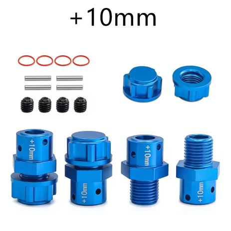&nbsp;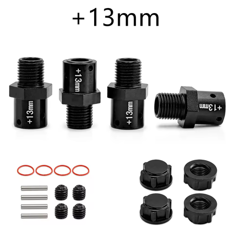&nbsp;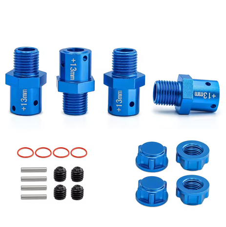&nbsp;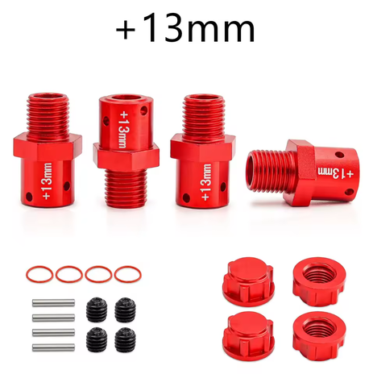 <em>blue +10mm (W193) · black +13mm (W194) · blue +13mm (W194) · red +13mm (W194). Each set: 4 adapters, nuts, pins, set screws, O-rings</em> |
| ❌ ~~**Traxxas 9085**~~ — *stock on the BL-2S Jato, same flawed design in plastic* | **Type:** 17mm splined hub, OEM composite **Part:** **9085**, set of 4 with spacers (4) and axle pins (4) **Material:** composite plastic **Stub fit:** the same pin-and-retainer design as the alloy 9086. 🚧 Traxxas do not state the axle family on this listing **Wheel pattern:** 17mm splined **Retention:** axle pin plus spacer. ⚠️ **the barrel nuts do not interchange with the alloy hubs** **Weight:** 🚧 not published **Price:** **$8.00 / set of 4** | Pro: **These come on the base Jato 4x4 BL-2S**, so a build starting from that donor already has a set and owes nothing to try them. **A quarter the price of the alloy 9086** if you do buy them, $8.00 against $35.95, and **they reportedly break stubs less often**. The likely reason is that the plastic gives a little instead of passing the whole load into the threaded end, though that is a hypothesis rather than something measured here  Con: ⚠️ **Hardware does not cross over, and it is not sold separately.** The barrel nuts differ between the composite and alloy hubs, so you cannot mix parts or reuse the nuts when swapping, and **losing a single nut means buying the whole $8.00 set again**. The alloy hubs let you replace one nut on its own, which closes some of the price gap the moment you drop one in the grass. Still the same pin design that loads the stub thread, just more forgiving | 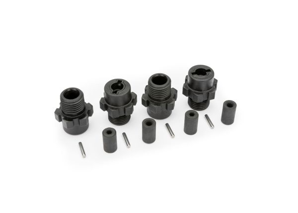 |
| ❌ ~~**Traxxas 9086**~~ — *stock on the VXL Jato, avoided on purpose* | **Type:** 17mm splined hub, OEM **Part:** **9086**, blue anodized, set of 4 **Material:** machined aluminum **Stub fit:** ⚠️ **Maxx-duty driveshafts with 6mm axles only**, the 9080-series EHD kits **Wheel pattern:** 17mm splined, and it takes plain 17mm hex wheels too **Retention:** ⚠️ **axle pin plus barrel nut**; ships hub retainers (4) and axle pins (4) **Weight:** 🚧 not published **Price:** **$35.95 / set of 4** | Pro: **These come on the Jato 4x4 VXL**, the high-end trim, where the BL-2S gets the composite 9085. Genuine Traxxas with the widest wheel compatibility here, splined and plain 17mm both, and the splines spread load to stop the wheel rounding out  Con: ⚠️ **The pin and barrel nut design snaps the threaded end off the stub axle.** That is the failure this build designs around, and it is why the AliExpress hubs are credited with needing **no barrel nut on the Tekno stubs**. Dearest option here at **$35.95** against **$8.36** | 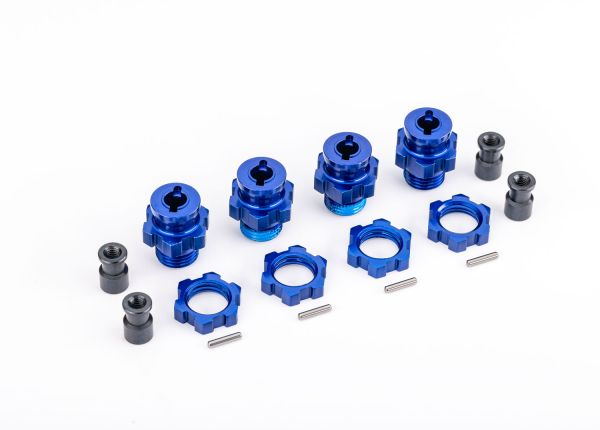 |

> ⚠️ **Both OEM pin-and-barrel-nut hubs are the wrong design.** The alloy **9086** and the composite **9085** share it, and it works the threaded end of the stub until it breaks. The plastic one is gentler, which makes it the lesser of the two rather than a good answer.
>
> **Both arrive on the car, depending on trim.** The **BL-2S** ships the composite **9085** and the **VXL** ships the alloy **9086**, so whichever Jato you start from, the design is already fitted. That makes this a swap rather than a purchase decision, and it is worth making early: the part that breaks is the stub axle, which costs more than the hex ever will.
>
> **Use the standard style instead:** the **AliExpress E-Revo 1.0 fit hubs** at **$8.36**, or the **Tekno hexes** that come with the M6 stubs. Neither uses a barrel nut, so the failure goes away rather than getting managed.

### 17mm hex notes

- **Why the hex gets filed:** the 17mm hexes are cut for a 6mm axle / their own stub, and the **Tekno M6 stub is a smaller/different profile**, so the hex bore/chamfer needs a light shave (~0.2–0.5mm) to seat. See the [Tekno stubs section](#tekno-stubs-front--rear) for the stubs these mount to.
- **Skip the front filing with the XO-1 front carrier:** running the **XO-1 front carrier** up front lets the front hex seat **without shaving**, an alternative to filing the front hex. See the [carrier comparison](hub_analysis.md#comparison) above.
- **Pin-through beats screw-pin when shaving thin.** The Tekno OEM hex's cross-pin runs *through* the hex, so even shaved thin it holds securely, the reason it was the front pick over the solid TRA6469 before the aftermarket E-Revo-fit hubs, which relies on a screw pin and has less meat to give up.
- **Star vs non-star hex.** Stock Traxxas wheels have a **star-shaped inner pattern**. The **star-drive TKR5570-17 (rear) takes both standard 17mm and Traxxas star rims**; the **non-star front TKR1654-17 takes standard 17mm rims only**. This build runs standard 17mm wheels (IMEX chrome rims now), so it's a non-issue either way.
- **With the Tekno hexes, both ends needed light filing.** The front (TKR1654-17 hex) and the rear (TKR5570-17 kit hexes) are different parts, but each seats on the M6 stub with the same light shave.
- **More width isn't automatically better here.** The Arrma 6S +10/13mm adapters could widen the car a lot with an 8mm to 6mm sleeve, but a narrower car turns faster, rolling from traction isn't an issue with this car and tire combo, and wider hubs add scrub. The 2-3mm from the E-Revo-fit hubs is enough for now.

---
---

## Knock-Off E-Revo CVDs

The knock-off E-Revo 1.0 CVDs run **~$20** and **perform identically to the genuine Traxxas CVDs**, no noticeable difference in real use. Same 6mm diff end, same chopped-to-fit method. For a wear item that gets cut down and rebuilt anyway, the knock-off is the sensible buy.

**They come in two shaft diameters** (same cups/boots/hardware, different mid-shaft), caliper before buying a thread kit. Full thread-kit + sleeve detail in [Knock-off axle diameters](#knock-off-axle-diameters--not-all-the-same-shaft).

> *Spec format: Type · Shaft · Diff end · Fits · Weight · Price*

| Part | Spec | Pros / Cons | Photo / Link |
|---|---|---|---|
| ⭐ **5.5 mm knock-off set** (older), *budget* | **Type:** CVD knock-off **Shaft:** **5.5 mm** **Diff end:** 6mm **Fits:** E-Revo diffs and cups **Weight:** 52.8 g (per axle) **Price:** **~$20 / set of 4** | Pro: **Stronger shaft** (~1.8× the 4.5 mm torsion). ~$20 for a **set of 4**, works as well as genuine. Uses the **1/4-20** thread kit  Con: Heavier; **more prone to hitting the cup at full droop** |  |
| ⭐ **4.5 mm knock-off set** (newer), *budget* | **Type:** CVD knock-off **Shaft:** **4.5 mm** **Diff end:** 6mm **Fits:** E-Revo diffs and cups **Weight:** 46.9 g (per axle) **Price:** **~$20 / set of 4** | Pro: **~6 g lighter** and **clears the cup better at full droop** (good for the front). Uses the **M5×0.8** thread kit  Con: **~55% of the 5.5 mm torsional strength**, the weaker shaft |  |

---

## Shortening + Joining E-Revo CVDs (custom axles, WIP)

The E-Revo 1.0 CVDs are too long for the Jato, so they get **cut in half and rejoined to length** with a center sleeve. They seat in the **Jato 4x4 EHD hubs** (4 Teflon washers at the wheel end).

**The plan, two steps:**
1. **Tune length** on an adjustable threaded axle. **Shorter = front.**
2. **Lock it permanently:** knurl the shaft, bond into a long tight sleeve with **Loctite 680**. **No pin** (can't drill the SS sleeve), **no weld** (it kept cracking at the bead).

> ⚠️ **Status:** front length dialed (**90.5 mm end-to-end / ~85.9 mm pin-to-hole**, table below). **Rear not built yet.** Wear part, so a fresh set is easy to remake.

### Measured lengths (prototype)

> **All lengths are end-to-end (overall), tip of one cup/stub to the other, NOT hole-to-hole / pivot-center spacing.** Use this when cross-shopping a donor axle: match the overall installed length, not a listing's pivot-to-pivot number.

| Axle | Length | Status | Notes |
|---|---|---|---|
| **Uncut E-Revo CVD** (full length) | **136.60 mm end-to-end** · **132 mm pin-to-hole** | reference | Stock E-Revo 1.0 CVD before cutting. Two dims: **end-to-end (tip to tip) = 136.60 mm**, **pin-hole to pin-hole = 132 mm**. The **~4.6 mm** difference is the cup material beyond the pin holes at each end. (The earlier lone "132" was this pin-to-hole figure, not purely a caliper error.) |
| **Front (adjustable prototype)** | **90.5 mm end-to-end** · **~85.9 mm pin-to-hole** | ✅ length dialed | Threaded prototype adjusted to fit on the car. **Final front = 90.5 mm end-to-end** (ignoring the manufacturing nub); **pin-to-hole ≈ 85.9 mm** (90.5 − 4.6 offset, verify on the build). **Even halves: 45.25 mm each** (tip → cut), joined at center in the keyed sleeve (knurl + 638/680). Remove **46.1 mm** total (136.60 − 90.5) → **~23.05 mm off each inner end**. Cut a hair long, dry-fit before bonding. **Shorter = front.** |
| **Rear** | TBD | ⏳ not built yet | Build + tune the rear adjustable prototype next, then keyed-glue. |

**Front axle fitment spec (for cross-shopping a donor):**

| Dimension | Value |
|---|---|
| End-to-end | **90.5 mm** |
| Pin-to-hole | **~85.9 mm** |
| Diff end | **6 mm** |
| Pin-side ball | **8 mm** |
| Stub-side ball (joins the stub) | **9 mm** |

> The ends are **asymmetric** (8 mm pin-side ball vs 9 mm stub-side), so a donor axle has to match *both* ball sizes, not just the length, narrows the field a lot.
>
> **Why 90.5 mm:** the front runs **FLM26800 extended arms (101.6 mm pin-to-pin, ≈102 mm) vs 92 mm stock**, ~10 mm/side wider track, the axle length is sized to that arm. Change arms → re-tune the axle. See [`arm_analysis.md`](arm_analysis.md).

### Off-the-shelf CV option — Traxxas/Tekno part + length map (buy instead of build)

Instead of cutting E-Revo CVDs, a stock steel CV that's the right length + uses the strong **Tekno M6 stub** is a "buy instead of build" path. The **half shaft is the length-determining part**, Traxxas part numbers confirm which CVDs share a length:

| CVD (assembled) | Half shaft | Vehicle / position | Length |
|---|---|---|---|
| **6851R** | **6750** | Slash 4x4 **front** | 4x4 length |
| **6852R** | **6750** | Slash 4x4 **rear** | **same as 6851R** (shares 6750) |
| **1951R** | **6752** | 2WD Slash/Rustler/Stampede **rear** | **longer** ("long half shaft") |

> **Key facts (verified via Traxxas half-shaft pages):** **6851R = 6852R in length** (both use half shaft 6750). **1951R is a different, longer length** (unique half shaft 6752). So the length order is **1951R (6752) > Slash 4x4 6851R/6852R (6750)**, and the SCTE M6 CVD (TKR2210) is longer still.

**Tekno M6 equivalents** (stronger stub, bigger bearings 10×15×4 inner / 6×12×4 outer, captured CV pin):
- **TKR6851X** (4x4 front) / **TKR6852X** (4x4 rear), Slash-4x4 length (stock arms)
- **TKR1951X** (2WD rear), the **longer** 1951 length
- **TKR2210 / 2210X** (SCTE / 2WD Rustler-Stampede), **longest** in the M6 family
- **TKR6853**, the 6 mm M6 **stub axles alone**

**For the extended FLM arms (101.6 mm):** the Slash 4x4 CVD (6851X) runs ~10 mm short. **Tekno's documented extended-arm combo is TKR1951X + TKR2210**, the 1951X M6 hubs/driveshafts + the **longer SCTE-length TKR2210 driveshafts**. Tekno built this for the 2WD Slash with ProTrac arms; the FLM arms are ProTrac-length, so it maps to this build (still **measure to confirm vs 90.5 mm**, lengths aren't published). TKR1951X fits Slash 2WD, Nitro Rustler, Stampede 2WD; the electric Rustler 2WD shares the 2WD Slash rear driveline. Or rebuild a longer CV around the **6752 half shaft**. Note: E-Revo's 8/9 mm balls likely won't mate the 6 mm M6 stub, so the M6 route means Slash-pattern CVDs.

  &nbsp; 
  <em>Uncut E-Revo CVD: 136.60 mm end-to-end / 132 mm pin-to-hole · Front prototype: 90.5 mm end-to-end / ~85.9 mm pin-to-hole, caliper re-zeroed</em>

### Knock-off axle diameters — not all the same shaft

The AliExpress CVDs come in **two shaft diameters with the same cups/boots/hardware**, so check the bare mid-shaft with calipers before picking a thread kit. Each needs a different die/tap/hex joiner.

| Shaft | Source | Weight | Die (shaft) | Tap (hex joiner) | Tap drill | Hex joiner | Notes |
|---|---|---|---|---|---|---|---|
| **5.5 mm** (older set) | AliExpress | **52.8 g** | **1/4-20** | 1/4-20 | #7 / 13/64" (~5.1 mm) | 1/4-20 hex coupler | **Stronger** (torsion ∝ d³ → ~1.8× the 4.5 mm). Heavier. **More prone to hitting the cup at full droop.** |
| **4.5 mm** (newer set) | AliExpress | **46.9 g** | **M5×0.8** (alt #10-32) | M5×0.8 | 4.2 mm (alt #19) | M5 hex coupler | **~6 g lighter; ~55% of the 5.5 mm torsional strength.** **Clears better at full droop** (less cup interference). |

> **Prices in this section are per set of 4 axles; weights are per single complete axle.**
>
> **Tradeoff:** 5.5 mm = strength, 4.5 mm = droop clearance. The thinner 4.5 mm shaft **binds less on the cup at full droop**, but it's the weaker shaft. Since the **front sees more load and more droop**, the 5.5 mm strength helps there but so does the 4.5 mm clearance, decide on the car. Weights are the complete axle, same hardware on both (the 52.8 g photo just has the loose parts on the pan too).

  &nbsp; 
  <em>5.5 mm older AliExpress axle: 52.8 g (disassembled, parts on pan) · 4.5 mm newer AliExpress axle: 46.9 g (assembled)</em>

> **Sleeve sizing (5.5 mm shaft):** tight fit **~5.6 mm ID** (~0.1 mm gap) → **Loctite 680**; loose **~6 mm ID** (~0.5 mm gap) → **Loctite 660** (gap-fill). Keep the wall thick enough to stay stiff, the OD slim for droop clearance. One piece, no telescoping. Knurl the shaft (the glue's key). Exact buys in the table below.

### Build recipe — 5.5 mm shaft (older AliExpress set)

> Target: **90.5 mm end-to-end (~85.9 mm pin-to-hole)** final front, **even 45.25 mm halves**. Stronger shaft, but binds on the cup at full droop.

1. **Measure stock + mark cut.** Uncut 5.5 mm CVD = **136.60 mm end-to-end (132 mm pin-to-hole)**. Remove **46.1 mm** (cut ~23.05 mm off each inner end so the halves come out even at 45.25 mm). Cut a hair long, sneak up on it. *(Cut math uses end-to-end; pin-to-hole is for cross-shopping.)*
2. **Key the ends.** Thread each cut end with a **1/4-20 die**, or knurl/crosshatch ~10 mm of the shaft. Threads double as the glue key.
3. **Joiner / sleeve.** **1/4-20 hex coupler** (threaded route), or a steel sleeve reamed to **~5.6 mm ID** (~0.14 mm slip fit) over a knurled shaft.
4. **Set length + bond.** Dry-fit to 90.5 mm, then **Loctite 680** (tight fit) or **660** (loose ~0.5 mm sleeve). Scuff, degrease, prime 7649. No pin, no weld.
5. **Check runout**, let cure fully before running.

### Build recipe — 4.5 mm shaft (newer AliExpress set)

> Same **90.5 mm end-to-end (~85.9 mm pin-to-hole) / 45.25 mm even-halves** target. Weaker shaft (~55% of 5.5 mm torsion) but **clears the cup better at full droop**, the reason to run it front.

1. **Measure stock + mark cut.** **Mic the 4.5 mm uncut axle first, its end-to-end may NOT be 136.60 mm** like the 5.5 mm set (and note its own pin-to-hole). Remove `(its end-to-end − 90.5 mm)`, split evenly so each half is 45.25 mm tip-to-cut.
2. **Key the ends.** Thread each cut end with an **M5×0.8 die** (alt #10-32), or knurl/crosshatch ~10 mm. Keep threads/knurl shallow, the thin shaft has less meat to give up.
3. **Joiner / sleeve.** **M5 threaded hex coupler/standoff** (the coupler *is* the sleeve), or a smooth steel sleeve reamed to **~4.6 mm ID** (~0.1 mm slip fit) over a knurled shaft. If tapping your own coupler: **M5×0.8 tap, 4.2 mm drill**.
4. **Set length + bond.** Screw/slide to 90.5 mm, then **flood with Loctite 680**. Scuff, degrease, prime 7649. **Long overlap matters more here** since the shaft is weaker. No pin, no weld.
5. **Check runout**, full cure before running.

### Slip fit — smooth vs keyed, and what sleeve to buy

A **slip fit** = shaft slides into the sleeve with a small clearance, the retaining compound fills the gap. Two flavors, **same sleeve** for both:

- **Smooth slip fit**, shaft as-is into the sleeve + 680. Easiest (no tools), but relies **100% on adhesive shear**; a wheel axle's reversing shock torque can peel a smooth bonded joint loose over time.
- **Keyed slip fit (recommended)** — **hand-crosshatch the shaft ends with a file** (a few diagonal strokes each way) before gluing. The cured 680 bites the grooves and resists rotation. No special tools, doesn't touch the SS sleeve, basically free torsional insurance.

> **Why no pin:** the **stainless sleeves can't be drilled with the bits on hand** (SS work-hardens, eats HSS). Keyed slip fit gives the mechanical grip without drilling.

**What sleeve to buy, off the shelf, no reaming.** The trick: **Loctite 660 fills up to ~0.5 mm clearance**, so a slightly-loose stock sleeve still holds. Tight fits use 680, loose off-shelf fits use 660. (Caliper any SS sleeve you already have first, if it's close, match the glue to the gap and skip buying.)

| Shaft | Sleeve (buy as-is) | ID | Gap | Glue | Where |
|---|---|---|---|---|---|
| **5.5 mm** | **K&S 1/4" OD steel tube** (easy win) | ~5.64 mm | ~0.14 mm | **680** | Ace / Home Depot / Amazon |
| **4.5 mm** | **3/16" ID steel spacer/standoff** | ~4.76 mm | ~0.26 mm | **660** (or 648) | McMaster / Amazon |
| 4.5 mm (alt) | **steel rigid shaft coupling, 5 mm bore** | 5.0 mm | ~0.5 mm | **660** | Amazon |

> **Ace only had stainless tube, that's fine, even better.** SS is **stronger + stiffer** than the brass/alu on the same rack, and since this is **glue not drill**, the can't-drill-SS issue never applies. **Bring the axle shaft to the store and slide-test** it into the K&S SS tubes; buy the one it *just* slips into. Likely: **5.5 mm → 1/4" OD SS tube** (ID ~5.6 mm, 680); **4.5 mm → 7/32" OD SS tube** (ID ~4.8 mm, 660/648). **7649 primer is mandatory on stainless.** Thin SS wall is OK with a long glue overlap.

Buying-blind rules:
- **Steel, not aluminum**, aluminum couplings are common for motors but too soft for an axle.
- **Keep the OD slim**, a chunky rigid coupling can foul the arm/cup at full droop, especially on the 4.5 mm front axle. A tube or slim standoff beats a fat coupling.
- **Match glue to the measured gap:** tight ≤0.15 mm → **680**; loose up to 0.5 mm → **660**.
- **Stainless sleeve → 7649 primer required** (passive metal, or the anaerobic won't cure).
- A hand **file-crosshatch** on the shaft turns any of these into a keyed slip fit (no drilling, no reaming).

### Build options — joining the two CVD halves

> **Chosen: keyed sleeve + Loctite 680, no pin, no weld.** The knurl/thread is the mechanical key that lets glue survive reversing torque. **Stainless sleeve must be primed (7649)** or the 680 won't cure. Struck-through rows = ruled out.

| Option | How | Status |
|---|---|---|
| ⭐ **Keyed sleeve + retaining compound (680), no pin** | **Knurl/crosshatch the shaft ends** (or use the cut threads) so the glue has a **mechanical key**, then bond into a **long, tight steel sleeve** with **Loctite 680** (highest-strength retaining compound, ~5000 psi). **Scuff + degrease + prime 7649** both surfaces. The cured compound shears in the knurl grooves / thread flanks to resist rotation, no pin. No heat, no HAZ, no warp. Permanent. | **Chosen, permanent final, no pin (user pref).** The knurl/thread key replaces the pin; smooth-shaft glue-only is the risk, keyed glue is the fix. |
| 🔵 **Threaded sleeve + 680 flooding the threads** | Thread the cut ends (1/4-20 / M5 die), thread the coupler to match, screw to length, **flood with Loctite 680**. Thread flanks carry torque; 680 locks back-out. | Strong glue-only alt, uses the threads already cut as the key. |
| 🔵 **Threaded adjustable axle (length-tuning prototype)** | Thread both cut ends into an internally-threaded steel standoff so the length **adjusts**. Fit to the car, dial in each end (**front shorter**), then build the permanent keyed-glue axle to that measured length. | **Prototype only**, used to find the length, then superseded by the keyed-glue set |
| 🚫 ~~Weld + sleeve~~ | Sleeve + fillet-weld each end, flux-core, aluminum-angle jig | **Tried, kept breaking at the weld** despite full penetration. Brittle HAZ (medium-carbon quench-hardening on fast cool) + likely **plating contamination** on the knock-off shaft + stress riser at the weld plane. Rescue would need grind-to-bright + preheat ~300–400°F + slow-cool (sand/blanket) + lap-joint sleeve, too fussy and still unreliable. Keyed-glue sleeve instead. |
| 🚫 ~~Threaded + set screws + red Loctite (serviceable)~~ | Thread the ends, set screws on filed flats, red Loctite, torch to adjust | **Dropped for the final part**, serviceability traded away; the keyed-glue sleeve is cleaner and remaking a set is easy. (Still the route if you ever want a *serviceable* axle.) |
| 🚫 ~~Carbon-fiber tube sleeve~~ | CF tube as the coupler, bonded | **Wrong for the axle:** cheap CF is **weak in torsion** (splits unless ±45° braided), **brittle** (shatters on impact where steel bends), and **can't take set screws or a pin** (crushes/delaminates) → forces a **permanent epoxy bond**, killing serviceability. *Older racers used CF/alloy tube, for the **center driveshaft**, not the wheel axle.* |
| 🚫 ~~Telescoping nested tubes~~ | Nest K&S tubes to build wall thickness | **You want one piece** |
| 🚫 ~~Threaded + Loctite only (no pin)~~ | Thread the ends + red Loctite, nothing mechanical | **Backs out** under reversing throttle/brake |
| 🚫 ~~Thin brass/alu sleeve (structural)~~ | K&S 1/4" brass tube as the coupler | Wall too **thin/soft** (0.36 mm) for an axle |
| 🚫 ~~Epoxy / JB Weld~~ | Bond the joint with epoxy | **Brittle** under reversing torsion, cracks |
| 🚫 ~~Press fit~~ | Hammer the shaft into a tight bore | Hard to size by hand, no glue gap, fights length-setting |
| 🚫 ~~Weld/braze hardened steel~~ | Weld a hard axle without re-heat-treat | Anneals → soft/brittle joint (moot here, these file soft) |

**Notes:**

- **Why not weld:** even with full penetration it cracked at the bead, brittle heat-affected zone on this plated, medium-carbon steel. Glue skips the heat entirely.
- **Use a retaining compound, not threadlocker.** Threadlocker (263/271) is weak on a smooth shaft. **Loctite 680** (or 648 for heat, 660 for loose gaps) bonds the whole sleeve overlap, so a long sleeve = strong joint. Budget swap: Permatex Sleeve Retainer.
- **Stainless = prime with 7649** (passive metal, won't cure otherwise). Knurl the shaft so the glue keys mechanically; keep the overlap long.
- **Soft-but-fat is fine:** the 5.5 mm shaft is fatter than typical ~4 mm CVDs (torsion scales with diameter³) and soft steel bends instead of snapping.

---

## Center Driveshaft Comparison

**Take: bought the native Jato 4x4 take-off shaft (7455, $2.49), see the ⭐ row.** This is the diff-to-diff shaft, not the wheel axles. The metal Slash 4x4 TRA6855 was the original pick (plastic deforms on 4S, the Tekno Big Bone costs more for no gain), but the cheap native Jato take-off part won out.

> *Spec format: Type · Material · Part · Length · Price*

| Driveshaft | Spec | Pros / Cons | Photo / Link |
|---|---|---|---|
| ⭐ **Jato 4x4 BL-2S Center Shaft (7455)** — *bought instead, take-off part* | **Type:** One-piece, native Jato 4x4 BL-2S fitment **Material:** **Black plastic/composite (confirmed from photo)**, same material family as the ruled-out TRA6767 **Part:** 7455 (bundle also includes a pinion gear + bearings, from the Traxxas 90154-4 kit) **Length:** N/A **Price:** **$2.49** (paid, used take-off part) | Pro: **Bought instead of the TRA6855, dirt cheap ($2.49) genuine take-off part.** Native Jato 4x4 BL-2S fitment, so no length-mismatch risk like the Rustler/Slash mixup below. Bundle throws in a spare pinion gear + bearings  Con: **Confirmed plastic**, the same 4S-deforms concern that ruled out TRA6767 below applies here too. Watch for deformation over multiple packs; the aluminum TRA6855 is the upgrade path if it happens. Used take-off part, no warranty |  |
| 🥈 **Stock Slash 4x4 aluminum (one-piece)** — *original pick, not bought* | **Type:** Hollow one-piece (non-telescoping) **Material:** 6061-T6 aluminum **Part:** TRA6855 (Slash 4x4) **Length:** **214mm** **Price:** **$10** | Pro: **Light, stiff, splines onto the front/rear input shafts with no driveline play.** Correct **214mm** Slash 4x4 length. Handles 4S where plastic deforms; no premium spent on the Tekno for zero gain. **Fallback if the 7455 turns out to be plastic and deforms**  Con: One-piece (non-telescoping); aluminum can bend in a hard hit. Leaves the stock ~3–4mm of spline slop |  |
| 🔵 **Raptor R 4x4 aluminum (custom-length)** | **Type:** One-piece splined **Material:** 6061-T6 aluminum **Part:** TRA10155 (Raptor R 4x4) **Length:** **~247mm**, longer than the Slash's 214mm **Price:** **$13.95** | Pro: **Longer shaft you cut/set to a custom length**, lets you take up the stock ~3–4mm of spline slop. Worth it on a rigid CF chassis with a top plate, where you want zero play (vs a flexy plastic chassis, where the slop is fine). 6061-T6, light, stiff  Con: Longer than needed, must measure and trim to fit. Overkill if stock slop doesn't bother you |  |
| ❌ ~~**Tekno Big Bone aftermarket**~~ | **Type:** dog-bone center shaft + outdrives **Material:** anodized aluminum shaft, hardened steel outdrives **Part:** TKR6855 (Slash 4x4 kit) **Length:** N/A **Price:** **$34.99** | Pro: Nicely built dog-bone, hardened steel outdrives  Con: **Not worth the money, no performance gain over stock.** The shaft still bends and the outdrives get super chewed up, and it runs noisily. Literally cheaper to run stock metal, or even plastic at worst |  |
| 🚫 ~~**Stock plastic (screw pin)**~~ | **Type:** one-piece w/ screw pin **Material:** black plastic **Part:** TRA6767 **Length:** N/A **Price:** **$4.00** | Pro: Cheapest at $4, lightest option  Con: **We're running 4S, plastic deforms under that power** over many packs. Fine for a stock basher, not for this build |  |
| 🚫 ~~**Rustler 4x4 aluminum (wrong fit)**~~ | **Type:** one-piece **Material:** 6061-T6 aluminum **Part:** TRA6755 (Rustler 4x4) **Length:** **189mm** **Price:** **$10** | Pro: Same aluminum build as the Slash shaft, looks nearly identical  Con: **Too short, 189mm vs the Slash 4x4's 214mm.** Easy to order by mistake; this is the Rustler/Stampede 4x4 part. Get **TRA6855** instead |  |

---

## Grease (CVDs + gears)

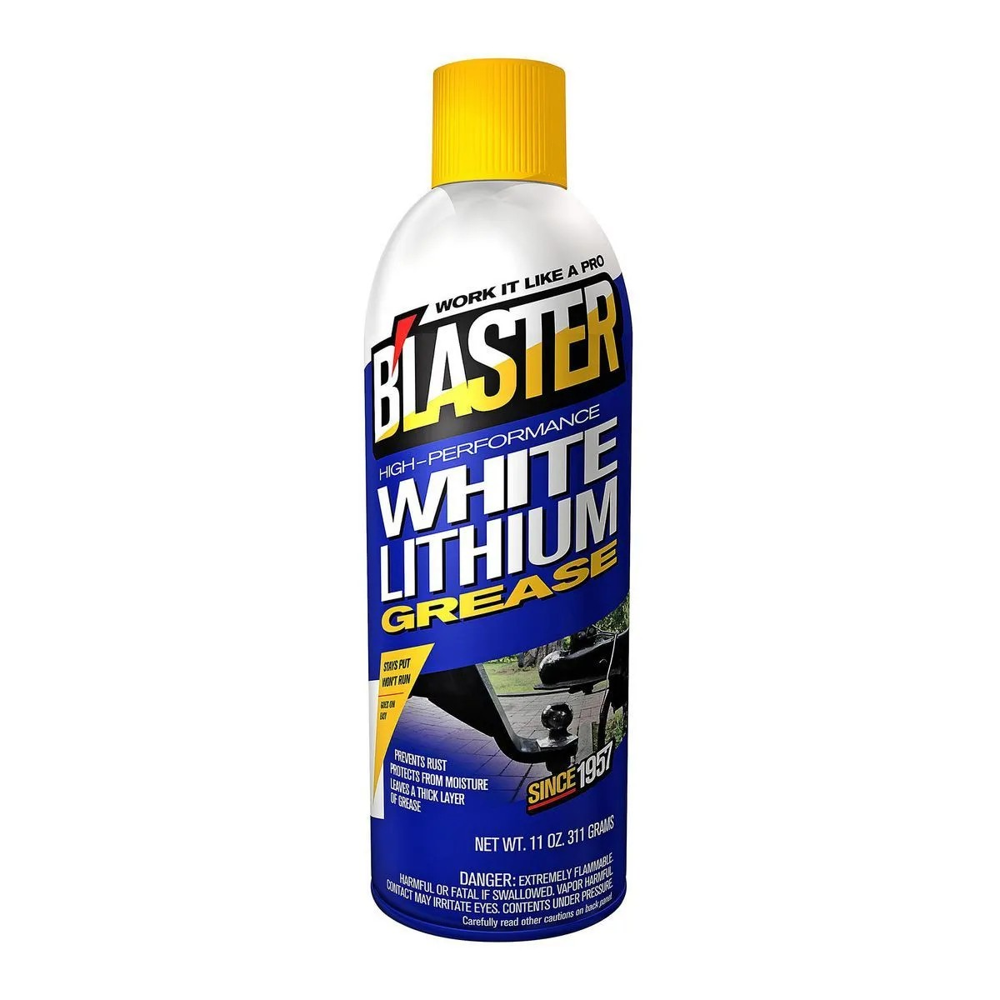 <em>B'LASTER High-Performance White Lithium Grease, 11 oz spray, $6.99 at Harbor Freight (SKU 56817)</em>

**B'LASTER white lithium grease goes on the CVDs and pretty much everything with a gear.** $6.99 at Harbor Freight (SKU 56817), compared to Blaster 16-LG at $11.12.

- **Where:** the CVD joints, plus the gears on the front, center and rear diffs and the pinions. **Not inside the diffs**, those run diff oil.
- **CVDs last so much longer with it.** It thickens up as it dries, so it stays where it's put.
- **Why white lithium over waterproof or silicone grease:** dirt doesn't stick to it as much, and it doesn't wash away as easily.

---

## Price History

### Axle (wheel) driveshafts

| Date | Price | Discount Path | Notes |
|------|-------|---------------|-------|
| 2026-06-01 | **$21.10** ✅ **purchased** | Sale (~$6.66 off the $27.76 sale price) + $1 coupon if delayed | Order #8211906604054866 from FengS Store on AliExpress. Product title: "Front & Rear Driveshafts For TRAXXAS Hoss/Rustler/Slash/Stampede 4X4 2wd 1/10 RC Car Upgrade Accessories", set of 4 (front + rear pair). Free returns. See [`/Deals/aliexpress_codes.md`](../../Deals/aliexpress_codes.md) |

### Center driveshaft

| Date | Price | Discount Path | Notes |
|------|-------|---------------|-------|
| — | **$2.49** ✅ **purchased** | Used take-off part, listed price | Jenny's RC. Product title: "JATO 4X4 BL-2S CENTER SHAFT 7455, PINION GEARS AND BEARINGS TRAXXAS 90154-4." Bought instead of the TRA6855 aluminum shaft, bundle also includes a pinion gear + bearings. |

---

## Notes

- **Why CVDs over U-joints:** the E-Revo 1.0 U-joint shafts work, but the U-joint **hits the suspension arm at full travel and catches the steering link** sometimes. The CVDs deliver power smoothly through the whole travel range without that clearance problem, that's why they're the pick.
- **Real vs knock-off CVD:** both work equally well. The ~$20 knock-off is the value choice since the shaft gets cut down and rebuilt anyway.
- **Join method (custom axles):** tune length on a threaded prototype, then keyed sleeve + Loctite 680 (no pin, no weld). Details in [Shortening + Joining](#shortening--joining-e-revo-cvds-custom-axles-wip).
- **Diff: back to the stock Jato 4x4 diffs (5mm).** Proven, the knock-off CVD stock cups fit the stock 5mm diffs and work great. The in-hand E-Revo 1.0 diffs (6mm) drop to spares since the axle plan is the Slash 4x4-pattern CVDs, not the E-Revo CVDs. **Before trying an XO-1 diff, verify it's meaningfully stronger**, same TRA6882 gear set as the Jato/Slash stock diff, so there's little upside, and the Jato stock diff is cheaper. See [`differential_analysis.md`](differential_analysis.md).
- **Center driveshaft pick logic:** **bought the Jato 4x4 BL-2S take-off shaft (7455, $2.49) instead of the TRA6855.** Native fitment, and the pinion + bearings bundled in made it too cheap to pass up. **Confirmed black plastic/composite from the photo**, if it deforms under 4S, fall back to the **TRA6855** (stock Slash 4x4 aluminum, 214mm). **Skip the Tekno Big Bone**, costs much more for no performance gain, still bends, chews up its outdrives, and runs noisily.
- **Watch the center-shaft length (if buying the fallback TRA6855):** **TRA6855 = Slash 4x4 (214mm)**, **TRA6755 = Rustler/Stampede 4x4 (189mm)**. They look identical but the Rustler shaft is ~25mm too short for the Slash. Order TRA6855, not TRA6755.
- **Custom length / slop note:** Traxxas one-piece splined center shafts leave ~3–4mm of axial slop on purpose. That play is fine, even helpful, on a **flexy plastic chassis**, but on a **rigid carbon-fiber chassis with a top plate** you'd rather run zero play. The **Raptor R TRA10155 (~247mm)** is longer than the Slash shaft, so you can **cut it to an exact custom length** and take the slop out. Measure the installed gap before cutting.
- **Confirmed part numbers:** E-Revo CVD = **TRA5451R** (set, no singles); E-Revo U-joint axle = **TRA5451X**; Slash stock U-joint axle = **TRA6852X/6851X**; Slash HD steel CV = **TRA6852R/6851R**; Slash EHD = **TRA6852A/6851A**; alum center driveshaft = **TRA6855** (Slash 4x4, 214mm, *not* TRA6755, which is the 189mm Rustler); plastic center driveshaft = **TRA6767**; Tekno center = **TKR6855**.
- **Cut length:** front target, **final 90.5 mm end-to-end (~85.9 mm pin-to-hole), even halves 45.25 mm each** (tip → cut, joined at center in the sleeve). Remove **46.1 mm** total from the 136.60 mm end-to-end stock (132 mm pin-to-hole; ~23.05 mm per inner end). Measured flat, ignoring the manufacturing nub, caliper re-zeroed; cut a hair long and dry-fit in the sleeve. **Rear not built yet**, tune it next. See [Measured lengths](#measured-lengths-prototype). The knock-off CVD **stock cups are confirmed to fit the diffs**.
