# Driveshaft Selection — FastAzJato4x4

> **Chosen:**
> - **Axle (wheel) driveshafts: E-Revo 1.0 CVDs, chopped to fit.** Real or the ~$20 knock-off — both work equally well. Cut each in half and **rejoin to length with a center sleeve** — several join methods compared below (leaning **threaded + set screws + red Loctite** — easiest and serviceable). 6mm (≈1/4") matches the E-Revo diffs and cups. See [build options](#build-options--joining-the-two-cvd-halves).
> - **Center driveshaft: stock Slash 4x4 aluminum one-piece (TRA6855, 215mm).** Plastic deforms on 4S and the Tekno Big Bone isn't worth the money — stock metal is the pick. **Don't grab TRA6755 — that's the 189mm Rustler shaft and it's too short.**

  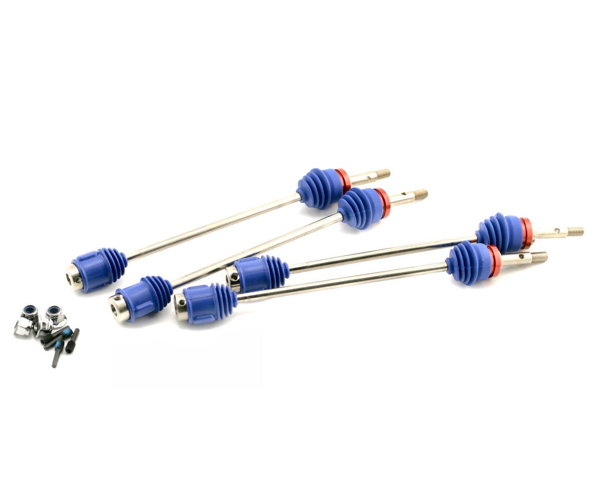&nbsp;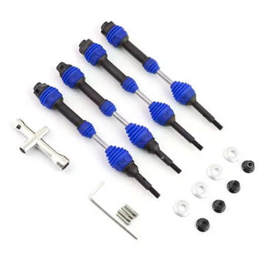&nbsp;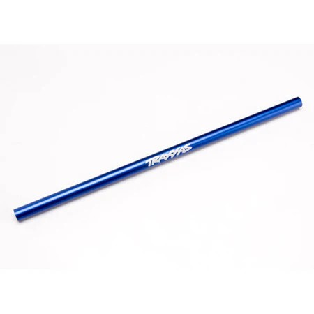 
  <em>Chosen axle: E-Revo 1.0 CVDs, chopped to fit · Runner-up axle: knock-off Slash 4x4 HD steel CV · Chosen center shaft: stock Slash 4x4 TRA6855 (215mm)</em>

> **Runner-up note:** if the E-Revo CVD route falls through, the **knock-off Slash 4x4 HD steel CV ($20–30)** is the next best. Same smooth steel-CV feel for a fraction of the genuine TRA6851R price. **It's a 5mm diff end, so switch the diff to 5mm outdrives and cups** (the E-Revo route is 6mm) — easy swap, just an extra step.

---

## Table of Contents

- [Key Requirements](#key-requirements)
- [Axle (Wheel) Driveshaft Comparison](#axle-wheel-driveshaft-comparison)
- [Knock-Off E-Revo CVDs](#knock-off-e-revo-cvds)
- [Shortening + Joining E-Revo CVDs](#shortening--joining-e-revo-cvds-custom-axles-wip)
- [Center Driveshaft Comparison](#center-driveshaft-comparison)
- [Price History](#price-history)
- [Notes](#notes)

---

## Key Requirements

| Requirement | Type | Why |
|---|---|---|
| **6mm at the diff end** | Must | Must mate the chosen E-Revo 1.0 **6mm** diff outdrives and cups (see [`differential_analysis.md`](differential_analysis.md)). The whole driveline is built around 6mm |
| **Fits Jato 4x4 hub / wheel end** | Must | Outer end has to seat the wheel hex / stub axle without modification |
| **Clears the arm + steering link at full travel** | Must | U-joint style shafts can foul the suspension arm at full droop and catch the steering link — must clear through the whole travel range |
| **Survives 4S power** | Must | Has to transmit full torque without twisting or stripping |
| **Cheap / available** | May | Wear item — the ~$20 knock-off CVD route keeps replacements painless |
| **Easily serviceable** | Must | Want to adjust length / take the joined axle apart later without destroying it — favors removable **set screws + heat-release threadlocker** over pins, welds, or epoxy |

---

## Axle (Wheel) Driveshaft Comparison

> *Spec format: Type · Part · Diff end · Fits · Price*

| Driveshaft | Spec | Pros / Cons | Photo / Link |
|---|---|---|---|
| ⭐ **Traxxas E-Revo 1.0 CVDs (chopped to fit)** | **Type:** CVD (constant-velocity) **Part:** TRA5451R (set — sold as a set, no singles) **Diff end:** **6mm** **Fits:** E-Revo diffs and cups **Price:** **$69.95** (Traxxas MSRP) | Pro: **Smoothest power delivery through full travel — no U-joint clearance problems.** 6mm, matches the E-Revo diffs and cups. The basis of the whole driveline. Cut to length and rejoin with a 6mm threaded collet / metal tube (see method below)  Con: Requires cutting + collet/solder work to shorten. **Genuine set is $69.95 — the ~$20–28 knock-off is a fraction of that** |  |
| ⭐ **Knock-off E-Revo 1.0 CVDs (chopped to fit)** — *budget* | **Type:** CVD knock-off of TRA5451R **Part:** N/A (varies by seller) **Diff end:** 6mm **Fits:** E-Revo diffs and cups **Price:** **~$20–28 for a set of 4** | Pro: **Set of 4 for $20–28 — fantastic in real use on the E-Revo 1.0.** Indistinguishable from genuine TRA5451R in practice. Same 6mm fitment. Same collet / cut-to-length method. Alt: swap diff outdrive to standard if 6mm cups not available. See [Knock-Off E-Revo CVDs](#knock-off-e-revo-cvds)  Con: Same cut + collet work required. Knock-off QC on paper, indistinguishable in practice | <a href="https://www.aliexpress.us/item/3256810555124966.html">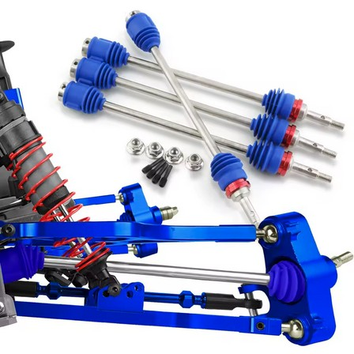</a> |
| 🔵 **Traxxas E-Revo 1.0 U-joint shafts (chopped to fit)** | **Type:** U-joint style **Part:** TRA5451X **Diff end:** 6mm **Fits:** E-Revo diffs and cups **Price:** N/A | Pro: 6mm, works, simpler than CVDs  Con: **Too large — hits the suspension arms at full extension.** Also catches the steering link sometimes. These clearance issues are why the CVDs are chosen over U-joints | 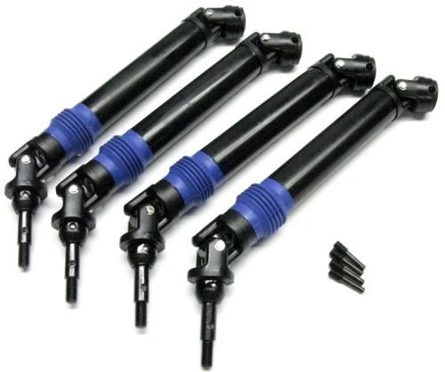 |
| 🔵 **MonsterKingz HD steel U-joint axles (eBay)** | **Type:** nickel-plated **hardened steel** U-joint / CVA, telescoping **Part:** MonsterKingz (eBay #332244551728) **Diff end:** **5mm** stub **Fits:** Slash 4x4 / Stampede / Rustler / Hoss 4x4 VXL **Price:** **from ~$44.99 (set of 4)** — varies by model picked | Pro: **This is the "FLM steel axle" I was chasing — it's actually MonsterKingz.** Hardened steel U-joints, full set of 4, telescoping. **Same axle fits all the 4x4 models** (Slash/Stampede/Rustler/Hoss) — just pick the cheapest variant in the listing. Trusted US eBay seller (99.5%, 319 sold, free fast shipping)  Con: **Likely super heavy** — solid steel adds rotating + unsprung weight, which dulls acceleration and hurts suspension response. U-joint style — watch arm / steering-link clearance at full droop. 5mm Slash stub, so switch the diff to 5mm outdrives/cups | 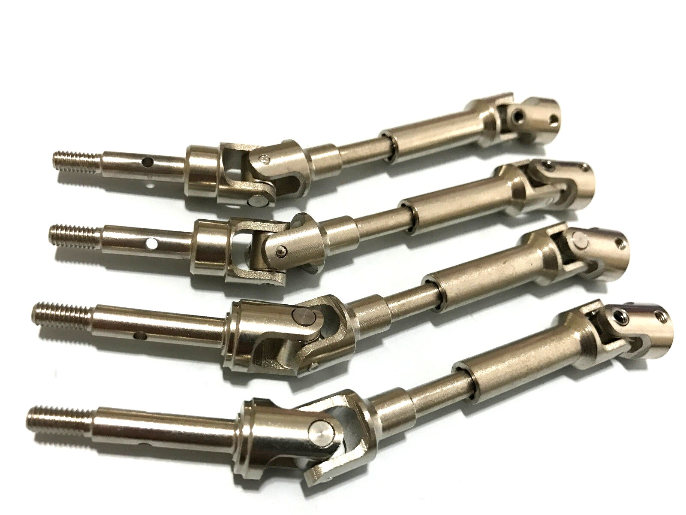 |
| 🥈 **Knock-off Slash 4x4 HD Steel CV** | **Type:** CV knock-off of TRA6851R **Part:** N/A (generic) **Diff end:** **5mm** **Fits:** Slash 4x4 pattern (5mm cups) **Price:** **~$20–30 (set of 4)** | Pro: **Runner-up to the E-Revo CVDs.** $20–30 gets a **full set of 4** — vs $69.95 for just two genuine TRA6851R axles. Same steel-CV design and smooth feel  Con: **5mm diff end — switch the diff to 5mm outdrives and cups** (the rest of the build is 6mm E-Revo). Easy swap, just an extra step. QC varies on paper |  |
| 🔵 **TRA9051 / TRA9052** Jato 4x4 VXL EHD Driveshafts | **Type:** Extreme Heavy Duty, native Jato 4x4 VXL fit **Part:** TRA9051 (front) / TRA9052 (rear); set of 4: 90386-4 **Diff end:** **6mm** **Fits:** Native Jato 4x4 VXL; E-Revo diffs **Price:** **$28.97** set of 4 (Jenny's RC, out of stock) | Pro: **Stronger than the standard EHD axles** despite sharing the "Extreme Heavy Duty" name. Native Jato 4x4 VXL fit, 6mm axle matches E-Revo diffs. Front + rear covered  Con: Tends to break at the threads like other axles. **Rubs badly on the arm at full droop** — same clearance problem as the U-joint shafts | 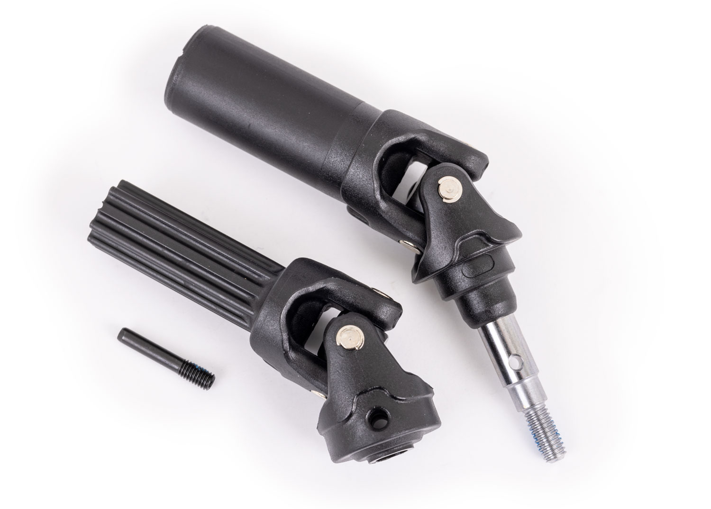 |
| ❌ ~~**Traxxas Slash 4x4 HD steel CV (2nd gen)**~~ | **Type:** nickel-plated steel CV w/ boots, U-joint pins held captive **Part:** TRA6851R (front) / TRA6852R (rear) **Diff end:** 5mm **Fits:** Slash 4x4 pattern (5mm cups) **Price:** **$69.95** (set of 2) | Pro: Steel CV, boots, captive pins — strong "2nd gen" upgrade, smooth like the E-Revo CVDs  Con: **Too expensive — $69.95 buys only two axles. The ~$20–30 knock-off above gets you four** for the same steel-CV design. No contest on value | 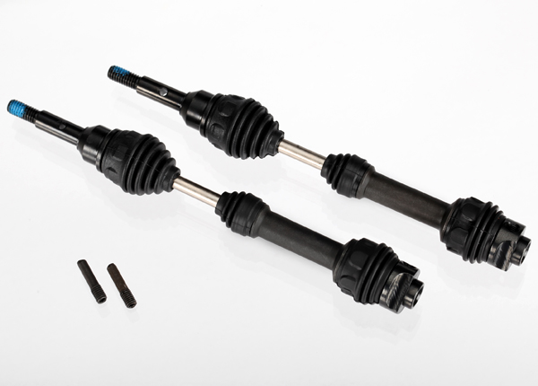 |
| ❌ ~~**Traxxas Slash 4x4 EHD axles**~~ | **Type:** Extreme Heavy Duty telescoping, oversized U-joints **Part:** TRA6852A (rear) / TRA6851A (front) **Diff end:** 6mm stub axles **Fits:** Slash 4x4 pattern **Price:** N/A | Pro: Telescoping, oversized U-joints, 6mm stubs  Con: **Nowhere near as strong as the true EHD TRA9051/9052** despite the same "EHD" name — no reason to pick these over the real EHD set | 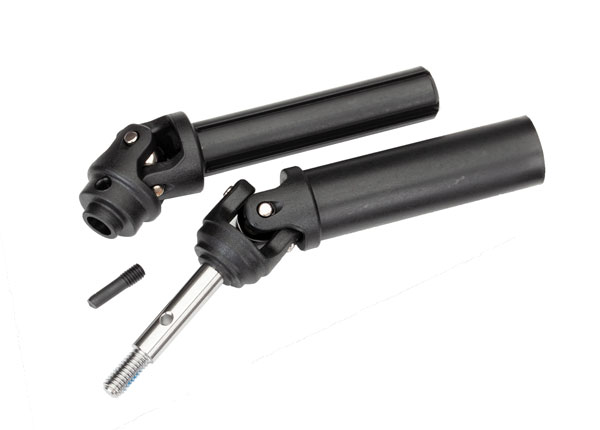 |
| 🚫 ~~**Traxxas Slash 4x4 stock axle (1st gen, U-joint)**~~ | **Type:** stock Slash 4x4 U-joint half shaft **Part:** TRA6852X (rear) / TRA6851X (front) **Diff end:** 6mm **Fits:** Slash 4x4 pattern (fits the build) **Price:** N/A | Pro: Cheap, widely available. Fits the build  Con: **Worst option — snaps like candy.** Only minor rubbing on the arms, not a full clearance hit, but the snapping issue makes this a last resort | 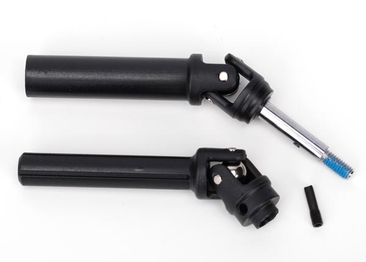 |

---

## Knock-Off E-Revo CVDs

The knock-off E-Revo 1.0 CVDs run **~$20** and **perform identically to the genuine Traxxas CVDs** — no noticeable difference in real use. Same 6mm diff end, same chopped-to-fit method. For a wear item that gets cut down and rebuilt anyway, the knock-off is the sensible buy.

> *Spec format: Type · Part · Diff end · Fits · Price*

| Part | Spec | Pros / Cons | Photo / Link |
|---|---|---|---|
| ⭐ **Knock-off E-Revo 1.0 CVD set** (e.g. RCAWD) — *budget* | **Type:** CVD knock-off **Part:** vary by seller (AliExpress / RCAWD / budget RC sellers) **Diff end:** 6mm **Fits:** E-Revo diffs and cups **Price:** **~$20** | Pro: ~$20, works equally as well as genuine. Often ships with wheel hexes + hardware. Cheap enough to keep spares  Con: QC varies on paper; indistinguishable from OEM in practice |  |

---

## Shortening + Joining E-Revo CVDs (custom axles, WIP)

The E-Revo 1.0 CVDs are longer than the Jato 4x4 needs, so they get **cut in half and rejoined to length** with a center sleeve. Several ways to make that joint — see **[Build options](#build-options--joining-the-two-cvd-halves)** below (leaning **threaded + set screws**, easiest + serviceable). The E-Revo axles seat in the **Jato 4x4 EHD hubs**, with **4 Teflon (Traxxas) washers at the wheel end** and the **E-Revo hubs** (the same hubs run on the Revo and the Slash).

> ⚠️ **WIP** — exact cut length TBD (measure against the installed diff + hub; cut once).
>
> **Sleeve sizing:** the CVD shaft is **5.5 mm** OD. For the slip-fit coupler use a **~6 mm ID** sleeve (~0.5 mm gap) — **not 1/4" / 6.35 mm ID** (~0.85 mm gap, too loose). Tighter is better: **ream to ~5.6–5.7 mm ID** if you can (~0.1–0.2 mm gap). Match the retainer to the gap: **tight gap → Loctite 648/638**; **6 mm-as-is 0.5 mm gap → Loctite 660** (high gap-fill). Sleeve wall ≈8 mm+ OD so it stays stiff and can take the cross-pin.
>
> **One-piece sleeve (preferred — no telescoping):** use a single **thick-wall steel sleeve**:
> - ⭐ **Bored/reamed to ~5.6 mm ID** → ideal ~0.14 mm slip fit → **Loctite 648** + cross-pin. (Ream a ~5 mm-ID steel tube/spacer up to size.)
> - **Off-the-shelf 6 mm ID steel spacer/tube** (no reaming) → ~0.5 mm gap → **Loctite 660** + cross-pin.
> - **Rigid steel shaft coupler** (one body, set-screw clamp, file a flat on each shaft) → mechanical, no glue.
>
> A K&S 1/4" OD brass tube gives the right ~5.64 mm ID slip fit but its thin/soft wall is weak for an axle, so **steel one-piece is the call**. Caliper the shaft + dry test-slide before committing. **Local (Portland):** **Ace or Home Depot — K&S 1/4" OD steel tube** (one-piece, ~5.6 mm ID slip fit, stronger than the brass/alu on the same rack; metal-stock / spinner-rack aisle) is the easy in-stock pick (thin wall, but cross-pin + 648 holds it). **Harbor Freight** — 5.6 mm / 7-32" drill or reamer to size a sleeve. A *thick-wall* one-piece steel sleeve isn't stocked at those three — ream a steel tube/rod, or order online (McMaster "round unthreaded spacer" / Amazon "6 mm rigid shaft coupling").

### Build options — joining the two CVD halves

> **Status: leaning threaded + set screws (easiest + serviceable).** Live candidates first; struck-through = ruled out. The fat soft shaft gives plenty of margin, **set screws on filed flats carry the load and back out for service**, and **red Loctite torches off (~250°C)** to adjust later — so the simple threaded build is the front-runner. Weld + sleeve stays the strongest *permanent* fallback.

| Option | How | Status |
|---|---|---|
| ⭐ **Threaded sleeve + set screws + red Loctite** | Thread both cut ends into an internally-threaded steel standoff to set length → **2 set screws on a filed flat** per shaft (blue Loctite on the screws) → **red Loctite 271** on the main threads. **Torch the coupler (~250°C) to release for service/adjust**, back out the set screws, reset, re-Loctite. | **Leaning — easiest + serviceable.** Set screws beat a driven pin here (pin = near-permanent); red Loctite torches off |
| 🔵 **Weld + sleeve** | Both halves into a **medium-wall steel sleeve**, set length, **fillet-weld each end** to the shaft (sleeve aligns it, welds carry load). Flux-core OK on the sleeve: low heat, .030" wire, stage the passes, chip slag, grind, **check runout**. Permanent. | Live fallback — **strongest**, given soft CVDs + you have the welder |
| 🔵 **Slip-fit sleeve + 648 + cross-pin** | Steel sleeve reamed ~5.6 mm over the 5.5 mm shaft, **Loctite 648** + **cross-pin**. No heat, no warp. Permanent. | Live — best **no-weld permanent** build |
| 🚫 ~~Carbon-fiber tube sleeve~~ | CF tube as the coupler, bonded | **Wrong for the axle:** cheap CF is **weak in torsion** (splits unless ±45° braided), **brittle** (shatters on impact where steel bends), and **can't take set screws or a pin** (crushes/delaminates) → forces a **permanent epoxy bond**, killing serviceability. *Older racers used CF/alloy tube — for the **center driveshaft**, not the wheel axle.* |
| 🚫 ~~Telescoping nested tubes~~ | Nest K&S tubes to build wall thickness | **You want one piece** |
| 🚫 ~~Threaded + Loctite only (no pin)~~ | Thread the ends + red Loctite, nothing mechanical | **Backs out** under reversing throttle/brake |
| 🚫 ~~Thin brass/alu sleeve (structural)~~ | K&S 1/4" brass tube as the coupler | Wall too **thin/soft** (0.36 mm) for an axle |
| 🚫 ~~Epoxy / JB Weld~~ | Bond the joint with epoxy | **Brittle** under reversing torsion — cracks |
| 🚫 ~~Press fit~~ | Hammer the shaft into a tight bore | Hard to size by hand, no glue gap, fights length-setting |
| 🚫 ~~Weld/braze hardened steel~~ | Weld a hard axle without re-heat-treat | Anneals → soft/brittle joint (moot here — these file soft) |

**Shared build notes (any option):**

- **File-test before welding:** file bites = soft = weldable (these knock-offs, and apparently genuine Traxxas too). File **skates** = hardened, don't weld. **Tough/springy** = medium-carbon → **preheat + slow-cool** to avoid cracking.
- **Soft but fat = likely strong enough:** the 5.5 mm shaft is bigger than typical ~4 mm aftermarket CVDs, and torsion scales with **diameter³** (≈2.6× the section), so the thickness offsets the missing hardness; soft also **bends instead of snapping**. Softness mainly costs **wear at the CV/spline contact points**, not the joined shaft.
- **Retainer by gap (bonded options):** tight ~0.1–0.2 mm → **Loctite 648/638**; loose ~0.5 mm → **660**. **Degrease + prime** plated steel (Loctite 7649). The pin/weld carries the load; glue is the backup.
- **Warp + runout:** jig dead-straight, weld/work in **stages**, then roll on glass or V-blocks + dial indicator and **straighten** (soft steel tweaks easily). Keep the coupler short.
- **Aluminum-angle jig/backing (welding):** **you can't weld steel to aluminum** (no fusion) — but aluminum angle is a great **alignment jig + weld backing**. Lay the axle in the angle's inside corner so it sits dead-straight, clamp, and weld the **steel-to-steel** joint; the weld **won't stick to the aluminum** (like a copper backing) and the angle holds it straight + sinks heat (so you may need a touch more heat for steel penetration). Check runout after.
- **Thread-to-tune → weld-to-finalize:** dial the length on the threads, then weld the joint (in the aluminum-angle jig) to lock it permanently. Good combo — but the weld **gives up the serviceable set-screw option** (no more torch-and-adjust). Stop at set screws + red Loctite if you want to keep it serviceable.
- **Permanent vs adjustable:** weld + sleeve and slip-fit + 648 are **permanent** (set length first); only the **threaded** option keeps length-adjustability.
- **JB Weld on threads?** Works as a gap-filler, but it's **brittle** (cracks under reversing load), **permanent**, and **doesn't heat-release** — so it's out for a serviceable build. Use **red Loctite 271** instead.
- **Serviceable build (the priority):** **set screws beat a cross-pin** — they back out for service (a driven pin you'd have to drill). File a **flat** where each set screw lands (bites a flat, won't spin), use **2 per side**, **blue Loctite on the screw threads**. Main threads: **red Loctite 271** (torch ~250°C to release) — or **blue 242** to service with hand tools, no torch. Keep the flame on the **metal coupler, off the CV boots/plastic** (or pull boots first), and **reapply fresh Loctite** on reassembly.

---

## Center Driveshaft Comparison

**Take: stock Traxxas aluminum one-piece is the pick.** This is the diff-to-diff shaft, not the wheel axles. On 4S the plastic shaft deforms and the Tekno Big Bone costs more for no gain, so the stock metal shaft wins on value.

> *Spec format: Type · Material · Part · Length · Price*

| Driveshaft | Spec | Pros / Cons | Photo / Link |
|---|---|---|---|
| ⭐ **Stock Slash 4x4 aluminum (one-piece)** | **Type:** Hollow one-piece (non-telescoping) **Material:** 6061-T6 aluminum **Part:** TRA6855 (Slash 4x4) **Length:** **215mm** (8.5") **Price:** **$10** | Pro: **Best value — light, stiff, splines onto the front/rear input shafts with no driveline play.** Correct **215mm** Slash 4x4 length. Handles 4S where plastic deforms; no premium spent on the Tekno for zero gain  Con: One-piece (non-telescoping); aluminum can bend in a hard hit. Leaves the stock ~3–4mm of spline slop |  |
| 🔵 **Raptor R 4x4 aluminum (custom-length)** | **Type:** One-piece splined **Material:** 6061-T6 aluminum **Part:** TRA10155 (Raptor R 4x4) **Length:** **~247mm** — longer than the Slash's 215mm **Price:** **$13.95** | Pro: **Longer shaft you cut/set to a custom length** — lets you take up the stock ~3–4mm of spline slop. Worth it on a rigid CF chassis with a top plate, where you want zero play (vs a flexy plastic chassis, where the slop is fine). 6061-T6, light, stiff  Con: Longer than needed — must measure and trim to fit. Overkill if stock slop doesn't bother you | 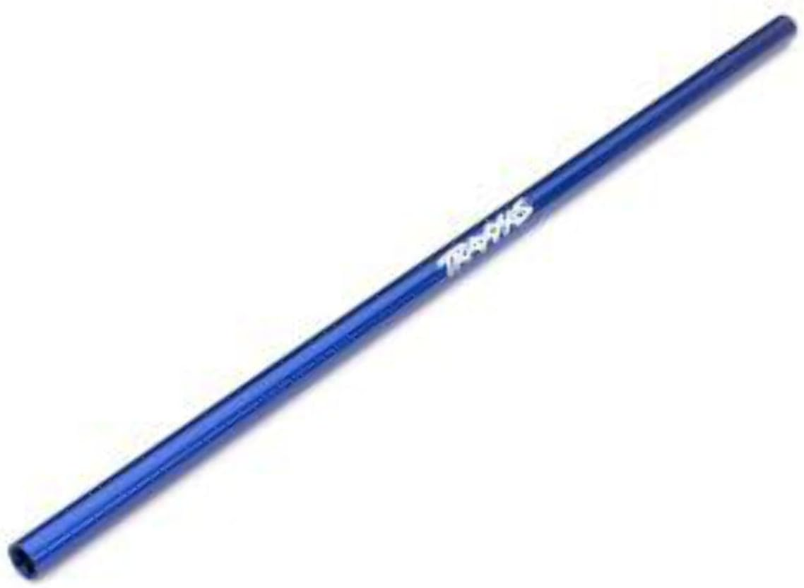 |
| ❌ ~~**Tekno Big Bone aftermarket**~~ | **Type:** dog-bone center shaft + outdrives **Material:** anodized aluminum shaft, hardened steel outdrives **Part:** TKR6855 (Slash 4x4 kit) **Length:** N/A **Price:** **$34.99** (in stock) | Pro: Nicely built dog-bone, hardened steel outdrives  Con: **Not worth the money — no performance gain over stock.** The shaft still bends and the outdrives get super chewed up, and it runs noisily. Literally cheaper to run stock metal, or even plastic at worst | 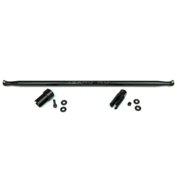 |
| 🚫 ~~**Stock plastic (screw pin)**~~ | **Type:** one-piece w/ screw pin **Material:** black plastic **Part:** TRA6767 **Length:** N/A **Price:** **$4.00** | Pro: Cheapest at $4 — lightest option  Con: **We're running 4S — plastic deforms under that power** over many packs. Fine for a stock basher, not for this build | 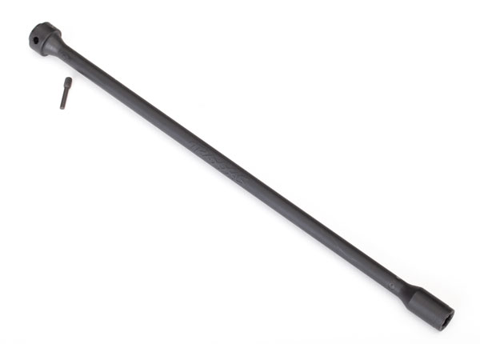 |
| 🚫 ~~**Rustler 4x4 aluminum (wrong fit)**~~ | **Type:** one-piece **Material:** 6061-T6 aluminum **Part:** TRA6755 (Rustler 4x4) **Length:** **189mm** (6.5") **Price:** **$10** | Pro: Same aluminum build as the Slash shaft — looks nearly identical  Con: **Too short — 189mm vs the Slash 4x4's 215mm.** Easy to order by mistake; this is the Rustler/Stampede 4x4 part. Get **TRA6855** instead | 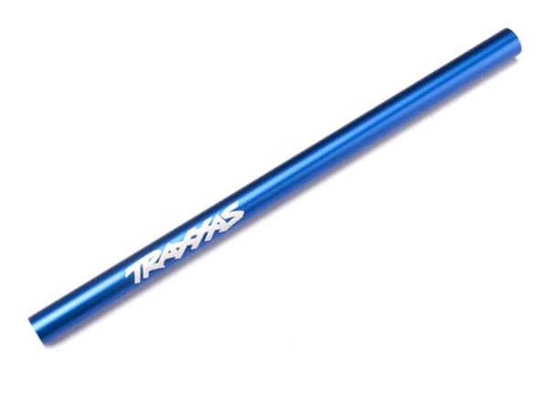 |

---

## Price History

### Axle (wheel) driveshafts

| Date | Price | Discount Path | Notes |
|------|-------|---------------|-------|
| 2026-06-01 | **$21.10** ✅ **purchased** | Sale (~$6.66 off the $27.76 sale price) + $1 coupon if delayed | Order #8211906604054866 from FengS Store on AliExpress. Product title: "Front & Rear Driveshafts For TRAXXAS Hoss/Rustler/Slash/Stampede 4X4 2wd 1/10 RC Car Upgrade Accessories" — set of 4 (front + rear pair). Free returns. See [`/Deals/aliexpress_codes.md`](../../Deals/aliexpress_codes.md) |

---

## Notes

- **Why CVDs over U-joints:** the E-Revo 1.0 U-joint shafts work, but the U-joint **hits the suspension arm at full travel and catches the steering link** sometimes. The CVDs deliver power smoothly through the whole travel range without that clearance problem — that's why they're the pick.
- **Real vs knock-off CVD:** both work equally well. The ~$20 knock-off is the value choice since the shaft gets cut down and rebuilt anyway.
- **Join method (custom axles):** **threaded 1/4" standoff + a mechanical lock (cross-pin or set screws) + high-strength retainer** is the pick — adjustable length, keeps it straight, no heat. **Don't weld/braze** (anneals the hardened CVD steel at the joint → bends/cracks, warps, no adjustability). Loctite alone backs out under reversing drivetrain torque, so the **mechanical lock is the key** — the pin carries the load, the thread just sets length. Measure twice, cut once.
- **Diff: use the E-Revo 1.0 stock diffs.** Proven — E-Revo output drives + the knock-off CVD stock cups fit the stock Slash diffs and work great, and the E-Revo diff has the internal cross-**bar** that makes it stronger. **Before trying an XO1 diff, verify its outdrive/cup interface matches the E-Revo 6mm setup** — don't introduce that unknown unless it's confirmed-fit and meaningfully stronger.
- **Center driveshaft pick logic:** **stock Slash 4x4 metal (TRA6855, 215mm) is the choice on this 4S build.** Plastic ($4) is fine for a stock basher but deforms under 4S. **Skip the Tekno Big Bone** — costs much more for no performance gain, still bends, chews up its outdrives, and runs noisily.
- **Watch the center-shaft length:** **TRA6855 = Slash 4x4 (215mm/8.5")**, **TRA6755 = Rustler/Stampede 4x4 (189mm/6.5")**. They look identical but the Rustler shaft is ~26mm too short for the Slash. Order TRA6855.
- **Custom length / slop note:** Traxxas one-piece splined center shafts leave ~3–4mm of axial slop on purpose. That play is fine — even helpful — on a **flexy plastic chassis**, but on a **rigid carbon-fiber chassis with a top plate** you'd rather run zero play. The **Raptor R TRA10155 (~247mm)** is longer than the Slash shaft, so you can **cut it to an exact custom length** and take the slop out. Measure the installed gap before cutting.
- **Confirmed part numbers:** E-Revo CVD = **TRA5451R** (set, no singles); E-Revo U-joint axle = **TRA5451X**; Slash stock U-joint axle = **TRA6852X/6851X**; Slash HD steel CV = **TRA6852R/6851R**; Slash EHD = **TRA6852A/6851A**; alum center driveshaft = **TRA6855** (Slash 4x4, 215mm — *not* TRA6755, which is the 189mm Rustler); plastic center driveshaft = **TRA6767**; Tekno center = **TKR6855**.
- **Still TBD:** the exact **cut length** for the custom axles (WIP — dimensions to come). The knock-off CVD **stock cups are confirmed to fit the diffs**.
