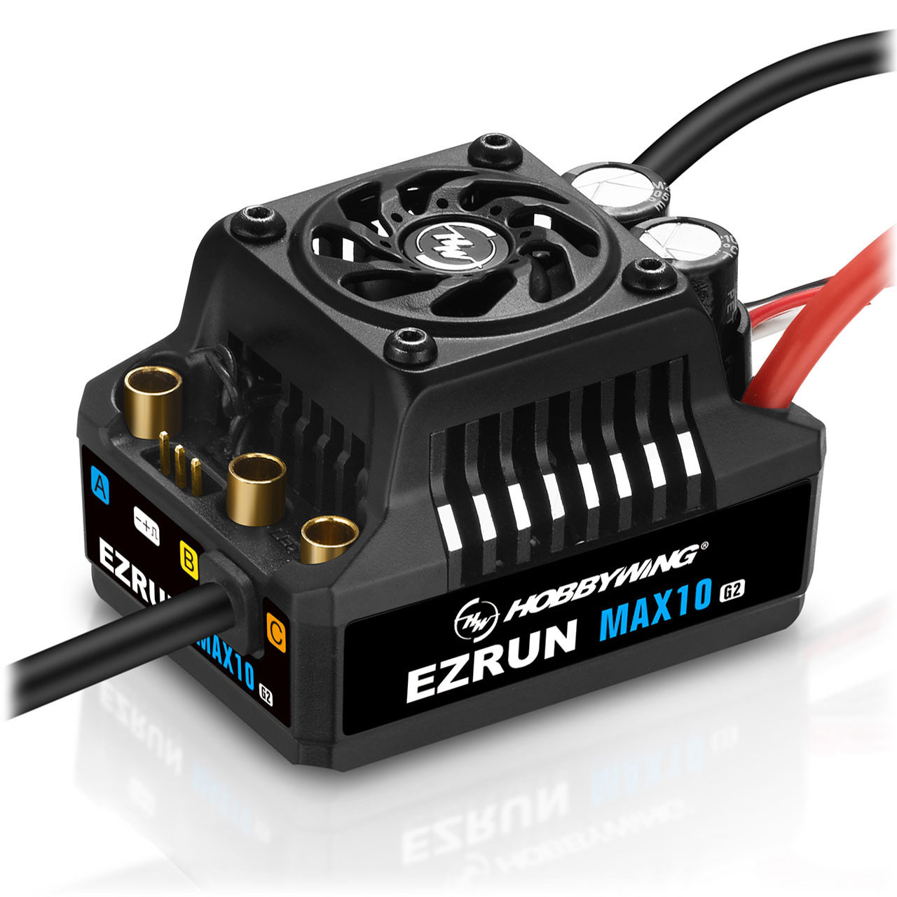
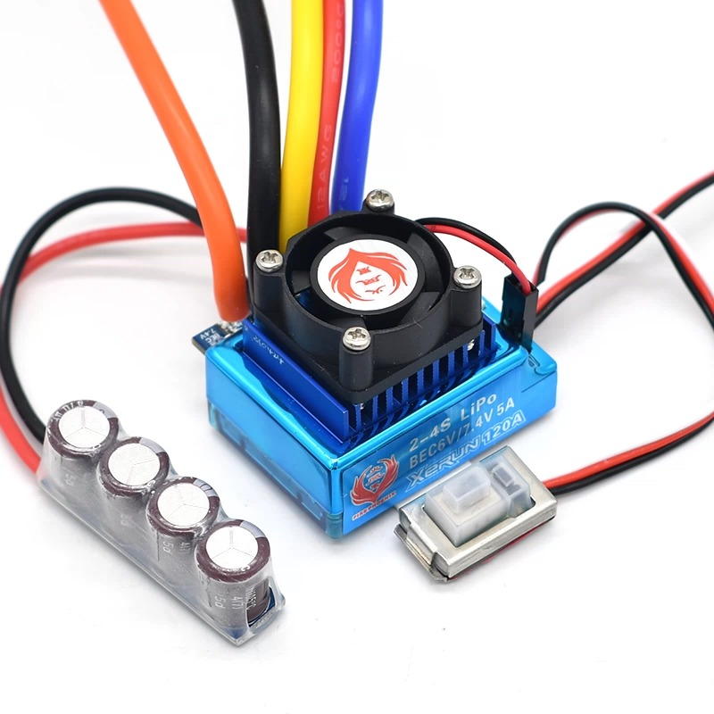
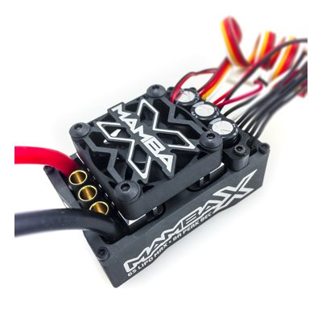
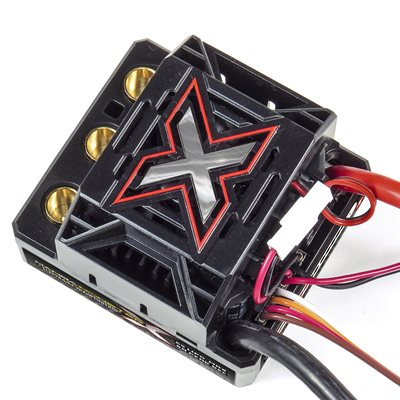
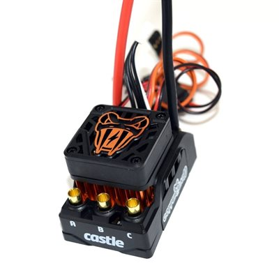
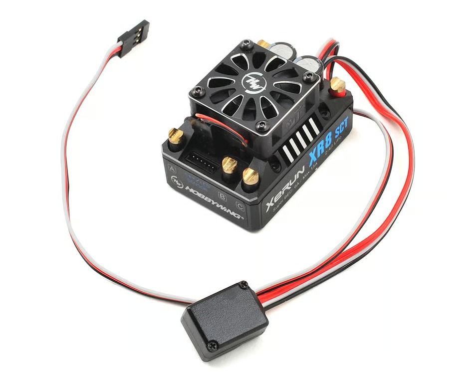
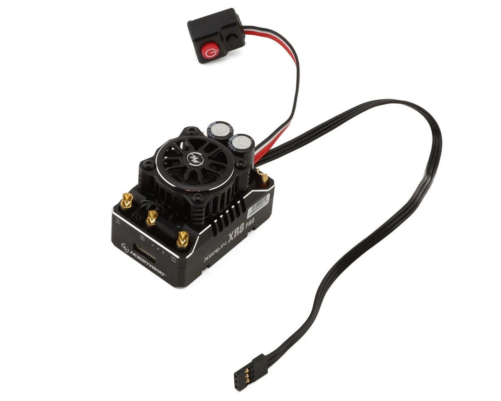
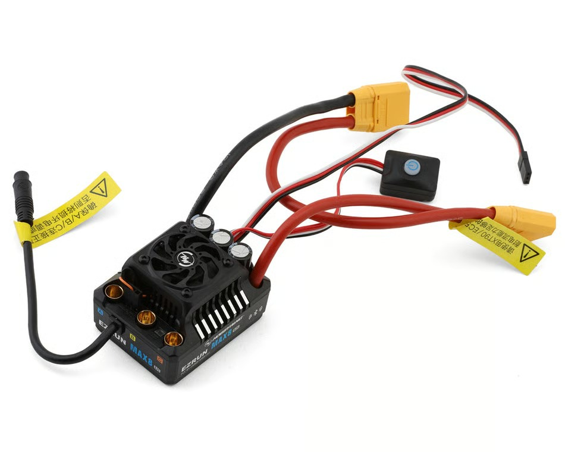

# ESC Selection — FastAzJato4x4

> **Chosen: HobbyWing EZRun MAX10 G2 140A + EZRun 3665SD G3 2400KV combo** — bought Jun 25 2026 for $127 (coupon, list $149.99), matched ESC+motor so the proprietary G3 sensor plug is a non-issue. IP67, 140A, smart start-stop fan, 32° turbo, OTA Bluetooth telemetry. Supersedes the Fire Phoenix + Tekin Pro4 HD plan below — Fire Phoenix drops to in-hand spare/fallback.

---

## Table of Contents

- [Key Requirements](#key-requirements) — Must / May criteria
- [ESC Comparison](#esc-comparison) — every ESC option with specs and status
- [Sensor Connector Compatibility](#sensor-connector-compatibility) — motor ↔ ESC plug matrix
- [Detailed Notes](#detailed-notes) — bullet specs per ESC
- [Summary](#summary) — head-to-head recap table
- [2S Light-Race Alternative](#2s-light-race-alternative-different-goal) — optional light/underdog 2S build

---

## Key Requirements

| Requirement | Type | Why |
|---|---|---|
| **4S LiPo support** | Must | ESC must handle 16.8V input |
| **Waterproof** | Must | Non-waterproof ESCs are ruled out regardless of other specs |
| **Sensored** | Must | Smooth starts, no cogging, low-speed control. Motor sensor connector compatibility matters |
| **1/10–1/8 scale current capacity** | Must | 36mm stator motors pull significant amps |
| **Lightweight** | May | Lower weight helps acceleration and handling — preferred but not required |
| **Good BEC** | May | >6V output and ≥5A current — needed to drive HV servos without voltage sag |

---

## ESC Comparison

> *Spec format: Cells · Current (A) · BEC · Sensored · Waterproof · Weight · Price*

| ESC | Spec | Pros / Cons | Photo / Link |
|---|---|---|---|
| 🟢 **Fire Phoenix XeRun 120A Enhanced (Speed Dragon)** — *in hand, now spare/fallback* | **Cells:** 2-4S **Current (A):** **120A** **BEC:** 6V/5A or 7.4V/5A (solder mod) **Sensored:** **Yes (JST-ZH)** **Waterproof:** **Full submersion** **Weight:** **105g** **Price:** **$30 (in hand)** | Pro: Already owned, proven on 4S with 3200KV on Slash 4x4, fully waterproof (full soak), sensored, comes with fan, zero cost  Con: **Superseded by the MAX10 G2 combo** — the combo is matched with its own motor and already paid for, so this drops to a spare/fallback. Lower amp rating than Castle Mamba options; Chinese market rebrand |  |
| 🔵 **Castle Mamba X** | **Cells:** 2-6S **Current (A):** not published* **BEC:** 8A peak, adj. 5.5/6.0/7.5/8.0V **Sensored:** Yes (SmartSense) **Waterproof:** Yes (epoxy) **Weight:** 101g **Price:** ~$190 | Pro: 6S rated, **officially supports the Castle 1412 in-hand motor**, adjustable BEC, datalogging  Con: Amps not published; no IP rating; fan must come off in wet conditions |  |
| 🔵 **Castle Mamba Monster X** | **Cells:** 2-6S **Current (A):** not published* **BEC:** 8A peak, adj. 5.5/6.0/7.5/8.0V **Sensored:** Yes (SmartSense) **Waterproof:** Yes (epoxy) **Weight:** 111g **Price:** ~$200 | Pro: True 1/8 scale power handling, 6S overhead  Con: **Wrong motor class for the in-hand 1412** — spec'd for 1512 / 1515 only; overkill for 36mm motors |  |
| 🔵 **Castle Copperhead 10** — *(budget)* | **Cells:** 2-4S **Current (A):** not published* **BEC:** 6A peak, sel. 5.5/7.5V **Sensored:** Yes (SmartSense) **Waterproof:** Yes (epoxy) **Weight:** 71g **Price:** ~$145 (sale ~$95) | Pro: Lightest on the list, **I run 2 on the K939 — never struggle or thermal**, CRYO-DRIVE keeps it cool  Con: 4S ceiling; vehicle weight cap ~7.5 lb (FastAzJato4x4 at the edge); spec'd for 1406 not the 1412 |  |
| ⭐ **HobbyWing EZRun MAX10 G2 140A + 3665 G3 2400KV combo** — *chosen, in hand* | **Cells:** 2-4S (ESC) **Current (A):** 140A **BEC:** 6V/7.4V @ 5A **Sensored:** Yes (G3 port — matched to the combo motor) **Waterproof:** IP67 **Weight:** 120g (ESC) + ~305g (motor) **Price:** ✅ **purchased $127 (Jun 25 2026)**, coupon (list $149.99) | Pro: **Chosen — as a combo the proprietary G3 port is a non-issue,** the ESC + EZRun 3665 SD G3 motor are matched, no adapter. IP67, smart fan, +74% caps, 32° turbo (+25% speed), OTA-BT telemetry  Con: ⚠️ **For our 4S you must take the 2400KV combo (p/n 38020343) — the 3200KV/4000KV motors are 2-3S only** (see [motor_analysis](motor_analysis.md)). Combo motor is **heavy (~305g vs the 221g Tekin Pro4 HD)**; standalone ESC still needs the G3 adapter for non-EZRun motors |  |
| 🚫 ~~HobbyWing XeRun XR8 SCT~~ | **Cells:** 2-4S **Current (A):** 140A **BEC:** 6V / 3A **Sensored:** Yes (JST-ZH) **Waterproof:** **NO** **Weight:** 91g **Price:** ~$200 | Pro: Light at 91g, competition-grade  Con: **Not waterproof — hard no for this build**; BEC only 6V / 3A (fails HV-servo May requirement); superseded by XR8 PRO G3 |  |
| 🚫 ~~HobbyWing XeRun XR8 PRO G3~~ | **Cells:** 2-4S **Current (A):** 200A **BEC:** 6V or 7.4V adj., 6A continuous **Sensored:** Yes / Sensorless **Waterproof:** **NO** **Weight:** 103g **Price:** ~$150 | Pro: Newest XeRun racing ESC, 200A continuous, 4S match, OTA programmable  Con: **Not waterproof — XeRun racing line, hard no for this build** |  |
| 🚫 ~~HobbyWing EZRun MAX8 G2S~~ | **Cells:** 4S-6S **Current (A):** 160A **BEC:** 6A/15A, 6V/7.4V/8.4V **Sensored:** Yes (JST-ZH) **Waterproof:** Yes (enhanced) **Weight:** 194g **Price:** ~$140 | Pro: Highest amp rating among Hobbywing options, 6S overhead, Bluetooth, 32° turbo  Con: Way too heavy at 194g for a 1/10 build on 36mm motors |  |

*Castle does not publish continuous amp ratings for surface ESCs. Community reports peaks of 100+ A on the Mamba X and Monster X.*

---

## Sensor Connector Compatibility

| ESC | Castle 1412 / 1415 | HW XeRun 3660SD G3 | HW EZRun 3665SD G3 | HW EZRun 3652SD G3 |
|---|---|---|---|---|
| **Fire Phoenix XeRun 120A Enhanced** | Works | Works (JST-ZH) | Needs adapter (HWA30810007) | Works (JST-ZH) |
| HobbyWing EZRun MAX10 G2 | Works | Works (JST-ZH) | **Native fit (proprietary G3 port)** | Works (JST-ZH) |
| HobbyWing XeRun XR8 SCT | Works | Works (JST-ZH) | Needs adapter (HWA30810007) | Works (JST-ZH) |
| Castle Mamba X | **Native (SmartSense)** | Works | Needs adapter | Works |
| Castle Mamba Monster X | **Native (SmartSense)** | Works | Needs adapter | Works |
| Castle Copperhead 10 | **Native (SmartSense)** | Works | Needs adapter | Works |

---

## Detailed Notes

### Fire Phoenix XeRun 120A Enhanced (Speed Dragon) — In Hand (spare/fallback)

- Chinese market rebrand of the HobbyWing XeRun 120A Enhanced (强化速龙). Not the standard V3.1 — that's 2-3S only. The Enhanced version is 2-4S and waterproof.
- Dimensions: 43 × 36 × 33mm
- BEC: 6V/5A or 7.4V/5A (solder mod — done on my units)
- Burst current: 760A; resistance 0.0003 ohm
- Sensor input: JST-ZH — works with Castle 1412/1415 and standard Hobbywing motors. Needs adapter (HWA30810007) for EZRun 3665SD G3 proprietary plug.
- Fan included; powered directly from battery (max 8V). I confirmed the fan doesn't overspeed on 4S, so voltage is regulated in practice.
- I confirmed full submersion, not just splash resistant. Surprisingly capable for a $30 ESC.
- Proven on my car: 4S with 3200KV on Slash 4x4, zero issues. Cost $30 on Temu/AliExpress.

### Castle Mamba X — Candidate

- Dimensions: 54.4 × 35.2 × 30.0mm
- BEC: 8A peak, adjustable 5.5 / 6.0 / 7.5 / 8.0V (default 5.5V)
- Motor connectors: 4.0mm female bullets
- Recommended motors: Castle 1406 / 1410 / **1412** / 1415 sensored (1412 is in hand)
- Application: <7 lb at 6S, or 1/8 buggy <9 lb at 4S max
- 30mm fan included but must be removed for wet driving (not waterproof)
- Datalogging, telemetry, ROAR + Recon G6 certified, B-Link compatible
- MSRP $232, street ~$190

### Castle Mamba Monster X — Candidate

- 1/8-scale version of the Mamba X
- Dimensions: 53 × 49 × 36.4mm
- BEC: 8A peak, adjustable 5.5 / 6.0 / 7.5 / 8.0V
- Motor connectors: 6.5mm female bullets
- Recommended motors: Castle 1512 (1800/2650KV, 4S max) or 1515 (2200KV, 6S) — **does NOT officially support the in-hand 1412**
- Application: <15 lb with 2200KV, <9 lb with 1800/2650KV. Not for high-speed 1/8 (Infraction / Limitless / XO-1)
- 30mm fan included but must be removed for wet driving
- Datalogging, telemetry, B-Link compatible
- MSRP $245, street ~$200

### Castle Copperhead 10 — Candidate (budget)

- Dimensions: 55.6 × 35.3 × 33.8mm
- BEC: 6A peak, selectable 5.5 / 7.5V
- Motor connectors: 4.0mm female bullets
- Recommended motors: Castle 1406 series (4-pole 12-slot) — **does NOT officially support the in-hand 1412**
- Application: 1/10 vehicles up to 7.5 lb (FastAzJato4x4 is right at this limit with battery)
- Runs SmartSense, sensored-only, or brushed
- CRYO-DRIVE minimizes part-throttle heat; 30mm removable fan with dual-use fan guard
- Data Logging Lite, telemetry, B-Link 2 compatible
- **I run 2 on the K939 — never struggle or thermal**
- MSRP $177, street ~$145, sale prices as low as ~$95

### HobbyWing EZRun MAX10 G2 140A — Chosen (matched 3665 G3 motor combo)

- Dimensions: 53 × 39.5 × 37.2mm
- BEC: 6V or 7.4V @ 5A (switch-mode)
- Burst current: 880A
- Motor KV limit: 3S → ≤4000KV (3665); **4S → ≤2600KV** — so the **2400KV 3665 just fits 4S**, while the 3200/4000KV are 3S only
- Only HobbyWing ESC in this range with full IP67
- **As a combo the proprietary G3 sensor port is a non-issue** — the ESC + EZRun 3665 SD G3 motor line up directly, no adapter
- For Castle / standard JST-ZH motors (standalone use), needs the HobbyWing Sensor Adapter (HWA30810007) — only matters if *not* running the matched combo
- Smart start-stop fan (only spins when hot), 32° turbo timing, OTA Bluetooth optional
- $60 ESC alone; **$149.99 combo** with the 3665SD G3 motor
- **What people typically run this kit in:** 1/10 **4×4 monster trucks / heavier 4WD trucks** (Arrma Granite / Big Rock / Typhon, Traxxas Stampede / Rustler / Slash 4×4) and light **truggies**. By KV: **2400KV on 4S** = heavier 1/10 4WD MT (the torque/4S config); **3200KV on 2-3S** = 1/10 SCT / all-around; **4000KV on 2-3S** = lighter buggy / on-road / speed. The FastAzJato is **heavier than the typical 1/10 target**, so the **2400KV/4S** (the kit's heaviest-duty config) is the match — and it sits near the top of what the MAX10 G2 is rated for.

### HobbyWing XeRun XR8 SCT — Ruled Out (not waterproof)

- Older model in the XR8 family, superseded by XR8 PRO G3
- 38.5 × 36 × 30mm; BEC 6V / 3A; burst 760A
- Would have been the lightest at 91g — irrelevant since not waterproof

### HobbyWing XeRun XR8 PRO G3 — Ruled Out (not waterproof)

- Newest XeRun racing ESC
- Dimensions: 54.8 × 36.8 × 38.8mm
- BEC: 6V or 7.4V adjustable, 6A continuous switch-mode
- Burst 1080A; sensored or sensorless
- Motor KV limit: 2S → ≤4300KV 3660; 3S → ≤3600KV 3660; 4S → ≤3000KV 4268
- Programming via Tunalyzer and OTA programmer
- XeRun racing line — fan powered by BEC, no IP rating, ruled out for waterproof requirement
- MSRP $210, street ~$150

### HobbyWing EZRun MAX8 G2S — Ruled Out (too heavy)

- Built for 1/8 trucks and buggies with big motors — overkill for 36mm stator
- Dimensions: 60 × 48 × 40.5mm
- BEC: 6A / 15A switch-mode, 6V / 7.4V / 8.4V
- Burst 1080A
- Motor KV limit: 4S → ≤3000KV; 6S → ≤2400KV
- 32° turbo timing (+25% RPM with compatible motors), Bluetooth via HW LINK app
- Enhanced waterproof + dust-proof
- 194g is the heaviest ESC on this list by far

---

## Summary

| | Fire Phoenix 120A | Copperhead 10 | MAX10 G2 | Mamba X | Mamba Monster X |
|---|---|---|---|---|---|
| Max cells | 4S | 4S | 4S | 6S | 6S |
| 4S headroom | Tight | Tight | Tight | Comfortable | Comfortable |
| Waterproof | **Full soak** | Yes (epoxy) | IP67 | Yes (epoxy) | Yes (epoxy) |
| Sensored | Yes (JST-ZH) | Yes (SmartSense) | Yes (G3 port) | Yes (SmartSense) | Yes (SmartSense) |
| Weight | 105g | **71g** | 120g | 101g | 111g |
| Castle 1412 native | Works | SmartSense* | Adapter | **SmartSense (rated)** | SmartSense (not rated for 1412) |
| EZRun 3665SD G3 native | Adapter | Adapter | **Yes** | Adapter | Adapter |
| Price (approx) | **$30 (in hand)** | ~$145 ($95 sale) | ~$60 | ~$190 | ~$200 |

*Copperhead 10 is spec'd for 1406 motors; will physically work with 1412 sensor but outside official application range.*

> XeRun XR8 SCT, XR8 PRO G3, and EZRun MAX8 G2S removed — XeRuns are not waterproof, MAX8 G2S is too heavy.

**Pairing logic:**
- **Matched combo, zero-hassle sensor wiring** → MAX10 G2 + EZRun 3665SD G3 2400KV, bought as a pair for $127. **← Chosen path** — supersedes the Fire Phoenix + Castle 1412 pairing below.
- ~~Keep it simple, zero extra spend~~ → Fire Phoenix in hand + Castle 1412 in hand. Proven combo, $0 additional cost — **now the fallback/spare pairing** if the MAX10 G2 combo ever needs replacing.
- **Lightest possible waterproof ESC** → Copperhead 10 at 71g, ~$95 on sale. Pairs with Castle 1406; will run a 1412 but outside spec.
- **Want 6S headroom later** → Mamba X (for 1412/1415 motors) or Mamba Monster X (for 1512/1515 motors). All 4S ESCs are dead ends if voltage ever goes up.

**Weight priority:** Fire Phoenix (105g, $30, in hand) and Copperhead 10 (71g, ~$95 on sale) are the two lightest waterproof options — but weight lost to the pairing logic above since the MAX10 G2 combo was already bought matched.

---

## 2S Light-Race Alternative (different goal)

A separate direction from the 4S basher build: a **light 2S** car — the nimble underdog on a 4S-dominated track. The track's only rule is **1/8 buggy, 4S max**, so a 2S build is **legal just by being under the cap** (no stock/spec class to conform to — run any motor/timing). The low-grip surface can't put down 4S power anyway, and going 2S **sheds ~200–300 g+** (mostly the smaller battery) ≈ **7–10% off the car**, right where it helps cornering, landings, and driveline life.

**2S powertrain:**
- **ESC:** Hobbywing **XeRun XR10 Pro-WP** — **2S-only**, 160A/1200A, IP67, JST-ZH sensored (auto-fallback to sensorless), BEC 5–7.4V/5A, 95.6g. Boost/turbo timing + data logging (and a blinky mode if ever wanted, though this track doesn't require it).
- **Motor:** **XeRun V10 8.5T (~4600KV)** — native JST-ZH, no adapter (Castle 4600KV also works). Open class, so KV is your call — go hotter (toward the **5.5T (~5800KV)** ESC limit) for more 2S punch, or stay 8.5T for cooler/torquier.
- **2S motor limit (this ESC):** Touring ≥4.5T, **Buggy ≥5.5T** — the 8.5T is well within.

**Why 2S here:**
- **Lighter** (~200–300 g+) → nimbler, softer landings, less mass to throw around.
- **Traction-limited track** → can't use 4S top speed anyway, so 2S is "enough."
- **Kinder to the driveline** → less torque shock on the CVDs / gears (the build's weak point).
- **Fun/underdog** → a clean light 2S that carries corner speed can beat heavier 4S cars on a technical layout.

**Make it work:** commit to light (the whole point); **gear for the power band** so the high-KV motor doesn't lug/heat. No class restrictions, so tune timing/boost freely for max 2S drive.

**Tradeoff:** gives up straight-line punch to the 4S cars — not a drag build. Wins on handling, consistency, and parts life on a technical low-grip track.
