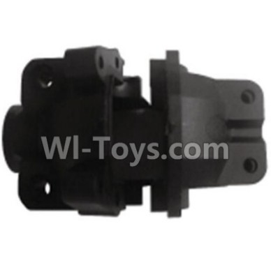
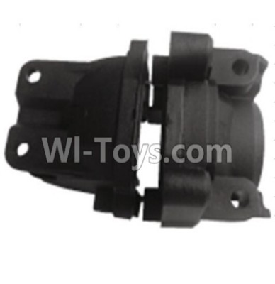
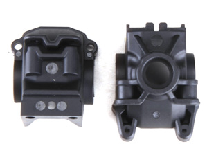
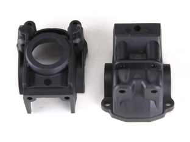

# Gearbox Housing Selection — FastAzJato4x4

> **Leaning toward: stock Traxxas plastic gearbox housings (front + rear)** — the [chosen AliExpress CF chassis](chassis_analysis.md) already includes a metal skid plate / brace that protects the diffs from below, so the aluminum-housing "diff protection" upgrade is largely redundant. Stock plastic is light, cheap, and sacrificial in crashes. OEM part numbers: **TRA6881 (front) + TRA6880 (rear), $4 each**, two halves per set. **Drop-in equivalents** from compatible 1/10 4WD clones (Wltoys K939, Remo Hobby / HQ727 — same car, two brands) work if Traxxas OEM is hard to source — but the $4 Traxxas housing is actually the cheapest once you compare real prices (the K939 gear box runs ~$8/end).

  &nbsp; 
  <em>Front TRA6881 · Rear TRA6880 — hardened plastic, two halves each, $4 per set</em>

---

## Table of Contents

- [Key Requirements](#key-requirements)
- [Gearbox Housing Comparison](#gearbox-housing-comparison) — material + brand options
- [Why aluminum isn't worth it on this build](#why-aluminum-isnt-worth-it-on-this-build) — chassis skid plate cascade
- [Notes](#notes)

---

## Key Requirements

| Requirement | Type | Why |
|---|---|---|
| **Fits the chosen E-Revo 1.0 diff** | Must | The diff housing has to accept the in-hand E-Revo diff bearings + outdrives |
| **Bolts to the chosen CF chassis** | Must | CF chassis is drilled for Slash 4x4 / Jato 4x4 family gearbox mount holes |
| **Sealed / dustproof enough for offroad** | Must | Dirt in the gearbox = early bearing death |
| **Lightweight** | May | More weight at the gearbox = more mass low and central; not as bad as high-on-motor weight but still a handling factor |
| **Cheap / replaceable** | May | Gearbox housings get cracked in heavy crashes — replaceable cheap parts beat expensive durable parts when the chassis skid plate already absorbs most impacts |

---

## Gearbox Housing Comparison

| Housing | Material | Status | Pros / Cons | Photo / Link |
|---|---|---|---|---|
| **Traxxas stock plastic** (Slash 4x4 / Jato 4x4 family) | Glass-filled nylon  Part: **TRA6881** (front) / **TRA6880** (rear) — two halves each  Price: **$4.00** per set | **Leading** | Pro: Cheapest, lightest, **sacrificial in crashes** (same logic as the shock tower and bumper picks). Wide LHS / AMain availability. Fits the chosen E-Revo diffs without surgery  Con: Cracks on hard direct impacts; nylon ages |   <em>front TRA6881 · rear TRA6880</em> |
| **Wltoys K939 gear box** (assembled shell) | Glass-filled nylon  Part: **K939-09** (front) / **K939-08** (rear)  Price: **$7.99 each** (WL-Toys.com; market $23.97) | Candidate (alt source) | Pro: **Drop-in for the same Slash 4x4 family pattern.** User already runs this on the K939 with no issues — performs identically. Good fallback if Traxxas OEM is out of stock  Con: **At $7.99/end it's ~2× the $4 Traxxas housing** — not the cheaper option once you do the math. Ships from China (slow); sometimes back-ordered; bearings not included (source K939-51 etc. separately) |   <em>front K939-09 · rear K939-08</em> |
| **Remo Hobby / HQ727 diff housing** (same car, two brands) | Glass-filled nylon  Part: **P2013** (front) / **P2041** (rear)  Price: TBD | Candidate (alt source) | Pro: Drop-in compatible with Slash 4x4 / Jato pattern, often in stock on AliExpress. **Remo Hobby and HQ727 are the same vehicle rebranded** — the housings interchange, so shop both names for whoever's cheapest/in stock  Con: Off-brand; resale value zero. Front/rear part numbers are easy to mix up — **P2013 = front, P2041 = rear** |   <em>front P2013 · rear P2041</em> |
| ~~Generic aluminum housing from AliExpress~~ | 7075-T6 aluminum | **Vetoed** | Pro: Crash-proof, looks tough, common upgrade  Con: **~80% heavier than plastic**, expensive (~$30-50), and the [chosen CF chassis's integrated metal skid plate already protects the diff from below](chassis_analysis.md) — aluminum housing is solving a problem the chassis already handles. Same aluminum-failure-cascade as shock towers: transfers force to chassis / arms instead of cracking the housing |  🚧 save as `src/drivetrain_generic_aluminum_gearbox_housing.jpg` |
| ~~Traxxas RPM-branded aftermarket~~ | Reinforced nylon | Candidate (premium plastic) | Pro: RPM's reinforced nylon is genuinely tougher than stock Traxxas at small weight penalty  Con: 2-3× the price of OEM Traxxas for marginal improvement on a build where the CF chassis already absorbs hits. Hard to justify | — |

---

## Why aluminum isn't worth it on this build

The usual argument for aluminum gearbox housings is **diff protection from below** — flat aluminum plate catches rocks / hard landings that would crack a plastic housing.

That argument **fails on this build** because:

1. **The chosen AliExpress CF chassis already has an integrated metal skid plate** in the gearbox area. Impacts from below hit the steel skid, not the housing.
2. **The 80% weight penalty of aluminum** (same physics as the [shock tower aluminum analysis](shock_tower_analysis.md#material-properties-reference)) lands in the central area of the car — less bad than high-on-the-motor weight but still costs handling.
3. **Aluminum housings transfer impact to chassis / arms** instead of cracking — when something does fail, it fails more expensively.
4. **Plastic housings are cheap consumables.** A $5-15 replacement after a hard crash beats a $30-50 aluminum housing that broke the CF chassis it was protecting.

The chassis is already doing the protection job. The housing just needs to seal the diff and bolt up.

---

## Notes

- **Cross-brand compatibility:** Slash 4x4, Jato 4x4, Wltoys K939, and Remo Hobby / HQ727 all use the same gearbox mount-hole pattern and similar internal layouts. Housings are largely interchangeable with minor fitting work. **Remo Hobby and HQ727 are the same car under two brand names** — their parts are identical, so cross-shop both.
- **Bearings inside the housing:** when ordering an OEM kit (especially the cheap Wltoys / Remo options), check that the kit includes the diff outdrive bearings (typically 5×10×4mm). If not, source separately — common bearing size, $1-2 each.
- **Front vs rear gearbox housings are different parts** — order both. The K939 / Slash 4x4 family uses different front and rear shells.
- **Final pick is price-driven.** All four plastic options work; whichever is cheapest in stock when ordering wins.
