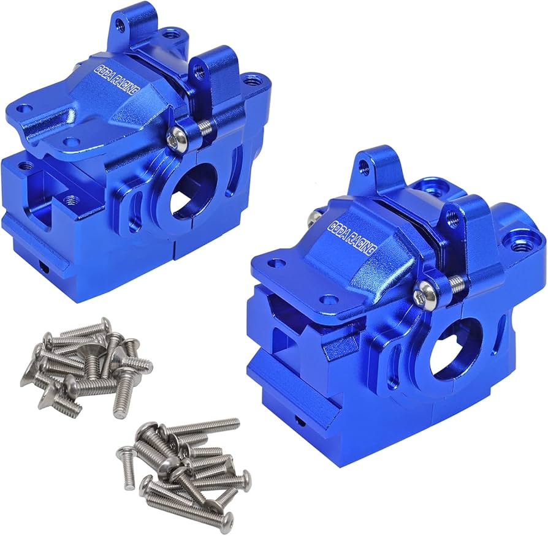

# Gearbox Housing Selection — FastAzJato4x4

> **Leaning toward: stock Traxxas plastic gearbox housings (front + rear)** — the [chosen AliExpress CF chassis](chassis_analysis.md) already includes a metal skid plate / brace that protects the diffs from below, so the aluminum-housing "diff protection" upgrade is largely redundant. Stock plastic is light, cheap, and sacrificial in crashes. OEM part numbers: **TRA6881 (front) + TRA6880 (rear), $4 each**, two halves per set. Knock-off clones (Wltoys K939, Remo Hobby / HQ727 — same car, two brands) are **vetoed**: they cost the same or more than the $4 OEM (the K939 runs ~$8/end), so there's nothing to save by going off-brand.

  &nbsp; 
  <em>Front TRA6881 · Rear TRA6880 — hardened plastic, two halves each, $4 per set</em>

---

## Table of Contents

- [Key Requirements](#key-requirements)
- [Gearbox Housing Comparison](#gearbox-housing-comparison) — material + brand options
- [Why aluminum isn't worth it on this build](#why-aluminum-isnt-worth-it-on-this-build) — chassis skid plate cascade
- [Notes](#notes)

---

## Key Requirements

| Requirement | Type | Why |
|---|---|---|
| **Fits the chosen E-Revo 1.0 diff** | Must | The diff housing has to accept the in-hand E-Revo diff bearings + outdrives |
| **Bolts to the chosen CF chassis** | Must | CF chassis is drilled for Slash 4x4 / Jato 4x4 family gearbox mount holes |
| **Sealed / dustproof enough for offroad** | Must | Dirt in the gearbox = early bearing death |
| **Lightweight** | May | More weight at the gearbox = more mass low and central; not as bad as high-on-motor weight but still a handling factor |
| **Cheap / replaceable** | May | Gearbox housings get cracked in heavy crashes — replaceable cheap parts beat expensive durable parts when the chassis skid plate already absorbs most impacts |

---

## Gearbox Housing Comparison

| Housing | Spec | Pros / Cons | Photo / Link |
|---|---|---|---|
| ⭐ **Traxxas stock plastic** (Slash 4x4 / Jato 4x4 family) | Glass-filled nylon  Part: **TRA6881** (front) / **TRA6880** (rear) — two halves each  Price: **$4.00** per set | Pro: Cheapest, lightest, **sacrificial in crashes** (same logic as the shock tower and bumper picks). Wide LHS / AMain availability. Fits the chosen E-Revo diffs without surgery  Con: Cracks on hard direct impacts; nylon ages |   <em>front TRA6881 · rear TRA6880</em> |
| ❌ ~~**Wltoys K939 gear box** (assembled shell)~~ | Glass-filled nylon  Part: **K939-09** (front) / **K939-08** (rear)  Price: **$7.99 each** (WL-Toys.com; market $23.97) | Pro: **Drop-in for the same Slash 4x4 family pattern.** I already run this on the K939 with no issues — performs identically. Could be a fallback if Traxxas OEM is out of stock  Con: **At $7.99/end it's ~2× the $4 Traxxas housing — no reason to pay more for a clone of an already-cheap part.** — not the cheaper option once you do the math. Ships from China (slow); sometimes back-ordered; bearings not included (source K939-51 etc. separately) |   <em>front K939-09 · rear K939-08</em> |
| ❌ ~~**Remo Hobby / HQ727 diff housing** (same car, two brands)~~ | Glass-filled nylon  Part: **P2013** (front) / **P2041** (rear)  Price: TBD | Pro: Drop-in compatible with Slash 4x4 / Jato pattern. **Remo Hobby and HQ727 are the same vehicle rebranded** — the housings interchange  Con: **No cheaper than the $4 Traxxas, so not worth the off-brand hassle** (slow shipping, resale value zero). Front/rear part numbers are easy to mix up — **P2013 = front, P2041 = rear** |   <em>front P2013 · rear P2041</em> |
| ❌ ~~**Generic aluminum housing** (CODA Racing / BRCatWPark / Rcarmumb — same AliExpress part, many Amazon brands)~~ | 6061-T6 anodized aluminum, CNC  Model: e.g. **CDR6880-6881NB** (replaces TRA6880/6881)  Weight: **~156g (5.5 oz)** the set  Price: **~$73–113** depending on brand | Pro: Won't crack — one reviewer kept snapping plastic cases. Looks tough  Con: **Heavy (~156g vs a few grams of plastic), and 18–28× the $4 Traxxas housing.** Wrong failure mode — passes impact to the chassis / arms instead of cracking. And the [CF chassis skid plate already protects the diff from below](chassis_analysis.md). **Some units have no pocket for the center-driveshaft pinion bearing** (flagged in reviews) — a real fitment gamble |  |
---

## Why aluminum isn't worth it on this build

The usual argument for aluminum gearbox housings is **diff protection from below** — flat aluminum plate catches rocks / hard landings that would crack a plastic housing.

That argument **fails on this build** because:

1. **The chosen AliExpress CF chassis already has an integrated metal skid plate** in the gearbox area. Impacts from below hit the steel skid, not the housing.
2. **The weight penalty is real** — the aluminum set runs **~156g (5.5 oz)** vs a few grams of plastic (same physics as the [shock tower aluminum analysis](shock_tower_analysis.md#material-properties-reference)), landing low and central. Less bad than high-on-the-motor weight, but still costs handling.
3. **Aluminum housings transfer impact to chassis / arms** instead of cracking — when something does fail, it fails more expensively.
4. **Plastic housings are cheap consumables.** A **$4** Traxxas replacement after a hard crash beats a **$73–113** aluminum housing that broke the CF chassis it was protecting.
5. **Fitment isn't guaranteed** — reviewers report some of these alloy sets have no pocket for the center-driveshaft pinion bearing, forcing a return.

The chassis is already doing the protection job. The housing just needs to seal the diff and bolt up.

---

## Notes

- **Cross-brand compatibility:** Slash 4x4, Jato 4x4, Wltoys K939, and Remo Hobby / HQ727 all use the same gearbox mount-hole pattern and similar internal layouts. Housings are largely interchangeable with minor fitting work. **Remo Hobby and HQ727 are the same car under two brand names** — their parts are identical, so cross-shop both.
- **Bearings inside the housing:** when ordering an OEM kit (especially the cheap Wltoys / Remo options), check that the kit includes the diff outdrive bearings (typically 5×10×4mm). If not, source separately — common bearing size, $1-2 each.
- **Front vs rear gearbox housings are different parts** — order both. The K939 / Slash 4x4 family uses different front and rear shells.
- **Knock-off housings aren't worth it here.** The OEM Traxxas housing is already **$4** — the cheapest of the bunch. The K939 (~$8/end) and Remo/HQ727 clones cost the same or more, so there's nothing to save by going off-brand. **Just buy the Traxxas;** only reach for a clone if the OEM is genuinely out of stock.
- **Metal housing = worse CG + more motor work.** Going aluminum dumps ~150g into the car for no real durability payoff (the CF chassis skid plate already protects the diffs). That extra mass **hurts the overall CG/balance — the car feels top-heavy** — and it's **more weight for the motor to push**, so acceleration drops and the motor runs hotter. All downside on this build.
