# Hub Selection — FastAzJato4x4

> Covers everything from the carriers out to the **17mm hubs the wheels mount to** ([jump](#17mm-wheel-hubs-hexes)).
>
> **Running now: Integy C26402PURPLE purple C-hubs + GPM XO-1 alloy steering blocks up front** (both originally planned for the K939), **Traxxas Raptor R Ultimate carriers (9065) out back.** The Raptor R front caster and steering blocks are spares.
>
> **Purchased: Traxxas Raptor R Ultimate alloy hubs (genuine EHD aluminum, full front + rear), $68.73; the rear carriers are what's on the car.**
>
> Turns out the **Ford Raptor R Ultimate** carriers are the *original* extreme-heavy-duty aluminum front and rear hubs, and they use the slim factory Traxxas design, not the fat aftermarket look. Same EHD bearings (5117A + 5120A), so they drop straight onto the E-Revo CVD axles.
>
> - **Genuine Traxxas, slim:** the design MonsterKingz clones, but far less excess metal. Much lighter.
> - **Full set:** front caster blocks (9063), steering blocks (9064), rear stub axle carriers (9065), plus bearings + shoulder screws.
> - **Same fitment:** EHD geometry, 12 mm ID inner (12×18×4) for the E-Revo CVD axles. No bearing surgery.
>
> **Demoted, then sold: MonsterKingz / G-Maxx alloy ($46.80).** Received it and it's **too fat and heavy, way too much metal**. It works and fits, but the Raptor R is the genuine slim version, so MonsterKingz dropped to a fallback. Sold to Mike for $50 (2026-09-07), see [LEDGER.md](../../LEDGER.md).
>
> Build runs **EHD geometry** (confirmed). The pre-EHD OEM blue alloy is a different generation, see [Notes](#notes).

&nbsp;&nbsp; <em>Running: Integy purple C-hub + GPM XO-1 block up front · Traxxas Raptor R Ultimate carriers out back</em>

---

## Table of Contents

- [Key Requirements](#key-requirements)
- [Comparison](#comparison)
- [Price History](#price-history)
- [Bearings & Hardware](#bearings--hardware)
- [17mm Wheel Hubs (hexes)](#17mm-wheel-hubs-hexes)
- [Notes](#notes)

---

## Key Requirements

| Requirement | Type | Why |
|---|---|---|
| **Metal front (C-hub + steering block)** | Must | The front takes the hits, even the strongest OEM plastic breaks too often, so the front **must be alloy** |
| **Standard, available bearings** | Must | Must run **off-the-shelf standard bearings**, the **10×15×5**, or whatever the stock EHD bearing is (6×12×4 / 12×18×4). **No unobtainium sizes** (e.g. the 12×15×4 that only Boca makes at ~$60/ea) |
| **Rear: metal or plastic** | May | Rear sees almost no load, either material works back there |
| **Doesn't have to be EHD** | May | Any generation is fine **as long as the front is metal**, EHD isn't required |
| **Fits the (E-)Revo axles without modification** | May | Nice if it drops onto the chopped E-Revo CVD axles with no bearing surgery |
| **Cheap / affordable** | May | Wear/crash item, cheaper is better, all else equal |

---

## Comparison

> *Spec format: Type · Material · Bearing sizes · Hex · Fits · Pivot/Hardware · Brand · Colors · Toe · Warranty · Includes · Weight · Price*

| Part | Spec | Status | Pros / Cons | Photo / Link |
|---|---|---|---|---|
| ⭐ **Front C-hub, Integy C26402PURPLE billet alloy** — *running up front, from the K939 plan* | **Type:** Caster block (C-hub), replaces Traxxas 6832 **Material:** billet aluminum **Bearing sizes:** N/A **Hex:** N/A **Fits:** Slash / Rustler 4x4, XO-1 hubs, OG Tekno front hub **Pivot/Hardware:** N/A **Brand:** Integy **Colors:** purple **Toe:** N/A **Warranty:** N/A **Includes:** N/A **Weight:** N/A **Price:** $13.62 (MSRP $26.99) | Pro: Fits the XO-1 steering blocks, and the rare purple matches the car  Con: 🚧 Nothing logged yet |  |
| ⭐ **Front steering block, GPM XO-1 alloy knuckle** — *running up front* | **Type:** Front knuckle / steering block only (pair with a C-hub), XO-1 geometry  **Material:** 7075 aluminum, alloy version of the Tekno/XO-1 front  **Bearing sizes:** 10×15×4 inner + 6×12×4 outer (XO-1 front, part 6439)  **Hex:** N/A  **Fits:** XO-1 / Tekno M6 path; 1/7 XO-1 part, confirm full Jato front fit  **Pivot/Hardware:** N/A  **Brand:** GPM  **Colors:** red / blue / orange / dark grey / silver  **Toe:** N/A  **Warranty:** N/A  **Includes:** N/A  **Weight:** N/A  **Price:** $19.16 (was $21.06, 9% off) | ⭐ Ideal for the Tekno M6 path | Pro: Alloy XO-1 knuckle, the metal version of the Tekno/XO-1 front, with color options, ~$19. **If you run the Tekno M6 axle setup, these GPM aluminum XO-1 hubs are the best/ideal front**, alloy (won't shear/break) with the matching XO-1 bearing geometry (10×15×4 + 6×12×4). Beats the Tekno nylon  Con: Steering block only (no C-hub); 1/7 XO-1 part, confirm full fit on the Jato front |  |
| ⭐ **Full set, Traxxas Raptor R Ultimate alloy (front + rear)** | **Type:** Front caster blocks (C-hubs) + steering blocks & rear stub axle carriers, genuine Traxxas EHD alloy, full set  **Material:** Aluminum, orange anodized, TRX branded  **Bearing sizes:** EHD (5117A 6×12×4 + 5120A 12×18×4)  **Hex:** N/A  **Fits:** EHD geometry, chopped E-Revo CVD axles (12 mm ID inner). From the Raptor R Ultimate (Traxxas 101177-4)  **Pivot/Hardware:** 3642X shoulder screws (3×12 hex)  **Brand:** Traxxas (genuine)  **Colors:** Orange (9063-ORNG / 9064-ORNG / 9065-ORNG)  **Toe:** N/A  **Warranty:** N/A (used take-off part)  **Includes:** Front C-hubs 9063 + steering blocks 9064 + rear carriers 9065 + bearings + screws  **Weight:** Lighter than MonsterKingz (slim factory profile; exact TBD)  **Price:** $68.73 (eBay, toysion, purchased 2026-07-29) | **✅ Purchased (front + rear)** | Pro: **Genuine Traxxas EHD aluminum, the *original* design MonsterKingz clones** but with the slim factory profile, so **much lighter and way less excess metal**. Same EHD bearings (5117A / 5120A), so it **drops onto the E-Revo CVD axles with zero changes**. Complete set: front + rear + bearings + screws  **More axle flexibility than MonsterKingz:** the rear can run a different inner bearing, so you're not locked into the original / E-Revo axles the way the MonsterKingz oversized rear pocket forces.  Con: Pricier than MonsterKingz (~$69 vs $46.80). Take-off part, no manufacturer warranty. Uses shoulder screws, not brass bushings (can add bushings later) |  |
| 🟢 **Front caster blocks (C-hubs), Traxxas 9063 aluminum (L&R)** — *same part in 5 colors, orange spare from the Raptor R set* | **Type:** Front caster blocks (C-hubs), left + right, genuine Traxxas EHD alloy  **Material:** Aluminum, anodized, TRX branded  **Bearing sizes:** N/A (C-hub)  **Hex:** N/A  **Fits:** EHD geometry, the same C-hub that comes in the Raptor R set  **Pivot/Hardware:** N/A  **Brand:** Traxxas (genuine)  **Colors:** Orange **9063-ORNG**, Gray **9063-GRAY**, Blue **9063-BLUE**, Red **9063-RED** (all available) · Green **9063-GRN** (out of stock)  **Toe:** N/A  **Warranty:** N/A  **Includes:** L + R caster blocks  **Weight:** N/A  **Price:** **$39.95 / pair**, any color (Traxxas direct) | **🟢 In hand (orange 9063-ORNG, spare; the Integy purple C-hubs run up front)** | Pro: **One part number, five colors.** A single broken C-hub or a color change is a $39.95 pair, no full set needed  Con: Bought separately, the three parts run **$124.85** (9063 + 9064 + 9065) against **$68.73** for the whole Raptor R set, so the combo was the cheap way in. Green is out of stock | 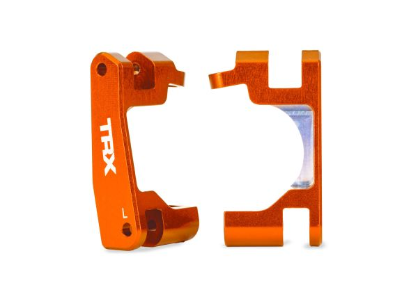&nbsp;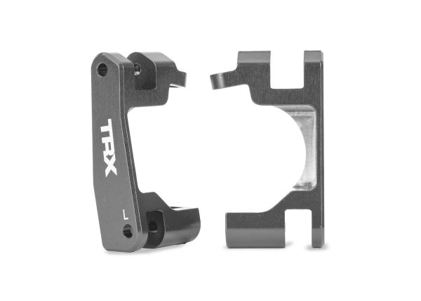&nbsp;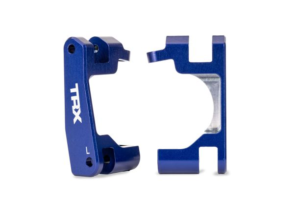&nbsp;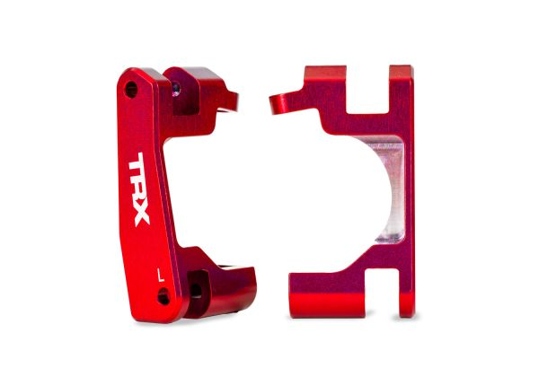&nbsp;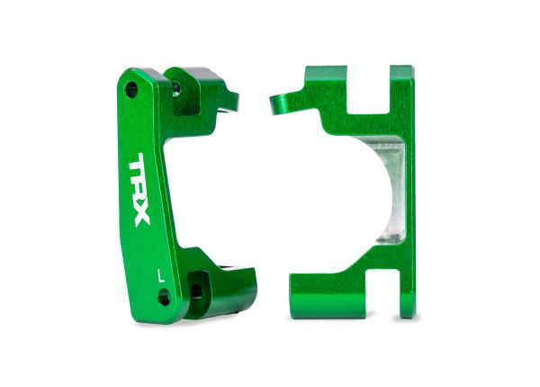 <em>orange (in hand) · gray · blue · red · green</em> |
| 🟢 **Front steering blocks, Traxxas 9064 aluminum (L&R)** — *same part in 5 colors, orange spare from the Raptor R set* | **Type:** Front steering blocks (knuckles), left + right, genuine Traxxas EHD alloy  **Material:** Aluminum, anodized, TRX branded  **Bearing sizes:** EHD (5117A 6×12×4 + 5120A 12×18×4)  **Hex:** N/A  **Fits:** EHD geometry, the same steering block that comes in the Raptor R set  **Pivot/Hardware:** screws included (6 pictured)  **Brand:** Traxxas (genuine)  **Colors:** Orange **9064-ORNG**, Gray **9064-GRAY**, Green **9064-GRN**, Red **9064-RED** (all available) · Blue **9064-BLUE** (out of stock)  **Toe:** N/A  **Warranty:** N/A  **Includes:** L + R steering blocks + screws  **Weight:** N/A  **Price:** **$39.95 / pair**, any color (Traxxas direct) | **🟢 In hand (orange 9064-ORNG, spare; the GPM XO-1 blocks run up front)** | Pro: **One part number, five colors.** A bent steering block or a color change is a $39.95 pair, no full set needed  Con: Bought separately, the three parts run **$124.85** against **$68.73** for the whole Raptor R set. Blue is out of stock | 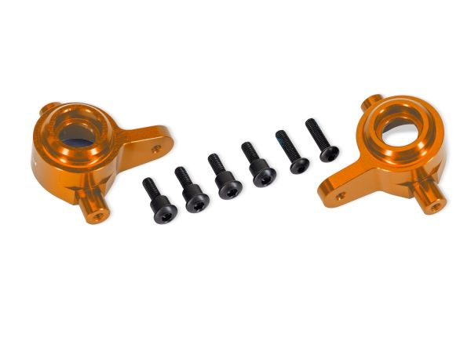&nbsp;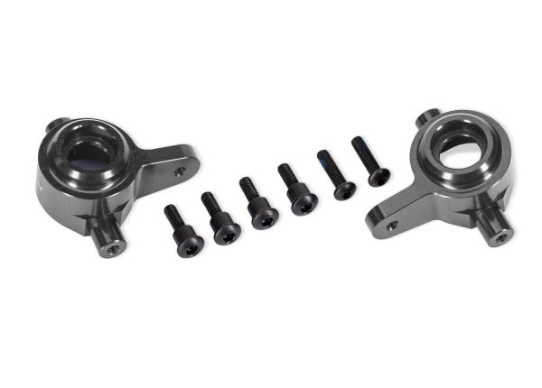&nbsp;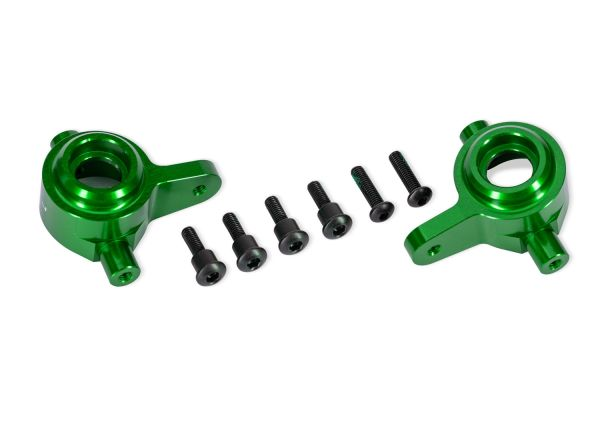&nbsp;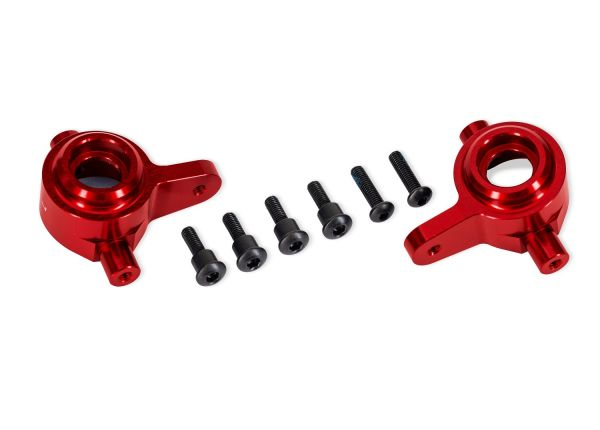&nbsp;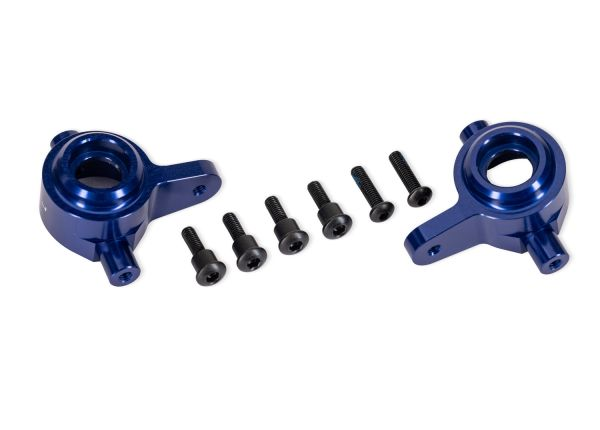 <em>orange (in hand) · gray · green · red · blue</em> |
| ⭐ **Rear stub axle carriers, Traxxas 9065 aluminum (L&R)** — *same part in 5 colors, orange running from the Raptor R set* | **Type:** Rear stub axle carriers (left + right), genuine Traxxas EHD alloy  **Material:** Aluminum, anodized, TRX branded  **Bearing sizes:** EHD (5117A 6×12×4 + 5120A 12×18×4)  **Hex:** N/A  **Fits:** EHD geometry, the same rear carrier that comes in the Raptor R set  **Pivot/Hardware:** 2 screws included  **Brand:** Traxxas (genuine)  **Colors:** Orange **9065-ORNG**, Gray **9065-GRAY**, Blue **9065-BLUE**, Red **9065-RED** (all available) · Green **9065-GRN** (out of stock)  **Toe:** N/A  **Warranty:** N/A  **Includes:** L + R carriers + 2 screws  **Weight:** N/A  **Price:** **$44.95 / pair**, any color (Traxxas direct) | **✅ Running (orange 9065-ORNG, from the Raptor R set)** | Pro: **One part number, five colors.** A crashed rear or a color change is a direct $44.95 pair from Traxxas, no second Raptor R set needed. Orange, gray, blue and red are in stock  Con: Bought separately, the three parts run **$124.85** (9063 + 9064 + 9065) against **$68.73** for the whole Raptor R set, and the rear sees little stress. Green is out of stock | 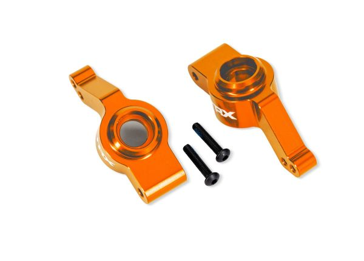&nbsp;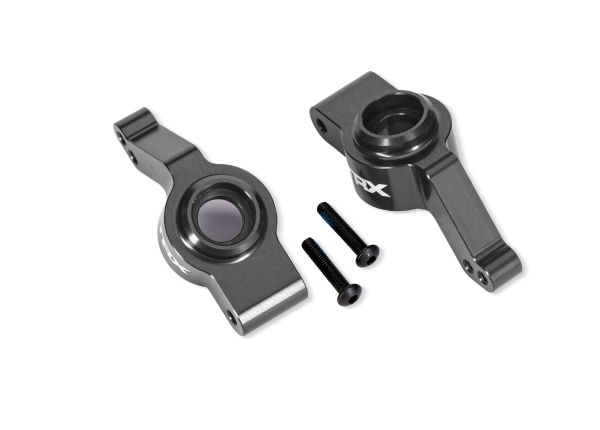&nbsp;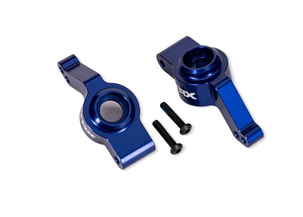&nbsp;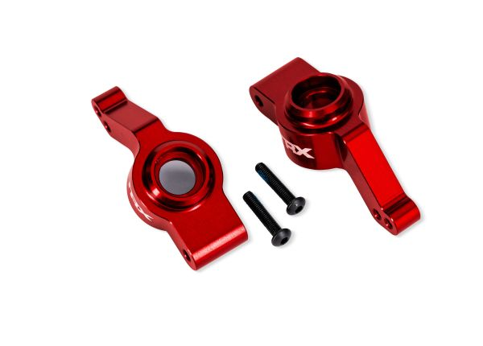&nbsp;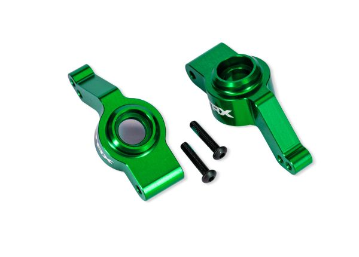 <em>orange (running) · gray · blue · red · green</em> |
| 🚫 ~~**Full set, MonsterKingz / G-Maxx 7075 alloy (front + rear)**~~ | **Type:** Front steering + C-hub & rear axle carriers (full 4-pc set), EHD style  **Material:** 7075 aluminum  **Bearing sizes:** EHD bearings (12×18×4 inner / 6×12×4 outer)  **Hex:** N/A  **Fits:** EHD, chopped E-Revo CVD axles (12 mm ID inner); Tekno M6 conversion needs a 10 mm ID inner  **Pivot/Hardware:** N/A  **Brand:** G-Maxx (eBay seller MonsterKingz)  **Colors:** black / red / green / blue / silver / purple  **Toe:** N/A  **Warranty:** N/A  **Includes:** Bearings + brass bushings  **Weight:** Heavy (too much metal, see con)  **Price:** $46.80 (was $52, 10% off), full 4-pc set | **Sold to Mike ($50, 2026-09-07)** | Pro: Alloy, cheapest full set ($46.80), shipped with brass bushings. **Biggest bearings (12×18×4)** so they last and fail least. Fit the E-Revo CVD axles  Con: **Too fat and heavy, way too much metal** vs the genuine slim Raptor R design, which is why it was demoted then sold off rather than kept as a spare. **The rear inner bearing pocket is so large it locks you into the original / Traxxas E-Revo axles**, no axle flexibility |  |
| 🔵 **Front C-hub + steering block, Lighthouse alloy (front only)** | **Type:** Front C-hub + steering block only, EHD-style  **Material:** Aluminum, gray  **Bearing sizes:** EHD (6×12×4 + 12×18×4)  **Hex:** N/A  **Fits:** Listed "for Traxxas Jato 1/8 4x4 BL-2S"; C-hub + steering block match current-production Jato 4x4 geometry  **Pivot/Hardware:** N/A  **Brand:** Lighthouse  **Colors:** Gray  **Toe:** N/A  **Warranty:** N/A  **Includes:** EHD bearings + brass bushings  **Weight:** N/A  **Price:** ~$25 (front set, no rears) | Candidate (front-only alt) | Pro: **Front-only EHD alloy, buys exactly the front** with nothing wasted on rears. ~$25, owned, confirmed Jato 4x4 BL-2S fit, comes with brass bushings. **Cheapest option if you only want to buy fronts**  Con: Front only, vs the chosen MonsterKingz which is a matched front + rear set |   <em>steering block · C-hub (with brass bushings)</em> |
| 🔵 **Rear carrier, Lighthouse alloy (rear only)** | **Type:** Rear axle carrier only, EHD-style  **Material:** Aluminum, gray  **Bearing sizes:** EHD (6×12×4 + 12×18×4)  **Hex:** N/A  **Fits:** "for Traxxas Jato 1/8 4x4 BL-2S"  **Pivot/Hardware:** N/A  **Brand:** Lighthouse  **Colors:** Gray  **Toe:** N/A  **Warranty:** N/A  **Includes:** EHD bearings + hinge pins  **Weight:** N/A  **Price:** ~$25 (rear set) | Candidate (not needed) | Pro: Matches the front Lighthouse finish if you want an all-alloy look  Con: **Rear sees almost no stress, alloy here is wasted weight + $25.** Plastic rear is the pick |  |
| 🔵 **Rear hub carrier, Tekno M6 nylon (TKR1952T15 / T05)** | **Type:** Rear hub carrier, camber-link holes for fine tuning  **Material:** Molded nylon composite, strong + light  **Bearing sizes:** Inner 10×15×4 + outer 6×12×4 (bigger for load handling)  **Hex:** N/A  **Fits:** Tekno M6 axles (XO-1-style, 10 mm ID inner), **not** the chopped E-Revo axles (those need a 12 mm ID inner = EHD hubs)  **Pivot/Hardware:** N/A  **Brand:** Tekno  **Colors:** N/A  **Toe:** TKR1952T15 = 1.5° (chosen, *very stable on loamy dirt*) · TKR1952T05 = 0.5° (option, less toe)  **Warranty:** N/A  **Includes:** N/A  **Weight:** N/A  **Price:** $8.99 (either toe) | Candidate (strong) | Pro: **Light plastic rear with built-in 1.5° toe, very stable on loamy dirt.** Camber-link tuning holes, bigger bearings, $8.99. No shaving needed (already slim)  Con: Needs the **Tekno M6 / XO-1-style axle setup**, not the chopped E-Revo axles; not a stock drop-in. ⚠️ **Assumes matching Tekno M6 / XO-1-style stubs front and rear, NOT the SCT410 stubs (TKR5570-17) this build runs at the rear.** **Plastic, I've broken Tekno rear hubs before**, which is why the metal MonsterKingz rear won out | &nbsp;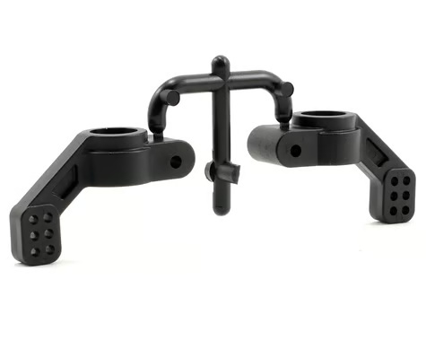 <em>TKR1952T15 (1.5° toe) · TKR1952T05 (0.5° toe)</em> |
| 🔵 **Stock EHD plastic, front + rear (TRA9032 / TRA9037 / TRA9050)** | **Type:** Front C-hub + steering block & rear carrier (strongest of the original plastic types)  **Material:** Glass-filled nylon (EHD)  **Bearing sizes:** EHD (6×12×4 / 12×18×4)  **Hex:** N/A  **Fits:** EHD / E-Revo CVD axles  **Pivot/Hardware:** N/A  **Brand:** Traxxas (front TRA9032 C-hub + TRA9037 steering block; rear TRA9050 carrier)  **Colors:** N/A  **Toe:** N/A  **Warranty:** N/A  **Includes:** N/A  **Weight:** N/A  **Price:** N/A | Candidate | Pro: Cheapest, lightest, sacrificial, OEM-correct fit. **Fine at the low-stress rear**  Con: **Strongest OEM plastic, but the front still breaks too often**, which is why the front goes alloy. Rear has no camber-link tuning holes / built-in toe like the Tekno M6 |  |
| 🔵 **Front steering block, Tekno TKR6837 (nylon, M6)** | **Type:** Front steering blocks only (L/R pair), pair with a C-hub; XO-1 geometry  **Material:** Nylon, black, same as the XO-1 front (part 6439), just nylon  **Bearing sizes:** 10×15×4 inner + 6×12×4 outer (XO-1 sizes, *not* the EHD 6×12×4/12×18×4)  **Hex:** N/A  **Fits:** M6 (6mm) driveshafts, matches the E-Revo 6mm CVDs  **Pivot/Hardware:** N/A  **Brand:** Tekno  **Colors:** Black  **Toe:** N/A  **Warranty:** N/A  **Includes:** Screws + washers  **Weight:** N/A  **Price:** $8.79 | Candidate (plastic ideal) | Pro: **Ideally what I'd run, very strong for plastic, cheap, sacrificial.** XO-1 geometry, M6-compatible, stronger than stock plastic  Con: **Still plastic in a high-stress front, you'll break a few.** Steering block only (no C-hub). **I'd rather run the GPM alloy XO-1 knuckle** (same geometry, metal) |  |
| 🔵 **Full set, Traxxas OEM aluminum (pre-EHD, blue)** | **Type:** Front steering block + C-hub & rear carrier (full set), pre-EHD / 1st-gen Slash 4x4  **Material:** Aluminum, blue anodized, genuine Traxxas  **Bearing sizes:** TRA5116 (5×11×4) + TRA5119 (10×15×4), *different from EHD*  **Hex:** N/A  **Fits:** Slash 4x4 / Rustler 4x4 / Rally 4x4 / Stampede 4x4 / Telluride 4x4  **Pivot/Hardware:** N/A  **Brand:** Traxxas (TRA6837X steering block · TRA6832X C-hub · TRA1952X rear carrier)  **Colors:** Blue anodized  **Toe:** N/A  **Warranty:** N/A  **Includes:** N/A  **Weight:** Lightest alloy of the bunch (smaller pre-EHD geometry)  **Price:** N/A | Candidate | Pro: **Genuine Traxxas aluminum**, OEM fit + finish, full front + rear set, already owned. **Lightest alloy of the bunch** (smaller pre-EHD geometry)  Con: **Pre-EHD geometry.** Uses the older 5×11×4 / 10×15×4 bearings, not the EHD 6×12×4 / 12×18×4. Wrong generation for this EHD build. No real reason to run pre-EHD anymore: the bearings are too small, unless you plan on running the Traxxas or knock-off CVDs |  |
---

## Price History

| Date | Price | Discount Path | Notes |
|---|---|---|---|
| 2026-07-29 | **$68.73** ✅ **purchased** | eBay, toysion | Order 03-14973-67577. Traxxas Raptor R Ultimate alloy hubs (front + rear full set), item $61.74 + tax. Arrives Jul 31–Aug 4, 2026. |

---

## Bearings & Hardware

### Carrier generations & their bearings

Three generations, each with its own bearing setup. *(Size → part #: 5×11×4 = TRA5116 · 6×12×4 = TRA5117 · 10×15×4 = TRA5119 · 12×18×4 = TRA5120A.)*

| Generation | Carrier parts | Front (in / out) | Rear (in / out) | Notes |
|---|---|---|---|---|
| ⭐ **EHD** | plastic TRA9032/9037/9050 · **Raptor R alloy 9063/9064/9065** | 12×18×4 / 6×12×4 | 12×18×4 / 6×12×4 | **the build's gen** (Raptor R alloy / MonsterKingz / Lighthouse). Use with E-Revo CVD axles. Bearings: 5117A + 5120A |
| **XO-1** | front **6439** · rear **6455** | 10×15×4 / 6×12×4 | 6×12×4 / 6×12×4 | front geometry the Tekno TKR6837 / GPM alloy copy |
| **Pre-EHD (OG)** | TRA6832X / TRA6837X / TRA1952X | 5×11×4 / 10×15×4 | 5×11×4 / 5×11×4 | wrong gen for this build |
| **Tekno M6 rear** *(special)* | TKR1952T15 / T05 | — | 10×15×4 / 6×12×4 | bigger bearings; **Tekno M6 axles only** |

### The four bearing sizes

    <em>TRA5116 5×11×4 · TRA5117 6×12×4 · TRA5119 10×15×4 · TRA5120A 12×18×4</em>

### Axle ↔ hub compatibility

The inner bearing's ID has to match the axle, which is why the two axle systems **don't cross over**:

- **E-Revo CVD axle** → needs a **12 mm ID inner** → works with **EHD hubs** (the 12×18×4 = 12 mm ID), **not** the XO-1-style hubs (10 mm ID inner).
- **Tekno M6 axle** → needs a **10 mm ID inner** → works with **XO-1-style hubs** (Tekno M6 / GPM XO-1), **not** the EHD hubs.
- **Bridging them** would need a **12×15×4** bearing (12 mm ID axle, 15 mm OD XO-1 pocket), a **non-standard size, basically unobtainium** (only Boca Bearing, ~$60 each). So **pick a lane**.

### Flanged bearings / track-width shim

- The two EHD bearings have standard flanged versions: **12×18×4 → F6701**, **6×12×4 → MF126** (both in ZZ shielded / 2RS sealed; SMF126 = stainless 6×12×4).
- **Front inner = F6701-2RS (flanged 12×18×4), maybe.** The flange acts as a built-in spacer that **pulls the axle inboard a few mm to narrow the front track**, which currently runs a touch too wide. Bought, **may or may not run it**, pending a fit/track-width check.
- **Source (6×12×4 flanged):** **SMF126-2RS** stainless, **rubber-sealed**, AliExpress *DGYCB Bearing Official Store*, ~**$6.81/5pcs** (~$6.41 ea at 10+). Rubber 2RS seals keep grit/water out, good for the dirt/beach running.

### Pivot hardware — screw vs brass bushing

| Option | Notes |
|---|---|
| **Stock shoulder screw, TRA3642X** (3×12 mm, 6-pack, $3.00) | Holds the steering blocks onto the C-hubs. Works, but over time it **wears into the actual C-hub, permanent damage to the part itself** (vs the brass bushing, which sacrifices itself and protects the C-hub)   |
| ⭐ **Brass bushing + standard M3 screw** | **The better way, the MonsterKingz and GPM kits already include brass bushings.** Makes the pivot last basically forever and stay tighter. **The brass is softer than the aluminum, so it deforms first, the cheap bushing sacrifices itself and protects the alloy C-hub.** It also runs **smooth and self-lubricated** (sintered bronze stores oil in its pores), keeping the pivot slop-free and effectively burnishing it smooth. *(Verified general principle: a bronze/oilite bushing is a softer, self-lubricating **sacrificial** bearing surface that wears before, and protects, the harder mating part.)* When it wears loose you **don't replace the knuckle, just drop in a fresh bushing** (~$3 for 100 = set for life). *Bushing size TBD, measure it.*   <em>flanged brass (sintered/oilite) bushings, example sizes</em> |

> ⚠️ Match bearings to the exact carrier, the inner and outer differ on most of these, the three generations aren't interchangeable, and the Tekno M6 rear needs its own 10×15×4 inner.

---

## 17mm Wheel Hubs (hexes)

> **The 17mm hub (hex) is what the wheel actually mounts to, on the Tekno M6 stub.** This build runs 17mm wheels on the [Tekno M6 stubs](driveshaft_analysis.md#tekno-stubs-front--rear), so it needs a 17mm hex, but the M6 stub is a smaller/different profile than what these hexes are cut for, so the hex gets **lightly filed to seat**.
>
> - **Front: Tekno OEM 17mm hex** (pin-through, from the **TKR1654-17** kit). The cross-pin passes *through* the hex, so the hold is more secure and it's **more forgiving if you shave it thin** to fit the M6 stub. It's **non-star**, so it takes standard 17mm rims but not Traxxas star rims.
> - **Rear: the TKR5570-17 SCT410 kit** brings its own stub + 17mm hexes; its **star-drive hex takes both standard 17mm and Traxxas star rims**. Like the front, the rear hex still needs **light filing** to seat on the M6 stub.
> - **Traxxas TRA6469** (17mm splined aluminum, 5.9g) is on **Mike's car**, not this build. It works as a 17mm hex, but it's a solid screw-pin type, so filing it thin to fit the M6 stub is riskier.
> - **Star vs non-star:** the rear **TKR5570-17 star hex fits both standard 17mm and Traxxas star rims**; the front non-star hex is standard-17mm-only. This build runs standard 17mm wheels (IMEX chrome rims now), so both ends are fine.

&nbsp; <em>Chosen: front = Tekno OEM 17mm hex (TKR1654-17 kit) · rear = TKR5570-17 SCT410 kit (stub + star hexes)</em>

### 17mm hub requirements

| Requirement | Type | Why |
|---|---|---|
| **17mm hex** | Must | The wheels this build runs are 17mm, the hex has to be 17mm |
| **Seats on the Tekno M6 stub** | Must | The M6 stub is a smaller/different profile, so the hex must fit it, in practice this means **light filing** of the hex bore/chamfer |
| **Forgiving when shaved thin** | May | Since the hex gets filed to fit, a **pin-through** design tolerates thin shaving better than a solid screw-pin hex |
| **Matches the wheel's inner pattern** | May | Standard 17mm wheels drop on any 17mm hex; **stock Traxxas star-pattern rims need the special star hex** or the rim cut out |

### 17mm hub comparison

> *Spec format: Type · Part · Material · Stub fit · Wheel pattern · Retention · Weight · Price*

| Hex | Spec | Pros / Cons | Photo / Link |
|---|---|---|---|
| ⭐ **Tekno OEM 17mm hex** (pin-through), *chosen, front* | **Type:** 17mm hex, pin-through **Part:** included in **TKR1654-17** (front M6 adapter kit) **Material:** Aluminum **Stub fit:** Tekno M6 stub, **light filing (~0.2–0.5mm)** to seat **Wheel pattern:** Standard 17mm (non-star; won't take Traxxas star rims) **Retention:** **Cross-pin passes through the hex** (pin-through) **Weight:** N/A (not yet weighed) **Price:** Included in TKR1654-17 (**$23.15/pr**) | Pro: **The pin-through design is the reason it's the pick**, the cross-pin runs through the hex for a more secure hold, and it's **more forgiving if shaved thin** to clear the M6 stub. Already in hand with the front adapter kit, so **no extra buy** for the front (the rear uses the TKR5570-17 kit)  Con: Not yet photographed/weighed. Still needs the light filing like any 17mm hex on an M6 stub (or run the **XO-1 front carrier** to skip the front filing) |  |
| ⭐ **Tekno SCT410 rear kit (TKR5570-17)** — *chosen for the rear; star hex fits standard + Traxxas rims* | **Type:** SCT410 rear kit: 2 stubs + 2 **17mm hexes** + nuts + cross-pins **Part:** **TKR5570-17** (UPC 815076013560) **Material:** Aluminum **Stub fit:** its own stub (the 5580); front + rear on the SCT410, the **rear** on this Jato build **Wheel pattern:** **Star-drive 17mm — fits BOTH standard 17mm rims (IMEX, RedSpider etc.) AND Traxxas star-pattern rims** **Retention:** 17mm nut + cross-pin (both in the kit) **Weight:** N/A **Price:** **$25.95** (PowerHobby; free shipping if bought direct) | Pro: **One kit is the whole rear: stub + 17mm hexes + nuts + pins**, and the star hexes take **standard 17mm rims and Traxxas star rims**. More versatile than the front non-star hex (which can't take Traxxas rims)  Con: Still needs **light filing** to seat on the M6 stub, like the front. Pricier than a bare stub, but it bundles the stub, hexes, and hardware |  |
| 🔵 **Traxxas TRA6469** — *in hand, alternative* | **Type:** 17mm splined hex **Part:** TRA6469 **Material:** 6061-T6 aluminum, blue-anodized **Stub fit:** Cut for 6mm axles, **file to the chamfer/bevel edge** to seat on the M6 stub **Wheel pattern:** Standard 17mm **Retention:** Screw pin 4×13mm w/ threadlock **Weight:** **5.9g each** measured **Price:** N/A | Pro: **In hand, genuine Traxxas alloy, weighed at 5.9g.** Standard 17mm, seats after filing to the chamfer/bevel. A fallback front hex (the rear uses the TKR5570-17 kit)  Con: **Solid screw-pin, not pin-through**, filing it thin is riskier than the Tekno hex, so it's the fallback, not the pick |  |

### 17mm hub notes

- **Why the hex gets filed:** the 17mm hexes are cut for a 6mm axle / their own stub, and the **Tekno M6 stub is a smaller/different profile**, so the hex bore/chamfer needs a light shave (~0.2–0.5mm) to seat. See the [Tekno stubs section](driveshaft_analysis.md#tekno-stubs-front--rear) for the stubs these mount to.
- **Skip the front filing with the XO-1 front carrier:** running the **XO-1 front carrier** up front lets the front hex seat **without shaving**, an alternative to filing the front hex. See the [carrier comparison](#comparison) above.
- **Pin-through beats screw-pin when shaving thin.** The Tekno OEM hex's cross-pin runs *through* the hex, so even shaved thin it holds securely, the reason it's the front pick over the solid TRA6469, which relies on a screw pin and has less meat to give up.
- **Star vs non-star hex.** Stock Traxxas wheels have a **star-shaped inner pattern**. The **star-drive TKR5570-17 (rear) takes both standard 17mm and Traxxas star rims**; the **non-star front TKR1654-17 takes standard 17mm rims only**. This build runs standard 17mm wheels (IMEX chrome rims now), so it's a non-issue either way.
- **Both ends need light filing.** The front (TKR1654-17 hex) and the rear (TKR5570-17 kit hexes) are different parts, but each seats on the M6 stub with the same light shave.

---

## Notes

- **Why metal front, any rear:** the front eats the impacts and even the strongest EHD plastic cracks too often, so it must be alloy. The rear barely sees load, so material doesn't matter back there.
- **Crash hierarchy still holds.** The [FLM extended arms](arm_analysis.md) are the intended fuse; they bend first. Alloy fronts just stop the C-hub / steering block from breaking before the arm does.
- **Plastic ideal vs alloy reality.** The Tekno TKR6837 nylon block ($8.79) is *ideally* what you'd run (strong for plastic, cheap, sacrificial), but the front still breaks a few, so alloy is the durable answer. Keep a couple Tekno blocks as cheap spares.
- **Front pick follows the axle system.** E-Revo CVD axles (EHD) take the **MonsterKingz EHD alloy** front. Tekno M6 axles (XO-1) take the **GPM aluminum XO-1** front. Each path has its own bearings, don't mix (see [Axle ↔ hub compatibility](#axle--hub-compatibility)).
- **Confirmed axle plan: Raptor R hubs front + rear, running Tekno M6 stubs.** Front Raptor R runs the **Tekno M6 17mm stubs**, rear Raptor R runs the **Tekno 5580 (SCT410) stub**, both on the same **10×15×4 ×4 in an 18→15mm sleeve**, **front + rear fit confirmed and running**. Keeps the genuine slim Raptor R hubs and swaps in the strong Tekno stubs. Locked in now that the real Raptor R Ultimate set is purchased (2026-07-29).
- **Raptor R hubs + Tekno M6 stubs: 10×15×4 bearing ×4 in a sleeve, confirmed and running.** Genuine Raptor R hubs run the **same EHD bearing pocket** as the rest of the EHD family, so this swap carries straight over. The EHD (Raptor R) outer bearing pocket is **bigger (18mm OD)** than the XO-1's, and the stock EHD inner is **12mm ID** (for the E-Revo axle). To fit the Tekno M6 stub, drop the inner to **10mm ID** while keeping the 18mm OD → a **10×18×5** bearing, at **all four corners (front and rear), so four total**, replacing the EHD hubs' 12×18×4. **The 5mm thickness is deliberate (not the stock 4mm): a 10×18×4 isn't a standard/cheap bearing, but 10×18×5 is a common off-the-shelf size.** The Tekno stubs fit with minor filing (**0.2 to 0.5 mm**) of the 17mm hex. **Fitted and working.** See [`bearings_reference.md`](bearings_reference.md).
- **The alternative, which this car did not take:** drop a bare **10×18×5** straight in, which is what [Mike's Jato](../Jato4x4_Mike/README.md) runs, at the cost of **shaving down the 17mm hex adapters** to make it fit, the adapters rather than the hub carriers. The sleeve route avoids that, and **10×15×4 is the easier bearing to source anyway**. Original note on sleeving the kit's existing **10×15×4** bearings up to the 18mm hub pocket with a turned **brass bushing (15 ID → 18 OD)**, press-fit with green Loctite. The 10mm ID already fits the Tekno stub and the kit has 4, so it reuses on-hand parts at the cost of a little press/machining work. Detail in [`bearings_reference.md`](bearings_reference.md).
- **Buying:** full front + rear, the **Raptor R Ultimate alloy set** ($68.73, genuine Traxxas, slim, purchased 2026-07-29 via eBay, toysion) over the in-hand **MonsterKingz** ($46.80, too fat/heavy). Fronts only, get the **Lighthouse front** (~$25, owned). The Traxxas OEM blue set is genuine but pre-EHD, wrong generation here.
- **Raptor R = genuine slim EHD alloy.** The Ford Raptor R Ultimate uses the original extreme-heavy-duty aluminum hubs: front C-hub 9063, steering block 9064, rear carrier 9065, on the same 5117A / 5120A EHD bearings. It's the factory version of what MonsterKingz clones fat, so it fits the E-Revo CVD axles with no changes and weighs less.
- **All EHD rears can be shaved (alloy or plastic).** They're over-built with everything captured (bearings + axle supported both sides), so a few minutes with a Dremel drops real weight on any of them.
- **Stock EHD reference (Jenny's RC, gray):** TRA9037 steering block, TRA9032 C-hub, TRA9050 rear carrier, TRA3642X screws, TRA5117 + TRA5120A bearings. Direct fit Jato / Slash / Rustler / Stampede 4x4 BL-2s.
- **TODO:** confirm which front EHD part breaks first (the one to swap to alloy first).
- **TODO:** test the **10×15×5** inner bearing bought for the MonsterKingz M6 conversion (not yet tried), moot unless MonsterKingz comes off the shelf as a fallback.
- **TODO:** confirm the Raptor R rear stub axle. Bearings confirmed correct; testing whether the **Tekno 5580** (or 5070) seats the 17mm hex in the Raptor R rear. Measure and pick one (see [Tekno stubs in `driveshaft_analysis.md`](driveshaft_analysis.md#tekno-stubs-front--rear)).
