# Steering Blocks, C-Hubs & Hub Carriers — FastAzJato4x4

> **Chosen / Purchased: Traxxas Raptor R Ultimate alloy hubs (genuine EHD aluminum, full front + rear), $68.73.**
>
> Turns out the **Ford Raptor R Ultimate** carriers are the *original* extreme-heavy-duty aluminum front and rear hubs, and they use the slim factory Traxxas design, not the fat aftermarket look. Same EHD bearings (5117A + 5120A), so they drop straight onto the E-Revo CVD axles.
>
> - **Genuine Traxxas, slim:** the design MonsterKingz clones, but far less excess metal. Much lighter.
> - **Full set:** front caster blocks (9063), steering blocks (9064), rear stub axle carriers (9065), plus bearings + shoulder screws.
> - **Same fitment:** EHD geometry, 12 mm ID inner (12×18×4) for the E-Revo CVD axles. No bearing surgery.
>
> **In hand but demoted: MonsterKingz / G-Maxx alloy ($46.80).** Received it and it's **too fat and heavy, way too much metal**. It works and fits, but the Raptor R is the genuine slim version, so MonsterKingz drops to a fallback (or a Dremel-it-down project).
>
> Build runs **EHD geometry** (confirmed). The pre-EHD OEM blue alloy is a different generation, see [Notes](#notes).

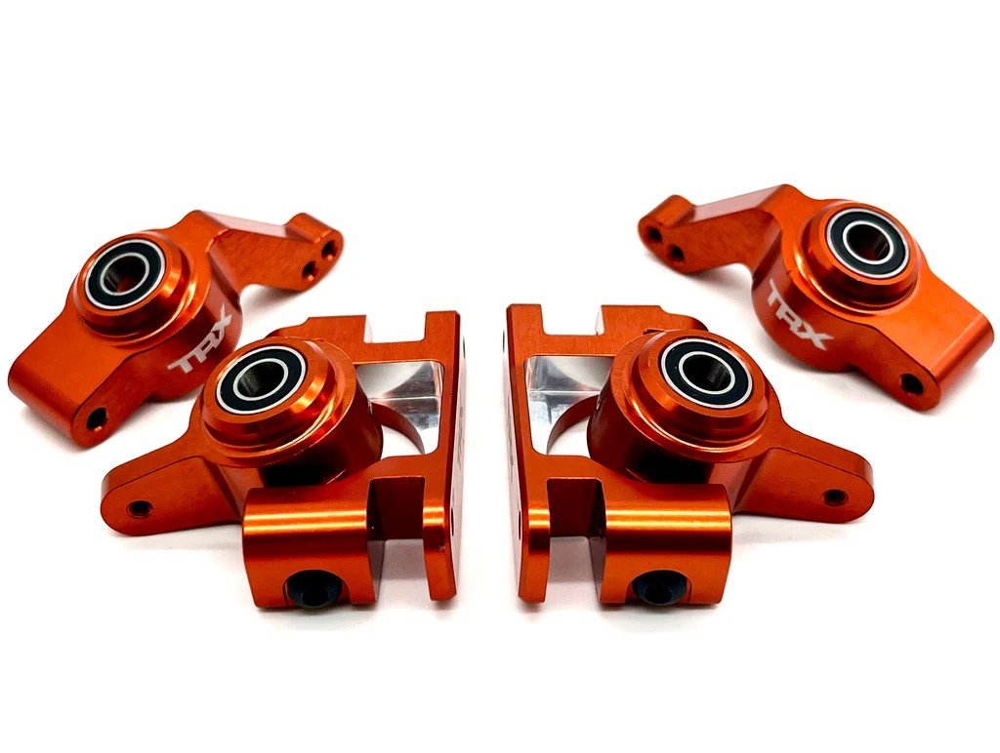 <em>Leaning: Traxxas Raptor R Ultimate orange alloy hubs. Genuine EHD aluminum, slim factory profile, front + rear.</em>

---

## Table of Contents

- [Key Requirements](#key-requirements)
- [Comparison](#comparison)
- [Price History](#price-history)
- [Bearings & Hardware](#bearings--hardware)
- [Notes](#notes)

---

## Key Requirements

| Requirement | Type | Why |
|---|---|---|
| **Metal front (C-hub + steering block)** | Must | The front takes the hits — even the strongest OEM plastic breaks too often, so the front **must be alloy** |
| **Standard, available bearings** | Must | Must run **off-the-shelf standard bearings** — the **10×15×5**, or whatever the stock EHD bearing is (6×12×4 / 12×18×4). **No unobtainium sizes** (e.g. the 12×15×4 that only Boca makes at ~$60/ea) |
| **Rear: metal or plastic** | May | Rear sees almost no load — either material works back there |
| **Doesn't have to be EHD** | May | Any generation is fine **as long as the front is metal** — EHD isn't required |
| **Fits the (E-)Revo axles without modification** | May | Nice if it drops onto the chopped E-Revo CVD axles with no bearing surgery |
| **Cheap / affordable** | May | Wear/crash item — cheaper is better, all else equal |

---

## Comparison

> *Spec format: Type · Material · Bearing sizes · Hex · Fits · Pivot/Hardware · Brand · Colors · Toe · Warranty · Includes · Weight · Price*

| Part | Spec | Status | Pros / Cons | Photo / Link |
|---|---|---|---|---|
| ⭐ **Full set — Traxxas Raptor R Ultimate alloy (front + rear)** | **Type:** Front caster blocks (C-hubs) + steering blocks & rear stub axle carriers, genuine Traxxas EHD alloy, full set  **Material:** Aluminum, orange anodized, TRX branded  **Bearing sizes:** EHD (5117A 6×12×4 + 5120A 12×18×4)  **Hex:** N/A  **Fits:** EHD geometry, chopped E-Revo CVD axles (12 mm ID inner). From the Raptor R Ultimate (Traxxas 101177-4)  **Pivot/Hardware:** 3642X shoulder screws (3×12 hex)  **Brand:** Traxxas (genuine)  **Colors:** Orange (9063-ORNG / 9064-ORNG / 9065-ORNG)  **Toe:** N/A  **Warranty:** N/A (used take-off part)  **Includes:** Front C-hubs 9063 + steering blocks 9064 + rear carriers 9065 + bearings + screws  **Weight:** Lighter than MonsterKingz (slim factory profile; exact TBD)  **Price:** $68.73 (eBay — toysion, purchased 2026-07-29) | **✅ Purchased (front + rear)** | Pro: **Genuine Traxxas EHD aluminum, the *original* design MonsterKingz clones** but with the slim factory profile, so **much lighter and way less excess metal**. Same EHD bearings (5117A / 5120A), so it **drops onto the E-Revo CVD axles with zero changes**. Complete set: front + rear + bearings + screws  **More axle flexibility than MonsterKingz:** the rear can run a different inner bearing, so you're not locked into the original / E-Revo axles the way the MonsterKingz oversized rear pocket forces.  Con: Pricier than MonsterKingz (~$69 vs $46.80). Take-off part, no manufacturer warranty. Uses shoulder screws, not brass bushings (can add bushings later) |  |
| 🟢 **Full set — MonsterKingz / G-Maxx 7075 alloy (front + rear)** | **Type:** Front steering + C-hub & rear axle carriers (full 4-pc set), EHD style  **Material:** 7075 aluminum  **Bearing sizes:** EHD bearings (12×18×4 inner / 6×12×4 outer)  **Hex:** N/A  **Fits:** EHD — chopped E-Revo CVD axles (12 mm ID inner); Tekno M6 conversion needs a 10 mm ID inner  **Pivot/Hardware:** N/A  **Brand:** G-Maxx (eBay seller MonsterKingz)  **Colors:** black / red / green / blue / silver / purple  **Toe:** N/A  **Warranty:** N/A  **Includes:** Bearings + brass bushings  **Weight:** Heavy (too much metal, see con)  **Price:** $46.80 (was $52, 10% off) — full 4-pc set | **In hand — too heavy** | Pro: Alloy, in hand, cheapest full set ($46.80), ships with brass bushings. **Biggest bearings (12×18×4)** so they last and fail least. Fits the E-Revo CVD axles  Con: **In hand and it's too fat and heavy, way too much metal** vs the genuine slim Raptor R design. Usable, but would need real Dremel work to slim down, which is why the Raptor R (original slim EHD alloy) is now preferred. **The rear inner bearing pocket is so large it locks you into the original / Traxxas E-Revo axles**, no axle flexibility. M6 conversion also hard: needs a 10 mm ID inner (10×15×5 bought, not yet tested) |  |
| 🔵 **Front C-hub + steering block — Lighthouse alloy (front only)** | **Type:** Front C-hub + steering block only, EHD-style  **Material:** Aluminum, gray  **Bearing sizes:** EHD (6×12×4 + 12×18×4)  **Hex:** N/A  **Fits:** Listed "for Traxxas Jato 1/8 4x4 BL-2S"; C-hub + steering block match current-production Jato 4x4 geometry  **Pivot/Hardware:** N/A  **Brand:** Lighthouse  **Colors:** Gray  **Toe:** N/A  **Warranty:** N/A  **Includes:** EHD bearings + brass bushings  **Weight:** N/A  **Price:** ~$25 (front set, no rears) | Candidate (front-only alt) | Pro: **Front-only EHD alloy — buys exactly the front** with nothing wasted on rears. ~$25, owned, confirmed Jato 4x4 BL-2S fit, comes with brass bushings. **Cheapest option if you only want to buy fronts**  Con: Front only — vs the chosen MonsterKingz which is a matched front + rear set |  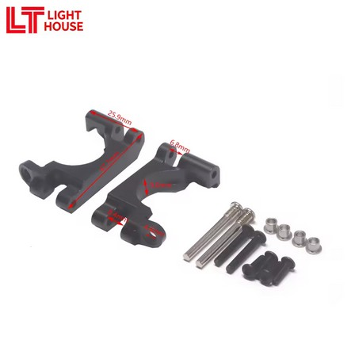 <em>steering block · C-hub (with brass bushings)</em> |
| 🔵 **Rear carrier — Lighthouse alloy (rear only)** | **Type:** Rear axle carrier only, EHD-style  **Material:** Aluminum, gray  **Bearing sizes:** EHD (6×12×4 + 12×18×4)  **Hex:** N/A  **Fits:** "for Traxxas Jato 1/8 4x4 BL-2S"  **Pivot/Hardware:** N/A  **Brand:** Lighthouse  **Colors:** Gray  **Toe:** N/A  **Warranty:** N/A  **Includes:** EHD bearings + hinge pins  **Weight:** N/A  **Price:** ~$25 (rear set) | Candidate (not needed) | Pro: Matches the front Lighthouse finish if you want an all-alloy look  Con: **Rear sees almost no stress — alloy here is wasted weight + $25.** Plastic rear is the pick | 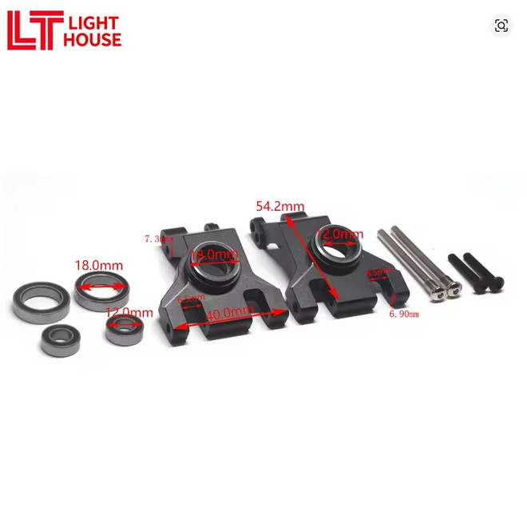 |
| 🔵 **Front steering block — GPM XO-1 alloy knuckle** | **Type:** Front knuckle / steering block only (pair with a C-hub), XO-1 geometry  **Material:** 7075 aluminum — alloy version of the Tekno/XO-1 front  **Bearing sizes:** 10×15×4 inner + 6×12×4 outer (XO-1 front, part 6439)  **Hex:** N/A  **Fits:** XO-1 / Tekno M6 path; 1/7 XO-1 part — confirm full Jato front fit  **Pivot/Hardware:** N/A  **Brand:** GPM  **Colors:** red / blue / orange / dark grey / silver  **Toe:** N/A  **Warranty:** N/A  **Includes:** N/A  **Weight:** N/A  **Price:** $19.16 (was $21.06, 9% off) | ⭐ Ideal for the Tekno M6 path | Pro: Alloy XO-1 knuckle — the metal version of the Tekno/XO-1 front, with color options, ~$19. **If you run the Tekno M6 axle setup, these GPM aluminum XO-1 hubs are the best/ideal front** — alloy (won't shear/break) with the matching XO-1 bearing geometry (10×15×4 + 6×12×4). Beats the Tekno nylon  Con: Steering block only (no C-hub); 1/7 XO-1 part — confirm full fit on the Jato front | 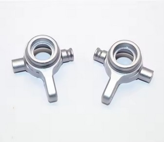 |
| 🔵 **Rear hub carrier — Tekno M6 nylon (TKR1952T15 / T05)** | **Type:** Rear hub carrier, camber-link holes for fine tuning  **Material:** Molded nylon composite — strong + light  **Bearing sizes:** Inner 10×15×4 + outer 6×12×4 (bigger for load handling)  **Hex:** N/A  **Fits:** Tekno M6 axles (XO-1-style, 10 mm ID inner) — **not** the chopped E-Revo axles (those need a 12 mm ID inner = EHD hubs)  **Pivot/Hardware:** N/A  **Brand:** Tekno  **Colors:** N/A  **Toe:** TKR1952T15 = 1.5° (chosen — *very stable on loamy dirt*) · TKR1952T05 = 0.5° (option, less toe)  **Warranty:** N/A  **Includes:** N/A  **Weight:** N/A  **Price:** $8.99 (either toe) | Candidate (strong) | Pro: **Light plastic rear with built-in 1.5° toe — very stable on loamy dirt.** Camber-link tuning holes, bigger bearings, $8.99. No shaving needed (already slim)  Con: Needs the **Tekno M6 / XO-1-style axle setup** — not the chopped E-Revo axles; not a stock drop-in. **Plastic — I've broken Tekno rear hubs before**, which is why the metal MonsterKingz rear won out | 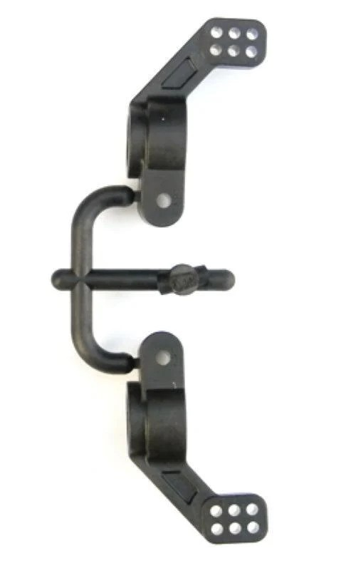 |
| 🔵 **Stock EHD plastic — front + rear (TRA9032 / TRA9037 / TRA9050)** | **Type:** Front C-hub + steering block & rear carrier (strongest of the original plastic types)  **Material:** Glass-filled nylon (EHD)  **Bearing sizes:** EHD (6×12×4 / 12×18×4)  **Hex:** N/A  **Fits:** EHD / E-Revo CVD axles  **Pivot/Hardware:** N/A  **Brand:** Traxxas (front TRA9032 C-hub + TRA9037 steering block; rear TRA9050 carrier)  **Colors:** N/A  **Toe:** N/A  **Warranty:** N/A  **Includes:** N/A  **Weight:** N/A  **Price:** N/A | Candidate | Pro: Cheapest, lightest, sacrificial, OEM-correct fit. **Fine at the low-stress rear**  Con: **Strongest OEM plastic, but the front still breaks too often** — which is why the front goes alloy. Rear has no camber-link tuning holes / built-in toe like the Tekno M6 | 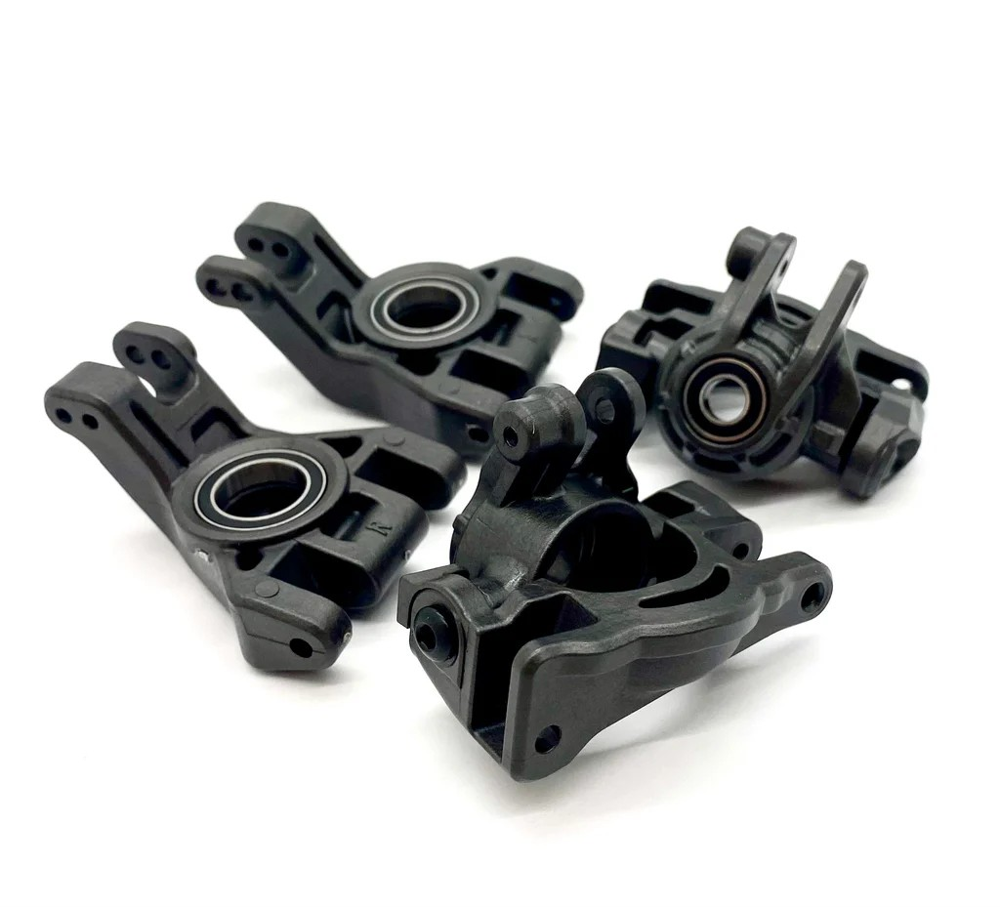 |
| 🔵 **Front steering block — Tekno TKR6837 (nylon, M6)** | **Type:** Front steering blocks only (L/R pair) — pair with a C-hub; XO-1 geometry  **Material:** Nylon, black — same as the XO-1 front (part 6439), just nylon  **Bearing sizes:** 10×15×4 inner + 6×12×4 outer (XO-1 sizes, *not* the EHD 6×12×4/12×18×4)  **Hex:** N/A  **Fits:** M6 (6mm) driveshafts — matches the E-Revo 6mm CVDs  **Pivot/Hardware:** N/A  **Brand:** Tekno  **Colors:** Black  **Toe:** N/A  **Warranty:** N/A  **Includes:** Screws + washers  **Weight:** N/A  **Price:** $8.79 | Candidate (plastic ideal) | Pro: **Ideally what I'd run — very strong for plastic, cheap, sacrificial.** XO-1 geometry, M6-compatible, stronger than stock plastic  Con: **Still plastic in a high-stress front — you'll break a few.** Steering block only (no C-hub). **I'd rather run the GPM alloy XO-1 knuckle** (same geometry, metal) | 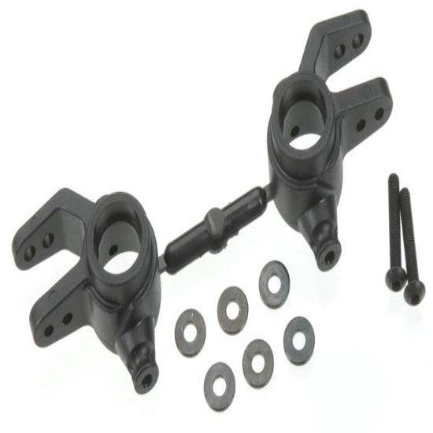 |
| 🔵 **Full set — Traxxas OEM aluminum (pre-EHD, blue)** | **Type:** Front steering block + C-hub & rear carrier (full set), pre-EHD / 1st-gen Slash 4x4  **Material:** Aluminum, blue anodized — genuine Traxxas  **Bearing sizes:** TRA5116 (5×11×4) + TRA5119 (10×15×4) — *different from EHD*  **Hex:** N/A  **Fits:** Slash 4x4 / Rustler 4x4 / Rally 4x4 / Stampede 4x4 / Telluride 4x4  **Pivot/Hardware:** N/A  **Brand:** Traxxas (TRA6837X steering block · TRA6832X C-hub · TRA1952X rear carrier)  **Colors:** Blue anodized  **Toe:** N/A  **Warranty:** N/A  **Includes:** N/A  **Weight:** Lightest alloy of the bunch (smaller pre-EHD geometry)  **Price:** N/A | Candidate | Pro: **Genuine Traxxas aluminum** — OEM fit + finish, full front + rear set, already owned. **Lightest alloy of the bunch** (smaller pre-EHD geometry)  Con: **Pre-EHD geometry.** Uses the older 5×11×4 / 10×15×4 bearings, not the EHD 6×12×4 / 12×18×4. Wrong generation for this EHD build. No real reason to run pre-EHD anymore: the bearings are too small, unless you plan on running the Traxxas or knock-off CVDs | 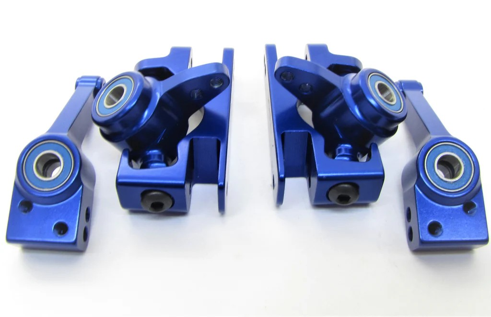 |
---

## Price History

| Date | Price | Discount Path | Notes |
|---|---|---|---|
| 2026-07-29 | **$68.73** ✅ **purchased** | eBay — toysion | Order 03-14973-67577. Traxxas Raptor R Ultimate alloy hubs (front + rear full set), item $61.74 + tax. Arrives Jul 31–Aug 4, 2026. |

---

## Bearings & Hardware

### Carrier generations & their bearings

Three generations, each with its own bearing setup. *(Size → part #: 5×11×4 = TRA5116 · 6×12×4 = TRA5117 · 10×15×4 = TRA5119 · 12×18×4 = TRA5120A.)*

| Generation | Carrier parts | Front (in / out) | Rear (in / out) | Notes |
|---|---|---|---|---|
| ⭐ **EHD** | plastic TRA9032/9037/9050 · **Raptor R alloy 9063/9064/9065** | 12×18×4 / 6×12×4 | 12×18×4 / 6×12×4 | **the build's gen** (Raptor R alloy / MonsterKingz / Lighthouse). Use with E-Revo CVD axles. Bearings: 5117A + 5120A |
| **XO-1** | front **6439** · rear **6455** | 10×15×4 / 6×12×4 | 6×12×4 / 6×12×4 | front geometry the Tekno TKR6837 / GPM alloy copy |
| **Pre-EHD (OG)** | TRA6832X / TRA6837X / TRA1952X | 5×11×4 / 10×15×4 | 5×11×4 / 5×11×4 | wrong gen for this build |
| **Tekno M6 rear** *(special)* | TKR1952T15 / T05 | — | 10×15×4 / 6×12×4 | bigger bearings; **Tekno M6 axles only** |

### The four bearing sizes

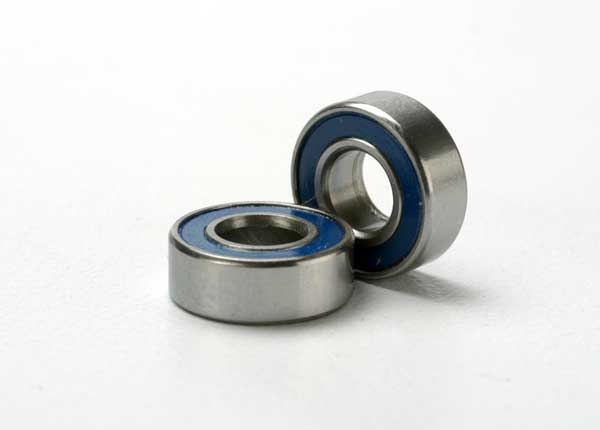 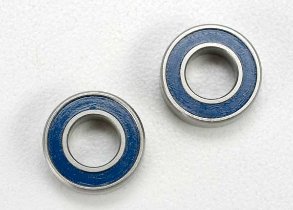 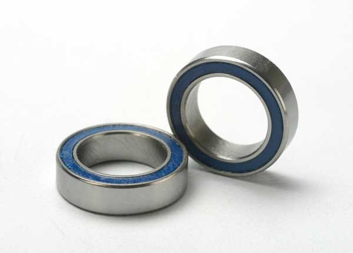 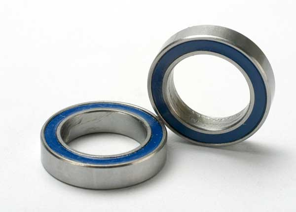 <em>TRA5116 5×11×4 · TRA5117 6×12×4 · TRA5119 10×15×4 · TRA5120A 12×18×4</em>

### Axle ↔ hub compatibility

The inner bearing's ID has to match the axle — which is why the two axle systems **don't cross over**:

- **E-Revo CVD axle** → needs a **12 mm ID inner** → works with **EHD hubs** (the 12×18×4 = 12 mm ID), **not** the XO-1-style hubs (10 mm ID inner).
- **Tekno M6 axle** → needs a **10 mm ID inner** → works with **XO-1-style hubs** (Tekno M6 / GPM XO-1), **not** the EHD hubs.
- **Bridging them** would need a **12×15×4** bearing (12 mm ID axle, 15 mm OD XO-1 pocket) — a **non-standard size, basically unobtainium** (only Boca Bearing, ~$60 each). So **pick a lane**.

### Flanged bearings / track-width shim

- The two EHD bearings have standard flanged versions: **12×18×4 → F6701**, **6×12×4 → MF126** (both in ZZ shielded / 2RS sealed; SMF126 = stainless 6×12×4).
- **Front inner = F6701-2RS (flanged 12×18×4), maybe.** The flange acts as a built-in spacer that **pulls the axle inboard a few mm to narrow the front track**, which currently runs a touch too wide. Bought, **may or may not run it** — pending a fit/track-width check.
- **Source (6×12×4 flanged):** **SMF126-2RS** stainless, **rubber-sealed** — AliExpress *DGYCB Bearing Official Store*, ~**$6.81/5pcs** (~$6.41 ea at 10+). Rubber 2RS seals keep grit/water out, good for the dirt/beach running.

### Pivot hardware — screw vs brass bushing

| Option | Notes |
|---|---|
| **Stock shoulder screw — TRA3642X** (3×12 mm, 6-pack, $3.00) | Holds the steering blocks onto the C-hubs. Works, but over time it **wears into the actual C-hub — permanent damage to the part itself** (vs the brass bushing, which sacrifices itself and protects the C-hub)  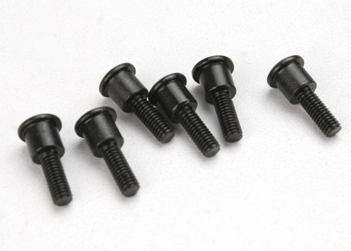 |
| ⭐ **Brass bushing + standard M3 screw** | **The better way — the MonsterKingz and GPM kits already include brass bushings.** Makes the pivot last basically forever and stay tighter. **The brass is softer than the aluminum, so it deforms first — the cheap bushing sacrifices itself and protects the alloy C-hub.** It also runs **smooth and self-lubricated** (sintered bronze stores oil in its pores), keeping the pivot slop-free and effectively burnishing it smooth. *(Verified general principle: a bronze/oilite bushing is a softer, self-lubricating **sacrificial** bearing surface that wears before — and protects — the harder mating part.)* When it wears loose you **don't replace the knuckle — just drop in a fresh bushing** (~$3 for 100 = set for life). *Bushing size TBD — measure it.*  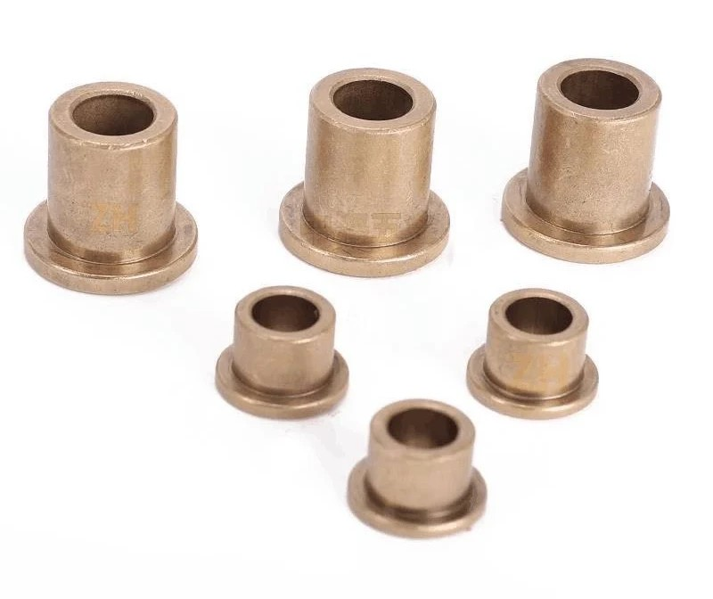 <em>flanged brass (sintered/oilite) bushings — example sizes</em> |

> ⚠️ Match bearings to the exact carrier — the inner and outer differ on most of these, the three generations aren't interchangeable, and the Tekno M6 rear needs its own 10×15×4 inner.

---

## Notes

- **Why metal front, any rear:** the front eats the impacts and even the strongest EHD plastic cracks too often, so it must be alloy. The rear barely sees load, so material doesn't matter back there.
- **Crash hierarchy still holds.** The [FLM extended arms](arm_analysis.md) are the intended fuse; they bend first. Alloy fronts just stop the C-hub / steering block from breaking before the arm does.
- **Plastic ideal vs alloy reality.** The Tekno TKR6837 nylon block ($8.79) is *ideally* what you'd run (strong for plastic, cheap, sacrificial), but the front still breaks a few, so alloy is the durable answer. Keep a couple Tekno blocks as cheap spares.
- **Front pick follows the axle system.** E-Revo CVD axles (EHD) take the **MonsterKingz EHD alloy** front. Tekno M6 axles (XO-1) take the **GPM aluminum XO-1** front. Each path has its own bearings, don't mix (see [Axle ↔ hub compatibility](#axle--hub-compatibility)).
- **Confirmed axle plan: Raptor R hubs front + rear, running Tekno M6 stubs.** Front Raptor R runs the **Tekno M6 17mm stubs** (**front fit confirmed** with the bearing); rear Raptor R runs the **Tekno 5580 (SCT410) or 5070 (EB48 buggy) stub**, same bearing setup. Keeps the genuine slim Raptor R hubs and swaps in the strong Tekno stubs. Locked in now that the real Raptor R Ultimate set is purchased (2026-07-29).
- **Raptor R front + Tekno M6 17mm stubs: needs a 10×18×5 inner — confirmed.** Genuine Raptor R hubs run the **same EHD bearing pocket** as the rest of the EHD family, so this swap carries straight over. The EHD (Raptor R) outer bearing pocket is **bigger (18mm OD)** than the XO-1's, and the stock EHD inner is **12mm ID** (for the E-Revo axle). To fit the Tekno M6 stub, drop the inner to **10mm ID** while keeping the 18mm OD → a **10×18×5** bearing. **The 5mm thickness is deliberate (not the stock 4mm): a 10×18×4 isn't a standard/cheap bearing, but 10×18×5 is a common off-the-shelf size.** The Tekno stubs then fit perfectly with minor filing (**0.2 to 0.5 mm**) of the 17mm hex. This opens the M6 stub path without an unobtainium bearing.
- **Buying:** full front + rear, the **Raptor R Ultimate alloy set** ($68.73, genuine Traxxas, slim, purchased 2026-07-29 via eBay — toysion) over the in-hand **MonsterKingz** ($46.80, too fat/heavy). Fronts only, get the **Lighthouse front** (~$25, owned). The Traxxas OEM blue set is genuine but pre-EHD, wrong generation here.
- **Raptor R = genuine slim EHD alloy.** The Ford Raptor R Ultimate uses the original extreme-heavy-duty aluminum hubs: front C-hub 9063, steering block 9064, rear carrier 9065, on the same 5117A / 5120A EHD bearings. It's the factory version of what MonsterKingz clones fat, so it fits the E-Revo CVD axles with no changes and weighs less.
- **All EHD rears can be shaved (alloy or plastic).** They're over-built with everything captured (bearings + axle supported both sides), so a few minutes with a Dremel drops real weight on any of them.
- **Stock EHD reference (Jenny's RC, gray):** TRA9037 steering block, TRA9032 C-hub, TRA9050 rear carrier, TRA3642X screws, TRA5117 + TRA5120A bearings. Direct fit Jato / Slash / Rustler / Stampede 4x4 BL-2s.
- **TODO:** confirm which front EHD part breaks first (the one to swap to alloy first).
- **TODO:** source + test the **10×18×5** inner bearing for the Raptor R + Tekno M6 17mm stub front conversion (spec confirmed, not yet bought).
- **TODO:** test the **10×15×5** inner bearing bought for the MonsterKingz M6 conversion (not yet tried) — moot unless MonsterKingz comes off the shelf as a fallback.
- **TODO:** confirm the Raptor R rear stub axle. Bearings confirmed correct; testing whether the **Tekno 5580** (or 5070) seats the 17mm hex in the Raptor R rear. Measure and pick one (see [Tekno stubs in `driveshaft_analysis.md`](driveshaft_analysis.md#tekno-stubs-front--rear)).
