# Motor Selection — FastAzJato4x4

> **Leaning toward: Castle Creations 1415 2400KV — 5mm shaft (#060-0067-00)** — 4S native, runs cool without a fan, 5mm shaft (preferred), modern 4-pole 12-slot design, rebuildable, pairs natively with the chosen Fire Phoenix ESC over standard JST-ZH. The Castle 1412 2100KV 5mm (#060-0095-00) is a strong runner-up — even cooler running, lighter (265 g vs 318 g), cheaper ($124.95 vs $134.95), but slightly less top end.
>
> Castle 1412 3200KV is in hand and works, **but** runs hot on 4S and needs a fan. Once you add the Surpass twin-fan + heatsink rig (~50 g), the 1412 + cooling weighs ~315 g — basically the same as a 1415 2400KV bare (318 g), with all that mass sitting **up high on the motor** where it hurts handling. Reducing the cooling rig = reducing complexity = **cool**. Badum tss. 🥁

<p align="center">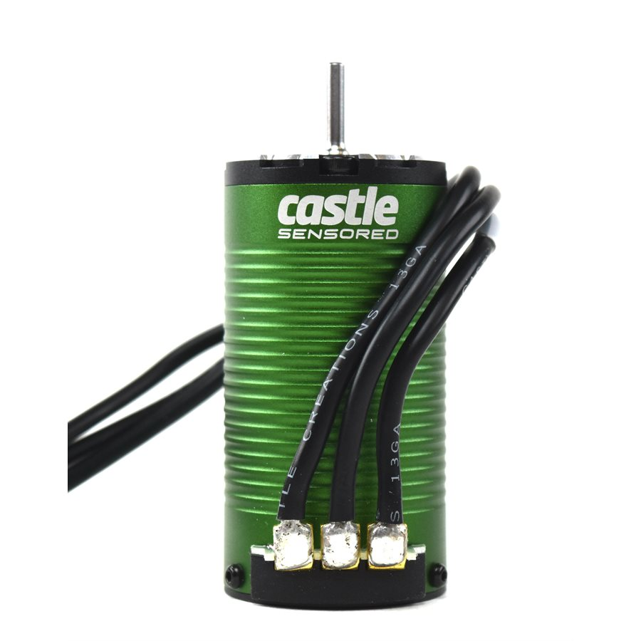</p>

---

## Key Requirements

| Requirement | Type | Why |
|---|---|---|
| **4S LiPo support** | Must | Build runs 4S — motor has to handle 16.8V without burning windings |
| **36mm can, ≤70mm overall length** | Must | Physical fit in the FastAzJato4x4 motor mount. 42mm cans technically fit but make the car **fat, heavy, and sluggish** — same goes for anything over ~70mm long. **Exception**: a 40-42mm motor would be considered if it's actually *lighter* than the 36mm options (currently no 40mm+ candidate is — they're all heavier) |
| **2100–3200KV** | Must | Target range for 4S on a 1/10-class chassis. Below 2100 = sluggish; above 3200 = too hot on 4S even with a fan |
| **Sensored** | Must | Smooth starts, no cogging, low-speed control on the chosen Fire Phoenix ESC |
| **Standard sensor connector (JST-ZH or Castle native)** | Must | Fire Phoenix uses JST-ZH; proprietary Hobbywing G3 plugs require a $-and-cable adapter |
| **Rebuildable / serviceable** | Must | Bearings and brushes wear; motor has to come apart for maintenance, not get thrown away |
| **Documented bearing sizes** | Must | So replacement bearings can be sourced from any bearing supplier without guessing |
| **Solder tabs (not pre-wired)** | Must | Wires must terminate at solder tabs inside the can. Motors with wires running directly out of the body can't be re-wired without surgery if a wire pulls out |
| **Runs cool on 4S without a fan** | May | Strong preference. A fan and its mount add weight up high on the motor — purely a CG / weight argument, not reliability (user runs metal fans that basically never break unless smacked). 2400KV-class with modern (G3 / 4-pole) laminations runs cool on 4S; 3200KV-class generally needs cooling |
| **Splash / dust resistance** | May | Nice for offroad / wet conditions but build is mostly track |
| **Lightweight** | May | Lower mass helps acceleration and handling, especially in a 1/10-class chassis |
| **Cheap / in hand** | May | $0 if already owned beats $80+ for a new motor |
| **5mm output shaft** | May | Preferred over 1/8" (3.17mm) — thicker shaft handles higher torque without flex, and most 1/10 brushless 32P pinions come in 5mm bore. The in-hand 1412 3200KV is 1/8" so this favors the 5mm-shaft variants if changing motors anyway |

> **Castle naming convention:** the four-digit Castle model number is stator dimensions in tenths of an inch. **First two digits = stator diameter, last two digits = magnet length.** So a `1412` is a 1.4" diameter × 1.2" magnet stator (35.6mm × 30.5mm internal); a `1415` is 1.4" × 1.5" (35.6mm × 38.1mm); a `1515` is 1.5" × 1.5". The overall **can** is larger than the stator — Castle 14-series motors all use a 36mm OD can; 15-series and 17-series are bigger.

---

## Motor Comparison

| Motor | Spec | Status | Pros / Cons | Photo / Link |
|---|---|---|---|---|
| **Castle Creations 1412 3200KV** (#060-0085-00, 1/8" shaft) | KV: 3200<br>Can: 36mm × 62.5mm<br>Weight: 265g (with wires)<br>Shaft: 1/8" (3.17mm)<br>Cells: **2-4S** (Castle says up to 3S ideal, 4S with conservative gearing)<br>Sensored: Yes (Castle SmartSense / sensored / sensorless)<br>Price: **$0 in hand** (retail $119.95) | **In Hand** | Pro: Free, proven on 4S with Fire Phoenix, no regearing, lightest 4S option, 75,000 max RPM, M3 mount @ 25.4mm spacing<br>Con: Castle explicitly rates it 3S-ideal; 4S "needs conservative gearing and a close eye on temps" — runs hot on 4S in practice, fan basically required |  |
| **Castle Creations 1412 3200KV — 5mm shaft** (#060-0096-00) | Same can as 1412 3200KV above (36mm × 62.5mm, 265g)<br>**Shaft: 21mm × 5mm** (longer + thicker than the 1/8" variant's 15mm × 3.17mm)<br>Price: **$129.95** (list $159) | **Candidate** | Pro: All the 1412 3200KV traits + thicker 5mm shaft for high-torque pinion compatibility; longer shaft gives more pinion clearance<br>Con: Same heat problem as the 1/8" variant; $10 premium over the 1/8" version |  |
| **Castle Creations 1412 2100KV** (#060-0094-00, 1/8" shaft) | KV: **2100**<br>Can: 36mm × 62.5mm (same as 3200KV)<br>Weight: 265.4g<br>Cells: **2-4S (4S NATIVE)** — Castle: "cool running torque animal" on 4S<br>Sensored: Yes (SmartSense / sensored / sensorless)<br>Max RPM: 75,000<br>Price: $119.95 (list $146.80) | **Candidate** | Pro: **4S native with no caveats** (vs the 3200KV's "with conservative gearing"). Castle officially rates it for 2WD/4WD SC trucks / MT / rock racers up to 6.5 lb on 4S. Same can, weight, mount, and shaft as the in-hand 1412 3200KV — arguably the better-engineered 4S motor in the 1412 family<br>Con: 1/8" shaft (5mm preferred); slightly lower top speed than the 2400KV at the same gearing | 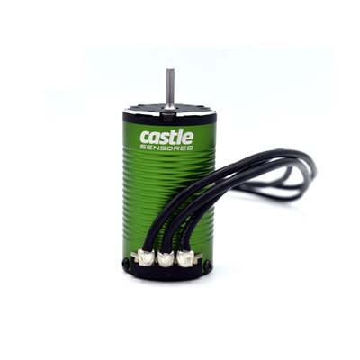 |
| **Castle Creations 1412 2100KV — 5mm shaft** (#060-0095-00) | Same can as 1412 2100KV (36mm × 62.5mm, 265.4g, 4S native, 75k max RPM)<br>**Shaft: 21mm × 5mm**<br>Cooling fan: Optional<br>Price: $124.95 (list $152.90) | **Candidate** | Pro: 2100KV 4S-native + the preferred 5mm shaft + longer shaft for pinion clearance; Castle calls this a cool-running torque animal on 4S; fan is optional not required<br>Con: Slightly lower top speed than the 2400KV at the same gearing | 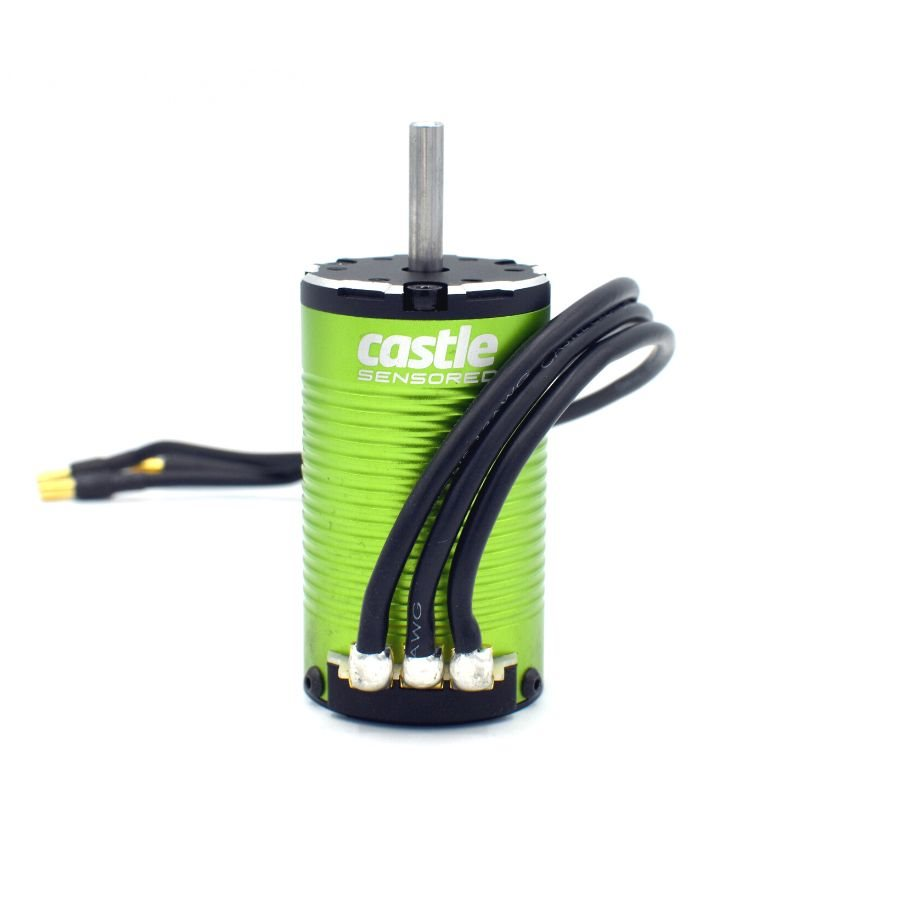 |
| **Castle Creations 1415 2400KV** (#060-0060-00, 1/8" shaft) | KV: **2400**<br>Can: **36mm × 69.5mm** (just under the 70mm Must)<br>Weight: **318g** (with wires)<br>Shaft: 1/8" (3.17mm)<br>Cells: **3-4S** (4S native, no caveats)<br>Sensored: **Yes — SmartSense / sensored / sensorless; ROAR-standard sensor port**<br>Price: **$129.95** (list $159) | **Candidate** | Pro: 4S native (no conservative gearing required), 2400KV runs cool without a fan, **improved 4-pole 12-slot design with less heat**, **rebuildable** (front bell/bearing or rotor/shaft replaceable), QuietSense sensor noise shielding, 75,000 RPM max, fan optional<br>Con: Heaviest 4S Castle option at 318g, no IP rating, requires regearing for top speed |  |
| **Castle Creations 1415 2400KV — 5mm shaft** (#060-0067-00) | Same as 1415 2400KV above but with **5mm output shaft**<br>Price: **$134.95** (list $165.15) | **Candidate** | Pro: All the 1415 2400KV traits + thicker 5mm shaft for high-torque pinion compatibility<br>Con: $5 premium over the 1/8" 1415 | <br><em>shared photo — same motor as 1415 2400KV, different shaft</em> |
| ~~HobbyWing EZRun 3665SD G3 2400KV~~ (#30402604) | KV: 2400<br>Can: 37mm × 65.8mm<br>Weight: 304.5g<br>Cells: **2-4S**<br>Sensored: Yes (**proprietary G3 plug**)<br>Price: ~$70 (MSRP $120) | **Vetoed** | Pro: 4S + IP67, modular detachable design, **bearings documented** (front 16×5×5 / rear 11×5×5), 4-pole, R = 0.00816Ω<br>Con: **Proprietary G3 sensor plug — needs HWA30810007 adapter for the chosen Fire Phoenix ESC.** Adapter cost and one more failure point | 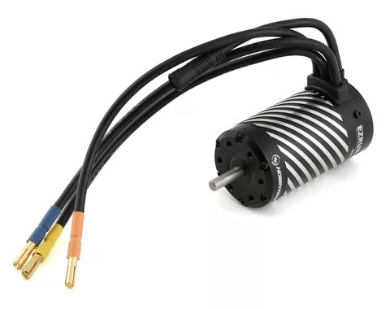 |
| ~~HobbyWing EZRun 3652SD G3 3300KV~~ (#30402603) | KV: 3300<br>Can: 37mm × 53mm<br>Weight: 227g<br>Cells: **2-3S max**<br>Sensored: Yes (JST-ZH)<br>Price: ~$60 (MSRP $93) | **Ruled Out** | Pro: Lightest motor in the group, IP67, modular detachable, **bearings documented** (front 13×5×4 / rear 11×5×5), 4-pole<br>Con: **2-3S max — fails the 4S Must.** Hobbywing sells 4100KV and 5400KV variants in this can too, all 3S max or lower | 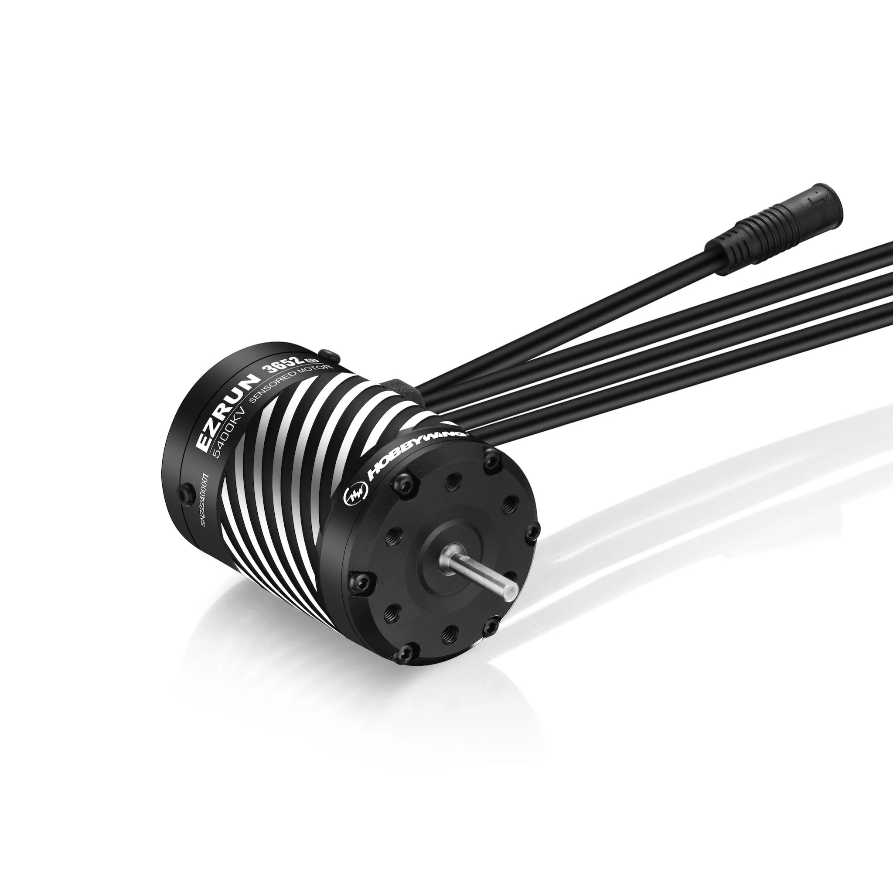 |
| ~~HobbyWing EZRun 3665SD G3 3200KV~~ (#30402607) | KV: 3200<br>Can: 37mm × 65.8mm<br>Weight: 304.5g<br>Cells: **2-3S max**<br>Sensored: Yes (proprietary G3 plug)<br>Price: ~$70 (MSRP $120) | **Ruled Out** | Pro: IP67, modular detachable, bearings documented, 4-pole, R = 0.00555Ω<br>Con: **2-3S max — fails the 4S Must.** Also has the proprietary plug problem | <br><em>shared photo with 2400KV — physically identical motor</em> |
| ~~HobbyWing XeRun 3660SD G3 3200KV~~ | KV: 3200<br>Can: ~36mm × 60mm<br>Weight: 230g<br>Cells: **3S max**<br>Sensored: Yes (JST-ZH)<br>Price: ~$100 (MSRP $140) | **Ruled Out** | Pro: Lighter than EZRun 3665, competition-grade racing line<br>Con: **3S max — fails the 4S Must** | 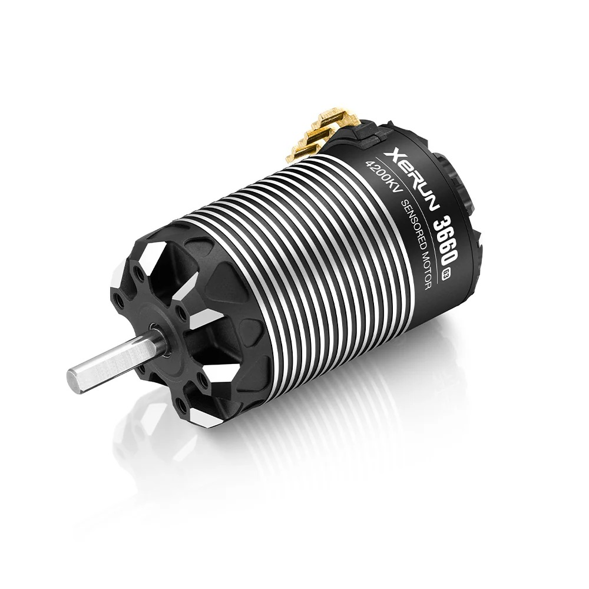 |
| ~~Castle Creations 1515 V2 2200KV~~ (#060-0093-00) | KV: 2200<br>Can: **40mm × 75.4mm** (41.4mm with fins)<br>Weight: 426g with wires (380g without)<br>Cells: 2-6S<br>Sensored: Yes (SmartSense / sensored / sensorless)<br>Price: $195.95 (list $239.75) | **Ruled Out** | Pro: True 1/8 scale, runs 6S, rebuildable, **explicit gold-plated solder tabs**, Kevlar-wrapped rotor, 180°C-rated magnets, 10 AWG silicone wire<br>Con: **40mm × 75.4mm — fails BOTH the 36mm can Must and the ≤70mm length Must.** 426g is overkill for a 1/10 build; Castle explicitly targets 1/8 buggies / truggies and 1/10 monster trucks up to 15 lb | 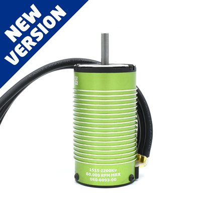 |
| ~~Castle Creations 1406 2280KV~~ (#060-0069-00) | KV: 2280<br>Can: **36mm × 49.5mm** (smallest 14-series)<br>Weight: **197g** (lightest in the comparison)<br>Cells: 2-4S<br>Sensored: Yes (SmartSense / sensored / sensorless)<br>**Max RPM: 100,000** (vs 75k for 1412/1415)<br>Shaft: 15mm × 1/8"<br>Recon G6 Certified<br>Price: $104.95 (list $128.45) | **Ruled Out** | Pro: Cheapest 14-series, lightest at 197g, 4S native, 36mm × 49.5mm fits the size Musts comfortably, very high 100k max RPM, Recon G6 certified<br>Con: **Castle officially rates max vehicle weight at only 5 lb for racing / aggressive driving** (8 lb for low-speed / crawling). The FastAzJato4x4 is ~6-7 lb minimum with battery — **over Castle's racing weight limit, will burn up under sustained 4S loads**. The 0.6" magnet length means much less copper and iron than the 1412/1415, so thermal mass is way lower. Castle targets 1406 at 1/10 rock crawlers, trail rigs, touring cars, lighter stadium trucks | 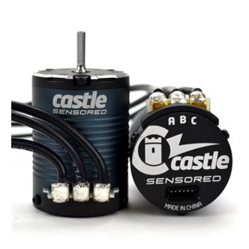 |

---

## Related: Motor Cooling (Optional)

Not a motor itself — a fan/heatsink add-on that bolts to the motor's outside if you need active cooling. Tracked here because it directly affects the motor decision (a 1412 3200KV needs one; a 1415 2400KV or 1412 2100KV doesn't).

| Cooling Rig | Spec | Status | Pros / Cons | Photo / Link |
|---|---|---|---|---|
| ~~Surpass Hobby 36mm Dual-Fan Aluminum Heatsink (stock, plastic fans)~~ | Heatsink: T6 aluminum frame, graphite fan cover<br>2× 30mm plastic fans @ 9g each = 18g<br>Suits: 36mm-can 540 / 550 motors (marked "540-L")<br>Footprint: 60.2 × 47 × 34.3mm<br>Max RPM: 28,000 @ 8.4V<br>Cable: 263mm extension included<br>**Weight: 55 g total** (18g plastic fans + 37g heatsink/mount/cable)<br>Price: ~$7.28 (AliExpress) | **Vetoed** | Pro: Cheap (~$7), complete kit, lightest as-shipped<br>Con: **Plastic fans die fast — in practice you rip them out and swap in metal anyway (see row below).** Also adds 55g up high on the motor; leading 1415 2400KV / 1412 2100KV picks don't need cooling at all | 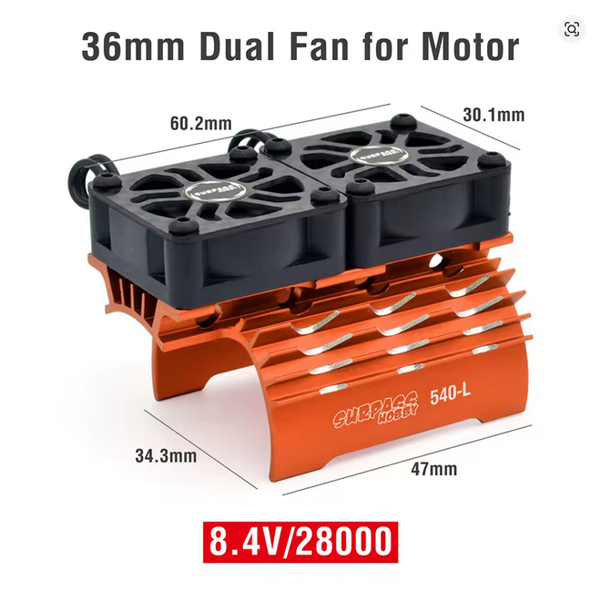 |
| ~~Surpass Hobby Heatsink + separate metal fans (realistic build)~~ | Surpass 36mm dual heatsink with stock plastic fans removed<br>2× 30mm metal fans @ 13.17g each = 26.34g (sold separately)<br>**Weight: ~63 g total** (26.3g metal fans + 37g heatsink/mount/cable)<br>Price: ~$7.28 heatsink + ~$10 metal fans = **~$17 all in** | **Vetoed** | Pro: Metal fans basically never fail unless smacked — the actual setup anyone serious would run<br>Con: 8g heavier than the stock plastic-fan setup; still bracing a problem the chosen motor shouldn't have | 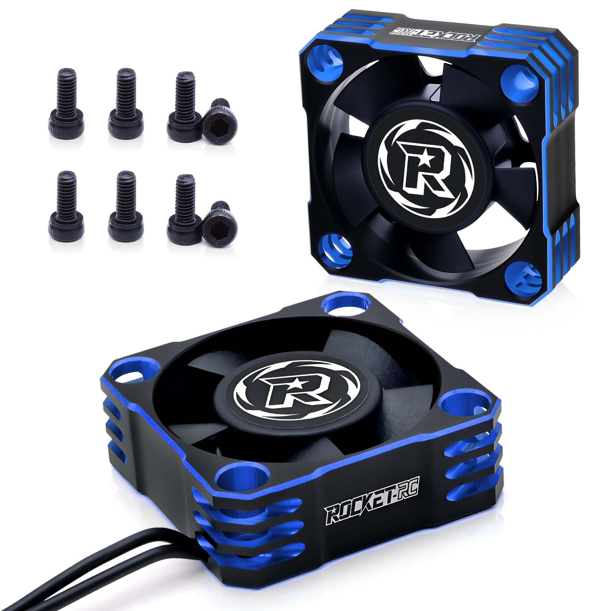<br><em>aftermarket metal fans (bought separately) — drop into the Surpass heatsink above</em> |

### Math: where the ~63 g comes from

The Surpass listing ships with plastic fans and lists assembly weight at **55 g**. Plastic fans die fast in practice and always get swapped for metal, so the realistic setup is:

- Listed assembly (with plastic fans): **55 g**
- − 2 × plastic fans @ 9 g each: **18 g**
- = Heatsink + mounting + extension cable (irreducible): **37 g**
- + 2 × metal fans @ 13.17 g each: **26.3 g**
- = **~63 g total with metal fans**

The 37 g of T6 aluminum frame + graphite cover + cable is baked in regardless of fan choice.

> Must order the **36mm dual-fan** variant — the 28/29mm versions are for smaller 380/390 motors (won't fit a 36mm can), and the single-fan 36mm version (46g) doesn't cool as well. Sizes from the same Surpass listing: 28/29 single 29g, 28/29 dual 34g, 36 single 46g, **36 dual 55g** (all with stock plastic fans).

---

## Real-World Weight: 1412 3200KV + Cooling vs 1415 2400KV Bare

The Castle 1412 3200KV's "free, already in hand, lightest 4S option" advantage looks great on paper. But it needs a fan to stay in safe temps on 4S, and the cooling rig isn't light. Once you account for the cooling, the two leading options end up at basically the same effective weight:

| Setup | Component | Weight |
|---|---|---|
| **Castle 1412 3200KV + Surpass cooling (metal fans)** | Castle 1412 3200KV motor | 265 g |
| | Surpass 36mm dual heatsink + 2× metal fans (13.17g ea) | ~63 g |
| | **Total** | **~328 g** |
| **Castle 1415 2400KV bare** | Castle 1415 2400KV motor | 318 g |
| | No fan needed (4S native, 2400KV runs cool) | 0 g |
| | **Total** | **318 g** |
| **Castle 1412 2100KV bare** | Castle 1412 2100KV motor | 265 g |
| | No fan needed (4S native, "cool running torque animal") | 0 g |
| | **Total** | **265 g** |

**The cooled 1412 setup is 10 g heavier than the bare 1415**, and the 63 g of cooling rig is sitting **up high on the motor** — exactly where added mass hurts handling most (raises CG). The 1415 just is the weight — no extra bracketry, no fan housing, nothing to mount. The **1412 2100KV bare at 265 g blows everything else out of the water on weight** — 53 g lighter than the 1415, 63 g lighter than the cooled 1412.

> Surpass Hobby 36mm dual-fan heatsink — confirmed specs from listing: aluminum heatsink frame + graphite fan cover + two plastic-blade fans, 28000 RPM @ 8.4V, 55g for the complete 36mm dual-fan assembly (lighter 28/29mm versions are 29-34g, single-fan 36mm is 46g — we'd need the 36mm dual to cool the 36mm-can 1412).

**Take:** the in-hand 1412's weight advantage disappears once cooling is honest in the math. The 1415 buys you cooler running, no fan dependence, native 4S, modern 4-pole 12-slot design, and the same effective weight for ~$130. The 1412 2100KV variants do even better — 4S native AND lower bare weight than the 1415.

---

## Acceleration Simulation (2400KV vs 3200KV vs 2100KV, geared to same top speed)

This is a Python physics sim that answers [the open question on GitHub issue #2](https://github.com/CheapAzHobbies/CheapAzTuningRC/issues/2): if you gear each motor so they all hit the same top speed, **which one accelerates faster?**

### How the sim works (HS-level explanation)

A brushless motor turns electrical energy into torque. Three things matter:

1. **KV** is a number that says how fast the motor spins per volt of battery, *with no load on it*. A 2400KV motor on a 4S (14.8V) battery will theoretically spin at 2400 × 14.8 = **35,520 RPM** with nothing attached. A 3200KV motor spins at 47,360 RPM. Higher KV = more RPM.
2. **Torque** is twisting force. The lower the KV, the more torque per amp of current. That's a physics rule called the *torque constant*: `Kt = 60 / (2π × KV)`. So a 2400KV motor makes 33% more torque per amp than a 3200KV motor.
3. **Gearing** trades RPM for torque. If you use a smaller pinion gear, the motor spins more times per wheel rotation — that multiplies torque at the wheel but slows the wheel down. Bigger pinion = faster wheel, less torque.

To make two motors hit the same top speed, the higher-KV motor needs a smaller pinion (less torque multiplication) and the lower-KV motor needs a bigger pinion (more torque multiplication). **At equal top speed, the wheel torque ends up theoretically equal**.

So what's the difference in real life? **Current draw and heat.** A lower-KV motor needs less current to make the same wheel torque. Less current = less waste heat (heat in the windings is `Power_lost = I² × R` — square the current, multiply by resistance). The ESC's current limit also caps how hard each motor can pull.

### Physics in the sim

Per simulation timestep (1 millisecond):
- Compute motor RPM from wheel speed × gear ratio
- Compute back-EMF (the voltage the motor generates as it spins): `V_bemf = V_battery × (RPM_now / RPM_no_load)`
- Compute current: `I = (V_battery − V_bemf) / R_motor`, capped at the ESC limit (120 A for the Fire Phoenix)
- Compute torque: `T_motor = Kt × I`
- Multiply by gear ratio and drivetrain efficiency → wheel torque
- Divide by wheel radius → driving force
- Subtract aerodynamic drag (`½ × ρ × Cd·A × v²`) and rolling resistance → net force
- Acceleration = net force / mass; integrate to get next speed

Inputs (matched to the FastAzJato4x4):
- 4S nominal voltage: **14.8 V**
- Vehicle mass with battery: **6.5 lb / 2.95 kg**
- Wheel diameter: 90 mm (~3.5")
- Internal transmission: 2.78:1 (Slash/Jato 4x4)
- Spur: 50T 32P
- ESC current limit: **120 A** (Fire Phoenix)
- Drag coefficient × frontal area: 0.012 m² (typical 1/10)
- Rolling resistance coefficient: 0.04 (offroad)
- Drivetrain efficiency: 85%

Motor parameters (KV, internal resistance, pinion):
| Motor | KV | R (Ω) | Pinion |
|---|---|---|---|
| Castle 1412 3200KV | 3200 | 0.0055 | 15T |
| Castle 1415 2400KV | 2400 | 0.0080 | 20T |
| Castle 1412 2100KV | 2100 | 0.0085 | 22T |

Resistance values are educated estimates — Castle doesn't publish R for surface motors. Used Hobbywing's published G3 numbers as a sanity check.

### Results

```
Motor                                  FDR    Vmax   0-20mph  0-30mph  0-40mph  PeakA  PeakHeat
Castle 1412 3200KV (15T pinion)        9.27   53.7   0.43s    0.65s    0.87s    120A    79W
Castle 1415 2400KV (20T pinion)        6.95   53.6   0.43s    0.65s    0.87s    120A    115W
Castle 1412 2100KV (22T pinion)        6.32   51.6   0.41s    0.62s    0.83s    120A    122W
```

<p align="center">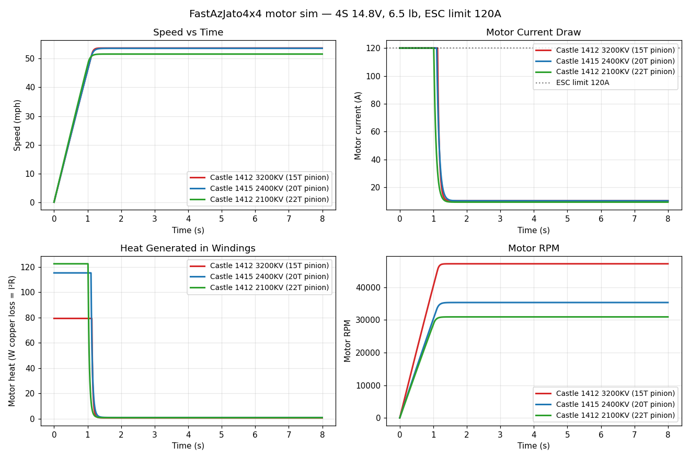</p>

### What the sim says

- **Top speed is basically equal** — all three motors hit ~52-54 mph because we deliberately geared them that way. The 2100KV is slightly slower because at 22T it's geared just a hair shorter.
- **0-x mph times are within 20 ms of each other** — when the ESC current limit is the bottleneck (which it is for all three during acceleration), they all accelerate at the same rate. The wheel torque produced is the same because `T_wheel = T_motor × gear_ratio` and the math works out identical when all are at the same current limit.
- **Heat is where they actually differ** — but **opposite of what intuition says**:
  - 3200KV at 120 A: 120² × 0.0055 Ω = **79 W of heat**
  - 2400KV at 120 A: 120² × 0.0080 Ω = **115 W of heat**
  - 2100KV at 120 A: 120² × 0.0085 Ω = **122 W of heat**
  - The lower-KV motors have *higher* internal resistance, so at the same current they dissipate more heat in the windings.

### Real-world caveats (where the sim oversimplifies)

This sim is a clean acceleration model. It misses two big real-world effects that swing things the OTHER direction:

1. **Iron losses (eddy currents) scale with RPM.** Higher-KV motors spin faster, so they have more iron loss at any given speed. The sim only tracks copper loss (I²R). In practice, eddy currents add a major heat term for high-KV motors that's not in the chart.
2. **Sustained cruise current is higher for high-KV motors.** Once you're at cruise speed (not accelerating), the higher-KV motor needs more current to overcome drag because its torque-per-amp is lower. The sim's heat numbers are only valid for the brief acceleration spike — sustained heat over 5 minutes of running tells a very different story (3200KV runs hotter than 2400KV in real-world testing).

So the sim's answer "the lower-KV motors dissipate more heat in the windings during acceleration" is true in the narrow acceleration window, but in steady-state driving the higher-KV motors generate more heat overall — which is why the community consensus is 2400KV for 4S in this class.

### Running the sim yourself

The script is at [`sim/motor_acceleration_sim.py`](sim/motor_acceleration_sim.py). To run:

```bash
pip install numpy matplotlib
python3 cars/FastAzJato4x4/sim/motor_acceleration_sim.py
```

It'll print the table and save a fresh chart to `cars/FastAzJato4x4/src/motor_sim_4s_acceleration.png`. Tweak the `MOTORS`, `MASS_LB`, `WHEEL_DIAM_MM`, or `I_LIMIT` constants at the top to model your own setup.

---

## Smaller Stators Can Win: "V8 vs High-Revving 4 Banger"

A common assumption in RC is that bigger stator = better. **Not always true on 4S in this weight class.** Here's why:

### The physics

The rotor (the spinning inner part of the motor, with the magnets glued to it) is held together by a Kevlar or fiber wrap. At high RPM, **centrifugal force tries to fling the magnets outward**. Force scales with `m × r × ω²` — mass times radius times angular velocity squared. So:

- **Bigger rotor diameter** → magnets are farther from center → more force per RPM
- **Longer rotor** → more magnet mass → more total force
- **Higher RPM** → force grows with the *square* of RPM

When the wrap can't hold, the magnets break free and the rotor self-destructs (commonly called "rotor explosion" — sometimes loosely said as "stator explosion" since the whole thing rips apart).

Manufacturers spec a **max RPM** to keep you safely under the wrap's limit. Castle and Hobbywing both publish these numbers, and they reveal the trade-off clearly:

| Motor | Stator size | Max RPM (manufacturer) |
|---|---|---|
| Castle 1406 | 1.4" × 0.6" (small) | **100,000** |
| Castle 1412 / 1415 | 1.4" × 1.2"-1.5" (medium) | 75,000 |
| Hobbywing EZRun 3652/3665 SD G3 | 36mm × 52-65mm (medium) | 75,000 (similar class) |
| Castle 1515 V2 | 1.5" × 1.5" (large) | **60,000** |

**Smaller rotor = higher safe RPM. Bigger rotor = more leverage (torque per amp).** That's the trade-off: torque comes from `T = F × r`, so a bigger rotor radius gives the magnetic force a longer lever arm to push the shaft — more torque per amp drawn. But the same bigger radius is what gets you to the rotor-wrap limit sooner at high RPM. Same trade-off you see in engines: a small high-revving 4 banger can spin to 8500+ RPM safely (low rotating mass, short stroke), while a big V8 has more leverage on the crank but the bottom end can't take infinite RPM.

### Why this matters for 4S on a 1/10 chassis

- A "smaller, older design" 36mm Castle motor isn't necessarily worse — it can **safely spin higher** before the rotor lets go.
- A bigger Hobbywing motor with more stator iron and a bigger rotor is built for **torque under load** (the V8) — bigger rotor radius = more leverage per amp — but its RPM ceiling is the same or lower than the smaller Castle equivalent.
- On a light 1/10 chassis on 4S, you usually want RPM, not raw torque. The bigger motor's torque advantage is wasted (chassis is too light to need it) and its mass penalty is unwelcome (more grams up high, see [the weight comparison above](#real-world-weight-1412-3200kv--cooling-vs-1415-2400kv-bare)).

### And the chassis matches the motor

The 4-banger analogy extends to the car. **High-revving small engines work best in lightweight cars** — the S2000, MX-5, NSX. Put a screaming high-revving four-pot in a heavy SUV and it stays out of its powerband and dies. Put a big V8 with all that crank leverage in an MX-5 and you can't put the power down.

The Jato 4x4 platform happens to be **lighter than typical 1/8 CF race chassis** (Tekno, Mugen, etc., which are designed for the heft of true 1/8-scale buggies). So the FastAzJato4x4 isn't carrying around the mass that justifies a bigger V8-style motor. A small high-revving motor in a light chassis is the matched pairing — exactly the same logic as why a sport coupe outruns a muscle car on a twisty track.

### Takeaway

The marketing-driven "bigger is better" assumption falls apart once you look at the max RPM data and remember the chassis is the constraint, not the motor. **Smaller-but-faster-revving wins on a chassis that doesn't need 1/8-scale torque.**

---

## KV Reference

KV is a no-load speed rating — same top speed at same KV on same voltage. The differences between options at the same KV are torque, heat, and efficiency (stator size, lamination quality, how the motor is wound for the voltage).

The original target was 3200KV — same as the Slash 4x4. In practice the Castle 1412 3200KV gets hot enough on 4S to require a cooling fan: 3200KV × 14.8V = ~47,000 RPM no-load, which pushes the motor hard especially in grass and offroad where the drivetrain loads up at high RPM.

### Community Consensus (4S)

| KV | Character | Notes |
|----|-----------|-------|
| **1900-2200KV** | Smooth, all-day cool | Common race setup on true 1/8 buggies; light on the Jato 4x4 — usable but leaves performance on the table |
| **2400KV** | Cool, balanced | Slash 4x4 / e-Jato sweet spot. No fan needed with conservative gearing. Strong torque |
| **3000KV** | Borderline | Works but needs cooldown breaks and conservative gearing |
| **3200KV** | **Super pipey**, runs hot | Sudden / peaky power delivery, lots of top end. Generally needs a fan on 4S. What's currently in the in-hand Castle 1412 |

The FastAzJato4x4 is lighter than a true 1/8 buggy, so **2400KV is at or just above the community-preferred range** for this weight class. A 1412 3200KV running hot on 4S isn't a setup problem — it's a physics problem. Dropping to 2400KV with G3 / 4-pole 12-slot laminations eliminates the eddy-current losses driving the heat, and a fan becomes unnecessary.

### Open question: 2400KV vs 3200KV geared to the same top speed — which accelerates faster?

If both motors are geared (different pinion) to hit the same top speed:
- The 3200KV motor uses a smaller pinion (higher gear reduction) — gear ratio multiplies torque at the wheels
- The 2400KV motor uses a bigger pinion (lower gear reduction) — less mechanical advantage but the motor itself is more efficient and generates more torque per amp

Conventional wisdom is mixed:
- "Pipey" higher-KV motors with strong gearing-down often punch harder off the corner but run hotter and draw more amps
- Lower-KV motors with less gearing-down tend to be smoother and more efficient, often comparable or slightly slower in 0-x accel but with way better thermal headroom

**TODO**: Verify with actual run data — would need timed acceleration runs with 1412 3200KV (e.g. 15T pinion) vs 1415 2400KV (e.g. 19-21T pinion) on the same battery / track to settle it for this build.

---

## Sensor Connector Compatibility

| Motor | Fire Phoenix XeRun 120A (chosen ESC) | Castle Mamba X | HW EZRun MAX10 G2 |
|---|---|---|---|
| Castle 1412 / 1415 | **Native (JST-ZH compat)** | **Native (SmartSense)** | Works |
| HW EZRun 3665SD G3 (2400 or 3200) | Needs adapter (HWA30810007) | Needs adapter | **Native** |
| HW EZRun 3652SD G3 / XeRun 3660SD G3 | Works (JST-ZH) | Works | Works (JST-ZH) |

---

## Detailed Notes

### Castle Creations 1412 3200KV — In Hand

- Already owned, proven on 4S with the Fire Phoenix ESC on the Slash 4x4
- Castle part **#060-0085-00**; retail **$119.95** (list $146.80)
- Stator: 1.4" × 1.2" (per Castle naming); **can: 36mm OD × 62.5mm length** — fits the 36mm / ≤70mm Must
- Weight: **265.4g** (9.4oz) with wires
- Shaft: 15mm long × 1/8" (3.17mm) diameter
- Mounting: M3 bolts @ 25.4mm spacing
- Connectors: 4mm male Castle Bullet Connectors attached to **replaceable 13-gauge wires**; sensor wire 210mm included
- Max RPM: 75,000
- **Castle's official application rating**: 1/10 SC trucks / monster trucks / rock racers up to 6.5 lb on **up to 3S LiPo**. Castle says it "can be run on a 4s LiPo with very conservative gearing and keep a close eye on temperatures" — i.e. 4S is out-of-spec but possible if you're careful with gearing and watch temps. Runs hot in practice and basically requires a fan. **Real cost of the fan: weight (fan + mount) sitting up high on the motor** — user runs metal fans that don't fail in practice, so reliability isn't the issue; the issue is grams in the wrong place
- Older lamination tech — the heat isn't gearing, it's eddy-current losses in the stator
- Sensor board has silicone conformal coating (water-resistant sensor PCB), but sensor connector itself is not water resistant — Castle recommends dielectric grease on connectors after wet running
- Castle's recommended ESCs for this motor: **Mamba X**, Copperhead 10, Sidewinder 4, Cobra 10 — all confirmed in the ESC analysis
- $0 — already in hand

### Castle Creations 1415 2400KV — Candidate (leading)

- Castle part **#060-0060-00**; retail **$129.95** (list $159.00)
- Stator: 1.4" × 1.5" (per Castle naming); **can: 36mm OD × 69.5mm length** — just under the 70mm Must
- Weight: **318g** (11.2oz) with wires — heaviest 4S Castle option
- Shaft: 15.5mm long × 1/8" (3.17mm) diameter
- Mounting: M3 bolts @ 25mm spacing (note: 25mm vs 1412's 25.4mm — same drill pattern in practice but check before mounting)
- Connectors: 4mm male Castle Bullet Connectors
- Max RPM: 75,000
- **Castle's official rating**: 3S-4S LiPo, 1/10 SC trucks up to 6.5 lb. 4S is native (no "with care" caveat like the 1412)
- **Improved 4-pole 12-slot design** — better efficiency, runs cooler than the 1412
- **REBUILDABLE design** — front bell/bearing assembly and rotor/shaft assembly are user-replaceable (meets the serviceability requirement)
- QuietSense™ tech shields sensors from coil noise; Flux Shield™ + secondary sense magnets for precise startups
- ROAR-standard sensor port with labeled connections
- No mechanical timing adjustments needed — sensor alignment handles it automatically
- Optional cooling fan (Castle says "coming soon" but motor designed to not need one)
- Sensor board has silicone conformal coating (water-resistant PCB); sensor connector is not water resistant — dielectric grease recommended after wet running
- Castle's recommended ESCs: **Mamba X**, Sidewinder 4, Cobra 10, Mamba Max Pro, Copperhead 10. Fire Phoenix is not on the official list but uses standard JST-ZH which connects to the included Castle sensor wire
- $129.95 — additional cost over the in-hand 1412

### HobbyWing EZRun 3665SD G3 2400KV — Vetoed (proprietary connector)

- 36×65mm stator, 305g
- 4S native with IP64 splash + dust rating — the only Hobbywing option that hits both
- G3 thin laminations significantly reduce eddy-current losses at high RPM — would run cool on 4S
- **Vetoed**: proprietary waterproof sensor plug. Native fit only with the EZRun MAX10 G2 ESC, which itself was vetoed for the same proprietary-port reason. Needs adapter HWA30810007 to use with Fire Phoenix or any standard JST-ZH ESC
- Adapter cost (~$10) and one more cable in the loom
- ~$65

### HobbyWing EZRun 3652SD G3 — Ruled Out (3S max)

- 36×52mm stator, lightest in the group at 227g
- G3 laminations, JST-ZH sensor (would pair fine with Fire Phoenix)
- IP5X dust resistance
- **3S max cell rating — fails the 4S Must**. Hobbywing winds the 3300KV stator for lower voltage

### HobbyWing EZRun 3665SD G3 3200KV — Ruled Out (3S max + proprietary)

- 36×65mm stator, 305g, IP64
- **3S max cell rating — fails the 4S Must**. Same problem as the 3652 — Hobbywing only winds the 3200KV variant for 3S in the EZRun line
- Also has the proprietary G3 sensor plug (would have been vetoed even if 4S rated)

### HobbyWing XeRun 3660SD G3 3200KV — Ruled Out (3S max)

- 36×60mm stator, 230g — lighter than the EZRun 3665
- JST-ZH sensor connector
- Competition-grade XeRun line with G3 laminations
- **3S max cell rating — fails the 4S Must**

### Castle Creations 1515 V2 2200KV — Ruled Out (too big)

- Castle part **#060-0093-00**; retail **$195.95** (list $239.75)
- Can: **40mm OD × 75.4mm length** (41.4mm with cooling fins). Stator is 1.5" × 1.5" (38mm × 38mm internal). True 1/8 scale motor
- Weight: 426g (15.1oz) with wires, 380g without
- Shaft: 20mm × 5mm
- Mounting: M3 and M4 @ 25mm spacing
- Connectors: **6.5mm** male Castle Bullet Connectors with 10 AWG silicone wire (bigger than the 14-series 4mm bullets and 13 AWG wire)
- Max RPM: 60,000 (lower than the 1412/1415's 75k because of the larger rotor)
- **Rebuildable design** + **explicit gold-plated solder tabs** + Kevlar-wrapped rotor + 180°C neodymium magnets + 0.2mm steel lamination stator + T6 aluminum CNC end bells
- Cooling fan: #011-0139-00 (separate part)
- Application (Castle): 1/8 buggies, truggies, on-road; 1/10 monster trucks up to 15 lb. Vehicle examples include ARRMA Kraton/Typhon/Nero/Infraction/Talion/Felony, Traxxas Sledge/Summit, HPI Savage, LOSI LMT
- Not recommended for high-speed 1/8 (Infraction / Limitless / XO-1)
- Recommended ESCs: Cobra 8, Monster X, Sidewinder 8 (no Mamba X — too small for this motor)
- **Fails the 36mm can Must (40mm) and the ≤70mm length Must (75.4mm).** 426g is massive overkill for a 1/10 build anyway

---

## Pinion Reference (32P, TBD)

Pinion not yet chosen — depends on which motor lands. Spur is the **50T 32-pitch TRA6842R** (same as the K939 setup). Reference table for common 32P pinion sizes:

| Pinion (32P) | FDR with 50T spur | Speed character | Typical motor pairing |
|---|---|---|---|
| 13T | 3.85 | Crawler / low end / cool | High-KV 3200KV+, slow speed-focused |
| 15T | 3.33 | Tame, low motor temp | Castle 1412 3200KV starting point — keeps it cooler |
| 17T | 2.94 | Balanced street / track | 2400KV stock-ish gearing |
| 19T | 2.63 | Faster, more top end | **Likely starting point for Castle 1415 2400KV** |
| 21T | 2.38 | High-speed bias | 2400KV with strong battery |
| 23T | 2.17 | Top-end aggressive | 2200KV on light vehicle |
| 25T | 2.00 | Speed-run territory | 2200KV-class only — monitor temps |

> FDR (Final Drive Ratio) shown is the spur-to-pinion only; multiply by the internal transmission ratio (~2.78:1 for Slash/Jato 4x4) for the true wheel ratio. Lower FDR = faster top speed but more heat / less torque. Higher FDR = more punch but lower top speed.

---

## Sources

- [Castle Creations 1415 product page](https://www.castlecreations.com/en/1410-sensored-motor)
- [Hobbywing EZRun 3665SD G3 product page](https://www.hobbywingdirect.com/products/ezrun-3665sd-g3-motor)
- [Hobbywing Sensor Adapter Cable HWA30810007](https://www.hobbywingdirect.com/products/sensor-adapter-cable-30810007)
- Community KV consensus: Slash 4x4 / e-Jato builder threads on RCTalk and ARRMA Forum
