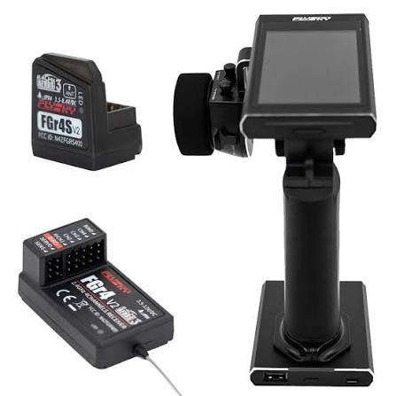
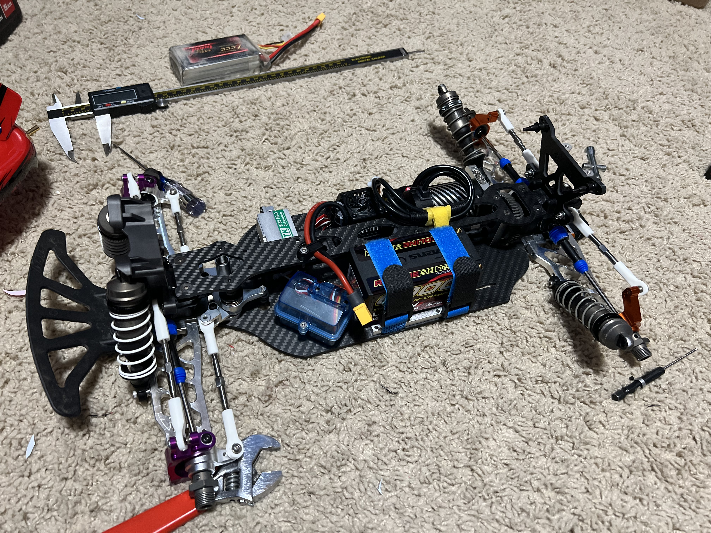

# Radio / Receiver Selection — FastAzJato4x4

> **Chosen: FlySky Noble NB4 transmitter + FlySky FGr4S V2 receiver, in hand.** A color-touchscreen 4-channel surface radio (AFHDS 3) with telemetry and model memory. The NB4 **ships with two receivers (FGR4 + the small FGR4S)**; running the **small FGR4S V2**. Paid **$140.91** (list $175.09). This is what's running the car, not a shortlist.

---

## Key Requirements

| Requirement | Type | Why |
|---|---|---|
| **Surface radio, wheel-style** | Must | It's an RC car; wheel + trigger ergonomics |
| **Pairs with the FGr4S V2 RX** | Must | The receiver on hand; the NB4 runs the FlySky FGr4-series RXs |
| **Telemetry** | May | Pack voltage / temp on the handset is handy at the track |
| **Model memory** | May | One handset across multiple cars |

---

## Comparison

> *Spec format: Type · Channels · Protocol · Receivers · Gyro · Telemetry · Model memory · Display · Battery · Price*

| Radio | Spec | Pros / Cons | Photo / Link |
|---|---|---|---|
| ⭐ **FlySky Noble NB4** (+ FGr4S V2 RX) — *in hand, running* | **Type:** Surface / wheel TX **Channels:** 4 **Protocol:** **AFHDS 3** **Receivers:** **ships with FGr4 + FGr4S**; running the small **FGr4S V2** **Gyro:** N/A (gyro-gain channel supported; no built-in gyro) **Telemetry:** Yes **Model memory:** Yes **Display:** Color touchscreen **Battery:** Built-in Li (verify cell) **Price:** **$140.91** (paid; list $175.09) | Pro: **Color-touchscreen, telemetry, model memory**, and it **comes with two receivers** (FGr4 + FGr4S). Running the small FGr4S V2. Good handset for the money  Con: 4 channels (plenty for a car). Some exact specs (battery cell, RX outputs) to verify off the units |  |

---

## RX box and how it's mounted

**The box is a knock-off clear blue Slash 4x4 LCG battery box**, about **$3 for a pair**, used as a receiver box rather than for a battery. Cheap, sealed enough to keep dust off the FGr4S, and the clear shell means the bind LED is readable without opening anything.

**The mounting is the good part.** The plan was to use the screw holes that originally take the front battery mount, the stopper that keeps a pack from sliding forward. **Losing that stopper is no loss anyway**, it is a pair of metal tubes and it looks tacky, so those holes were going spare regardless. What turned up while test fitting: **rotate the box and its holes line up with the battery stopper slots at an angle**. That angled position:

- **clears the bell crank perfectly**, no fouling through steering travel
- reuses existing chassis holes, so nothing new drilled
- looks deliberate rather than improvised, which is why it stayed

**Fixing, as built:** a **washer and nut inside the box**, with a **taper screw up from underneath the chassis**, so the head sits flush against the deck and there is nothing proud to catch. On top of that the box already had **VHB tape underneath**, so the adhesive and the screws are doing the job together rather than relying on either alone.

**It also saves weight while protecting the RX.** A dedicated receiver box is heavier than this, and the alternative of wrapping the receiver in foam and tape protects it less. A $3 shell that keeps dirt and moisture off the FGr4S, mounts on existing holes and adds almost nothing to the car is doing three jobs at once.

 <em>Clear blue RX box mounted at an angle in the front battery stopper slots, battery strapped centred alongside</em>

**Consequence for the battery:** the box occupies the battery side of the deck, so the pack has to sit centred and the space for it is fixed. That is what forces a **shorty**, and the reasoning lives in [`battery_analysis.md`](battery_analysis.md#chassis-layout-and-shortlist).

---

## Notes

- **Two receivers in the box:** the NB4 ships with the larger **FGr4** and the small **FGr4S**. Running the **small FGr4S V2** (fits the tight CF chassis better); the FGr4 is a spare. Confirm the exact output types (servo / SBUS-style) against the unit when wiring.
- **Gyro:** the NB4 supports assigning a gyro-gain channel if a steering gyro gets added later, but there's no gyro built into the handset or the FGr4S RX.
- A few spec cells are left to **verify off the actual hardware** (handset battery, RX outputs) rather than guess.
