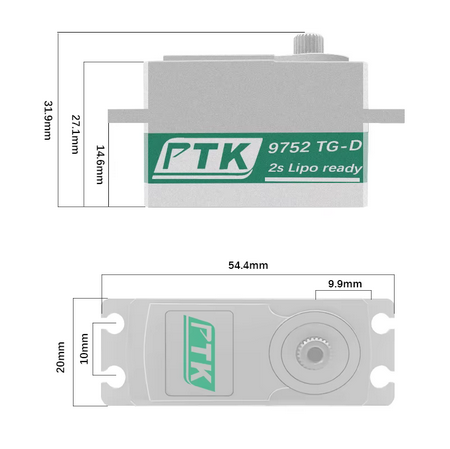
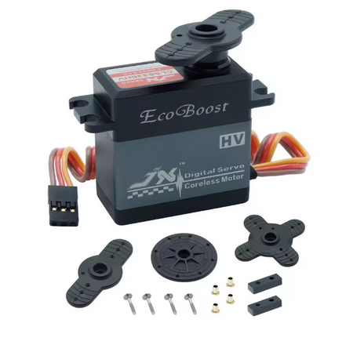
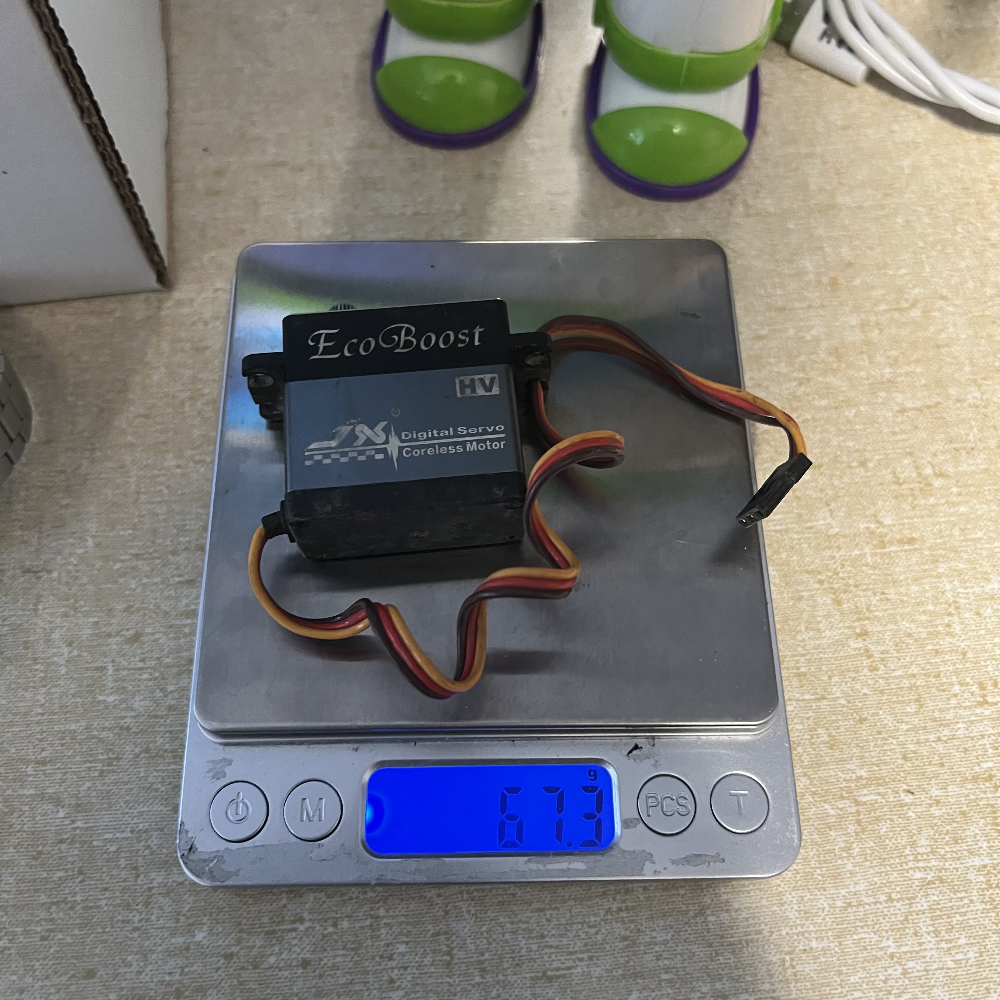

# Servo Selection — FastAzJato4x4

> **Chosen: PTK 9752TG-D Metal High-Speed Low-Profile Servo** — the **successor to the JX CLS series** the build ran previously. Already in hand from a previous build, $25 sunk; bulk-bought 8-pack at ~$19.65/ea on 2026-06-01 as spares ([`Deals/servos.md`](../../Deals/servos.md)). The JX servos (CLS6322HV / CLS6336HV) are the predecessor data points — kept in the comparison below for context, not as live candidates.

 <em>Chosen — PTK 9752TG-D low-profile metal-gear digital servo · body 42.2 × 20 × 27.1 mm (54.4 mm tab-to-tab, 31.9 mm with horn)</em>

---

## Table of Contents

- [Key Requirements](#key-requirements)
- [Servo Comparison](#servo-comparison)
- [Notes](#notes)

---

## Key Requirements

| Requirement | Type | Why |
|---|---|---|
| **Fits Slash 4x4 / Jato 4x4 servo cavity** | Must | Has to bolt into the CF chassis servo mount without modification |
| **Metal gear train** | Must | Plastic gears strip under hard steering inputs at 4S throttle |
| **High torque (≥ 20 kg-cm)** | Must | Drives the chosen aluminum bell crank under load without stalling |
| **High speed (≤ 0.10s / 60°)** | Must | Steering response has to keep up with chassis on quick direction changes |
| **High voltage (HV) capable** | May | Lets it run direct off the BEC at 7.4V for the best torque/speed numbers — most modern receivers/BECs are HV anyway |
| **Light** | May | Lighter total car mass = less kinetic energy in a crash = less likely to break; servo also sits high so grams up there hurt CG |

---

## Servo Comparison

> *Spec format: Type · Torque · Speed · Voltage · Gears · Case · Motor · Bearing · Refresh · Pulse width · Dead band · Neutral · Travel · Signal · Programmable · Profile · Tooth count · Size · Weight · Wire · Price*

| Servo | Spec | Pros / Cons | Photo / Link |
|---|---|---|---|
| ⭐ **PTK 9752TG-D** *(2S LiPo-ready)* | **Type:** Digital coreless metal-gear  **Torque:** 15 kg-cm @ 5.0V · 18 kg-cm @ 6.0V · 22 kg-cm @ 7.4V · 25 kg-cm @ 8.4V  **Speed:** 0.090 sec/60° @ 5.0V · 0.072 @ 6.0V · 0.060 @ 7.4V · 0.052 @ 8.4V  **Voltage:** 5.0V – 8.4V  **Gears:** Metal  **Case:** CNC metal  **Motor:** Coreless  **Bearing:** Double ball bearing  **Refresh:** 333 Hz  **Pulse width:** 500 – 2500 µs  **Dead band:** 2 µs  **Neutral:** N/A  **Travel:** 180° + (−) 10°  **Signal:** SR / SHR / SFR / SXR / SSR  **Programmable:** Yes  **Profile:** Low-profile (27 mm body)  **Tooth count:** N/A  **Size:** 42.2 × 20 × 27 mm  **Weight:** 60.2 g (measured, matches spec)  **Wire:** JR 300 mm  **Price:** ~$19.65/ea (bulk 8-pack); $25 single | Pro: **Proven on Mike's Jato 4x4 — faster and better steering response than the JX it replaced.** Already in hand, 8 spares bought at ~$19.65/ea. Well-matched to the chosen aluminum bell crank, low-profile fits the CF chassis cavity, **2S LiPo-ready (no step-down needed for the servo itself)**  Con: **High current draw — can brown out weak BECs (≤3A class).** Known marginal on the E-Revo 1.0's Castle Mamba X internal **3A BEC** at full lock under load. Pair with a stronger BEC (≥5A) or run an external/standalone BEC if pairing with a low-amp ESC |    <em>spec sheet · 60.2 g on scale · dimensions</em> |
| 🚫 ~~**JX Ecoboost CLS6336HV** — *wrong class (1/8 truggy / crawler)*~~ | **Type:** Digital coreless metal-gear  **Torque:** 27.8 kg-cm @ 6.6V · 35.6 kg-cm @ 7.4V · 36 kg-cm @ 8.4V  **Speed:** 0.14 sec/60° @ 6.6V · 0.11 @ 7.4V · 0.09 @ 8.4V  **Voltage:** ~4.8V – 8.4V  **Gears:** Metal (Taiwan-made aluminum, hard anodized)  **Case:** CNC metal cover + shell  **Motor:** Coreless  **Bearing:** 2BB (double ball)  **Refresh:** 330 Hz  **Pulse width:** N/A  **Dead band:** 1 µs  **Neutral:** 1520 µs  **Travel:** N/A  **Signal:** N/A  **Programmable:** N/A  **Profile:** Standard-height  **Tooth count:** 25  **Size:** 40.5 × 20.2 × 40 mm  **Weight:** 63 g (per spec)  **Wire:** JR 265 mm  **Price:** N/A (see [`Deals/servos.md`](../../Deals/servos.md)) | Pro: Big torque number — suited to **1/8 truggy / crawler-class** steering loads where 30+ kg-cm matters (the seller pitches it for RC4WD SCX10 and similar). **Empirically validated on Mike's Arrma Kraton 1/8 truggy — highly recommended for that class.**  Con: **Wrong tool for this build.** **Nearly 2× slower than the PTK or CLS6322HV at 7.4V** (~0.11 vs ~0.06 sec/60°) — that's a real, not "spec-margin", speed deficit. Torque the FastAzJato doesn't need traded for response time it absolutely does need. Pick is the PTK |  |
| ❌ ~~**JX CLS6322HV** (EcoBoost branding) — *predecessor, retired & out of stock*~~ | **Type:** Digital coreless metal-gear  **Torque:** 17.21 kg-cm @ 6.0V · 21.06 kg-cm @ 7.4V  **Speed:** 0.09 sec/60° @ 6.0V · 0.07 @ 7.4V  **Voltage:** ~4.8V – 7.4V (HV)  **Gears:** Metal  **Case:** N/A  **Motor:** Coreless  **Bearing:** 2BB (double ball)  **Refresh:** 330 Hz  **Pulse width:** N/A  **Dead band:** 1 µs  **Neutral:** 1520 µs  **Travel:** N/A  **Signal:** N/A  **Programmable:** N/A  **Profile:** Standard-height  **Tooth count:** N/A  **Size:** 55 × 20 × 40 mm  **Weight:** 67.3 g (measured) · 65 g (per spec)  **Wire:** JR 265 mm  **Price:** $17.13/ea in bulk (historical) | Pro: Cheapest seen historically — $17.13/ea in bulk, the standard the build group ran for years (16 acquired across 5 orders, see [`Deals/servos.md`](../../Deals/servos.md))  Con: **Superseded by the PTK 9752TG-D — retired & all 16 units used up.** Friends in the group still run their remaining ones, but no more orders are going in. ~17% slower than the PTK at 7.4V (0.07 vs 0.060 sec/60°), and 21 kg-cm is on the lower end for the aluminum bell crank + 4S steering load |  <em>67.3 g on scale</em> |

---

## Notes

- **Why low-profile matters (on the Slash/Jato 4x4):** the car is naturally **rear-biased** — the motor sits behind the rear axle line. A low-profile servo doesn't fight clearance; it frees up the space above and ahead of it so the **RX and ESC can move forward**, shifting weight off the rear for better front/rear distribution (or at minimum more layout flexibility). Standard-height servos still fit, they just lock the radio gear into a more rearward spot.
- **Why light matters:** lower total car mass = **less kinetic energy in a crash = less likely to break.** Servos sit high in the chassis cavity, so grams up there also hurt CG. Both effects point the same way.
- **Pricing context:** all three options are tracked in [`Deals/servos.md`](../../Deals/servos.md) with full order history. The PTK is the cheapest in-bulk; the JX CLS6336HV is the strongest dollar-per-kg if torque becomes the limit.
- **Skip the servo saver — modern servos handle it.** The OEM Traxxas servo saver is **weak by modern standards** and the chosen [aluminum bell crank](steering_bell_crank_analysis.md) eventually "welds" it into a fixed coupling anyway. The build group's empirical answer: **don't bother running one**. The JX/PTK servos take direct crash transmission and survive multi-year service lives — **the JX gears never stripped** across 16 units (failures were always electrical, not mechanical — see the failure-mode bullet). The "you need a servo saver to protect the gears" assumption was built around the weak metal-gear servos of years ago; modern coreless / metal-gear servos don't need the help.
- **JX waterproofing (anecdotal — with receipts):** the JX CLS6322HVs are **not rated waterproof**, but units in this build group have **taken full ocean / saltwater submersion multiple times and kept working**. The most-cited example: **the oldest-failed unit originally lived in the [Wltoys K939](../K939/README.md), which spent its early life on **beach / sand runs** where cousins and neighborhood kids took turns driving it. **The same servo ate 10+ saltwater dunks** across those sessions** — came back from each one, kept steering, then served years more on the E-Revo 1.0 before retiring. Call them "fish-tested" rather than IPX-rated — in practice they shrug off rain, puddles, mud, and the occasional saltwater dunk well enough that we treat them as effectively waterproof for daily basher use.
- **JX failure mode and longevity (why PTK is the successor):** the JX CLS6322HVs don't blow up — they **fail electrically** (pot / centering-circuit drift), not mechanically. **First unit was ordered 2023-06-28** (see [`Deals/servos.md`](../../Deals/servos.md)), **first retirement was yesterday — 2026-05-31** → call it **~2 years 11 months of daily-driver use** before the failure showed up. **Two of the 16 units have had to be retired** so far, in two distinct ways:
  1. **Goes limp — stops responding entirely** — sudden, not progressive. Outwardly the servo *looks* normal (feels right when you move the linkage by hand, no obvious binding), but it just stops transmitting torque. No holding position, no response to stick input — the car simply doesn't steer. *(Oldest unit failed this way 2026-05-31 — finished its life as the steering servo in the [E-Revo 1.0](../ERevo_1.0/README.md), but originally lived in the [Wltoys K939](../K939/README.md) where it survived **10+ ocean / saltwater dunks** before being moved. ~3 years across two cars, double-digit saltwater baths along the way.)*
  2. **Quivers at center under no load** — servo can't settle at neutral when there's no resistance on the output (wheels off the ground). Hunts back and forth, draws current continuously. **Practical impact: front wheels chatter mid-air on jumps → car becomes hard to control through the air** because the steering inputs are noise instead of held neutral. Wheels also quiver at rest. *(Retired from Mike's Jato 4x4. Notable: this unit took practically zero help from the servo saver — once it stuck itself, the saver had no give to absorb impacts, so it was eating crash loads basically direct. Lasted years anyway, did **very** well right up until failure.)*

  Both modes leave the car undrivable, and both are **electrical, not mechanical** — **the JX gears never stripped on any of the 16 units**. That's also why these failures aren't graceful: a stripped gear would let you limp home with the wheels still pointing roughly the right way; the limp/quiver electrical failures don't. That's the empirical reason the PTK 9752TG-D is the going-forward pick rather than reordering JX.
- **PTK is the successor — verdict pending:** the **PTK is objectively better on the spec sheet** (faster at 7.4V, similar torque, low-profile, 2S LiPo-ready, CNC metal case, programmable) **and** the build group has it running in **Mike's Jato 4x4** *and* the **[Wltoys 104001/104002 pair](../104001_104002/README.md)** with no complaints — better steering feel than the JX, no brownouts paired with the Fire Phoenix ESCs in those cars. **But the PTK is new to this build group; long-term reliability is unproven.** JX benchmark to beat: ~2 years 11 months to first failure. Track each PTK's in-service date and revisit this section the first time one drifts, strips, or browns out.
- **Bell crank cross-reference:** the chosen aluminum bell crank ([`steering_bell_crank_analysis.md`](steering_bell_crank_analysis.md)) does not need the strongest servo on the market — bell-crank stiffness only matters until the servo gets the wheels moving. The PTK's torque is enough headroom; jumping to the CLS6336HV's 36 kg-cm is upgrade-not-required territory.
- **BEC sizing for PTK:** the PTK 9752TG-D pulls a lot of current at peak. The **Castle Mamba X has only a 3A internal BEC**, which has browned out under full-lock steering load with this servo on the E-Revo 1.0. **Verify the ESC's BEC is ≥5A** (or add an external BEC) before running PTK on a new car. The FastAzJato4x4's chosen **Fire Phoenix XeRun 120A Enhanced** is **already empirically validated** with the PTK on the [Wltoys 104001/104002 pair](../104001_104002/README.md) — no brownouts observed. Confirms the FastAzJato electronics combo is good as planned.
