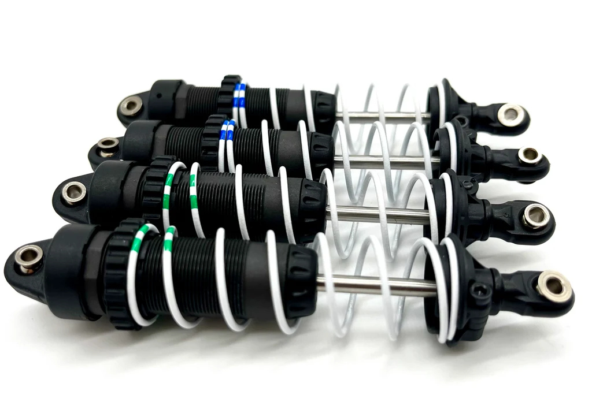
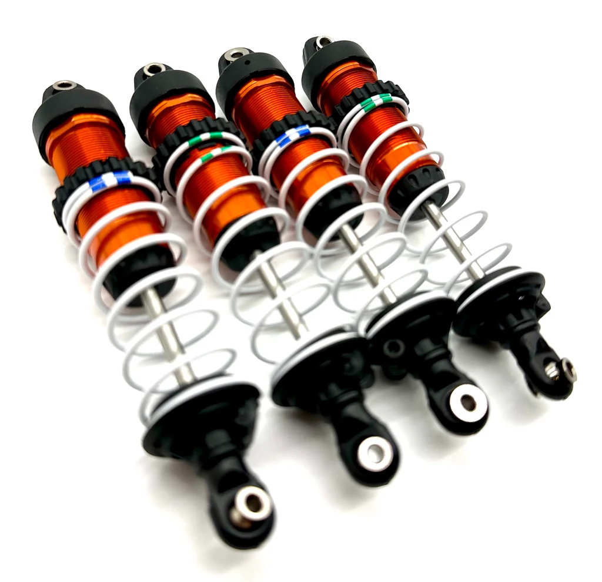
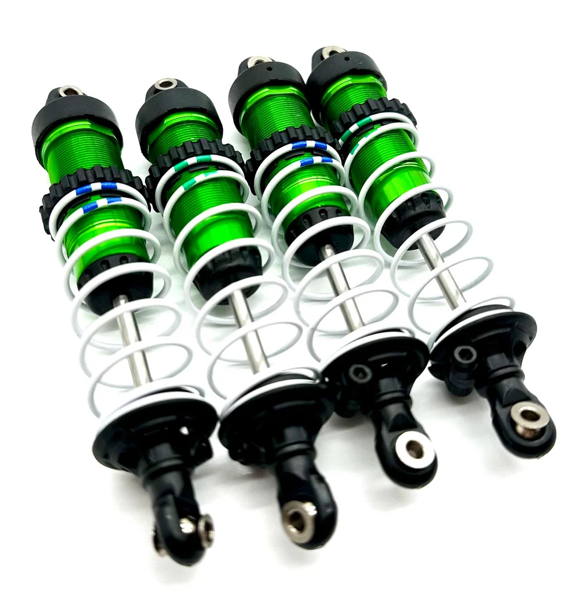
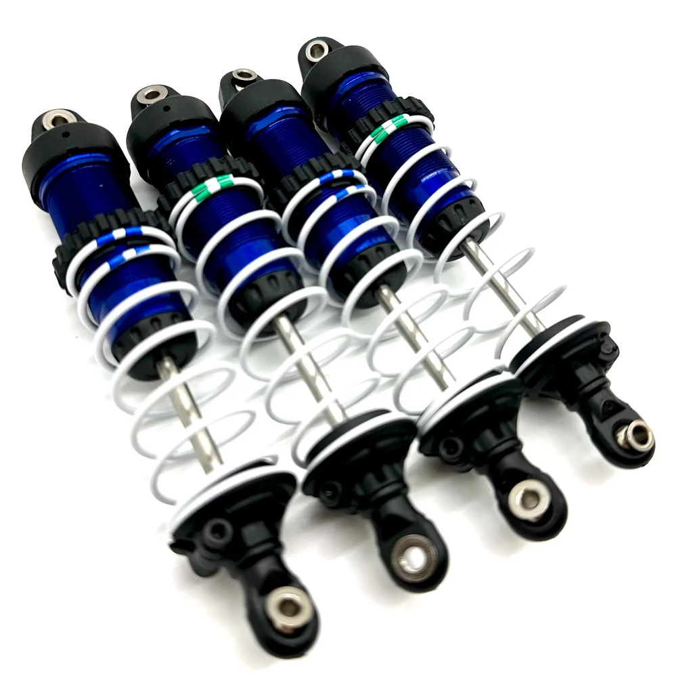
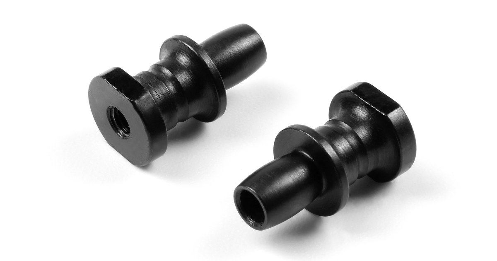

# Shock Selection — FastAzJato4x4

> **Chosen: Hot Bodies D8 metal big bore front + rear (HBS67296)**, the metal-bodied 97mm **16mm big-bore** shock. A **used set of 4 is already in hand** (buy-new ~$57.99, discontinued). The **HBS67296 (metal D8), Apache C1 (#107365), and Wltoys A929 (A929-14) are the same shock internally, a three-way tie at the top.** Plastic is what I'd generally run (cheaper, lighter, and plenty tough); I'm on the metal set only because I already own it and don't want to buy more shocks, and the metal body also shrugs off impacts that crack plastic. The plastic C1 / A929 stay as identical-internal backups. **Springs: white 59gf front, grey 52gf rear**, this car is **lighter than the K939**, so it wants the softer rear. The metal shocks mount on **HB HBS67410 standoffs, two pairs needed** (4 standoffs, 1 per shock; both purchased packs go on the car, none spare). See [shock standoffs](#shock-standoffs--mounting).
>
> **Current spec** (running):
> - **Springs:** **white 59gf (HB 67454, 76mm) front + gray 52gf (HB 67453, 76mm) rear**, same as K939 spec
> - **Pistons:** 1.4mm × 6 holes, front + rear
> - **Oil:** ✅ **50wt rear / 40wt front** (running, retested, supersedes the earlier 60wt rear / 45wt front call). **Heavier in the rear is backwards for this class and correct for this car**. The Slash layout hangs the motor near the back of the car, just ahead of the rear axle, so the rear carries more mass and needs more damping to control it. Most 1/10 4x4s of this size run the heavier oil up front; the Jato 4x4 wants it the other way round. Same tail-heavy bias that drives the [tower choices](shock_tower_analysis.md).
> - **Shock length:** 97 mm **shaft length** (Apache C1 / D8 front spec, this is shaft length, *not* eye-to-eye, which is [still TBD](#hot-bodies-big-bore-shock-spring-chart-full-lineup)); D8 rears optionally 112 mm if going the full mixed-length D8 setup
>
> **Traxxas Big Bore XX-Long (2662) is vetoed:** it was "big bore" years ago, but its **10mm bore** isn't by today's standards (vs the C1/D8's 16mm), a waste of money even at $26.95.
>
> **Fallback if you can't find big bores: the stock Jato 4x4 GTR XX-Long shocks (13mm bore) are just fine.** They come on the car and run the setup well. **Jenny's RC sells them used as factory-assembled sets of 4:** the **gray composite (plastic) 7462-GRAY** off the Jato 4x4 BL-2S (Traxxas 90154-4) is the cheap, sensible pick at **$22.97/set** (way under a D8 set), and the **aluminum 7462-ORNG / GRN / blue** off the Jato 4x4 VXL (90386-4) is the pricier metal version at **$67.97/set** (about the same as a used D8 set). The C1/D8 big bores are the upgrade for more plush, but if a big-bore set doesn't turn up, run the GTRs and don't sweat it.

  &nbsp; 
  <em>Chosen: Hot Bodies D8 metal big bore, the actual used set of 4 (in hand) · Backup: HPI Apache C1 plastic (same shock internally)</em>

---

## Table of Contents

- [Key Requirements](#key-requirements)
- [Shock Comparison](#shock-comparison) — body / brand options
- [Replacement Parts (shock bodies)](#replacement-parts-shock-bodies) — spare HB 67435 bodies
- [Shock Standoffs / Mounting](#shock-standoffs--mounting) — HB HBS67410, or force-fit hollow balls on the plastic shocks
- [Setup Spec (Springs / Pistons / Oil)](#setup-spec-springs--pistons--oil)
- [Plastic vs Metal Body Trade-off](#plastic-vs-metal-body-trade-off)
- [Notes](#notes)

---

## Key Requirements

| Requirement | Type | Why |
|---|---|---|
| **97mm big-bore class** | Must | Matches the FastAzJato4x4 ride height + arm geometry; smaller shocks don't have the travel |
| **Threaded body for adjustable preload** | Must | Setup tunability is the whole point of an aftermarket shock |
| **Standard pistons + shaft** | Must | Common spares + tunable pistons available off the shelf |
| **Rebuildable** | Must | Must come apart to service, but rebuild only when one leaks or breaks, no fixed schedule |
| **Reasonably priced** | May | Premium racing shocks cost more than the chosen motor, diminishing returns for offroad use |
| **Metal body** | May | Light enough plastic is acceptable; metal is the optimization for crash resistance |

---

## Shock Comparison

> *Spec format: Type · Bore · Length · Body material · Piston · Mounting · Part · Spring · Oil · Price*

| Shock | Spec | Pros / Cons | Photo / Link |
|---|---|---|---|
| ⭐ **Hot Bodies D8 metal big bore** (set of 4), *chosen; used set in hand* | **Type:** Big bore (set of 4)  **Bore:** 16mm  **Length:** 97mm  **Body material:** **Aluminum (metal)**  **Piston:** Incl. set (1.3 / 1.4 / 1.5mm)  **Mounting:** HB HBS67410 standoffs, **2 pairs (1 per shock)**  **Part:** **HBS67296**  **Spring:** White 59gf front / grey 52gf rear  **Oil:** 40wt F / 50wt R (retested)  **Price:** **$65.99 used** (set of 4, in hand); ~$57.99 buy-new (disc.) | Pro: **The chosen running shock, metal body shrugs off the impacts that crack plastic.** Scored used as a set of 4, already in hand, so going metal costs nothing extra here. Same 16mm big-bore internals as the Apache C1, all parts interchange  Con: ~15-20g/shock heavier than the plastic C1. **Discontinued new** (hard to buy another set), but that doesn't matter here since I already bought this one |  |
| 🥈 **HPI Racing Apache C1**, 97mm big bore, *backup; same internals, plastic body* | **Type:** Big bore  **Bore:** 16mm  **Length:** 97mm  **Body material:** Plastic  **Piston:** N/A  **Mounting:** N/A  **Part:** #107365 (MPN H107365)  **Spring:** N/A  **Oil:** N/A  **Price:** ~$20–30/pair | Pro: Light, threaded, rebuildable, well-tuned out of the box, **same internal design as the Hot Bodies D8**. Apache C1 = HPI's plastic version of the D8 shock  Con: Plastic body cracks under hard impacts (rocks, rollovers, rear-end hits) |  |
| 🥈 **Traxxas GTR XX-Long, gray composite** — *stock Jato 4x4 BL-2S shock (7462-GRAY); the cheap fine fallback* | **Type:** XX-Long  **Bore:** 13mm  **Length:** N/A  **Body material:** **Composite (plastic)**  **Piston:** N/A  **Mounting:** N/A  **Part:** **7462-GRAY** (off Traxxas 90154-4)  **Spring:** Incl. 7443 (0.762) + 7449 (1.004)  **Oil:** 30wt incl.  **Price:** **$22.97** used set of 4 at Jenny's RC, way under a D8 set | Pro: **These are the stock Jato 4x4 shocks, so if you can't find a big-bore set they're just fine, run them and don't sweat it.** **Plastic is what I'd generally run anyway.** Jenny's RC sells factory-assembled sets of 4 with springs, way cheaper than a D8 set. Native Traxxas fit  Con: **13mm bore vs the C1/D8's 16mm**, holds less oil, so the **C1/D8 are more plush**. That's the only reason the big bores are the upgrade, not the default. Springs are the stock GTR rates, not the 59/52gf setup spec |  |
| 🔵 **Traxxas GTR XX-Long, aluminum** — *stock Jato 4x4 VXL shock (7462-ORNG / GRN / blue); metal, pricier* | **Type:** XX-Long  **Bore:** 13mm  **Length:** N/A  **Body material:** **Aluminum (hard-anodized)**  **Piston:** N/A  **Mounting:** N/A  **Part:** **7462-ORNG / 7462-GRN** (orange / green / blue anodized, off Traxxas 90386-4)  **Spring:** Incl. 7443 (0.762) + 7449 (1.004)  **Oil:** 30wt incl.  **Price:** **$67.97** used set of 4 at Jenny's RC, ~3× the gray composite, about the same as a used D8 set | Pro: Metal-body version of the same stock GTR, PTFE bores, TiN shafts (no stiction), threaded collars. Also on the higher Slash 4x4 trims. In production, unlike the discontinued D8  Con: **Pricier than the gray composite for no real gain here**, since I'd run plastic anyway and already have the metal D8s for the metal-body build. Same 13mm bore as the gray, so no plushness edge over it | &nbsp;&nbsp; <em>orange · green · blue (same alloy VXL shock, 7462-ORNG / 7462-GRN)</em> |
| 🔵 **Wltoys A929** (Apache C1 knock-off), *budget backup* | **Type:** Big bore  **Bore:** 16mm  **Length:** 97mm  **Body material:** Plastic  **Piston:** N/A  **Mounting:** N/A  **Part:** A929-14  **Spring:** White springs incl.  **Oil:** N/A  **Price:** ~$15.99/set | Pro: **Knock-off of the Apache C1, the same 97mm big-bore plastic shock for a fraction of the price.** Parts interchange with the C1 / D8. Cheapest way into the backup shock  Con: **Ships from China, slow delivery.** Knock-off QC on paper. **Horror story: some ship with the shock caps super-glued shut**, soak in **acetone** to free them for rebuilds. **Would happily run these, but availability is unproven**, no order placed yet |  |
| 🔵 **Losi 8IGHT shocks** (8B/8T) | **Type:** Big bore (set of 4)  **Bore:** Big bore  **Length:** N/A  **Body material:** Aluminum  **Piston:** N/A  **Mounting:** N/A  **Part:** LOSA5417  **Spring:** N/A  **Oil:** N/A  **Price:** Pricey, unobtanium | Pro: 1/8-class big-bore option, community-confirmed on Slash 4x4 (RCU). **Two ways to fit:** (1) full LOSA5417 set with the **original Slash 4x4 tower** (the fronts are slightly shorter), or (2) **buy two rears and run rears front + back with the Jato towers** (rear tower height is the same across all rear-tower variants)  Con: **LOSA5417 is unobtanium right now**, discontinued / very hard to find. Pricey; metal-body weight |  |
| ❌ ~~**Traxxas Big Bore XX-Long**~~ | **Type:** XX-Long  **Bore:** 10mm  **Length:** N/A  **Body material:** Aluminum (PTFE hard-anodized)  **Piston:** N/A  **Mounting:** N/A  **Part:** 2662  **Spring:** N/A  **Oil:** N/A  **Price:** $26.95/pair | Pro: Classic shock, aluminum PTFE body, TiN shafts, native Traxxas fit, cheap  Con: **Waste of money.** Was "big bore" back in the day, but **10mm is not big bore by modern standards**, smaller than the GTR (13mm) and well under the C1/D8 (16mm). For similar money the Apache C1 is far more plush |  |

### Replacement Parts (shock bodies)

Spares to keep on hand for when an Apache C1 shock body gets destroyed in a crash. Worth stashing one set so a cracked body doesn't sideline the car.

| Part | Spec | Fits | Photo |
|---|---|---|---|
| **Hot Bodies 67435**, Big Bore shock body set | Threaded **aluminum** bodies, **2 pcs** | Apache C1 / HB D8 big-bore shocks |  |
| **HPI 67515**, Big Bore Shock Maintenance Set | Rebuild kit: X-rings, silicone o-rings, bladders + caps, seal spacers | Apache C1 / HB D8 big-bore shocks |  |
| **Hot Bodies 67437**, Big Bore Shock Bottom Cap | O-ring sealed threaded **bottom caps, 2-pack** (Vorza / D8S big bore), **pink anodized** | Apache C1 / HB D8 big-bore shocks |  |

> **Bonus:** because the 67435 bodies are aluminum, replacing a cracked plastic Apache C1 body with these effectively does the [metal-body upgrade](#plastic-vs-metal-body-trade-off) one shock at a time, no need to buy whole D8s.

### Shock Standoffs / Mounting

The standoff is the pivot post the shock eyelet rides on where the shock bolts to the tower and arm.

| Part | Spec | Fits | Photo |
|---|---|---|---|
| ⭐ **HB Racing Shock Standoff (2)**, **HBS67410** (= **HPI Vorza Flux 67410**), ✅ **purchased 2026-08-16** ($3.99/pair, AMain) | Molded shock standoffs, 2 per pack. **2 pairs = 4 standoffs (1 per shock)**, they mount the larger D8 shocks on the CF towers | Hot Bodies D8 + Apache C1 big-bore; CF towers |  |
| 🔵 **HPI Shock Stand Off (2)**, **HPI160185** — *direct replacement, pricier* | Different part # from the HBS67410 but a **direct replacement** (interchangeable), 2 per pack | Same big-bore shocks / CF towers |  $8.49 |

> **Plastic (HPI Apache C1) alternative, free:** on the plastic HPI shocks you can skip the HB standoff and **force a Traxxas hollow ball straight into the shock eyelet**, the same [hollow balls used in the tie rod ends](tie_rod_analysis.md#pivot-balls). It press-fits and holds; tested, it works. So HBS67410 is the tidy option for the metal D8 path, while the plastic path can reuse the hollow balls already on hand.

---

## Setup Spec (Springs / Pistons / Oil)

This is the target tuning, based on the K939 build, but the FastAzJato4x4 is **lighter than the K939**, so it wants the **softer rear** (the grey 52gf) for grip and compliance under less weight.

| Position | Spring | Piston | Oil |
|---|---|---|---|
| **Front** | **White 59gf** (Hot Bodies #67454, 76mm, stock Apache C1 / D8) | **1.4mm × 6 holes** | **40wt** ✅ retested, runs better than 45wt |
| **Rear** | **Grey 52gf** (Hot Bodies #67453, 76mm, soft for bump compliance) | **1.4mm × 6 holes** | **50wt** ✅ retested, runs better than 60wt |

**Why this setup:**
- **White 59gf front + grey 52gf rear** = stock Apache C1 / D8 spec, K939-tested. The softer rear gives more bump compliance and rear grip, and this car is **lighter than the K939**, so the lighter rear end wants the softer spring, not a stiffer one
- **Spring sourcing:** the HPI Apache C1 and Hot Bodies D8 both ship stock with **white** springs. On real **D8 buggy take-offs** you'll typically find a **grey + white combo**, which is exactly this front (white) / rear (grey) pairing, so used take-off springs are a cheap, easy source
- 1.4mm × 6 holes = mid-range damping, good general-purpose piston. Tighter holes (1.2-1.3mm) increase damping for smoother tracks; bigger holes (1.5-1.6mm) loosen damping for whoops
- **Retested: 40wt front / 50wt rear runs better** than the earlier 45wt front / 60wt rear call. That earlier note reasoned 60wt rear because 50wt "felt too floaty". A later retest reversed that; 50wt rear is now the confirmed pick, paired with a lighter 40wt front (down from 45wt). Rear still the heavier of the two, controlling squat under power and rebound from jumps
- **50wt rear is the sweet spot, not just a data point.** Go heavier and the car starts to bounce (rear too stiff, kicks back instead of absorbing). Go lighter and it **donkey-kicks** (rear end kicks up under braking/bumps, too soft to control the motion). 50wt is bracketed by both failure modes on either side
- **Front is 40wt, and 37.5wt is the open question.** 40 feels a touch stiff up front, and 37.5wt is the obvious next step down, but I haven't run it yet. The argument for leaving it stiff: a softer front dives further on landing, and the front skid plate catching the dirt is what starts a cartwheel ([`bumper_analysis.md`](bumper_analysis.md#notes)). The whole minimal-bumper choice is built around not digging in, so a slightly over-stiff front may be doing the same job. Test 37.5wt before committing to it.
- **Why the rear runs heavier than the front at all.** That's backwards from the usual buggy split (heavier front, lighter rear), but the Jato hangs its motor off the back, so even with a 1/10 motor it sits much more tail-heavy than a standard 1/8 buggy. The rear carries more weight, so it wants the heavier oil.

### Hot Bodies Big Bore Shock Spring chart (full lineup)

All HB Big Bore springs sold as a pair. The chosen pair is bolded. **Shorter springs (60mm)** suit shorter shock bodies / tighter packaging; **76mm** is the most common length for 97mm-eye-to-eye Apache C1 / D8 fronts.

| Part # | Color | Length | Rate | Sold as |
|---|---|---|---|---|
| HB 67446 | Gray | 60 mm | 74 gf | pair |
| HB 67448 | Blue | 60 mm | 89 gf | pair |
| HB 67449 | Orange | 60 mm | 98 gf | pair |
| HB 67450 | Green | 68 mm | 59 gf | pair |
| HB 67451 | Yellow | 68 mm | 68 gf | pair |
| HB 67452 | Red | 68 mm | 81 gf | pair |
| **HB 67453** | **Gray** | **76 mm** | **52 gf** | **pair, chosen rear** |
| **HB 67454** | **White** | **76 mm** | **59 gf** | **pair, chosen front** |
| HB 67455 | Blue | 76 mm | 63 gf | pair |
| HB 67456 | Orange | 76 mm | 74 gf | pair |

> **Shock length reference**: Apache C1 / D8 fronts are spec'd as **97 mm (shaft length)**. Hot Bodies D8 rears are an optional **112 mm** (HBS67298) if you want longer rear droop / travel, note the longer rear shock body changes which spring length fits cleanly.
>
> **What "97mm" / "112mm" actually means, it's the shaft length, not eye-to-eye.** These numbers refer to the **shock shaft length**, *not* the overall pin-to-pin / eye-to-eye length. **The eye-to-eye length is still TBD**, measure an actual shock with a caliper to get it. Confirm the real installed length before ordering any aftermarket parts (springs, shafts, bodies) that depend on it.

### Traxxas GTR Spring chart (for the stock GTR fallback)

If you run the [stock GTR XX-Long shocks](#shock-comparison) instead of the big bores, these are the Traxxas springs. All **$5.00/pair**. **The XX-Long springs fit the stock Jato 4x4 GTR shocks**; the Long ones are for the shorter GTR "Long" body and are listed for reference. The two the shocks ship with are bolded.

| Part # | Stripe | Body | Rate | Sold as |
|---|---|---|---|---|
| 7440 | Orange | Long | 0.623 | pair |
| 7441 | Green | Long | 0.653 | pair |
| 7444 | Black | Long | 0.767 | pair |
| 7445 | Pink | Long | 0.810 | pair |
| 7448 | Blue | Long | 0.892 | pair |
| 7442 | Orange | **XX-Long** | 0.711 | pair |
| **7443** | **Green** | **XX-Long** | **0.762** | **pair (ships on the shocks)** |
| 7446 | Black | XX-Long | 0.874 | pair |
| 7447 | Pink | XX-Long | 0.884 | pair |
| **7449** | **Blue** | **XX-Long** | **1.004** | **pair (ships on the shocks)** |

> **Closest GTR springs to the chosen HB setup, approximate.** HB rates its big-bore springs in **gf** and Traxxas rates GTR springs on its **own scale**, and the two are different bores/lengths, so there is **no exact 1:1, don't treat the numbers as a conversion.** Going by softest-to-stiffest position in each lineup, the nearest **XX-Long** GTR springs to the chosen **white 59gf front / grey 52gf rear** (softer rear) are roughly **7443 green (0.762) front** and **7442 orange (0.711, the softest XX-Long) rear**. The shocks already ship with the 7443 green, so you'd just add a pair of **7442 orange** for the softer rear. Confirm by feel.

---

## Plastic vs Metal Body Trade-off

The Apache C1 (plastic) and Hot Bodies D8 (metal) are **the same shock internally**, same shaft, same piston interface, same internal volume, same external dimensions. The body material is the only meaningful difference.

| | Apache C1 (plastic) | D8 (metal) |
|---|---|---|
| Weight (each) | ~45-50g | ~60-65g |
| Impact resistance | Cracks under hard hits on body | **Bulletproof, never seen a metal body dent *or* crack** on any metal shock |
| Repairability after impact | Replace whole body | N/A, they just keep going |
| Price (pair) | $20-30 | $58 new (disc.), $30-80 used |
| Heat (sustained running) | Plastic insulates, oil stays hotter, fades faster | Aluminum sheds heat, more consistent damping over a long pack |
| Handling impact of weight | Lighter unsprung mass = better bump response | 4×15-20g = ~80g added across all corners, small but measurable |

**Take:** going metal from the start on this build, the **Hot Bodies D8 set is already in hand** (used), so the metal body's crash resistance costs nothing extra here. The plastic Apache C1 stays as the identical-internals backup. (On a build without a metal set already owned, the call would flip: start plastic, upgrade only once a body cracks, no point pre-paying the weight + cost penalty otherwise.)

---

## Notes

- **One shock, three flavors, and all parts interchange.** The genuine **Hot Bodies D8 (HBS67296)**, the **HPI Apache C1 (107365)**, and the **Wltoys A929 knock-off** are the same 97mm big-bore shock. Bodies, shafts, pistons, springs, caps, and boots **swap freely between Apache C1 and D8**, so you can rebuild or upgrade one piece at a time (e.g. drop a metal [67435 body](#replacement-parts-shock-bodies) into a plastic Apache C1). If you find unlabeled "big bore buddy shocks" with no size listed, they're most likely these, run them front and rear.
- **Losi 8IGHT (LOSA5417) fitment, two ways:** the full set has **slightly shorter fronts**, so to run the whole set you need the **original Slash 4x4 tower**. The simpler path is to **buy two of the rear shocks and run rears at both ends with the Jato towers**, the **rear tower height is the same across all rear-tower variants**, so any rear tower mounts them at the same height. Note LOSA5417 is currently unobtanium.
- **"XXL" / "XX-Long" = long travel, not big bore.** The XX-Long designation refers to the shock's **travel / length** (longer shaft + body), which is independent of bore diameter. A shock can be XX-Long but small-bore, the GTR (13mm) and 2662 (10mm) both are. Don't read "XX-Long" as "big bore."
- **Bore size is why the C1/D8 win over the GTR:** the Apache C1 / D8 are **16mm bore**, the Traxxas GTR XX-Long is **13mm**. The bigger bore holds more oil, which makes the C1/D8 **significantly more plush and consistent**, the GTR is a good, in-production aluminum shock, but it can't match the big-bore damping. The GTR's edge is availability (the D8 is discontinued) and a PTFE/TiN-slick, in-stock OEM option.
- The K939 build uses Apache C1 (plastic) and has not had a body-cracking problem in ~~years~~ many packs, the FastAzJato4x4 *might* be fine on plastic too. The trigger to swap to metal D8 would be **first cracked body**, not pre-emptive optimization.
- **Shock tower geometry interacts with shock survival**, see the [aero analysis cascade](aero_analysis.md#shock-tower-compatibility-cascade). The "shocks at the back of the car" geometry from the OEM Jato wing mount + #9034 stock tower is the root cause of past shock body damage. **The fix on this build is the special combo: a Slash 4x4 rear tower (old *or* new version) + the metal plate + the OEM Jato 4x4 wing mount**, it corrects the geometry so the plastic shocks survive, which is cheaper insurance than upgrading to metal bodies (or the STRC backflash kit).
- **Cross-brand oil chart lives in the E-Revo file.** "wt" isn't standardized between brands, see the [shock-oil supertable](../ERevo_1.0/shock_analysis.md#shock-oil-supertable--wt--cst-across-brands-up-to-5000-cst) for published wt ↔ cSt for Associated and TLR. Relevant here: **37.5wt is 463 cSt (Associated) / 468 cSt (TLR)**, so the front bottle is brand-agnostic, but at **50wt the brands split**, Associated 640 cSt vs TLR 710 cSt, nearly a full step apart. Match the brand on the rear or note which one is in the shocks.
- **Oil weight is climate-dependent**, silicone shock oil thickens in cold weather. The 40wt front / 50wt rear target assumes mild conditions; bump down 5wt per side if running in cold.
- **Maintenance: run them till something breaks or leaks**, no scheduled rebuild interval. When a shock starts leaking or a seal/o-ring fails, rebuild *that* shock then. Otherwise leave them alone.
- **Shock boots ("condoms"), recommended, not required.** The rubber boots that sleeve the shaft keep grit off the shaft and seal, so **when installed properly the seal stays nicer and lasts longer**. Totally fine to run without them, take it or leave it.
